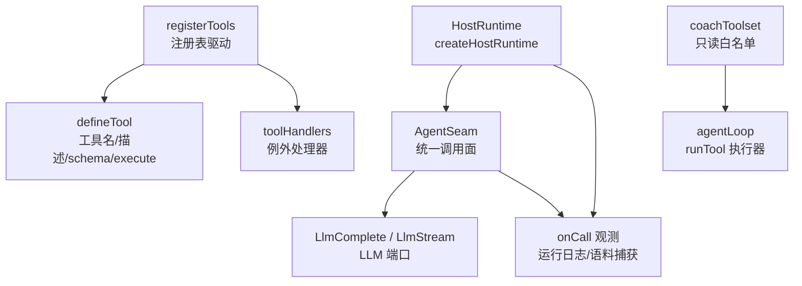
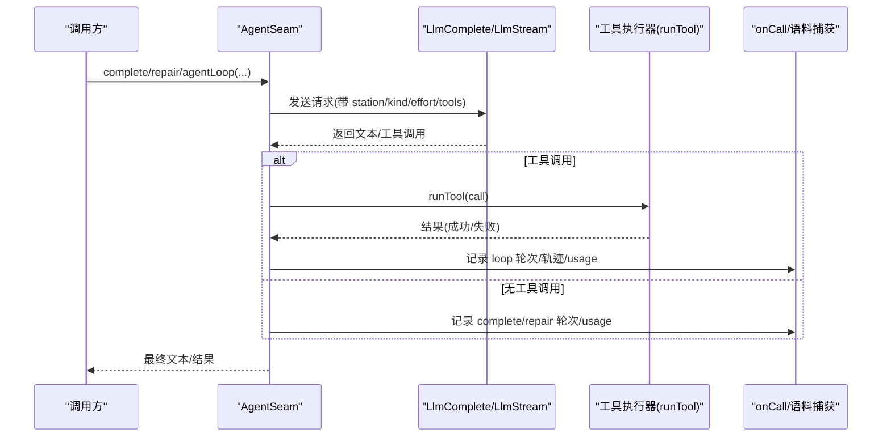
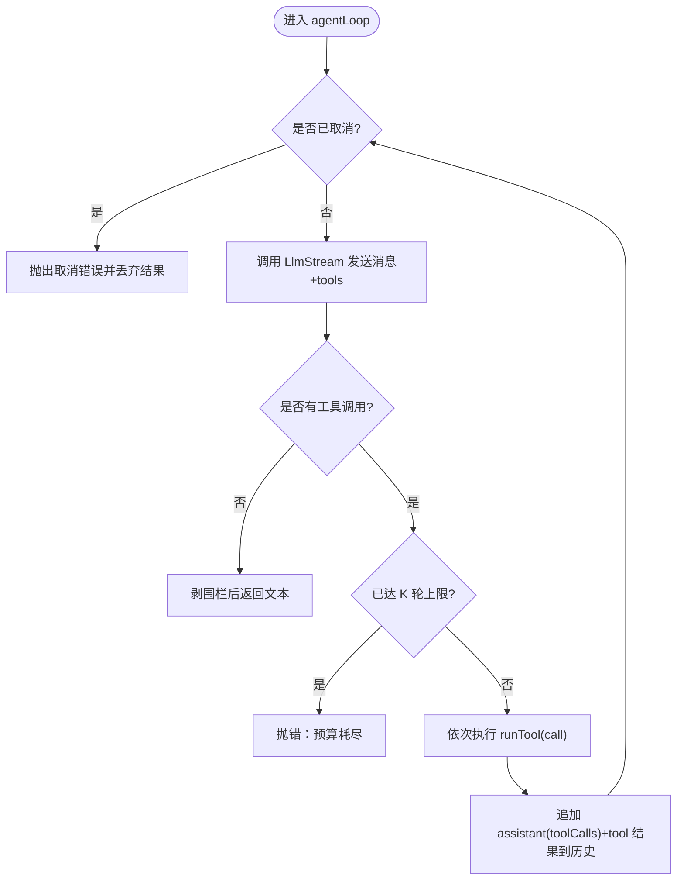
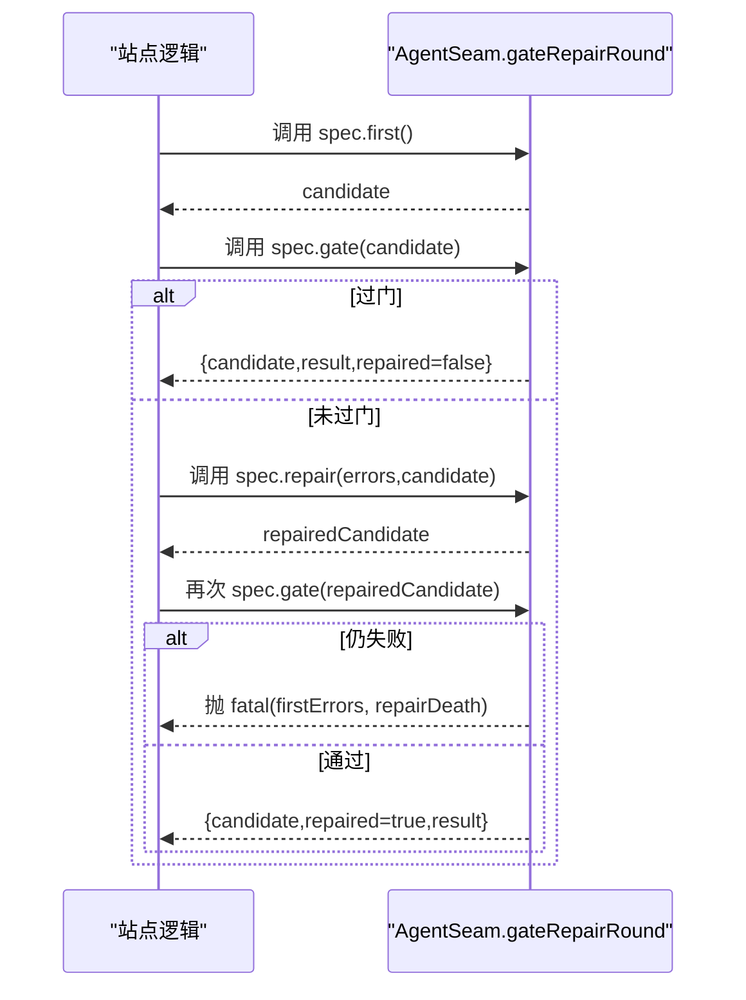
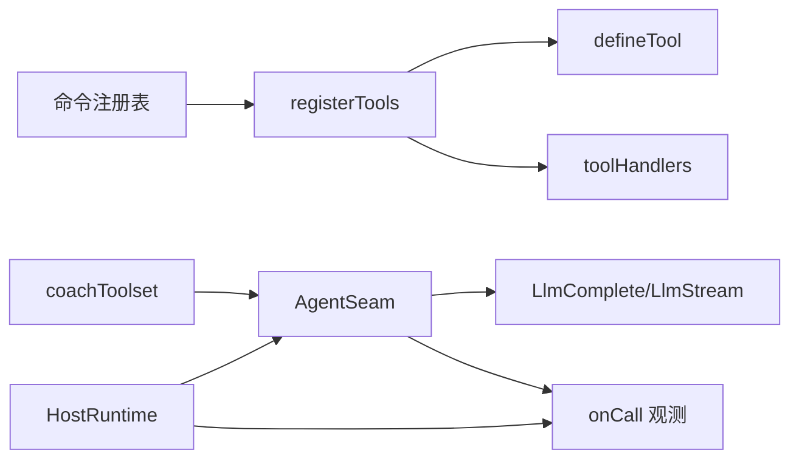

# 工具注册机制

<cite>
**本文引用的文件**
- [src/engine/agent.ts](file://src/engine/agent.ts)
- [src/host/tools.ts](file://src/host/tools.ts)
- [src/host/tool-handlers.ts](file://src/host/tool-handlers.ts)
- [src/engine/coach-tools.ts](file://src/engine/coach-tools.ts)
- [src/host/runtime.ts](file://src/host/runtime.ts)
- [src/engine/llm.ts](file://src/engine/llm.ts)
- [tests/agent-seam.test.ts](file://tests/agent-seam.test.ts)
- [tests/README.md](file://tests/README.md)
</cite>

## 目录
1. [简介](#简介)
2. [项目结构](#项目结构)
3. [核心组件](#核心组件)
4. [架构总览](#架构总览)
5. [详细组件分析](#详细组件分析)
6. [依赖关系分析](#依赖关系分析)
7. [性能与监控](#性能与监控)
8. [故障排查指南](#故障排查指南)
9. [结论](#结论)
10. [附录：完整示例与最佳实践](#附录完整示例与最佳实践)

## 简介
本文件系统性说明“工具注册机制”与 AgentSeam 统一调用面，覆盖三种调用模式（complete、repair、agentLoop）、工具白名单与只读回路、K≤6 轮预算限制与取消检查、门错修复轮 GateRepairSpec 的 four-stage 流程、参数校验与错误处理、以及性能监控与调试技巧。目标是让读者在不深入源码的情况下也能正确设计、注册和调试工具。

## 项目结构
围绕工具注册与调用，关键代码分布在以下位置：
- 统一 agent 缝与调用模式：src/engine/agent.ts
- 宿主工具注册表驱动与例外处理器：src/host/tools.ts、src/host/tool-handlers.ts
- 教练只读工具白名单与执行器：src/engine/coach-tools.ts
- 运行时装配与 onCall 观测注入：src/host/runtime.ts
- LLM 端口类型与工具规格定义：src/engine/llm.ts
- 行为验证与回归用例：tests/agent-seam.test.ts、tests/README.md



图示来源
- [src/engine/agent.ts:85-221](file://src/engine/agent.ts#L85-L221)
- [src/host/tools.ts:101-125](file://src/host/tools.ts#L101-L125)
- [src/host/tool-handlers.ts:23-36](file://src/host/tool-handlers.ts#L23-L36)
- [src/engine/coach-tools.ts:235-304](file://src/engine/coach-tools.ts#L235-L304)
- [src/host/runtime.ts:138-192](file://src/host/runtime.ts#L138-L192)

章节来源
- [src/engine/agent.ts:1-227](file://src/engine/agent.ts#L1-L227)
- [src/host/tools.ts:1-126](file://src/host/tools.ts#L1-L126)
- [src/host/tool-handlers.ts:1-36](file://src/host/tool-handlers.ts#L1-L36)
- [src/engine/coach-tools.ts:1-305](file://src/engine/coach-tools.ts#L1-L305)
- [src/host/runtime.ts:1-200](file://src/host/runtime.ts#L1-L200)
- [src/engine/llm.ts:26-56](file://src/engine/llm.ts#L26-L56)
- [tests/agent-seam.test.ts:1-302](file://tests/agent-seam.test.ts#L1-L302)
- [tests/README.md:134-142](file://tests/README.md#L134-L142)

## 核心组件
- AgentSeam：统一调用面，封装 complete、repair、gateRepairRound、agentLoop；负责后处理（stripFences）、语义档贯通、调用观测、预算与取消控制。
- registerTools：从命令注册表生成工具，名称/描述/schema 由声明驱动，execute 走引擎入口或例外 handler。
- toolHandlers：无法走通用生成路径的工具（形状需加工/实参需换算等）在此集中实现。
- coachToolset：教练只读工具白名单（七件），提供 tools 规格与 runTool 执行器，零写侧、零队列触点。
- HostRuntime.createHostRuntime：装配 AgentSeam，注入 LlmComplete/LlmStream 与 onCall 观测，落地运行日志与语料捕获。

章节来源
- [src/engine/agent.ts:85-221](file://src/engine/agent.ts#L85-L221)
- [src/host/tools.ts:101-125](file://src/host/tools.ts#L101-L125)
- [src/host/tool-handlers.ts:23-36](file://src/host/tool-handlers.ts#L23-L36)
- [src/engine/coach-tools.ts:235-304](file://src/engine/coach-tools.ts#L235-L304)
- [src/host/runtime.ts:138-192](file://src/host/runtime.ts#L138-L192)

## 架构总览
AgentSeam 是应用层对 LLM 的唯一调用面，屏蔽了单发补全与有界工具回路的差异，并统一接入观测与修复轮。宿主通过 createHostRuntime 注入 LLM 适配器与 onCall 回调，工具注册表驱动 defineTool 将命令暴露为可被模型调用的工具。



图示来源
- [src/engine/agent.ts:94-200](file://src/engine/agent.ts#L94-L200)
- [src/host/runtime.ts:170-182](file://src/host/runtime.ts#L170-L182)

## 详细组件分析

### AgentSeam：三种调用模式与差异
- complete()：单发补全，自动剥围栏、透传 effort、记录观测。适用于一次性生成任务。
- repair()：与 complete 同传输，但 mode=repair，用于门错修复轮回灌重产。
- agentLoop()：有界工具回路，按 K≤6 轮预算封顶，逐轮把工具结果回灌继续，直到模型不再请求工具为止；支持 isCancelled 取消传导。



图示来源
- [src/engine/agent.ts:128-186](file://src/engine/agent.ts#L128-L186)

章节来源
- [src/engine/agent.ts:94-186](file://src/engine/agent.ts#L94-L186)
- [tests/agent-seam.test.ts:164-235](file://tests/agent-seam.test.ts#L164-L235)

### 工具白名单与只读回路
- 白名单来源：coachToolSpecs() 声明七件只读工具（graph_view/node_card/concept_registry/behavior_digest/bank_overview/compass_read/endpoint_anchor）。
- 执行器：coachToolExecutor() 仅分发只读视图，白名单外调用直接报错（isError 回灌给模型可见）。
- 安全边界：不持写工具、不触队列、不回引 growth-subsystem，避免递归自激。

```mermaid
classDiagram
class CoachToolSpecs {
+coachToolSpecs() LlmToolSpec[]
}
class CoachToolExecutor {
+coachToolExecutor(deps,c,providers) (call)=>Promise<string>
}
class AgentSeam {
+agentLoop(req) Promise<{text,toolRounds,trajectory}>
}
CoachToolSpecs --> AgentSeam : "作为 tools 传入"
CoachToolExecutor --> AgentSeam : "作为 runTool 传入"
```

图示来源
- [src/engine/coach-tools.ts:235-304](file://src/engine/coach-tools.ts#L235-L304)
- [src/engine/agent.ts:128-186](file://src/engine/agent.ts#L128-L186)

章节来源
- [src/engine/coach-tools.ts:30-35](file://src/engine/coach-tools.ts#L30-L35)
- [src/engine/coach-tools.ts:251-297](file://src/engine/coach-tools.ts#L251-L297)
- [src/engine/agent.ts:128-186](file://src/engine/agent.ts#L128-L186)

### 门错修复轮 GateRepairSpec：four-stage 流程
- first()：产出候选。
- gate()：校验候选，errors 为空即过门；若 errors 非空则触发 repair。
- repair()：以门错误原文与被拒候选原文回灌重产一次（恰一次）。
- fatal()：两轮仍败或修复轮自身失败时，携带两轮死因抛出站点级错误。



图示来源
- [src/engine/agent.ts:103-120](file://src/engine/agent.ts#L103-L120)
- [tests/agent-seam.test.ts:90-162](file://tests/agent-seam.test.ts#L90-L162)

章节来源
- [src/engine/agent.ts:65-83](file://src/engine/agent.ts#L65-L83)
- [src/engine/agent.ts:103-120](file://src/engine/agent.ts#L103-L120)
- [tests/agent-seam.test.ts:90-162](file://tests/agent-seam.test.ts#L90-L162)

### 参数验证、错误处理与取消检查
- 参数验证：
  - 工具 schema 由注册表 args 经 sdkParameters 投影，SDK 在 execute 前完成必填与类型校验。
  - 教练工具参数 JSON 解析失败会抛错（fail loud），确保模型拿到明确错误。
- 错误处理：
  - agentLoop 中 runTool 抛错会被包装为 isError=true 的结果回灌给模型，便于模型自我纠正。
  - 预算耗尽（K≤6）与 LlmStream 缺位均 fail loud，防止静默失败。
- 取消检查：
  - 每轮底层调用前与每次工具执行后检查 isCancelled()，一旦为真立即抛错中止，已产结果丢弃。

章节来源
- [src/host/tools.ts:78-125](file://src/host/tools.ts#L78-L125)
- [src/engine/coach-tools.ts:256-265](file://src/engine/coach-tools.ts#L256-L265)
- [src/engine/agent.ts:141-186](file://src/engine/agent.ts#L141-L186)
- [tests/agent-seam.test.ts:200-275](file://tests/agent-seam.test.ts#L200-L275)

### 性能与监控机制
- 观测面 onCall：每轮调用记录 station/mode/effort/callNo/promptChars/replyChars/durationMs/usage（token 计量），注入侧可接 console/运行日志/语料捕获。
- 语料捕获：缝出口落盘，包含 frontmatter、渲染提示词、原始输出、工具调用段（arguments 原文保留），便于离线审计与回放。
- 成本纪律：agentLoop 预算封顶防自激；语义档 fast/deep 由调用点声明，适配层翻译部署档位；temperature 默认不传，旋钮留给显式消费方。

章节来源
- [src/engine/agent.ts:42-56](file://src/engine/agent.ts#L42-L56)
- [src/engine/agent.ts:188-220](file://src/engine/agent.ts#L188-L220)
- [src/host/runtime.ts:170-182](file://src/host/runtime.ts#L170-L182)
- [tests/README.md:74-87](file://tests/README.md#L74-L87)

## 依赖关系分析
- AgentSeam 依赖 LlmComplete/LlmStream 纯类型接口，解耦具体 provider。
- registerTools 依赖命令注册表（COMMAND_LIST）与 runtime.resolveEngineEntry，将 engine.bind 映射为 execute。
- toolHandlers 提供例外处理器，与 registerTools 互补，保证所有 agent 通道均有实现。
- coachToolset 依赖结构化注入的只读视图能力，零环约束（不 import growth-subsystem）。



图示来源
- [src/host/tools.ts:101-125](file://src/host/tools.ts#L101-L125)
- [src/host/tool-handlers.ts:23-36](file://src/host/tool-handlers.ts#L23-L36)
- [src/engine/agent.ts:85-221](file://src/engine/agent.ts#L85-L221)
- [src/host/runtime.ts:138-192](file://src/host/runtime.ts#L138-L192)

章节来源
- [src/host/tools.ts:1-126](file://src/host/tools.ts#L1-L126)
- [src/host/tool-handlers.ts:1-36](file://src/host/tool-handlers.ts#L1-L36)
- [src/engine/agent.ts:1-227](file://src/engine/agent.ts#L1-L227)
- [src/host/runtime.ts:1-200](file://src/host/runtime.ts#L1-L200)

## 性能与监控
- 预算与终止：agentLoop 强制 K≤6 轮，避免无限循环；每轮调用前后检查取消旗标，及时止损。
- 观测指标：onCall 记录耗时、字符数、token 用量；语料捕获提供可回放证据链。
- 调试建议：
  - 使用 onCall 观察各站·模式的调用序号与耗时，定位慢调用。
  - 结合语料捕获中的「工具调用」段，核对 arguments 原文与模型意图。
  - 在测试中使用 fakeComplete/fakeStream 脚本化应答，断言调用序列与轨迹。

章节来源
- [src/engine/agent.ts:128-220](file://src/engine/agent.ts#L128-L220)
- [tests/agent-seam.test.ts:18-45](file://tests/agent-seam.test.ts#L18-L45)
- [tests/agent-seam.test.ts:277-302](file://tests/agent-seam.test.ts#L277-L302)

## 故障排查指南
- 现象：agentLoop 报“工具回路预算耗尽”
  - 原因：连续多轮请求工具超过 K≤6 轮限制。
  - 处理：检查 runTool 实现与工具 schema，确保模型能收敛；必要时拆分任务或放宽上下文。
- 现象：agentLoop 报“LlmStream 端口缺位”
  - 原因：未注入 stream 适配器。
  - 处理：确认 createHostRuntime 已注入 llmStreamSeam。
- 现象：工具参数解析失败
  - 原因：JSON 非法或缺必填字段。
  - 处理：修正工具 schema 与调用方传参；利用 SDK 校验反馈快速定位。
- 现象：门错修复轮仍失败
  - 原因：首轮与修复轮均未通过 gate。
  - 处理：查看 fatal 的两轮死因，针对性修正产物或门规则。

章节来源
- [src/engine/agent.ts:141-186](file://src/engine/agent.ts#L141-L186)
- [src/engine/agent.ts:103-120](file://src/engine/agent.ts#L103-L120)
- [src/engine/coach-tools.ts:256-265](file://src/engine/coach-tools.ts#L256-L265)
- [tests/agent-seam.test.ts:214-235](file://tests/agent-seam.test.ts#L214-L235)

## 结论
AgentSeam 提供了统一的 agent 调用面，将单发补全、门错修复轮与有界工具回路整合为一套稳定、可观测、可审计的机制。配合注册表驱动的工具注册与教练只读白名单，既保证了扩展性又守住了安全边界。通过 onCall 与语料捕获，系统具备完善的性能监控与调试能力，适合在生产环境中长期演进。

## 附录：完整示例与最佳实践

### 工具注册示例（步骤）
- 在命令注册表中声明工具（id、summary、args、channels.agent.tool/engine/bind）。
- 使用 registerTools 自动生成 defineTool，名称/描述/schema 与声明一致。
- 对于无法走通用路径的工具，在 toolHandlers 中实现例外处理器。
- 在需要工具回路的站点，注入 coachToolset 或自定义 tools/runTool 给 agentLoop。

章节来源
- [src/host/tools.ts:78-125](file://src/host/tools.ts#L78-L125)
- [src/host/tool-handlers.ts:23-36](file://src/host/tool-handlers.ts#L23-L36)
- [tests/README.md:134-142](file://tests/README.md#L134-L142)

### 处理器实现要点
- 参数校验：依赖 SDK 的 schema 校验；教练工具内部再对 JSON 做容错与报错。
- 错误处理：runTool 抛错会被标记为 isError 回灌；预算耗尽与端口缺位 fail loud。
- 只读纪律：教练工具仅读视图，不写盘、不入队，避免递归自激。

章节来源
- [src/engine/coach-tools.ts:251-297](file://src/engine/coach-tools.ts#L251-L297)
- [src/engine/agent.ts:141-186](file://src/engine/agent.ts#L141-L186)

### 测试方法
- 使用 fakeComplete/fakeStream 脚本化应答，断言调用序列、轨迹与轮次。
- 验证 stripFences、budget 封顶、取消传导、usage 计量等关键行为。
- 通过 onCall 收集 AgentCallRecord，校验 station/mode/effort/callNo/usage。

章节来源
- [tests/agent-seam.test.ts:18-45](file://tests/agent-seam.test.ts#L18-L45)
- [tests/agent-seam.test.ts:55-88](file://tests/agent-seam.test.ts#L55-L88)
- [tests/agent-seam.test.ts:164-235](file://tests/agent-seam.test.ts#L164-L235)
- [tests/agent-seam.test.ts:277-302](file://tests/agent-seam.test.ts#L277-L302)

### 性能优化与调试技巧
- 合理设置 effort：机械任务用 fast，复杂推理用 deep，减少不必要开销。
- 控制工具调用粒度：拆分为小而精的工具，降低单次调用复杂度。
- 利用语料捕获与 onCall：定位慢调用、高频失败与异常参数。
- 使用 gateRepairRound：将受理门错误与被拒候选原文回灌，提高一次修复成功率。

章节来源
- [src/host/runtime.ts:170-182](file://src/host/runtime.ts#L170-L182)
- [src/engine/agent.ts:188-220](file://src/engine/agent.ts#L188-L220)
- [tests/README.md:74-87](file://tests/README.md#L74-L87)