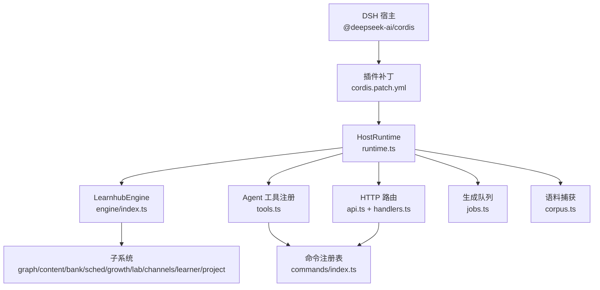
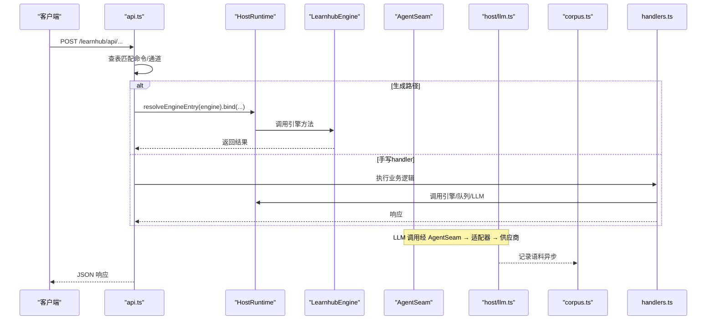
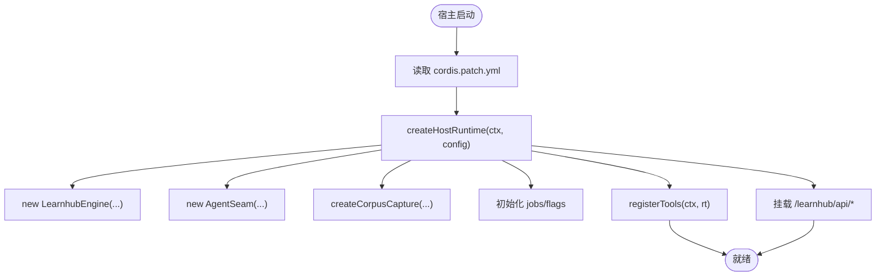
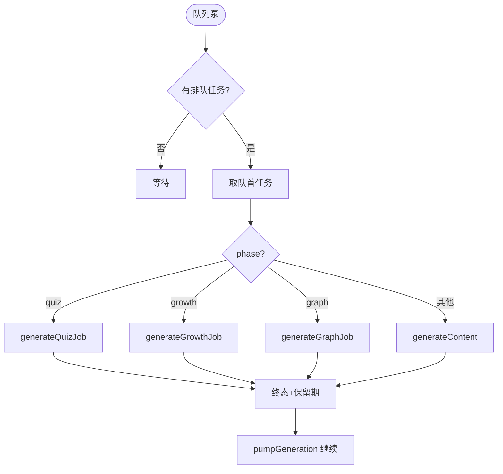
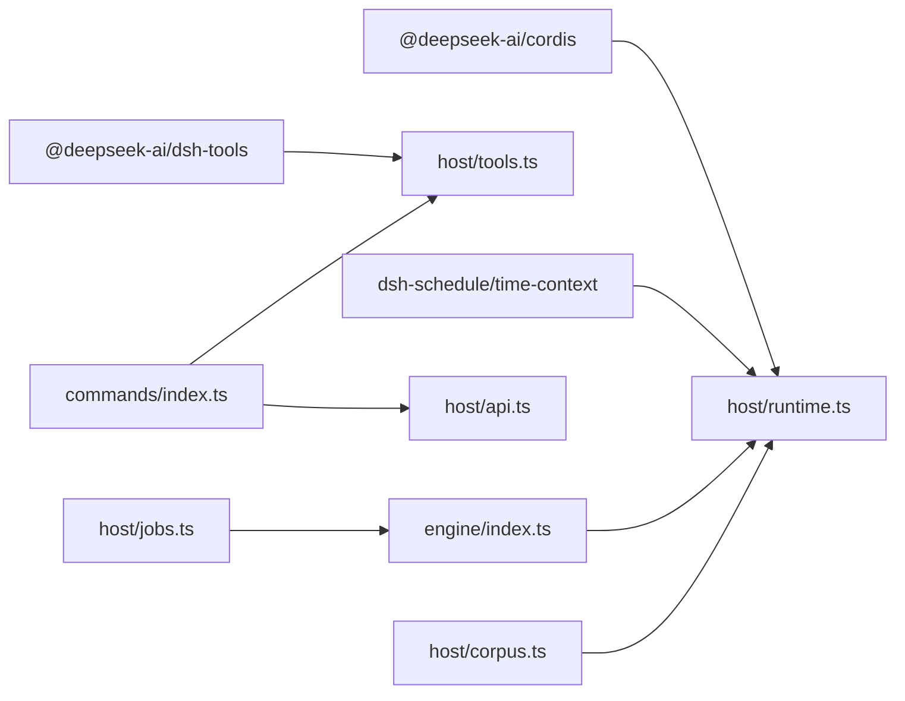

# DeepSeek框架集成

<cite>
**本文引用的文件**
- [cordis.patch.yml](file://cordis.patch.yml)
- [package.json](file://package.json)
- [src/host/runtime.ts](file://src/host/runtime.ts)
- [src/host/api.ts](file://src/host/api.ts)
- [src/host/handlers.ts](file://src/host/handlers.ts)
- [src/engine/index.ts](file://src/engine/index.ts)
- [src/host/tools.ts](file://src/host/tools.ts)
- [src/commands/index.ts](file://src/commands/index.ts)
- [src/host/jobs.ts](file://src/host/jobs.ts)
- [src/host/corpus.ts](file://src/host/corpus.ts)
- [src/engine/agent.ts](file://src/engine/agent.ts)
</cite>

## 目录
1. [简介](#简介)
2. [项目结构](#项目结构)
3. [核心组件](#核心组件)
4. [架构总览](#架构总览)
5. [详细组件分析](#详细组件分析)
6. [依赖关系分析](#依赖关系分析)
7. [性能与扩展性](#性能与扩展性)
8. [故障排查指南](#故障排查指南)
9. [结论](#结论)
10. [附录：部署与环境适配](#附录部署与环境适配)

## 简介
本仓库是 DeepSeek Harness（DSH）的学习引擎插件 dsh-learnhub，提供宿主侧运行时、HTTP 面板路由、Agent 工具注册、生成队列与任务持久化、LLM 调用语料捕获等能力。通过 cordis.patch.yml 将插件与 DSH 宿主组合装配，暴露 111 个 Agent 工具与 /learnhub 面板入口，实现学习中心的数据管理、内容生成、题库与复习调度、项目计划与生长批等完整工作流。

## 项目结构
- 配置与打包
  - cordis.patch.yml：声明 host 引擎插件与定时提醒能力（time-context、schedule）。
  - package.json：定义 dsh.bundle.patch 指向 patch 文件；导出 lib/index.js、lib/client.js；声明 peerDependencies 与可选依赖。
- 宿主层（host）
  - runtime.ts：构造 HostRuntime（engine、agent、jobs、flags、vault/centerRel），统一日志与运行出口。
  - api.ts：/learnhub/api/* 路由分发，基于命令注册表生成路径或手写 handler。
  - handlers.ts：非生成路径的手写路由处理（状态、Anki、质量评审、生成控制等）。
  - tools.ts：将命令注册表映射为 Agent 工具（name/description/schema/execute）。
  - jobs.ts：全局串行生成队列、任务注册表、执行泵、保留期清扫、教练触点。
  - corpus.ts：LLM 调用语料落盘、环形桶、补标、解析器。
  - llm.ts、static.ts、http.ts、vault-fs.ts 等：适配器与静态资源服务。
- 引擎层（engine）
  - index.ts：LearnhubEngine 门面，子系统聚合（graph/content/bank/sched/growth/lab/channels/learner/project 等），schema 版本硬门，视图加载、推荐、审计、生成任务持久化等。
  - agent.ts：统一 AgentSeam（complete/repair/loop），预算与观测面。
- 命令注册表（commands）
  - 按域拆分（学习/图谱/题库/项目/学习者产出/实验室/通道/维护），集中导出 COMMAND_LIST、BY_ROUTE、BY_TOOL、WIRE_ARGS。

图表来源
- [cordis.patch.yml:1-14](file://cordis.patch.yml#L1-L14)
- [src/host/runtime.ts:138-193](file://src/host/runtime.ts#L138-L193)
- [src/engine/index.ts:149-398](file://src/engine/index.ts#L149-L398)
- [src/host/tools.ts:102-125](file://src/host/tools.ts#L102-L125)
- [src/host/api.ts:48-83](file://src/host/api.ts#L48-L83)
- [src/host/jobs.ts:696-740](file://src/host/jobs.ts#L696-L740)
- [src/host/corpus.ts:186-342](file://src/host/corpus.ts#L186-L342)

章节来源
- [cordis.patch.yml:1-14](file://cordis.patch.yml#L1-L14)
- [package.json:1-83](file://package.json#L1-L83)

## 核心组件
- HostRuntime：承载 engine、agent、jobs、flags、vault/centerRel、quizAuditRate；负责部署路径校验、新鲜库初始化、agent 缝注入、运行日志封装。
- LearnhubEngine：数据访问唯一收口，聚合各子系统，提供 status/recommend/doctor/rebuild/graph 等能力，并暴露生成任务持久化接口。
- AgentSeam：统一 LLM 调用缝，支持 complete/repair/loop，内置围栏剥离、语义档、调用观测、门错修复轮。
- 命令注册表：以 id 键组织命令，同时驱动 Agent 工具与 HTTP 路由两个通道。
- 生成队列：FIFO 全局串行执行，支持节点生成、纯出题、图域任务、生长批；任务注册表持久化、保留期清扫、broken 态写回闸。
- 语料捕获：全量记录 LLM 调用，环形桶限制容量，失败/容忍可补标，供冒烟与质量评审使用。

章节来源
- [src/host/runtime.ts:23-133](file://src/host/runtime.ts#L23-L133)
- [src/engine/index.ts:133-398](file://src/engine/index.ts#L133-L398)
- [src/engine/agent.ts:85-221](file://src/engine/agent.ts#L85-L221)
- [src/commands/index.ts:25-72](file://src/commands/index.ts#L25-L72)
- [src/host/jobs.ts:269-740](file://src/host/jobs.ts#L269-L740)
- [src/host/corpus.ts:27-103](file://src/host/corpus.ts#L27-L103)

## 架构总览
插件通过 cordis.patch.yml 被 DSH 宿主装配，宿主在 apply 阶段创建 HostRuntime，注册 Agent 工具与 HTTP 路由。请求进入 /learnhub/api/* 后，由 api.ts 查表命中命令，走“生成路径”直调引擎方法，或落入 handlers.ts 的手写处理器。所有 LLM 调用经 AgentSeam 与 host/llm.ts 适配器，语料由 corpus.ts 落盘。生成类任务入队到 jobs.ts 的全局队列，单并发执行，结果持久化并带保留期。

图表来源
- [src/host/api.ts:48-83](file://src/host/api.ts#L48-L83)
- [src/host/runtime.ts:204-238](file://src/host/runtime.ts#L204-L238)
- [src/engine/agent.ts:93-200](file://src/engine/agent.ts#L93-L200)
- [src/host/corpus.ts:186-342](file://src/host/corpus.ts#L186-L342)

## 详细组件分析

### 插件与 DSH 的集成方式与生命周期
- 装配入口
  - cordis.patch.yml 声明插件 id 与 name，以及 time-context、schedule 能力。
  - package.json 中 dsh.bundle.patch 指向该文件，构建时由 DSH 宿主读取并组合。
- 启动流程
  - 宿主调用 createHostRuntime(ctx, config) 完成：
    - 校验 vault/centerRel 存在性
    - 若全新 vault，写入 learnhub.json 并标记 schema 版本
    - 构造 LearnhubEngine（注入 clock/rng/fs）
    - 构造语料捕获器（corpusDir 可覆盖）
    - 构造 AgentSeam（注入 complete/stream/onCall）
    - 初始化 jobs Map、flags 初始值
  - 注册 Agent 工具：遍历 COMMAND_LIST，按 channel='agent' 注册 defineTool，execute 走 run(rt, tool, ...) 或直接调用引擎。
  - 注册 HTTP 路由：/learnhub/api/* 由 handleApi 分发，/learnhub 面板静态资源由 static.ts 提供。
- 停止流程
  - 无显式 stop 钩子；进程退出时内存态丢失，但任务注册表已持久化，重启后可恢复。

章节来源
- [cordis.patch.yml:1-14](file://cordis.patch.yml#L1-L14)
- [package.json:18-37](file://package.json#L18-L37)
- [src/host/runtime.ts:138-193](file://src/host/runtime.ts#L138-L193)
- [src/host/tools.ts:102-125](file://src/host/tools.ts#L102-L125)
- [src/host/api.ts:48-83](file://src/host/api.ts#L48-L83)

### cordis.patch.yml 的作用与自定义选项
- 作用
  - 向 DSH 宿主注入 dsh-learnhub 插件（id/name）。
  - 注入时间上下文与定时任务能力（time-context、schedule），用于会话级 schedule_create/list/delete 与时区上下文。
- 自定义
  - 机器级 config.vault 不在此文件中，由各机器的 profile patch 覆盖。
  - 可通过宿主 LearnhubConfig 调整 AI provider/model/fastEffort/deepEffort/quizAuditRate/corpusDir 等。

章节来源
- [cordis.patch.yml:1-14](file://cordis.patch.yml#L1-L14)
- [src/host/runtime.ts:23-44](file://src/host/runtime.ts#L23-L44)

### Context 对象的使用模式与扩展点
- 使用模式
  - Context 来自 @deepseek-ai/cordis，仅由宿主装配点消费（createHostRuntime 参数），不驻留 HostRuntime。
  - 通过 host/llm.ts 适配器将 ctx 注入到 LLM 调用缝（complete/stream），从而打通宿主会话与插件。
- 扩展点
  - 未来可将 LlmStream 替换为 ctx.agents.create 的会话适配实现，应用层调用点零改动（见 AgentSeam 注释）。
  - 工具回路轨迹、调用观测通过 onCall 回调输出至运行日志。

章节来源
- [src/host/runtime.ts:115-193](file://src/host/runtime.ts#L115-L193)
- [src/engine/agent.ts:122-186](file://src/engine/agent.ts#L122-L186)

### 插件安装、启动与停止的完整流程
- 安装
  - 通过 DSH 宿主读取 cordis.patch.yml，将插件纳入组合包。
- 启动
  - 宿主调用 createHostRuntime(ctx, config) 完成引擎与运行时装配。
  - 注册 Agent 工具（registerTools）。
  - 挂载 /learnhub/api/* 路由与静态资源。
- 停止
  - 无显式 stop；任务注册表持久化，重启后恢复。

图表来源
- [src/host/runtime.ts:138-193](file://src/host/runtime.ts#L138-L193)
- [src/host/tools.ts:102-125](file://src/host/tools.ts#L102-L125)
- [src/host/api.ts:48-83](file://src/host/api.ts#L48-L83)

### 与宿主环境的通信机制和数据交换格式
- Agent 工具
  - 名称/描述/schema 来自命令注册表；execute 返回文本（JSON.stringify 引擎结果）。
  - 参数类型由 SDK 从 schema 推断，避免手写重复类型。
- HTTP 面板
  - 前缀 /learnhub/api；POST/PUT 先读体再查表；未命中返回 404 含原始方法与路由。
  - 错误统一 { error: string } + 500；引擎对象原样透传，禁止手动 stringify。
- 数据交换
  - 请求体键名权威来自 WIRE_ARGS（camelCase→snake_case 翻译依据）。
  - 响应形状由命令 output 派生（UI 类型安全）。

章节来源
- [src/host/tools.ts:72-125](file://src/host/tools.ts#L72-L125)
- [src/host/api.ts:1-83](file://src/host/api.ts#L1-L83)
- [src/commands/index.ts:54-72](file://src/commands/index.ts#L54-L72)

### 生成队列与任务管理
- 入队
  - enqueueGeneration：节点正文生成（大纲→节→题），终点恒拒。
  - enqueueQuizGeneration：纯出题任务（phase=quiz），与节点管线互斥。
  - enqueueGrowthBatch：生长批（教练回合裁决→提案→罗盘重写）。
  - enqueueGraphJob：图域任务（seed/compass/decompile/plan/milestone）。
- 执行
  - pumpGeneration：空闲且未暂停时取队首执行，单并发 FIFO。
  - 取消：cancelling 旗标沿任务传导，每轮检查。
- 持久化与恢复
  - 每次变更全量落盘 state/生成任务.json；进程重启后恢复遗留 running 为失败。
  - broken 态写回闸拒绝一切会覆盖注册表的写操作。
- 保留期与清扫
  - 终态保留期：成功 30 分钟，失败/取消 24 小时；到期清理。
  - sweepGenJobs：课程删除或节点改名后清扫悬空任务。

图表来源
- [src/host/jobs.ts:269-740](file://src/host/jobs.ts#L269-L740)

### 语料捕获与质量评审
- 捕获
  - 每条 LLM 调用落盘为 frontmatter + 提示词 + 原始输出 + 工具调用段。
  - 环形桶：ok 桶 25/站，bad/tolerated 桶 200/站。
- 补标
  - annotateLast：失败/容忍时改 outcome/code，并在 ok/bad 桶间迁移文件名。
- 评审
  - 离线批量评审器按站取量规抽样评分，报告落 state/质量评审。

章节来源
- [src/host/corpus.ts:1-103](file://src/host/corpus.ts#L1-L103)
- [src/host/corpus.ts:186-342](file://src/host/corpus.ts#L186-L342)

### 命令注册表与双通道适配
- 命令表
  - 以 id 为键的对象，便于 UI 派生响应类型。
  - COMMAND_LIST 提供遍历时序；BY_ROUTE/BY_TOOL/WIRE_ARGS 提供索引。
- 适配
  - Agent 通道：tools.ts 将 args 投影为 SDK parameters，execute 走引擎或 handler。
  - Panel 通道：api.ts 按 method+path 查表，生成路径直调引擎，否则走 handlers.ts。

章节来源
- [src/commands/index.ts:25-72](file://src/commands/index.ts#L25-L72)
- [src/host/tools.ts:72-125](file://src/host/tools.ts#L72-L125)
- [src/host/api.ts:48-83](file://src/host/api.ts#L48-L83)

## 依赖关系分析
- 外部依赖
  - @deepseek-ai/cordis：宿主 Context 与工具注册。
  - @deepseek-ai/dsh-tools：defineTool 注册 Agent 工具。
  - @deepseek-ai/dsh-schedule/@deepseek-ai/dsh-time-context：定时与时间上下文（可选）。
  - @deepseek-ai/dsh-llm：LLM 抽象（可选）。
  - ts-fsrs/open-spaced-repetition：记忆算法与绑定。
- 内部耦合
  - host 与 engine 通过 LearnhubEngine 门面交互，避免深耦合。
  - commands 作为单一事实源，驱动 agent 与 panel 两通道。
  - jobs 与 engine 通过 save/loadGenJobs 持久化任务注册表。

图表来源
- [package.json:49-69](file://package.json#L49-L69)
- [src/host/runtime.ts:138-193](file://src/host/runtime.ts#L138-L193)
- [src/host/tools.ts:102-125](file://src/host/tools.ts#L102-L125)
- [src/host/api.ts:48-83](file://src/host/api.ts#L48-L83)
- [src/host/jobs.ts:696-740](file://src/host/jobs.ts#L696-L740)
- [src/host/corpus.ts:186-342](file://src/host/corpus.ts#L186-L342)

章节来源
- [package.json:49-69](file://package.json#L49-L69)

## 性能与扩展性
- 性能
  - 生成队列单并发 FIFO，避免并发竞争与资源争用。
  - 任务注册表持久化，重启可恢复；保留期自动清扫。
  - 语料捕获异步 fire-and-forget，失败静默不影响主流程。
  - 调度器缓存 FSRS 实例，减少重复计算。
- 扩展性
  - 新增命令：在对应域文件添加 command 声明，自动驱动 agent 与 panel。
  - 新增子系统：通过 LearnhubEngine 构造函数注入，保持门面收敛。
  - 新增 LLM 站点：在 STATIONS 表中登记，确保语料站名一致。

[本节为通用指导，无需特定文件引用]

## 故障排查指南
- 常见错误
  - config.vault 缺失或目录不存在：启动时报错，需在 profile patch 配置。
  - 生成任务档损坏：队列处于 broken 态，拒绝写回；需修复或删除后重启。
  - 未知路由：返回 404 包含原始方法与路由，便于定位。
  - 参数校验失败：ParamError 携带中文消息与路由信息。
- 诊断工具
  - /status：查看当前 LLM 配置与会话开始节流。
  - /data-check：只读体检 Missing/Broken。
  - /rebuild：审计并重建派生文件。
  - 生成语料：state/生成语料/<站>/ 下查看最近调用。

章节来源
- [src/host/runtime.ts:138-163](file://src/host/runtime.ts#L138-L163)
- [src/host/jobs.ts:271-286](file://src/host/jobs.ts#L271-L286)
- [src/host/api.ts:54-83](file://src/host/api.ts#L54-L83)
- [src/engine/index.ts:567-612](file://src/engine/index.ts#L567-L612)
- [src/host/corpus.ts:186-342](file://src/host/corpus.ts#L186-L342)

## 结论
本插件通过 cordis.patch.yml 与 DSH 宿主无缝集成，提供统一的 HostRuntime、LearnhubEngine 门面、Agent 工具与 HTTP 面板，配合生成队列与语料捕获，形成完整的学习中心工作流。命令注册表作为单一事实源，驱动双通道适配，保证类型安全与可维护性。部署时仅需配置 vault 与 AI 参数，即可快速上线。

[本节为总结，无需特定文件引用]

## 附录：部署与环境适配
- 环境要求
  - Node >= 22。
  - 必需 peer：@deepseek-ai/cordis。
  - 可选 peer：dsh-llm、dsh-tools、dsh-schedule、dsh-time-context。
- 部署步骤
  - 在各机器 profile 的 cordis.patch.yml 中配置 vault 根目录绝对路径。
  - 构建产物 lib/web 随插件发布，宿主自动装载。
  - 启动后访问 /learnhub 面板，/learnhub/api/* 提供后端能力。
- 最佳实践
  - 使用 LearnhubConfig 指定 provider/model/fastEffort/deepEffort/quizAuditRate/corpusDir。
  - 定期运行 /rebuild 与 /data-check 保障数据健康。
  - 利用生成语料进行冒烟与质量评审，持续优化模型与提示词。

章节来源
- [package.json:15-17](file://package.json#L15-L17)
- [package.json:49-69](file://package.json#L49-L69)
- [src/host/runtime.ts:23-44](file://src/host/runtime.ts#L23-L44)
- [src/host/runtime.ts:138-163](file://src/host/runtime.ts#L138-L163)