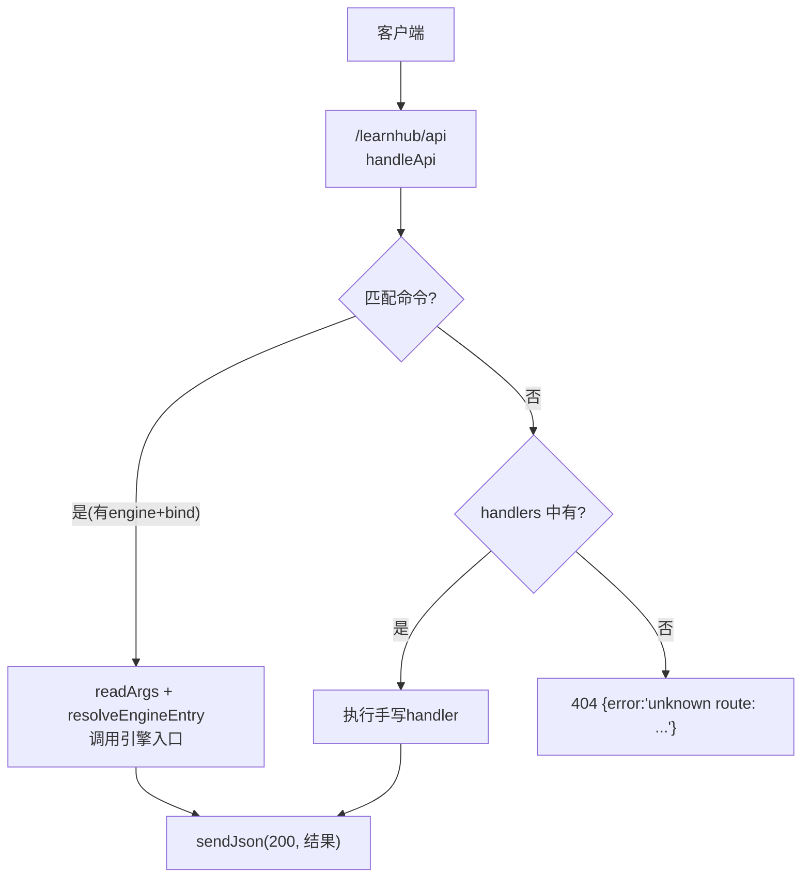
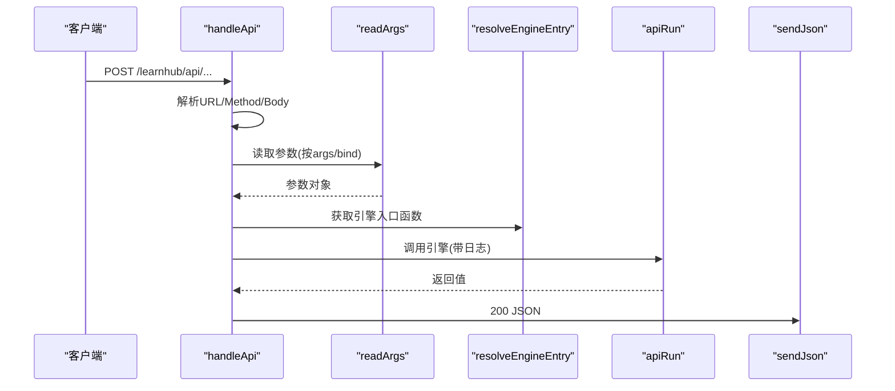
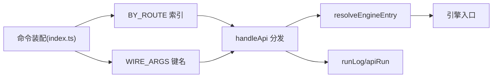

# API端点参考

<cite>
**本文引用的文件**
- [src/host/api.ts](file://src/host/api.ts)
- [src/host/handlers.ts](file://src/host/handlers.ts)
- [src/host/route-table.ts](file://src/host/route-table.ts)
- [src/host/http.ts](file://src/host/http.ts)
- [src/host/static.ts](file://src/host/static.ts)
- [src/host/runtime.ts](file://src/host/runtime.ts)
- [src/commands/index.ts](file://src/commands/index.ts)
- [src/commands/学习.ts](file://src/commands/学习.ts)
- [src/commands/图谱.ts](file://src/commands/图谱.ts)
- [src/commands/题库.ts](file://src/commands/题库.ts)
- [src/commands/项目.ts](file://src/commands/项目.ts)
</cite>

## 目录
1. [简介](#简介)
2. [项目结构](#项目结构)
3. [核心组件](#核心组件)
4. [架构总览](#架构总览)
5. [详细端点参考](#详细端点参考)
6. [依赖关系分析](#依赖关系分析)
7. [性能与可用性](#性能与可用性)
8. [故障排查](#故障排查)
9. [结论](#结论)
10. [附录：版本控制与兼容性](#附录版本控制与兼容性)

## 简介
本参考文档面向调用 LearnHub 插件面板后端的客户端开发者，系统化梳理所有 HTTP 端点的 URL、方法、参数、响应与错误语义。LearnHub 的 API 统一挂载在 /learnhub/api 前缀下，采用“声明式命令注册表 + 生成路径直调引擎”的分发模式；无法由声明覆盖的例外路由由手写处理器承接。所有 JSON 响应通过统一的 sendJson 序列化，错误统一以 { error: string } 形式返回（404 或 500）。

## 项目结构
- 路由前缀：/learnhub/api
- 分发流程：请求进入 handleApi → 解析 body → 查表匹配命令（精确命中优先，其次前缀）→ 若带 engine+bind 则走生成路径直调引擎并返回；否则交由 handlers.ts 中对应的手写 handler 处理
- 静态资源：/learnhub（SPA）、/learnhub/api/vendor/*（第三方库）、/learnhub/api/file?path=...（媒体）、/learnhub/api/interactive?path=...（交互件）

图表来源
- [src/host/api.ts:48-83](file://src/host/api.ts#L48-L83)
- [src/host/handlers.ts:101-741](file://src/host/handlers.ts#L101-L741)
- [src/host/http.ts:26-32](file://src/host/http.ts#L26-L32)

章节来源
- [src/host/api.ts:1-84](file://src/host/api.ts#L1-L84)
- [src/host/route-table.ts:1-75](file://src/host/route-table.ts#L1-L75)

## 核心组件
- 路由表与构造器：定义 HttpMethod(GET/POST/PUT)、RouteSpec、get/post/put/getPrefix 等
- 命令装配：COMMANDS/BY_ROUTE/WIRE_ARGS 提供按 method+path 索引与参数映射
- 运行时：HostRuntime、apiRun/runLog 封装引擎调用与日志
- HTTP 工具：sendJson/readJson/injectKatexIfMathed、MIME 白名单
- 静态伺服：panelPageHandler、serveVaultFile、serveVendor、serveInteractive

章节来源
- [src/host/route-table.ts:16-75](file://src/host/route-table.ts#L16-L75)
- [src/commands/index.ts:25-72](file://src/commands/index.ts#L25-L72)
- [src/host/runtime.ts:198-255](file://src/host/runtime.ts#L198-L255)
- [src/host/http.ts:1-55](file://src/host/http.ts#L1-L55)
- [src/host/static.ts:14-134](file://src/host/static.ts#L14-L134)

## 架构总览
- 统一入口：handleApi(rt, ctx, req, res)
- 参数绑定：readArgs(command.args, channel, {kind:'body'|'query', ...}, bind)
- 引擎入口解析：resolveEngineEntry(rt, engine) 支持 .method 或裸名
- 日志：apiRun 包裹引擎调用，记录成功/失败摘要到运行日志
- 错误：ParamError 包装为 500 {error: "...（路由 METHOD PATH）"}；未知路由 404

图表来源
- [src/host/api.ts:48-83](file://src/host/api.ts#L48-L83)
- [src/host/runtime.ts:198-255](file://src/host/runtime.ts#L198-L255)

## 详细端点参考
说明：
- 基础路径：/learnhub/api
- 认证：当前实现未包含鉴权中间件；如需鉴权请在宿主层扩展
- 通用响应：成功 200 JSON；未知路由 404 {error:"unknown route: METHOD PATH"}；参数/业务异常 500 {error:"..."}

### GET 端点
- GET /status
  - 功能：系统状态与当前 LLM 配置
  - 参数：无
  - 响应：{ ...engine status, llm: {...} }
  - 示例：curl -s http://host/learnhub/api/status
  - 来源：[src/host/handlers.ts:102-107](file://src/host/handlers.ts#L102-L107)

- GET /courses
  - 功能：列出已启用课程
  - 参数：无
  - 响应：[{ name, root, enabled }]
  - 示例：curl -s http://host/learnhub/api/courses
  - 来源：[src/host/handlers.ts:108-113](file://src/host/handlers.ts#L108-L113)

- GET /recommend?limit=N
  - 功能：推荐内容
  - 参数：limit(可选，默认5)
  - 响应：推荐列表
  - 示例：curl -s "http://host/learnhub/api/recommend?limit=3"
  - 来源：[src/host/handlers.ts:114-117](file://src/host/handlers.ts#L114-L117)

- GET /file?path=相对路径
  - 功能：伺服 vault 内媒体文件（白名单扩展）
  - 参数：path(必填，vault 相对路径)
  - 响应：二进制文件流
  - 示例：curl -s "http://host/learnhub/api/file?path=assets/img.png"
  - 来源：[src/host/handlers.ts:118-121], [src/host/static.ts:62-80](file://src/host/static.ts#L62-L80)

- GET /vendor/*
  - 功能：同源伺服 vendored 库（如 katex/three）
  - 参数：路径限制在 web/vendor 内
  - 响应：二进制文件流
  - 示例：curl -s http://host/learnhub/api/vendor/katex/katex.min.js
  - 来源：[src/host/handlers.ts:122-125], [src/host/static.ts:82-102](file://src/host/static.ts#L82-L102)

- GET /interactive?path=相对路径
  - 功能：伺服启用课程根内的 .html 交互件（CSP 限制）
  - 参数：path(必填，课程根相对)
  - 响应：HTML
  - 示例：curl -s "http://host/learnhub/api/interactive?path=课程根/交互/x.html"
  - 来源：[src/host/handlers.ts:126-129], [src/host/static.ts:104-133](file://src/host/static.ts#L104-L133)

- GET /note?path=笔记路径
  - 功能：解析并返回笔记内容
  - 参数：path(必填)
  - 响应：笔记对象
  - 示例：curl -s "http://host/learnhub/api/note?path=notes/xxx.md"
  - 来源：[src/host/handlers.ts:130-133](file://src/host/handlers.ts#L130-L133)

- GET /graph?course=课程&elements=1|0
  - 功能：知识图谱分析（统计/健康/渲染元素）
  - 参数：course(可选), elements(可选)
  - 响应：图分析数据
  - 示例：curl -s "http://host/learnhub/api/graph?course=数学&elements=1"
  - 来源：[src/host/handlers.ts:134-137](file://src/host/handlers.ts#L134-L137)

- GET /review-queue?course=课程&node=节点&band=standard|easy|hard
  - 功能：复习队列（跨课程到期题，按遗忘风险排序）
  - 参数：course(可选), node(可选), band(可选)
  - 响应：卡片队列
  - 示例：curl -s "http://host/learnhub/api/review-queue?course=数学&band=easy"
  - 来源：[src/host/handlers.ts:138-146](file://src/host/handlers.ts#L138-L146)

- GET /probation?course=课程
  - 功能：插入实验面状态（在途节点、三率、韧性闸门）
  - 参数：course(可选)
  - 响应：实验状态
  - 示例：curl -s "http://host/learnhub/api/probation?course=数学"
  - 来源：[src/host/handlers.ts:147-151](file://src/host/handlers.ts#L147-L151)

- GET /experiments
  - 功能：N-of-1 实验模板、清单与报告
  - 参数：无
  - 响应：{ templates, experiments, report|null }
  - 示例：curl -s http://host/learnhub/api/experiments
  - 来源：[src/host/handlers.ts:152-166](file://src/host/handlers.ts#L152-L166)

- GET /generate/status
  - 功能：生成任务状态
  - 参数：无
  - 响应：任务状态
  - 示例：curl -s http://host/learnhub/api/generate/status
  - 来源：[src/host/handlers.ts:167-169](file://src/host/handlers.ts#L167-L169)

- GET /explain-pack?course=课程&node=节点&qid=题目ID
  - 功能：错误当下讲解包
  - 参数：course(可选), node(必填), qid(必填)
  - 响应：讲解包
  - 示例：curl -s "http://host/learnhub/api/explain-pack?node=集合&qid=123"
  - 来源：[src/host/handlers.ts:170-174](file://src/host/handlers.ts#L170-L174)

- GET /anki/status
  - 功能：Anki 通道状态（连接性、最近推送/回写、到期分布）
  - 参数：无
  - 响应：anki 状态
  - 示例：curl -s http://host/learnhub/api/anki/status
  - 来源：[src/host/handlers.ts:175-180](file://src/host/handlers.ts#L175-L180)

- GET /agent-guide
  - 功能：Agent 能力指南
  - 参数：无
  - 响应：指南对象
  - 示例：curl -s http://host/learnhub/api/agent-guide
  - 来源：[src/host/handlers.ts:251-254](file://src/host/handlers.ts#L251-L254)

- GET /bank-cleanup?course=课程
  - 功能：题库清理预览（只读）
  - 参数：course(可选)
  - 响应：清理候选
  - 示例：curl -s "http://host/learnhub/api/bank-cleanup?course=数学"
  - 来源：[src/host/handlers.ts:255-258](file://src/host/handlers.ts#L255-L258)

- GET /calibration/profile
  - 功能：自校准画像（只读）
  - 参数：无
  - 响应：校准画像
  - 示例：curl -s http://host/learnhub/api/calibration/profile
  - 来源：[src/commands/学习.ts:48-67](file://src/commands/学习.ts#L48-L67)

- GET /coach
  - 功能：教练建议（只读）
  - 参数：无
  - 响应：建议消息
  - 示例：curl -s http://host/learnhub/api/coach
  - 来源：[src/commands/学习.ts:68-87](file://src/commands/学习.ts#L68-L87)

- GET /compass?course=课程
  - 功能：课程罗盘（只读）
  - 参数：course(可选)
  - 响应：罗盘数据
  - 示例：curl -s "http://host/learnhub/api/compass?course=数学"
  - 来源：[src/commands/图谱.ts:22-44](file://src/commands/图谱.ts#L22-L44)

- GET /difficulty-advice?course=课程
  - 功能：难度不匹配建议（只读）
  - 参数：course(可选)
  - 响应：建议列表
  - 示例：curl -s "http://host/learnhub/api/difficulty-advice?course=数学"
  - 来源：[src/commands/题库.ts:43-65](file://src/commands/题库.ts#L43-L65)

- GET /question-audit
  - 功能：题库审计（只读）
  - 参数：无
  - 响应：问题发现列表
  - 示例：curl -s http://host/learnhub/api/question-audit
  - 来源：[src/commands/题库.ts:121-140](file://src/commands/题库.ts#L121-L140)

- GET /project/cross?id=项目ID
  - 功能：项目交叉诊断（只读）
  - 参数：id(必填)
  - 响应：2x2 诊断
  - 示例：curl -s "http://host/learnhub/api/project/cross?id=p1"
  - 来源：[src/commands/项目.ts:45-72](file://src/commands/项目.ts#L45-L72)

### POST 端点
- POST /smoke
  - 功能：生成冒烟测试（临时 vault 跑通全管线）
  - 参数：jobTimeoutMs?, quizCount?, quizAuditRate?, goal?, course?, corpusDir?
  - 响应：冒烟报告
  - 示例：curl -X POST -H 'Content-Type: application/json' -d '{"quizCount":3}' http://host/learnhub/api/smoke
  - 来源：[src/host/handlers.ts:181-199](file://src/host/handlers.ts#L181-L199)

- POST /spike
  - 功能：工具调用通道 spike（多站多变体评测）
  - 参数：runsPerCell?, stations?, quizCount?, temperature?, corpusDir?
  - 响应：指标
  - 示例：curl -X POST -H 'Content-Type: application/json' -d '{"stations":["题目生成"],"temperature":0.7}' http://host/learnhub/api/spike
  - 来源：[src/host/handlers.ts:200-219](file://src/host/handlers.ts#L200-L219)

- POST /quality-review
  - 功能：离线批量评审（质量量规评分）
  - 参数：badQuota?, okQuota?, repeats?, stations?, systemic?, corpusDir?, outDir?
  - 响应：评审结果
  - 示例：curl -X POST -H 'Content-Type: application/json' -d '{"repeats":1,"stations":["课程大纲"]}' http://host/learnhub/api/quality-review
  - 来源：[src/host/handlers.ts:220-250](file://src/host/handlers.ts#L220-L250)

- POST /jol
  - 功能：JOL 抽查配置
  - 参数：enabled?, rate?
  - 响应：更新结果
  - 示例：curl -X PUT -H 'Content-Type: application/json' -d '{"rate":0.3}' http://host/learnhub/api/jol
  - 来源：[src/host/handlers.ts:259-265](file://src/host/handlers.ts#L259-L265)

- POST /habits/create
  - 功能：创建习惯
  - 参数：name, cue, action
  - 响应：创建结果
  - 示例：curl -X POST -H 'Content-Type: application/json' -d '{"name":"背单词","cue":"早晨","action":"打开APP"}' http://host/learnhub/api/habits/create
  - 来源：[src/host/handlers.ts:281-286](file://src/host/handlers.ts#L281-L286)

- POST /habits/repeat
  - 功能：自报重复
  - 参数：habit, auto_rating?, note?
  - 响应：计数结果
  - 示例：curl -X POST -H 'Content-Type: application/json' -d '{"habit":"背单词","auto_rating":4}' http://host/learnhub/api/habits/repeat
  - 来源：[src/host/handlers.ts:287-293](file://src/host/handlers.ts#L287-L293)

- POST /habits/archive
  - 功能：归档/恢复习惯
  - 参数：habit, archived
  - 响应：归档结果
  - 示例：curl -X POST -H 'Content-Type: application/json' -d '{"habit":"背单词","archived":true}' http://host/learnhub/api/habits/archive
  - 来源：[src/host/handlers.ts:294-298](file://src/host/handlers.ts#L294-L298)

- POST /skills/archive
  - 功能：归档/恢复技能
  - 参数：skill, archived
  - 响应：归档结果
  - 示例：curl -X POST -H 'Content-Type: application/json' -d '{"skill":"写作","archived":false}' http://host/learnhub/api/skills/archive
  - 来源：[src/host/handlers.ts:299-303](file://src/host/handlers.ts#L299-L303)

- POST /skills/maintenance
  - 功能：维持节拍帽
  - 参数：skill, days|null
  - 响应：设置结果
  - 示例：curl -X POST -H 'Content-Type: application/json' -d '{"skill":"写作","days":7}' http://host/learnhub/api/skills/maintenance
  - 来源：[src/host/handlers.ts:304-308](file://src/host/handlers.ts#L304-L308)

- POST /rebuild
  - 功能：重建
  - 参数：无
  - 响应：{ message }
  - 示例：curl -X POST http://host/learnhub/api/rebuild
  - 来源：[src/host/handlers.ts:309-311](file://src/host/handlers.ts#L309-L311)

- POST /node/skip
  - 功能：跳过节点（重新裁决）
  - 参数：course, node, skipped
  - 响应：跳过结果
  - 示例：curl -X POST -H 'Content-Type: application/json' -d '{"course":"数学","node":"集合","skipped":true}' http://host/learnhub/api/node/skip
  - 来源：[src/host/handlers.ts:312-319](file://src/host/handlers.ts#L312-L319)

- POST /node/pin
  - 功能：置顶今日学习
  - 参数：course, node, pinned
  - 响应：置顶结果
  - 示例：curl -X POST -H 'Content-Type: application/json' -d '{"course":"数学","node":"集合","pinned":true}' http://host/learnhub/api/node/pin
  - 来源：[src/host/handlers.ts:320-328](file://src/host/handlers.ts#L320-L328)

- POST /node/complete
  - 功能：完成节点（触发教练回合）
  - 参数：course, node, force?
  - 响应：完成结果
  - 示例：curl -X POST -H 'Content-Type: application/json' -d '{"course":"数学","node":"集合"}' http://host/learnhub/api/node/complete
  - 来源：[src/host/handlers.ts:329-335](file://src/host/handlers.ts#L329-L335)

- POST /feedback
  - 功能：提交反馈
  - 参数：path
  - 响应：{ message }
  - 示例：curl -X POST -H 'Content-Type: application/json' -d '{"path":"notes/xxx.md"}' http://host/learnhub/api/feedback
  - 来源：[src/host/handlers.ts:336-338](file://src/host/handlers.ts#L336-L338)

- POST /proposals/apply
  - 功能：提案统一 apply（含反编译双提案联动）
  - 参数：kind, id, note?
  - 响应：应用结果
  - 示例：curl -X POST -H 'Content-Type: application/json' -d '{"kind":"seed","id":123}' http://host/learnhub/api/proposals/apply
  - 来源：[src/host/handlers.ts:339-359](file://src/host/handlers.ts#L339-L359)

- POST /proposals/reject
  - 功能：拒绝提案
  - 参数：id, note?
  - 响应：确认信息
  - 示例：curl -X POST -H 'Content-Type: application/json' -d '{"id":123,"note":"不符合要求"}' http://host/learnhub/api/proposals/reject
  - 来源：[src/host/handlers.ts:360-364](file://src/host/handlers.ts#L360-L364)

- POST /experiments/apply
  - 功能：实验确认开跑
  - 参数：id
  - 响应：应用结果
  - 示例：curl -X POST -H 'Content-Type: application/json' -d '{"id":1}' http://host/learnhub/api/experiments/apply
  - 来源：[src/host/handlers.ts:365-369](file://src/host/handlers.ts#L365-L369)

- POST /experiments/stop
  - 功能：实验手动停止
  - 参数：id?(可选)
  - 响应：停止结果
  - 示例：curl -X POST -H 'Content-Type: application/json' -d '{}' http://host/learnhub/api/experiments/stop
  - 来源：[src/host/handlers.ts:370-374](file://src/host/handlers.ts#L370-L374)

- POST /sandbox/run
  - 功能：沙盘推演（只读蒙特卡洛）
  - 参数：minutes_per_day, weeks?, course?, nodes?
  - 响应：推演结果
  - 示例：curl -X POST -H 'Content-Type: application/json' -d '{"minutes_per_day":30,"weeks":4}' http://host/learnhub/api/sandbox/run
  - 来源：[src/host/handlers.ts:375-387](file://src/host/handlers.ts#L375-L387)

- POST /generate
  - 功能：入队生成（大纲→节→出题）
  - 参数：course, node, style?
  - 响应：任务入队结果
  - 示例：curl -X POST -H 'Content-Type: application/json' -d '{"course":"数学","node":"集合"}' http://host/learnhub/api/generate
  - 来源：[src/host/handlers.ts:388-393](file://src/host/handlers.ts#L388-L393)

- POST /generate/resume
  - 功能：恢复暂停队列
  - 参数：无
  - 响应：恢复结果
  - 示例：curl -X POST http://host/learnhub/api/generate/resume
  - 来源：[src/host/handlers.ts:394-397](file://src/host/handlers.ts#L394-L397)

- POST /generate/section
  - 功能：单节重写
  - 参数：course, node, section
  - 响应：{ message }
  - 示例：curl -X POST -H 'Content-Type: application/json' -d '{"course":"数学","node":"集合","section":"s1"}' http://host/learnhub/api/generate/section
  - 来源：[src/host/handlers.ts:398-403](file://src/host/handlers.ts#L398-L403)

- POST /course/reset
  - 功能：整课重置并重生成
  - 参数：course
  - 响应：重置结果
  - 示例：curl -X POST -H 'Content-Type: application/json' -d '{"course":"数学"}' http://host/learnhub/api/course/reset
  - 来源：[src/host/handlers.ts:404-409](file://src/host/handlers.ts#L404-L409)

- POST /interactive/settle
  - 功能：交互件成绩结算
  - 参数：course, node, section, score, detail?
  - 响应：结算结果
  - 示例：curl -X POST -H 'Content-Type: application/json' -d '{"course":"数学","node":"集合","section":"s1","score":85}' http://host/learnhub/api/interactive/settle
  - 来源：[src/host/handlers.ts:410-417](file://src/host/handlers.ts#L410-L417)

- POST /tutor
  - 功能：轻量答疑（对话历史最后一条必须为用户提问）
  - 参数：course, node, messages[]
  - 响应：{ answer }
  - 示例：curl -X POST -H 'Content-Type: application/json' -d '{"course":"数学","node":"集合","messages":[{"role":"user","content":"这道题怎么做？"}]}' http://host/learnhub/api/tutor
  - 来源：[src/host/handlers.ts:418-424](file://src/host/handlers.ts#L418-L424)

- POST /explain-back
  - 功能：初学者讲给我听（对话会话）
  - 参数：course, node, messages[]
  - 响应：{ answer }
  - 示例：curl -X POST -H 'Content-Type: application/json' -d '{"course":"数学","node":"集合","messages":[{"role":"user","content":"请解释"}]}' http://host/learnhub/api/explain-back
  - 来源：[src/host/handlers.ts:425-431](file://src/host/handlers.ts#L425-L431)

- POST /explain-feedback
  - 功能：定位反馈回合
  - 参数：course, node, transcript?, ...
  - 响应：反馈结果
  - 示例：curl -X POST -H 'Content-Type: application/json' -d '{"course":"数学","node":"集合"}' http://host/learnhub/api/explain-feedback
  - 来源：[src/host/handlers.ts:432-436](file://src/host/handlers.ts#L432-L436)

- POST /explain-archive
  - 功能：存档讲稿
  - 参数：course, node, content?, kind?, prompt?, section?
  - 响应：存档结果
  - 示例：curl -X POST -H 'Content-Type: application/json' -d '{"course":"数学","node":"集合","content":"我的理解..."}' http://host/learnhub/api/explain-archive
  - 来源：[src/host/handlers.ts:437-446](file://src/host/handlers.ts#L437-L446)

- POST /note-source/generate
  - 功能：笔记源出题
  - 参数：id, count?, ...
  - 响应：出题结果
  - 示例：curl -X POST -H 'Content-Type: application/json' -d '{"id":"n1","count":3}' http://host/learnhub/api/note-source/generate
  - 来源：[src/host/handlers.ts:447-452](file://src/host/handlers.ts#L447-L452)

- POST /anki/export
  - 功能：导出到 Anki
  - 参数：无
  - 响应：导出结果
  - 示例：curl -X POST http://host/learnhub/api/anki/export
  - 来源：[src/host/handlers.ts:453-458](file://src/host/handlers.ts#L453-L458)

- POST /anki/import
  - 功能：Anki 作答回写
  - 参数：无
  - 响应：导入结果
  - 示例：curl -X POST http://host/learnhub/api/anki/import
  - 来源：[src/host/handlers.ts:459-464](file://src/host/handlers.ts#L459-L464)

- POST /learner-rate
  - 功能：我的卡自评结算
  - 参数：course, node, card, rating
  - 响应：结算结果
  - 示例：curl -X POST -H 'Content-Type: application/json' -d '{"course":"数学","node":"集合","card":"c1","rating":3}' http://host/learnhub/api/learner-rate
  - 来源：[src/host/handlers.ts:465-469](file://src/host/handlers.ts#L465-L469)

- POST /error-answer
  - 功能：错误对比卡作答
  - 参数：course, node, card, choice?
  - 响应：作答结果
  - 示例：curl -X POST -H 'Content-Type: application/json' -d '{"course":"数学","node":"集合","card":"ec1","choice":"A"}' http://host/learnhub/api/error-answer
  - 来源：[src/host/handlers.ts:470-474](file://src/host/handlers.ts#L470-L474)

- POST /error-generate
  - 功能：错误对比卡生成
  - 参数：course, node?, max?
  - 响应：生成结果
  - 示例：curl -X POST -H 'Content-Type: application/json' -d '{"course":"数学","node":"集合","max":5}' http://host/learnhub/api/error-generate
  - 来源：[src/host/handlers.ts:475-484](file://src/host/handlers.ts#L475-L484)

- POST /error-archive
  - 功能：错误对比卡归档
  - 参数：course, node, card, archived
  - 响应：归档结果
  - 示例：curl -X POST -H 'Content-Type: application/json' -d '{"course":"数学","node":"集合","card":"ec1","archived":true}' http://host/learnhub/api/error-archive
  - 来源：[src/host/handlers.ts:485-488](file://src/host/handlers.ts#L485-L488)

- POST /learner-add
  - 功能：加我的理解
  - 参数：course, node, content?, kind?, prompt?, section?
  - 响应：添加结果
  - 示例：curl -X POST -H 'Content-Type: application/json' -d '{"course":"数学","node":"集合","content":"我的理解..."}' http://host/learnhub/api/learner-add
  - 来源：[src/host/handlers.ts:489-498](file://src/host/handlers.ts#L489-L498)

- POST /learner-archive
  - 功能：学习者卡片归档
  - 参数：course, node, card, archived
  - 响应：归档结果
  - 示例：curl -X POST -H 'Content-Type: application/json' -d '{"course":"数学","node":"集合","card":"lc1","archived":true}' http://host/learnhub/api/learner-archive
  - 来源：[src/host/handlers.ts:499-503](file://src/host/handlers.ts#L499-L503)

- POST /question-generate
  - 功能：出题任务化（可取消/恢复）
  - 参数：course, node, count?, section{id,title}, instruction?
  - 响应：入队结果
  - 示例：curl -X POST -H 'Content-Type: application/json' -d '{"course":"数学","node":"集合","count":3}' http://host/learnhub/api/question-generate
  - 来源：[src/host/handlers.ts:504-529](file://src/host/handlers.ts#L504-L529)

- POST /review
  - 功能：内容复习
  - 参数：course, node
  - 响应：{ message }
  - 示例：curl -X POST -H 'Content-Type: application/json' -d '{"course":"数学","node":"集合"}' http://host/learnhub/api/review
  - 来源：[src/host/handlers.ts:530-532](file://src/host/handlers.ts#L530-L532)

- POST /question-answer
  - 功能：答题（含延迟调度与 JOL 预测）
  - 参数：course, node, qid, answer?, elapsed_s?, predicted?
  - 响应：答题结果
  - 示例：curl -X POST -H 'Content-Type: application/json' -d '{"course":"数学","node":"集合","qid":"q1","answer":"A"}' http://host/learnhub/api/question-answer
  - 来源：[src/host/handlers.ts:533-544](file://src/host/handlers.ts#L533-L544)

- POST /question-rate
  - 功能：答后自评难度
  - 参数：course, node, qid, rating
  - 响应：评级结果
  - 示例：curl -X POST -H 'Content-Type: application/json' -d '{"course":"数学","node":"集合","qid":"q1","rating":3}' http://host/learnhub/api/question-rate
  - 来源：[src/host/handlers.ts:545-549](file://src/host/handlers.ts#L545-L549)

- POST /question-forget
  - 功能：忘记申报
  - 参数：course, node, qid, elapsed_s?, predicted?
  - 响应：遗忘结果
  - 示例：curl -X POST -H 'Content-Type: application/json' -d '{"course":"数学","node":"集合","qid":"q1"}' http://host/learnhub/api/question-forget
  - 来源：[src/host/handlers.ts:550-556](file://src/host/handlers.ts#L550-L556)

- POST /question-dispute/review
  - 功能：瑕疵题申诉复核（只读）
  - 参数：course, node, qid
  - 响应：复核结果
  - 示例：curl -X POST -H 'Content-Type: application/json' -d '{"course":"数学","node":"集合","qid":"q1"}' http://host/learnhub/api/question-dispute/review
  - 来源：[src/host/handlers.ts:557-562](file://src/host/handlers.ts#L557-L562)

- POST /question-dispute/apply
  - 功能：申诉结算（rekey/void/overridden）
  - 参数：course, node, qid, resolution, target_ts?, revision?, reason?
  - 响应：结算结果
  - 示例：curl -X POST -H 'Content-Type: application/json' -d '{"course":"数学","node":"集合","qid":"q1","resolution":"void"}' http://host/learnhub/api/question-dispute/apply
  - 来源：[src/host/handlers.ts:563-577](file://src/host/handlers.ts#L563-L577)

- POST /band-session
  - 功能：难度带会话日志
  - 参数：course, node, band?, answered?, correct?
  - 响应：记录结果
  - 示例：curl -X POST -H 'Content-Type: application/json' -d '{"course":"数学","node":"集合","answered":5,"correct":3}' http://host/learnhub/api/band-session
  - 来源：[src/host/handlers.ts:578-585](file://src/host/handlers.ts#L578-L585)

- POST /question-add
  - 功能：添加题目
  - 参数：course, node, question
  - 响应：添加结果
  - 示例：curl -X POST -H 'Content-Type: application/json' -d '{"course":"数学","node":"集合","question":{"stem":"...","options":["A","B"]}}' http://host/learnhub/api/question-add
  - 来源：[src/host/handlers.ts:586-590](file://src/host/handlers.ts#L586-L590)

- POST /question-archive
  - 功能：题目归档/恢复
  - 参数：course, node, qid, archived?, reason?
  - 响应：归档结果
  - 示例：curl -X POST -H 'Content-Type: application/json' -d '{"course":"数学","node":"集合","qid":"q1","archived":true}' http://host/learnhub/api/question-archive
  - 来源：[src/host/handlers.ts:591-596](file://src/host/handlers.ts#L591-L596)

- POST /difficulty-advice-dismiss
  - 功能：忽略/恢复难度建议
  - 参数：course?, node?, qid?, undo?, all?
  - 响应：操作结果
  - 示例：curl -X POST -H 'Content-Type: application/json' -d '{"all":true}' http://host/learnhub/api/difficulty-advice-dismiss
  - 来源：[src/host/handlers.ts:597-606](file://src/host/handlers.ts#L597-L606)

- POST /course/delete
  - 功能：删除课程（联动清理任务）
  - 参数：course
  - 响应：删除结果
  - 示例：curl -X POST -H 'Content-Type: application/json' -d '{"course":"数学"}' http://host/learnhub/api/course/delete
  - 来源：[src/host/handlers.ts:607-612](file://src/host/handlers.ts#L607-L612)

- POST /generate/cancel
  - 功能：取消生成
  - 参数：course, node
  - 响应：取消结果
  - 示例：curl -X POST -H 'Content-Type: application/json' -d '{"course":"数学","node":"集合"}' http://host/learnhub/api/generate/cancel
  - 来源：[src/host/handlers.ts:613-615](file://src/host/handlers.ts#L613-L615)

- POST /coach/growth
  - 功能：生长一步（显式重新裁决）
  - 参数：course
  - 响应：入队结果
  - 示例：curl -X POST -H 'Content-Type: application/json' -d '{"course":"数学"}' http://host/learnhub/api/coach/growth
  - 来源：[src/host/handlers.ts:616-629](file://src/host/handlers.ts#L616-L629)

- POST /coach/compass
  - 功能：罗盘初画/重画（入队）
  - 参数：course
  - 响应：入队结果
  - 示例：curl -X POST -H 'Content-Type: application/json' -d '{"course":"数学"}' http://host/learnhub/api/coach/compass
  - 来源：[src/host/handlers.ts:630-634](file://src/host/handlers.ts#L630-L634)

- POST /seed/propose
  - 功能：种子起草（入队）
  - 参数：course, worksheet?, goalType?, useVaultPrior?
  - 响应：入队结果
  - 示例：curl -X POST -H 'Content-Type: application/json' -d '{"course":"数学","goalType":"capability"}' http://host/learnhub/api/seed/propose
  - 来源：[src/host/handlers.ts:635-655](file://src/host/handlers.ts#L635-L655)

- POST /endpoint/add
  - 功能：添加终点（纯声明，不触发生成）
  - 参数：course, endpoint, goalNote?
  - 响应：添加结果
  - 示例：curl -X POST -H 'Content-Type: application/json' -d '{"course":"数学","endpoint":"函数极限"}' http://host/learnhub/api/endpoint/add
  - 来源：[src/host/handlers.ts:656-666](file://src/host/handlers.ts#L656-L666)

- POST /endpoint/remove
  - 功能：删除终点
  - 参数：course, endpoint
  - 响应：删除结果
  - 示例：curl -X POST -H 'Content-Type: application/json' -d '{"course":"数学","endpoint":"函数极限"}' http://host/learnhub/api/endpoint/remove
  - 来源：[src/host/handlers.ts:667-673](file://src/host/handlers.ts#L667-L673)

- POST /project/create
  - 功能：创建项目
  - 参数：name, goal, tier?
  - 响应：创建结果
  - 示例：curl -X POST -H 'Content-Type: application/json' -d '{"name":"算法实践","goal":"掌握数据结构"}' http://host/learnhub/api/project/create
  - 来源：[src/host/handlers.ts:674-681](file://src/host/handlers.ts#L674-L681)

- POST /project/plan/generate
  - 功能：计划草案生成（入队）
  - 参数：id
  - 响应：入队结果
  - 示例：curl -X POST -H 'Content-Type: application/json' -d '{"id":"p1"}' http://host/learnhub/api/project/plan/generate
  - 来源：[src/host/handlers.ts:682-687](file://src/host/handlers.ts#L682-L687)

- POST /project/milestone/generate
  - 功能：里程碑草案生成（入队）
  - 参数：id, milestone
  - 响应：入队结果
  - 示例：curl -X POST -H 'Content-Type: application/json' -d '{"id":"p1","milestone":"m1"}' http://host/learnhub/api/project/milestone/generate
  - 来源：[src/host/handlers.ts:688-697](file://src/host/handlers.ts#L688-L697)

- POST /project/decompile
  - 功能：目标反编译（入队）
  - 参数：id, goal?, course?, notes?
  - 响应：入队结果
  - 示例：curl -X POST -H 'Content-Type: application/json' -d '{"id":"p1"}' http://host/learnhub/api/project/decompile
  - 来源：[src/host/handlers.ts:698-712](file://src/host/handlers.ts#L698-L712)

- POST /project/exec
  - 功能：项目执行事件落流
  - 参数：id, source, rating?, evidence?, nodes?, note?
  - 响应：落流结果
  - 示例：curl -X POST -H 'Content-Type: application/json' -d '{"id":"p1","source":"self","rating":3}' http://host/learnhub/api/project/exec
  - 来源：[src/host/handlers.ts:713-726](file://src/host/handlers.ts#L713-L726)

- POST /kata/save
  - 功能：周复盘四问保存
  - 参数：week_start, answers{}
  - 响应：保存结果
  - 示例：curl -X POST -H 'Content-Type: application/json' -d '{"week_start":"2026-09-13","answers":{}}' http://host/learnhub/api/kata/save
  - 来源：[src/host/handlers.ts:727-732](file://src/host/handlers.ts#L727-L732)

- POST /kata/convert/intention
  - 功能：下一实验转执行意图
  - 参数：week_start, course, node, cue, action
  - 响应：转换结果
  - 示例：curl -X POST -H 'Content-Type: application/json' -d '{"week_start":"2026-09-13","course":"数学","node":"集合","cue":"早晨","action":"做题"}' http://host/learnhub/api/kata/convert/intention
  - 来源：[src/host/handlers.ts:733-740](file://src/host/handlers.ts#L733-L740)

### PUT 端点
- PUT /calibration/hints
  - 功能：过信轻提示全局开关
  - 参数：hints_enabled
  - 响应：设置结果
  - 示例：curl -X PUT -H 'Content-Type: application/json' -d '{"hints_enabled":true}' http://host/learnhub/api/calibration/hints
  - 来源：[src/host/handlers.ts:266-270], [src/commands/学习.ts:27-47](file://src/commands/学习.ts#L27-L47)

- PUT /sleep
  - 功能：睡眠耦合建议层开关
  - 参数：enabled
  - 响应：设置结果
  - 示例：curl -X PUT -H 'Content-Type: application/json' -d '{"enabled":false}' http://host/learnhub/api/sleep
  - 来源：[src/host/handlers.ts:271-276](file://src/host/handlers.ts#L271-L276)

- PUT /question-update
  - 功能：题目更新（patch）
  - 参数：course, node, qid, patch{}
  - 响应：更新结果
  - 示例：curl -X PUT -H 'Content-Type: application/json' -d '{"course":"数学","node":"集合","qid":"q1","patch":{"archived":true}}' http://host/learnhub/api/question-update
  - 来源：[src/host/handlers.ts:277-280](file://src/host/handlers.ts#L277-L280)

### 前缀路由特殊处理
- GET /vendor/*：静态库同源伺服（web/vendor），路径限制与 MIME 白名单校验
- 其他前缀：/learnhub（SPA）、/learnhub/api（API 前缀）

章节来源
- [src/host/static.ts:14-134](file://src/host/static.ts#L14-L134)
- [src/host/api.ts:25-38](file://src/host/api.ts#L25-L38)

## 依赖关系分析
- 命令装配：COMMANDS 聚合各域命令，BY_ROUTE 提供 (method,path)→CommandSpec 索引
- 参数绑定：WIRE_ARGS 维护 wire 键名（camelCase↔snake_case）
- 引擎调用：resolveEngineEntry 支持 sub.method 或裸名，并绑定 this
- 日志：apiRun 记录每次引擎调用输出摘要至运行日志

图表来源
- [src/commands/index.ts:25-72](file://src/commands/index.ts#L25-L72)
- [src/host/api.ts:48-83](file://src/host/api.ts#L48-L83)
- [src/host/runtime.ts:198-255](file://src/host/runtime.ts#L198-L255)

章节来源
- [src/commands/index.ts:1-72](file://src/commands/index.ts#L1-L72)
- [src/host/runtime.ts:198-255](file://src/host/runtime.ts#L198-L255)

## 性能与可用性
- 长耗时任务：/smoke、/spike、/quality-review、/generate/*、/project/decompile 等为后台队列或阻塞型，需合理超时
- 缓存策略：/file 与 /vendor 使用短期缓存头；/learnhub 资产带 immutable 缓存
- 并发：生成队列串行执行，避免资源争用
- 日志：所有引擎调用均记录运行日志，便于追踪性能瓶颈

## 故障排查
- 404 unknown route：检查 method 与 path 是否完全匹配（区分大小写），确认是否属于前缀路由
- 500 参数错误：ParamError 会附带路由信息，检查必填字段与类型约束
- 500 业务错误：查看运行日志（state/运行日志.md）中的调用失败摘要
- 静态资源 404：确认构建产物存在（ui/build），/vendor 目录正确拷贝

章节来源
- [src/host/api.ts:58-82](file://src/host/api.ts#L58-L82)
- [src/host/runtime.ts:217-231](file://src/host/runtime.ts#L217-L231)
- [src/host/static.ts:25-60](file://src/host/static.ts#L25-L60)

## 结论
LearnHub 的 API 通过声明式命令注册表实现了高一致性的路由分发与参数绑定，配合手写处理器覆盖复杂场景。所有端点遵循统一的响应与错误约定，便于客户端稳定集成。对于长耗时任务，建议使用队列状态查询与重试机制。

## 附录：版本控制与兼容性
- 版本控制：当前未暴露显式版本路径段；所有端点行为由 tests/host-routes.test.ts 等探针锁定，变更需保持向后兼容
- 向后兼容策略：
  - 新增可选参数：允许旧客户端忽略新字段
  - 新增可选响应字段：允许旧客户端忽略未知字段
  - 废弃字段：保留但标记弃用，逐步迁移
  - 破坏性变更：需通过新版本前缀或迁移脚本，确保现有客户端不受影响
- 契约保障：命令注册表的 WIRE_ARGS 与 BY_ROUTE 作为权威契约，任何改动需通过门⑧（声明与面一致）验证

章节来源
- [src/commands/index.ts:54-72](file://src/commands/index.ts#L54-L72)
- [src/host/api.ts:7-12](file://src/host/api.ts#L7-L12)