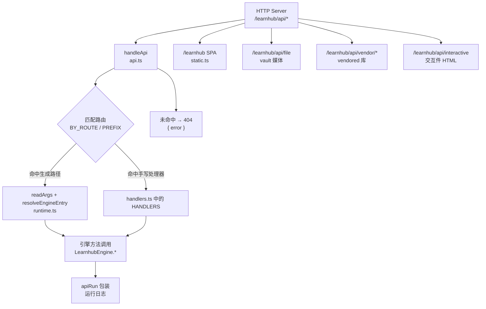
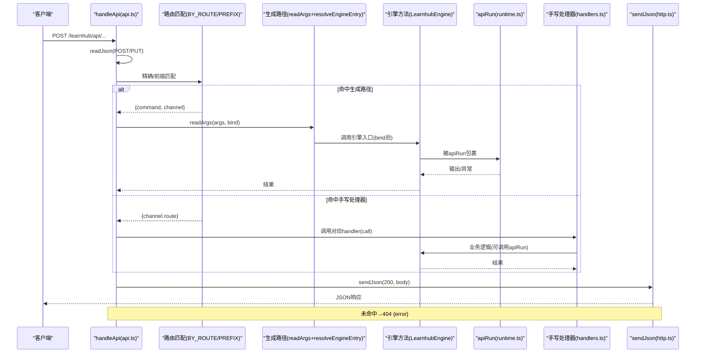
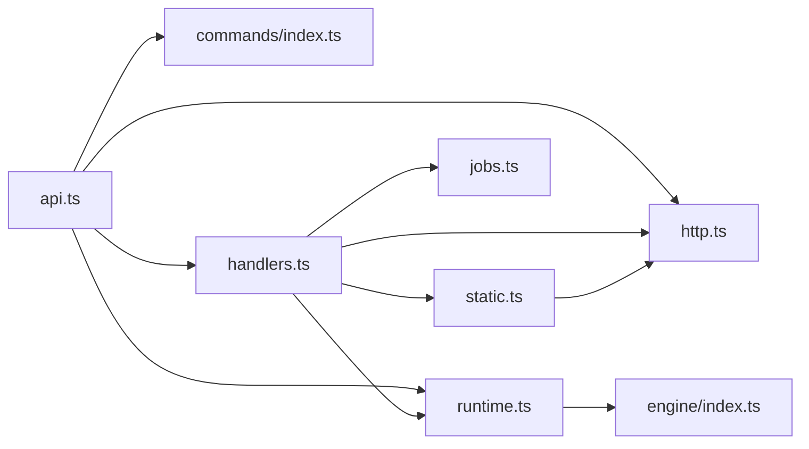

# HTTP API路由

<cite>
**本文引用的文件**
- [src/host/api.ts](file://src/host/api.ts)
- [src/host/route-table.ts](file://src/host/route-table.ts)
- [src/host/handlers.ts](file://src/host/handlers.ts)
- [src/host/http.ts](file://src/host/http.ts)
- [src/host/static.ts](file://src/host/static.ts)
- [src/host/runtime.ts](file://src/host/runtime.ts)
- [src/commands/index.ts](file://src/commands/index.ts)
- [src/commands/types.ts](file://src/commands/types.ts)
- [src/commands/学习.ts](file://src/commands/学习.ts)
- [src/engine/stuck-report.ts](file://src/engine/stuck-report.ts)
- [src/engine/growth-subsystem.ts](file://src/engine/growth-subsystem.ts)
- [src/engine/types.ts](file://src/engine/types.ts)
- [src/engine/params.ts](file://src/engine/params.ts)
- [docs/adr/0077-stuck-report-direct-evidence.md](file://docs/adr/0077-stuck-report-direct-evidence.md)
</cite>

## 更新摘要
**变更内容**
- 新增 POST /coach/stuck-report 端点文档，包含完整的请求响应格式、参数验证和错误处理说明
- 更新端点清单，添加卡点自报相关端点
- 增强频率限制和安全考虑章节，详细说明卡点自报的频控机制
- 补充客户端集成指南中的卡点自报调用示例
- 更新架构流程图，展示新的卡点自报处理流程

## 目录
1. [简介](#简介)
2. [项目结构](#项目结构)
3. [核心组件](#核心组件)
4. [架构总览](#架构总览)
5. [详细组件分析](#详细组件分析)
6. [依赖关系分析](#依赖关系分析)
7. [性能与安全考虑](#性能与安全考虑)
8. [故障排查指南](#故障排查指南)
9. [结论](#结论)
10. [附录：端点清单与调用示例](#附录端点清单与调用示例)

## 简介
本文件面向后端开发者与前端集成方，系统化说明 LearnHub 插件的 HTTP API 路由体系。重点包括：
- 路由表 route-table 的组织结构与端点定义规范
- RESTful 端点的请求/响应格式、认证方式、参数验证与错误处理
- handlers 模块的请求处理流程与中间件机制
- apiRun 统一封装模式与日志记录机制
- 静态文件服务与前端 SPA 路由支持
- **新增**：卡点自报（stuck-report）端点的完整实现细节
- 完整的 API 调用示例与客户端集成指南
- 安全、速率限制与性能优化建议

## 项目结构
HTTP 路由由"声明式命令注册表 + 数据化路由表 + 手写处理器"三部分构成，配合统一的 HTTP 技术层与运行时封装，形成稳定可扩展的分发体系。



图表来源
- [src/host/api.ts:48-83](file://src/host/api.ts#L48-L83)
- [src/host/static.ts:25-133](file://src/host/static.ts#L25-L133)
- [src/host/runtime.ts:198-253](file://src/host/runtime.ts#L198-L253)

章节来源
- [src/host/api.ts:1-84](file://src/host/api.ts#L1-L84)
- [src/host/static.ts:1-134](file://src/host/static.ts#L1-L134)
- [src/host/runtime.ts:1-255](file://src/host/runtime.ts#L1-L255)

## 核心组件
- 路由分发器 handleApi：解析 URL、读取请求体、查表匹配、按通道执行或回退到手写 handler，统一错误出口。
- 命令注册表 COMMANDS/WIRE_ARGS/BY_ROUTE：以 id 为键集中装配，提供面板/agent 双通道映射与参数绑定。
- 路由表构造器 get/post/put/getPrefix：声明式构建 RouteSpec，解耦 GET/POST/PUT 三段实现。
- 手写处理器集合 HANDLERS：覆盖无法走生成路径的复杂路由（队列、多入口、领域负载等）。
- HTTP 技术层 http.ts：JSON 读写、MIME 表、sendJson 序列化、KaTeX 注入。
- 静态服务 static.ts：SPA 页面、vault 媒体、vendor 库、交互件 HTML 的安全伺服。
- 运行时 runtime.ts：HostRuntime、引擎入口解析、apiRun 统一封装与运行日志。

章节来源
- [src/host/api.ts:1-84](file://src/host/api.ts#L1-L84)
- [src/commands/index.ts:1-72](file://src/commands/index.ts#L1-L72)
- [src/host/route-table.ts:1-75](file://src/host/route-table.ts#L1-L75)
- [src/host/handlers.ts:1-769](file://src/host/handlers.ts#L1-L769)
- [src/host/http.ts:1-55](file://src/host/http.ts#L1-L55)
- [src/host/static.ts:1-134](file://src/host/static.ts#L1-L134)
- [src/host/runtime.ts:1-255](file://src/host/runtime.ts#L1-L255)

## 架构总览
下图展示一次典型请求从进入服务器到返回响应的完整链路，包括生成路径与手写 handler 两条分支。



图表来源
- [src/host/api.ts:48-83](file://src/host/api.ts#L48-L83)
- [src/host/runtime.ts:198-253](file://src/host/runtime.ts#L198-L253)
- [src/host/http.ts:26-40](file://src/host/http.ts#L26-L40)

## 详细组件分析

### 路由表与端点定义规范
- 路由表项 RouteSpec：包含 method、route、handler，以及可选 prefix；同时预留 RegistrySlots 字段位，便于未来与命令注册表对齐。
- 构造器：get/post/put/getPrefix 分别生成 GET/POST/PUT/前缀匹配的路由项。
- 上下文 RouteCall：统一传递 rt、ctx、req、res、url、route、body，确保 handler 内访问一致。

章节来源
- [src/host/route-table.ts:16-75](file://src/host/route-table.ts#L16-L75)

### 命令注册表与面板通道
- 命令以 id 为键集中装配，每个命令可拥有多个 ChannelSpec（agent/panel），面板通道通过 route.method/path 暴露为 HTTP 端点。
- WIRE_ARGS 维护面板通道的参数键名映射，供 UI 侧做 camelCase↔snake_case 转换。
- BY_ROUTE 提供按 "METHOD PATH" 索引的命令，用于快速匹配。

章节来源
- [src/commands/index.ts:25-72](file://src/commands/index.ts#L25-L72)
- [src/commands/types.ts:54-98](file://src/commands/types.ts#L54-L98)

### 手写处理器 handlers 模块
- 覆盖无法走生成路径的复杂场景：队列型任务、多入口分派、无引擎入口、领域负载换算、面板独有键等。
- 所有 handler 统一通过 sendJson 返回 JSON，并通过 apiRun 包装业务调用以记录运行日志。
- 参数校验使用 params.ts 提供的 need/opt* 系列工具，失败抛出 ParamError，最终在 handleApi 中转为 500 错误响应。

章节来源
- [src/host/handlers.ts:1-769](file://src/host/handlers.ts#L1-L769)
- [src/host/http.ts:26-40](file://src/host/http.ts#L26-L40)
- [src/host/runtime.ts:243-253](file://src/host/runtime.ts#L243-L253)

### 统一封装 apiRun 与运行日志
- apiRun：对引擎调用进行 try/catch 包装，成功时记录输出摘要，失败时记录失败原因并向上抛出。
- runLog：将每次调用的输出写入运行日志文件，截断过长内容，避免影响主流程。
- 该机制保证所有引擎调用具备一致的观测性，且不影响业务语义。

章节来源
- [src/host/runtime.ts:195-253](file://src/host/runtime.ts#L195-L253)

### 静态文件服务与前端路由
- /learnhub：Vite SPA 资产伺服，index.html no-store，assets/* 带长期缓存；子路径不存在时回落 index.html。
- /learnhub/api/file：Vault 内媒体文件（图片等），白名单扩展名，防路径穿越。
- /learnhub/api/vendor/*：vendored 库（如 KaTeX/three）同源伺服，复用资产 MIME 表。
- /learnhub/api/interactive：课程根内 .html 交互件，CSP 严格限制外联，自动注入 KaTeX 渲染公式。

章节来源
- [src/host/static.ts:14-133](file://src/host/static.ts#L14-L133)
- [src/host/http.ts:8-24](file://src/host/http.ts#L8-L24)

### 请求处理流程与中间件机制
- 请求体读取：POST/PUT 先读体再查表，保持与历史行为一致（非法 JSON 未知路由仍返回 500）。
- 路由匹配：精确命中优先，其次前缀匹配（当前唯一前缀为 /vendor/）。
- 生成路径：readArgs 根据 args/schema/bind 解析参数，resolveEngineEntry 解析引擎入口并 bind this，调用后由 apiRun 包装。
- 手写 handler：当命令未声明 engine 或通道未走生成路径时，回退到 handlers.ts 中的具体实现。
- 错误处理：ParamError 携带中文消息与路由信息；其他错误原样透传；统一以 { error } 形式返回 500。

章节来源
- [src/host/api.ts:48-83](file://src/host/api.ts#L48-L83)
- [src/host/runtime.ts:198-215](file://src/host/runtime.ts#L198-L215)

### 卡点自报端点详解
**新增功能**：POST /coach/stuck-report 端点实现了学习者卡点自报的完整闭环流程。

#### 端点规格
- **路径**：`/learnhub/api/coach/stuck-report`
- **方法**：POST
- **认证**：无内置认证（建议在网关层实现）
- **请求体**：
  ```json
  {
    "course": "课程名称",
    "node": "节点名称", 
    "text": "卡点描述文本"
  }
  ```

#### 参数验证
- `course`：必填字符串，表示课程标识
- `node`：必填字符串，必须是课程图上存在的节点
- `text`：必填字符串，非空 trimmed 文本

#### 频率限制机制
- **同节点限制**：每学习日最多 1 条自报
- **总量限制**：全课程每日最多 5 条自报
- **限制策略**：超限直接拒绝，不记录也不触发回合

#### 处理流程
1. **参数验证**：检查必填字段和节点存在性
2. **频率检查**：验证是否超过限制
3. **落账存储**：将自报原文逐字存入 practice 流水
4. **立即入队**：强制触发教练回合（force=true）
5. **批量处理**：启动生长批处理，消费待处理的自报

#### 响应格式
成功响应：
```json
{
  "recorded": true,
  "ts": "时间戳",
  "queued": true,
  "message": "教练回合已启动：你的自报原话会随回合交给教练归因，建议稍后呈现。"
}
```

失败响应：
```json
{
  "error": "错误消息"
}
```

#### 错误处理
- **参数验证失败**：返回 500，包含具体的中文错误消息
- **频率限制触发**：返回 500，说明触发的限制类型
- **节点不存在**：返回 500，提示节点不在课程图上
- **文本为空**：返回 500，要求填写有效内容

章节来源
- [src/commands/学习.ts:118-133](file://src/commands/学习.ts#L118-L133)
- [src/host/handlers.ts:630-656](file://src/host/handlers.ts#L630-L656)
- [src/engine/growth-subsystem.ts:380-404](file://src/engine/growth-subsystem.ts#L380-L404)
- [src/engine/stuck-report.ts:1-84](file://src/engine/stuck-report.ts#L1-L84)
- [src/engine/types.ts:175-211](file://src/engine/types.ts#L175-L211)
- [src/engine/params.ts:61-62](file://src/engine/params.ts#L61-L62)
- [docs/adr/0077-stuck-report-direct-evidence.md:1-37](file://docs/adr/0077-stuck-report-direct-evidence.md#L1-L37)

## 依赖关系分析
- api.ts 依赖 commands/index.ts 的 BY_ROUTE 与 COMMAND_LIST，依赖 http.ts 的 readJson/sendJson，依赖 runtime.ts 的 apiRun/resolveEngineEntry，依赖 handlers.ts 的手写处理器。
- handlers.ts 依赖 http.ts、params.ts、runtime.ts、jobs.ts、static.ts、llm.ts 等宿主能力。
- static.ts 依赖 http.ts 的 MIME 表与 injectKatexIfMathed。
- runtime.ts 依赖 engine、agent、corpus、clock、vault-fs 等宿主能力。



图表来源
- [src/host/api.ts:13-23](file://src/host/api.ts#L13-L23)
- [src/host/handlers.ts:13-38](file://src/host/handlers.ts#L13-L38)
- [src/host/static.ts:7-12](file://src/host/static.ts#L7-L12)
- [src/host/runtime.ts:11-21](file://src/host/runtime.ts#L11-L21)

章节来源
- [src/host/api.ts:13-23](file://src/host/api.ts#L13-L23)
- [src/host/handlers.ts:13-38](file://src/host/handlers.ts#L13-L38)
- [src/host/static.ts:7-12](file://src/host/static.ts#L7-L12)
- [src/host/runtime.ts:11-21](file://src/host/runtime.ts#L11-L21)

## 性能与安全考虑
- 性能
  - 生成路径通过 readArgs/bind 直调引擎，减少样板代码；队列型任务入队即返回，避免阻塞请求。
  - 静态资源区分缓存策略：assets/* 长期缓存，index.html 与交互件 no-store，保障更新即时生效。
  - 运行日志异步落盘，失败静默，不阻塞主流程。
  - **新增**：卡点自报采用立即入队策略，避免同步阻塞用户请求。
- 安全
  - 路径穿越防护：/file、/vendor、/interactive 均拒绝 .. 与越界路径。
  - CSP 限制：交互件默认 default-src 'none'，仅放开必要源；connect-src 封死外联。
  - 白名单 MIME：仅允许已知扩展名，防止任意文件类型泄露。
  - **新增**：卡点自报的频率限制防止滥用和资源浪费。
- 速率限制
  - 当前未在 HTTP 层实现全局限流；建议在网关或反向代理层实施基于 IP/用户维度的速率限制，保护长耗时接口（如 /smoke、/quality-review、/spike）。
  - **新增**：卡点自报内置频率限制（同节点每日1条，全课程每日5条）。
- 优化建议
  - 对高频只读接口（如 /status、/courses、/review-queue）启用应用层缓存或 CDN 缓存头。
  - 对批量任务（生成、评审、冒烟）采用异步队列与进度查询，避免同步阻塞。
  - 对大对象响应考虑分页或增量拉取，降低网络与序列化开销。

[本节为通用指导，不直接分析具体文件]

## 故障排查指南
- 常见错误形态
  - 404：未知路由，响应体包含原始方法与剥前缀后的路径，便于定位。
  - 500：参数校验失败（ParamError）或引擎调用异常，响应体包含中文错误消息与路由信息。
- 定位步骤
  - 检查请求体是否为合法 JSON（POST/PUT 先读体再查表）。
  - 核对路由是否已在命令注册表中声明（BY_ROUTE），或是否在 handlers.ts 中有对应实现。
  - 查看运行日志文件，确认引擎调用是否成功及输出摘要。
- 修复建议
  - 新增端点时，先在命令注册表中声明 panel 通道，并在 handlers.ts 补充手写处理器（如需）。
  - 参数校验失败时，调整前端传参类型与命名，遵循 WIRE_ARGS 约定。
  - 若出现路径穿越或 MIME 不支持错误，检查请求路径与扩展名是否符合白名单。
- **卡点自报特定问题**
  - 频率限制错误：检查是否超过每日限制，等待下一学习日或更换节点。
  - 节点不存在：确认节点名称与课程图上的节点完全匹配。
  - 文本为空：确保提交的 text 字段包含有效内容。

章节来源
- [src/host/api.ts:58-82](file://src/host/api.ts#L58-L82)
- [src/host/static.ts:62-133](file://src/host/static.ts#L62-L133)
- [src/host/runtime.ts:217-231](file://src/host/runtime.ts#L217-L231)

## 结论
LearnHub 的 HTTP API 路由体系以"声明式命令注册表 + 数据化路由表 + 手写处理器"为核心，结合统一的 HTTP 技术层与运行时封装，实现了高内聚、低耦合、易扩展的后端服务架构。通过严格的参数校验、安全控制与运行日志，保障了接口的稳定性与可观测性。**新增的卡点自报端点**进一步完善了学习体验反馈机制，提供了实时的学习障碍检测和处理能力。建议在生产环境中结合网关层实现速率限制与缓存策略，进一步提升性能与安全性。

[本节为总结性内容，不直接分析具体文件]

## 附录：端点清单与调用示例

### 端点清单（节选）
以下为部分关键端点及其用途概览（完整列表参见 handlers.ts 与命令注册表）：
- GET /status：系统状态与 LLM 配置
- GET /courses：已启用课程列表
- GET /recommend：推荐节点
- GET /file：Vault 媒体文件
- GET /vendor/*：vendored 库
- GET /interactive：交互件 HTML
- GET /note：笔记解析
- GET /graph：图谱分析
- GET /review-queue：复习队列
- GET /probation：实验面状态
- GET /experiments：实验模板与报告
- GET /generate/status：生成任务状态
- GET /explain-pack：讲解包
- GET /anki/status：Anki 通道状态
- **POST /coach/stuck-report：卡点自报（新增）**
- POST /smoke：生成冒烟测试
- POST /spike：工具调用通道 Spike
- POST /quality-review：离线质量评审
- PUT /jol：JOL 抽查配置
- PUT /calibration/hints：校准提示开关
- PUT /sleep：睡眠建议开关
- PUT /question-update：题目更新
- POST /habits/create/repeat/archive：习惯管理
- POST /skills/archive/maintenance：技能归档与维护
- POST /rebuild：重建
- POST /node/skip/pin/complete：节点操作
- POST /feedback：反馈提交
- POST /proposals/apply/reject：提案应用/拒绝
- POST /experiments/apply/stop：实验启停
- POST /sandbox/run：沙盘推演
- POST /generate/resume/section/course/reset：生成相关
- POST /interactive/settle：交互件成绩结算
- POST /tutor/explain-back/explain-feedback/explain-archive：讲解与答疑
- POST /note-source/generate：笔记源出题
- POST /anki/export/import：Anki 导入导出
- POST /learner-rate/error-answer/error-generate/error-archive：学习者卡片与错题卡
- POST /learner-add/learner-archive：学习者产出
- POST /question-generate/question-answer/question-rate/question-forget：题库问答
- POST /question-dispute/review/apply：瑕疵题申诉
- POST /band-session：难度带会话日志
- POST /question-add/question-archive：题目增删归档
- POST /difficulty-advice-dismiss：难度建议忽略/恢复
- POST /course/delete：课程删除
- POST /generate/cancel：取消生成
- POST /coach/growth/compass：教练生长与罗盘
- POST /seed/propose：种子起草
- POST /endpoint/add/remove：终点管理
- POST /project/create/plan/generate/milestone/generate/decompile/exec：项目管理
- POST /kata/save/convert/intention：周复盘与意图转换

### 请求/响应格式与认证
- 认证方式：当前 HTTP 层未内置认证；建议在反向代理或网关层实现鉴权（如 JWT、OAuth2）。
- 请求体：POST/PUT 需发送 JSON；GET 参数通过 query string 传递。
- 响应体：统一 JSON；成功返回业务对象，失败返回 { error: string }。
- 参数验证：服务端使用 need/opt* 系列工具进行强校验，非法参数返回 500 并附带中文消息。

### 客户端集成指南
- 基础 URL：/learnhub/api
- 常用方法：
  - 获取状态：GET /learnhub/api/status
  - 获取课程：GET /learnhub/api/courses
  - **提交卡点自报：POST /learnhub/api/coach/stuck-report**
  - 提交反馈：POST /learnhub/api/feedback
  - 生成任务：POST /learnhub/api/generate
  - 查询队列：GET /learnhub/api/generate/status
- 错误处理：捕获 404/500，读取 error 字段并提示用户。
- 静态资源：
  - SPA：/learnhub（自动重定向至 /learnhub/）
  - 媒体：/learnhub/api/file?path=相对路径
  - 库：/learnhub/api/vendor/*
  - 交互件：/learnhub/api/interactive?path=相对路径

### 调用示例（概念性）
- 获取状态
  - 请求：GET /learnhub/api/status
  - 响应：{ ...status, llm: {...} }
- **提交卡点自报（新增）**
  - 请求：POST /learnhub/api/coach/stuck-report
  - 请求体：{ course: "数学", node: "入门", text: "这节的导数和上一节的极限对不上。" }
  - 响应：{ recorded: true, ts: "2026-09-14T09:00:00Z", queued: true, message: "教练回合已启动：你的自报原话会随回合交给教练归因，建议稍后呈现。" }
- 提交反馈
  - 请求：POST /learnhub/api/feedback
  - 请求体：{ path: "课程/笔记/xxx.md" }
  - 响应：{ message: "..." }
- 生成任务
  - 请求：POST /learnhub/api/generate
  - 请求体：{ course: "课程名", node: "节点名", style?: "风格" }
  - 响应：任务入队结果
- 查询生成状态
  - 请求：GET /learnhub/api/generate/status
  - 响应：任务注册表快照

[本节为概念性示例，不直接引用具体代码片段]