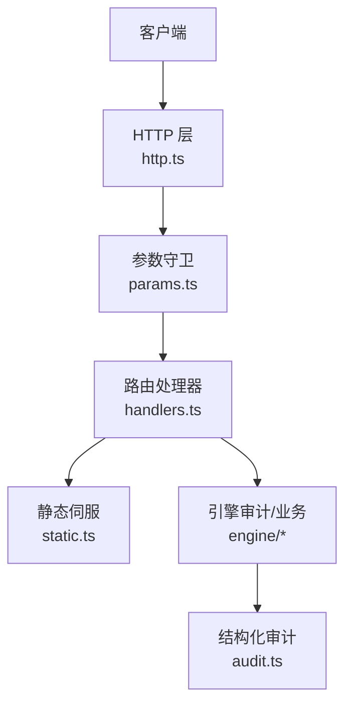
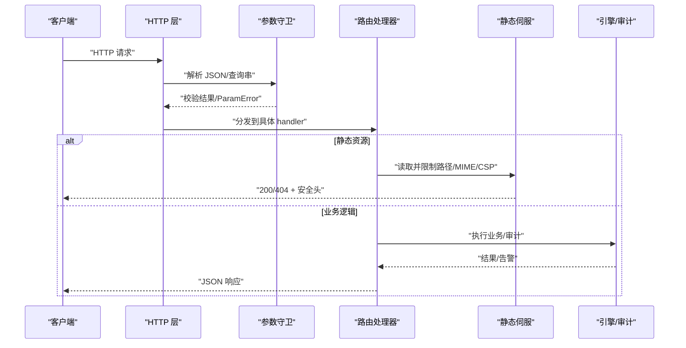
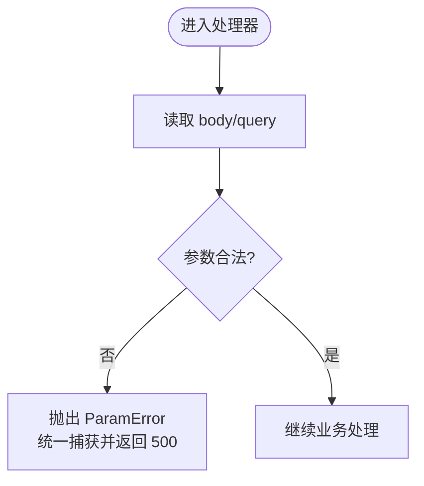
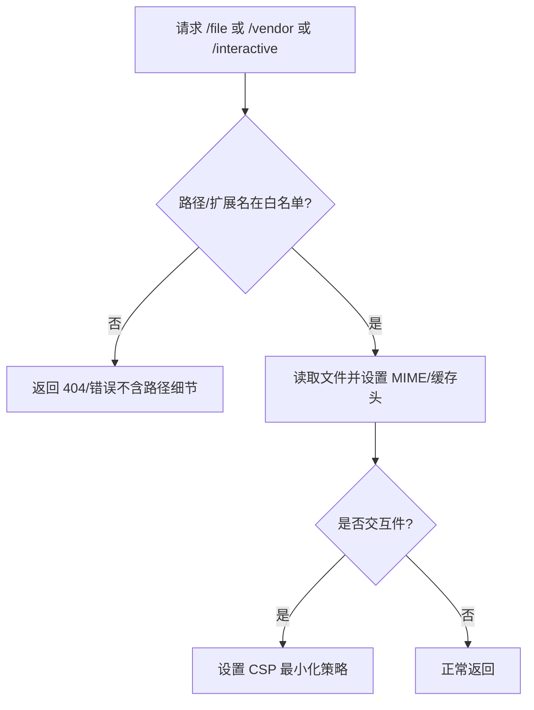
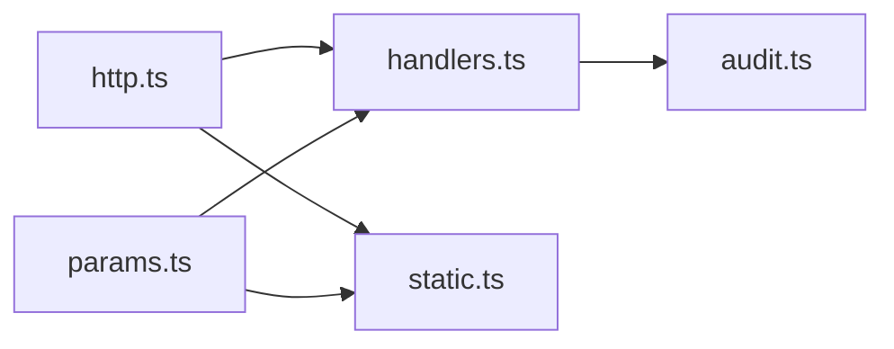

# 安全与认证

<cite>
**本文引用的文件**
- [src/host/http.ts](file://src/host/http.ts)
- [src/host/static.ts](file://src/host/static.ts)
- [src/host/params.ts](file://src/host/params.ts)
- [src/host/handlers.ts](file://src/host/handlers.ts)
- [src/host/route-table.ts](file://src/host/route-table.ts)
- [tests/host-routes.test.ts](file://tests/host-routes.test.ts)
- [src/engine/audit.ts](file://src/engine/audit.ts)
</cite>

## 目录
1. [简介](#简介)
2. [项目结构](#项目结构)
3. [核心组件](#核心组件)
4. [架构总览](#架构总览)
5. [详细组件分析](#详细组件分析)
6. [依赖关系分析](#依赖关系分析)
7. [性能与安全考量](#性能与安全考量)
8. [故障排查指南](#故障排查指南)
9. [结论](#结论)
10. [附录](#附录)

## 简介
本文件聚焦于该插件的 HTTP API 安全与认证机制，覆盖身份验证流程、令牌验证与权限控制现状；解释 CORS 配置与安全头设置；描述输入验证、SQL 注入防护与 XSS 防护措施；说明速率限制实现与防滥用策略；提供安全最佳实践与常见漏洞防护指南；并包含审计日志与安全事件监控。

## 项目结构
- 请求进入宿主 HTTP 层后，统一通过参数守卫进行类型与必填校验，随后分发到路由处理器。
- 静态资源（面板、交互件、vendor 库）由独立模块处理，具备路径白名单与 CSP 等安全约束。
- 引擎侧提供结构性审计能力，用于发现数据与图结构问题，辅助安全与健康度评估。

图表来源
- [src/host/http.ts:26-32](file://src/host/http.ts#L26-L32)
- [src/host/params.ts:36-93](file://src/host/params.ts#L36-L93)
- [src/host/handlers.ts:101-137](file://src/host/handlers.ts#L101-L137)
- [src/host/static.ts:62-133](file://src/host/static.ts#L62-L133)
- [src/engine/audit.ts:35-33](file://src/engine/audit.ts#L35-L33)

章节来源
- [src/host/http.ts:1-55](file://src/host/http.ts#L1-L55)
- [src/host/params.ts:1-230](file://src/host/params.ts#L1-L230)
- [src/host/handlers.ts:1-742](file://src/host/handlers.ts#L1-L742)
- [src/host/static.ts:1-134](file://src/host/static.ts#L1-L134)
- [src/engine/audit.ts:1-324](file://src/engine/audit.ts#L1-L324)

## 核心组件
- 参数守卫：集中化的输入校验与错误消息规范，确保所有请求体与查询串的类型正确性与完整性。
- 路由与处理器：按方法+路径分派，统一响应格式与状态码分布。
- 静态伺服：对面板、交互件与 vendor 资产进行严格路径白名单与 MIME 限制，并对交互件启用最小化 CSP。
- 结构化审计：对课程图、frontmatter、enc 边等进行健康检查与告警，辅助发现潜在安全问题（如环、断边、非法 stage）。

章节来源
- [src/host/params.ts:1-230](file://src/host/params.ts#L1-L230)
- [src/host/handlers.ts:101-742](file://src/host/handlers.ts#L101-L742)
- [src/host/static.ts:1-134](file://src/host/static.ts#L1-L134)
- [src/engine/audit.ts:1-324](file://src/engine/audit.ts#L1-L324)

## 架构总览
下图展示从请求进入到响应返回的安全关键路径：参数守卫→路由分发→处理器→静态/引擎调用→结构化审计。

图表来源
- [src/host/http.ts:26-32](file://src/host/http.ts#L26-L32)
- [src/host/params.ts:36-93](file://src/host/params.ts#L36-L93)
- [src/host/handlers.ts:101-137](file://src/host/handlers.ts#L101-L137)
- [src/host/static.ts:62-133](file://src/host/static.ts#L62-L133)
- [src/engine/audit.ts:35-33](file://src/engine/audit.ts#L35-L33)

## 详细组件分析

### 身份验证、令牌与权限控制
- 当前代码库未实现基于令牌的身份验证或会话鉴权机制。
- 所有路由处理器均直接接收请求并执行，无统一的鉴权中间件或权限检查。
- 建议：在路由分发前引入鉴权中间件，校验令牌/会话，并按角色/范围授权访问敏感接口（如生成、重置、删除等）。

章节来源
- [src/host/handlers.ts:101-742](file://src/host/handlers.ts#L101-L742)

### 输入验证与参数守卫
- 所有请求参数通过集中式守卫函数进行类型与必填校验，缺失或类型不符将抛出 ParamError，并由分发层统一捕获并附加路由信息。
- 可选参数遵循“省略或合法”语义，非法值会 fail loud。
- 查询串与 JSON 体分别使用 needQuery/optQuery 与 need/opt* 系列函数取值，避免手写 typeof 判断。

图表来源
- [src/host/params.ts:36-93](file://src/host/params.ts#L36-L93)
- [tests/host-routes.test.ts:108-129](file://tests/host-routes.test.ts#L108-L129)

章节来源
- [src/host/params.ts:1-230](file://src/host/params.ts#L1-L230)
- [tests/host-routes.test.ts:108-129](file://tests/host-routes.test.ts#L108-L129)

### 静态资源与跨域/安全头
- 面板 SPA：index.html 不缓存，assets 可长期缓存；错误不回显内部路径。
- /file：仅允许 vault 相对路径且扩展名在白名单内，禁止路径穿越。
- /vendor：限制在 vendor 目录内，MIME 白名单复用面板资产表。
- /interactive：仅允许 .html 且必须在启用课程根内；CSP 设置为 default-src 'none'，仅放开必要源（self、unsafe-inline 脚本/样式、data 图片字体），connect-src 封死外联。

图表来源
- [src/host/static.ts:17-23](file://src/host/static.ts#L17-L23)
- [src/host/static.ts:62-133](file://src/host/static.ts#L62-L133)

章节来源
- [src/host/static.ts:1-134](file://src/host/static.ts#L1-L134)

### SQL 注入防护
- 本项目为 Node.js 插件，未直接使用 SQL 数据库；因此不存在传统 SQL 注入风险面。
- 若未来引入数据库，应使用参数化查询与 ORM 白名单字段映射，避免字符串拼接。

[本节为通用指导，无需源码引用]

### XSS 防护
- 交互件页面通过 CSP 限制脚本与资源来源，降低 XSS 风险。
- 内容渲染与输出需遵循最小信任原则，对用户输入进行转义与白名单过滤。
- 建议对所有用户可控 HTML 输出进行 DOMPurify 类清洗，并限制可使用的标签与属性。

章节来源
- [src/host/static.ts:104-133](file://src/host/static.ts#L104-L133)

### 速率限制与防滥用
- 当前未发现全局速率限制或防重放/防刷机制。
- 部分写操作存在“一卡一天一次”等应用级去重逻辑（例如交互件成绩结算、自评推进），但并非通用限流。
- 建议：
  - 在网关或中间件层实施 IP/用户维度的速率限制（令牌桶/滑动窗口）。
  - 对敏感接口（生成、重置、删除）增加二次确认与节流。
  - 记录异常请求模式并触发告警。

章节来源
- [src/host/handlers.ts:410-417](file://src/host/handlers.ts#L410-L417)

### 审计日志与安全事件监控
- 结构化审计：对课程图、frontmatter、enc 边等进行健康检查，输出 ERROR/WARN/INFO，有助于发现潜在的数据一致性与安全风险。
- 建议：
  - 将审计结果纳入持续集成与发布门禁。
  - 对高风险变更（模板、提示词、契约）建立版本登记与回放比对。
  - 结合生成语料捕获与质量评审，形成闭环监控。

章节来源
- [src/engine/audit.ts:1-324](file://src/engine/audit.ts#L1-L324)

## 依赖关系分析
- http.ts 提供 sendJson/readJson 等基础能力，被 handlers 与 static 复用。
- params.ts 作为唯一参数校验入口，被 handlers 与 static 调用。
- handlers.ts 负责路由分发与业务编排，依赖 params、http、jobs、llm 等。
- static.ts 专注静态资源安全伺服，依赖 http 与 params。
- audit.ts 提供引擎侧健康检查，供运维与门禁使用。

图表来源
- [src/host/http.ts:26-32](file://src/host/http.ts#L26-L32)
- [src/host/params.ts:36-93](file://src/host/params.ts#L36-L93)
- [src/host/handlers.ts:101-137](file://src/host/handlers.ts#L101-L137)
- [src/host/static.ts:62-133](file://src/host/static.ts#L62-L133)
- [src/engine/audit.ts:35-33](file://src/engine/audit.ts#L35-L33)

章节来源
- [src/host/http.ts:1-55](file://src/host/http.ts#L1-L55)
- [src/host/params.ts:1-230](file://src/host/params.ts#L1-L230)
- [src/host/handlers.ts:1-742](file://src/host/handlers.ts#L1-L742)
- [src/host/static.ts:1-134](file://src/host/static.ts#L1-L134)
- [src/engine/audit.ts:1-324](file://src/engine/audit.ts#L1-L324)

## 性能与安全考量
- 响应头：JSON 响应默认 no-store，避免缓存敏感数据。
- 静态资源：assets 可长期缓存，index.html 不缓存以保证更新即时生效。
- CSP：交互件启用最小化策略，阻断不必要的外联资源。
- 输入校验：集中化守卫减少重复逻辑与不一致行为，提升安全性与可维护性。
- 审计：结构化审计帮助提前发现数据与图结构问题，降低生产风险。

[本节为通用指导，无需源码引用]

## 故障排查指南
- 参数错误：当出现 ParamError 时，检查请求体/查询串是否符合 schema；注意可选参数的“非法即拒绝”语义。
- 静态资源 404：确认路径是否在白名单内、扩展名是否受支持、是否存在路径穿越尝试。
- 交互件加载失败：检查 CSP 是否阻止了必要资源；确认文件位于启用课程根内且为 .html。
- 审计告警：根据 ERROR/WARN/INFO 逐项修复，重点关注 E1/E2/E3/E4/E5/E6/E7 与 R1/R2/R4/R6/R8/R10/R13/R17。

章节来源
- [src/host/params.ts:36-93](file://src/host/params.ts#L36-L93)
- [src/host/static.ts:62-133](file://src/host/static.ts#L62-L133)
- [src/engine/audit.ts:35-33](file://src/engine/audit.ts#L35-L33)

## 结论
当前系统以严格的输入验证与静态资源安全策略为核心，尚未实现统一的身份验证与权限控制。建议优先引入鉴权中间件、速率限制与更全面的审计监控，以构建端到端的安全闭环。同时，保持 CSP、MIME 白名单与参数守卫的高标准，持续降低 XSS、路径穿越与注入风险。

[本节为总结性内容，无需源码引用]

## 附录
- 安全最佳实践清单
  - 统一鉴权：在路由分发前校验令牌与会话，按角色授权。
  - 速率限制：对敏感接口实施 IP/用户维度限流，防止滥用。
  - 输入校验：继续使用集中式参数守卫，避免手写类型判断。
  - 输出安全：对用户可控 HTML 进行清洗，遵循最小信任原则。
  - 审计与监控：将结构化审计纳入 CI/CD，结合生成语料与质量评审形成闭环。
  - 日志与告警：记录异常请求与审计告警，及时响应。

[本节为通用指导，无需源码引用]