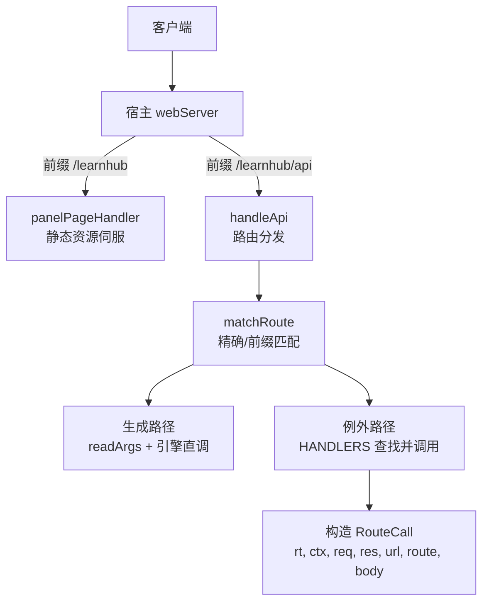
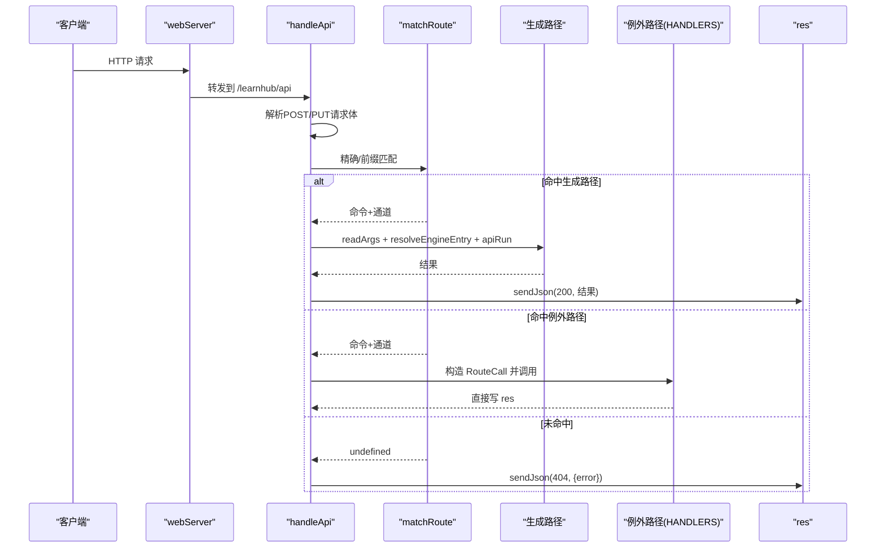
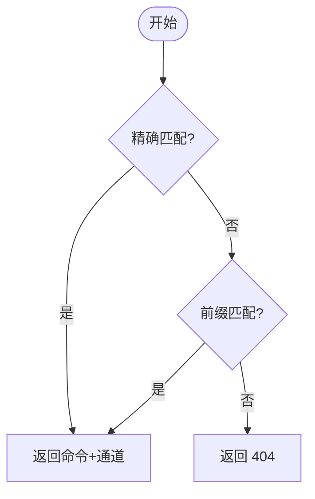
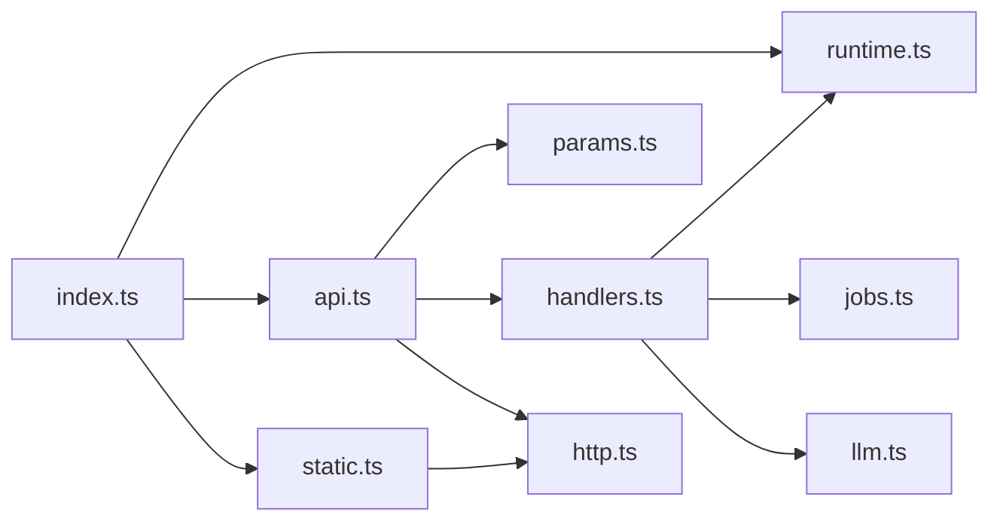
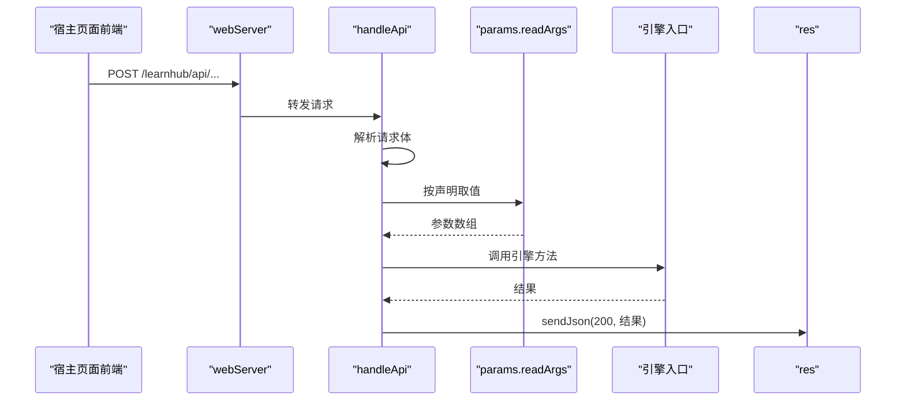

# 请求处理流程

<cite>
**本文引用的文件**
- [src/index.ts](file://src/index.ts)
- [src/host/api.ts](file://src/host/api.ts)
- [src/host/route-table.ts](file://src/host/route-table.ts)
- [src/host/handlers.ts](file://src/host/handlers.ts)
- [src/host/http.ts](file://src/host/http.ts)
- [src/host/runtime.ts](file://src/host/runtime.ts)
- [src/host/params.ts](file://src/host/params.ts)
- [src/host/static.ts](file://src/host/static.ts)
</cite>

## 目录
1. [简介](#简介)
2. [项目结构](#项目结构)
3. [核心组件](#核心组件)
4. [架构总览](#架构总览)
5. [详细组件分析](#详细组件分析)
6. [依赖关系分析](#依赖关系分析)
7. [性能考量](#性能考量)
8. [故障排查指南](#故障排查指南)
9. [结论](#结论)
10. [附录](#附录)

## 简介
本文面向“HTTP 请求的完整处理流程”，围绕以下目标展开：
- RouteCall 上下文对象的构建过程，包括 HostRuntime、Context、请求消息与响应的封装。
- 路由匹配算法：精确匹配与前缀匹配的机制。
- 请求体解析、参数验证与错误处理的统一流程。
- 中间件机制与执行顺序（基于宿主 webServer 前缀注册）。
- 自定义处理器开发与调试指南。

## 项目结构
本插件在宿主环境中通过 Cordis 的 webServer 能力注册两条前缀路由：
- /learnhub：独立面板 SPA 静态资源伺服。
- /learnhub/api：API 路由分发入口，内部再按命令注册表与手写 handler 进行分发。

图表来源
- [src/index.ts:56-82](file://src/index.ts#L56-L82)
- [src/host/api.ts:48-83](file://src/host/api.ts#L48-L83)
- [src/host/static.ts:26-60](file://src/host/static.ts#L26-L60)

章节来源
- [src/index.ts:56-82](file://src/index.ts#L56-L82)

## 核心组件
- 运行时 HostRuntime：承载引擎实例、Agent 缝、任务表、标志位等可配置运行态。
- 路由分发 handleApi：读取请求体、匹配路由、选择生成路径或手写 handler。
- 参数校验 params：统一的 need/opt 系列守卫与 ParamError 语义。
- HTTP 工具 http：JSON 读写、MIME、KaTeX 注入等。
- 静态伺服 static：SPA、/file、/vendor、/interactive。
- 手写 handlers：非生成路径的例外处理器集合。

章节来源
- [src/host/runtime.ts:115-193](file://src/host/runtime.ts#L115-L193)
- [src/host/api.ts:48-83](file://src/host/api.ts#L48-L83)
- [src/host/params.ts:1-230](file://src/host/params.ts#L1-L230)
- [src/host/http.ts:26-55](file://src/host/http.ts#L26-L55)
- [src/host/static.ts:1-134](file://src/host/static.ts#L1-L134)
- [src/host/handlers.ts:101-742](file://src/host/handlers.ts#L101-L742)

## 架构总览
从请求进入至响应返回的关键阶段如下：
1. 宿主 webServer 将 /learnhub/* 与 /learnhub/api/* 分别交给 panelPageHandler 与 handleApi。
2. handleApi 先解析 POST/PUT 的请求体（即使未命中路由也会读体），然后进行路由匹配。
3. 匹配成功：
   - 若命令有 engine 且通道有 bind，走“生成路径”：用 readArgs 按声明取值，resolveEngineEntry 绑定并调用引擎方法，统一经 apiRun 记录日志后 sendJson(200)。
   - 否则走“例外路径”：在 HANDLERS 中查找对应 method+route 的处理器，构造 RouteCall 并调用。
4. 匹配失败：返回 404，错误信息包含原始方法与剥去前缀后的路由。
5. 任何异常：统一 catch，ParamError 附加路由名，其他错误原样透传，均返回 500。

图表来源
- [src/host/api.ts:48-83](file://src/host/api.ts#L48-L83)
- [src/host/runtime.ts:198-215](file://src/host/runtime.ts#L198-L215)
- [src/host/runtime.ts:240-253](file://src/host/runtime.ts#L240-L253)

## 详细组件分析

### RouteCall 上下文对象与构建
- 构建位置：当命中“例外路径”时，在分发层构造 RouteCall 对象，包含：
  - rt：HostRuntime，提供引擎、Agent、任务表、标志位等。
  - ctx：Cordis Context，用于工具注册、效果副作用等。
  - req/res：Node IncomingMessage/ServerResponse，供处理器直接写入响应。
  - url：URL 对象，便于查询参数与路径解析。
  - route：已剥离 /learnhub/api 前缀的路径，保持与旧实现一致。
  - body：POST/PUT 请求体解析后的 JSON 对象；GET 恒为 {}。
- 使用方式：例外处理器接收 RouteCall，按需读取 url/body，调用 rt 暴露的能力，并通过 res 写出响应。

章节来源
- [src/host/route-table.ts:19-32](file://src/host/route-table.ts#L19-L32)
- [src/host/api.ts:72-76](file://src/host/api.ts#L72-L76)
- [src/host/http.ts:34-40](file://src/host/http.ts#L34-L40)

### 路由匹配算法（精确匹配与前缀匹配）
- 精确匹配：以 “METHOD /path” 作为键，在 BY_ROUTE 表中查找。
- 前缀匹配：当精确未命中时，遍历前缀路由表，检查 route 是否以某 path 开头（仅对 GET /vendor/ 等场景）。
- 匹配结果：返回 CommandSpec 与 ChannelSpec，后续据此决定走生成路径还是例外路径。

图表来源
- [src/host/api.ts:34-46](file://src/host/api.ts#L34-L46)

章节来源
- [src/host/api.ts:34-46](file://src/host/api.ts#L34-L46)

### 请求体解析、参数验证与错误处理
- 请求体解析：
  - POST/PUT：在读体阶段即尝试解析 JSON，无论路由是否命中都会读取（保证非法 JSON 仍返回 500）。
  - GET：body 恒为空对象 {}。
- 参数验证：
  - 生成路径：使用 readArgs 根据命令 args 与通道 bind 声明式取值，支持 query/body 两种来源，严格类型校验。
  - 例外路径：handlers 内使用 need/opt 系列守卫函数进行强校验，非法可选参数会抛出 ParamError。
- 错误处理：
  - ParamError：统一捕获并追加路由名，返回 500，错误消息中文可读。
  - 业务错误：由引擎或处理器抛出，统一 catch 后返回 500。
  - 未命中路由：返回 404，错误信息包含方法与路由。

章节来源
- [src/host/api.ts:48-83](file://src/host/api.ts#L48-L83)
- [src/host/params.ts:1-230](file://src/host/params.ts#L1-L230)
- [src/host/handlers.ts:181-249](file://src/host/handlers.ts#L181-L249)

### 中间件机制与执行顺序
- 本仓库采用“前缀注册”的中间件模式：
  - 宿主 webServer 在前缀处拦截请求，依次分派给注册的处理器。
  - 本插件注册了两条前缀：/learnhub（静态页面）与 /learnhub/api（API 分发）。
- 执行顺序：
  - 请求到达宿主 webServer，按注册顺序匹配前缀。
  - /learnhub 交由 panelPageHandler 处理静态资源。
  - /learnhub/api 交由 handleApi 进行路由分发。
- 扩展点：
  - 可在宿主侧继续注册新的前缀处理器，或在 handleApi 内新增分支逻辑。

章节来源
- [src/index.ts:72-82](file://src/index.ts#L72-L82)
- [src/host/static.ts:26-60](file://src/host/static.ts#L26-L60)
- [src/host/api.ts:48-83](file://src/host/api.ts#L48-L83)

### 自定义处理器开发与调试指南
- 开发步骤：
  - 在 handlers.ts 中添加新的 method+route 键对应的异步处理器。
  - 处理器接收 RouteCall，使用 params 中的 need/opt 系列进行参数校验。
  - 通过 rt 调用引擎能力，必要时使用 apiRun 记录日志。
  - 使用 sendJson(res, code, body) 输出响应。
- 调试建议：
  - 利用 runLog 与 apiRun 的运行日志落盘，定位调用链与输出摘要。
  - 关注 ParamError 的错误消息，确保必填/可选字段符合声明。
  - 对于静态资源问题，检查 MIME 白名单与路径安全（防 ../ 逃逸）。

章节来源
- [src/host/handlers.ts:101-742](file://src/host/handlers.ts#L101-L742)
- [src/host/runtime.ts:217-253](file://src/host/runtime.ts#L217-L253)
- [src/host/http.ts:26-55](file://src/host/http.ts#L26-L55)

## 依赖关系分析
- index.ts 装配 runtime、恢复任务、注册工具与路由。
- api.ts 依赖 commands 注册表、http、params、runtime、handlers。
- handlers.ts 依赖 http、params、runtime、jobs、static、llm 等。
- runtime.ts 提供 HostRuntime、引擎入口解析、运行日志。
- params.ts 提供参数校验与注册表驱动取值。
- http.ts 提供 JSON 读写与 MIME 映射。
- static.ts 提供静态资源伺服与安全控制。

图表来源
- [src/index.ts:56-82](file://src/index.ts#L56-L82)
- [src/host/api.ts:48-83](file://src/host/api.ts#L48-L83)
- [src/host/handlers.ts:101-742](file://src/host/handlers.ts#L101-L742)
- [src/host/runtime.ts:115-253](file://src/host/runtime.ts#L115-L253)
- [src/host/params.ts:1-230](file://src/host/params.ts#L1-L230)
- [src/host/http.ts:26-55](file://src/host/http.ts#L26-L55)
- [src/host/static.ts:1-134](file://src/host/static.ts#L1-L134)

章节来源
- [src/index.ts:56-82](file://src/index.ts#L56-L82)
- [src/host/api.ts:48-83](file://src/host/api.ts#L48-L83)
- [src/host/handlers.ts:101-742](file://src/host/handlers.ts#L101-L742)
- [src/host/runtime.ts:115-253](file://src/host/runtime.ts#L115-L253)
- [src/host/params.ts:1-230](file://src/host/params.ts#L1-L230)
- [src/host/http.ts:26-55](file://src/host/http.ts#L26-L55)
- [src/host/static.ts:1-134](file://src/host/static.ts#L1-L134)

## 性能考量
- 请求体读取：POST/PUT 一律先读体，避免重复 I/O；但会增加未命中路由时的开销。
- 路由匹配：精确匹配 O(1)，前缀匹配线性扫描，当前前缀项较少，影响有限。
- 日志记录：apiRun/runLog 每次调用落盘，注意磁盘 IO 与截断策略。
- 静态资源：缓存头区分 assets 与 index.html，减少重复传输。
- 并发：队列化生成任务，HTTP 立即返回，避免阻塞。

[本节为通用指导，不直接分析具体文件]

## 故障排查指南
- 404 未知路由：
  - 检查 method 与 route 是否与注册表或 handlers 一致。
  - 确认前缀匹配是否正确（如 /vendor/）。
- 500 参数错误：
  - 查看 ParamError 消息，确认必填/可选字段类型与范围。
  - 生成路径下核对 args 声明与 channel.bind 顺序。
- 静态资源 404/500：
  - 检查扩展名是否在白名单，路径是否包含 .. 逃逸。
  - 确认构建产物存在（web/dist）。
- 运行日志：
  - 查看 state/运行日志.md，定位引擎调用与失败原因。

章节来源
- [src/host/api.ts:48-83](file://src/host/api.ts#L48-L83)
- [src/host/params.ts:1-230](file://src/host/params.ts#L1-L230)
- [src/host/static.ts:62-134](file://src/host/static.ts#L62-L134)
- [src/host/runtime.ts:217-253](file://src/host/runtime.ts#L217-L253)

## 结论
本插件通过“注册表驱动 + 手写例外”的双轨路由分发，实现了清晰、可维护的 HTTP 处理流程。RouteCall 提供了统一的上下文封装，params 保证了参数校验的一致性，apiRun/runLog 提供了统一的日志出口。结合宿主的前缀中间件机制，可扩展性强、调试友好。

[本节为总结性内容，不直接分析具体文件]

## 附录
- 关键流程图（代码级）

图表来源
- [src/host/api.ts:48-83](file://src/host/api.ts#L48-L83)
- [src/host/params.ts:180-229](file://src/host/params.ts#L180-L229)
- [src/host/runtime.ts:198-215](file://src/host/runtime.ts#L198-L215)
- [src/host/runtime.ts:240-253](file://src/host/runtime.ts#L240-L253)