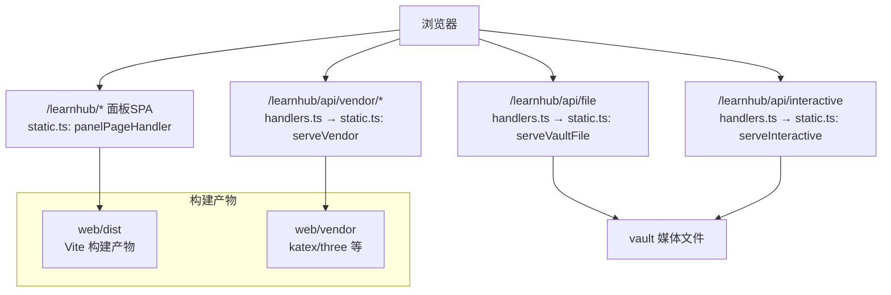
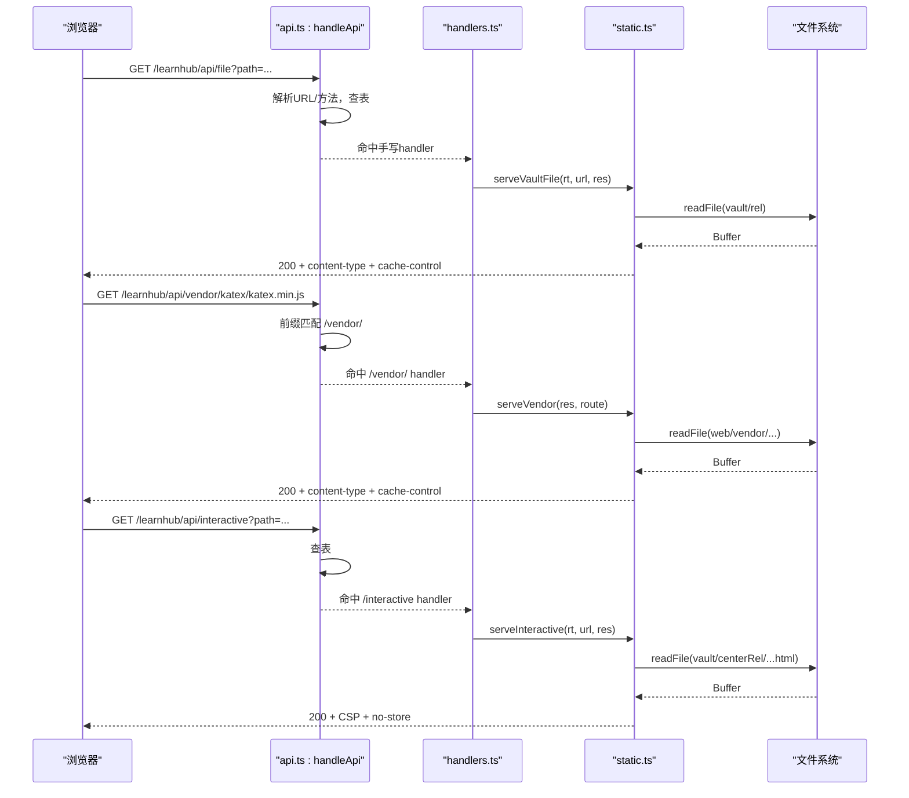
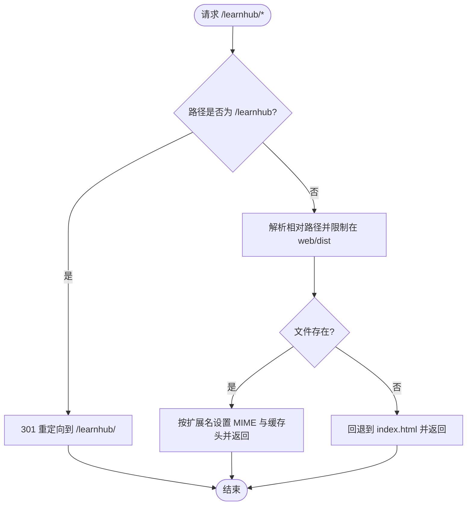
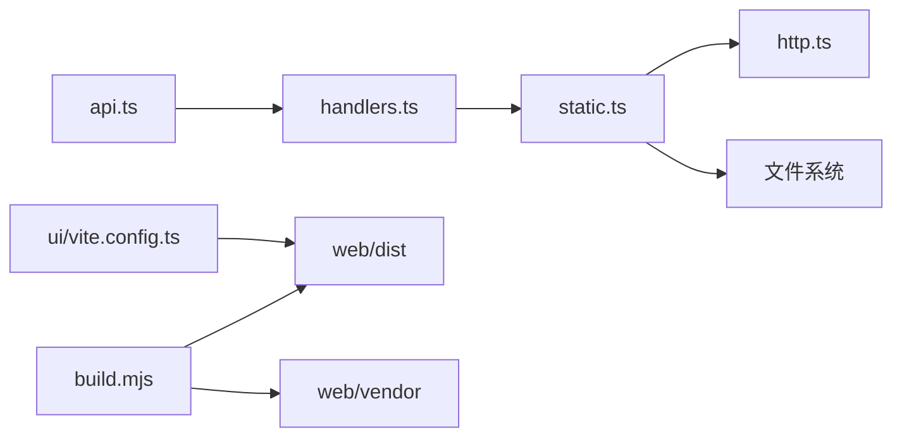

# 静态文件服务

<cite>
**本文引用的文件**
- [src/host/static.ts](file://src/host/static.ts)
- [src/host/http.ts](file://src/host/http.ts)
- [src/host/handlers.ts](file://src/host/handlers.ts)
- [src/host/api.ts](file://src/host/api.ts)
- [src/host/route-table.ts](file://src/host/route-table.ts)
- [build.mjs](file://build.mjs)
- [ui/vite.config.ts](file://ui/vite.config.ts)
</cite>

## 目录
1. [简介](#简介)
2. [项目结构](#项目结构)
3. [核心组件](#核心组件)
4. [架构总览](#架构总览)
5. [详细组件分析](#详细组件分析)
6. [依赖关系分析](#依赖关系分析)
7. [性能考量](#性能考量)
8. [故障排查指南](#故障排查指南)
9. [结论](#结论)
10. [附录：自定义与配置](#附录自定义与配置)

## 简介
本文件面向“静态文件服务”的实现与能力，覆盖前端资源托管、缓存策略、vendor 第三方库前缀路由、访问权限与安全控制、以及扩展与优化建议。该插件通过宿主 HTTP 层提供三类静态资源：
- 面板 SPA 页面与资产（/learnhub/*）
- 课程媒体文件（/learnhub/api/file）
- 预构建的 vendor 库（/learnhub/api/vendor/*）
- 交互件 HTML（/learnhub/api/interactive）

所有静态响应均遵循严格的 MIME 白名单、路径安全校验与合理的缓存头策略，确保在本地同源环境下稳定、安全地提供服务。

## 项目结构
静态文件相关的关键位置与职责如下：
- src/host/static.ts：实现 /learnhub、/file、/vendor、/interactive 四类静态伺服逻辑
- src/host/http.ts：定义 PAGE_DIST/VENDOR_DIST 路径常量、MIME 表、JSON 序列化与 KaTeX 注入工具
- src/host/handlers.ts：将 /learnhub/api 下的 GET /file、GET /vendor/、GET /interactive 等路由映射到 static.ts 中的处理函数
- src/host/api.ts：统一的前端 API 路由分发入口（/learnhub/api），负责查表、参数解析与错误出口
- build.mjs：构建期产物生成与 vendor 拷贝（Vite 构建 ui → web/dist；复制 katex/three 到 web/vendor）
- ui/vite.config.ts：Vite 构建配置，输出至 ../web/dist，base 为相对路径以适配 /learnhub 前缀

图表来源
- [src/host/static.ts:26-102](file://src/host/static.ts#L26-L102)
- [src/host/handlers.ts:118-128](file://src/host/handlers.ts#L118-L128)
- [build.mjs:23-77](file://build.mjs#L23-L77)

章节来源
- [src/host/static.ts:1-134](file://src/host/static.ts#L1-L134)
- [src/host/http.ts:1-55](file://src/host/http.ts#L1-L55)
- [src/host/handlers.ts:118-128](file://src/host/handlers.ts#L118-L128)
- [build.mjs:23-77](file://build.mjs#L23-L77)
- [ui/vite.config.ts:1-15](file://ui/vite.config.ts#L1-L15)

## 核心组件
- 面板页面伺服（/learnhub/*）
  - 基于 Vite 构建产物 web/dist，支持 index.html 回退（SPA 语义）
  - assets/* 带哈希且设置永久缓存；index.html 使用 no-store 保证发布后刷新即生效
- 媒体文件伺服（/learnhub/api/file）
  - 仅允许 vault 内媒体文件，严格白名单扩展名（png/jpg/gif/webp/svg）
  - 防路径穿越校验，返回固定 1 小时缓存
- Vendor 库伺服（/learnhub/api/vendor/*）
  - 仅允许 web/vendor 内的静态资产，复用面板资产 MIME 表
  - 防路径穿越校验，返回 1 天缓存
- 交互件伺服（/learnhub/api/interactive）
  - 仅限启用课程根内的 .html 文件
  - 注入 KaTeX 自动渲染脚本与样式（当检测到公式定界符且未自带 katex）
  - 设置严格 CSP，仅允许 self 与必要 data 源，connect-src 封死外联

章节来源
- [src/host/static.ts:26-133](file://src/host/static.ts#L26-L133)
- [src/host/http.ts:8-24,42-54:8-24](file://src/host/http.ts#L8-L24)
- [src/host/handlers.ts:118-128](file://src/host/handlers.ts#L118-L128)

## 架构总览
请求从浏览器进入 /learnhub/api，由 api.ts 统一分发：精确匹配优先，其次前缀匹配（当前唯一前缀为 /vendor/）。命中后若为生成路径则直调引擎；否则交由 handlers.ts 中手写 handler，其中 /file、/vendor/、/interactive 最终调用 static.ts 的对应函数完成静态资源读取与响应。

图表来源
- [src/host/api.ts:48-83](file://src/host/api.ts#L48-L83)
- [src/host/handlers.ts:118-128](file://src/host/handlers.ts#L118-L128)
- [src/host/static.ts:62-133](file://src/host/static.ts#L62-L133)

## 详细组件分析

### 面板页面伺服（/learnhub/*）
- 行为要点
  - 无尾斜杠的 /learnhub 会重定向到 /learnhub/
  - 子路径限制在 web/dist 目录内，失败时回退到 index.html（SPA 语义）
  - assets/* 设置 public, max-age=31536000, immutable；index.html 设置 no-store
- 安全要点
  - 路径规范化并校验是否仍在 dist 目录下，防止目录穿越
- 性能要点
  - 利用浏览器强缓存减少重复下载；HTML 不缓存便于即时更新

图表来源
- [src/host/static.ts:26-59](file://src/host/static.ts#L26-L59)

章节来源
- [src/host/static.ts:26-59](file://src/host/static.ts#L26-L59)
- [src/host/http.ts:8-24](file://src/host/http.ts#L8-L24)

### 媒体文件伺服（/learnhub/api/file）
- 行为要点
  - 仅允许 vault 相对路径，且扩展名在白名单内（png/jpg/gif/webp/svg）
  - 返回 1 小时缓存
- 安全要点
  - 拒绝包含 .. 的路径；未知扩展名直接拒绝
  - 报错信息不包含敏感路径，避免泄露内部结构
- 性能要点
  - 小体积媒体文件直接内存缓冲返回；适合短生命周期缓存

章节来源
- [src/host/static.ts:62-80](file://src/host/static.ts#L62-L80)
- [src/host/http.ts:12-15](file://src/host/http.ts#L12-L15)

### Vendor 库伺服（/learnhub/api/vendor/*）
- 行为要点
  - 仅允许 web/vendor 目录下的静态资产，复用面板资产 MIME 表
  - 返回 1 天缓存
- 安全要点
  - 拒绝包含 .. 的路径；不在白名单的扩展名直接拒绝
  - 路径规范化并校验是否在 vendor 目录内
- 性能要点
  - 第三方库通常较大且变更频率低，1 天缓存可显著降低带宽与延迟

章节来源
- [src/host/static.ts:82-102](file://src/host/static.ts#L82-L102)
- [src/host/http.ts:17-24](file://src/host/http.ts#L17-L24)

### 交互件伺服（/learnhub/api/interactive）
- 行为要点
  - 仅允许启用课程根内的 .html 文件
  - 自动检测并注入 KaTeX 样式与脚本（当检测到公式定界符且未自带 katex）
  - 设置严格 CSP：default-src 'none'，script/style/img/font 仅允许 'self' 或 data
- 安全要点
  - 拒绝包含 .. 的路径；非 .html 直接拒绝
  - CSP 封死 connect-src，禁止外联网络请求
- 性能要点
  - HTML 不缓存（no-store），确保交互件内容即时更新

章节来源
- [src/host/static.ts:104-133](file://src/host/static.ts#L104-L133)
- [src/host/http.ts:42-54](file://src/host/http.ts#L42-L54)

### 构建与产物管理
- Vite 构建
  - 输出目录为 ../web/dist，base 为相对路径，适配 /learnhub 前缀
  - 产物清理与 chunk 大小警告阈值已配置
- Vendor 拷贝
  - 构建阶段从 ui/node_modules 复制 katex 与 three 相关文件到 web/vendor
  - 缺失源文件会直接报错，避免静默跳过
- 文本规范化
  - 构建后对 web/dist 中的文本进行 CRLF→LF 与行尾空白清理，避免后续门禁失败

章节来源
- [ui/vite.config.ts:1-15](file://ui/vite.config.ts#L1-L15)
- [build.mjs:23-77](file://build.mjs#L23-L77)

## 依赖关系分析
- 路由分发
  - api.ts 提供统一入口，先精确匹配再前缀匹配（/vendor/）
  - handlers.ts 登记手写 handler，将 /file、/vendor/、/interactive 委托给 static.ts
- 静态资源
  - static.ts 依赖 http.ts 提供的路径常量与 MIME 表
  - 构建产物依赖 build.mjs 生成的 web/dist 与 web/vendor
- 外部依赖
  - 交互件通过 vendor 目录引入 katex/three，CSP 限制其加载范围

图表来源
- [src/host/api.ts:48-83](file://src/host/api.ts#L48-L83)
- [src/host/handlers.ts:118-128](file://src/host/handlers.ts#L118-L128)
- [src/host/static.ts:26-133](file://src/host/static.ts#L26-L133)
- [src/host/http.ts:8-24](file://src/host/http.ts#L8-L24)
- [build.mjs:23-77](file://build.mjs#L23-L77)
- [ui/vite.config.ts:1-15](file://ui/vite.config.ts#L1-L15)

章节来源
- [src/host/api.ts:1-84](file://src/host/api.ts#L1-L84)
- [src/host/handlers.ts:1-742](file://src/host/handlers.ts#L1-L742)
- [src/host/static.ts:1-134](file://src/host/static.ts#L1-L134)
- [src/host/http.ts:1-55](file://src/host/http.ts#L1-L55)
- [build.mjs:1-166](file://build.mjs#L1-L166)
- [ui/vite.config.ts:1-15](file://ui/vite.config.ts#L1-L15)

## 性能考量
- 缓存策略
  - 面板 assets/* 使用长期不可变缓存（max-age=31536000, immutable），适合带哈希的资源
  - 面板 index.html 使用 no-store，确保每次发布后能立即获取最新入口
  - vendor 库使用 1 天缓存，平衡更新频率与缓存命中率
  - 媒体文件使用 1 小时缓存，适合频繁更新的插图
- 压缩与传输
  - 当前实现未在服务端启用 gzip/brotli 压缩；可在反向代理（如 Nginx）或宿主 HTTP 层增加压缩中间件以提升传输效率
- CDN 集成
  - 可将 web/dist 与 web/vendor 部署到 CDN，并通过反向代理将 /learnhub 与 /learnhub/api/vendor 指向 CDN 域名
  - 注意保持 CSP 与同源策略一致，避免跨域资源加载失败
- 构建优化
  - Vite 已开启 chunk 大小警告，可按需拆分大依赖
  - 构建后文本规范化可减少不必要的差异与缓存失效

[本节为通用指导，无需特定文件引用]

## 故障排查指南
- 面板页面 500
  - 现象：返回 “learnhub panel missing (build ui/ first: npm run build)”
  - 原因：web/dist 不存在或未构建
  - 解决：执行构建流程生成 web/dist
- 媒体文件 404
  - 现象：返回 { error: "file not found: ..." }
  - 原因：vault 内文件不存在或路径不正确
  - 解决：检查 path 参数与 vault 目录结构
- 不支持的文件类型
  - 现象：抛出 “unsupported file type: ...”
  - 原因：扩展名不在 FILE_MIME 或 ASSET_MIME 白名单
  - 解决：确认文件扩展名或使用支持的格式
- 路径穿越被拒
  - 现象：抛出 “path traversal rejected”
  - 原因：请求路径包含 .. 或不满足目录限制
  - 解决：修正请求路径，确保在允许的目录范围内
- 交互件无法加载
  - 现象：CSP 阻止加载或 KaTeX 未渲染
  - 原因：CSP 限制或 HTML 未包含公式定界符
  - 解决：确保 HTML 位于启用课程根内且为 .html；如需公式，保留 $…$ 或 $$…$$ 定界符

章节来源
- [src/host/static.ts:26-133](file://src/host/static.ts#L26-L133)
- [src/host/http.ts:26-32](file://src/host/http.ts#L26-L32)

## 结论
该静态文件服务通过清晰的模块划分与严格的安全策略，提供了稳定的面板 SPA、媒体文件、vendor 库与交互件托管能力。缓存策略兼顾了更新及时性与性能，CSP 与路径校验保障了安全性。建议在反向代理层增加压缩与 CDN 接入以进一步提升性能与可用性。

[本节为总结性内容，无需特定文件引用]

## 附录：自定义与配置
- 添加新的静态资源
  - 面板资源：放入 ui/src 并通过 Vite 构建，产物将输出到 web/dist
  - vendor 库：在 build.mjs 中添加拷贝规则，将所需文件复制到 web/vendor
- 调整缓存策略
  - 修改 static.ts 中对应路由的 cache-control 头，例如延长或缩短 max-age
- 扩展 MIME 白名单
  - 在 http.ts 的 ASSET_MIME 或 FILE_MIME 中添加新扩展名映射
- 新增路由
  - 在 handlers.ts 中注册新的 GET/POST/PUT 路由，并在 static.ts 中实现相应处理逻辑
- 安全加固
  - 对所有静态路径进行目录限制与路径穿越检查
  - 根据业务需求收紧 CSP，限制 script/style/img/font 的来源

章节来源
- [src/host/static.ts:26-133](file://src/host/static.ts#L26-L133)
- [src/host/http.ts:12-24](file://src/host/http.ts#L12-L24)
- [build.mjs:49-77](file://build.mjs#L49-L77)
- [ui/vite.config.ts:1-15](file://ui/vite.config.ts#L1-L15)