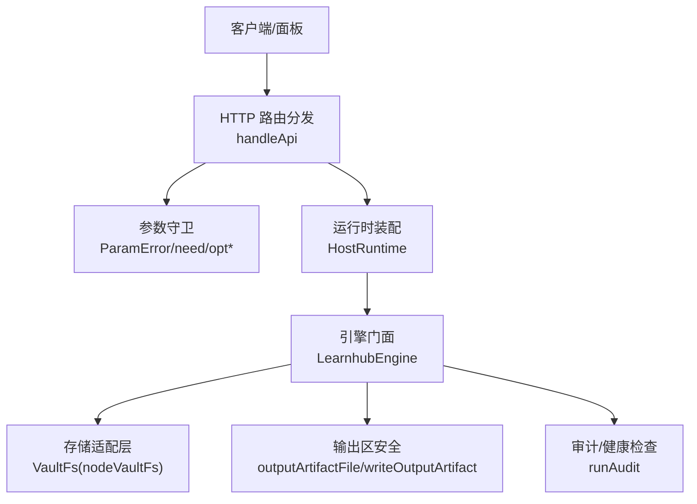
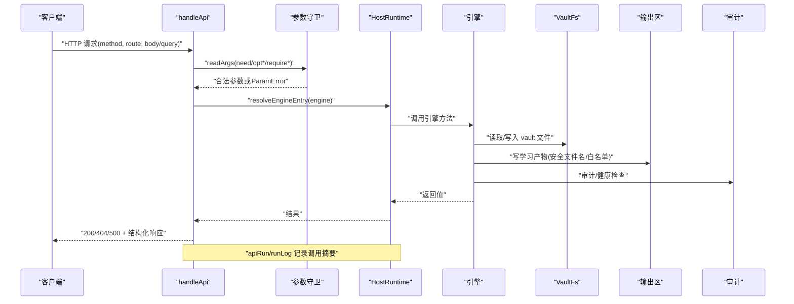
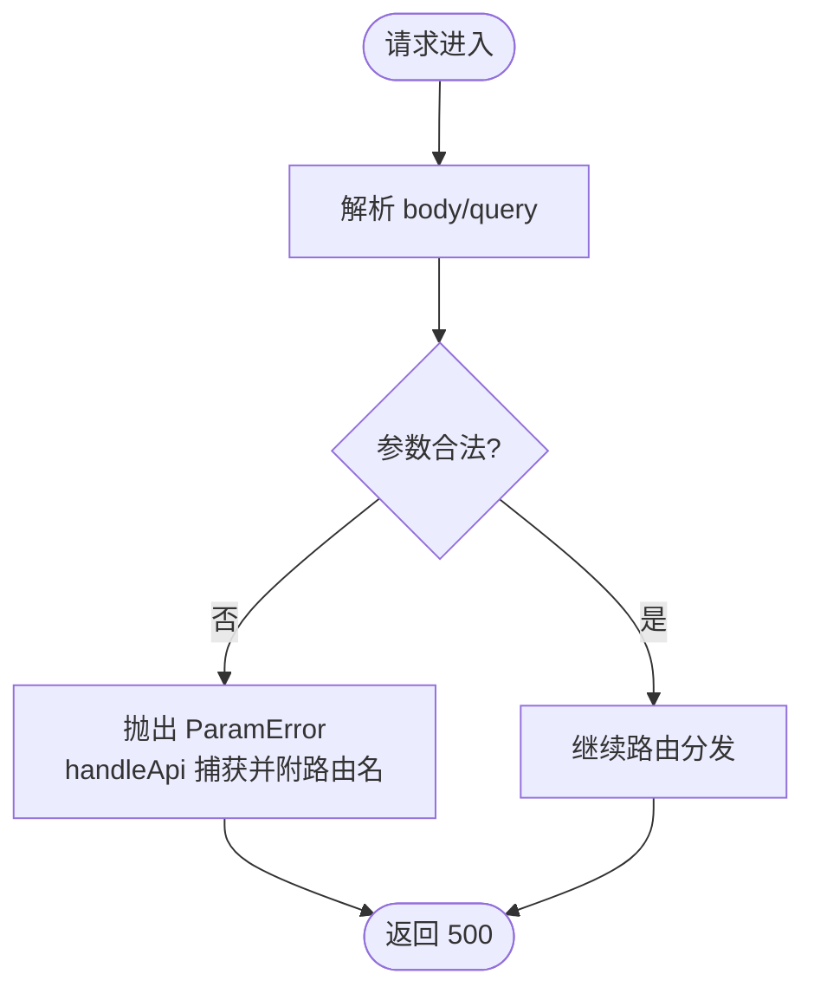
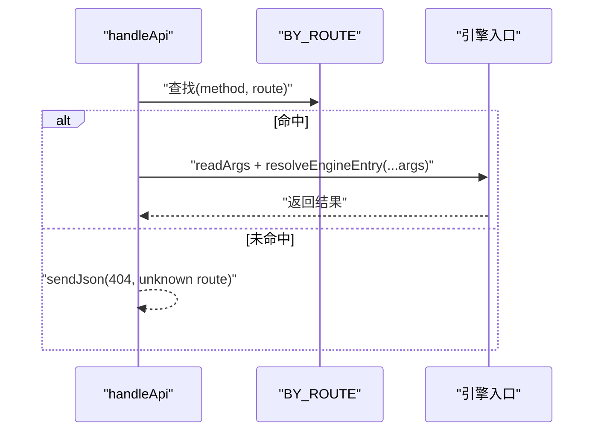
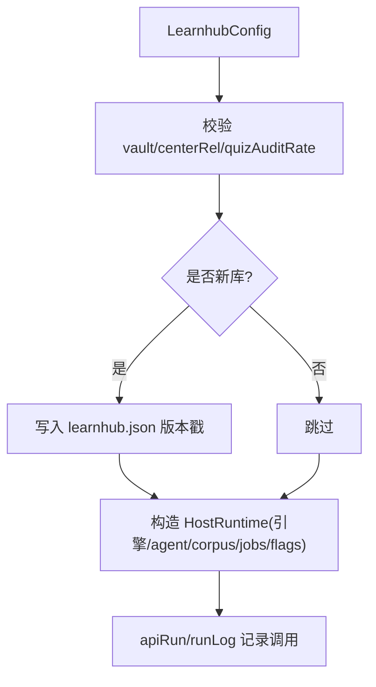
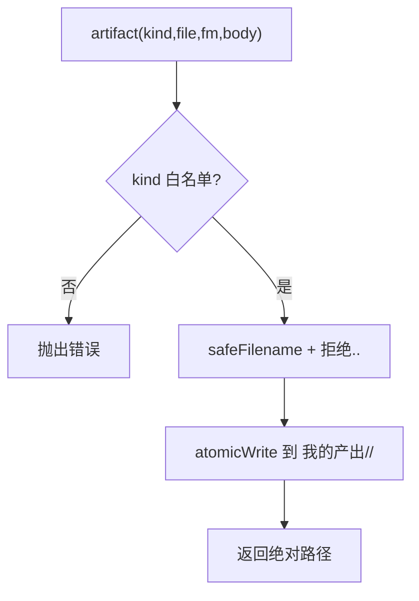
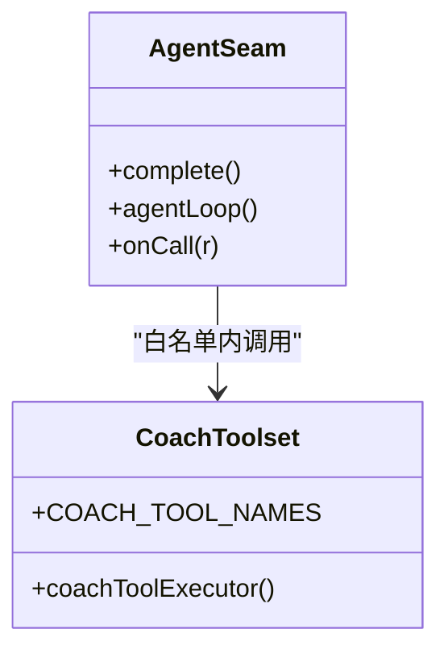
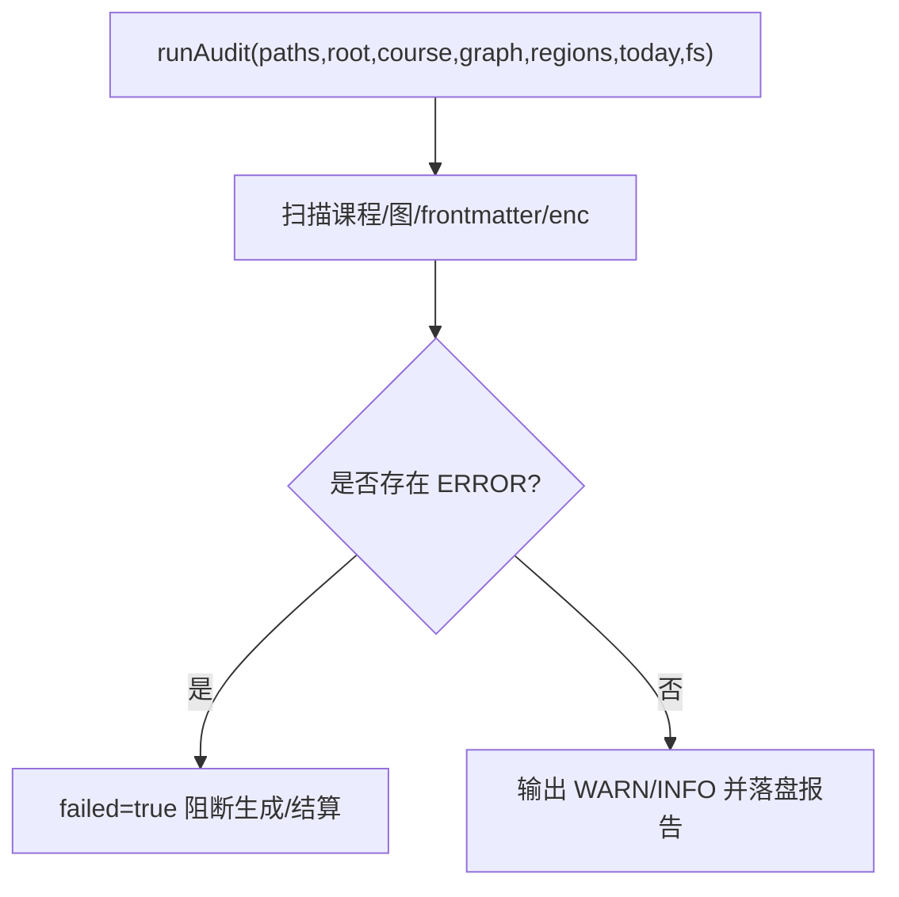
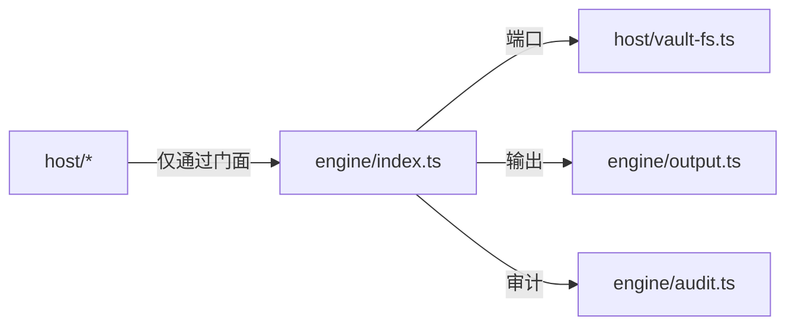

# 安全与权限控制

<cite>
**本文引用的文件**
- [src/host/params.ts](file://src/host/params.ts)
- [src/host/api.ts](file://src/host/api.ts)
- [src/host/runtime.ts](file://src/host/runtime.ts)
- [src/host/vault-fs.ts](file://src/host/vault-fs.ts)
- [src/engine/output.ts](file://src/engine/output.ts)
- [src/engine/audit.ts](file://src/engine/audit.ts)
- [tests/host-routes.test.ts](file://tests/host-routes.test.ts)
- [tests/README.md](file://tests/README.md)
- [docs/adr/0071-vault-prior-bm25-and-audit.md](file://docs/adr/0071-vault-prior-bm25-and-audit.md)
</cite>

## 目录
1. [引言](#引言)
2. [项目结构](#项目结构)
3. [核心组件](#核心组件)
4. [架构总览](#架构总览)
5. [详细组件分析](#详细组件分析)
6. [依赖关系分析](#依赖关系分析)
7. [性能与安全权衡](#性能与安全权衡)
8. [故障排查指南](#故障排查指南)
9. [结论](#结论)
10. [附录](#附录)

## 引言
本文件聚焦宿主环境的安全边界与访问控制机制，围绕用户身份验证、授权流程、敏感操作权限检查（文件系统、网络请求、外部工具调用）、输入验证与输出过滤、配置参数校验与默认值保护、以及安全审计与日志记录进行系统化说明。该插件采用“声明式命令注册表 + 参数守卫统一入口 + 运行时装配缝”的架构，将安全策略集中在少数关键路径，确保可测试、可审计、可回归。

## 项目结构
安全相关的关键位置：
- 宿主 HTTP 路由分发与错误出口：host/api.ts
- 参数校验与类型守卫：host/params.ts
- 运行时装配与运行日志：host/runtime.ts
- 存储适配层（文件系统）：host/vault-fs.ts
- 学习产物输出区与文件名安全化：engine/output.ts
- 结构性审计与健康检查：engine/audit.ts
- 测试对账与行为快照：tests/host-routes.test.ts、tests/README.md
- 先验检索审计与可观测性：docs/adr/0071-vault-prior-bm25-and-audit.md

图表来源
- [src/host/api.ts:48-83](file://src/host/api.ts#L48-L83)
- [src/host/params.ts:1-230](file://src/host/params.ts#L1-L230)
- [src/host/runtime.ts:135-193](file://src/host/runtime.ts#L135-L193)
- [src/host/vault-fs.ts:1-25](file://src/host/vault-fs.ts#L1-L25)
- [src/engine/output.ts:20-58](file://src/engine/output.ts#L20-L58)
- [src/engine/audit.ts:35-316](file://src/engine/audit.ts#L35-L316)

章节来源
- [src/host/api.ts:48-83](file://src/host/api.ts#L48-L83)
- [src/host/params.ts:1-230](file://src/host/params.ts#L1-L230)
- [src/host/runtime.ts:135-193](file://src/host/runtime.ts#L135-L193)
- [src/host/vault-fs.ts:1-25](file://src/host/vault-fs.ts#L1-L25)
- [src/engine/output.ts:20-58](file://src/engine/output.ts#L20-L58)
- [src/engine/audit.ts:35-316](file://src/engine/audit.ts#L35-L316)

## 核心组件
- 参数守卫与错误契约：集中定义必填/可选参数的取值语义与错误类型 ParamError，所有路由统一捕获并附加路由信息，保证错误可读且可定位。
- 路由分发与白名单：通过命令注册表驱动分发，仅允许已声明的 (method, path) 命中；未知路由返回 404，POST/PUT 非法 JSON 仍走 500 统一出口。
- 运行时装配与日志：createHostRuntime 负责配置校验、首启盖戳、注入 LLM 适配器与语料捕获器；apiRun/runLog 为每次引擎调用落盘运行日志。
- 存储适配层：nodeVaultFs 是 engine 与宿主之间的唯一 I/O 边界，engine 侧不直接 import 宿主模块，避免越权访问。
- 输出区安全：学习产物写入受控目录，文件名安全化拒绝路径穿越；链接拼装遵循只读纪律。
- 审计与健康：runAudit 扫描图/课程文件/frontmatter/enc 边等，产出 ERROR/WARN/INFO 报告并落盘，作为生成与结算门禁依据。

章节来源
- [src/host/params.ts:1-230](file://src/host/params.ts#L1-L230)
- [src/host/api.ts:48-83](file://src/host/api.ts#L48-L83)
- [src/host/runtime.ts:135-193](file://src/host/runtime.ts#L135-L193)
- [src/host/vault-fs.ts:1-25](file://src/host/vault-fs.ts#L1-L25)
- [src/engine/output.ts:20-58](file://src/engine/output.ts#L20-L58)
- [src/engine/audit.ts:35-316](file://src/engine/audit.ts#L35-L316)

## 架构总览
下图展示一次面板请求从进入路由到落盘输出的完整安全路径：参数校验 → 注册表匹配 → 引擎调用 → 存储/输出/审计 → 统一响应与日志。

图表来源
- [src/host/api.ts:48-83](file://src/host/api.ts#L48-L83)
- [src/host/params.ts:180-230](file://src/host/params.ts#L180-L230)
- [src/host/runtime.ts:198-253](file://src/host/runtime.ts#L198-L253)
- [src/host/vault-fs.ts:11-24](file://src/host/vault-fs.ts#L11-L24)
- [src/engine/output.ts:42-58](file://src/engine/output.ts#L42-L58)
- [src/engine/audit.ts:35-316](file://src/engine/audit.ts#L35-L316)

## 详细组件分析

### 参数守卫与输入验证
- 统一入口：所有必填/可选参数通过 need/needQuery/requireString/requireBoolean/requireNumber/requireObject/requireOneOf 及 opt* 系列函数处理，禁止在路由中散落 typeof 判断。
- 错误契约：ParamError 携带中文消息，handleApi 捕获后追加路由名，客户端可见“缺少必填参数/非法可选参数”等明确提示。
- 可选参数收紧：键存在但类型不符即抛错，不再静默当作省略，防止类型 bug 被吞掉。
- 注册表驱动取值：readArgs 根据命令 args 与通道 required/bind 解析参数，保证工具面 schema 不变。

图表来源
- [src/host/params.ts:1-230](file://src/host/params.ts#L1-L230)
- [src/host/api.ts:77-83](file://src/host/api.ts#L77-L83)
- [tests/host-routes.test.ts:148-164](file://tests/host-routes.test.ts#L148-L164)

章节来源
- [src/host/params.ts:1-230](file://src/host/params.ts#L1-L230)
- [src/host/api.ts:77-83](file://src/host/api.ts#L77-L83)
- [tests/host-routes.test.ts:148-164](file://tests/host-routes.test.ts#L148-L164)

### 路由分发与授权门
- 数据表驱动：BY_ROUTE 索引精确匹配，其次前缀匹配；未命中返回 404。
- 生成路径：命中命令且含 engine 字段时，按 channel.bind 顺序传参直调引擎；否则走 handlers 例外。
- 错误出口：统一 sendJson 序列化，避免双重编码；ParamError 带路由名，业务错误原样透传。

图表来源
- [src/host/api.ts:34-76](file://src/host/api.ts#L34-L76)

章节来源
- [src/host/api.ts:34-76](file://src/host/api.ts#L34-L76)

### 运行时装配与配置校验
- createHostRuntime 强制校验 vault/centerRel 存在，quizAuditRate 必须在 0–1，否则 fail loud。
- 首次启动为新库盖当前 schema 版本戳，避免迁移脚本误跑。
- 注入 agent 缝、语料捕获器、时钟/随机/存储实现，形成可测试的 HostRuntime。
- apiRun/runLog 为每次引擎调用落盘运行日志，失败也留痕。

图表来源
- [src/host/runtime.ts:135-193](file://src/host/runtime.ts#L135-L193)
- [src/host/runtime.ts:198-253](file://src/host/runtime.ts#L198-L253)

章节来源
- [src/host/runtime.ts:135-193](file://src/host/runtime.ts#L135-L193)
- [src/host/runtime.ts:198-253](file://src/host/runtime.ts#L198-L253)

### 文件系统访问与输出区安全
- 存储边界：engine 通过 VaultFs 端口访问文件系统，真实实现 nodeVaultFs 位于 host，engine 不直接 import 宿主。
- 输出区：writeOutputArtifact 限制 kind 白名单，文件名安全化拒绝 .. 与非法字符，原子写回。
- 链接拼装：obsidianLink 剥离 .md、归一化路径，空目标拒绝。

图表来源
- [src/engine/output.ts:20-58](file://src/engine/output.ts#L20-L58)
- [src/host/vault-fs.ts:11-24](file://src/host/vault-fs.ts#L11-L24)

章节来源
- [src/engine/output.ts:20-58](file://src/engine/output.ts#L20-L58)
- [src/host/vault-fs.ts:11-24](file://src/host/vault-fs.ts#L11-L24)

### 外部工具调用与白名单
- 统一 agent 缝：AgentSeam 提供 complete/loop，支持工具白名单与轮次预算封顶；白名单外调用 fail loud。
- 教练只读工具面：COACH_TOOL_NAMES 限定七件只读工具，零写侧零队列触点，测试断言 vault 字节级不变。
- 工具调用日志：onCall 记录 station/mode/effort/字数/token 用量，便于审计与成本核算。

图表来源
- [tests/README.md:84-85](file://tests/README.md#L84-L85)

章节来源
- [tests/README.md:84-85](file://tests/README.md#L84-L85)

### 网络请求与 LLM 适配
- 宿主→引擎 LLM 端口：LlmComplete/LlmStream 纯类型接口，具体 provider 由宿主 llmSeam/llmStreamSeam 注入。
- 温度透传：temperature 可选，缺省使用宿主默认，全仓调用点不设置值，保证部署可控。
- 语料捕获：withCapture 在适配器出口记录 prompt/输出/工具调用，失败/容忍补标，供离线评审与回归。

章节来源
- [tests/README.md:74-74](file://tests/README.md#L74-L74)
- [tests/README.md:87-87](file://tests/README.md#L87-L87)

### 输入验证与输出过滤
- 输入：参数守卫集中化，枚举/类型/有限性严格校验；非法可选参数立即报错。
- 输出：SVG URI 清洗白名单、Markdown HTML 策略、类名合法性检查等在前端与引擎侧共同保障。

章节来源
- [tests/README.md:40-42](file://tests/README.md#L40-L42)
- [tests/ui-budget.test.ts:156-179](file://tests/ui-budget.test.ts#L156-L179)

### 配置参数安全校验与默认值保护
- quizAuditRate：装配时校验 0–1，缺省 DEFAULT_QUIZ_AUDIT_RATE，非法值 fail loud。
- vault/centerRel：必须存在且有效，否则启动失败，避免静默兜底。
- 首启盖戳：新库写入 schema version，旧库交由版本硬门判定。

章节来源
- [src/host/runtime.ts:135-163](file://src/host/runtime.ts#L135-L163)

### 安全审计与日志记录
- 结构性审计：runAudit 扫描图/课程文件/frontmatter/enc 边/健康分等，ERROR 阻断生成与结算，WARN 需裁决，INFO 提示。
- 运行日志：runLog 以时间戳+工具名追加到中心状态目录，失败不影响主流程。
- 先验检索审计：每次检索必产审计对象，包含 terms/expanded/scanned/matched/hitPaths 等，随任务回执带出。

图表来源
- [src/engine/audit.ts:35-316](file://src/engine/audit.ts#L35-L316)
- [docs/adr/0071-vault-prior-bm25-and-audit.md:35-40](file://docs/adr/0071-vault-prior-bm25-and-audit.md#L35-L40)

章节来源
- [src/engine/audit.ts:35-316](file://src/engine/audit.ts#L35-L316)
- [docs/adr/0071-vault-prior-bm25-and-audit.md:35-40](file://docs/adr/0071-vault-prior-bm25-and-audit.md#L35-L40)

## 依赖关系分析
- 分层依赖规则：host 的 engine 导入只走门面；engine 禁引宿主；engine 禁引 @deepseek-ai/*；views 纯类型；io.ts 零相对导入；门面唯一汇点；相对 import 全图零环。
- 存储边界：engine 通过 VaultFs 端口访问文件系统，nodeVaultFs 是唯一实现，避免跨层耦合。
- 路由与命令注册表：BY_ROUTE/BY_TOOL 两张索引，确保 (method,path) 与 tool 名唯一，避免静默覆盖。

图表来源
- [src/host/vault-fs.ts:1-25](file://src/host/vault-fs.ts#L1-L25)
- [tests/README.md:157-159](file://tests/README.md#L157-L159)

章节来源
- [src/host/vault-fs.ts:1-25](file://src/host/vault-fs.ts#L1-L25)
- [tests/README.md:157-159](file://tests/README.md#L157-L159)

## 性能与安全权衡
- 参数守卫集中化减少重复校验开销，同时提升一致性。
- 输出区原子写与文件名安全化增加少量 I/O 成本，但显著降低路径穿越风险。
- 审计与日志异步落盘，失败不影响主流程，兼顾可观测性与可用性。
- 工具调用白名单与轮次预算封顶，防止无限循环与资源耗尽。

[本节为通用指导，无需特定文件引用]

## 故障排查指南
- 路由 404：确认 (method, route) 是否在 BY_ROUTE 中；POST/PUT 非法 JSON 会返回 500。
- 参数错误：查看 ParamError 消息与附加的路由名，定位缺失或非法字段。
- 输出失败：检查 outputArtifactFile 是否拒绝 .. 或非法字符；确认 kind 在白名单。
- 审计阻断：阅读 runAudit 报告的 ERROR/WARN，修复后再重试生成/结算。
- 日志缺失：确认 centerStateDir 存在且可写；runLog 失败不影响主流程。

章节来源
- [src/host/api.ts:48-83](file://src/host/api.ts#L48-L83)
- [src/host/params.ts:1-230](file://src/host/params.ts#L1-L230)
- [src/engine/output.ts:20-58](file://src/engine/output.ts#L20-L58)
- [src/engine/audit.ts:35-316](file://src/engine/audit.ts#L35-L316)
- [src/host/runtime.ts:198-253](file://src/host/runtime.ts#L198-L253)

## 结论
本项目通过“声明式命令注册表 + 统一参数守卫 + 运行时装配缝 + 存储适配层 + 输出区白名单 + 审计与日志”构建起清晰的安全边界与访问控制体系。所有敏感操作均经过显式校验与可观测记录，配合严格的测试对账与行为快照，确保变更不会引入漂移与安全风险。建议在生产环境中持续启用审计与日志，并定期复核白名单与路由清单。

[本节为总结，无需特定文件引用]

## 附录
- 最佳实践
  - 新增路由必须登记到命令注册表，并通过探针覆盖。
  - 新增参数一律通过 params.ts 的 need/opt*/require* 处理，禁止手写 typeof。
  - 输出区写入必须使用 writeOutputArtifact，文件名安全化不可绕过。
  - 工具调用仅限白名单，必要时扩展需同步更新测试与文档。
  - 配置项校验在 createHostRuntime 中 fail loud，不得静默降级。
- 常见威胁防护
  - 路径穿越：outputArtifactFile 拒绝 ..，VaultFs 抽象隔离宿主 fs。
  - 注入攻击：SVG URI 白名单、HTML 策略、类名合法性检查。
  - 越权访问：路由白名单 + 参数守卫 + 工具白名单。
  - 资源耗尽：工具回路轮次预算封顶，审计与日志限长截断。

[本节为通用指导，无需特定文件引用]