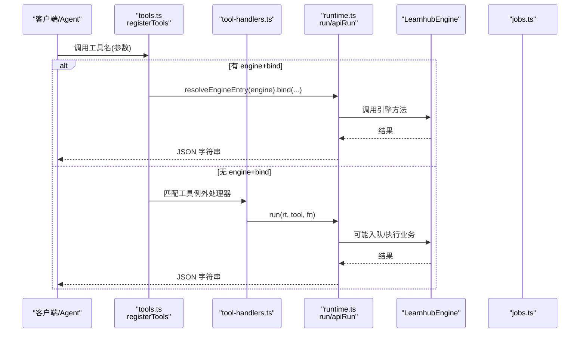
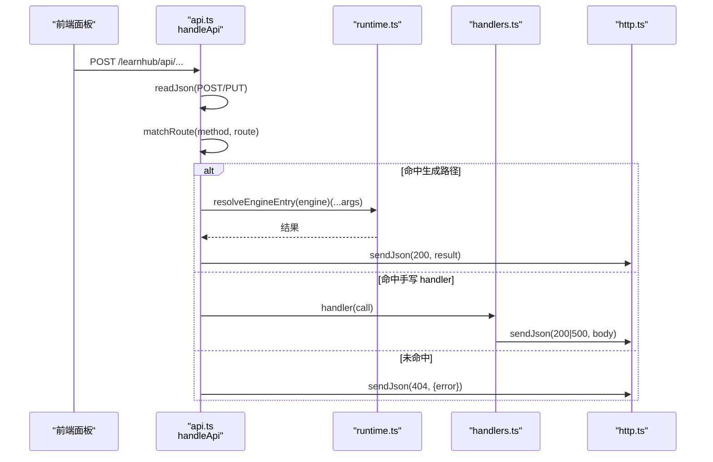
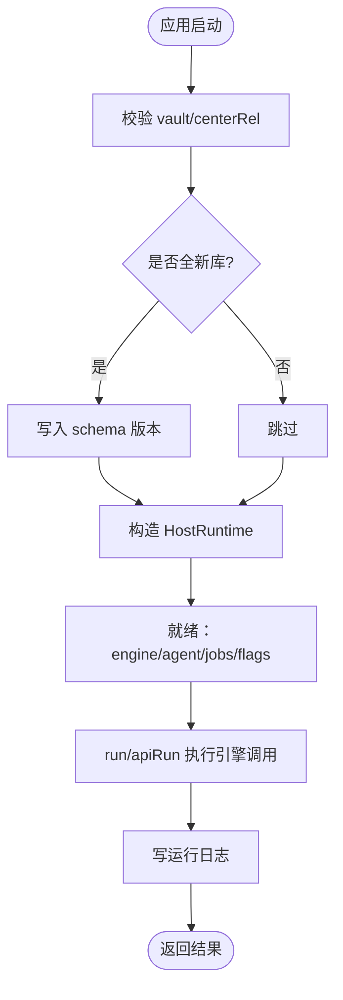
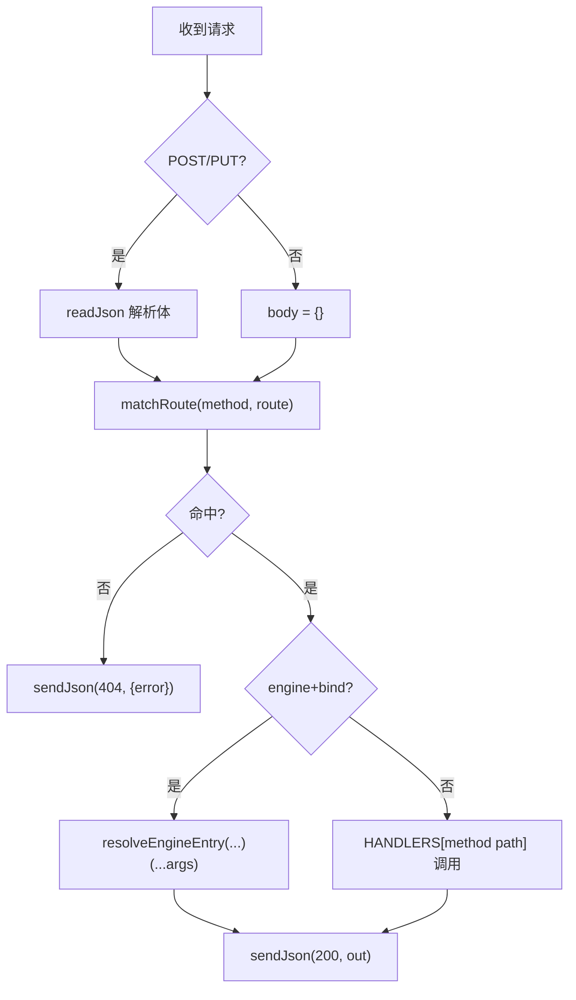
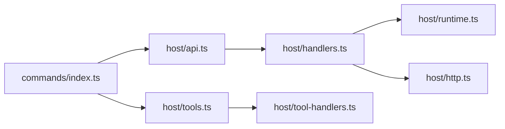

# 宿主集成

<cite>
**本文引用的文件**
- [src/host/runtime.ts](file://src/host/runtime.ts)
- [src/host/api.ts](file://src/host/api.ts)
- [src/host/handlers.ts](file://src/host/handlers.ts)
- [src/host/tools.ts](file://src/host/tools.ts)
- [src/host/tool-handlers.ts](file://src/host/tool-handlers.ts)
- [src/host/http.ts](file://src/host/http.ts)
- [src/host/route-table.ts](file://src/host/route-table.ts)
- [src/commands/index.ts](file://src/commands/index.ts)
- [src/commands/types.ts](file://src/commands/types.ts)
</cite>

## 目录
1. [简介](#简介)
2. [项目结构](#项目结构)
3. [核心组件](#核心组件)
4. [架构总览](#架构总览)
5. [详细组件分析](#详细组件分析)
6. [依赖关系分析](#依赖关系分析)
7. [性能与可扩展性](#性能与可扩展性)
8. [故障排查指南](#故障排查指南)
9. [结论](#结论)
10. [附录：工具清单与调用约定](#附录工具清单与调用约定)

## 简介
本文件面向“宿主集成”目标，系统性说明 HostRuntime 宿主运行时的设计、插件生命周期管理、资源协调；Agent 工具的注册机制与调用协议（含 111 个内置工具）；HTTP API 路由系统（端点定义、请求处理、响应格式）；工具处理器的工作流程与错误处理；与 DeepSeek Harness 框架的集成方式与扩展点；以及自定义工具与 API 的开发指南、安全与权限、集成示例与调试技巧。

## 项目结构
宿主层位于 src/host，围绕运行时、HTTP 路由、工具面、命令注册表展开：
- runtime.ts：HostRuntime 构造、引擎入口解析、运行日志、统一执行包装
- api.ts：/learnhub/api/* 分发器，注册表驱动 + 手写 handler 例外
- handlers.ts：面板手写路由实现集合（大量业务端点）
- tools.ts：Agent 工具注册（从命令注册表生成 defineTool）
- tool-handlers.ts：无法走生成路径的工具例外处理器
- http.ts：静态资源、MIME、JSON 读写、KaTeX 注入
- route-table.ts：路由表项形状与构造器
- commands/index.ts：命令注册表装配（学习/图谱/题库/项目/学习者产出/实验室/通道/维护）
- commands/types.ts：命令/通道/参数声明类型与构造器

```mermaid
graph TB
subgraph "宿主层"
RT["runtime.ts<br/>HostRuntime"]
API["api.ts<br/>/learnhub/api/* 分发"]
HND["handlers.ts<br/>手写路由"]
TOOLS["tools.ts<br/>Agent 工具注册"]
THAND["tool-handlers.ts<br/>工具例外处理器"]
HTTP["http.ts<br/>HTTP 工具"]
RTBL["route-table.ts<br/>路由表项"]
CMD["commands/index.ts<br/>命令注册表"]
end
CMD --> TOOLS
CMD --> API
API --> HND
API --> RT
TOOLS --> THAND
HND --> RT
HND --> HTTP
RT --> HTTP
```



图表来源
- [src/host/runtime.ts:118-193](file://src/host/runtime.ts#L118-L193)
- [src/host/api.ts:48-83](file://src/host/api.ts#L48-L83)
- [src/host/handlers.ts:101-742](file://src/host/handlers.ts#L101-L742)
- [src/host/tools.ts:101-125](file://src/host/tools.ts#L101-L125)
- [src/host/tool-handlers.ts:23-287](file://src/host/tool-handlers.ts#L23-L287)
- [src/host/http.ts:26-55](file://src/host/http.ts#L26-L55)
- [src/host/route-table.ts:56-75](file://src/host/route-table.ts#L56-L75)
- [src/commands/index.ts:25-72](file://src/commands/index.ts#L25-L72)

章节来源
- [src/host/runtime.ts:118-193](file://src/host/runtime.ts#L118-L193)
- [src/host/api.ts:48-83](file://src/host/api.ts#L48-L83)
- [src/host/handlers.ts:101-742](file://src/host/handlers.ts#L101-L742)
- [src/host/tools.ts:101-125](file://src/host/tools.ts#L101-L125)
- [src/host/tool-handlers.ts:23-287](file://src/host/tool-handlers.ts#L23-L287)
- [src/host/http.ts:26-55](file://src/host/http.ts#L26-L55)
- [src/host/route-table.ts:56-75](file://src/host/route-table.ts#L56-L75)
- [src/commands/index.ts:25-72](file://src/commands/index.ts#L25-L72)

## 核心组件
- HostRuntime：承载 LearnhubEngine、AgentSeam、语料捕获、任务表、标志位等可配置态；提供 run/apiRun 统一执行与日志；resolveEngineEntry 按子系统路径解析引擎方法并绑定 this。
- 命令注册表 COMMANDS/CMD_LIST：以 id 为键的命令集合，包含 args、engine、channels（agent/panel）、phase/bind/log 等元数据；构建 BY_ROUTE/BY_TOOL/WIRE_ARGS 索引。
- Agent 工具面：遍历命令注册表的 agent 通道，将 summary 作为 description、args 投影为 SDK parameters，execute 走生成路径或例外 handler。
- HTTP 路由：/learnhub/api/* 先读体再查表，命中则按 engine+bind 直调引擎或进入手写 handler；未命中返回 404；错误统一 {error} 500。
- 手写路由 handlers：覆盖复杂逻辑（队列入队、提案联合 apply、Anki 通道、质量评审、沙盘等）。

章节来源
- [src/host/runtime.ts:118-193](file://src/host/runtime.ts#L118-L193)
- [src/commands/index.ts:25-72](file://src/commands/index.ts#L25-L72)
- [src/host/tools.ts:101-125](file://src/host/tools.ts#L101-L125)
- [src/host/api.ts:48-83](file://src/host/api.ts#L48-L83)
- [src/host/handlers.ts:101-742](file://src/host/handlers.ts#L101-L742)

## 架构总览
下图展示一次 Agent 工具调用与一次面板 API 调用的端到端流程。



图表来源
- [src/host/tools.ts:101-125](file://src/host/tools.ts#L101-L125)
- [src/host/tool-handlers.ts:23-287](file://src/host/tool-handlers.ts#L23-L287)
- [src/host/runtime.ts:198-253](file://src/host/runtime.ts#L198-L253)



图表来源
- [src/host/api.ts:48-83](file://src/host/api.ts#L48-L83)
- [src/host/handlers.ts:101-742](file://src/host/handlers.ts#L101-L742)
- [src/host/http.ts:26-55](file://src/host/http.ts#L26-L55)

## 详细组件分析

### HostRuntime 与插件生命周期
- 构造阶段：校验 vault/centerRel 存在；初始化 LearnhubEngine；创建语料捕获器；装配 AgentSeam（complete/stream/onCall），记录 LLM 调用日志；初始化 jobs Map 与 flags。
- 生命周期：
  - 启动：createHostRuntime 完成所有可变态装配；引擎、agent、jobs、flags 在内存中。
  - 运行：通过 run/apiRun 包装引擎调用，落盘运行日志；队列任务由 jobs 模块管理（入队/恢复/清扫）。
  - 退出：进程退出时持久化任务注册表（由外部调度触发），清理临时状态。
- 资源协调：
  - 生成任务注册表（GenJob）持久化到 state/生成任务.json，重启后恢复遗留 running 为失败。
  - 语料捕获器异步落盘，失败静默，不影响主流程。
  - 会话开始触点节流（lastSessionStartAt）避免频繁触发教练回合。



图表来源
- [src/host/runtime.ts:135-193](file://src/host/runtime.ts#L135-L193)
- [src/host/runtime.ts:217-253](file://src/host/runtime.ts#L217-L253)

章节来源
- [src/host/runtime.ts:135-193](file://src/host/runtime.ts#L135-L193)
- [src/host/runtime.ts:198-253](file://src/host/runtime.ts#L198-L253)

### Agent 工具注册机制与调用协议
- 注册：遍历 COMMAND_LIST，查找 channel='agent' 的条目；summary→description；args→sdkParameters（剥离投递层扩展键）；execute 走生成路径（engine+bind）或例外 handler。
- 协议：
  - 名称：来自命令注册的 tool 字段。
  - 描述：来自 summary。
  - 参数：SDK 标准 schema（type/required/description/enum/items/additionalProperties）。
  - 输出：文本渲染（text）。
  - 执行：同步调用，返回 JSON 字符串。
- 111 个内置工具：全部由命令注册表驱动，无需手写重复类型；工具分组涵盖学习、图谱、题库、项目、学习者产出、实验室、通道、维护等领域。

```mermaid
classDiagram
class CommandSpec {
+string id
+string summary
+ParameterSchemaSpec args
+string? engine
+CommandDomain domain
+ChannelSpec[] channels
}
class ChannelSpec {
+string channel
+string mode
+string? tool
+{method,path}? route
+string? phase
+string|null[]? bind
+string[]? required
+boolean? prefix
+boolean? log
}
class ToolDefinition {
+string name
+string description
+parameters
+output
+execute(args) string
}
CommandSpec --> ChannelSpec : "channels"
ChannelSpec --> ToolDefinition : "映射为 defineTool"
```

图表来源
- [src/commands/types.ts:54-129](file://src/commands/types.ts#L54-L129)
- [src/host/tools.ts:72-125](file://src/host/tools.ts#L72-L125)

章节来源
- [src/host/tools.ts:72-125](file://src/host/tools.ts#L72-L125)
- [src/commands/types.ts:54-129](file://src/commands/types.ts#L54-L129)

### HTTP API 路由系统与端点
- 前缀：/learnhub/api。
- 分发三步：读取 POST/PUT 体 → 精确匹配或前缀匹配 → 命中则按 engine+bind 直调引擎或进入手写 handler；未命中 404。
- 错误处理：ParamError 附加路由信息；其他错误统一 {error} 500；引擎对象原样透传，禁止手动 stringify。
- 手写路由：覆盖队列入队、提案联合 apply、Anki 通道、质量评审、沙盘、实验、项目计划/里程碑等复杂场景。



图表来源
- [src/host/api.ts:48-83](file://src/host/api.ts#L48-L83)
- [src/host/handlers.ts:101-742](file://src/host/handlers.ts#L101-L742)

章节来源
- [src/host/api.ts:48-83](file://src/host/api.ts#L48-L83)
- [src/host/handlers.ts:101-742](file://src/host/handlers.ts#L101-L742)

### 工具处理器工作流程与错误处理
- 生成路径：按 bind 顺序取同名键，调用 resolveEngineEntry 解析子系统方法并绑定 this，再经 run/apiRun 包装落盘日志。
- 例外处理器：对需要加工形状、换算实参、多入口或无引擎的工具，集中放在 tool-handlers.ts；每个处理器内部进行参数校验、业务调用、异常抛出。
- 错误处理：
  - 参数错误：ParamError 携带中文消息与路由名。
  - 业务错误：引擎抛出的错误原样透传，但会被 apiRun 记录到运行日志。
  - 队列型任务：入队即返回，终态由查询接口获取；取消/恢复由专用路由控制。

章节来源
- [src/host/tools.ts:97-125](file://src/host/tools.ts#L97-L125)
- [src/host/tool-handlers.ts:23-287](file://src/host/tool-handlers.ts#L23-L287)
- [src/host/runtime.ts:217-253](file://src/host/runtime.ts#L217-L253)

### 与 DeepSeek Harness 框架的集成与扩展点
- 集成点：
  - Context.tools.register：通过 defineTool 注册 Agent 工具（host/tools.ts）。
  - Context：在路由与工具处理器中用于 LLM 调用与语料捕获（host/handlers.ts、tool-handlers.ts）。
- 扩展点：
  - 新增命令：在 commands 域文件中用 command() 声明，加入 CHANNELS（agent/panel），自动被两个适配器消费。
  - 新增路由：若走生成路径，仅需在命令注册表中声明 engine+bind；否则在 handlers.ts 添加手写 handler。
  - 新增工具例外：在 tool-handlers.ts 工厂函数中添加处理器，保持键集合与“无 bind 的 agent 通道”一致。

章节来源
- [src/host/tools.ts:101-125](file://src/host/tools.ts#L101-L125)
- [src/commands/types.ts:100-129](file://src/commands/types.ts#L100-L129)
- [src/host/handlers.ts:101-742](file://src/host/handlers.ts#L101-L742)

### 自定义工具与 API 开发指南
- 新增 Agent 工具：
  1) 在对应域的命令文件中用 command() 声明 id/summary/args/engine/channels(agent)。
  2) 若需特殊处理，在 tool-handlers.ts 添加处理器，确保键集合与“无 bind 的 agent 通道”一致。
  3) 重新装配后，工具自动出现在 Agent 能力列表。
- 新增面板 API：
  1) 优先使用生成路径：在命令注册表中声明 engine+bind，自动获得路由与日志。
  2) 复杂逻辑：在 handlers.ts 添加手写 handler，遵循 sendJson 统一响应格式。
- 参数契约：
  - args 中的 read 字段仅投递层消费，下发工具面前剥掉；面板侧可通过 ChannelSpec.required 定制必填。
  - WIRE_ARGS 是 camelCase↔snake_case 翻译权威。

章节来源
- [src/commands/types.ts:54-129](file://src/commands/types.ts#L54-L129)
- [src/commands/index.ts:54-72](file://src/commands/index.ts#L54-L72)
- [src/host/tools.ts:72-125](file://src/host/tools.ts#L72-L125)
- [src/host/handlers.ts:101-742](file://src/host/handlers.ts#L101-L742)

### 安全考虑与权限控制
- 输入校验：ParamError 与严格类型检查防止非法参数；队列型参数显式拒绝非法值。
- 资源访问：vault 路径白名单与相对路径限制（static.ts 中实现），媒体文件 MIME 白名单。
- 会话节流：lastSessionStartAt 避免高频触发教练回合。
- 审计与可观测：运行日志、语料捕获、任务注册表持久化便于追踪与回溯。
- 权限模型：当前代码未实现细粒度权限控制；如需 RBAC，可在路由层增加鉴权中间件并在命令注册表中标注敏感操作。

章节来源
- [src/host/http.ts:12-24](file://src/host/http.ts#L12-L24)
- [src/host/runtime.ts:105-113](file://src/host/runtime.ts#L105-L113)
- [src/host/handlers.ts:181-249](file://src/host/handlers.ts#L181-L249)

### 集成示例与调试技巧
- 示例：发起一次“今天学它”置顶
  - Agent 工具：learnhub_pin_today，传入 course/node/cue/action。
  - 面板 API：POST /node/pin，传入 course/node/pinned=true。
- 调试技巧：
  - 查看运行日志：state/运行日志.md，记录每次引擎调用摘要。
  - 查看任务注册表：state/生成任务.json，跟踪生成/出题任务进度与失败详情。
  - 冒烟测试：POST /smoke，验证全管线可用。
  - 质量评审：POST /quality-review，批量抽样评审生成语料。
  - 观察 LLM 调用：onCall 回调输出 token 用量与耗时，便于定位性能瓶颈。

章节来源
- [src/host/tool-handlers.ts:35-38](file://src/host/tool-handlers.ts#L35-L38)
- [src/host/handlers.ts:320-335](file://src/host/handlers.ts#L320-L335)
- [src/host/runtime.ts:217-253](file://src/host/runtime.ts#L217-L253)
- [src/host/handlers.ts:181-249](file://src/host/handlers.ts#L181-L249)

## 依赖关系分析
- 低耦合：runtime 不持有 ctx，仅在装配点消费；路由与工具面通过命令注册表解耦。
- 单点装配：COMMANDS 是唯一事实源，两个适配器（agent/panel）共享同一份声明。
- 潜在环：growth-subsystem 与 compass/proposals 互相引用，已拆分为子系统文件避免环。
- 外部依赖：DeepSeek Harness（Context、tools）、Node fs/promises、AnkiConnect 客户端。



图表来源
- [src/commands/index.ts:25-72](file://src/commands/index.ts#L25-L72)
- [src/host/tools.ts:101-125](file://src/host/tools.ts#L101-L125)
- [src/host/api.ts:48-83](file://src/host/api.ts#L48-L83)
- [src/host/handlers.ts:101-742](file://src/host/handlers.ts#L101-L742)
- [src/host/runtime.ts:118-193](file://src/host/runtime.ts#L118-L193)
- [src/host/http.ts:26-55](file://src/host/http.ts#L26-L55)

章节来源
- [src/commands/index.ts:25-72](file://src/commands/index.ts#L25-L72)
- [src/host/tools.ts:101-125](file://src/host/tools.ts#L101-L125)
- [src/host/api.ts:48-83](file://src/host/api.ts#L48-L83)
- [src/host/handlers.ts:101-742](file://src/host/handlers.ts#L101-L742)
- [src/host/runtime.ts:118-193](file://src/host/runtime.ts#L118-L193)
- [src/host/http.ts:26-55](file://src/host/http.ts#L26-L55)

## 性能与可扩展性
- 性能：
  - 队列化：生成/出题/罗盘/计划/里程碑等长耗时任务入队，HTTP 立即返回。
  - 日志截断：运行日志单条上限，避免大输出阻塞。
  - 语料捕获：异步 fire-and-forget，失败静默。
- 可扩展性：
  - 新增命令即新增工具与路由（自动生成），减少重复代码。
  - 手写 handler 保留灵活性，覆盖复杂场景。
  - 通过 ChannelSpec.bind/log/phase 精细控制执行模型与日志。

[本节为通用指导，不直接分析具体文件]

## 故障排查指南
- 404 未知路由：检查 method+route 是否在 BY_ROUTE 中；确认前缀路由匹配规则。
- 500 参数错误：查看 ParamError 消息与路由名；核对 args.read 与 required。
- 生成任务失败：查看 state/生成任务.json 的 failures 字段；根据 message 定位问题。
- LLM 调用异常：查看 onCall 日志与运行日志；检查 corpus 捕获文件。
- Anki 连接失败：查看 /anki/status；确认 endpoint 可达。

章节来源
- [src/host/api.ts:58-82](file://src/host/api.ts#L58-L82)
- [src/host/handlers.ts:181-249](file://src/host/handlers.ts#L181-L249)
- [src/host/runtime.ts:217-253](file://src/host/runtime.ts#L217-L253)

## 结论
宿主集成以 HostRuntime 为核心，结合命令注册表与双适配器（Agent/Panel），实现了高度声明式、可测试、可观测的插件体系。通过队列化、语料捕获与运行日志，保障了稳定性与可追溯性；通过 generate_path 与手写 handler 的互补，兼顾了简洁性与灵活性。未来可按需在路由层引入权限控制，进一步细化安全策略。

[本节为总结，不直接分析具体文件]

## 附录：工具清单与调用约定
- 工具命名：learnhub_*，来源于命令注册的 tool 字段。
- 参数契约：遵循 SDK schema；read 字段仅投递层消费。
- 输出格式：文本渲染；面板 API 统一 JSON。
- 队列型工具：入队即返回，终态通过状态接口查询。
- 111 个内置工具：覆盖学习、图谱、题库、项目、学习者产出、实验室、通道、维护等领域，全部由命令注册表驱动。

章节来源
- [src/host/tools.ts:25-69](file://src/host/tools.ts#L25-L69)
- [src/commands/types.ts:54-129](file://src/commands/types.ts#L54-L129)