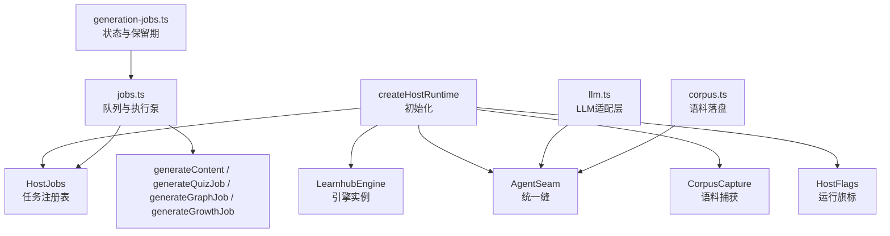
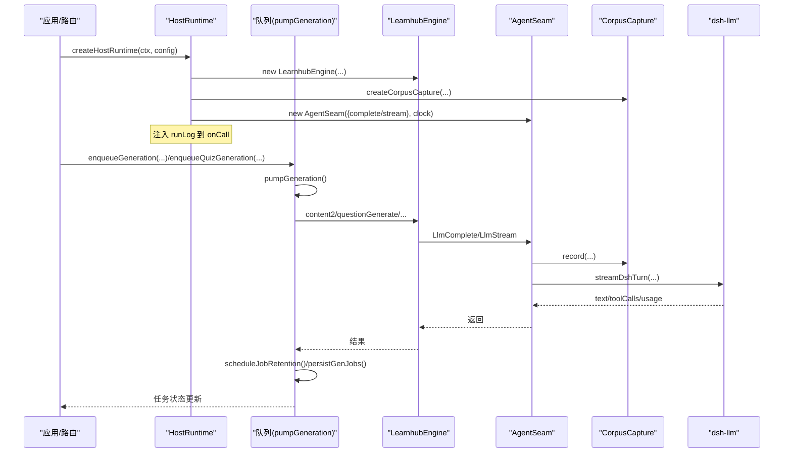
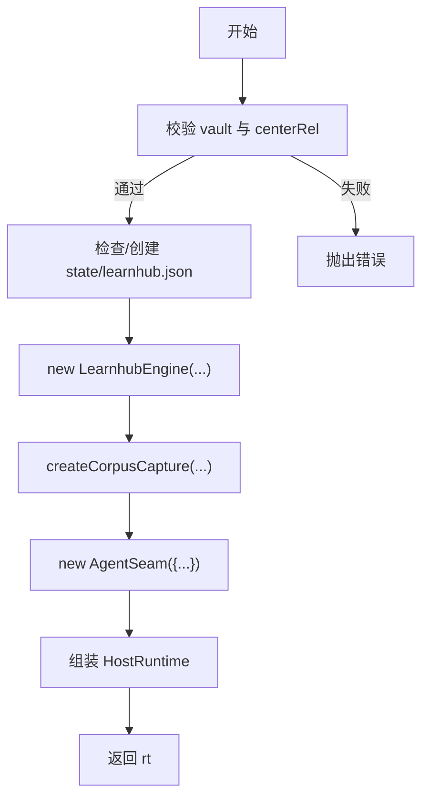
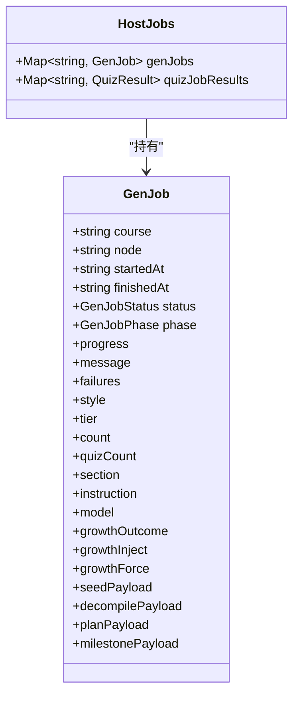
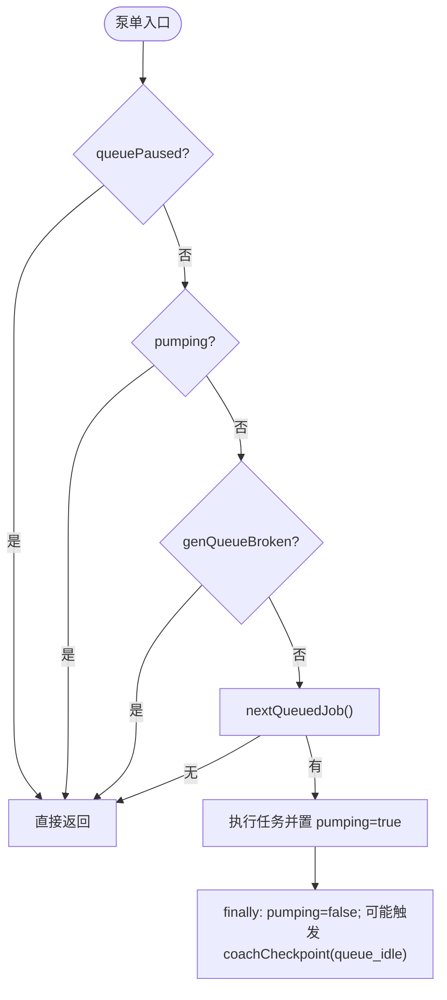
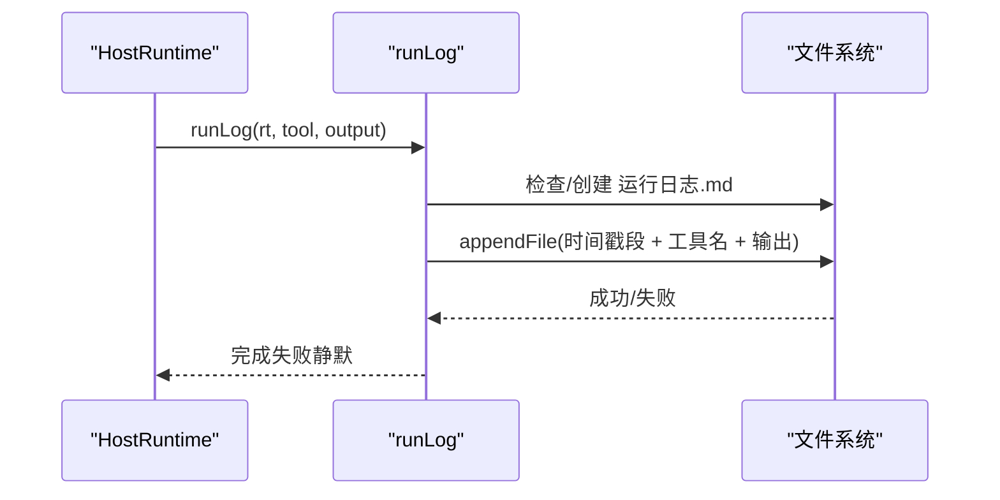
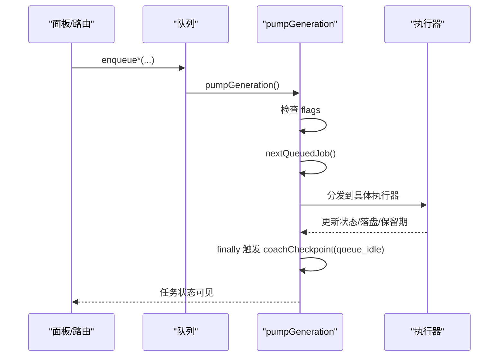
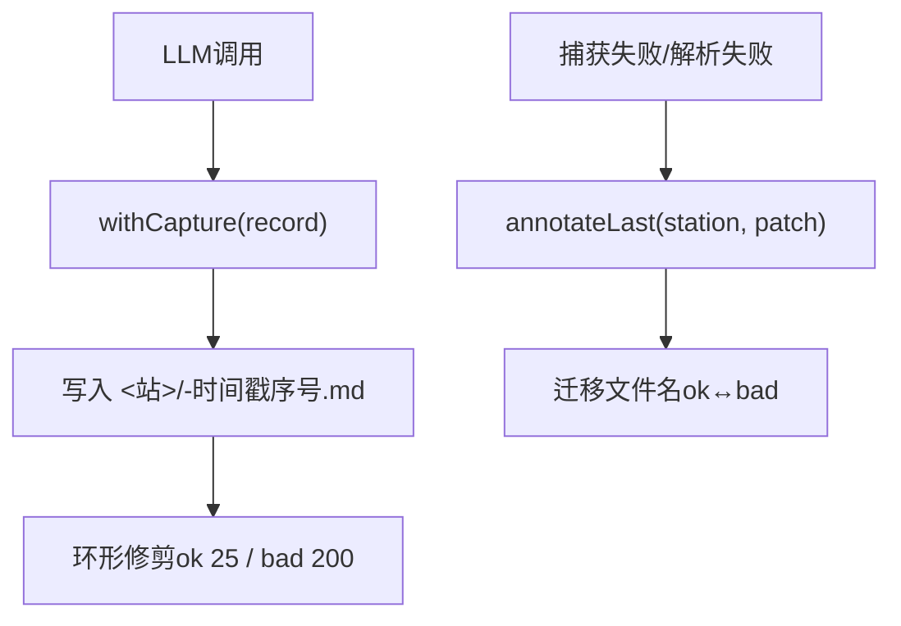
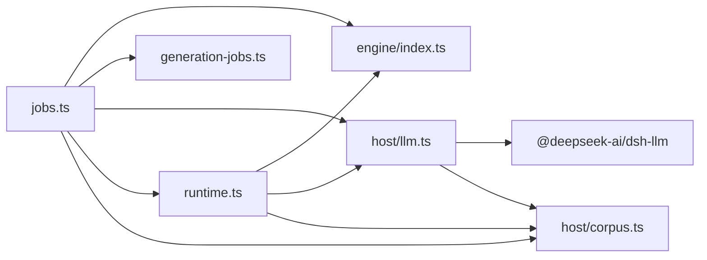

# 运行时管理

<cite>
**本文引用的文件**
- [src/host/runtime.ts](file://src/host/runtime.ts)
- [src/host/jobs.ts](file://src/host/jobs.ts)
- [src/host/corpus.ts](file://src/host/corpus.ts)
- [src/host/llm.ts](file://src/host/llm.ts)
- [src/generation-jobs.ts](file://src/generation-jobs.ts)
</cite>

## 目录
1. [简介](#简介)
2. [项目结构](#项目结构)
3. [核心组件](#核心组件)
4. [架构总览](#架构总览)
5. [详细组件分析](#详细组件分析)
6. [依赖关系分析](#依赖关系分析)
7. [性能考量](#性能考量)
8. [故障恢复与资源清理](#故障恢复与资源清理)
9. [结论](#结论)
10. [附录：自定义运行时配置示例与最佳实践](#附录自定义运行时配置示例与最佳实践)

## 简介
本文件聚焦宿主运行时（HostRuntime）的设计与实现，围绕以下目标展开：
- 插件生命周期管理与资源协调机制
- createHostRuntime 初始化流程（配置校验、目录检查、引擎实例化）
- 任务注册表 GenJob 与 HostJobs 的数据结构与状态管理
- 运行旗标 HostFlags 的队列暂停、并发控制与会话节流
- 运行时日志系统 runLog 的实现原理与输出格式
- 自定义运行时配置示例与最佳实践
- 故障恢复与资源清理机制

## 项目结构
宿主运行时相关代码集中在 host 层与生成任务契约中：
- runtime.ts：定义 HostRuntime、GenJob、HostJobs、HostFlags，提供 createHostRuntime、runLog、apiRun 等入口工具
- jobs.ts：生成队列、任务入队、执行泵、终态保留期清扫、教练触点与重启恢复
- corpus.ts：生成语料捕获器，记录 LLM 调用前后数据，支持环形归档与补标
- llm.ts：LLM 适配层，统一封装 dsh 流式调用、空闲超时、截断重试、档位降级与语料落盘
- generation-jobs.ts：生成任务状态机、阶段命名归一、FIFO 选取、保留期策略、失败结构化

图表来源
- [src/host/runtime.ts:138-193](file://src/host/runtime.ts#L138-L193)
- [src/host/jobs.ts:696-740](file://src/host/jobs.ts#L696-L740)
- [src/host/llm.ts:173-185](file://src/host/llm.ts#L173-L185)
- [src/host/corpus.ts:186-340](file://src/host/corpus.ts#L186-L340)
- [src/generation-jobs.ts:31-40](file://src/generation-jobs.ts#L31-L40)

章节来源
- [src/host/runtime.ts:138-193](file://src/host/runtime.ts#L138-L193)
- [src/host/jobs.ts:696-740](file://src/host/jobs.ts#L696-L740)
- [src/host/llm.ts:173-185](file://src/host/llm.ts#L173-L185)
- [src/host/corpus.ts:186-340](file://src/host/corpus.ts#L186-L340)
- [src/generation-jobs.ts:31-40](file://src/generation-jobs.ts#L31-L40)

## 核心组件
- HostRuntime：承载 engine、agent、corpus、vault、centerRel、jobs、flags、quizAuditRate 的可测试显式对象
- GenJob：课程/节点维度的生成任务记录，包含阶段、进度、失败清单、模型、负载等
- HostJobs：内存中的任务注册表 Map 与纯出题结果缓存
- HostFlags：queuePaused（队列暂停）、pumping（泵单并发闸）、lastSessionStartAt（会话节流戳）、genQueueBroken（任务档损坏标记）
- CorpusCapture：全量 LLM 调用落盘，支持 ok/bad/tolerated 三态与环形归档
- LLM 适配层：统一 dsh 流式调用、空闲超时、截断重试、档位降级、usage 观测与语料落盘

章节来源
- [src/host/runtime.ts:23-133](file://src/host/runtime.ts#L23-L133)
- [src/host/jobs.ts:292-350](file://src/host/jobs.ts#L292-L350)
- [src/host/corpus.ts:27-72](file://src/host/corpus.ts#L27-L72)
- [src/host/llm.ts:34-55](file://src/host/llm.ts#L34-L55)
- [src/generation-jobs.ts:6-15](file://src/generation-jobs.ts#L6-L15)

## 架构总览
HostRuntime 是宿主技术层的装配中心。createHostRuntime 完成配置校验、目录准备、引擎与 agent 缝装配、语料捕获器注入；jobs.ts 提供全局 FIFO 队列与单并发执行泵；corpus.ts 负责 LLM 调用全量落盘；llm.ts 屏蔽底层 dsh 细节并提供可测缝；generation-jobs.ts 提供状态机与保留期策略。

图表来源
- [src/host/runtime.ts:138-193](file://src/host/runtime.ts#L138-L193)
- [src/host/jobs.ts:292-350](file://src/host/jobs.ts#L292-L350)
- [src/host/jobs.ts:696-740](file://src/host/jobs.ts#L696-L740)
- [src/host/llm.ts:173-185](file://src/host/llm.ts#L173-L185)
- [src/host/corpus.ts:186-340](file://src/host/corpus.ts#L186-L340)

## 详细组件分析

### createHostRuntime 初始化流程
- 配置校验：
  - vault 必填且必须存在
  - centerRel 默认“学习中心”，拼接后需存在
  - quizAuditRate 必须在 0–1 之间，否则 fail loud
- 目录准备：
  - 若 learnhub.json 与课程注册表均不存在，则创建 state/learnhub.json 并写入当前 schema 版本
- 引擎与缝装配：
  - 构造 LearnhubEngine（传入 vault、centerRel、clock、rng、fs）
  - 构造 CorpusCapture（可覆盖 corpusDir）
  - 构造 AgentSeam，onCall 回调记录 console 与 runLog
- 运行时对象构建：
  - 初始化 jobs（Map）与 flags（queuePaused=false, pumping=false, lastSessionStartAt=0, genQueueBroken=null）
  - 设置 quizAuditRate

图表来源
- [src/host/runtime.ts:138-193](file://src/host/runtime.ts#L138-L193)

章节来源
- [src/host/runtime.ts:138-193](file://src/host/runtime.ts#L138-L193)

### 任务注册表 GenJob 与 HostJobs
- GenJob：
  - 键：course/node（内容管线）或 course/标签（图域任务）
  - 字段：startedAt、finishedAt、status、phase、progress、message、failures、style、tier、count、quizCount、section、instruction、model、growthOutcome/growthInject/growthForce、seedPayload/decompilePayload/planPayload/milestonePayload
- HostJobs：
  - genJobs: Map<string, GenJob>
  - quizJobResults: Map<string, 出题结果>（不持久化，仅进程内缓存）

状态管理要点：
- 入队幂等：重复入队返回“已在队列”消息
- 互斥：running/cancelling 拒绝新入队
- 终态保留期：done 保留 30 分钟，其他终态保留 24 小时
- 清扫：课程删除或节点改名/删除时清除悬空记录；broken 态跳过写回

图表来源
- [src/host/runtime.ts:46-103](file://src/host/runtime.ts#L46-L103)
- [src/generation-jobs.ts:6-15](file://src/generation-jobs.ts#L6-L15)

章节来源
- [src/host/runtime.ts:46-103](file://src/host/runtime.ts#L46-L103)
- [src/generation-jobs.ts:6-15](file://src/generation-jobs.ts#L6-L15)

### 运行旗标 HostFlags 的作用机制
- queuePaused：队列暂停开关，泵单时直接返回，不取任务
- pumping：全局单并发闸，防止重入执行
- lastSessionStartAt：会话节流戳，限制 coachTrigger 频率（30 分钟窗口）
- genQueueBroken：任务档损坏标记，期间拒绝一切会触发全量落盘的写操作（入队、重置、恢复），避免覆盖坏档

图表来源
- [src/host/jobs.ts:696-740](file://src/host/jobs.ts#L696-L740)
- [src/host/jobs.ts:274-286](file://src/host/jobs.ts#L274-L286)

章节来源
- [src/host/jobs.ts:274-286](file://src/host/jobs.ts#L274-L286)
- [src/host/jobs.ts:696-740](file://src/host/jobs.ts#L696-L740)

### 运行时日志系统 runLog
- 位置：centerStateDir/运行日志.md
- 格式：按时间戳分段，包含工具名与输出摘要，超过固定长度自动截断
- 行为：首次写入头信息；异步追加；失败静默不影响主流程
- 集成点：
  - AgentSeam.onCall：记录每次 LLM 调用摘要
  - apiRun：记录成功/失败摘要
  - 各任务执行路径：graph_job、coach_growth、quiz_job 等

图表来源
- [src/host/runtime.ts:217-238](file://src/host/runtime.ts#L217-L238)

章节来源
- [src/host/runtime.ts:217-238](file://src/host/runtime.ts#L217-L238)

### 生成队列与执行泵
- 入队：
  - enqueueGeneration：内容管线（outline→sections→quiz）
  - enqueueQuizGeneration：纯出题（phase=quiz）
  - enqueueGrowthBatch：生长批（phase=growth）
  - enqueueGraphJob：图域任务（seed/compass/decompile/plan/milestone）
- 执行泵 pumpGeneration：
  - 条件：未暂停、未泵单、未 broken
  - 选择 nextQueuedJob（FIFO by startedAt）
  - 分发到对应执行器
  - finally 触发 queue_idle 检查与复诊结算

图表来源
- [src/host/jobs.ts:292-350](file://src/host/jobs.ts#L292-L350)
- [src/host/jobs.ts:696-740](file://src/host/jobs.ts#L696-L740)

章节来源
- [src/host/jobs.ts:292-350](file://src/host/jobs.ts#L292-L350)
- [src/host/jobs.ts:696-740](file://src/host/jobs.ts#L696-L740)

### 语料捕获与失败补标
- 捕获：
  - 所有 LLM 调用经 withCapture 落盘，记录 frontmatter（ts/station/kind/effort/outcome/code/truncated/duration_ms/usage/provider/model/prompt_chars/reply_chars）
  - 工具调用载荷以独立段落保存
- 补标：
  - annotateLast：将最近一条捕获改判为 failed/tolerated，并在 ok/bad 桶间迁移文件名
  - 失败详情引用：生成任务 message 附带语料相对路径，便于定位死因样本

图表来源
- [src/host/corpus.ts:186-340](file://src/host/corpus.ts#L186-L340)
- [src/host/llm.ts:112-165](file://src/host/llm.ts#L112-L165)

章节来源
- [src/host/corpus.ts:186-340](file://src/host/corpus.ts#L186-L340)
- [src/host/llm.ts:112-165](file://src/host/llm.ts#L112-L165)

## 依赖关系分析
- runtime.ts 依赖：
  - engine/index.ts：LearnhubEngine、AgentSeam、DEFAULT_QUIZ_AUDIT_RATE、CURRENT_SCHEMA_VERSION
  - host/llm.ts：llmSeam、llmStreamSeam
  - host/corpus.ts：createCorpusCapture
  - host/clock.ts：mathRng、systemClock
  - host/vault-fs.ts：nodeVaultFs
- jobs.ts 依赖：
  - engine/index.ts：Content、TIER_LABELS、endpointNames、readAnchors、growth2、bank2 等
  - generation-jobs.ts：状态、阶段、保留期、失败结构化
  - host/llm.ts：contentEffort、llmCfg、llmSeam、llmSeamStripped
  - host/runtime.ts：runLog、HostRuntime、GenJob
  - host/corpus.ts：STATIONS
- llm.ts 依赖：
  - @deepseek-ai/dsh-llm：流式调用、工具调用、usage
  - engine/prompts/host.ts：回路提示模板
  - host/corpus.ts：CorpusRecordInput
- corpus.ts 依赖：
  - engine/index.ts：QUIZ_SOLVER_STATION、QUALITY_REVIEW_STATION

图表来源
- [src/host/runtime.ts:11-22](file://src/host/runtime.ts#L11-L22)
- [src/host/jobs.ts:7-33](file://src/host/jobs.ts#L7-L33)
- [src/host/llm.ts:15-32](file://src/host/llm.ts#L15-L32)
- [src/host/corpus.ts:23-26](file://src/host/corpus.ts#L23-L26)

章节来源
- [src/host/runtime.ts:11-22](file://src/host/runtime.ts#L11-L22)
- [src/host/jobs.ts:7-33](file://src/host/jobs.ts#L7-L33)
- [src/host/llm.ts:15-32](file://src/host/llm.ts#L15-L32)
- [src/host/corpus.ts:23-26](file://src/host/corpus.ts#L23-L26)

## 性能考量
- 队列单并发：pumping 标志保证全局单并发，避免资源争用与竞争条件
- FIFO 调度：按 startedAt 排序，确保公平性
- 保留期优化：done 短保留（30 分钟），调试类终态长保留（24 小时），减少注册表体积
- 语料环形归档：ok 桶 25、bad 桶 200，控制磁盘增长
- LLM 调用策略：
  - 空闲超时：120 秒无输出中止
  - 截断重试：max-tokens 超限时提高上限重试一次
  - 档位降级：UNSUPPORTED_REASONING_EFFORT 自动降级为部署默认重试一次
- 日志截断：单条日志上限 1500 字符，避免大输出阻塞 IO

章节来源
- [src/host/jobs.ts:696-740](file://src/host/jobs.ts#L696-L740)
- [src/generation-jobs.ts:42-50](file://src/generation-jobs.ts#L42-L50)
- [src/host/corpus.ts:27-30](file://src/host/corpus.ts#L27-L30)
- [src/host/llm.ts:64-68](file://src/host/llm.ts#L64-L68)
- [src/host/llm.ts:277-298](file://src/host/llm.ts#L277-L298)
- [src/host/runtime.ts:195-231](file://src/host/runtime.ts#L195-L231)

## 故障恢复与资源清理
- 任务档损坏（genQueueBroken）：
  - 写回闸拒绝入队/重置/恢复，避免覆盖坏档
  - 清扫与泵单在 broken 态跳过，修复后重启恢复
- 终态保留期与清扫：
  - scheduleJobRetention：终态盖 finishedAt 戳，定时清理
  - sweepGenJobs：课程/节点缺失或超期清册；running 先置 cancelling 再删
- 教练触点节流：
  - sessionStartCheckpoint：30 分钟窗口内不重复触发
  - queue_idle：队列排空后触发就绪深度检查与复诊结算
- 语料失败补标：
  - failCorpus：将最近一条捕获改判 failed+code，并迁移至 bad 桶
  - 生成任务失败详情携带语料相对路径，便于定位
- 资源释放：
  - 队列泵 finally 重置 pumping
  - 语料写入 fire-and-forget，失败静默
  - 定时器 unref，避免阻止进程退出

章节来源
- [src/host/jobs.ts:274-286](file://src/host/jobs.ts#L274-L286)
- [src/host/jobs.ts:381-437](file://src/host/jobs.ts#L381-L437)
- [src/host/jobs.ts:528-544](file://src/host/jobs.ts#L528-L544)
- [src/host/jobs.ts:696-740](file://src/host/jobs.ts#L696-L740)
- [src/host/corpus.ts:186-340](file://src/host/corpus.ts#L186-L340)

## 结论
HostRuntime 通过显式对象装配与严格的状态机设计，实现了可测试、可观测、可恢复的宿主运行时。队列与执行泵保障单并发与公平调度；语料捕获与失败补标提供完整的诊断材料；运行日志与保留期策略兼顾可观测性与资源占用。结合 HostFlags 的暂停、并发与会话节流，系统在复杂场景下仍保持稳定与可控。

## 附录：自定义运行时配置示例与最佳实践
- 配置项说明：
  - vault：必填，绝对路径，机器级配置
  - centerRel：可选，相对 vault 的路径，默认“学习中心”
  - provider/model：AI 生成/判卷的 provider 与模型名
  - fastEffort/deepEffort：机械调用与高复杂度节点的思考档
  - quizAuditRate：出题第二意见门抽样率，0–1，0 表示关闭
  - corpusDir：生成语料落盘目录覆盖，默认使用引擎 paths.corpusDir
- 最佳实践：
  - 始终校验 vault 与 centerRel 存在，避免静默兜底
  - quizAuditRate 仅在需要时开启，控制成本与质量平衡
  - 生产环境建议固定 provider/model，变更需重启宿主
  - 语料目录可指向持久化路径，便于离线评审与回归
  - 监控运行日志与生成语料，关注失败码与耗时分布
  - 遇到 genQueueBroken，优先修复任务档后再恢复队列

章节来源
- [src/host/runtime.ts:23-44](file://src/host/runtime.ts#L23-L44)
- [src/host/runtime.ts:138-193](file://src/host/runtime.ts#L138-L193)
- [src/host/llm.ts:34-55](file://src/host/llm.ts#L34-L55)