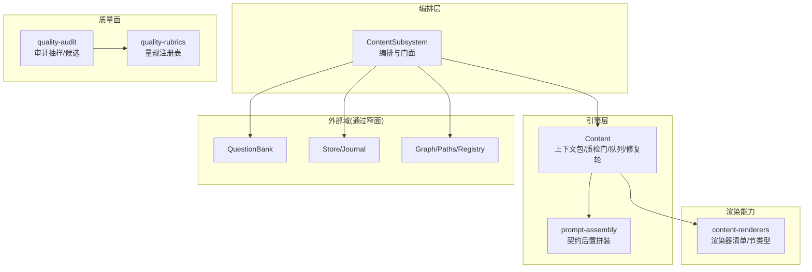
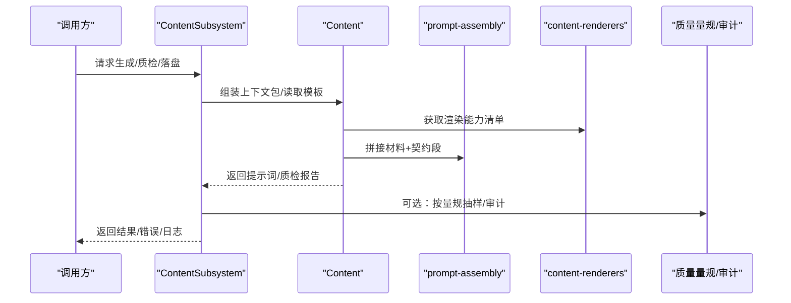
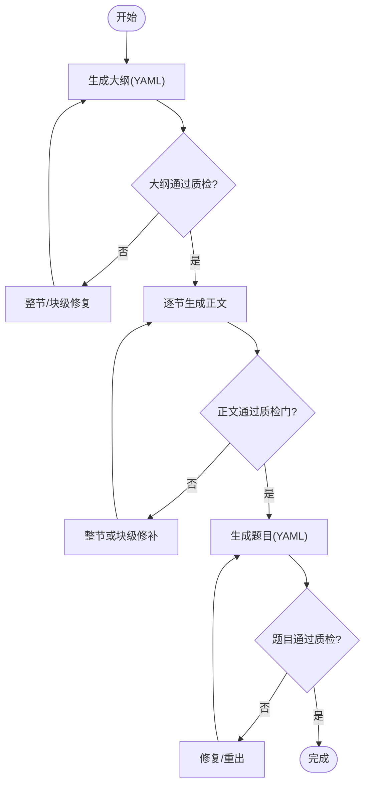
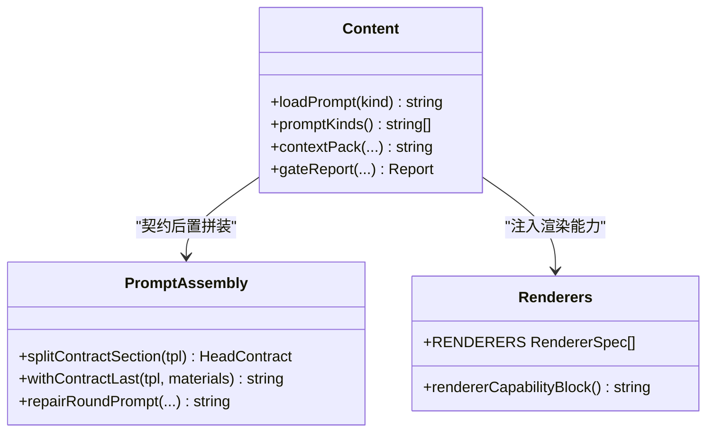
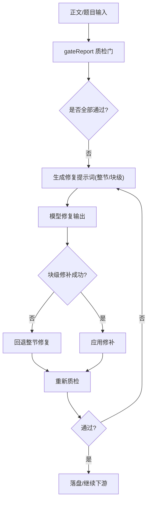
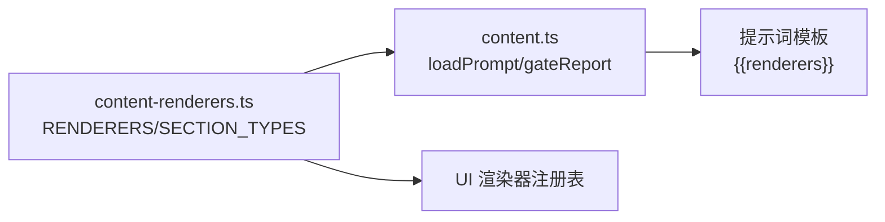
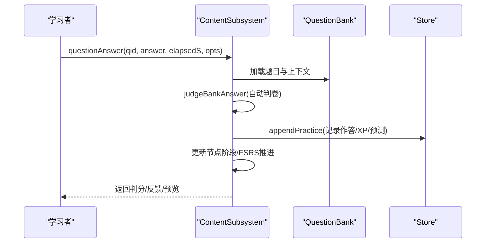
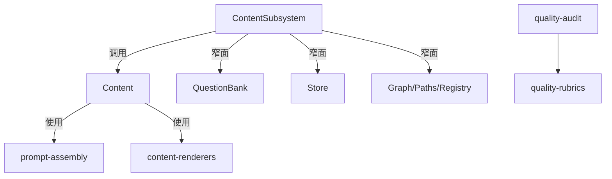

# 内容子系统

<cite>
**本文引用的文件**
- [content-subsystem.ts](file://src/engine/content-subsystem.ts)
- [content.ts](file://src/engine/content.ts)
- [prompt-assembly.ts](file://src/engine/prompt-assembly.ts)
- [quality-audit.ts](file://src/engine/quality-audit.ts)
- [quality-rubrics.ts](file://src/engine/quality-rubrics.ts)
- [templates.ts](file://src/engine/prompts/templates.ts)
- [content-renderers.ts](file://shared/content-renderers.ts)
</cite>

## 目录
1. [简介](#简介)
2. [项目结构](#项目结构)
3. [核心组件](#核心组件)
4. [架构总览](#架构总览)
5. [详细组件分析](#详细组件分析)
6. [依赖关系分析](#依赖关系分析)
7. [性能考量](#性能考量)
8. [故障排查指南](#故障排查指南)
9. [结论](#结论)
10. [附录：配置与集成示例路径](#附录：配置与集成示例路径)

## 简介
本文件系统性地说明“内容子系统”的职责边界、数据流与处理逻辑，覆盖以下目标：
- 内容生成流水线：从大纲生成到正文创作再到题目生成的端到端流程。
- 提示词工程：模板管理、变量注入与契约后置拼装机制。
- 质量审核系统：评分标准、审核规则与反馈机制。
- 内容渲染器扩展：多格式渲染能力注册与注入。
- 实践指引：如何配置生成参数、自定义审核规则与集成外部渲染器（以代码片段路径引用为主）。

## 项目结构
内容子系统由“编排层（ContentSubsystem）+ 引擎层（Content）+ 提示词装配（prompt-assembly）+ 质量量规（quality-rubrics/quality-audit）+ 渲染能力（content-renderers）”构成。各模块职责清晰、耦合低，通过窄接口协作。

图表来源
- [content-subsystem.ts:101-177](file://src/engine/content-subsystem.ts#L101-L177)
- [content.ts:141-277](file://src/engine/content.ts#L141-L277)
- [prompt-assembly.ts:14-29](file://src/engine/prompt-assembly.ts#L14-L29)
- [quality-rubrics.ts:60-128](file://src/engine/quality-rubrics.ts#L60-L128)
- [content-renderers.ts:24-67](file://shared/content-renderers.ts#L24-L67)

章节来源
- [content-subsystem.ts:101-177](file://src/engine/content-subsystem.ts#L101-L177)
- [content.ts:141-277](file://src/engine/content.ts#L141-L277)

## 核心组件
- ContentSubsystem：面向外部的编排入口，负责课程解析、视图加载、生成上下文组装、质检门禁、落盘应用、复习队列、作答与调度联动等。
- Content：内容管线引擎，负责上下文包构造、提示词模板加载与版本升级、质检门（超纲/别名/长度/可视化块/预测门）、修复轮（整节/块级局部修补）、交互件提取与落盘、题库写入等。
- prompt-assembly：提示词契约后置拼装，确保“输出契约段”始终位于最终提示词末尾，避免“中间丢失”问题。
- quality-rubrics：五类产物（大纲/节正文/题目/教练回合/种子·终点）的质量量规注册表，定义维度、判据、证据要求与出处锚点。
- quality-audit：图质量面审计抽样，基于量规统计低分率并产出系统性发现候选，用于报告与票面蒸馏。
- content-renderers：渲染器与节类型清单，是 UI 渲染与引擎提示词的单一事实源；支持新增格式即插即用。

章节来源
- [content-subsystem.ts:101-177](file://src/engine/content-subsystem.ts#L101-L177)
- [content.ts:279-378](file://src/engine/content.ts#L279-L378)
- [prompt-assembly.ts:14-29](file://src/engine/prompt-assembly.ts#L14-L29)
- [quality-rubrics.ts:60-128](file://src/engine/quality-rubrics.ts#L60-L128)
- [quality-audit.ts:50-74](file://src/engine/quality-audit.ts#L50-L74)
- [content-renderers.ts:24-67](file://shared/content-renderers.ts#L24-L67)

## 架构总览
内容子系统采用“编排-引擎-质量-渲染”分层设计：
- 编排层（ContentSubsystem）聚合跨域能力（题库、存储、图谱、注册表），对外暴露稳定门面。
- 引擎层（Content）专注内容生产与校验，提供可复用的上下文包、质检门、修复轮与队列管理。
- 质量面（quality-rubrics/quality-audit）将教育学承诺操作化为可评审的量规，并提供抽样审计与系统性问题候选。
- 渲染能力（content-renderers）集中声明支持的代码块语言与节类型，双向同步 UI 与引擎。

图表来源
- [content-subsystem.ts:125-157](file://src/engine/content-subsystem.ts#L125-L157)
- [content.ts:334-365](file://src/engine/content.ts#L334-L365)
- [prompt-assembly.ts:21-29](file://src/engine/prompt-assembly.ts#L21-L29)
- [content-renderers.ts:97-108](file://shared/content-renderers.ts#L97-L108)
- [quality-audit.ts:80-94](file://src/engine/quality-audit.ts#L80-L94)

## 详细组件分析

### 内容生成流水线（大纲→正文→题目）
- 大纲生成：使用“课程大纲”模板，结合上下文包 §9 复杂度档案与 §10/§11 先做后教/思维轨迹要求，输出 YAML 节清单（id/title/type/tier/visual/points）。
- 正文创作：使用“课程节生成”或风格变体（苏格拉底/费曼）模板，注入前节结尾、本节任务、Vault 先验与渲染能力清单，约束可视化为主、文字为辅，单节可视化块上限与字数预算受质检门控制。
- 题目生成：使用“题目生成”模板，遵循题型多样、难度递进、数学记法契约、只考讲过的内容等硬约束，并支持 Vault 先验与已有题查重。

图表来源
- [content.ts:141-277](file://src/engine/content.ts#L141-L277)
- [content.ts:757-788](file://src/engine/content.ts#L757-L788)
- [templates.ts:20-71](file://src/engine/prompts/templates.ts#L20-L71)
- [templates.ts:72-151](file://src/engine/prompts/templates.ts#L72-L151)
- [templates.ts:175-200](file://src/engine/prompts/templates.ts#L175-L200)

章节来源
- [content.ts:141-277](file://src/engine/content.ts#L141-L277)
- [content.ts:757-788](file://src/engine/content.ts#L757-L788)
- [templates.ts:20-71](file://src/engine/prompts/templates.ts#L20-L71)
- [templates.ts:72-151](file://src/engine/prompts/templates.ts#L72-L151)
- [templates.ts:175-200](file://src/engine/prompts/templates.ts#L175-L200)

### 提示词工程（模板管理、变量注入、契约验证）
- 模板管理：内置模板键集与 vault 快照版本比对，自动升级旧模板并备份 .bak；支持用户自建同名模板覆盖。
- 变量注入：{{renderers}} 占位符在运行时替换为渲染能力清单；模板无该占位符时自动追加注入段，保证向后兼容。
- 契约验证：withContractLast 将“输出契约段”置于最终提示词末尾，确保模型最后读到“只输出 X”的强指令；修复轮同样保持契约段置尾。

图表来源
- [content.ts:334-365](file://src/engine/content.ts#L334-L365)
- [prompt-assembly.ts:14-29](file://src/engine/prompt-assembly.ts#L14-L29)
- [content-renderers.ts:97-108](file://shared/content-renderers.ts#L97-L108)

章节来源
- [content.ts:334-365](file://src/engine/content.ts#L334-L365)
- [prompt-assembly.ts:14-29](file://src/engine/prompt-assembly.ts#L14-L29)
- [content-renderers.ts:97-108](file://shared/content-renderers.ts#L97-L108)

### 质量审核系统（评分标准、审核规则、反馈机制）
- 评分标准：quality-rubrics 定义五类产物的量规，每条判据包含标准、证据要求、出处与锚点，确保可追溯与人审对账。
- 审核规则：content.gateReport 执行自动化质检门（超纲、别名、长度、可视化块、预测门、交互件存在性等），返回 findings/warns。
- 反馈机制：sectionRepairPrompt/sectionRepairBody 将上次输出与定位后的质检清单回灌，驱动模型定向修复；blockPatchPlan/applyBlockPatch 实现块级局部修补，失败则回退整节修复。

图表来源
- [content.ts:757-788](file://src/engine/content.ts#L757-L788)
- [content.ts:642-668](file://src/engine/content.ts#L642-L668)
- [content.ts:670-731](file://src/engine/content.ts#L670-L731)
- [quality-rubrics.ts:129-224](file://src/engine/quality-rubrics.ts#L129-L224)

章节来源
- [content.ts:757-788](file://src/engine/content.ts#L757-L788)
- [content.ts:642-668](file://src/engine/content.ts#L642-L668)
- [content.ts:670-731](file://src/engine/content.ts#L670-L731)
- [quality-rubrics.ts:129-224](file://src/engine/quality-rubrics.ts#L129-L224)

### 内容渲染器扩展机制
- 统一事实源：RENDERERS 与 SECTION_TYPES 同时被 UI 与引擎消费，新增格式只需在两侧注册即可自动生效。
- 提示词注入：loadPrompt 将渲染能力清单注入模板 {{renderers}}，未命中时自动追加，保障兼容性。
- 白名单校验：gateReport 检测未注册代码块语言并告警，防止面板无法渲染的降级风险。

图表来源
- [content-renderers.ts:24-67](file://shared/content-renderers.ts#L24-L67)
- [content.ts:334-365](file://src/engine/content.ts#L334-L365)
- [content.ts:490-501](file://src/engine/content.ts#L490-L501)

章节来源
- [content-renderers.ts:24-67](file://shared/content-renderers.ts#L24-L67)
- [content.ts:334-365](file://src/engine/content.ts#L334-L365)
- [content.ts:490-501](file://src/engine/content.ts#L490-L501)

### 复习队列与作答（学习流集成）
- 复习队列：汇总课程题库、我的卡、错误对比卡与笔记源卡，按遗忘风险 R 升序、难度渐进排序，支持 N-of-1 实验臂与校准提示。
- 作答流：questionAnswer 自动判卷（reflection 走 AI），记录 practice 流水、XP、FSRS 推进与节点阶段变更；支持 deferSchedule 挂起调度至背面自评。

图表来源
- [content-subsystem.ts:727-800](file://src/engine/content-subsystem.ts#L727-L800)
- [content-subsystem.ts:538-717](file://src/engine/content-subsystem.ts#L538-L717)

章节来源
- [content-subsystem.ts:538-717](file://src/engine/content-subsystem.ts#L538-L717)
- [content-subsystem.ts:727-800](file://src/engine/content-subsystem.ts#L727-L800)

## 依赖关系分析
- ContentSubsystem 依赖窄面注入的 Store、Paths、Registry、QuestionBank、Sessions、LearnerCards、Clock 等，避免反向耦合。
- Content 依赖 complex 度、notes、seed、prompts、renderers 等内部模块，但不直接依赖宿主；契约拼装与模板加载解耦。
- 质量面通过 quality-rubrics 提供量规，quality-audit 基于量规进行抽样与候选计算，报告渲染集中在 quality-review 侧。

图表来源
- [content-subsystem.ts:18-78](file://src/engine/content-subsystem.ts#L18-L78)
- [content.ts:141-277](file://src/engine/content.ts#L141-L277)
- [quality-audit.ts:18-21](file://src/engine/quality-audit.ts#L18-L21)

章节来源
- [content-subsystem.ts:18-78](file://src/engine/content-subsystem.ts#L18-L78)
- [content.ts:141-277](file://src/engine/content.ts#L141-L277)
- [quality-audit.ts:18-21](file://src/engine/quality-audit.ts#L18-L21)

## 性能考量
- 上下文包截断：禁止概念列表按深度降序截取固定条数，控制提示词体积，降低模型负载。
- 质检门快速失败：长度/可视化块/预测门等检查优先，尽早拦截低质输出，减少修复轮次数。
- 块级局部修补：仅针对违规块进行替换，避免整节重写带来的额外成本。
- 复习队列排序：按遗忘风险分档与难度渐进，提升练习效率与记忆巩固效果。

[本节为通用指导，不直接分析具体文件]

## 故障排查指南
- 提示词版本不一致：loadPrompt 会比对内置版本与 vault 快照，必要时自动升级并备份 .bak；若仍报错，检查模板首行版本标记与 PROMPT_CHANGELOG。
- 未注册代码块语言：gateReport 会告警未注册的 lang；请在 content-renderers 中注册并在 UI 实现渲染器。
- 交互件缺失：gateReport 检查 interactive 引用文件是否存在；请确认 extractInteractive 落盘路径与中心根相对路径一致。
- 预测门非法：checkPredictBlocks 会报字段缺失/选项重复/answer 不在 options 等问题；按定位修正对应块。
- 正文过长：sectionRepairBody 会给出压缩目标与字数口径；优先删冗余解说与重复示例，保留可视化方案。

章节来源
- [content.ts:334-365](file://src/engine/content.ts#L334-L365)
- [content.ts:490-501](file://src/engine/content.ts#L490-L501)
- [content.ts:778-786](file://src/engine/content.ts#L778-L786)
- [content.ts:503-519](file://src/engine/content.ts#L503-L519)
- [content.ts:642-668](file://src/engine/content.ts#L642-L668)

## 结论
内容子系统通过清晰的层次划分与稳定的门面接口，实现了从大纲到正文再到题目的完整生成流水线；提示词工程以“契约后置拼装”为核心，确保模型输出可控；质量审核系统以量规为锚，结合自动化质检与修复轮，形成闭环；渲染能力以单一事实源支撑 UI 与引擎的双向同步。整体设计兼顾可扩展性、可维护性与可观测性。

[本节为总结性内容，不直接分析具体文件]

## 附录：配置与集成示例路径
- 配置内容生成参数（大纲/正文/题目模板选择与注入）：
  - [templates.ts:20-71](file://src/engine/prompts/templates.ts#L20-L71)
  - [templates.ts:72-151](file://src/engine/prompts/templates.ts#L72-L151)
  - [templates.ts:175-200](file://src/engine/prompts/templates.ts#L175-L200)
- 自定义审核规则（扩展质检门与修复策略）：
  - [content.ts:757-788](file://src/engine/content.ts#L757-L788)
  - [content.ts:642-668](file://src/engine/content.ts#L642-L668)
  - [content.ts:670-731](file://src/engine/content.ts#L670-L731)
- 集成外部渲染器（新增代码块语言与节类型）：
  - [content-renderers.ts:24-67](file://shared/content-renderers.ts#L24-L67)
  - [content.ts:334-365](file://src/engine/content.ts#L334-L365)
  - [content.ts:490-501](file://src/engine/content.ts#L490-L501)
- 复习队列与作答集成（学习流对接）：
  - [content-subsystem.ts:538-717](file://src/engine/content-subsystem.ts#L538-L717)
  - [content-subsystem.ts:727-800](file://src/engine/content-subsystem.ts#L727-L800)