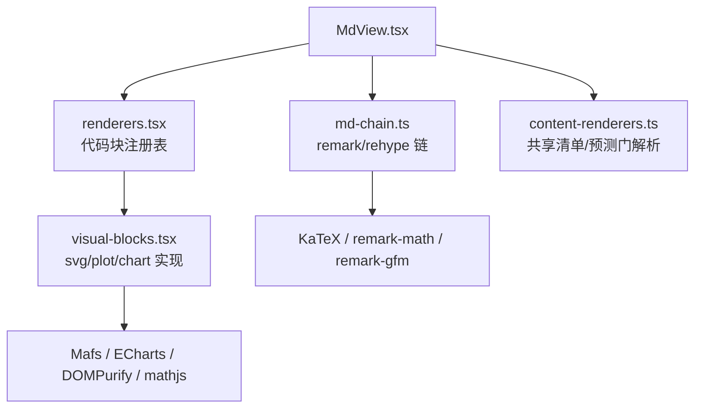
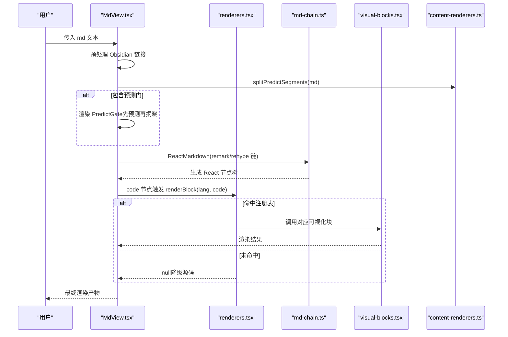
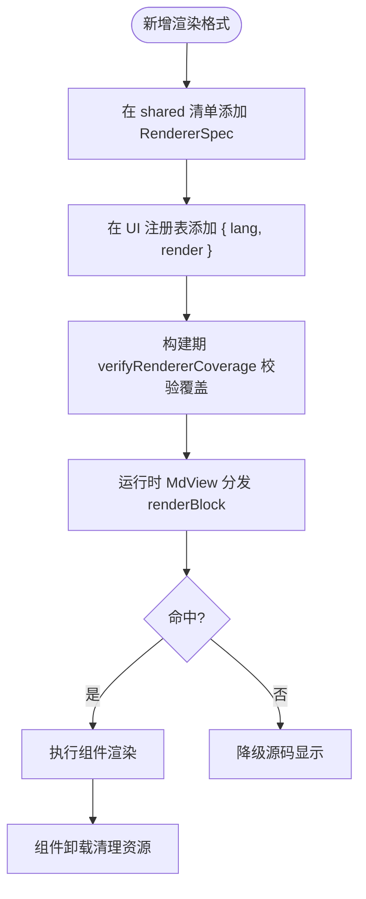
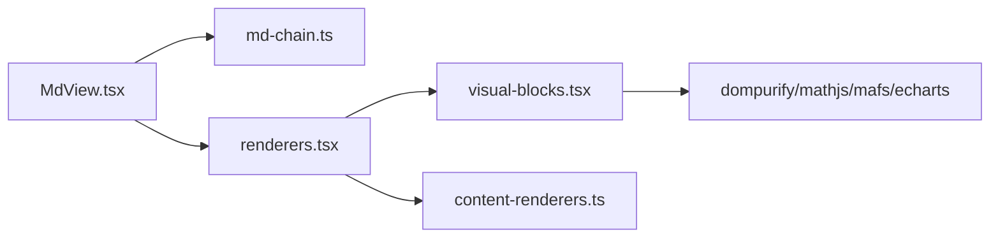

# 内容渲染器

<cite>
**本文引用的文件**
- [shared/content-renderers.ts](file://shared/content-renderers.ts)
- [ui/src/components/renderers.tsx](file://ui/src/components/renderers.tsx)
- [ui/src/components/MdView.tsx](file://ui/src/components/MdView.tsx)
- [ui/src/components/visual-blocks.tsx](file://ui/src/components/visual-blocks.tsx)
- [ui/src/lib/md-chain.ts](file://ui/src/lib/md-chain.ts)
</cite>

## 目录
1. [简介](#简介)
2. [项目结构](#项目结构)
3. [核心组件](#核心组件)
4. [架构总览](#架构总览)
5. [详细组件分析](#详细组件分析)
6. [依赖关系分析](#依赖关系分析)
7. [性能考量](#性能考量)
8. [故障排查指南](#故障排查指南)
9. [结论](#结论)
10. [附录：扩展与示例](#附录：扩展与示例)

## 简介
本文件面向“内容渲染器”子系统，系统性说明其扩展机制、渲染管道、生命周期管理、支持的渲染格式（Markdown、HTML、LaTeX、交互组件等）、配置与主题定制能力、以及性能优化策略。文档同时提供可操作的扩展步骤与集成第三方渲染库的实践路径，帮助读者在不破坏既有契约的前提下安全地扩展渲染能力。

## 项目结构
渲染系统由“共享清单 + UI 注册表 + Markdown 渲染链 + 可视化块实现”四部分组成：
- 共享清单 shared/content-renderers.ts：定义所有受支持的代码块语言、节类型、预测门解析规则，是引擎提示词与 UI 注册的单一事实源。
- UI 注册表 ui/src/components/renderers.tsx：按 lang 分发代码块到具体 React 组件；未命中则降级源码显示。
- Markdown 渲染链 ui/src/lib/md-chain.ts：remark/rehype 插件链，负责 GFM、数学公式与 KaTeX 渲染，并禁用裸 HTML。
- 可视化块 ui/src/components/visual-blocks.tsx：svg/plot/chart 的具体实现，采用动态导入与按需注册，避免首屏体积膨胀。
- MdView ui/src/components/MdView.tsx：串联预处理、预测门分片、代码块分发与 Markdown 渲染的核心入口。



图表来源
- [ui/src/components/MdView.tsx:1-103](file://ui/src/components/MdView.tsx#L1-L103)
- [ui/src/components/renderers.tsx:1-166](file://ui/src/components/renderers.tsx#L1-L166)
- [ui/src/lib/md-chain.ts:1-17](file://ui/src/lib/md-chain.ts#L1-L17)
- [ui/src/components/visual-blocks.tsx:1-296](file://ui/src/components/visual-blocks.tsx#L1-L296)
- [shared/content-renderers.ts:1-197](file://shared/content-renderers.ts#L1-L197)

章节来源
- [ui/src/components/MdView.tsx:1-103](file://ui/src/components/MdView.tsx#L1-L103)
- [ui/src/components/renderers.tsx:1-166](file://ui/src/components/renderers.tsx#L1-L166)
- [ui/src/lib/md-chain.ts:1-17](file://ui/src/lib/md-chain.ts#L1-L17)
- [ui/src/components/visual-blocks.tsx:1-296](file://ui/src/components/visual-blocks.tsx#L1-L296)
- [shared/content-renderers.ts:1-197](file://shared/content-renderers.ts#L1-L197)

## 核心组件
- 共享清单 RendererSpec/RENDERERS：声明所有支持的语言标记、标签、提示与示例，作为生成提示词注入与 UI 注册表的唯一事实源。新增格式需在此登记。
- 代码块注册表 BLOCK_RENDERERS：将 lang 映射到 React 渲染函数；未命中时返回 null，调用方降级为源码显示。
- Markdown 渲染链 REMARK_PLUGINS/REHYPE_PLUGINS/MD_HTML_POLICY：统一启用 GFM、数学公式与 KaTeX，并禁止裸 HTML，防止机器注释泄露。
- 可视化块 SvgBlock/PlotBlock/ChartBlock：分别处理 SVG 清洗渲染、数学坐标图（JSON spec → Mafs）、数据图表（ECharts option）。
- MdView：预处理 Obsidian 图片链接、切分预测门段落、通过 react-markdown 渲染正文，并在 code 节点中按 lang 分发到注册表。

章节来源
- [shared/content-renderers.ts:10-116](file://shared/content-renderers.ts#L10-L116)
- [ui/src/components/renderers.tsx:135-166](file://ui/src/components/renderers.tsx#L135-L166)
- [ui/src/lib/md-chain.ts:9-17](file://ui/src/lib/md-chain.ts#L9-L17)
- [ui/src/components/visual-blocks.tsx:20-296](file://ui/src/components/visual-blocks.tsx#L20-L296)
- [ui/src/components/MdView.tsx:28-85](file://ui/src/components/MdView.tsx#L28-L85)

## 架构总览
渲染流程从 MdView 开始，经过预处理、预测门分片、Markdown 解析与代码块分发，最终落到各渲染器或降级源码。



图表来源
- [ui/src/components/MdView.tsx:46-85](file://ui/src/components/MdView.tsx#L46-L85)
- [ui/src/components/renderers.tsx:151-155](file://ui/src/components/renderers.tsx#L151-L155)
- [ui/src/lib/md-chain.ts:9-17](file://ui/src/lib/md-chain.ts#L9-L17)
- [ui/src/components/visual-blocks.tsx:20-296](file://ui/src/components/visual-blocks.tsx#L20-L296)
- [shared/content-renderers.ts:179-197](file://shared/content-renderers.ts#L179-L197)

## 详细组件分析

### 渲染器扩展机制与生命周期
- 扩展点
  - 在 shared/content-renderers.ts 的 RENDERERS 中添加一项（lang、label、hint、example），用于提示词注入与校验。
  - 在 ui/src/components/renderers.tsx 的 BLOCK_RENDERERS 中增加一个 { lang, render } 项，指向 React 组件。
  - 若涉及重依赖（如 mermaid、echarts、mafs），应在组件内部使用动态 import，避免首屏加载。
- 生命周期
  - 构建期：verifyRendererCoverage() 会检查 shared 清单中的 lang 是否都有 UI 实现（math 除外，走 remark 链）。
  - 运行期：MdView 在 code 节点处调用 renderBlock(lang, code)，命中则渲染，否则降级源码。
  - 卸载期：可视化块在 useEffect 中清理监听、ResizeObserver、实例销毁，确保无内存泄漏。



图表来源
- [shared/content-renderers.ts:24-67](file://shared/content-renderers.ts#L24-L67)
- [ui/src/components/renderers.tsx:142-166](file://ui/src/components/renderers.tsx#L142-L166)
- [ui/src/components/MdView.tsx:28-35](file://ui/src/components/MdView.tsx#L28-L35)

章节来源
- [shared/content-renderers.ts:24-67](file://shared/content-renderers.ts#L24-L67)
- [ui/src/components/renderers.tsx:142-166](file://ui/src/components/renderers.tsx#L142-L166)
- [ui/src/components/MdView.tsx:28-35](file://ui/src/components/MdView.tsx#L28-L35)

### 渲染管道与 Markdown/LaTeX/HTML 支持
- Markdown：通过 react-markdown + remark-gfm 支持表格、删除线、任务列表。
- LaTeX：remark-math + rehype-katex 支持行内 $...$ 与独立 $$...$$ 公式；化学宏 mhchem 已注册。
- HTML：MD_HTML_POLICY.skipHtml = true，丢弃裸 HTML 节点（如机器注释），但代码块内的 HTML 不受影响。
- 图片：Obsidian 嵌入语法 ![[path]] 被预处理为面板文件路由 URL，便于服务端托管 vault 资源。

章节来源
- [ui/src/lib/md-chain.ts:9-17](file://ui/src/lib/md-chain.ts#L9-L17)
- [ui/src/components/MdView.tsx:37-57](file://ui/src/components/MdView.tsx#L37-L57)

### 支持的渲染格式与实现要点
- mermaid：动态导入 mermaid，根据 arco-theme 切换 dark/default 主题；失败回退源码。
- media：每行一个 vault 相对媒体路径，按扩展名选择 video/audio 播放器，通过 /learnhub/api/file 路由访问。
- interactive：sandbox iframe 加载自包含 HTML；通过 postMessage 协议上报完成与标注；成绩在 SettleContext 下上报练习档案。
- svg：DOMPurify 白名单清洗后内联渲染，禁用脚本与外部引用。
- plot：JSON spec 经 mathjs 求值，使用 Mafs 坐标系渲染函数、向量、点、线段、圆、多边形与标签。
- chart：标准 ECharts option，仅允许 line/bar/pie/scatter 四类 series，禁外部 URL；按需注册 echarts/core/charts/components/renderer，ResizeObserver 自适应尺寸。

章节来源
- [ui/src/components/renderers.tsx:17-149](file://ui/src/components/renderers.tsx#L17-L149)
- [ui/src/components/visual-blocks.tsx:20-296](file://ui/src/components/visual-blocks.tsx#L20-L296)

### 预测门（learnhub-predict）与节类型
- 预测门：正文内 ```learnhub-predict 围栏块，UI 将其切分为 md 与 predict 段；门未过不渲染 after 部分，揭晓后递归渲染。非法块降级源码显示。
- 节类型：SECTION_TYPES 提供概念/例题/演示/小结/练习/交互/思维轨迹等前缀；parseSectionTitle 解析标题前缀并返回类型与干净标题。

章节来源
- [shared/content-renderers.ts:69-95](file://shared/content-renderers.ts#L69-L95)
- [shared/content-renderers.ts:117-197](file://shared/content-renderers.ts#L117-L197)
- [ui/src/components/MdView.tsx:60-85](file://ui/src/components/MdView.tsx#L60-L85)

### 配置选项与主题定制
- 主题
  - Mermaid：依据 document.body.arco-theme 自动选择 dark/default。
  - ECharts：init 时根据 arco-theme 选择 dark 主题，背景透明以适配页面。
- 样式覆盖
  - 通过 CSS 类名（如 .md-mermaid、.md-svg、.md-chart、.md-body）进行样式覆盖。
  - 行内场景（InlineMd）将 p 降为 span 以保持行内布局。
- 布局调整
  - 可视化块容器使用 flex 列布局与间距类（lh-col/lh-gap-*），可通过外层容器控制高度与宽度。
- 安全策略
  - skipHtml 阻止裸 HTML 渲染；SVG 使用 DOMPurify 白名单；chart 限制 series 类型与外部 URL。

章节来源
- [ui/src/components/renderers.tsx:17-41](file://ui/src/components/renderers.tsx#L17-L41)
- [ui/src/components/visual-blocks.tsx:23-37](file://ui/src/components/visual-blocks.tsx#L23-L37)
- [ui/src/components/visual-blocks.tsx:256-295](file://ui/src/components/visual-blocks.tsx#L256-L295)
- [ui/src/components/MdView.tsx:23-26](file://ui/src/components/MdView.tsx#L23-L26)
- [ui/src/lib/md-chain.ts:9-17](file://ui/src/lib/md-chain.ts#L9-L17)

## 依赖关系分析
- MdView 依赖 md-chain 的插件链与 HTML 策略，依赖 renderers 的代码块分发与覆盖率校验。
- renderers 依赖 visual-blocks 的可视化实现，依赖 shared 的清单与预测门解析。
- visual-blocks 依赖第三方库（dompurify、mathjs、mafs、echarts），并通过动态导入与按需注册降低首屏负担。
- shared 清单被引擎与 UI 共同消费，保证提示词与渲染能力一致。



图表来源
- [ui/src/components/MdView.tsx:1-103](file://ui/src/components/MdView.tsx#L1-L103)
- [ui/src/components/renderers.tsx:1-166](file://ui/src/components/renderers.tsx#L1-L166)
- [ui/src/components/visual-blocks.tsx:1-296](file://ui/src/components/visual-blocks.tsx#L1-L296)
- [ui/src/lib/md-chain.ts:1-17](file://ui/src/lib/md-chain.ts#L1-L17)
- [shared/content-renderers.ts:1-197](file://shared/content-renderers.ts#L1-L197)

章节来源
- [ui/src/components/MdView.tsx:1-103](file://ui/src/components/MdView.tsx#L1-L103)
- [ui/src/components/renderers.tsx:1-166](file://ui/src/components/renderers.tsx#L1-L166)
- [ui/src/components/visual-blocks.tsx:1-296](file://ui/src/components/visual-blocks.tsx#L1-L296)
- [ui/src/lib/md-chain.ts:1-17](file://ui/src/lib/md-chain.ts#L1-L17)
- [shared/content-renderers.ts:1-197](file://shared/content-renderers.ts#L1-L197)

## 性能考量
- 懒加载
  - 重依赖（mermaid、echarts、mafs）均在组件内部动态 import，避免首屏 bundle 过大。
  - 交互模拟 iframe 使用 loading="lazy"，延迟加载直至可见。
- 缓存与复用
  - useMemo 缓存预处理结果（wikilinks 替换、预测门分片、spec 解析与编译），减少重复计算。
  - ECharts 实例在组件卸载时 dispose，ResizeObserver 在卸载时 disconnect，避免内存泄漏。
- 增量渲染
  - 预测门分段渲染：门未过时隐藏 after 部分，揭晓后再递归渲染，减少不必要的渲染开销。
  - 代码块未命中时直接降级源码，避免无效渲染。
- 主题与样式
  - 基于 arco-theme 的主题切换，无需重新渲染整棵树；图表背景透明以适配不同主题。

章节来源
- [ui/src/components/renderers.tsx:22-41](file://ui/src/components/renderers.tsx#L22-L41)
- [ui/src/components/visual-blocks.tsx:23-37](file://ui/src/components/visual-blocks.tsx#L23-L37)
- [ui/src/components/visual-blocks.tsx:143-232](file://ui/src/components/visual-blocks.tsx#L143-L232)
- [ui/src/components/visual-blocks.tsx:256-295](file://ui/src/components/visual-blocks.tsx#L256-L295)
- [ui/src/components/MdView.tsx:60-85](file://ui/src/components/MdView.tsx#L60-L85)

## 故障排查指南
- 未注册 lang 导致源码显示
  - 现象：代码块以源码形式展示。
  - 原因：BLOCK_RENDERERS 未匹配该 lang。
  - 解决：在 shared 清单与 UI 注册表中同步添加新格式。
- 可视化块渲染失败
  - 现象：降级源码显示。
  - 原因：动态导入失败、JSON 解析失败、元素类型未注册或参数非法。
  - 解决：检查 JSON spec、series 白名单、外部 URL 限制；查看控制台警告。
- 预测门非法块
  - 现象：降级源码显示。
  - 原因：字段缺失、options 数组非法、answer 不在 options 中。
  - 解决：修正 learnhub-predict 块结构与字段。
- 交互模拟未完成
  - 现象：徽标不亮、成绩未上报。
  - 原因：iframe 未发送 LEARNHUB_COMPLETE 或 score 非法；SettleContext 不存在。
  - 解决：确保交互件结尾上报消息；在练习上下文内提交成绩。

章节来源
- [ui/src/components/renderers.tsx:151-166](file://ui/src/components/renderers.tsx#L151-L166)
- [ui/src/components/visual-blocks.tsx:23-37](file://ui/src/components/visual-blocks.tsx#L23-L37)
- [ui/src/components/visual-blocks.tsx:236-254](file://ui/src/components/visual-blocks.tsx#L236-L254)
- [shared/content-renderers.ts:149-172](file://shared/content-renderers.ts#L149-L172)
- [ui/src/components/renderers.tsx:71-133](file://ui/src/components/renderers.tsx#L71-L133)

## 结论
本渲染系统通过“共享清单 + UI 注册表 + Markdown 链 + 可视化块”的分层设计，实现了可扩展、安全且高性能的内容渲染。新增格式只需在两侧同步登记即可生效；预测门与节类型增强了学习流的可控性；懒加载、缓存与增量渲染保障了用户体验。主题与样式覆盖提供了灵活的定制能力，同时通过严格的安全策略保障内容安全。

## 附录：扩展与示例
- 开发自定义渲染器步骤
  - 在 shared/content-renderers.ts 的 RENDERERS 中添加一项（lang、label、hint、example）。
  - 在 ui/src/components/renderers.tsx 的 BLOCK_RENDERERS 中添加 { lang, render }，指向新组件。
  - 若依赖第三方库，使用动态 import 并在组件内初始化；失败时降级源码。
  - 在 MdView 中，code 节点会自动分发到新 lang；无需额外改动。
- 集成第三方渲染库
  - 示例：Mermaid/ECharts/Mafs 均通过动态导入与按需注册集成，避免首屏体积。
  - 建议：对大型库采用懒加载；对复杂渲染提供 fallback；对主题敏感组件读取 arco-theme。
- 优化渲染性能
  - 使用 useMemo 缓存预处理与解析结果。
  - 使用 ResizeObserver 与 dispose 管理资源生命周期。
  - 利用预测门分段渲染，减少不必要渲染。
  - 对交互 iframe 使用 loading="lazy"。

章节来源
- [shared/content-renderers.ts:24-67](file://shared/content-renderers.ts#L24-L67)
- [ui/src/components/renderers.tsx:142-166](file://ui/src/components/renderers.tsx#L142-L166)
- [ui/src/components/visual-blocks.tsx:23-37](file://ui/src/components/visual-blocks.tsx#L23-L37)
- [ui/src/components/visual-blocks.tsx:256-295](file://ui/src/components/visual-blocks.tsx#L256-L295)
- [ui/src/components/MdView.tsx:60-85](file://ui/src/components/MdView.tsx#L60-L85)