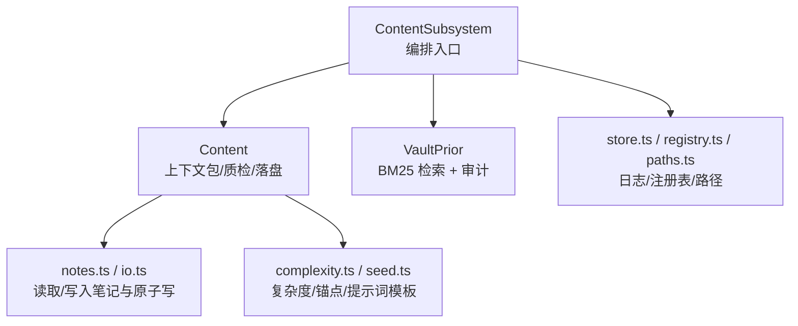
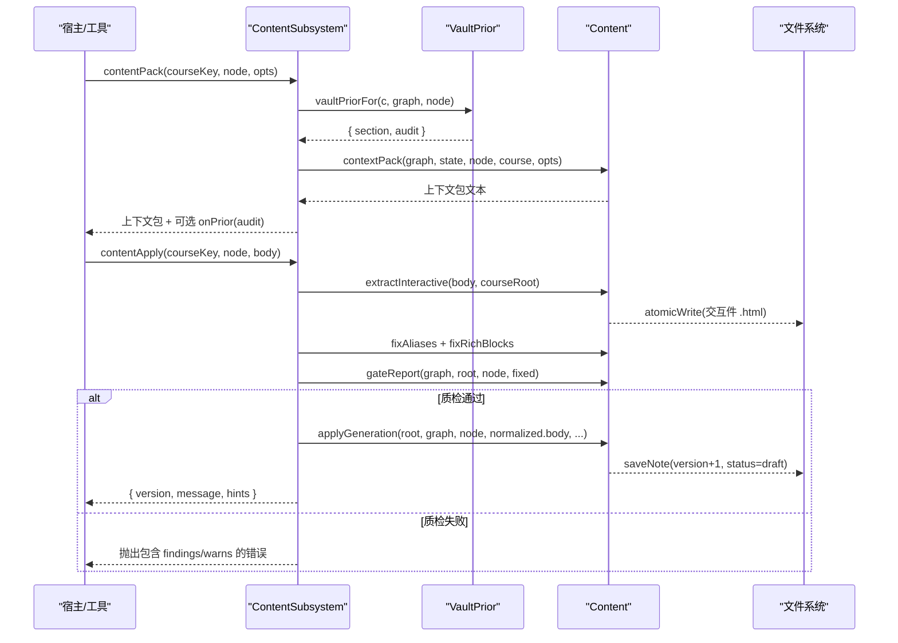
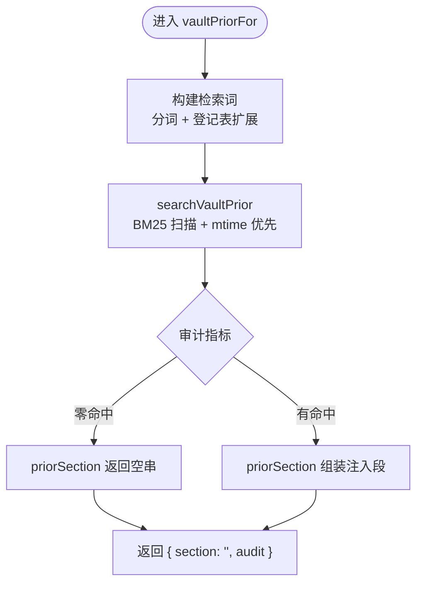
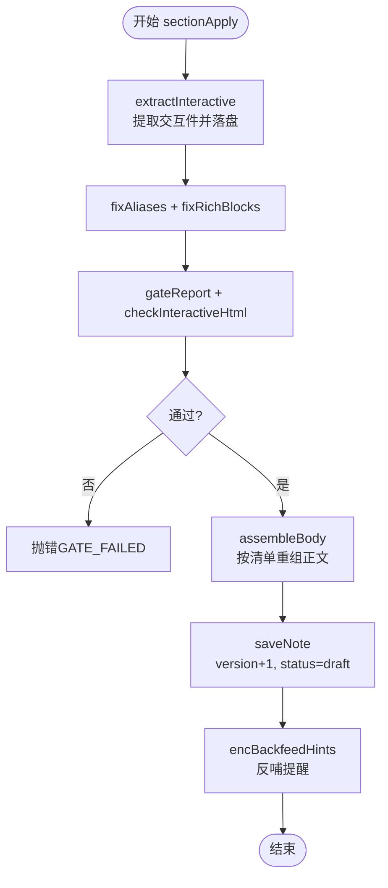
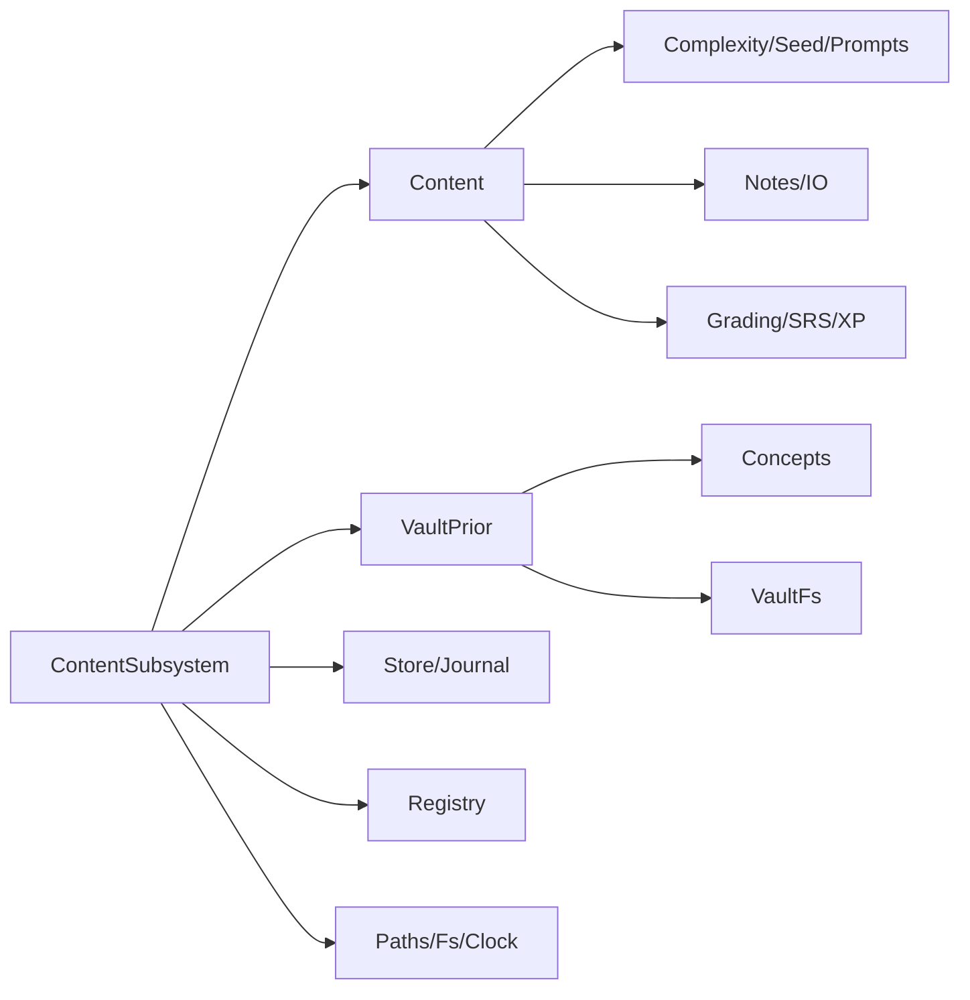

# 内容生成流水线

<cite>
**本文引用的文件**
- [content-subsystem.ts](file://src/engine/content-subsystem.ts)
- [vault-prior.ts](file://src/engine/vault-prior.ts)
- [content.ts](file://src/engine/content.ts)
- [types.ts](file://src/engine/types.ts)
</cite>

## 目录
1. [简介](#简介)
2. [项目结构](#项目结构)
3. [核心组件](#核心组件)
4. [架构总览](#架构总览)
5. [详细组件分析](#详细组件分析)
6. [依赖关系分析](#依赖关系分析)
7. [性能考量](#性能考量)
8. [故障排查指南](#故障排查指南)
9. [结论](#结论)
10. [附录：配置与集成示例](#附录：配置与集成示例)

## 简介
本文件系统化梳理 LearnHub 插件中的“内容生成流水线”，聚焦 ContentSubsystem 的端到端流程：上下文包组装、Vault 先验注入段处理、大纲生成、正文创作与题目生成的衔接，以及落盘门验证与质量检查。文档同时解释版本控制机制（version/draft/交互式内容特殊处理），并提供可操作的配置与集成指引。

## 项目结构
内容生成流水线由三个核心模块协作完成：
- ContentSubsystem：面向门面/宿主的高层编排入口，负责课程解析、视图加载、先验检索、质检门调用与落盘协调。
- VaultPrior：纯扫描式 BM25 检索引擎，从学习者个人 Vault 中检索相关笔记并生成“先验注入段”。
- Content：内容管线引擎，负责上下文包组装、大纲/拆节/单节落盘、质检门、交互件处理、练习区归一化与最终应用落盘。



图表来源
- [content-subsystem.ts:101-146](file://src/engine/content-subsystem.ts#L101-L146)
- [vault-prior.ts:189-195](file://src/engine/vault-prior.ts#L189-L195)
- [content.ts:141-277](file://src/engine/content.ts#L141-L277)

章节来源
- [content-subsystem.ts:101-146](file://src/engine/content-subsystem.ts#L101-L146)
- [vault-prior.ts:189-195](file://src/engine/vault-prior.ts#L189-L195)
- [content.ts:141-277](file://src/engine/content.ts#L141-L277)

## 核心组件
- ContentSubsystem.contentPack：构建生成上下文包（节点信息、前置摘要、后继预告、领域边界、禁止概念、规范约束、enc 边、复杂度档案等），并拼接 Vault 先验注入段。
- ContentSubsystem.vaultPriorFor：基于课程根与图结构，调用 runPriorSearch 进行检索，返回注入段与审计结果。
- ContentSubsystem.contentApply：执行落盘前门禁（别名修复、富内容块修复、质检门、交互件 HTML 校验），通过后调用 applyGeneration 落盘并标记 draft。
- ContentSubsystem.contentOutline / contentSplit / contentSection：大纲/拆节/单节落盘的入口，分别驱动 outlineApply/splitApply/sectionApply。
- Content.applyGeneration：统一落盘入口，version+1、status=draft，按是否逐节模式重写 manifest。

章节来源
- [content-subsystem.ts:115-146](file://src/engine/content-subsystem.ts#L115-L146)
- [content-subsystem.ts:196-228](file://src/engine/content-subsystem.ts#L196-L228)
- [content-subsystem.ts:234-241](file://src/engine/content-subsystem.ts#L234-L241)
- [content-subsystem.ts:291-297](file://src/engine/content-subsystem.ts#L291-L297)
- [content.ts:1381-1405](file://src/engine/content.ts#L1381-L1405)

## 架构总览
下图展示一次“生成→质检→落盘”的完整时序，涵盖上下文包、先验注入、质检门与版本管理。



图表来源
- [content-subsystem.ts:129-146](file://src/engine/content-subsystem.ts#L129-L146)
- [content-subsystem.ts:196-228](file://src/engine/content-subsystem.ts#L196-L228)
- [content.ts:790-815](file://src/engine/content.ts#L790-L815)
- [content.ts:1381-1405](file://src/engine/content.ts#L1381-L1405)

## 详细组件分析

### 上下文包组装（contextPack）
- 目标：为 AI 生成器提供结构化上下文，包括节点元信息、前置已生成内容的节清单摘要、后继预告、领域边界、禁止使用的深层概念、规范约束、enc 边、复杂度档案、PS-I 顺序变体、误解坑位、前置概念档位等。
- 关键点：
  - 终点节点被显式拒绝生成（终点是方向标记，零正文零题库）。
  - 禁止概念清单按深度降序截断至固定上限，避免模型误以为未列出即可使用。
  - 交付要求根据是否为 practice 节点动态切换（交互件 vs 题组 YAML）。
  - 支持 omitDeliverables 以适配大纲消费场景，避免机器块污染大纲 YAML。

章节来源
- [content.ts:141-277](file://src/engine/content.ts#L141-L277)
- [content-subsystem.ts:129-146](file://src/engine/content-subsystem.ts#L129-L146)

### Vault 先验注入段（vaultPriorFor）
- 目标：在生成前检索学习者个人 Vault 中与当前节点相关的笔记摘录，作为“已有理解与记法”的先验注入，避免从零教起。
- 实现要点：
  - 检索词 = 节点名 + 直接前置名，经概念登记表扩展（别名/易混概念低权重并入）。
  - 纯扫描 BM25 打分：IDF × 词频饱和 × 长度归一 + 标题字段加权；mtime 优先排序。
  - 审计输出：terms/expanded/scanned/matched/scanTruncated/hitsTrimmed/zeroHit/hitPaths/expansionError。
  - 注入段形态 priorSection 固定，位置在上下文包之后，调用方通过 onPrior 回调记录审计。



图表来源
- [vault-prior.ts:189-195](file://src/engine/vault-prior.ts#L189-L195)
- [vault-prior.ts:232-359](file://src/engine/vault-prior.ts#L232-L359)
- [vault-prior.ts:365-375](file://src/engine/vault-prior.ts#L365-L375)

章节来源
- [content-subsystem.ts:115-122](file://src/engine/content-subsystem.ts#L115-L122)
- [vault-prior.ts:189-195](file://src/engine/vault-prior.ts#L189-L195)
- [vault-prior.ts:232-359](file://src/engine/vault-prior.ts#L232-L359)

### 大纲生成（contentOutline → outlineApply）
- 输入：YAML 大纲（sections 列表）。
- 校验：title 必填、type 合法、id 唯一、预算护栏（outlineBudgetForNode）。
- 落盘：写入 frontmatter content.sections（全 pending），记录 tier（复杂度档位）与 PS-I 顺序变体（先做后教）。
- 容忍项：解析过程中的注释剥离等通过 onTolerated 收集并随返回值出引擎。

章节来源
- [content-subsystem.ts:234-241](file://src/engine/content-subsystem.ts#L234-L241)
- [content.ts:826-915](file://src/engine/content.ts#L826-L915)

### 正文创作与单节落盘（contentSection → sectionApply）
- 流程：
  - 提取 learnhub-interactive 标记块，校验路径合法性并原子写入 .html。
  - 别名一致性程序化修复、富内容块修复（JSON/SVG/Mermaid）。
  - 节级质检门：超纲引用、别名不一致、预测门结构、可视化块合法性、节形状（字数/可视化块数量）、交互件 HTML 契约。
  - 若通过：按清单重组正文，该节 status=ready/version+1，content.version+1（draft）。
  - 若失败：抛出结构化错误（含 code=GATE_FAILED、wordBudget、wordBlock 等），供自动修复回路定位与压缩目标。



图表来源
- [content.ts:945-1011](file://src/engine/content.ts#L945-L1011)
- [content.ts:1022-1050](file://src/engine/content.ts#L1022-L1050)
- [content.ts:1063-1090](file://src/engine/content.ts#L1063-L1090)

章节来源
- [content-subsystem.ts:291-297](file://src/engine/content-subsystem.ts#L291-L297)
- [content.ts:945-1011](file://src/engine/content.ts#L945-L1011)

### 题目生成与问答流（questionAnswer / questionRate / questionForget）
- 题目作答：
  - 自动判卷（规则题 evaluateAllo；开放/反思题走 LLM 评分）。
  - 记录 practice 流水（含 elapsed_s、predicted JOL 标注）。
  - 更新节点 frontmatter 计数与 EMA，首答推进 stage（ready/unseen → learning）。
  - 题目级 FSRS 推进（每日至多一次；复习刷卡流可 deferSchedule 挂起自评）。
- 自评结算：questionRate 仅允许当日挂起路径结算，推进代表卡并回刷 mastery。
- 忘记申报：questionForget 推进 FSRS Again，记录 practice 流水与节点证据。

章节来源
- [content-subsystem.ts:734-849](file://src/engine/content-subsystem.ts#L734-L849)
- [content-subsystem.ts:938-971](file://src/engine/content-subsystem.ts#L938-L971)
- [content-subsystem.ts:978-1036](file://src/engine/content-subsystem.ts#L978-L1036)

### 版本控制机制（version / draft / 交互式内容）
- version：每次 applyGeneration 或单节落盘时递增；整篇替换时同步 manifest 全部 ready 并继承同一 version。
- status：
  - draft：新生成内容默认草稿状态，等待人审。
  - reviewed：人审通过后置为 reviewed。
  - flagged：反馈重生成入队时标记。
- 交互式内容：
  - 生成阶段将 ```learnhub-interactive:...``` 标记块提取为独立 .html 文件并原子写入。
  - 正文替换为 ```interactive``` 引用块（学习中心相对路径）。
  - 质检门强制校验：体积上限、禁外联、LEARNHUB_COMPLETE 上报、widget-config 类型合法。

章节来源
- [content.ts:1381-1405](file://src/engine/content.ts#L1381-L1405)
- [content.ts:1407-1414](file://src/engine/content.ts#L1407-L1414)
- [content.ts:790-815](file://src/engine/content.ts#L790-L815)
- [content.ts:1063-1090](file://src/engine/content.ts#L1063-L1090)
- [types.ts:12-61](file://src/engine/types.ts#L12-L61)

## 依赖关系分析
- ContentSubsystem 依赖：
  - registry/loadView：获取课程与图/状态视图。
  - vault-prior：先验检索与审计。
  - content：上下文包、质检门、落盘、队列、反馈等。
  - store/journal：记录操作流水。
  - paths/fs/clock：路径、文件系统、时间戳。
- Content 依赖：
  - complexity/seed/prompts：复杂度、锚点、提示词模板。
  - notes/io：笔记读写与原子写。
  - grading/srs/xp：判卷、调度、XP 计算。
- VaultPrior 依赖：
  - concepts：概念登记表扩展。
  - io：VaultFs 遍历与读取。



图表来源
- [content-subsystem.ts:18-36](file://src/engine/content-subsystem.ts#L18-L36)
- [content.ts:10-28](file://src/engine/content.ts#L10-L28)
- [vault-prior.ts:41-46](file://src/engine/vault-prior.ts#L41-L46)

章节来源
- [content-subsystem.ts:18-36](file://src/engine/content-subsystem.ts#L18-L36)
- [content.ts:10-28](file://src/engine/content.ts#L10-L28)
- [vault-prior.ts:41-46](file://src/engine/vault-prior.ts#L41-L46)

## 性能考量
- Vault 先验检索：
  - 限制扫描文件数（maxFiles），并以 mtime 优先选择最近修改的文件，避免目录字典序偏斜。
  - 收集窗口倍数（MTIME_WINDOW_FACTOR）确保在受限范围内尽量取到近期文件。
  - 只读纪律：不写任何文件、不改状态，降低副作用。
- 正文质检：
  - 节形状阈值按复杂度档位派生，避免全局硬阈值导致误报。
  - 富内容块程序化修复减少返工成本（JSON 尾逗号、SVG 前导杂质、Mermaid 引号）。
- 交互件：
  - 体积上限与网络调用检测，防止沙箱不可用资源。
  - widget-config 类型白名单校验，保障渲染能力匹配。

章节来源
- [vault-prior.ts:96-100](file://src/engine/vault-prior.ts#L96-L100)
- [vault-prior.ts:232-288](file://src/engine/vault-prior.ts#L232-L288)
- [content.ts:424-463](file://src/engine/content.ts#L424-L463)
- [content.ts:561-587](file://src/engine/content.ts#L561-L587)
- [content.ts:1063-1090](file://src/engine/content.ts#L1063-L1090)

## 故障排查指南
- 质检门失败：
  - 关注 gateReport 返回的 findings/warns，尤其是“正文过长”“可视化块超限”“预测门缺失”“别名不一致”“交互件契约缺失”。
  - 使用 sectionRepairPrompt/sectionRepairBody 构造修复轮，结合 wordBudget 明确压缩目标。
- 交互件问题：
  - 检查 LEARNHUB_COMPLETE 上报、widget-config type 是否在菜单、是否含外联资源。
- Vault 先验零命中：
  - 查看审计 zeroHit/scanTruncated/hitsTrimmed，确认检索词是否过短、登记表示否 Broken、maxFiles 是否过小。
- 版本与状态：
  - 确认 applyGeneration 后 version+1 且 status=draft；review 后变为 reviewed；feedback 后标记 flagged 并入队。

章节来源
- [content.ts:757-788](file://src/engine/content.ts#L757-L788)
- [content.ts:642-668](file://src/engine/content.ts#L642-L668)
- [content.ts:1063-1090](file://src/engine/content.ts#L1063-L1090)
- [vault-prior.ts:232-359](file://src/engine/vault-prior.ts#L232-L359)
- [content.ts:1381-1414](file://src/engine/content.ts#L1381-L1414)

## 结论
内容生成流水线以 ContentSubsystem 为编排中枢，串联 VaultPrior 的个性化先验注入与 Content 的上下文包、质检门与落盘逻辑。通过严格的版本控制（version/draft/status）与交互式内容专项处理，保障了生成内容的可追溯性与安全性。BM25 检索与审计机制提升了先验注入的可观测性，而多级质检门与程序化修复显著降低了返工成本。整体设计兼顾了可扩展性、可维护性与学习者体验。

## 附录：配置与集成示例

- 配置生成参数（上下文包）
  - 调用 contentPack 时可通过 omitDeliverables 控制是否包含交付要求（用于大纲消费场景）。
  - 通过 onPrior 回调接收 VaultPriorAudit，用于任务记录与可观测性。
  - 参考路径：[content-subsystem.ts:129-146](file://src/engine/content-subsystem.ts#L129-L146)

- 处理生成结果（落盘）
  - 调用 contentApply 传入正文，内部会执行交互件提取、别名修复、富内容修复、质检门与 applyGeneration 落盘。
  - 返回包含 version、message、hints，便于前端展示与后续处理。
  - 参考路径：[content-subsystem.ts:196-228](file://src/engine/content-subsystem.ts#L196-L228)

- 集成质量审核流程
  - 使用 contentCheck 对现有笔记跑质检门（只读不落盘），获取 findings/warns。
  - 对于失败项，使用 sectionRepairPrompt/sectionRepairBody 构造修复轮，结合 wordBudget 指定压缩目标。
  - 参考路径：[content-subsystem.ts:181-189](file://src/engine/content-subsystem.ts#L181-L189)、[content.ts:642-668](file://src/engine/content.ts#L642-L668)

- 版本控制与人审流转
  - 生成后默认 status=draft，需人工 review 后转为 reviewed。
  - 反馈重生成通过 feedback 标记 flagged 并加入队列。
  - 参考路径：[content.ts:1381-1414](file://src/engine/content.ts#L1381-L1414)

- 题目生成与作答集成
  - 使用 questionAnswer 提交答案，内部自动判卷、记录 practice 流水、推进 FSRS 与节点证据。
  - 复习刷卡流可使用 deferSchedule 挂起自评，待背面自评后通过 questionRate 结算。
  - 参考路径：[content-subsystem.ts:734-849](file://src/engine/content-subsystem.ts#L734-L849)、[content-subsystem.ts:938-971](file://src/engine/content-subsystem.ts#L938-L971)