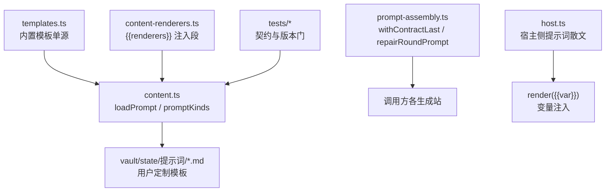
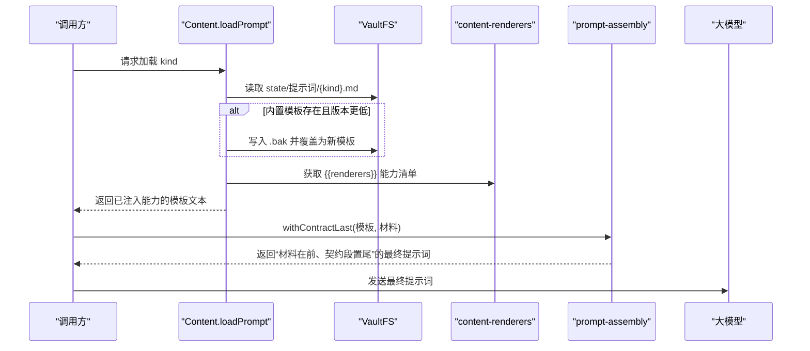
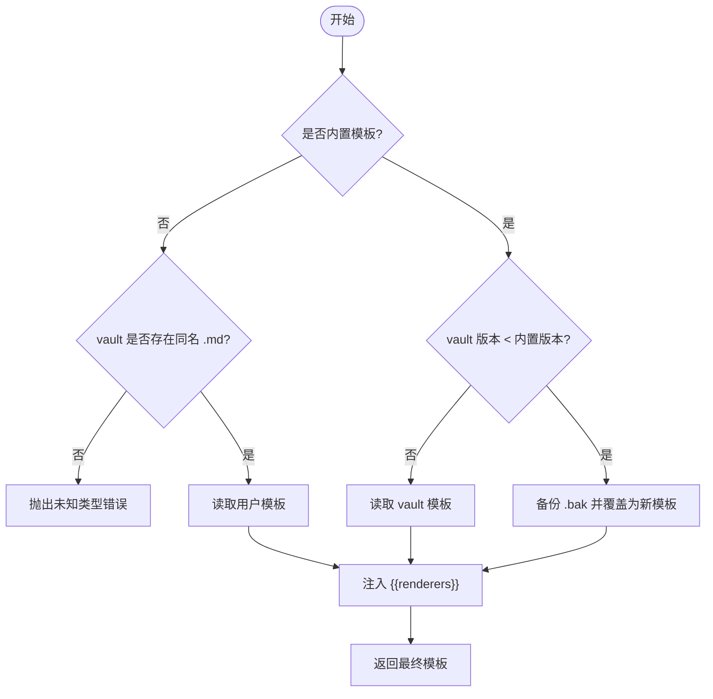
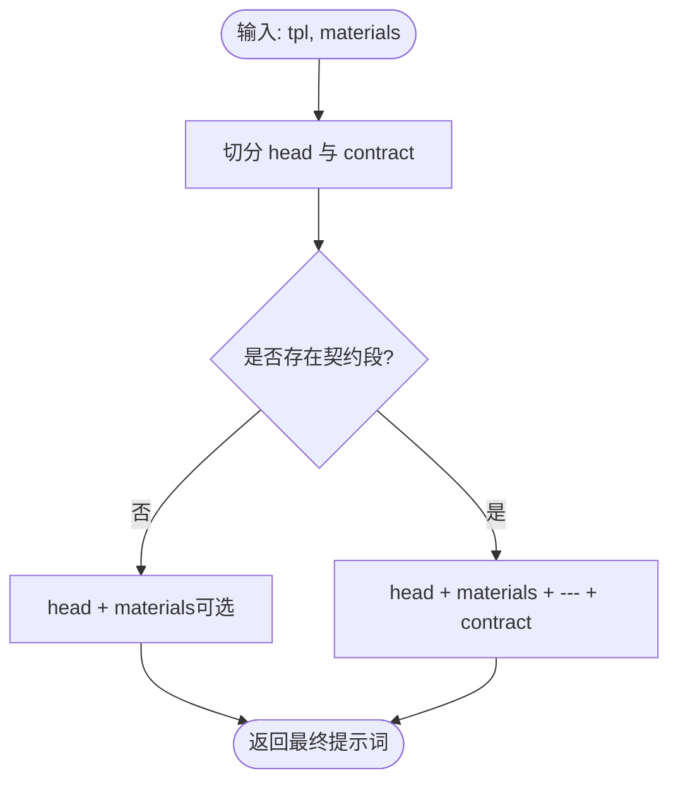
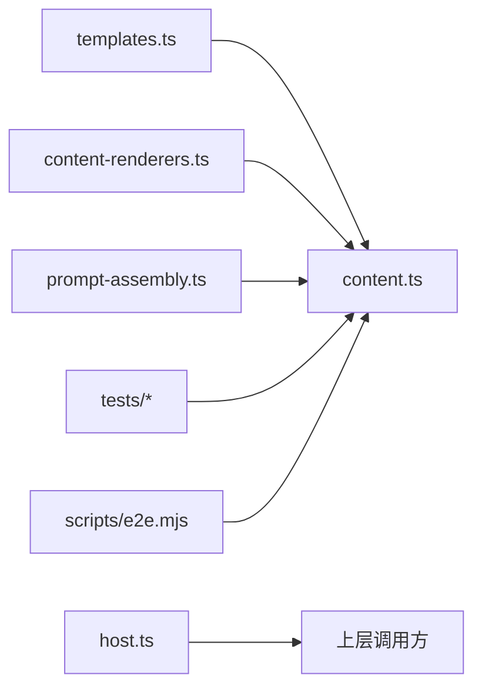

# 提示词工程

<cite>
**本文引用的文件**
- [src/engine/content.ts](file://src/engine/content.ts)
- [src/engine/prompt-assembly.ts](file://src/engine/prompt-assembly.ts)
- [src/engine/prompts/templates.ts](file://src/engine/prompts/templates.ts)
- [src/engine/prompts/host.ts](file://src/engine/prompts/host.ts)
- [shared/content-renderers.ts](file://shared/content-renderers.ts)
- [tests/output-contract.test.ts](file://tests/output-contract.test.ts)
- [tests/prompt-contract.test.ts](file://tests/prompt-contract.test.ts)
- [scripts/e2e.mjs](file://scripts/e2e.mjs)
</cite>

## 目录
1. [简介](#简介)
2. [项目结构](#项目结构)
3. [核心组件](#核心组件)
4. [架构总览](#架构总览)
5. [详细组件分析](#详细组件分析)
6. [依赖关系分析](#依赖关系分析)
7. [性能考量](#性能考量)
8. [故障排查指南](#故障排查指南)
9. [结论](#结论)
10. [附录](#附录)

## 简介
本文件系统性梳理“提示词工程”的架构与实现，覆盖以下主题：
- 内置模板的组织结构与加载策略
- 变量注入机制与动态组装过程
- promptKinds 支持的提示词类型
- loadPrompt 的加载、版本升级与回滚策略
- 模板渲染引擎的工作原理（占位符替换与能力清单注入）
- 提示词契约验证机制（输出契约、登记门、版本一致性）
- 调试与测试工具使用方法
- 自定义提示词模板、注入动态变量与集成外部提示词源的具体实践路径

## 项目结构
提示词工程的核心由“模板单源 + 加载器 + 装配器 + 渲染能力清单 + 契约校验”构成：
- 模板单源：所有生成站提示词文本集中在 templates.ts，键即生成站名。
- 加载器：Content.loadPrompt 负责从 vault 读取用户定制或内置模板，执行版本比较与自动升级，并注入渲染能力清单。
- 装配器：prompt-assembly.ts 提供契约后置拼装与修复轮拼装，确保“输出契约段”始终位于最终提示词末尾。
- 宿主侧提示词：host.ts 提供对模型可见的散文片段（系统提示词、回路历史骨架等），通过 render 进行变量注入。
- 渲染能力清单：content-renderers.ts 提供 {{renderers}} 注入段，声明可用可视化/交互渲染能力。
- 契约校验：tests 中的断言保证模板键集、版本号、变更登记表一致；e2e 脚本保障快照与 .bak 行为正确。

图表来源
- [src/engine/prompts/templates.ts:1-20](file://src/engine/prompts/templates.ts#L1-L20)
- [src/engine/content.ts:320-378](file://src/engine/content.ts#L320-L378)
- [shared/content-renderers.ts:90-105](file://shared/content-renderers.ts#L90-L105)
- [src/engine/prompt-assembly.ts:11-43](file://src/engine/prompt-assembly.ts#L11-L43)
- [src/engine/prompts/host.ts:18-48](file://src/engine/prompts/host.ts#L18-L48)
- [tests/output-contract.test.ts:465-500](file://tests/output-contract.test.ts#L465-L500)

章节来源
- [src/engine/prompts/templates.ts:1-20](file://src/engine/prompts/templates.ts#L1-L20)
- [src/engine/content.ts:320-378](file://src/engine/content.ts#L320-L378)
- [shared/content-renderers.ts:90-105](file://shared/content-renderers.ts#L90-L105)
- [src/engine/prompt-assembly.ts:11-43](file://src/engine/prompt-assembly.ts#L11-L43)
- [src/engine/prompts/host.ts:18-48](file://src/engine/prompts/host.ts#L18-L48)
- [tests/output-contract.test.ts:465-500](file://tests/output-contract.test.ts#L465-L500)

## 核心组件
- 模板注册表与类型枚举
  - Content.PROMPT_KINDS 直接引用 templates.ts 的 TEMPLATES，键集与输出契约、变更登记表三面对账。
  - promptKinds() 返回内置类型 + state/提示词/*.md 下的自建变体名称集合。
- 加载与版本管理
  - loadPrompt(kind) 会：
    - 若为内置且 vault 中已有同名 .md，则比较首行版本标记，低版本时备份旧文件为 .bak 并覆盖为新内置模板。
    - 读取最终模板后注入 {{renderers}}：若模板包含占位符则替换，否则在末尾追加能力清单。
  - promptVersionOf(text) 解析首行 <!-- learnhub:prompt/vN --> 提取版本号。
- 契约后置拼装
  - withContractLast(tpl, materials) 将模板末段的“输出契约段”（最后一个 ## 输出… 到末尾）置尾，材料在前，确保模型最后读到“只输出 X”。
  - repairRoundPrompt(tpl, materials, headline, previous, errors) 用于种子起草/目标反编译的修复轮，将“上一次输出 + 校验清单”作为材料前置，契约段仍置尾。
- 宿主侧提示词
  - host.ts 提供导师会话系统提示词、回路历史骨架、前节结尾标题等，供宿主侧通过 render({{var}}) 注入变量。

章节来源
- [src/engine/content.ts:320-378](file://src/engine/content.ts#L320-L378)
- [src/engine/prompt-assembly.ts:11-43](file://src/engine/prompt-assembly.ts#L11-L43)
- [src/engine/prompts/host.ts:18-48](file://src/engine/prompts/host.ts#L18-L48)

## 架构总览
下图展示提示词从模板到最终发送给模型的完整流程，包括加载、注入、装配与契约约束。

图表来源
- [src/engine/content.ts:334-352](file://src/engine/content.ts#L334-L352)
- [shared/content-renderers.ts:90-105](file://shared/content-renderers.ts#L90-L105)
- [src/engine/prompt-assembly.ts:21-29](file://src/engine/prompt-assembly.ts#L21-L29)

## 详细组件分析

### 模板组织与 promptKinds
- 模板单源：TEMPLATES 集中定义所有生成站模板，键即生成站名（如“课程大纲”“课程节生成”“题目生成”等）。
- promptKinds() 返回：
  - 内置模板键集（Content.PROMPT_KINDS）
  - 加上 vault 中 state/提示词/*.md 的用户自定义模板名（去扩展名）
- 设计要点：
  - 模板文本是惰性字符串，不含 ${} 插值；变量面仅两类：首行 vN 版本标记与行内 {{renderers}} 占位符。
  - 模板不得整体送入 prompt-render 的渲染器，避免误判缺失变量。

章节来源
- [src/engine/prompts/templates.ts:1-20](file://src/engine/prompts/templates.ts#L1-L20)
- [src/engine/content.ts:367-378](file://src/engine/content.ts#L367-L378)

### 加载策略与版本管理（loadPrompt）
- 加载顺序：
  - 若 kind 不存在于内置且 vault 无同名 .md，抛出错误（未知提示词类型）。
  - 若为内置且 vault 已有模板但版本低于内置，则备份旧模板为 .bak 并覆盖为新内置模板。
  - 读取最终模板后注入 {{renderers}}：若模板包含占位符则替换，否则在末尾追加能力清单。
- 版本解析：
  - promptVersionOf(text) 解析首行注释 <!-- learnhub:prompt/vN --> 得到数字版本。
- 回滚策略：
  - 升级前自动创建 .bak 备份，便于 diff 与恢复。
  - 同一版本不重复覆盖（幂等）。

图表来源
- [src/engine/content.ts:334-358](file://src/engine/content.ts#L334-L358)

章节来源
- [src/engine/content.ts:334-358](file://src/engine/content.ts#L334-L358)

### 动态组装与契约后置（withContractLast / repairRoundPrompt）
- splitContractSection(tpl)：定位模板最后一个 “## 输出…” 至末尾作为契约段，其余为 head。
- withContractLast(tpl, materials)：将材料置于 head 之后，契约段置于最末，确保“只输出 X”指令离生成点最近。
- repairRoundPrompt(tpl, materials, headline, previous, errors)：用于修复轮，将“上一次输出 + 校验清单”作为材料前置，契约段仍置尾。

图表来源
- [src/engine/prompt-assembly.ts:11-29](file://src/engine/prompt-assembly.ts#L11-L29)

章节来源
- [src/engine/prompt-assembly.ts:11-43](file://src/engine/prompt-assembly.ts#L11-L43)

### 宿主侧提示词与变量注入
- host.ts 提供：
  - 导师会话系统提示词（角色、范围纪律、learnhub-teacher 动作块格式）
  - 回路历史渲染骨架（任务、助手、工具调用、工具结果）
  - 前节结尾标题（用于节生成材料块）
- 变量注入：通过 render({{var}}) 进行占位符替换；缺变量与残留均抛错（按模块约定）。

章节来源
- [src/engine/prompts/host.ts:18-48](file://src/engine/prompts/host.ts#L18-L48)

### 模板渲染引擎工作原理
- 渲染能力清单：content-renderers.ts 提供 rendererCapabilityBlock()，生成可被注入的文本块。
- 注入时机：
  - loadPrompt 读取模板后，若包含 {{renderers}} 则替换；否则在末尾追加该能力清单。
- 限制：
  - 模板文本不得整体送入 prompt-render 的渲染器，避免误判缺失变量。

章节来源
- [shared/content-renderers.ts:90-105](file://shared/content-renderers.ts#L90-L105)
- [src/engine/content.ts:348-352](file://src/engine/content.ts#L348-L352)

### 提示词契约验证机制
- 键集一致性：Content.PROMPT_KINDS 键集与 OUTPUT_CONTRACTS、PROMPT_CHANGELOG 三面对账。
- 版本一致性：
  - 每个模板首行带版本标记，变更登记表记录每次变更的版本、日期、变更类型与预期差异。
  - tests 断言最高登记版本等于模板现行版本，禁止倒序登记。
- e2e 门禁：
  - 校验 vault 快照是否升级到当前版本提示词，并确认 .bak 文件存在且内容匹配。

章节来源
- [tests/output-contract.test.ts:465-500](file://tests/output-contract.test.ts#L465-L500)
- [scripts/e2e.mjs:433-439](file://scripts/e2e.mjs#L433-L439)
- [tests/prompt-contract.test.ts:1-200](file://tests/prompt-contract.test.ts#L1-L200)

## 依赖关系分析
- 模块耦合：
  - content.ts 依赖 templates.ts（模板）、content-renderers.ts（能力清单）、prompt-assembly.ts（装配）。
  - host.ts 独立提供宿主侧提示词散文，供上层通过 render 注入变量。
  - tests 与 scripts 对模板键集、版本、行为进行门禁校验。
- 外部依赖：
  - VaultFS 文件系统接口用于读写状态目录与提示词目录。
  - 大模型通过调用方发送最终提示词。

图表来源
- [src/engine/content.ts:320-378](file://src/engine/content.ts#L320-L378)
- [src/engine/prompts/templates.ts:1-20](file://src/engine/prompts/templates.ts#L1-L20)
- [shared/content-renderers.ts:90-105](file://shared/content-renderers.ts#L90-L105)
- [src/engine/prompt-assembly.ts:11-43](file://src/engine/prompt-assembly.ts#L11-L43)
- [src/engine/prompts/host.ts:18-48](file://src/engine/prompts/host.ts#L18-L48)
- [tests/output-contract.test.ts:465-500](file://tests/output-contract.test.ts#L465-L500)
- [scripts/e2e.mjs:433-439](file://scripts/e2e.mjs#L433-L439)

章节来源
- [src/engine/content.ts:320-378](file://src/engine/content.ts#L320-L378)
- [src/engine/prompts/templates.ts:1-20](file://src/engine/prompts/templates.ts#L1-L20)
- [shared/content-renderers.ts:90-105](file://shared/content-renderers.ts#L90-L105)
- [src/engine/prompt-assembly.ts:11-43](file://src/engine/prompt-assembly.ts#L11-L43)
- [src/engine/prompts/host.ts:18-48](file://src/engine/prompts/host.ts#L18-L48)
- [tests/output-contract.test.ts:465-500](file://tests/output-contract.test.ts#L465-L500)
- [scripts/e2e.mjs:433-439](file://scripts/e2e.mjs#L433-L439)

## 性能考量
- 模板加载为一次性 IO 操作，后续复用内存中的模板文本。
- 注入 {{renderers}} 为简单字符串替换，开销极低。
- 契约后置拼装基于正则匹配与切片，时间复杂度与模板长度线性相关。
- 建议：
  - 批量生成时缓存已加载的模板，避免重复 IO。
  - 控制模板大小，避免过长模板导致解析与传输延迟。

[本节未直接分析具体文件]

## 故障排查指南
- 未知提示词类型
  - 现象：加载时报错“未知提示词类型”。
  - 原因：kind 不在内置且 vault 无同名 .md。
  - 处理：添加内置模板或在 state/提示词/ 下创建同名 .md。
- 版本不一致
  - 现象：e2e 或契约门失败。
  - 原因：vault 快照未升级到当前版本提示词，或登记版本与模板现行版本不一致。
  - 处理：运行 e2e 更新快照；同步变更登记表与模板版本。
- 契约段位置错误
  - 现象：模型未按“只输出 X”约束响应。
  - 原因：未使用 withContractLast 或模板缺少 “## 输出…” 契约段。
  - 处理：确保模板包含契约段并使用 withContractLast 组装。
- 渲染能力缺失
  - 现象：可视化块降级为源码显示。
  - 原因：未注入 {{renderers}} 或未注册渲染器。
  - 处理：通过 loadPrompt 注入能力清单；确保渲染器已注册。

章节来源
- [src/engine/content.ts:334-352](file://src/engine/content.ts#L334-L352)
- [tests/output-contract.test.ts:465-500](file://tests/output-contract.test.ts#L465-L500)
- [scripts/e2e.mjs:433-439](file://scripts/e2e.mjs#L433-L439)

## 结论
提示词工程以“模板单源 + 加载器 + 装配器 + 渲染能力清单 + 契约校验”为核心，实现了：
- 统一的模板管理与版本升级
- 安全的变量注入与能力清单注入
- 严格的契约后置拼装，确保输出约束可靠
- 完善的契约验证与门禁，保障生产质量
通过上述机制，系统可在多生成站场景下稳定、可控地产出符合规范的提示词。

[本节未直接分析具体文件]

## 附录

### 如何自定义提示词模板
- 在 vault 的 state/提示词/ 目录下创建 {kind}.md 文件，内容与内置模板结构一致。
- 如需注入渲染能力，保留 {{renderers}} 占位符；否则会在加载时自动追加。
- 通过 promptKinds() 可查询当前可用的提示词类型（内置 + 自建）。

章节来源
- [src/engine/content.ts:367-378](file://src/engine/content.ts#L367-L378)

### 如何注入动态变量
- 宿主侧提示词使用 render({{var}}) 进行变量注入，缺变量与残留均抛错。
- 模板文本不得整体送入 prompt-render，避免误判缺失变量。

章节来源
- [src/engine/prompts/host.ts:18-48](file://src/engine/prompts/host.ts#L18-L48)

### 如何集成外部提示词源
- 将外部提示词保存为 state/提示词/{kind}.md，即可被 promptKinds() 发现并加载。
- 若与内置模板同名，将遵循版本比较与覆盖策略（备份 .bak）。

章节来源
- [src/engine/content.ts:334-352](file://src/engine/content.ts#L334-L352)

### 调试与测试工具
- 契约门：tests/output-contract.test.ts 与 tests/prompt-contract.test.ts 校验键集、版本与契约锚点。
- e2e 脚本：scripts/e2e.mjs 校验 vault 快照升级与 .bak 行为。
- 建议：修改模板后运行对应测试，确保版本与契约一致。

章节来源
- [tests/output-contract.test.ts:465-500](file://tests/output-contract.test.ts#L465-L500)
- [tests/prompt-contract.test.ts:1-200](file://tests/prompt-contract.test.ts#L1-L200)
- [scripts/e2e.mjs:433-439](file://scripts/e2e.mjs#L433-L439)