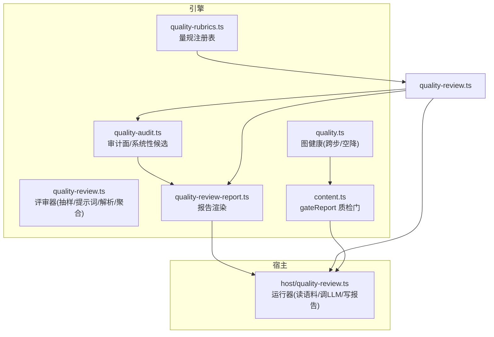
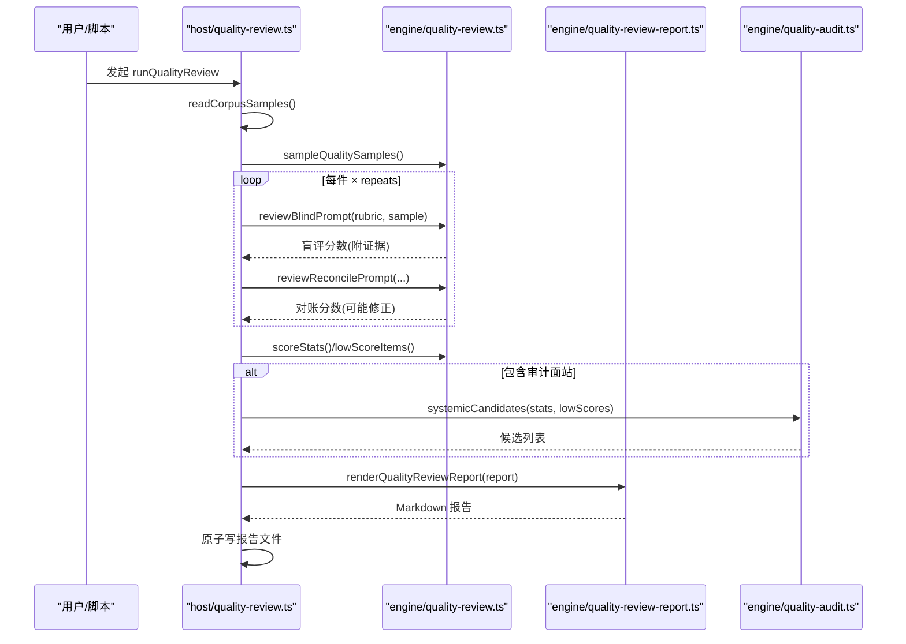
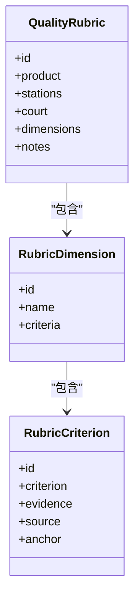
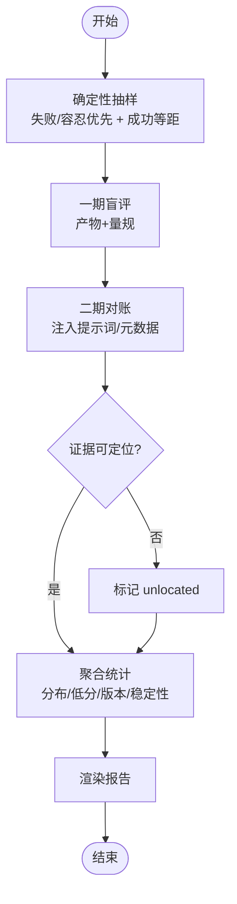
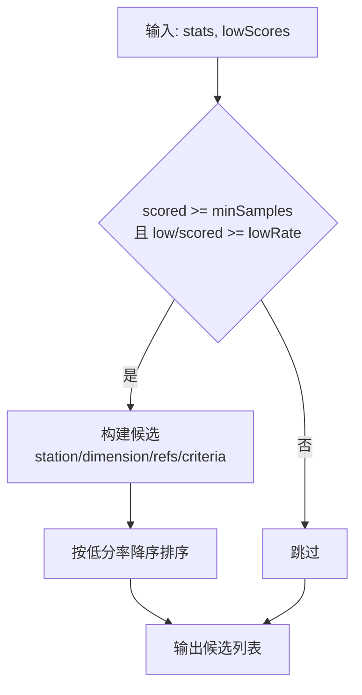
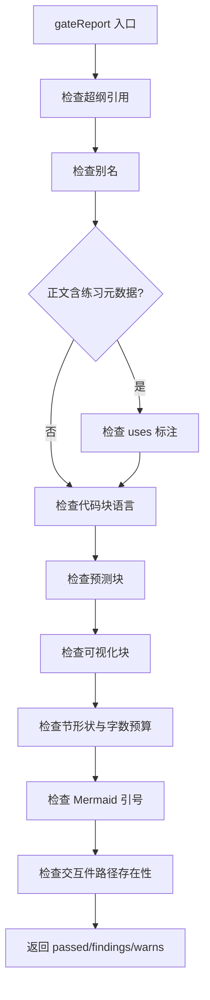
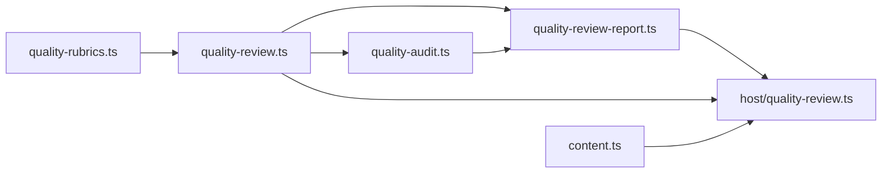

# 质量审核系统

<cite>
**本文引用的文件**
- [src/engine/quality-audit.ts](file://src/engine/quality-audit.ts)
- [src/engine/quality-rubrics.ts](file://src/engine/quality-rubrics.ts)
- [src/engine/quality-review.ts](file://src/engine/quality-review.ts)
- [src/engine/quality-review-report.ts](file://src/engine/quality-review-report.ts)
- [src/host/quality-review.ts](file://src/host/quality-review.ts)
- [src/engine/content.ts](file://src/engine/content.ts)
- [src/engine/quality.ts](file://src/engine/quality.ts)
- [src/engine/index.ts](file://src/engine/index.ts)
- [CONTEXT.md](file://CONTEXT.md)
- [docs/adr/0062-quality-rubric-registry.md](file://docs/adr/0062-quality-rubric-registry.md)
</cite>

## 目录
1. [简介](#简介)
2. [项目结构](#项目结构)
3. [核心组件](#核心组件)
4. [架构总览](#架构总览)
5. [详细组件分析](#详细组件分析)
6. [依赖关系分析](#依赖关系分析)
7. [性能与稳定性](#性能与稳定性)
8. [故障排查指南](#故障排查指南)
9. [结论](#结论)
10. [附录：自定义规则、评分标准与第三方集成示例](#附录自定义规则评分标准与第三方集成示例)

## 简介
本系统提供“内容质量审核”的完整闭环：以“质量量规注册表”定义判定标准，通过“离线批量评审器”对生成语料进行两段式（盲评+对账）逐维度评分，输出人读报告；并在此基础上对图质量面（教练回合裁决、种子/终点资格）做抽样审计，识别系统性问题候选。同时提供“内容质检门 gateReport”，在内容落盘前执行格式验证、完整性检查与语义一致性评估。

## 项目结构
- 引擎层（纯函数、零副作用）
  - 质量量规注册表：定义五类产物（大纲/节正文/题目/教练回合/种子·终点）的维度与判据
  - 离线评审器：抽样、提示词拼装、应答解析、聚合统计、报告渲染
  - 图质量面审计：审计面声明、系统性候选计算
  - 内容质检门：gateReport 串联格式、完整性、语义一致性检查
- 宿主层（I/O、模型调用、报告落盘）
  - 读取生成语料、调用 LLM、写入 Markdown 报告
- 文档与验收
  - ADR/CONTEXT 明确分层法庭、无总分、锚门自检等纪律

图表来源
- [src/engine/quality-rubrics.ts:1-457](file://src/engine/quality-rubrics.ts#L1-L457)
- [src/engine/quality-review.ts:1-200](file://src/engine/quality-review.ts#L1-L200)
- [src/engine/quality-audit.ts:1-124](file://src/engine/quality-audit.ts#L1-L124)
- [src/engine/quality-review-report.ts:1-223](file://src/engine/quality-review-report.ts#L1-L223)
- [src/host/quality-review.ts:1-256](file://src/host/quality-review.ts#L1-L256)
- [src/engine/content.ts:750-788](file://src/engine/content.ts#L750-L788)
- [src/engine/quality.ts:1-61](file://src/engine/quality.ts#L1-L61)

章节来源
- [src/engine/quality-rubrics.ts:1-457](file://src/engine/quality-rubrics.ts#L1-L457)
- [src/engine/quality-review.ts:1-200](file://src/engine/quality-review.ts#L1-L200)
- [src/engine/quality-audit.ts:1-124](file://src/engine/quality-audit.ts#L1-L124)
- [src/engine/quality-review-report.ts:1-223](file://src/engine/quality-review-report.ts#L1-L223)
- [src/host/quality-review.ts:1-256](file://src/host/quality-review.ts#L1-L256)
- [src/engine/content.ts:750-788](file://src/engine/content.ts#L750-L788)
- [src/engine/quality.ts:1-61](file://src/engine/quality.ts#L1-L61)

## 核心组件
- 质量量规注册表（quality-rubrics.ts）
  - 五份量规，每条判据含“判定标准 + 证据要求 + 出处 + 锚点”
  - 统一的分层法庭元数据（AI 提议、人审终审、结果法院各守领域），且明确“无总分”
- 离线批量评审器（quality-review.ts）
  - 确定性抽样（失败/容忍优先 + 成功件等距）
  - 两段式防锚定：一期盲评（仅产物+量规）、二期对账（注入提示词与元数据）
  - 证据定位核对（引文必须在产物原文可定位，否则记 unlocated）
  - 聚合：逐站×维度分布、低分件清单、模板版本对照、稳定性读数
- 报告渲染（quality-review-report.ts）
  - 人读 Markdown：分布表、低分件清单、未评分/评审失败件、版本对照、稳定性、系统性候选
- 图质量面审计（quality-audit.ts）
  - 审计面声明（本轮审了什么/没审什么）
  - 系统性候选：按（站×维度）低分率越预注册线即入候选，带低分件引用与判据出处
- 内容质检门（content.ts::gateReport）
  - 超纲引用告警、别名检查、代码块语言白名单、预测块/可视化块校验、节形状与字数预算、Mermaid 引号、交互件路径存在性

章节来源
- [src/engine/quality-rubrics.ts:1-457](file://src/engine/quality-rubrics.ts#L1-L457)
- [src/engine/quality-review.ts:1-200](file://src/engine/quality-review.ts#L1-L200)
- [src/engine/quality-review-report.ts:1-223](file://src/engine/quality-review-report.ts#L1-L223)
- [src/engine/quality-audit.ts:1-124](file://src/engine/quality-audit.ts#L1-L124)
- [src/engine/content.ts:750-788](file://src/engine/content.ts#L750-L788)

## 架构总览
评审流程（离线批量）：
- 宿主从语料目录读取样本 → 引擎抽样 → 两段式评审（LLM）→ 聚合统计 → 渲染报告 → 原子落盘
- 若包含审计面站，则计算系统性候选并插入到报告头部声明中

图表来源
- [src/host/quality-review.ts:126-241](file://src/host/quality-review.ts#L126-L241)
- [src/engine/quality-review.ts:179-200](file://src/engine/quality-review.ts#L179-L200)
- [src/engine/quality-audit.ts:100-120](file://src/engine/quality-audit.ts#L100-L120)
- [src/engine/quality-review-report.ts:92-223](file://src/engine/quality-review-report.ts#L92-L223)

## 详细组件分析

### 质量量规与评分体系（quality-rubrics.ts）
- 量规结构
  - 产品类型：大纲/节正文/题目/教练回合/种子·终点
  - 维度：每个维度包含若干判据（id/criterion/evidence/source/anchor）
  - 站点映射：多站共享一份量规（如“题目”覆盖“题目生成/笔记出题”）
- 评分口径
  - 档位：1=未兑现，2=部分兑现，3=基本兑现，4=充分兑现
  - 低分阈值：≤2 进入低分件清单
  - 无总分：不合成跨维度分数，不做加权；维度正交
- 分层法庭
  - AI 评分是提议（必须附证据引用），人审是终审，学习者结果法院独立
- 锚门与自检
  - source 指向文档必须可解析，anchor 原句必须能在出处文档命中；否则测试变红

图表来源
- [src/engine/quality-rubrics.ts:27-57](file://src/engine/quality-rubrics.ts#L27-L57)
- [src/engine/quality-rubrics.ts:60-440](file://src/engine/quality-rubrics.ts#L60-L440)

章节来源
- [src/engine/quality-rubrics.ts:1-457](file://src/engine/quality-rubrics.ts#L1-L457)
- [docs/adr/0062-quality-rubric-registry.md:15-37](file://docs/adr/0062-quality-rubric-registry.md#L15-L37)

### 离线批量评审器（quality-review.ts）
- 抽样策略
  - 失败/容忍件定额优先，成功件等距取样；确定性无随机数
- 两段式防锚定
  - 一期盲评：仅给产物原文与量规
  - 二期对账：注入提示词与元数据，允许修正并记录差异
- 证据定位核对
  - 评审员引文必须能在产物原文定位，否则标记 unlocated 并在报告显式列出
- 聚合与可读性
  - 维度分布、低分件清单、模板版本对照视图、重复评审稳定性读数
  - 评审失败件与未评分件单列，避免误判为低分

图表来源
- [src/engine/quality-review.ts:120-177](file://src/engine/quality-review.ts#L120-L177)
- [src/engine/quality-review.ts:179-200](file://src/engine/quality-review.ts#L179-L200)

章节来源
- [src/engine/quality-review.ts:1-200](file://src/engine/quality-review.ts#L1-L200)

### 报告渲染与可视化（quality-review-report.ts）
- 报告结构
  - 头部：生成时间、采样信息、温度、重复次数、量规
  - 分层法庭声明（随报告携带）
  - 各站维度分布表
  - 低分件清单（附证据引用与语料文件锚）
  - 未评分件与评审失败件（单独段落）
  - 模板版本对照视图（逐维度低分率）
  - 稳定性读数（同输入重复评审一致率与档差）
  - 系统性发现候选（图质量面审计 #224）
  - 附录：逐件明细（每期评审详情）
- 可视化要点
  - 表格化呈现便于横向对比
  - 低分件直接链接到语料文件与原文证据
  - 稳定性读数用于观测模型/供应商漂移信号

章节来源
- [src/engine/quality-review-report.ts:1-223](file://src/engine/quality-review-report.ts#L1-L223)

### 图质量面审计（quality-audit.ts）
- 审计面声明
  - 两类审计轴：教练回合裁决质量、种子/终点资格
  - 每轴声明样本站、量规、关注维度
- 系统性候选
  - 预注册线：至少 N 件已判档且低分率 ≥ 阈值
  - 候选包含：站、维度、scored/low/lowRate、低分件引用、判据出处
  - 候选是“提议”，需人审裁决（蒸馏新票/改量规/改提示词）

图表来源
- [src/engine/quality-audit.ts:76-120](file://src/engine/quality-audit.ts#L76-L120)

章节来源
- [src/engine/quality-audit.ts:1-124](file://src/engine/quality-audit.ts#L1-L124)

### 内容质检门 gateReport（content.ts）
gateReport 在内容落盘前执行自动化质检，返回 passed/findings/warns：
- 超纲引用检测（warn）
- 别名检查（finding）
- 练习元数据 uses 标注建议（warn）
- 代码块语言白名单（warn）
- 预测块/可视化块校验（finding）
- 节形状与字数预算（finding/warn）
- Mermaid 特殊字符引号（warn）
- 交互件文件存在性（finding）

图表来源
- [src/engine/content.ts:758-788](file://src/engine/content.ts#L758-L788)

章节来源
- [src/engine/content.ts:750-788](file://src/engine/content.ts#L750-L788)

### 图健康与门禁辅助（quality.ts）
- 认知跨步（Jump）：难度差≥2 或深度跨度≥3 的边
- 空降节点（Float）：region 序靠后且 pre 为空
- 供 audit.ts 与健康面板使用，辅助识别结构性风险

章节来源
- [src/engine/quality.ts:1-61](file://src/engine/quality.ts#L1-L61)

## 依赖关系分析
- 模块耦合
  - quality-review.ts 消费 quality-rubrics.ts（量规）与 prompts（提示词）
  - host/quality-review.ts 依赖 engine 的纯函数，负责 I/O 与 LLM 调用
  - quality-audit.ts 复用 quality-review 的统计与低分件，扩展审计面
  - content.ts 的 gateReport 独立于评审器，但共同服务于内容质量
- 外部依赖
  - LLM 端口（宿主 ctx 上可用）
  - 文件系统（语料目录、报告落盘）
- 循环依赖
  - 未见循环导入；引擎与宿主职责清晰分离

图表来源
- [src/engine/index.ts:102-119](file://src/engine/index.ts#L102-L119)
- [src/host/quality-review.ts:1-256](file://src/host/quality-review.ts#L1-L256)

章节来源
- [src/engine/index.ts:102-119](file://src/engine/index.ts#L102-L119)
- [src/host/quality-review.ts:1-256](file://src/host/quality-review.ts#L1-L256)

## 性能与稳定性
- 温度固定（REVIEW_TEMPERATURE = 0）保证可比性与可复算
- 确定性抽样（无随机数）确保同输入同结果
- 重复评审（repeats）用于观测稳定性（一致率与平均档差）
- 证据定位核对降低评审噪声，unlocated 显式暴露评审质量问题
- 报告原子写（tmp+rename）避免半新半旧读取

章节来源
- [src/engine/quality-review.ts:41-47](file://src/engine/quality-review.ts#L41-L47)
- [src/host/quality-review.ts:244-255](file://src/host/quality-review.ts#L244-L255)

## 故障排查指南
- 评审失败件
  - 现象：报告“评审失败件”段出现条目
  - 原因：应答不可解析或维度缺失
  - 处理：查看具体 failure 消息，确认提示词与量规是否匹配
- 未评分件
  - 现象：报告“未评分件”段出现条目
  - 原因：产物为空输出（调用级失败），零模型调用
  - 处理：检查生成端错误码与截断标志
- 证据未定位
  - 现象：某维度 unlocated > 0
  - 原因：评审员引文无法在产物原文定位
  - 处理：修正评审员提示词或产物格式，确保可定位
- gateReport 失败
  - 现象：passed=false，findings/warns 非空
  - 处理：逐项修复 findings（致命）与 warns（建议），重新落盘

章节来源
- [src/host/quality-review.ts:197-200](file://src/host/quality-review.ts#L197-L200)
- [src/engine/quality-review-report.ts:137-148](file://src/engine/quality-review-report.ts#L137-L148)
- [src/engine/content.ts:758-788](file://src/engine/content.ts#L758-L788)

## 结论
本系统以“量规先行、报告先行、判读分层”为核心纪律，将内容质量审核拆分为可度量、可追溯、可审计的流水线。gateReport 保障格式与完整性，quality-review 提供逐维度评分与证据链，quality-audit 聚焦图质量面的系统性问题识别。通过温度固定、证据定位与稳定性读数，系统在可复算与可诊断方面具备工程化落地能力。

## 附录：自定义规则、评分标准与第三方集成示例
说明：以下为基于现有模块接口的操作指引，不涉及具体代码片段。

- 自定义审核规则（扩展量规）
  - 在 quality-rubrics.ts 中新增或修改维度与判据，确保每条判据包含 criterion/evidence/source/anchor
  - 通过 rubricForStation 将新量规绑定到对应站
  - 使用 allCriteria() 获取扁平视图，供评审器生成提示词与人审对表
  - 参考：[src/engine/quality-rubrics.ts:60-440](file://src/engine/quality-rubrics.ts#L60-L440)

- 配置评分标准（阈值与配额）
  - 调整抽样配额：DEFAULT_SAMPLE_QUOTA.bad/ok
  - 调整低分阈值：LOW_SCORE_THRESHOLD
  - 调整重复评审次数：runQualityReview 的 repeats 参数
  - 参考：[src/engine/quality-review.ts:49-65](file://src/engine/quality-review.ts#L49-L65)

- 集成第三方审核服务（替换 LLM 提供方）
  - 在宿主层通过 llmSeam 注入第三方 provider（保持接口契约不变）
  - 保持 temperature 固定与 effort 档位，确保可比性
  - 参考：[src/host/quality-review.ts:152-193](file://src/host/quality-review.ts#L152-L193)

- 接入 gateReport 到内容管线
  - 在内容落盘前调用 Content.gateReport(graph, root, node, body)
  - 根据 returned.passed 决定是否放行；对 findings 进行修复轮
  - 参考：[src/engine/content.ts:758-788](file://src/engine/content.ts#L758-L788)

- 审计面与系统性候选
  - 在 quality-audit.ts 的 AUDIT_AXES 中声明审计面与关注维度
  - 通过 systemicCandidates 计算候选，结合 report.headerExtras 插入报告
  - 参考：[src/engine/quality-audit.ts:50-120](file://src/engine/quality-audit.ts#L50-L120)

- 报告可视化与反馈收集
  - 报告 Markdown 可直接作为人读界面；低分件清单与证据引用便于人工复核
  - 可将报告路径与关键指标（低分率、稳定性）上报至监控或看板
  - 参考：[src/engine/quality-review-report.ts:92-223](file://src/engine/quality-review-report.ts#L92-L223)

章节来源
- [src/engine/quality-rubrics.ts:60-440](file://src/engine/quality-rubrics.ts#L60-L440)
- [src/engine/quality-review.ts:49-65](file://src/engine/quality-review.ts#L49-L65)
- [src/host/quality-review.ts:152-193](file://src/host/quality-review.ts#L152-L193)
- [src/engine/content.ts:758-788](file://src/engine/content.ts#L758-L788)
- [src/engine/quality-audit.ts:50-120](file://src/engine/quality-audit.ts#L50-L120)
- [src/engine/quality-review-report.ts:92-223](file://src/engine/quality-review-report.ts#L92-L223)