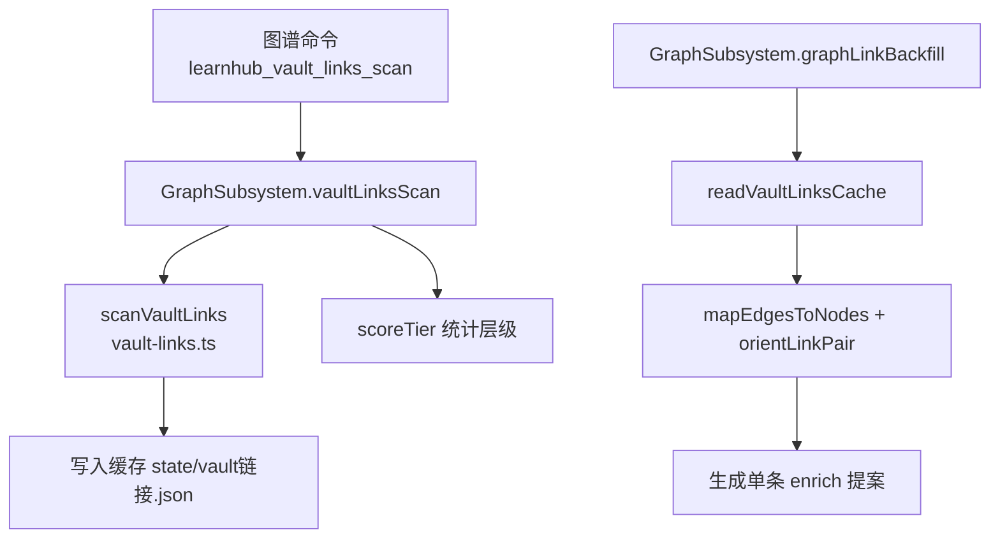
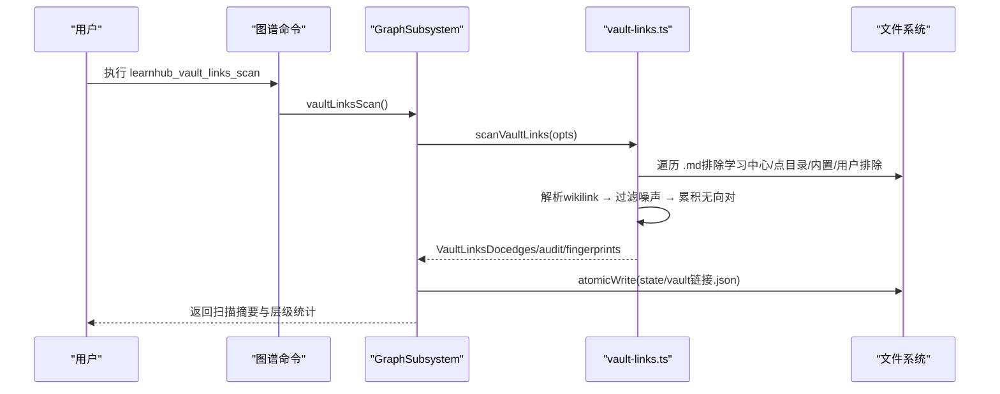
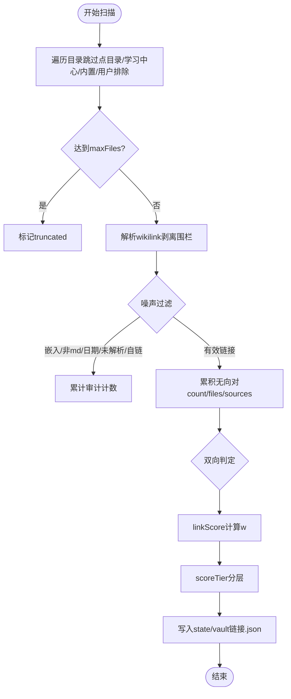
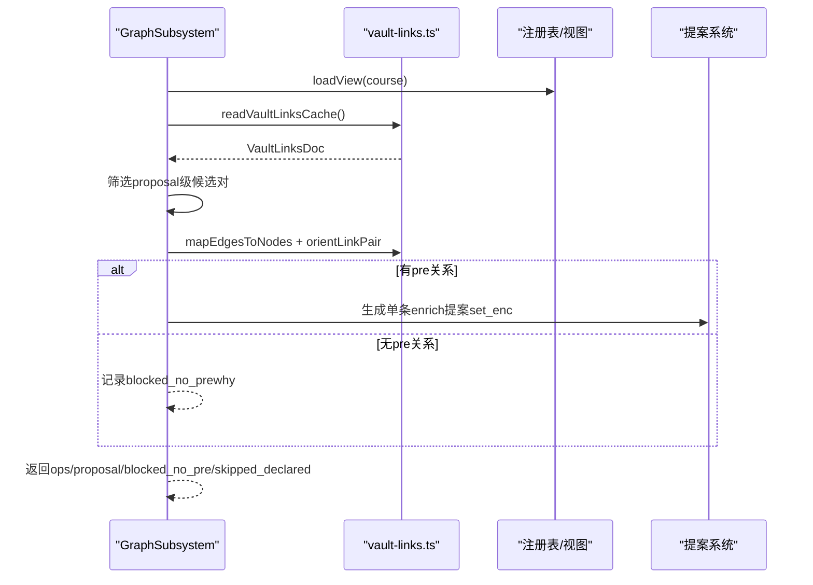
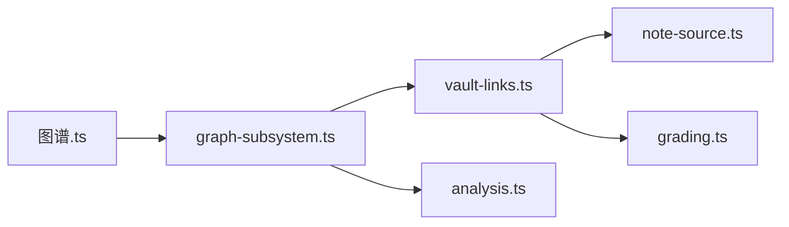

# Vault链接先验

<cite>
**本文引用的文件**
- [vault-links.ts](file://src/engine/vault-links.ts)
- [graph-subsystem.ts](file://src/engine/graph-subsystem.ts)
- [vault-prior.ts](file://src/engine/vault-prior.ts)
- [图谱.ts](file://src/commands/图谱.ts)
- [analysis.ts](file://src/engine/analysis.ts)
- [vault-links.test.ts](file://tests/vault-links.test.ts)
- [vault-prior.test.ts](file://tests/vault-prior.test.ts)
</cite>

## 目录
1. [简介](#简介)
2. [项目结构](#项目结构)
3. [核心组件](#核心组件)
4. [架构总览](#架构总览)
5. [详细组件分析](#详细组件分析)
6. [依赖关系分析](#依赖关系分析)
7. [性能考量](#性能考量)
8. [故障排查指南](#故障排查指南)
9. [结论](#结论)
10. [附录：使用示例与操作指引](#附录使用示例与操作指引)

## 简介
本文件系统性地说明“Vault链接先验”的实现与使用，覆盖以下目标：
- vaultLinksScan 方法：文件扫描、wikilink解析、过滤机制、权重计算与缓存落盘。
- 链接先验回填 graphLinkBackfill：候选对筛选、方向判断、提案生成。
- 链接先验检索（V-2 注入）：readVaultLinksCache 的读取方式、缓存格式、更新策略与失效处理。
- scoreTier 分级逻辑：proposal/review/report 判定标准。
- 提供可操作的命令与调用路径，便于执行扫描、查看结果与处理建议。

## 项目结构
Vault链接先验涉及引擎层两个模块与上层子系统：
- vault-links.ts：实现全库 wikilink 扫描、去噪、置信度打分、缓存读写、候选边映射与方向裁决等。
- graph-subsystem.ts：暴露 vaultLinksScan 与 graphLinkBackfill 等入口，负责配置读取、缓存落盘、视图加载与提案汇总。
- vault-prior.ts：实现“先验上下文注入”的 BM25 式检索（与链接先验互补，用于生成时注入学习者笔记）。
- 图谱命令：对外暴露 learnhub_vault_links_scan 与 learnhub_graph_link_backfill 工具。
- analysis.ts：将扫描结果整合进图谱分析视图，展示 vault_link_candidates。

图表来源
- [graph-subsystem.ts:155-195](file://src/engine/graph-subsystem.ts#L155-L195)
- [vault-links.ts:254-352](file://src/engine/vault-links.ts#L254-L352)
- [vault-links.ts:210-234](file://src/engine/vault-links.ts#L210-L234)

章节来源
- [graph-subsystem.ts:155-238](file://src/engine/graph-subsystem.ts#L155-L238)
- [vault-links.ts:1-452](file://src/engine/vault-links.ts#L1-L452)
- [图谱.ts:294-311](file://src/commands/图谱.ts#L294-L311)

## 核心组件
- 扫描与过滤：scanVaultLinks 遍历 .md 文件，排除学习中心、点目录、内置目录与用户排除清单；解析 wikilink，过滤嵌入、非 md 资产、日期目标、自链与未解析目标，并记录审计计数。
- 权重与分层：linkScore 基于出现次数、独立源文件数、双向互链加成计算 w∈[0,1]；scoreTier 将 w 分为 proposal≥0.7、review 0.4–0.7、report <0.4。
- 缓存机制：readVaultLinksCache 读取 state/vault链接.json，缺失返回 null，损坏或契约不符抛错；scanVaultLinks 输出包含 fingerprints 的版本化文档。
- 回填流程：graphLinkBackfill 读取缓存，筛选 proposal 级候选对，按 pre 闭包定向为 enc 边，生成单条 pending enrich 提案；无 pre 关系的降级为 blocked_no_pre。
- 先验注入：vault-prior.ts 提供 runPriorSearch/searchVaultPrior，BM25 式检索个人笔记，注入生成提示词；与链接先验互补。

章节来源
- [vault-links.ts:27-65](file://src/engine/vault-links.ts#L27-L65)
- [vault-links.ts:185-201](file://src/engine/vault-links.ts#L185-L201)
- [vault-links.ts:210-234](file://src/engine/vault-links.ts#L210-L234)
- [vault-links.ts:254-352](file://src/engine/vault-links.ts#L254-L352)
- [graph-subsystem.ts:155-238](file://src/engine/graph-subsystem.ts#L155-L238)
- [vault-prior.ts:185-195](file://src/engine/vault-prior.ts#L185-L195)

## 架构总览
Vault链接先验由“扫描→缓存→分析→回填”四阶段组成：
- 扫描：vaultLinksScan 调用 scanVaultLinks，产出 VaultLinksDoc（含 edges、audit、fingerprints）。
- 缓存：原子写入 state/vault链接.json；后续分析视图与回填均从该缓存读取。
- 分析：analysis.ts 将候选边映射到课程图节点，展示 vault_link_candidates。
- 回填：graphLinkBackfill 仅处理 proposal 级候选对，依据 pre 闭包定向成 enc 边，生成单条待审提案。

图表来源
- [graph-subsystem.ts:155-195](file://src/engine/graph-subsystem.ts#L155-L195)
- [vault-links.ts:254-352](file://src/engine/vault-links.ts#L254-L352)

章节来源
- [graph-subsystem.ts:155-195](file://src/engine/graph-subsystem.ts#L155-L195)
- [vault-links.ts:254-352](file://src/engine/vault-links.ts#L254-L352)

## 详细组件分析

### vaultLinksScan：文件扫描、wikilink解析、权重计算与缓存策略
- 扫描范围与过滤
  - 排除学习中心目录（centerRel）、点目录（以 . 开头的目录段）、内置目录排除（VAULT_LINK_DEFAULT_DIR_EXCLUDES），以及用户 note-source 排除清单。
  - 仅扫描 .md 文件；超过 maxFiles 上限时标记 truncated 并停止继续收集。
- Wikilink解析与噪声过滤
  - 正则统一解析 [[target(#anchor)?(|alias)?]]，剥离代码围栏中的示例链接。
  - 过滤规则：嵌入 ![[…]]、非 md 资产（白名单扩展名）、日期目标（日记导航）、未解析目标、自链；各规则命中数计入 audit。
- 权重计算与分层
  - linkScore(count, files, bidirectional)：次数饱和（≤5×0.5）、独立源文件饱和（≤3×0.3）、双向互链+0.2；封顶1。
  - scoreTier(w)：≥0.7 提案、0.4–0.7 待裁决、<0.4 仅报告。
- 缓存策略
  - 产物为 VaultLinksDoc，包含 version、generated_at、scanned_files、truncated、links_seen、edges、unresolved、audit、fingerprints。
  - readVaultLinksCache：缺文件返回 null；JSON 无法解析或契约形状不符抛错，要求重跑扫描覆盖。

图表来源
- [vault-links.ts:254-352](file://src/engine/vault-links.ts#L254-L352)
- [vault-links.ts:210-234](file://src/engine/vault-links.ts#L210-L234)

章节来源
- [vault-links.ts:27-65](file://src/engine/vault-links.ts#L27-L65)
- [vault-links.ts:94-181](file://src/engine/vault-links.ts#L94-L181)
- [vault-links.ts:185-201](file://src/engine/vault-links.ts#L185-L201)
- [vault-links.ts:254-352](file://src/engine/vault-links.ts#L254-L352)
- [graph-subsystem.ts:155-195](file://src/engine/graph-subsystem.ts#L155-L195)

### 链接先验回填 graphLinkBackfill：候选对筛选、方向判断与提案生成
- 候选对筛选
  - 读取缓存后，仅选择 scoreTier(e.w) === 'proposal' 的候选对。
- 方向判断
  - 使用 orientLinkPair(aNode, bNode, isAncestor) 在 pre 传递闭包内确定 skill→holder 方向；若两节点无 pre 关系，则返回 blocked_no_pre 信号（带 why）。
- 提案生成
  - 已声明的 enc 边跳过；其余定向边汇总为 EnrichFieldEntry，形成单个 pending edit 提案（enc_backfill 先例），需通过 learnhub_graph_apply(kind=enrich) 审阅应用。
- 可重入性
  - 重复运行不会重复提名已声明边；失败时给出明确指引（如缺少缓存）。

图表来源
- [graph-subsystem.ts:198-238](file://src/engine/graph-subsystem.ts#L198-L238)
- [vault-links.ts:380-410](file://src/engine/vault-links.ts#L380-L410)

章节来源
- [graph-subsystem.ts:198-238](file://src/engine/graph-subsystem.ts#L198-L238)
- [vault-links.ts:380-410](file://src/engine/vault-links.ts#L380-L410)

### 链接先验检索（V-2 注入）：readVaultLinksCache 的工作方式
- 缓存格式
  - VaultLinksDoc.version=1；包含 generated_at、scanned_files、truncated、links_seen、edges、unresolved、audit、fingerprints。
- 更新策略
  - vaultLinksScan 每次运行都会覆盖 state/vault链接.json；fingerprints 记录每个源文件的哈希前缀，用于漂移检测与重扫。
- 失效处理
  - 读缓存时：ENOENT 返回 null（未扫描）；JSON 解析失败或契约形状不符抛出错误，要求重跑扫描覆盖。
- 与先验注入的关系
  - 链接先验（vault-links.ts）与先验注入（vault-prior.ts）是两个互补能力：前者产出关联边与候选对，后者在生成时检索相关笔记注入上下文。

章节来源
- [vault-links.ts:43-65](file://src/engine/vault-links.ts#L43-L65)
- [vault-links.ts:210-234](file://src/engine/vault-links.ts#L210-L234)
- [vault-prior.ts:185-195](file://src/engine/vault-prior.ts#L185-L195)

### 链接权重算法 scoreTier 的实现逻辑
- linkScore 加法模型
  - 次数贡献：min(count,5)/5 × 0.5
  - 独立源文件贡献：min(files,3)/3 × 0.3
  - 双向互链加成：+0.2
  - 封顶至 1，保留三位小数精度。
- scoreTier 分级
  - ≥0.7：proposal（进入回填流程，生成单条待审提案）
  - 0.4–0.7：review（进入 analyze 建议段，供人工裁决）
  - <0.4：report（仅落扫描报告）

章节来源
- [vault-links.ts:185-201](file://src/engine/vault-links.ts#L185-L201)
- [vault-links.test.ts:67-77](file://tests/vault-links.test.ts#L67-L77)

### 过滤机制详解：学习中心目录排除、用户配置排除与内置目录排除
- 学习中心目录排除
  - centerRel 作为前缀整体排除；避免引擎管理区被当作先验来源。
- 用户配置排除
  - 通过 note-source 排除清单（pathExcludes）进行路径前缀匹配；永远生效。
- 内置目录排除
  - VAULT_LINK_DEFAULT_DIR_EXCLUDES = ['99附件', '05ob自定义', '00类型', '03属性', '过时*']
  - 支持段前缀模式（x*）与段全等匹配；learnhub.json 的 vault_link_excludes 可整体替换内置清单。

章节来源
- [vault-links.ts:67-92](file://src/engine/vault-links.ts#L67-L92)
- [vault-links.ts:254-286](file://src/engine/vault-links.ts#L254-L286)
- [graph-subsystem.ts:169-177](file://src/engine/graph-subsystem.ts#L169-L177)

## 依赖关系分析
- 模块耦合
  - graph-subsystem.ts 依赖 vault-links.ts 的扫描、缓存、映射与方向裁决函数；同时依赖 analysis.ts 将结果纳入视图。
  - vault-links.ts 依赖 note-source.ts（指纹、frontmatter 剥离）、grading.ts（clamp01）等基础工具。
- 外部接口
  - VaultFs 抽象文件系统，使扫描与缓存读写可测试、可替换。
  - 命令层通过图谱命令暴露工具，解耦 UI/Agent 与引擎实现。

图表来源
- [graph-subsystem.ts:51-73](file://src/engine/graph-subsystem.ts#L51-L73)
- [vault-links.ts:23-26](file://src/engine/vault-links.ts#L23-L26)
- [图谱.ts:294-311](file://src/commands/图谱.ts#L294-L311)

章节来源
- [graph-subsystem.ts:51-73](file://src/engine/graph-subsystem.ts#L51-L73)
- [vault-links.ts:23-26](file://src/engine/vault-links.ts#L23-L26)
- [图谱.ts:294-311](file://src/commands/图谱.ts#L294-L311)

## 性能考量
- 扫描面控制
  - maxFiles 默认 5000，防止超大 vault 拖垮；触顶显式标记 truncated，不静默截断。
  - 目录列举与文件读取采用 try/catch 静默跳过不可读目录，保证健壮性。
- 权重计算复杂度
  - linkScore O(1)，scoreTier O(1)；边排序 O(E log E)。
- 缓存与指纹
  - fingerprints 记录源文件哈希前缀，便于漂移检测与增量重扫；读缓存失败时 fail loud，避免脏数据。
- 先验注入优化
  - vault-prior.ts 使用 mtime 优先窗口（MTIME_WINDOW_FACTOR）提升相关性；BM25 参数 k1=1.2、b=0.75 为文献默认值，未调参。

章节来源
- [vault-links.ts:254-286](file://src/engine/vault-links.ts#L254-L286)
- [vault-links.ts:185-201](file://src/engine/vault-links.ts#L185-L201)
- [vault-prior.ts:96-101](file://src/engine/vault-prior.ts#L96-L101)
- [vault-prior.ts:279-288](file://src/engine/vault-prior.ts#L279-L288)

## 故障排查指南
- 没有链接先验缓存
  - 现象：graphLinkBackfill 报错提示先跑 vaultLinksScan。
  - 处理：执行 learnhub_vault_links_scan 生成缓存。
- 缓存 Broken
  - 现象：readVaultLinksCache 抛出 JSON 无法解析或契约形状不符错误。
  - 处理：删除损坏缓存并重跑扫描；确保版本号为 1 且 edges 为数组。
- 扫描结果为空或零命中
  - 现象：analyze 视图无 vault_link_candidates。
  - 处理：检查排除清单是否过严；确认笔记中确实存在 wikilink；查看 audit 审计计数定位过滤原因。
- 候选对未进入提案
  - 现象：proposal 级候选对无提案生成。
  - 处理：确认 w≥0.7；检查 pre 闭包关系；若无 pre 关系，会返回 blocked_no_pre，需先补 pre 边或放弃。

章节来源
- [graph-subsystem.ts:211-216](file://src/engine/graph-subsystem.ts#L211-L216)
- [vault-links.ts:210-234](file://src/engine/vault-links.ts#L210-L234)
- [vault-links.test.ts:158-195](file://tests/vault-links.test.ts#L158-L195)

## 结论
Vault链接先验通过严格的扫描过滤、可解释的权重算法与稳健的缓存机制，为图谱分析与内容生成提供了可靠的数据基础。proposal/review/report 三级分层既保证了高置信度边的自动回填，又保留了中等置信度的待裁决空间。配合先验注入（vault-prior.ts），系统在生成时能尊重学习者已有理解，避免从零教学。整体设计遵循只读纪律与可观测性原则，确保行为透明、可审计、可重入。

## 附录：使用示例与操作指引
- 执行链接扫描
  - 命令：learnhub_vault_links_scan
  - 作用：扫描全库个人笔记的 wikilink，产出去噪后的无向关联对，缓存到 state/vault链接.json。
  - 参考：[图谱.ts:294-311](file://src/commands/图谱.ts#L294-L311)
- 查看先验结果
  - 入口：graph.analyze（或 UI 视图）
  - 字段：suggestions.vault_link_candidates 展示候选对；vault_links.scanned_at 指示扫描时间。
  - 参考：[analysis.ts:233-241](file://src/engine/analysis.ts#L233-L241)
- 处理链接建议
  - 回填：learnhub_graph_link_backfill
  - 作用：将 proposal 级候选对定向为 enc 边，生成单条待审提案；无 pre 关系降级为 blocked_no_pre。
  - 参考：[graph-subsystem.ts:198-238](file://src/engine/graph-subsystem.ts#L198-L238)
- 验证与调试
  - 单元测试：vault-links.test.ts 覆盖解析、打分、映射、排除与端到端扫描。
  - 参考：[vault-links.test.ts:158-195](file://tests/vault-links.test.ts#L158-L195)

章节来源
- [图谱.ts:294-311](file://src/commands/图谱.ts#L294-L311)
- [analysis.ts:233-241](file://src/engine/analysis.ts#L233-L241)
- [graph-subsystem.ts:198-238](file://src/engine/graph-subsystem.ts#L198-L238)
- [vault-links.test.ts:158-195](file://tests/vault-links.test.ts#L158-L195)