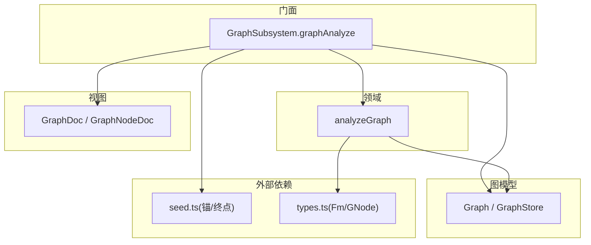
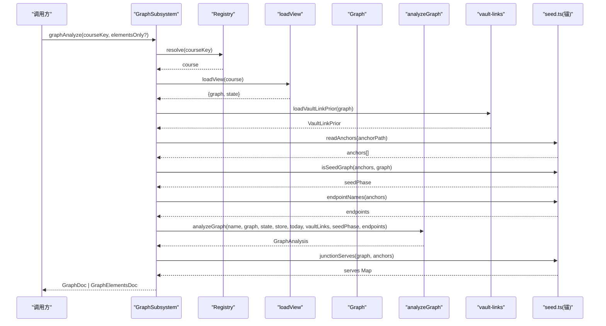
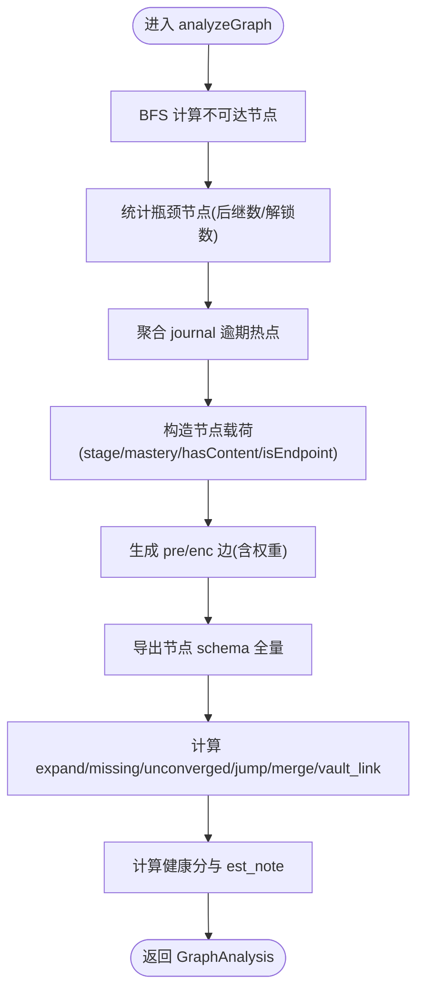
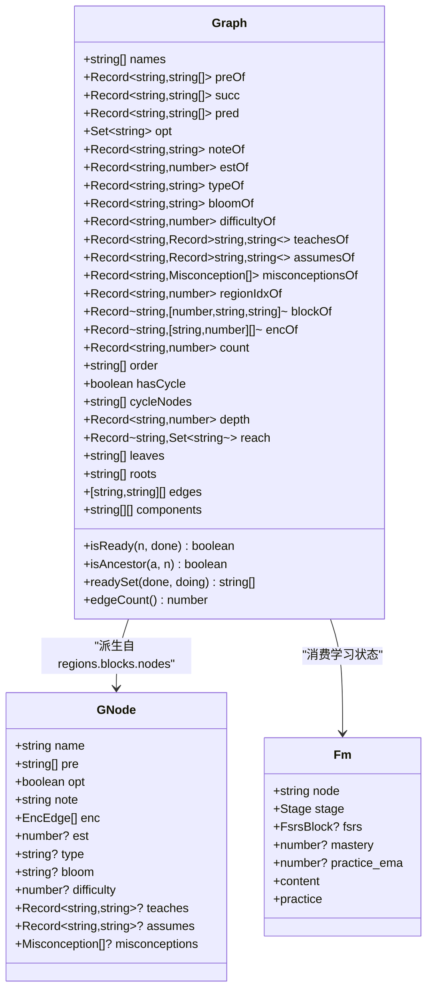
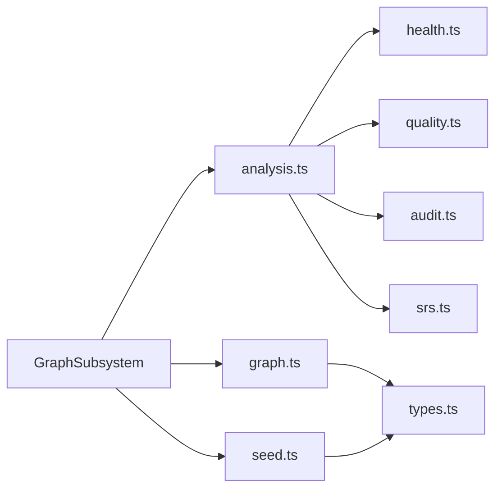

# 图谱分析

<cite>
**本文引用的文件**
- [src/engine/graph.ts](file://src/engine/graph.ts)
- [src/engine/graph-subsystem.ts](file://src/engine/graph-subsystem.ts)
- [src/engine/analysis.ts](file://src/engine/analysis.ts)
- [src/engine/types.ts](file://src/engine/types.ts)
- [src/engine/seed.ts](file://src/engine/seed.ts)
- [src/engine/views/graph.ts](file://src/engine/views/graph.ts)
- [src/commands/图谱.ts](file://src/commands/图谱.ts)
</cite>

## 目录
1. [简介](#简介)
2. [项目结构](#项目结构)
3. [核心组件](#核心组件)
4. [架构总览](#架构总览)
5. [详细组件分析](#详细组件分析)
6. [依赖关系分析](#依赖关系分析)
7. [性能考量](#性能考量)
8. [故障排查指南](#故障排查指南)
9. [结论](#结论)
10. [附录：API 使用示例](#附录api-使用示例)

## 简介
本文件面向“图谱分析”能力，系统性说明 graphAnalyze 方法的核心实现与 analyzeGraph 函数的工作原理，覆盖课程图加载、Vault 链接先验处理、种子图检测、终点标记与交汇节点计算、节点状态计算、边关系分析与健康度评估机制。同时解释图谱数据结构（Graph、GNode、Fm）的设计理念与字段含义，并给出如何使用图谱分析 API 获取课程结构信息、节点详情和路径查询的具体步骤。

## 项目结构
图谱分析由“子系统门面 + 领域分析 + 图模型 + 视图类型 + 命令注册”共同构成：
- 子系统门面 GraphSubsystem 暴露 graphAnalyze、graphNode、graphPath 等对外能力，负责协调课程解析、图加载、锚点读取、Vault 先验注入与结果组装。
- 领域分析模块 analysis.ts 提供 analyzeGraph，完成不可达节点、瓶颈、逾期热点、健康分、建议项、渲染元素与 schema 全量输出。
- 图模型 graph.ts 定义 GraphStore、Graph、GRegion/GBlock/GNode 等结构与派生计算（拓扑序、深度、可达集、传递约简边、连通分量）。
- 视图类型 views/graph.ts 定义 GraphDoc、GraphNodeDoc、GraphBrowseDoc 等对外返回结构。
- 命令注册 commands/图谱.ts 将引擎能力暴露为面板/Agent 工具路由。

图表来源
- [src/engine/graph-subsystem.ts:88-117](file://src/engine/graph-subsystem.ts#L88-L117)
- [src/engine/analysis.ts:87-245](file://src/engine/analysis.ts#L87-L245)
- [src/engine/graph.ts:278-443](file://src/engine/graph.ts#L278-L443)
- [src/engine/seed.ts:40-71](file://src/engine/seed.ts#L40-L71)
- [src/engine/types.ts:40-107](file://src/engine/types.ts#L40-L107)
- [src/engine/views/graph.ts:77-143](file://src/engine/views/graph.ts#L77-L143)

章节来源
- [src/engine/graph-subsystem.ts:88-117](file://src/engine/graph-subsystem.ts#L88-L117)
- [src/engine/analysis.ts:87-245](file://src/engine/analysis.ts#L87-L245)
- [src/engine/graph.ts:278-443](file://src/engine/graph.ts#L278-L443)
- [src/engine/seed.ts:40-71](file://src/engine/seed.ts#L40-L71)
- [src/engine/types.ts:40-107](file://src/engine/types.ts#L40-L107)
- [src/engine/views/graph.ts:77-143](file://src/engine/views/graph.ts#L77-L143)

## 核心组件
- GraphSubsystem.graphAnalyze：入口门面，串联课程解析、图加载、Vault 先验、锚点与终点、调用 analyzeGraph，并附加交汇节点信息。
- analyzeGraph：核心分析器，产出统计、不可达、瓶颈、逾期热点、健康分、建议项、渲染元素与 schema。
- Graph：图模型，维护节点名、pre/succ/enc、opt、depth、reach、edges、components 等，并提供 isReady、isAncestor、readySet 等方法。
- 视图类型：GraphDoc/GraphNodeDoc/GraphBrowseDoc 等，定义对外返回的数据契约。
- 种子与锚：EndpointAnchor/AnchorBook 描述多终点方向；readAnchors/isSeedGraph/junctionServes 用于种子图检测、终点集合与交汇节点计算。

章节来源
- [src/engine/graph-subsystem.ts:88-117](file://src/engine/graph-subsystem.ts#L88-L117)
- [src/engine/analysis.ts:87-245](file://src/engine/analysis.ts#L87-L245)
- [src/engine/graph.ts:278-443](file://src/engine/graph.ts#L278-L443)
- [src/engine/views/graph.ts:77-143](file://src/engine/views/graph.ts#L77-L143)
- [src/engine/seed.ts:40-71](file://src/engine/seed.ts#L40-L71)

## 架构总览
下图展示一次 graphAnalyze 的端到端流程：从课程解析到图加载、Vault 先验、锚点与终点、分析计算、交汇节点标注，最终返回 GraphDoc。

图表来源
- [src/engine/graph-subsystem.ts:88-117](file://src/engine/graph-subsystem.ts#L88-L117)
- [src/engine/analysis.ts:87-245](file://src/engine/analysis.ts#L87-L245)
- [src/engine/seed.ts:40-71](file://src/engine/seed.ts#L40-L71)

## 详细组件分析

### graphAnalyze 方法：课程图加载、Vault 先验、种子图检测、终点标记与交汇节点
- 课程解析与图加载：通过 registry.resolve 定位课程，再由 loadView 返回 Graph 与学习状态 state。
- Vault 链接先验：读取缓存并映射到本课程图的候选边（w≥0.4），按 tier 区分 proposal/review，附带建议文案。
- 种子图检测：读取锚点文件，判断当前图是否仍等于“锚集合种子节点并集”，若是则进入 seedPhase，豁免 missing_pre 建议与健康阈值。
- 终点标记：从锚点提取终点集合，传入 analyzeGraph 以在节点载荷中标记 isEndpoint，并在 stats.leaves 中剔除终点。
- 交汇节点计算：junctionServes 计算落在 ≥2 个终点前置闭包内的节点，作为 serves 字段附加到 nodes.data。
- 返回形态：elementsOnly=true 时仅返回渲染元素；否则返回包含 endpoints、endpoint_steps 的完整 GraphDoc。

章节来源
- [src/engine/graph-subsystem.ts:88-117](file://src/engine/graph-subsystem.ts#L88-L117)
- [src/engine/graph-subsystem.ts:125-152](file://src/engine/graph-subsystem.ts#L125-L152)
- [src/engine/seed.ts:40-71](file://src/engine/seed.ts#L40-L71)
- [src/engine/views/graph.ts:77-143](file://src/engine/views/graph.ts#L77-L143)

### analyzeGraph 函数：节点状态、边关系与健康度
- 不可达节点：从根节点 BFS 可达性分析，有环时跳过。
- 瓶颈节点：后继数 top，解锁口径为 succ 中未学者（unseen/ready）。
- 逾期热点：聚合 journal 尾部记录中的 relearn/rating=1 次数，取高频节点。
- 节点载荷：region/block/depth/stage/opt/mastery/hasContent/isEndpoint/type。
- 边关系：传递约简后的 pre 边与 enc 成分技能边（kind 区分，enc 带权重 w）。
- Schema 全量：每个节点的 pre/enc/opt/est/type/bloom/difficulty/teaches/assumes/misconceptions/note。
- 分批构建建议：expand_blocks（浅块）、missing_pre（空降节点，种子阶段豁免）、unconverged（平均 pre <1.5）、jump_candidates（认知跨步）、merge_blocks（可合并小快）、vault_link_candidates（Vault 先验候选）。
- 健康度：graphHealthScore 综合评分与分解，结合 estSpreadNote 提示。

图表来源
- [src/engine/analysis.ts:87-245](file://src/engine/analysis.ts#L87-L245)

章节来源
- [src/engine/analysis.ts:87-245](file://src/engine/analysis.ts#L87-L245)

### 图谱数据结构：Graph、GNode、Fm 的设计与字段
- GNode：图节点原始声明，包含 name/pre/opt/note/enc/est/type/bloom/difficulty/teaches/assumes/misconceptions。其中 enc 为成分技能边列表（node/w/note），teaches/assumes 为概念档位映射，misconceptions 为误解先验条目。
- Graph：对 regions 的派生结构，维护 names、preOf/succ/pred、opt/noteOf/estOf/typeOf/bloomOf/difficultyOf/teachesOf/assumesOf/misconceptionsOf、regionIdxOf/blockOf/encOf、count、order、hasCycle/cycleNodes、depth/reach、leaves/roots、edges/components。提供 isReady、isAncestor、readySet、edgeCount 等方法。
- Fm：课程笔记 frontmatter，承载 stage/fsrs/content/practice 等学习状态与内容元信息，是调度与掌握度的事实源。

图表来源
- [src/engine/types.ts:40-107](file://src/engine/types.ts#L40-L107)
- [src/engine/graph.ts:278-443](file://src/engine/graph.ts#L278-L443)

章节来源
- [src/engine/types.ts:40-107](file://src/engine/types.ts#L40-L107)
- [src/engine/graph.ts:278-443](file://src/engine/graph.ts#L278-L443)

### 锚点、终点、前置关系与依赖闭包的处理
- 锚点与终点：锚点文件存储多终点方向（EndpointAnchor），包含 endpoint/goal_note/goal_type/declared/sealed/worksheet/seed_nodes/start_basis。读侧统一按集合工作，零终点合法。
- 种子图检测：当图仍等于“锚集合种子节点并集”时，视为种子阶段，豁免 missing_pre 建议与健康阈值。
- 前置关系与依赖闭包：Graph.preOf 表示直接前置；Graph.reach 为传递闭包；isAncestor 基于 reach 判定祖先；readySet 基于 preOf 与 opt 计算就绪节点。
- 交汇节点：junctionServes 计算落在 ≥2 个终点前置闭包内的节点，作为 serves 字段附加到 nodes.data，供 UI 展示“服务于哪些终点”。

章节来源
- [src/engine/seed.ts:40-71](file://src/engine/seed.ts#L40-L71)
- [src/engine/graph.ts:317-443](file://src/engine/graph.ts#L317-L443)
- [src/engine/graph-subsystem.ts:94-117](file://src/engine/graph-subsystem.ts#L94-L117)

### Vault 链接先验处理
- 扫描与缓存：vaultLinksScan 扫描个人笔记 wikilink，产出无向关联对与置信度 w∈[0,1]，写入 state/vault链接.json。
- 先验映射：loadVaultLinkPrior 读取缓存，过滤 w≥0.4 的边，映射到本课程图节点，按 scoreTier 分为 proposal/review，并附带行动指引。
- 回填通道：graphLinkBackfill 将高置信且满足 pre 闭包定向的候选边转为 enrich 提案（整体替换 enc，保留既有声明），未满足 pre 关系的边以 blocked_no_pre 形式返回供人工裁决。

章节来源
- [src/engine/graph-subsystem.ts:155-265](file://src/engine/graph-subsystem.ts#L155-L265)
- [src/engine/analysis.ts:19-25](file://src/engine/analysis.ts#L19-L25)

### 健康度评估机制
- 健康分：graphHealthScore 综合图结构质量（如连通性、深度、叶子比例、环等）给出 0–100 分数与 breakdown。
- est 分布提示：estSpreadNote 根据标称学习时长分布给出优化建议（不改变健康分）。
- 种子阶段豁免：seedPhase=true 时，missing_pre 建议与健康阈值策略放宽，避免误报。

章节来源
- [src/engine/analysis.ts:208-245](file://src/engine/analysis.ts#L208-L245)

## 依赖关系分析
- GraphSubsystem 依赖 Registry、Store、Paths、Projects、Proposals、Concepts、Registry、QuestionBank、NoteSourceManifest、vault-links、analysis、audit、content、prompt-assembly、graph、io、notes、project-decompile、seed、sessions、srs、types、yaml 等。
- analysis.ts 依赖 audit、health、quality、dates、grading、srs、notes、vault-links。
- graph.ts 依赖 io、paths、yaml、types。
- seed.ts 依赖 io、graph、concepts、types、srs、prompt-assembly、prompt-render。

图表来源
- [src/engine/graph-subsystem.ts:14-77](file://src/engine/graph-subsystem.ts#L14-L77)
- [src/engine/analysis.ts:1-18](file://src/engine/analysis.ts#L1-L18)
- [src/engine/graph.ts:9-16](file://src/engine/graph.ts#L9-L16)
- [src/engine/seed.ts:17-28](file://src/engine/seed.ts#L17-L28)

章节来源
- [src/engine/graph-subsystem.ts:14-77](file://src/engine/graph-subsystem.ts#L14-L77)
- [src/engine/analysis.ts:1-18](file://src/engine/analysis.ts#L1-L18)
- [src/engine/graph.ts:9-16](file://src/engine/graph.ts#L9-L16)
- [src/engine/seed.ts:17-28](file://src/engine/seed.ts#L17-L28)

## 性能考量
- 图构建复杂度：Graph 构造遍历所有节点与 pre 边，时间 O(N+E)，空间 O(N+E)。
- 拓扑排序与可达集：Kahn 算法 O(N+E)；reach 逆序累积，最坏 O(N^2) 但实际受图规模限制。
- 不可达分析：BFS 从 roots 出发 O(N+E)。
- 瓶颈与逾期热点：瓶颈 O(N+E)，逾期热点依赖 journal 尾部聚合 O(J)。
- 建议项计算：块统计 O(N)，top-N 截断控制输出规模。
- Vault 链接扫描：全库 .md 扫描，命中审计与去噪，缓存落盘避免重复扫描。

[本节为通用性能讨论，不直接分析具体文件]

## 故障排查指南
- 数据目录为空或不存在：GraphStore.load 会抛出 SchemaError，需检查 data/*.yaml 是否存在。
- 节点 schema 错误：parseNode/parseConceptFields 对未知字段、非法枚举、越界计数进行严格校验，报错信息可直接定位问题。
- 断边与重名：structureCheck 检测新增节点与既有图的冲突，包括断边与环引入。
- 误解封顶：misconceptionCapErrors 对同一概念全课程误解条数超限进行拒收提示。
- Vault 先验缺失：若未运行 vaultLinksScan，analyzeGraph 的 suggestions.vault_link_candidates 为空并附带 hint 引导执行扫描。

章节来源
- [src/engine/graph.ts:203-218](file://src/engine/graph.ts#L203-L218)
- [src/engine/graph.ts:131-173](file://src/engine/graph.ts#L131-L173)
- [src/engine/graph.ts:445-481](file://src/engine/graph.ts#L445-L481)
- [src/engine/analysis.ts:235-241](file://src/engine/analysis.ts#L235-L241)

## 结论
图谱分析以 GraphSubsystem.graphAnalyze 为入口，结合 Graph 的结构派生与 analysis.ts 的分析逻辑，提供完整的课程知识图谱诊断与建议。通过锚点与终点的多终点化设计，系统能够灵活表达学习目标与方向；Vault 链接先验为个人笔记与课程结构的关联提供了数据驱动的证据。健康度评估与分批构建建议帮助教练逐步完善图谱，确保学习路径的可执行性与质量基线。

[本节为总结性内容，不直接分析具体文件]

## 附录：API 使用示例
以下示例展示如何通过命令注册暴露的接口获取课程结构信息、节点详情与路径查询。注意：以下为操作指引，不包含代码片段。

- 获取课程图谱分析（结构统计、健康分、建议项、渲染元素）
  - 工具名：learnhub_graph_analyze
  - 参数：course（可选）、elementsOnly（布尔，仅返回 nodes/edges）
  - 用途：规划下一批编辑前运行，依据 health/suggestions 制定计划
  - 参考：命令定义与路由绑定

- 获取单节点详情（schema 字段、邻域、enc 边、前置闭包）
  - 工具名：learnhub_graph_node
  - 参数：course（可选）、node（必填）
  - 用途：深入查看单个节点的学习阶段、内容状态与前置依赖

- 查询前置路径（from 是否为 to 的前置，及最短链）
  - 工具名：learnhub_graph_path
  - 参数：course（可选）、from（必填）、to（必填）
  - 用途：教学路径规划与解释锁定原因

- 浏览区/块节点清单（按 region/block 过滤）
  - 工具名：learnhub_graph_browse
  - 参数：course（可选）、region（可选）、block（可选）
  - 用途：探索某区域的结构与内容状态

- 扫描 Vault 链接先验（为分析提供个人笔记关联证据）
  - 工具名：learnhub_vault_links_scan
  - 参数：无
  - 用途：生成 state/vault链接.json，后续 analyzeGraph 可显示 vault_link_candidates

- 回填 enc 边（基于 Vault 链接先验或题目 invokes 投影）
  - 工具名：learnhub_graph_link_backfill / learnhub_graph_enc_backfill
  - 参数：course（可选）
  - 用途：生成 pending enrich 提案，过审后 apply 生效

章节来源
- [src/commands/图谱.ts:76-98](file://src/commands/图谱.ts#L76-L98)
- [src/commands/图谱.ts:172-208](file://src/commands/图谱.ts#L172-L208)
- [src/commands/图谱.ts:113-131](file://src/commands/图谱.ts#L113-L131)
- [src/commands/图谱.ts:297-310](file://src/commands/图谱.ts#L297-L310)
- [src/commands/图谱.ts:132-171](file://src/commands/图谱.ts#L132-L171)