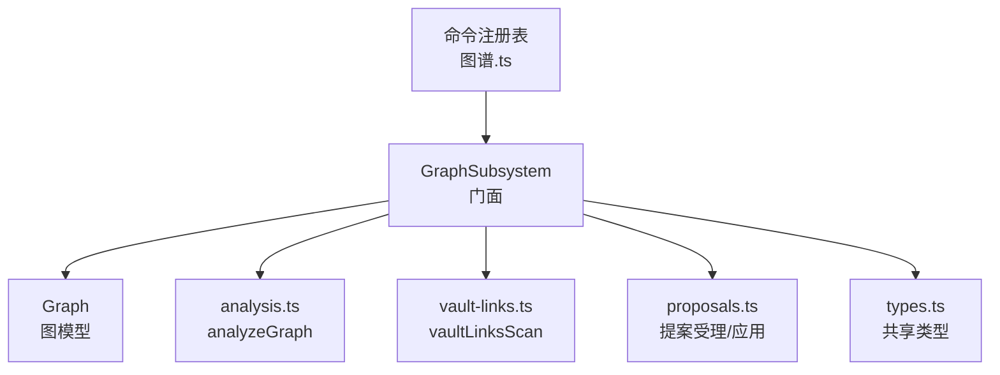
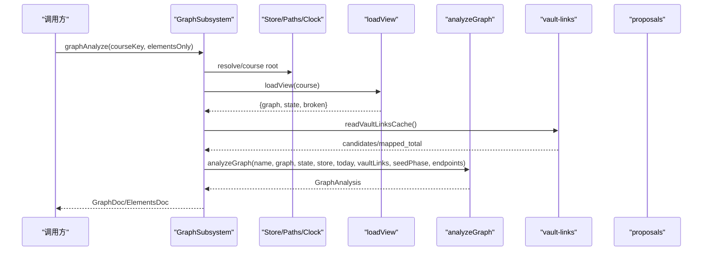
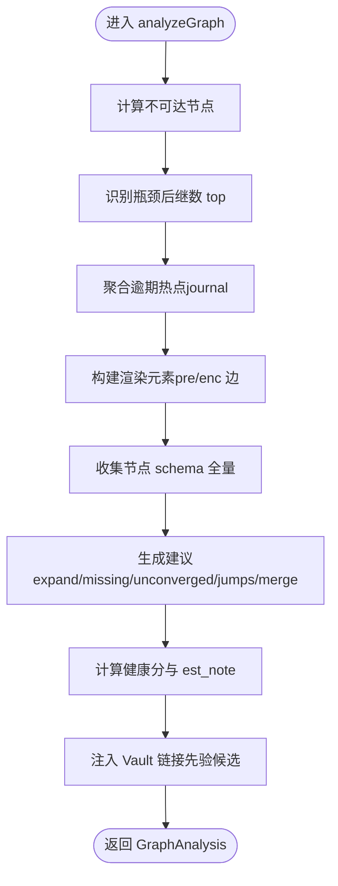
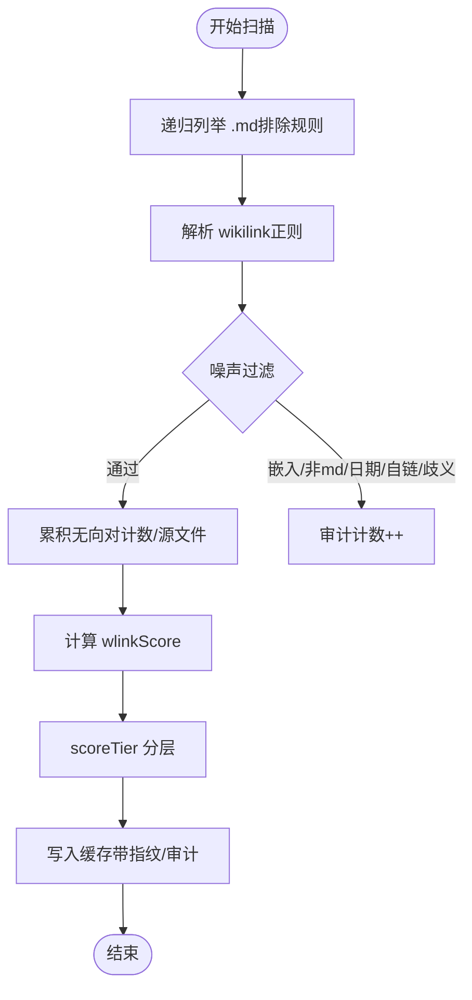
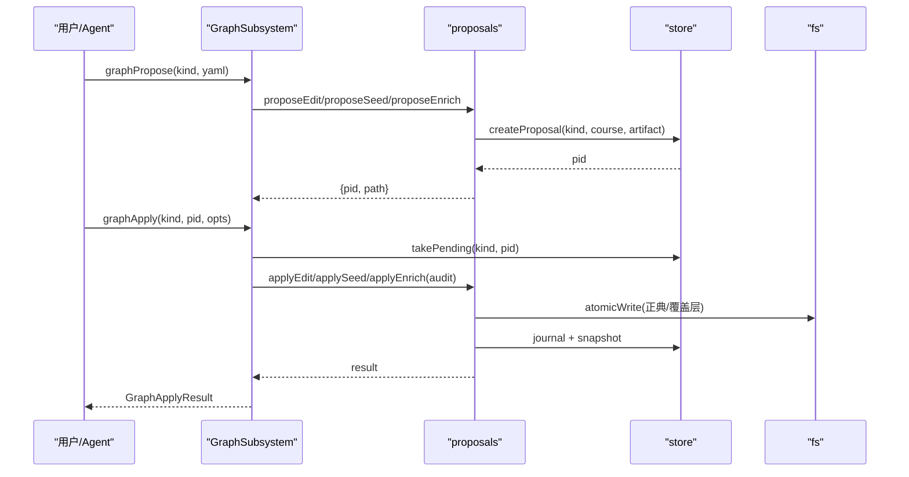
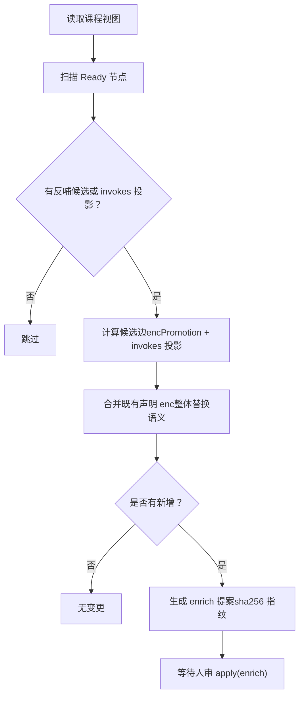
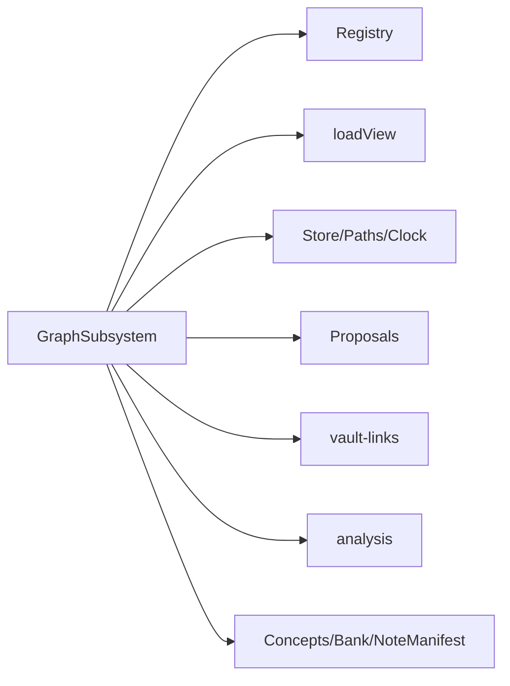

# 图谱子系统

<cite>
**本文引用的文件**
- [graph-subsystem.ts](file://src/engine/graph-subsystem.ts)
- [graph.ts](file://src/engine/graph.ts)
- [analysis.ts](file://src/engine/analysis.ts)
- [vault-links.ts](file://src/engine/vault-links.ts)
- [proposals.ts](file://src/engine/proposals.ts)
- [types.ts](file://src/engine/types.ts)
- [图谱.ts](file://src/commands/图谱.ts)
</cite>

## 目录
1. [简介](#简介)
2. [项目结构](#项目结构)
3. [核心组件](#核心组件)
4. [架构总览](#架构总览)
5. [详细组件分析](#详细组件分析)
6. [依赖关系分析](#依赖关系分析)
7. [性能考量](#性能考量)
8. [故障排查指南](#故障排查指南)
9. [结论](#结论)
10. [附录：API 使用示例](#附录api-使用示例)

## 简介
本文件系统性地梳理“图谱子系统”的职责与实现，覆盖以下关键能力：
- 知识图谱分析（analyzeGraph）：节点状态计算、边关系分析、健康度评估与建议生成。
- Vault 链接先验处理（vaultLinksScan）：全库 wikilink 扫描、解析、去噪、权重打分与缓存策略。
- 图探索（graphBrowse/graphNode/graphPath）：按区/块浏览、单节点详情、前置路径查询。
- 提案门禁包装（graphPropose/graphApply）：edit/seed/enrich 三类提案的受理与生效流程。
- enc 覆盖层回填（graphEncBackfill/graphLinkBackfill）：基于内容反哺与 Vault 链接先验的覆盖层补边。

该子系统以 GraphSubsystem 为门面，聚合图分析、Vault 链接先验、图探索、提案门禁与覆盖层回填等能力，并通过命令注册表暴露给面板与 Agent。

**章节来源**
- [graph-subsystem.ts:1-78](file://src/engine/graph-subsystem.ts#L1-L78)
- [图谱.ts:76-310](file://src/commands/图谱.ts#L76-L310)

## 项目结构
图谱子系统由多模块协作构成：
- graph-subsystem.ts：门面类 GraphSubsystem，对外提供统一 API。
- graph.ts：图模型 Graph/GNode/GRegion 及持久化读写、结构校验。
- analysis.ts：analyzeGraph 实现，产出统计、建议、渲染元素与健康分。
- vault-links.ts：Vault 链接扫描、解析、打分、映射与方向裁决。
- proposals.ts：提案生命周期（受理/应用/拒绝），含 edit/seed/enrich。
- types.ts：共享类型定义（Stage/Fm/GNode/GBlock/GRegion 等）。
- 图谱.ts：命令注册表，将引擎方法暴露为工具/路由。

**图表来源**
- [graph-subsystem.ts:78-649](file://src/engine/graph-subsystem.ts#L78-L649)
- [graph.ts:278-443](file://src/engine/graph.ts#L278-L443)
- [analysis.ts:87-246](file://src/engine/analysis.ts#L87-L246)
- [vault-links.ts:256-352](file://src/engine/vault-links.ts#L256-L352)
- [proposals.ts:495-1417](file://src/engine/proposals.ts#L495-L1417)
- [图谱.ts:76-310](file://src/commands/图谱.ts#L76-L310)

**章节来源**
- [graph-subsystem.ts:78-649](file://src/engine/graph-subsystem.ts#L78-L649)
- [图谱.ts:76-310](file://src/commands/图谱.ts#L76-L310)

## 核心组件
- GraphSubsystem：门面类，封装课程解析、视图加载、Vault 链接先验、图分析、图探索、提案门禁与覆盖层回填。
- Graph：图数据结构与派生信息（邻接表、拓扑序、深度、可达集、传递约简边、连通分量、就绪判定）。
- analyzeGraph：分析函数，输出结构统计、不可达节点、瓶颈、逾期热点、健康分、分批构建建议与渲染元素。
- vaultLinksScan：扫描器，产出无向关联对与置信度，落盘缓存并带审计明细。
- proposals：提案系统，负责 schema 校验、结构检查、指纹复核、写入正典与留痕。
- types：统一类型契约，确保跨模块数据一致性。

**章节来源**
- [graph-subsystem.ts:78-649](file://src/engine/graph-subsystem.ts#L78-L649)
- [graph.ts:278-443](file://src/engine/graph.ts#L278-L443)
- [analysis.ts:87-246](file://src/engine/analysis.ts#L87-L246)
- [vault-links.ts:256-352](file://src/engine/vault-links.ts#L256-L352)
- [proposals.ts:495-1417](file://src/engine/proposals.ts#L495-L1417)
- [types.ts:40-107](file://src/engine/types.ts#L40-L107)

## 架构总览
下图展示 GraphSubsystem 与各子模块的交互关系以及数据流向。

**图表来源**
- [graph-subsystem.ts:88-117](file://src/engine/graph-subsystem.ts#L88-L117)
- [analysis.ts:87-246](file://src/engine/analysis.ts#L87-L246)
- [vault-links.ts:214-234](file://src/engine/vault-links.ts#L214-L234)

**章节来源**
- [graph-subsystem.ts:88-117](file://src/engine/graph-subsystem.ts#L88-L117)
- [analysis.ts:87-246](file://src/engine/analysis.ts#L87-L246)
- [vault-links.ts:214-234](file://src/engine/vault-links.ts#L214-L234)

## 详细组件分析

### 图谱数据结构：Graph、GNode、Fm
- GNode：节点元数据，包含 pre/opt/note/enc/est/type/bloom/difficulty/teaches/assumes/misconceptions。
- GBlock/GRegion：组织节点的结构单元，data/*.yaml 是图结构的权威源。
- Graph：从 regions 构造，派生 names/preOf/succ/pred/depth/reach/edges/components/leaves/roots 等；提供 isReady/isAncestor/readySet 等方法。
- Fm：课程笔记 frontmatter，承载阶段、FSRS、练习证据、内容状态等，作为调度与掌握度的事实源。

复杂度与特性：
- 拓扑排序与环检测：O(V+E)。
- 可达集与传递约简边：一次 BFS/DFS 后反向累积，O(V+E)。
- 连通分量：并查集 O(V+E)。
- 就绪判定：O(k) 其中 k 为前置数。

**章节来源**
- [graph.ts:131-173](file://src/engine/graph.ts#L131-L173)
- [graph.ts:176-196](file://src/engine/graph.ts#L176-L196)
- [graph.ts:278-443](file://src/engine/graph.ts#L278-L443)
- [types.ts:40-107](file://src/engine/types.ts#L40-L107)

### 图谱分析方法 analyzeGraph
职责：
- 计算不可达节点、瓶颈（高扇出）、逾期热点（journal 驱动）。
- 生成 cytoscape 渲染元素（pre/enc 边区分）。
- 计算健康分与 est 分布提示。
- 生成分批构建建议（expand_blocks/missing_pre/unconverged/jump_candidates/merge_blocks）。
- 注入 Vault 链接先验候选（w≥0.4）。

关键点：
- 终点豁免：leaves 与 missing_pre 剔除终点节点（方向标记非缺陷）。
- 种子图豁免：在种子阶段不触发 missing_pre 建议。
- 节点载荷：stage/mastery/hasContent/isEndpoint/type 等读侧派生字段。

**图表来源**
- [analysis.ts:87-246](file://src/engine/analysis.ts#L87-L246)

**章节来源**
- [analysis.ts:87-246](file://src/engine/analysis.ts#L87-L246)

### Vault 链接扫描机制 vaultLinksScan
职责：
- 遍历 vault 根下 .md（排除学习中心/点目录/内置目录/用户排除清单）。
- 解析 wikilink（支持嵌入、锚点、别名），过滤噪声（嵌入/非 md/日期目标/自链/歧义 basename）。
- 累积无向关联对，计算置信度 w（次数+独立源文件+双向加成）。
- 写缓存到 state/vault链接.json，带审计明细与源文件指纹。

权重与分层：
- linkScore(count, files, bidirectional) → w∈[0,1]。
- scoreTier(w)：proposal≥0.7，review∈[0.4,0.7)，report<0.4。

缓存策略：
- 缺文件 = Missing（合法空态），JSON 坏/契约不符 fail loud。
- 截断显式可见（truncated=true），避免静默丢失。

**图表来源**
- [vault-links.ts:256-352](file://src/engine/vault-links.ts#L256-L352)
- [vault-links.ts:185-201](file://src/engine/vault-links.ts#L185-L201)

**章节来源**
- [vault-links.ts:256-352](file://src/engine/vault-links.ts#L256-L352)
- [vault-links.ts:185-201](file://src/engine/vault-links.ts#L185-L201)

### 图谱提案系统：graphPropose / graphApply
三类提案：
- edit：变更操作（add_node/set_pre/set_enc/del_node/rename/move/set_note），受 schema 与结构门约束。
- seed：为已注册课程起草结构（起点+终点），走人审后落地锚与占位边。
- enrich：覆盖层回填（enc 整体替换语义），指纹复核后写正典并留痕。

流程要点：
- propose：schema 校验 → 结构检查（断边/环/冲突）→ 落盘 pending（产物文件留痕）。
- apply：audit 门禁（ERROR 拒绝）→ 执行具体 apply（applyEdit/applySeed/applyEnrich）→ journal + 快照。
- enrich 指纹：任一受影响正典文件被改过则拒收（AC：指纹不符拒收）。

**图表来源**
- [graph-subsystem.ts:406-429](file://src/engine/graph-subsystem.ts#L406-L429)
- [proposals.ts:556-563](file://src/engine/proposals.ts#L556-L563)
- [proposals.ts:1151-1179](file://src/engine/proposals.ts#L1151-L1179)
- [proposals.ts:1401-1417](file://src/engine/proposals.ts#L1401-L1417)

**章节来源**
- [graph-subsystem.ts:406-429](file://src/engine/graph-subsystem.ts#L406-L429)
- [proposals.ts:556-563](file://src/engine/proposals.ts#L556-L563)
- [proposals.ts:1151-1179](file://src/engine/proposals.ts#L1151-L1179)
- [proposals.ts:1401-1417](file://src/engine/proposals.ts#L1401-L1417)

### enc 覆盖层回填：graphEncBackfill / graphLinkBackfill
- graphEncBackfill：对 Ready 内容且存在反哺候选或 invokes 投影的节点，批量生成一个 pending enrich 提案（每节点一条字段条目：既有声明 enc 原样保留 + 补闭包内提升边）。权重=invokes 覆盖率投影；无 invokes 时落默认权重 1。可重入，practice 节点保持合法空 enc。
- graphLinkBackfill：将 Vault 链接先验中 w≥0.7 且方向落在 pre 闭包内的候选对，定向成 set_enc 操作，汇总为单个 pending enrich 提案。无 pre 关系的对降级为 blocked_no_pre 信号（带 why）。

**图表来源**
- [graph-subsystem.ts:568-616](file://src/engine/graph-subsystem.ts#L568-L616)
- [graph-subsystem.ts:198-265](file://src/engine/graph-subsystem.ts#L198-L265)

**章节来源**
- [graph-subsystem.ts:568-616](file://src/engine/graph-subsystem.ts#L568-L616)
- [graph-subsystem.ts:198-265](file://src/engine/graph-subsystem.ts#L198-L265)

### 图探索：graphBrowse / graphNode / graphPath
- graphBrowse：按 region/block 过滤节点清单，返回 depth/stage/est/difficulty/type/content_status，并暴露 broken_notes。
- graphNode：单节点详情（schema 字段、直接后继 succ、enc 边、前置传递闭包、阶段/掌握度/内容状态）。
- graphPath：from 是否 to 的前置（BFS 回溯最短链），返回 related/direct/closure_size/chain/depth_span。

**章节来源**
- [graph-subsystem.ts:268-404](file://src/engine/graph-subsystem.ts#L268-L404)

## 依赖关系分析
- GraphSubsystem 依赖：
  - registry/loadView：课程解析与视图加载。
  - store/paths/clock/fs：存储、路径与时钟端口。
  - proposals：提案受理与应用。
  - concepts/registry/bank/noteManifest：概念登记、题库、笔记源等。
  - vault-links/analysis：链接先验与图分析。
- 耦合与内聚：
  - GraphSubsystem 作为门面，解耦领域逻辑与宿主；各子模块职责清晰，低耦合高内聚。
  - 通过接口（GraphDeps）限定依赖面，便于测试与替换。

**图表来源**
- [graph-subsystem.ts:28-77](file://src/engine/graph-subsystem.ts#L28-L77)

**章节来源**
- [graph-subsystem.ts:28-77](file://src/engine/graph-subsystem.ts#L28-L77)

## 性能考量
- 扫描上限保护：scanVaultLinks 默认 maxFiles=5000，触顶设置 truncated=true，避免长时间阻塞。
- 缓存复用：readVaultLinksCache 缺失=空态，JSON 坏档 fail loud，减少重复扫描。
- 图分析优化：
  - 拓扑排序与可达集一次性计算，后续查询 O(1)/O(k)。
  - 建议条目 cap 随图规模伸缩（sugCap），避免大报告。
- 提案指纹：enrich 应用前校验正典文件指纹，防止并发修改导致的不一致。

[本节为通用指导，无需特定文件引用]

## 故障排查指南
常见问题与定位：
- 链接缓存不可读/损坏：readVaultLinksCache 抛错，需重跑 learnhub_vault_links_scan。
- 未扫描先验：analyzeGraph 返回 hint 提示先运行扫描。
- 非法 kind：graphPropose/graphApply 对未知 kind 报错，仅受理 edit/seed/enrich。
- 种子图豁免：seedPhase=true 时 missing_pre 建议为空，健康分不设阈值。
- 终点标记：isEndpoint 读锚现算，leaves 与 missing_pre 剔除终点。

**章节来源**
- [vault-links.ts:214-234](file://src/engine/vault-links.ts#L214-L234)
- [analysis.ts:235-241](file://src/engine/analysis.ts#L235-L241)
- [graph-subsystem.ts:406-429](file://src/engine/graph-subsystem.ts#L406-L429)
- [graph-subsystem.ts:94-117](file://src/engine/graph-subsystem.ts#L94-L117)

## 结论
图谱子系统以 GraphSubsystem 为核心门面，整合图分析、Vault 链接先验、图探索、提案门禁与覆盖层回填五大能力，形成从数据扫描、结构分析到变更治理的闭环。通过严格的 schema/结构门、指纹复核与审计留痕，保障图谱演进的可靠性与可追溯性。

[本节为总结，无需特定文件引用]

## 附录：API 使用示例
以下为常用图谱 API 的使用方式（以命令注册表为准）：

- 课程结构管理
  - 建课：learnhub_graph_propose(kind="seed") 用于已注册课程起草结构；面板名称建课为独立动作。
  - 添加/删除终点：learnhub_endpoint/add 与 learnhub_endpoint/remove（面板端点）。
- 节点操作
  - 查看节点详情：learnhub_graph_node(course, node)。
  - 浏览区域：learnhub_graph_browse(course, region?, block?)。
  - 路径查询：learnhub_graph_path(course, from, to)。
- 关系维护
  - 分析图谱：learnhub_graph_analyze(course?, elementsOnly?)。
  - 链接先验回填：learnhub_graph_link_backfill(course?)。
  - enc 覆盖层回填：learnhub_graph_enc_backfill(course?)。
  - 提案受理/应用：learnhub_graph_propose(kind, yaml) → learnhub_graph_apply(kind, id?)。

注意：
- 所有变更经提案流程（pending → 人审 → apply），确保可审计。
- enrich 提案需指纹复核，避免并发修改冲突。
- seed 提案仅作用于已注册课程，终点由学习者手动增删。

**章节来源**
- [图谱.ts:76-310](file://src/commands/图谱.ts#L76-L310)
- [graph-subsystem.ts:406-429](file://src/engine/graph-subsystem.ts#L406-L429)
- [graph-subsystem.ts:568-616](file://src/engine/graph-subsystem.ts#L568-L616)