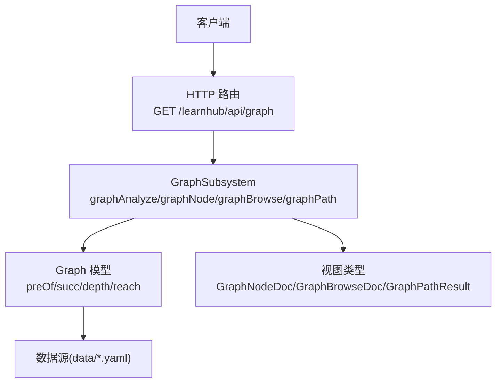
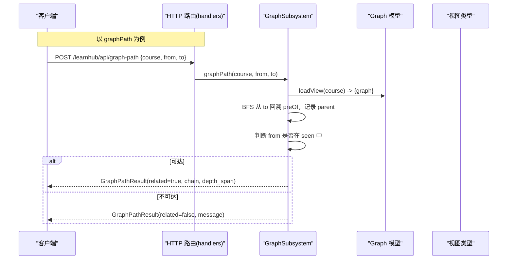
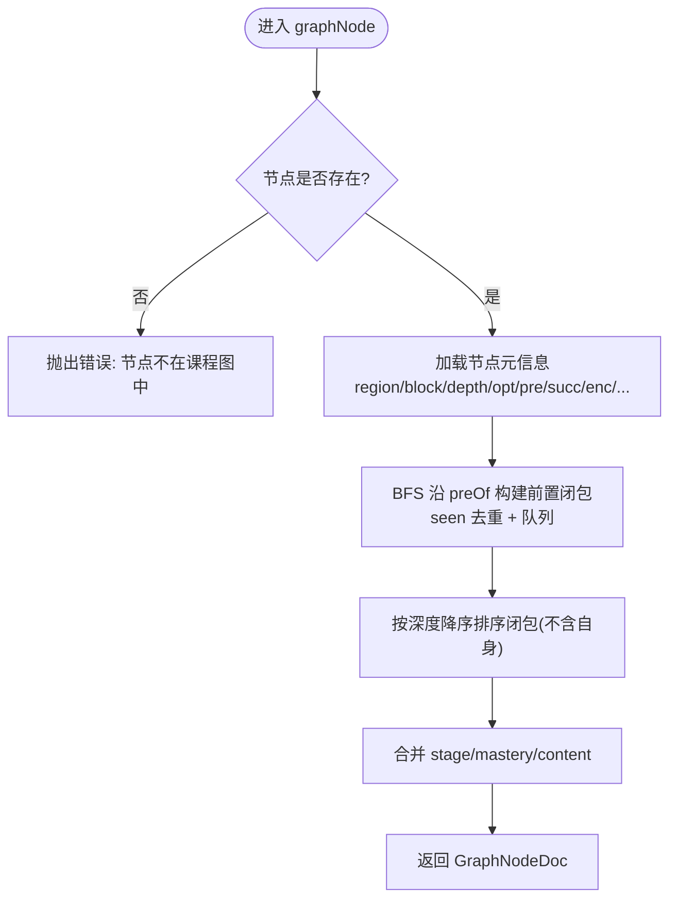
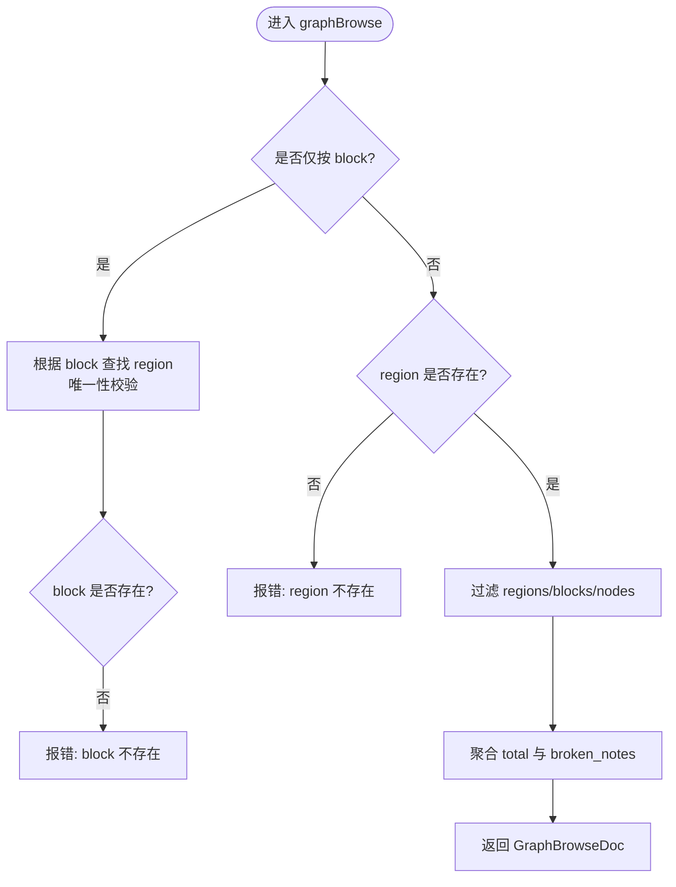
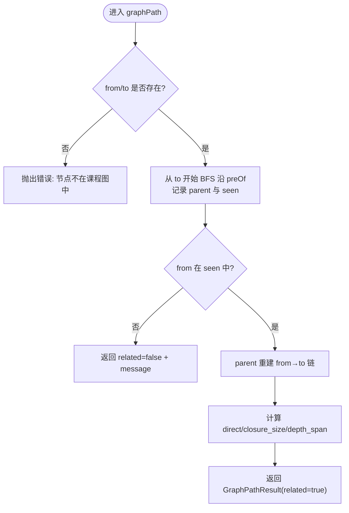
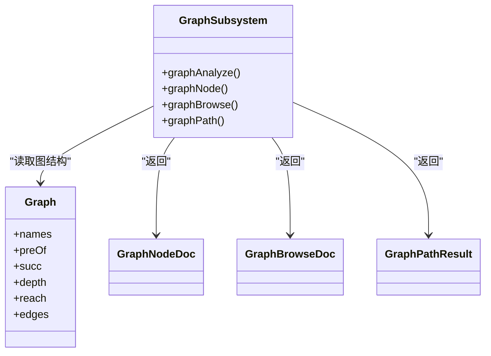

# 图谱探索浏览

<cite>
**本文引用的文件**
- [graph-subsystem.ts](file://src/engine/graph-subsystem.ts)
- [views/graph.ts](file://src/engine/views/graph.ts)
- [graph.ts](file://src/engine/graph.ts)
- [handlers.ts](file://src/host/handlers.ts)
- [route-table.ts](file://src/host/route-table.ts)
- [types.ts](file://src/engine/types.ts)
- [graph-load.test.ts](file://tests/graph-load.test.ts)
</cite>

## 目录
1. [简介](#简介)
2. [项目结构](#项目结构)
3. [核心组件](#核心组件)
4. [架构总览](#架构总览)
5. [详细组件分析](#详细组件分析)
6. [依赖关系分析](#依赖关系分析)
7. [性能考量](#性能考量)
8. [故障排查指南](#故障排查指南)
9. [结论](#结论)
10. [附录：API 使用示例](#附录api-使用示例)

## 简介
本文件面向“图谱探索浏览”能力，聚焦以下目标：
- 深入解释 graphNode 方法：单节点详情查询、前置传递闭包计算与邻域关系分析。
- 详细说明 graphBrowse 方法：区域浏览（按区名/块名过滤）、节点清单生成与状态聚合。
- 解释 graphPath 方法：路径查询算法（BFS 遍历、父子关系重建、深度跨度计算）。
- 描述数据结构：GraphNodeDoc、GraphBrowseDoc、GraphPathResult 的字段含义。
- 说明错误处理与边界情况：节点不存在、路径不可达等提示策略。
- 提供具体 API 调用示例，覆盖节点查询、区域浏览与路径分析。

## 项目结构
图谱探索浏览由“宿主路由层 → 引擎子系统 → 图模型与视图类型”三层组成：
- 宿主路由层：暴露 HTTP 接口，负责参数解析与结果序列化。
- 引擎子系统：实现 graphNode、graphBrowse、graphPath 等核心逻辑。
- 图模型与视图类型：定义 Graph、GraphDoc、GraphNodeDoc、GraphBrowseDoc、GraphPathResult 等数据结构。

图表来源
- [handlers.ts:134-137](file://src/host/handlers.ts#L134-L137)
- [graph-subsystem.ts:88-117](file://src/engine/graph-subsystem.ts#L88-L117)
- [graph.ts:278-397](file://src/engine/graph.ts#L278-L397)

章节来源
- [handlers.ts:134-137](file://src/host/handlers.ts#L134-L137)
- [route-table.ts:1-75](file://src/host/route-table.ts#L1-L75)

## 核心组件
- GraphSubsystem：封装图谱相关能力，包括 analyze、node、browse、path、提案与回填等。
- Graph：图模型，维护节点集合、邻接表、拓扑序、深度、可达集、连通分量等。
- 视图类型：定义对外返回的数据结构，如 GraphNodeDoc、GraphBrowseDoc、GraphPathResult。

章节来源
- [graph-subsystem.ts:78-117](file://src/engine/graph-subsystem.ts#L78-L117)
- [graph.ts:278-397](file://src/engine/graph.ts#L278-L397)
- [views/graph.ts:54-137](file://src/engine/views/graph.ts#L54-L137)

## 架构总览
下图展示从请求到响应的完整流程，涵盖 graphNode、graphBrowse、graphPath 三个入口。

图表来源
- [graph-subsystem.ts:375-404](file://src/engine/graph-subsystem.ts#L375-L404)
- [graph.ts:278-397](file://src/engine/graph.ts#L278-L397)

章节来源
- [graph-subsystem.ts:375-404](file://src/engine/graph-subsystem.ts#L375-L404)
- [graph.ts:278-397](file://src/engine/graph.ts#L278-L397)

## 详细组件分析

### graphNode：单节点详情查询、前置传递闭包与邻域分析
- 功能要点
  - 校验节点存在性，若不存在抛出错误。
  - 读取节点所在区/块、深度、opt、直接前置 pre、直接后继 succ。
  - 读取 enc 边（含 note）、est、type、bloom、difficulty、teaches/assumes/misconceptions、note。
  - 计算前置传递闭包：沿 preOf 进行 BFS，排除自身并按深度降序排序（先学在前）。
  - 合并学习阶段 stage、掌握度 mastery、内容版本/状态 content。
- 复杂度
  - 时间：O(V+E) 其中 V 为节点数，E 为 pre 边总数；BFS 遍历前置闭包。
  - 空间：O(V) 用于 seen 集合与队列。
- 错误与边界
  - 节点不在课程图中：抛出明确错误信息。
  - 缺失可选字段时采用缺省值（如 opt=false、enc=[]）。

图表来源
- [graph-subsystem.ts:267-311](file://src/engine/graph-subsystem.ts#L267-L311)
- [graph.ts:278-397](file://src/engine/graph.ts#L278-L397)

章节来源
- [graph-subsystem.ts:267-311](file://src/engine/graph-subsystem.ts#L267-L311)
- [views/graph.ts:175-202](file://src/engine/views/graph.ts#L175-L202)

### graphBrowse：区域浏览（按区名/块名过滤）
- 功能要点
  - 支持仅按 block 推断 region；当 block 不唯一或不存在时报错。
  - 支持按 region 和 block 双重过滤。
  - 生成节点清单：每个节点包含 node、depth、stage、est、difficulty、type、content_status。
  - 统计 total 并显式暴露 broken_notes（不伪装成 unseen/draft）。
- 复杂度
  - 时间：O(R+B+N)，R 为区数，B 为块数，N 为节点总数。
  - 空间：O(N) 用于输出列表。
- 错误与边界
  - 仅按块浏览时块不存在：列出可用块。
  - 块不唯一：要求加 region 限定。
  - 指定 region 不存在：列出可用区。
  - 指定 region 下无该 block：列出该区内可用块。

图表来源
- [graph-subsystem.ts:314-372](file://src/engine/graph-subsystem.ts#L314-L372)
- [views/graph.ts:54-75](file://src/engine/views/graph.ts#L54-L75)

章节来源
- [graph-subsystem.ts:314-372](file://src/engine/graph-subsystem.ts#L314-L372)
- [views/graph.ts:54-75](file://src/engine/views/graph.ts#L54-L75)

### graphPath：路径查询（BFS、父子关系重建、深度跨度）
- 功能要点
  - 校验 from/to 均在课程图中。
  - 从 to 出发沿 preOf 做 BFS，记录 parent 映射与 seen 集合。
  - 若 from 不在 seen 中，返回 related=false 与提示信息。
  - 否则通过 parent 重建 from→to 的前置链（先学在前），并计算 direct（一步可达）与 depth_span（深度差）。
- 复杂度
  - 时间：O(V+E) BFS 遍历前置闭包。
  - 空间：O(V) 用于 seen 与 parent。
- 错误与边界
  - from/to 不在课程图中：抛出错误。
  - 不可达：返回 related=false 与 message。

图表来源
- [graph-subsystem.ts:375-404](file://src/engine/graph-subsystem.ts#L375-L404)
- [graph.ts:278-397](file://src/engine/graph.ts#L278-L397)

章节来源
- [graph-subsystem.ts:375-404](file://src/engine/graph-subsystem.ts#L375-L404)
- [views/graph.ts:216-241](file://src/engine/views/graph.ts#L216-L241)

### 数据结构说明
- GraphNodeDoc（单节点详情）
  - course/node/region/block/depth/opt/pre/succ/enc/est/type/bloom/difficulty/teaches/assumes/misconceptions/note/stage/mastery/content/prereq_closure。
  - prereq_closure：不含自身，按深度降序（先学在前）。
- GraphBrowseDoc（区域浏览）
  - course/total/regions/broken_notes。
  - regions 内嵌套 blocks 与 nodes，nodes 包含 node/depth/stage/est/difficulty/type/content_status。
- GraphPathResult（路径查询）
  - 联合类型：related=true 时为 GraphPathRelatedResult（direct/closure_size/chain/depth_span）；related=false 时为 GraphPathUnrelatedResult（message）。

章节来源
- [views/graph.ts:54-75](file://src/engine/views/graph.ts#L54-L75)
- [views/graph.ts:175-202](file://src/engine/views/graph.ts#L175-L202)
- [views/graph.ts:216-241](file://src/engine/views/graph.ts#L216-L241)

## 依赖关系分析
- GraphSubsystem 依赖 Graph 模型提供的 preOf/succ/depth/reach 等派生结构。
- Graph 模型从 data/*.yaml 加载并构造邻接表、拓扑序、深度、可达集等。
- 视图类型作为对外契约，确保返回结构稳定。

图表来源
- [graph-subsystem.ts:78-117](file://src/engine/graph-subsystem.ts#L78-L117)
- [graph.ts:278-397](file://src/engine/graph.ts#L278-L397)
- [views/graph.ts:54-137](file://src/engine/views/graph.ts#L54-L137)

章节来源
- [graph-subsystem.ts:78-117](file://src/engine/graph-subsystem.ts#L78-L117)
- [graph.ts:278-397](file://src/engine/graph.ts#L278-L397)
- [views/graph.ts:54-137](file://src/engine/views/graph.ts#L54-L137)

## 性能考量
- graphNode：前置闭包 BFS 时间 O(V+E)，适合中等规模课程；对大图可考虑缓存闭包结果。
- graphBrowse：线性扫描 regions/blocks/nodes，时间 O(R+B+N)，内存 O(N)；可按需分页或限制返回数量。
- graphPath：BFS 时间 O(V+E)，空间 O(V)；对于频繁查询可缓存 preOf 子图或结果。
- 建议
  - 对高频查询增加本地缓存（如 LRU）。
  - 对大图浏览增加分页与过滤优化。
  - 避免重复计算闭包，可在 Graph 层预计算常用闭包。

[本节为通用指导，无需特定文件引用]

## 故障排查指南
- 节点不存在
  - graphNode/graphPath 会抛出错误，提示节点不在课程图中。
  - 排查：确认课程键与节点名是否正确；检查 data/*.yaml 是否包含该节点。
- 路径不可达
  - graphPath 返回 related=false 与 message；排查 from 是否确为 to 的前置。
- 区域/块不存在或不唯一
  - graphBrowse 会列出可用区/块并要求补充 region；排查输入参数与图结构。
- 数据目录异常
  - 若 data 目录不存在或为空，GraphStore.load 会分别报因；参考测试用例定位问题。

章节来源
- [graph-subsystem.ts:267-311](file://src/engine/graph-subsystem.ts#L267-L311)
- [graph-subsystem.ts:314-372](file://src/engine/graph-subsystem.ts#L314-L372)
- [graph-subsystem.ts:375-404](file://src/engine/graph-subsystem.ts#L375-L404)
- [graph-load.test.ts:13-30](file://tests/graph-load.test.ts#L13-L30)

## 结论
图谱探索浏览通过 graphNode、graphBrowse、graphPath 三个方法，提供了从单节点到区域再到路径的多粒度查询能力。其核心在于基于 Graph 模型的 preOf/succ/depth/reach 等派生结构，结合严格的错误处理与清晰的视图类型契约，确保查询结果准确、可解释且易于前端消费。

[本节为总结，无需特定文件引用]

## 附录：API 使用示例
以下为常见调用方式（以 JSON 请求体为例）：

- 节点详情查询（graphNode）
  - 请求
    - 方法：POST
    - 路径：/learnhub/api/graph-node
    - 主体：{ "course": "课程名", "node": "节点名" }
  - 响应：GraphNodeDoc
  - 注意：若节点不存在将返回错误。

- 区域浏览（graphBrowse）
  - 请求
    - 方法：POST
    - 路径：/learnhub/api/graph-browse
    - 主体：{ "course": "课程名", "region": "区名", "block": "块名" }（region/block 均可选）
  - 响应：GraphBrowseDoc
  - 注意：仅按 block 时需保证唯一；否则会提示加 region 限定。

- 路径查询（graphPath）
  - 请求
    - 方法：POST
    - 路径：/learnhub/api/graph-path
    - 主体：{ "course": "课程名", "from": "起点节点", "to": "终点节点" }
  - 响应：GraphPathResult
  - 注意：若 from 不在 to 的前置闭包内，返回 related=false 与 message。

说明
- 上述路由为概念示例；实际路由请以宿主路由表为准。
- 所有错误均会返回明确的错误消息，便于定位问题。

[本节为概念性示例，无需特定文件引用]