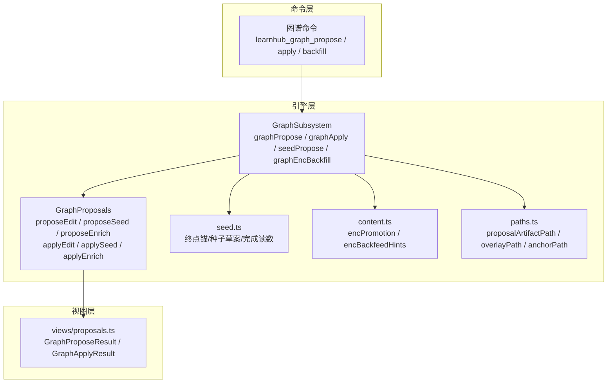
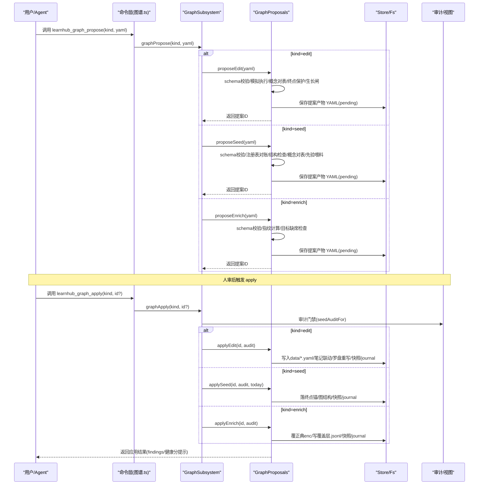
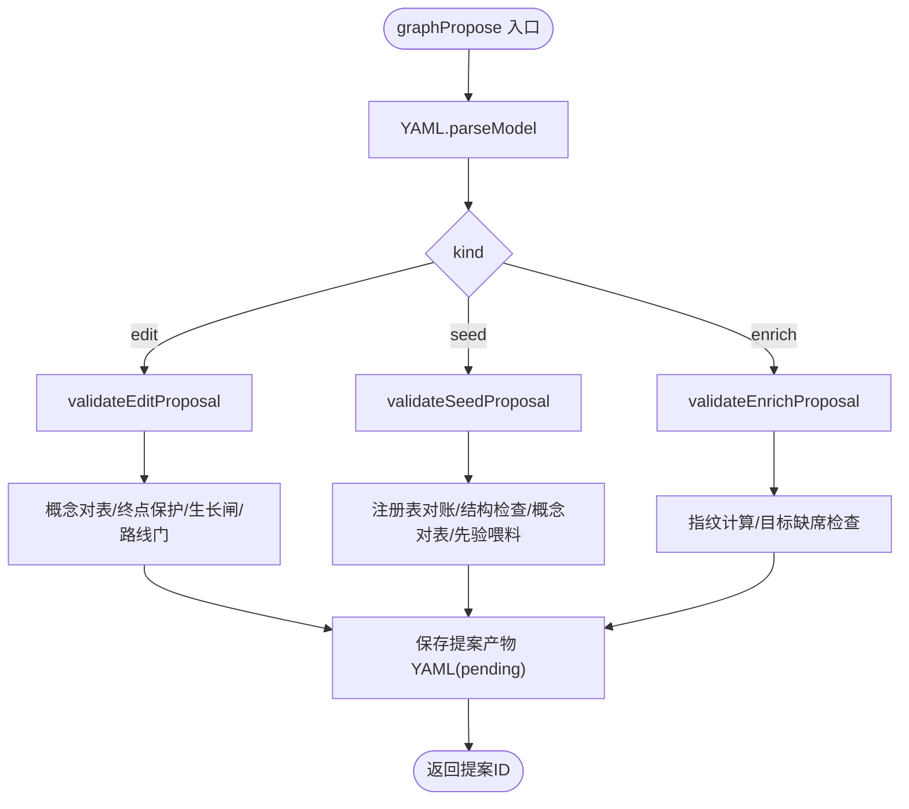
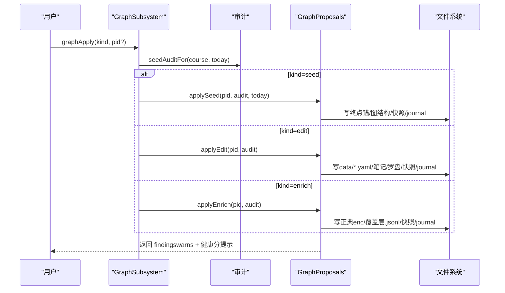
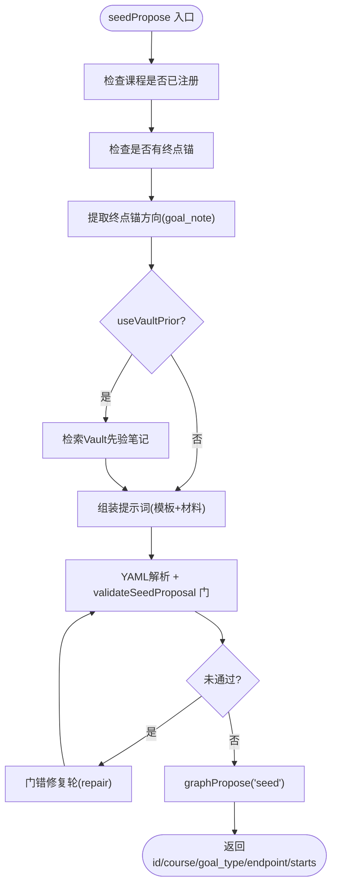
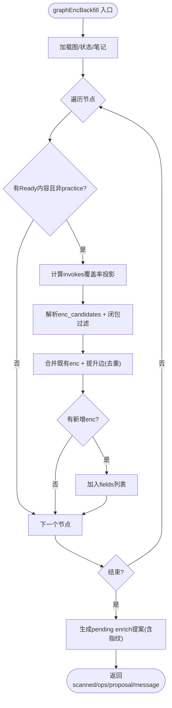
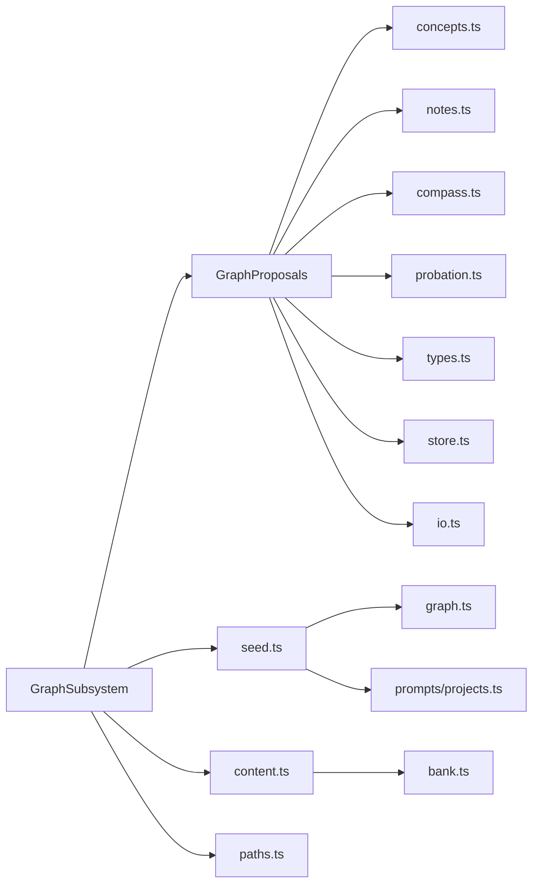

# 图谱提案管理

<cite>
**本文引用的文件**
- [graph-subsystem.ts](file://src/engine/graph-subsystem.ts)
- [proposals.ts](file://src/engine/proposals.ts)
- [seed.ts](file://src/engine/seed.ts)
- [content.ts](file://src/engine/content.ts)
- [views/proposals.ts](file://src/engine/views/proposals.ts)
- [paths.ts](file://src/engine/paths.ts)
- [图谱.ts](file://src/commands/图谱.ts)
- [enrich-proposal.test.ts](file://tests/enrich-proposal.test.ts)
</cite>

## 目录
1. [简介](#简介)
2. [项目结构](#项目结构)
3. [核心组件](#核心组件)
4. [架构总览](#架构总览)
5. [详细组件分析](#详细组件分析)
6. [依赖关系分析](#依赖关系分析)
7. [性能考量](#性能考量)
8. [故障排查指南](#故障排查指南)
9. [结论](#结论)
10. [附录：使用示例与最佳实践](#附录使用示例与最佳实践)

## 简介
本系统提供“图谱提案”机制，用于在受控、可审计、可回滚的前提下对课程图进行变更。提案分为三类：
- edit（变更）：对现有图结构的增删改操作（add_node/del_node/set_pre/set_enc/rename/move/set_note），适合日常微调、修复断边、调整难度等。
- seed（种子）：为已注册课程起草结构（起点+终点+粗占位边），一次人审即开工，不创建课程；方向由“终点锚”决定。
- enrich（覆盖层回填）：基于内容就绪与题目 invokes 覆盖率投影，批量补写 enc（成分技能边），以覆盖层通道落盘并留痕。

所有提案遵循统一生命周期：YAML 产出 → schema 校验 → 结构检查 → 落盘 pending → 人审 → apply 过审计门禁生效 → journal + 快照。拒绝同样留痕。

## 项目结构
围绕图谱提案的核心代码分布在引擎层与命令层：
- 命令层暴露对外工具/路由（如 learnhub_graph_propose / learnhub_graph_apply / learnhub_graph_enc_backfill）。
- 引擎层实现提案受理、应用、回填、存储与审计门禁。
- 视图层定义提案结果类型，供上层消费。

图表来源
- [图谱.ts:99-160](file://src/commands/图谱.ts#L99-L160)
- [graph-subsystem.ts:406-429](file://src/engine/graph-subsystem.ts#L406-L429)
- [proposals.ts:495-605](file://src/engine/proposals.ts#L495-L605)
- [seed.ts:256-410](file://src/engine/seed.ts#L256-L410)
- [content.ts:1223-1236](file://src/engine/content.ts#L1223-L1236)
- [paths.ts:123-140](file://src/engine/paths.ts#L123-L140)
- [views/proposals.ts:7-38](file://src/engine/views/proposals.ts#L7-L38)

章节来源
- [图谱.ts:99-160](file://src/commands/图谱.ts#L99-L160)
- [graph-subsystem.ts:406-429](file://src/engine/graph-subsystem.ts#L406-L429)

## 核心组件
- GraphSubsystem：统一入口，负责 kind 分发、审计门禁、调用具体 apply 分支。
- GraphProposals：提案全生命周期（受理/应用/拒绝），包含三种类型的 schema 校验、结构检查、概念对表、写入单元与日志。
- Seed 模块：终点锚容器读写、种子草案 schema、完成读数折叠、交汇节点派生。
- Content 模块：enc 提升算法（候选解析→闭包内过滤→invokes 投影权重）、enc 建议生成。
- Paths：提案产物路径、覆盖层留痕路径、终点锚路径。
- Views：提案结果类型定义，供 UI/宿主消费。

章节来源
- [graph-subsystem.ts:406-429](file://src/engine/graph-subsystem.ts#L406-L429)
- [proposals.ts:495-605](file://src/engine/proposals.ts#L495-L605)
- [seed.ts:256-410](file://src/engine/seed.ts#L256-L410)
- [content.ts:1223-1236](file://src/engine/content.ts#L1223-L1236)
- [paths.ts:123-140](file://src/engine/paths.ts#L123-L140)
- [views/proposals.ts:7-38](file://src/engine/views/proposals.ts#L7-L38)

## 架构总览
下图展示从命令到引擎再到存储的完整调用链，以及三种提案类型的分流与落地位置。

图表来源
- [图谱.ts:99-160](file://src/commands/图谱.ts#L99-L160)
- [graph-subsystem.ts:406-429](file://src/engine/graph-subsystem.ts#L406-L429)
- [proposals.ts:559-605](file://src/engine/proposals.ts#L559-L605)
- [proposals.ts:920-933](file://src/engine/proposals.ts#L920-L933)
- [proposals.ts:1401-1417](file://src/engine/proposals.ts#L1401-L1417)
- [paths.ts:123-140](file://src/engine/paths.ts#L123-L140)

## 详细组件分析

### 三种提案类型的设计理念与适用场景
- edit（变更）
  - 理念：最小化、原子化的图结构变更，支持 add_node/del_node/set_pre/set_enc/rename/move/set_note。
  - 适用：修复断边、调整难度/预估时长、移动节点、重命名、批内重写罗盘（仅随生长批）。
  - 关键约束：set_pre/set_enc 整体替换语义必须显式传数组；概念字段组只在 add_node 出生时携带；主线批必接线（前进/换向含新节点时必须声明 target_endpoints 并完成接线覆盖）。
- seed（种子）
  - 理念：为已注册课程“起草结构”，不创建课程；起点1–3个，终点1个，带粗占位边（终点.pre=起点），零 enc/est。
  - 适用：新课程的初始坡道搭建；方向来自“终点锚”的 goal_note（人是权威）。
  - 关键约束：课程必须已注册；覆盖锚定必须带非空块工作表；一次人审即开工。
- enrich（覆盖层回填）
  - 理念：基于内容就绪与题目 invokes 覆盖率投影，批量补写 enc；采用覆盖层通道，只读正典、追加留痕。
  - 适用：已有 Ready 内容的节点，其正文或题库 invokes 暗示了前置技能关系，但尚未落 enc。
  - 关键约束：每条字段条目是整段 enc 的全量替换；指纹（sha256）锚定正典版本，apply 时复核，不符拒收。

章节来源
- [proposals.ts:42-118](file://src/engine/proposals.ts#L42-L118)
- [proposals.ts:126-341](file://src/engine/proposals.ts#L126-L341)
- [proposals.ts:404-483](file://src/engine/proposals.ts#L404-L483)
- [seed.ts:256-410](file://src/engine/seed.ts#L256-L410)
- [graph-subsystem.ts:560-616](file://src/engine/graph-subsystem.ts#L560-L616)

### graphPropose 方法处理流程（提案验证、YAML解析、存储）
- 入口分发：graphPropose(kind, yamlText) 根据 kind 路由至 proposeEdit/proposeSeed/proposeEnrich。
- YAML 解析与 schema 校验：
  - edit：validateEditProposal，严格校验 ops、note（生长批）、route（仅生长批）、概念字段组、键名统一（name/node 纪律）。
  - seed：validateSeedProposal，校验 course/goal_type/endpoint/starts/worksheet/concepts/reason，起点上限3条，覆盖锚定强制 worksheet。
  - enrich：validateEnrichProposal，校验 fields 列表、node/enc 必填、去重、fingerprints（引擎受理时写入，手工填会报错）。
- 业务门：
  - 概念引用对表（teaches/assumes/误解必须命中登记表或铸名块）。
  - 终点锚保护（edit 不得直改锚定点；主线批必接线）。
  - 生长闸门（插入积极性调速，#146）。
  - 路线门（罗盘重写预检）。
- 存储：saveArtifact 将 YAML 持久化为 proposal 产物文件，并登记 pending 记录。

图表来源
- [graph-subsystem.ts:406-412](file://src/engine/graph-subsystem.ts#L406-L412)
- [proposals.ts:559-605](file://src/engine/proposals.ts#L559-L605)
- [proposals.ts:920-933](file://src/engine/proposals.ts#L920-L933)
- [proposals.ts:1401-1417](file://src/engine/proposals.ts#L1401-L1417)
- [paths.ts:123-126](file://src/engine/paths.ts#L123-L126)

章节来源
- [graph-subsystem.ts:406-412](file://src/engine/graph-subsystem.ts#L406-L412)
- [proposals.ts:559-605](file://src/engine/proposals.ts#L559-L605)
- [proposals.ts:920-933](file://src/engine/proposals.ts#L920-L933)
- [proposals.ts:1401-1417](file://src/engine/proposals.ts#L1401-L1417)

### graphApply 方法的执行逻辑（审计门禁、提案应用、回滚机制）
- 审计门禁：graphApply(kind, pid) 通过 seedAuditFor 获取审计快照（ok/warns/health），若存在 ERROR 则拒绝写入。
- 按 kind 分流：
  - seed：applySeed 落盘终点锚（仅在名称空闲时追加，不触碰既有锚）、图结构、快照、journal。
  - edit：applyEdit 概念复验、模拟执行二次校验、终点保护复验、巩固门复验、写入单元顺序执行（铸名→图区重写→终点 sealed 维护→笔记联动→罗盘重写→边实验账本→快照→journal）。
  - enrich：applyEnrich 指纹复核（任一正典文件 sha256 不符即拒收 stale 提案），然后写正典 enc（整体替换）、写覆盖层留痕、快照、journal。
- 回滚机制：
  - 写入单元失败上抛中止，不回滚不续跑；失败不写 journal；重放被 takePending/simulateOps 门拦住。
  - 拒绝（reject）同样留痕（status=rejected），便于回溯。

图表来源
- [graph-subsystem.ts:415-429](file://src/engine/graph-subsystem.ts#L415-L429)
- [proposals.ts:686-800](file://src/engine/proposals.ts#L686-L800)
- [proposals.ts:1401-1417](file://src/engine/proposals.ts#L1401-L1417)
- [paths.ts:128-140](file://src/engine/paths.ts#L128-L140)

章节来源
- [graph-subsystem.ts:415-429](file://src/engine/graph-subsystem.ts#L415-L429)
- [proposals.ts:686-800](file://src/engine/proposals.ts#L686-L800)
- [proposals.ts:1401-1417](file://src/engine/proposals.ts#L1401-L1417)

### seedPropose 的种子起草流程（课程注册检查、终点验证、方向提取、AI提示词组装）
- 课程注册检查：course 必须已在注册表中，否则指引先建课。
- 终点验证：课程必须有至少一个终点锚，否则无法起草（方向由终点锚表达）。
- 方向提取：读取终点锚集合，goal_note 作为唯一方向输入（goal 字段已退役）。
- Vault 先验选配（可选）：检索学习者个人 Vault 中与方向相关的笔记摘录，辅助起点定位（熟悉边界）。
- 提示词组装：模板与材料分离，材料在前、契约在后；必要时进入“门错修复轮”（gateRepairRound），自动修复一轮仍未通过则拒绝受理。
- 提交受理：将最终 spec 转为 YAML 字符串，调用 graphPropose('seed', ...) 进入标准受理流程。

图表来源
- [graph-subsystem.ts:445-524](file://src/engine/graph-subsystem.ts#L445-L524)
- [seed.ts:613-634](file://src/engine/seed.ts#L613-L634)
- [proposals.ts:920-933](file://src/engine/proposals.ts#L920-L933)

章节来源
- [graph-subsystem.ts:445-524](file://src/engine/graph-subsystem.ts#L445-L524)
- [seed.ts:613-634](file://src/engine/seed.ts#L613-L634)

### enc 覆盖层回填 graphEncBackfill（内容就绪检查、invokes投影计算、enc边提升算法）
- 内容就绪检查：遍历图节点，跳过无就绪内容或 practice 型节点。
- invokes 投影计算：对每个节点加载题库，计算 invokes 覆盖率投影（该前置被 invokes 的题数份额），得到候选边的权重与 note。
- enc 边提升算法：
  - 解析正文中的 enc_candidates 调用点，解析回图节点名。
  - 仅接受在本节点 pre 传递闭包内的候选（isAncestor），保证 enc 契约（E7）。
  - 权重 = invokes 覆盖率投影；若无 invokes 数据，落 schema 缺省权重 1。
  - 合并既有声明 enc（保留原形态）与新增提升边，去重后形成目标 enc。
- 提案生成：为每个需要回填的节点生成一条字段条目，批量打包为一个 pending enrich 提案，附带受影响正典文件的 sha256 指纹。
- 可重入性：已全覆盖节点不产生条目，重跑不会重复膨胀、不与已声明 enc 冲突。

图表来源
- [graph-subsystem.ts:560-616](file://src/engine/graph-subsystem.ts#L560-L616)
- [content.ts:1223-1236](file://src/engine/content.ts#L1223-L1236)
- [proposals.ts:404-483](file://src/engine/proposals.ts#L404-L483)

章节来源
- [graph-subsystem.ts:560-616](file://src/engine/graph-subsystem.ts#L560-L616)
- [content.ts:1223-1236](file://src/engine/content.ts#L1223-L1236)

## 依赖关系分析
- GraphSubsystem 依赖 GraphProposals、seed、content、paths、store、registry、fs。
- GraphProposals 依赖 concepts、notes、compass、probation、types、paths、store、io。
- seed 依赖 concepts、graph、srs、prompt-assembly、prompts/projects。
- content 依赖 graph、bank。
- paths 提供统一的文件路径约定（提案产物、覆盖层留痕、终点锚、边实验账本）。

图表来源
- [graph-subsystem.ts:406-429](file://src/engine/graph-subsystem.ts#L406-L429)
- [proposals.ts:495-605](file://src/engine/proposals.ts#L495-L605)
- [seed.ts:256-410](file://src/engine/seed.ts#L256-L410)
- [content.ts:1223-1236](file://src/engine/content.ts#L1223-L1236)
- [paths.ts:123-140](file://src/engine/paths.ts#L123-L140)

章节来源
- [graph-subsystem.ts:406-429](file://src/engine/graph-subsystem.ts#L406-L429)
- [proposals.ts:495-605](file://src/engine/proposals.ts#L495-L605)

## 性能考量
- 受理阶段：schema 校验与结构检查在内存图上进行，避免频繁 IO；概念对表与终点保护为 O(n) 扫描。
- 回填阶段：enc 提升按节点遍历，invokes 投影需加载题库，注意批量调用与缓存；已全覆盖节点快速跳过。
- 应用阶段：写入单元顺序执行，失败中止不回滚；journal 与快照追加开销较小。
- 建议：对大课程启用增量回填（按区域/块分批），减少单次负载；合理设置 useVaultPrior 以避免过度检索。

[本节为通用指导，无需特定文件来源]

## 故障排查指南
- 提案未受理
  - 检查 YAML schema 错误（字段缺失/非法值/未知字段）。
  - 检查概念引用是否在登记表命中（或铸名块中）。
  - 检查主线批是否声明 target_endpoints 并完成接线覆盖。
- 应用被拒
  - 审计存在 ERROR：先处理审计报告再 apply。
  - enrich 指纹不符：正典文件被修改，重新生成提案。
  - 种子课程未注册或零终点：先建课并添加终点。
- 回填无变化
  - 节点无就绪内容或为 practice 类型；或候选/投影为空；或已全部覆盖。
- 常见错误行定位
  - 参考测试用例中的断言信息，对照错误行修正 YAML。

章节来源
- [enrich-proposal.test.ts:29-52](file://tests/enrich-proposal.test.ts#L29-L52)
- [proposals.ts:126-341](file://src/engine/proposals.ts#L126-L341)
- [proposals.ts:404-483](file://src/engine/proposals.ts#L404-L483)
- [graph-subsystem.ts:415-429](file://src/engine/graph-subsystem.ts#L415-L429)

## 结论
本系统通过“提案—人审—应用”的闭环，确保图谱变更的可审计、可回滚与一致性。三种提案类型各司其职：edit 精细调参、seed 快速搭桥、enrich 智能回填。结合审计门禁、写入单元与留痕机制，既保障质量又提升效率。

[本节为总结，无需特定文件来源]

## 附录：使用示例与最佳实践
以下示例以“如何创建、审核和应用不同类型的图谱提案”为主线，给出步骤与要点（不直接粘贴代码，路径指向源码与测试以便查阅）。

- 创建 edit 提案
  - 准备 YAML：包含 course、ops（如 set_pre/set_enc/add_node 等），必要时携带 note（生长批）或 route（仅生长批）。
  - 调用 learnhub_graph_propose(kind='edit', yaml)。
  - 人审通过后调用 learnhub_graph_apply(kind='edit', id)。
  - 参考路径：
    - [图谱.ts:236-248](file://src/commands/图谱.ts#L236-L248)
    - [proposals.ts:559-605](file://src/engine/proposals.ts#L559-L605)
    - [proposals.ts:686-800](file://src/engine/proposals.ts#L686-L800)

- 创建 seed 提案
  - 准备 YAML：course、goal_type、endpoint、starts（1–3）、worksheet（coverage 时必填）、concepts（可选）。
  - 调用 learnhub_graph_propose(kind='seed', yaml)。
  - 人审通过后调用 learnhub_graph_apply(kind='seed', id)。
  - 参考路径：
    - [seed.ts:256-410](file://src/engine/seed.ts#L256-L410)
    - [graph-subsystem.ts:445-524](file://src/engine/graph-subsystem.ts#L445-L524)
    - [graph-subsystem.ts:415-429](file://src/engine/graph-subsystem.ts#L415-L429)

- 创建 enrich 提案（覆盖层回填）
  - 调用 learnhub_graph_enc_backfill(course?) 自动生成 pending enrich 提案（含指纹）。
  - 人审通过后调用 learnhub_graph_apply(kind='enrich', id)。
  - 参考路径：
    - [图谱.ts:132-153](file://src/commands/图谱.ts#L132-L153)
    - [graph-subsystem.ts:560-616](file://src/engine/graph-subsystem.ts#L560-L616)
    - [proposals.ts:1401-1417](file://src/engine/proposals.ts#L1401-L1417)

- 最佳实践
  - 始终先运行审计，处理 ERROR 后再 apply。
  - seed 阶段明确方向（终点锚 goal_note），避免模型自拟方向。
  - enrich 回填前确认内容就绪与 invokes 数据可用；重跑幂等安全。
  - 对大课程分批回填，控制单次负载。

[本节为实践指导，无需特定文件来源]