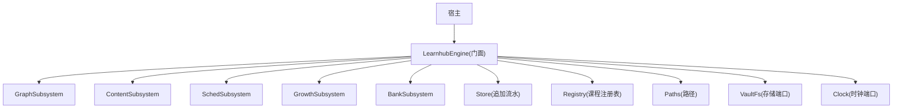
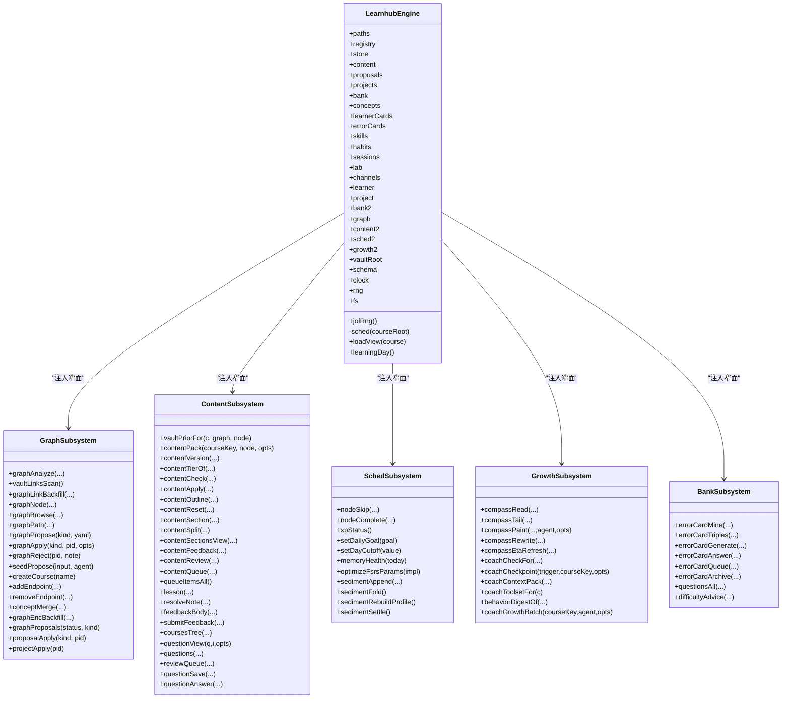
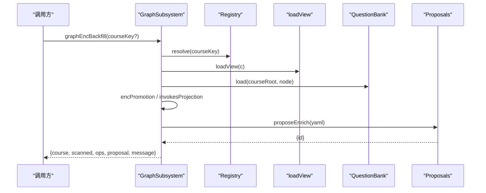
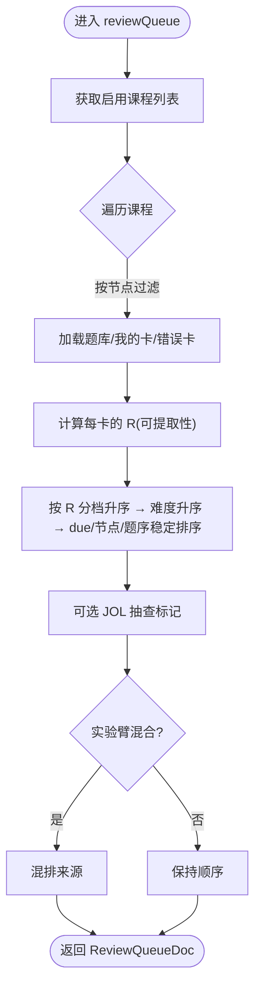
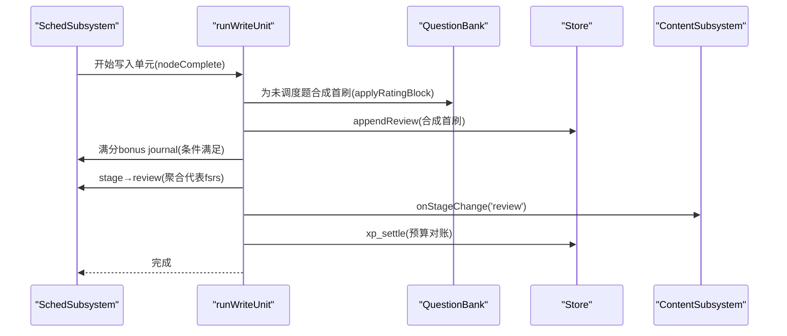
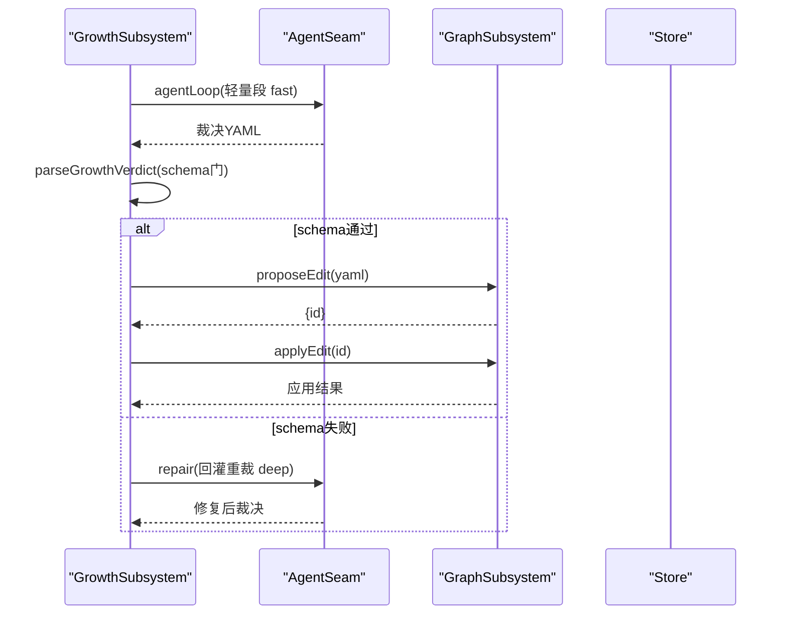
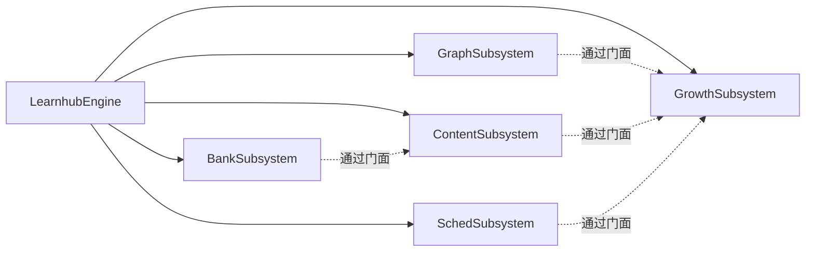

# 子系统架构

<cite>
**本文引用的文件**
- [src/engine/index.ts](file://src/engine/index.ts)
- [src/engine/graph-subsystem.ts](file://src/engine/graph-subsystem.ts)
- [src/engine/content-subsystem.ts](file://src/engine/content-subsystem.ts)
- [src/engine/sched-subsystem.ts](file://src/engine/sched-subsystem.ts)
- [src/engine/growth-subsystem.ts](file://src/engine/growth-subsystem.ts)
- [src/engine/question-bank.ts](file://src/engine/question-bank.ts)
- [src/engine/types.ts](file://src/engine/types.ts)
- [tests/import-rules.test.ts](file://tests/import-rules.test.ts)
</cite>

## 目录
1. [简介](#简介)
2. [项目结构](#项目结构)
3. [核心组件](#核心组件)
4. [架构总览](#架构总览)
5. [详细组件分析](#详细组件分析)
6. [依赖关系分析](#依赖关系分析)
7. [性能考量](#性能考量)
8. [故障排查指南](#故障排查指南)
9. [结论](#结论)
10. [附录：扩展新子系统的步骤](#附录扩展新子系统的步骤)

## 简介
本文件系统性阐述 LearnHub 引擎的子系统架构与协作方式，聚焦 GraphSubsystem、ContentSubsystem、SchedSubsystem、GrowthSubsystem、BankSubsystem 的职责边界、依赖注入机制、通信模式、生命周期管理，以及如何在现有门面中扩展新的子系统。文档以代码级事实为依据，配合图示帮助读者理解模块间的装配与数据流。

## 项目结构
LearnHub 引擎采用“门面 + 领域子系统”的分层组织：
- 门面（LearnhubEngine）集中装配所有子系统与共享基础设施（注册表、存储、路径、调度器缓存等），并通过窄面接口向各子系统注入依赖。
- 每个子系统类封装一个领域的完整能力，内部可自由 import 领域函数/类型，跨子系统调用通过门面回引，避免环依赖。
- 宿主仅通过门面访问引擎能力；engine 内部禁止反向引用门面（R6）。

图表来源
- [src/engine/index.ts:212-397](file://src/engine/index.ts#L212-L397)

章节来源
- [src/engine/index.ts:1-147](file://src/engine/index.ts#L1-L147)
- [tests/import-rules.test.ts:1-52](file://tests/import-rules.test.ts#L1-L52)

## 核心组件
- GraphSubsystem（图域）：图谱分析、Vault 链接先验、图探索、提案门禁包装、enc 覆盖层回填、种子起草与终点管理。
- ContentSubsystem（内容管线）：笔记上下文组装、生成落盘门、大纲/节清单、题库树、复习队列、作答与反馈。
- SchedSubsystem（调度域）：节点跳过/完成确认、XP 时间账本、记忆健康仪表盘、FSRS 参数优化、沉淀层读写。
- GrowthSubsystem（滚动教练域）：罗盘读取/绘制/ETA、教练回合上下文包、生长批受理、边实验账本与复诊。
- BankSubsystem（题库域）：错误对比卡、题目管理、难度感知回流、一键清理、勘误冲正。

章节来源
- [src/engine/graph-subsystem.ts:1-78](file://src/engine/graph-subsystem.ts#L1-L78)
- [src/engine/content-subsystem.ts:1-102](file://src/engine/content-subsystem.ts#L1-L102)
- [src/engine/sched-subsystem.ts:1-84](file://src/engine/sched-subsystem.ts#L1-L84)
- [src/engine/growth-subsystem.ts:1-92](file://src/engine/growth-subsystem.ts#L1-L92)
- [src/engine/question-bank.ts:455-514](file://src/engine/question-bank.ts#L455-L514)

## 架构总览
子系统之间通过“窄面依赖注入”解耦：每个子系统定义一个 Deps 接口，由门面在构造时注入所需能力（store、paths、registry、fs、clock、其他子系统的方法回调等）。子系统不直接持有全局实例，也不反向依赖门面，从而保证无环依赖与高内聚。

图表来源
- [src/engine/index.ts:212-397](file://src/engine/index.ts#L212-L397)
- [src/engine/graph-subsystem.ts:78-649](file://src/engine/graph-subsystem.ts#L78-L649)
- [src/engine/content-subsystem.ts:101-800](file://src/engine/content-subsystem.ts#L101-L800)
- [src/engine/sched-subsystem.ts:83-547](file://src/engine/sched-subsystem.ts#L83-L547)
- [src/engine/growth-subsystem.ts:91-800](file://src/engine/growth-subsystem.ts#L91-L800)
- [src/engine/question-bank.ts:513-800](file://src/engine/question-bank.ts#L513-L800)

## 详细组件分析

### GraphSubsystem（图域）
职责要点
- 图谱分析与视图：analyzeGraph、graphBrowse、graphNode、graphPath。
- Vault 链接先验：vaultLinksScan、readVaultLinksCache、loadVaultLinkPrior。
- 覆盖层回填：graphLinkBackfill、graphEncBackfill（基于 invokes 投影与 encPromotion）。
- 提案与申请：graphPropose/graphApply/graphReject，统一 proposalApply 分发到图谱/项目/实验。
- 种子与终点：seedPropose（结合锚目标描述与 vault 先验）、createCourse/addEndpoint/removeEndpoint。
- 概念并入：conceptMerge。

依赖注入与交互
- 通过 GraphDeps 注入 store、paths、registry、bank、noteManifest、vaultRoot、learningDay、loadView、loadPrompt、assertNoteOk、seedAuditFor、applyProjectPlanProposal、experimentApply 等。
- 与 GrowthSubsystem 通过门面回引（growth2.growthGateErrors 在 proposals 中消费闸门判定）。
- 与 ContentSubsystem 通过门面回引（loadPrompt、assertNoteOk、ensureNote 等）。

关键流程（示例：enc 覆盖层回填）

图表来源
- [src/engine/graph-subsystem.ts:568-616](file://src/engine/graph-subsystem.ts#L568-L616)
- [src/engine/index.ts:331-343](file://src/engine/index.ts#L331-L343)

章节来源
- [src/engine/graph-subsystem.ts:78-649](file://src/engine/graph-subsystem.ts#L78-L649)
- [src/engine/index.ts:331-343](file://src/engine/index.ts#L331-L343)

### ContentSubsystem（内容管线）
职责要点
- 上下文与先验：contentPack（含 vaultPriorFor 注入段）、prompt 加载。
- 生成与落盘：contentApply（正文/交互件落盘、质检门、版本+1、入队完成）、contentOutline/Section/Split。
- 课程工作区：coursesTree、questions、questionView、reviewQueue（含我的卡/错误对比卡/笔记源卡）。
- 问答与反馈：questionAnswer（自动判卷、practice 流水、frontmatter 计数/EMA、阶段推进、FSRS 推进或挂起自评）、contentFeedback/Review。

依赖注入与交互
- 通过 ContentDeps 注入 store、paths、registry、concepts、bank、content、sessions、learnerCards、vaultRoot、jolRng、assertNoteOk、bandDefault、calibrationHintsConfig、collectNoteSourceCards、enabledCourses、ensureNote、errorCardTriples、exerciseGated、expTag、isNoteSourceCourse、jolConfig、jolPredicted、learningDay、loadView、nof1QueueEffect、noteSource*、sched、updateNoteFm。
- 与 GrowthSubsystem 通过门面回引（exerciseGated、jolPredicted、compassEtaRefresh 等）。
- 与 BankSubsystem 通过门面回引（errorCardTriples、admitQuestion、repairInvokesOnce 等）。

关键流程（示例：复习队列构建）

图表来源
- [src/engine/content-subsystem.ts:538-717](file://src/engine/content-subsystem.ts#L538-L717)

章节来源
- [src/engine/content-subsystem.ts:101-800](file://src/engine/content-subsystem.ts#L101-L800)

### SchedSubsystem（调度域）
职责要点
- 节点状态流转：nodeSkip（跳过/取消跳过并归档题库）、nodeComplete（完成确认、首刷初始化、stage→review、T1/T2 入队、XP 预算对账）。
- XP 与目标：xpStatus、setDailyGoal、setDayCutoff。
- 记忆健康：memoryHealth（预报、状态分布、真实保留率、遗忘曲线、JOL 校准）。
- 参数优化：optimizeFsrsParams（训练评估、写沉淀正典、逐课程缓存镜像、失效缓存、重建学习者档案）。
- 沉淀层：sedimentAppend/Fold/Rebuild/Settle。

依赖注入与交互
- 通过 SchedDeps 注入 store、paths、registry、bank、content、schedCache、assertNoteOk、coachCheckFor、enabledCourses、ensureNote、learningDay、loadView、scanCourseBanks、sched。
- 与 GrowthSubsystem 通过门面回引 coachCheckFor 作为触发点。

关键流程（示例：完成确认写入单元）

图表来源
- [src/engine/sched-subsystem.ts:132-270](file://src/engine/sched-subsystem.ts#L132-L270)

章节来源
- [src/engine/sched-subsystem.ts:83-547](file://src/engine/sched-subsystem.ts#L83-L547)

### GrowthSubsystem（滚动教练域）
职责要点
- 罗盘：compassRead/ Tail/Paint/Rewrite/ETA Refresh（周频 ETA 折叠与路线对账）。
- 教练回合：coachCheckpoint（就绪深度检查）、coachContextPack（六区块定序）、coachGrowthBatch（三段式裁决：轻量→全量→仲裁，回灌重裁）。
- 行为摘要与工具：behaviorDigestOf、coachToolsetFor（只读工具白名单）。
- 边实验与复诊：probationViewFor、recheckDue/recheckVerdict（通过门面回引 lab）。

依赖注入与交互
- 通过 GrowthDeps 注入 store、paths、registry、concepts、content、enabledCourses、graphApply/Propose/Reject、learningDay、loadView、mcAggregate、sandboxPopulation、scanCourseBanks、sedimentFold/RebuildProfile。
- 与 GraphSubsystem 通过门面回引（graphApply/Propose/Reject）。
- 与 SchedSubsystem 通过门面回引（sedimentFold/RebuildProfile）。

关键流程（示例：生长批受理）

图表来源
- [src/engine/growth-subsystem.ts:622-799](file://src/engine/growth-subsystem.ts#L622-L799)
- [src/engine/index.ts:382-397](file://src/engine/index.ts#L382-L397)

章节来源
- [src/engine/growth-subsystem.ts:91-800](file://src/engine/growth-subsystem.ts#L91-L800)

### BankSubsystem（题库域）
职责要点
- 错误对比卡：errorCardMine（挖矿预览）、errorCardGenerate（LLM 产出过门后落盘）、errorCardAnswer（自动判分、FSRS 推进、无绑定 XP）、errorCardQueue/Archive。
- 题目管理：questionsAll、difficultyAdvice（低掌握/全对归档建议）。
- 与通道域协作：admitQuestion、repairInvokesOnce（通过门面回引 channels）。

依赖注入与交互
- 通过 BankDeps 注入 store、paths、registry、bank、errorCards、concepts、proposals、schedCache、sched、learningDay、loadView、enabledCourses、scanCourseBanks、loadPrompt、assertNoteOk、nodeNote/saveNodeNote、vaultPriorFor、logGradingFailure、questionContext、exerciseGated、repairInvokesOnce、admitQuestion、explainPoints、isNoteSourceCourse。
- 与 ContentSubsystem/GrowthSubsystem/Lab 通过门面回引。

章节来源
- [src/engine/question-bank.ts:513-800](file://src/engine/question-bank.ts#L513-L800)

## 依赖关系分析
- 门面集中装配：LearnhubEngine 在构造函数中创建各子系统并注入窄面依赖，形成“中心辐射型”装配图。
- 子系统间解耦：子系统不直接相互引用，而是通过门面暴露的方法回调进行通信（例如 growth2.graphApply/graphPropose/graphReject、content2.vaultPriorFor、bank2.errorCardTriples 等）。
- 规则约束：测试强制 engine 目录内零文件 import 门面（R6），确保子系统不回引门面，避免环依赖。

图表来源
- [src/engine/index.ts:212-397](file://src/engine/index.ts#L212-L397)
- [tests/import-rules.test.ts:1-52](file://tests/import-rules.test.ts#L1-L52)

章节来源
- [tests/import-rules.test.ts:1-52](file://tests/import-rules.test.ts#L1-L52)
- [src/engine/index.ts:212-397](file://src/engine/index.ts#L212-L397)

## 性能考量
- 调度器缓存：门面维护 schedCache（按 courseRoot 键），减少重复解析 FSRS 参数的开销；参数写回后显式失效。
- 批量扫描与惰性加载：vaultLinksScan、errorCardTriples、scanCourseBanks 等采用流式/分批处理，避免一次性加载全部数据。
- 只读优先：教练回合感知面（coachCheckpoint）纯读侧，零写副作用；JOL 抽查仅在配置开启时执行。
- 幂等与去重：graphEncBackfill/graphLinkBackfill 可重入，已声明边不重复提名；nodeComplete 使用写入单元保障幂等。

[本节为通用性能讨论，不直接分析具体文件]

## 故障排查指南
- Broken 笔记前置门：各子系统入口普遍调用 assertNoteOk，若笔记 Broken 会立即抛错并附带位置与原因，便于快速定位。
- 审计与健康分：graphApply 前运行 seedAuditFor，结合 health score 阻断 ERROR 状态；memoryHealth 提供真实保留率与遗忘曲线诊断。
- 参数优化门禁：optimizeFsrsParams 要求真实复习日志 ≥400 条且评估优于基线才写回，否则返回跳过原因与元数据。
- 生成任务注册表：loadGenJobs 对损坏 JSON 抛出 Broken，防止静默覆盖；saveGenJobs 原子写入。

章节来源
- [src/engine/index.ts:444-463](file://src/engine/index.ts#L444-L463)
- [src/engine/sched-subsystem.ts:368-450](file://src/engine/sched-subsystem.ts#L368-L450)
- [src/engine/index.ts:724-753](file://src/engine/index.ts#L724-L753)

## 结论
LearnHub 引擎通过门面集中装配与子系统窄面依赖注入，实现了清晰的职责划分与松耦合通信。Graph/Content/Sched/Growth/Bank 五大子系统围绕“图-内容-调度-教练-题库”的主线协同，辅以沉淀层与审计门禁，保证了数据主权与可观测性。扩展新子系统时，遵循“窄面注入、门面回引、零环依赖”的原则即可无缝集成。

[本节为总结性内容，不直接分析具体文件]

## 附录：扩展新子系统的步骤
1. 定义子系统类与 Deps 接口
   - 在 src/engine 下新建子系统文件，定义对外方法集与 Deps 窄面（仅包含运行时需要的回调/端口）。
   - 示例参考：GraphDeps/ContentDeps/SchedDeps/GrowthDeps/BankDeps。

2. 实现领域逻辑
   - 在子系统类中实现业务方法，内部可自由 import 领域函数/类型；跨子系统调用一律通过 Deps 注入的门面回调。

3. 在门面中装配
   - 在 LearnhubEngine 构造函数中实例化新子系统，并将必要的 store、paths、registry、fs、clock、以及其他子系统的方法回调注入到其 Deps。
   - 将新子系统暴露为门面属性（如 newSub），供宿主与其他子系统通过门面访问。

4. 建立通信契约
   - 若需与其他子系统通信，新增门面回调并在对应子系统 Deps 中声明；避免直接 import 对方类，保持无环依赖。

5. 编写测试与规则校验
   - 为新子系统编写单元测试；确保不违反 R6（engine 内零文件 import 门面）与 R7（相对导入无环）。

章节来源
- [src/engine/index.ts:212-397](file://src/engine/index.ts#L212-L397)
- [tests/import-rules.test.ts:1-52](file://tests/import-rules.test.ts#L1-L52)