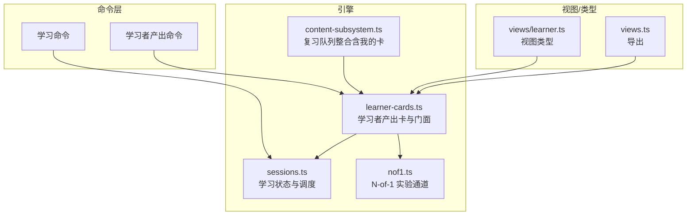
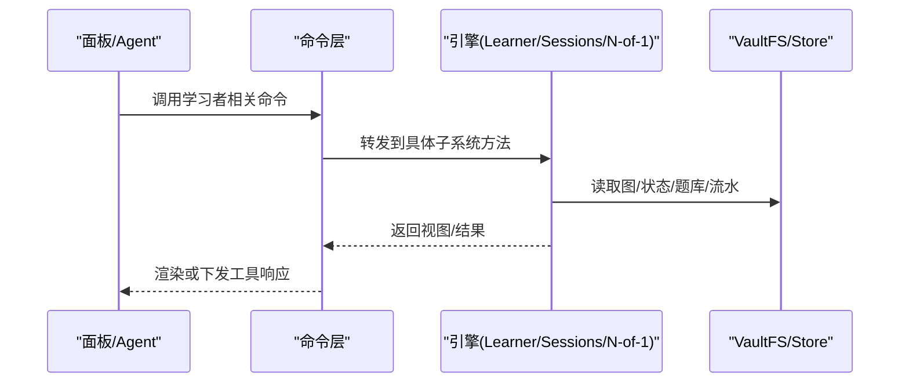
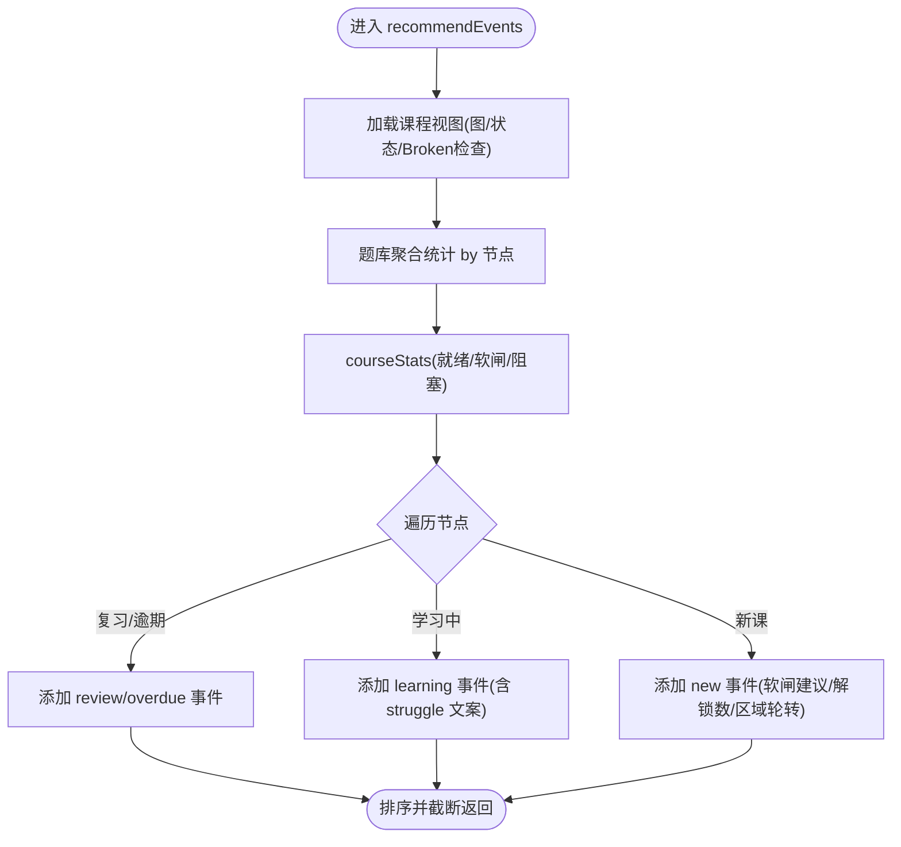
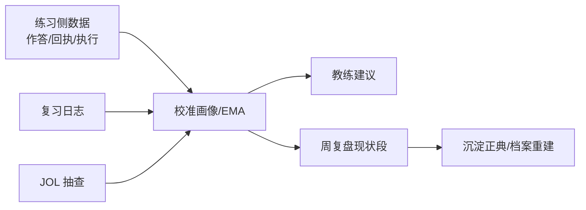
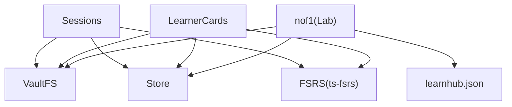

# 学习者子系统

<cite>
**本文引用的文件**
- [sessions.ts](file://src/engine/sessions.ts)
- [nof1.ts](file://src/engine/nof1.ts)
- [learner-cards.ts](file://src/engine/learner-cards.ts)
- [learner.ts（视图类型）](file://src/engine/views/learner.ts)
- [views.ts（视图导出）](file://src/engine/views.ts)
- [学习者产出命令](file://src/commands/学习者产出.ts)
- [学习命令](file://src/commands/学习.ts)
- [content-subsystem.ts](file://src/engine/content-subsystem.ts)
- [learner-cards.test.ts](file://tests/learner-cards.test.ts)
- [0057-nof1-receipt-review-mode-variable.md](file://docs/adr/0057-nof1-receipt-review-mode-variable.md)
</cite>

## 目录
1. [简介](#简介)
2. [项目结构](#项目结构)
3. [核心组件](#核心组件)
4. [架构总览](#架构总览)
5. [详细组件分析](#详细组件分析)
6. [依赖关系分析](#依赖关系分析)
7. [性能考量](#性能考量)
8. [故障排查指南](#故障排查指南)
9. [结论](#结论)
10. [附录](#附录)

## 简介
本文件系统性地梳理并文档化“学习者子系统”，聚焦以下能力：
- 学习者卡片管理（E1“我的卡”）：创建、归档/恢复、自评与忘记申报、复习队列汇入。
- 学习会话跟踪（Sessions）：课程状态汇总、动态推荐事件、节点学习包、struggle 识别与回补建议。
- 无干扰模式（N-of-1，nof1）：实验模板、批次/卡级分臂、练习侧/调度侧结局采集与分析、回执评审模式变量。
- 学习者画像构建：基于学习行为（作答、回执、执行事件）与能力测试（JOL 校准）生成个性化模型与诊断建议。

目标读者包括产品、教练与开发者，既提供高层概览，也给出代码级结构与流程说明。

## 项目结构
学习者子系统主要分布在 engine 层，围绕三个核心模块组织：
- sessions.ts：学习状态与调度（status/recommend/lesson），负责课程进度、推荐事件、节点学习包。
- learner-cards.ts：学习者产出卡（E1）的持久化、校验、队列与复习汇入；同时聚合 LearnerSubsystem 门面方法（pin、周复盘、教练反馈等）。
- nof1.ts：N-of-1 实验通道（D1 Lab），含模板库、分臂策略、结局分析与报告。

此外，命令层将引擎能力暴露给面板与 Agent 通道；UI 通过 API 消费这些能力。



图表来源
- [sessions.ts:1-120](file://src/engine/sessions.ts#L1-L120)
- [learner-cards.ts:1-120](file://src/engine/learner-cards.ts#L1-L120)
- [nof1.ts:1-120](file://src/engine/nof1.ts#L1-L120)
- [content-subsystem.ts:506-585](file://src/engine/content-subsystem.ts#L506-L585)
- [learner.ts（视图类型）:89-147](file://src/engine/views/learner.ts#L89-L147)
- [views.ts:160-205](file://src/engine/views.ts#L160-L205)

章节来源
- [sessions.ts:1-120](file://src/engine/sessions.ts#L1-L120)
- [learner-cards.ts:1-120](file://src/engine/learner-cards.ts#L1-L120)
- [nof1.ts:1-120](file://src/engine/nof1.ts#L1-L120)
- [content-subsystem.ts:506-585](file://src/engine/content-subsystem.ts#L506-L585)
- [learner.ts（视图类型）:89-147](file://src/engine/views/learner.ts#L89-L147)
- [views.ts:160-205](file://src/engine/views.ts#L160-L205)

## 核心组件
- Sessions：提供 statusJson、recommendEvents、lesson 等方法，计算课程就绪/逾期/软闸、生成推荐事件、拼装单节学习包。
- LearnerCards：实现 E1“我的卡”的增删改查、归档/恢复、证据写回（fsrs/stats）、与复习队列的汇入。
- LearnerSubsystem：聚合 pinToday、周复盘、教练建议、JOL 配置、难度带日志、回执评审模式等学习者自管理能力。
- LabSubsystem（nof1）：提供实验模板、提案-确认-开跑-停止-报告全流程，支持真实保留率与练习侧 EMA 两种结局。

章节来源
- [sessions.ts:293-642](file://src/engine/sessions.ts#L293-L642)
- [learner-cards.ts:184-309](file://src/engine/learner-cards.ts#L184-L309)
- [learner-cards.ts:352-800](file://src/engine/learner-cards.ts#L352-L800)
- [nof1.ts:476-800](file://src/engine/nof1.ts#L476-L800)

## 架构总览
学习者子系统以“读-写分离 + 领域聚合”的方式组织：
- 读侧：Sessions 聚合图与状态，输出 status/recommend/lesson；LearnerSubsystem 聚合 JOL、习惯、技能、回执、教练等读派生面。
- 写侧：LearnerCards 负责 E1 卡的持久化与证据写回；nof1 负责实验定义与结局沉淀。
- 集成点：content-subsystem 将“我的卡”并入复习队列；命令层统一暴露到面板/Agent。



图表来源
- [学习者产出命令:434-555](file://src/commands/学习者产出.ts#L434-L555)
- [学习命令:51-87](file://src/commands/学习.ts#L51-L87)
- [sessions.ts:318-357](file://src/engine/sessions.ts#L318-L357)
- [learner-cards.ts:241-309](file://src/engine/learner-cards.ts#L241-L309)
- [nof1.ts:537-619](file://src/engine/nof1.ts#L537-L619)

## 详细组件分析

### 学习者卡片（LearnerCards）
- 数据结构
  - 单卡包含 id、kind（recall_cue/cloze_rewrite/self_explain）、prompt、content、source_node/source_section、archived、fsrs、stats。
  - 卡组按节点落盘为 YAML，独立 schema 校验，长度与内容门禁严格。
- 生命周期
  - 创建：addCard 去重后写入；支持节锚点 source_section。
  - 归档/恢复：archiveCard 仅影响可见性，不触碰 canonical。
  - 证据写回：updateCardEvidence 整体替换 fsrs/stats，由作答侧驱动。
  - 复习汇入：content-subsystem 将未调度新卡入队尾（due=null，R=1），到期卡按 FSRS due 进入复习队列。
- 与复习队列的关系
  - 我的卡走独立 FSRS 块，复用 srs.applyRatingBlock；结算 XP 走无绑定行（journal），不进节点 mastery/题库。

```mermaid
classDiagram
class LearnerCard {
+string id
+LearnerCardKind kind
+string prompt
+string content
+string source_node
+string? source_section
+boolean? archived
+FsrsBlock? fsrs
+Stats? stats
}
class LearnerCards {
+cardPath(courseRoot, node) string
+load(courseRoot, node) Promise~LearnerCardDoc~
+addCard(...) Promise~{id,count}~
+updateCardEvidence(...) Promise~void~
+archiveCard(...) Promise~void~
}
LearnerCards --> LearnerCard : "管理"
```

图表来源
- [learner-cards.ts:81-97](file://src/engine/learner-cards.ts#L81-L97)
- [learner-cards.ts:184-309](file://src/engine/learner-cards.ts#L184-L309)

章节来源
- [learner-cards.ts:81-182](file://src/engine/learner-cards.ts#L81-L182)
- [learner-cards.ts:184-309](file://src/engine/learner-cards.ts#L184-L309)
- [content-subsystem.ts:566-585](file://src/engine/content-subsystem.ts#L566-L585)
- [learner-cards.test.ts:348-441](file://tests/learner-cards.test.ts#L348-L441)

### 学习会话（Sessions）
- 状态与推荐
  - statusJson：汇总各课程 counts/due_today/overdue/ready/gated/blocked，剔除终点节点。
  - recommendEvents：生成 review/overdue/learning/new/pin/sleep/diagnostic 等事件，附带 enc 回退建议与睡眠建议。
  - lesson：拼装单节学习包（分节正文、前置、推荐下一步）。
- 关键算法
  - readySet/gateBlockers：基于图前置与 R_gate 判定新课候选与软闸阻断。
  - encRemedialAdvice：struggle 节点按 w×(1−R) 排序定向回补成分技能。
  - regionLru：区域轮转优先从未学过的区开始。
- 数据流
  - 从题库聚合统计（due/count/accuracy/attempts）→ 推荐事件 → 面板展示与导航。



图表来源
- [sessions.ts:361-572](file://src/engine/sessions.ts#L361-L572)

章节来源
- [sessions.ts:318-357](file://src/engine/sessions.ts#L318-L357)
- [sessions.ts:361-572](file://src/engine/sessions.ts#L361-L572)
- [sessions.ts:576-642](file://src/engine/sessions.ts#L576-L642)

### 无干扰模式（N-of-1，nof1）
- 设计原则
  - 白名单变量：仅允许引擎可控的内容/课程设计参数；调度核心不可作为实验变量。
  - 随机化：v1 支持卡级随机化与会话级参数的批次交替（按学习日轮臂）。
  - 数据边界：零 XP、不进 Mastery/任何 canonical 度量；优化器混训不特判。
- 模板与变量
  - 预置模板：难度带默认、会话组成、PS-I 顺序、检索点位置、回执评审模式（ai/self）。
  - 回执评审模式变量：arm=ai/self，练习侧结局（practice_ema），批次交替，当日生效覆盖默认。
- 实验流程
  - 提案-确认-开跑-停止-报告：提案生成合格卡池与参数；apply 时校验产物一致性；stop 时落沉淀正典并重建档案投影。
- 结局采集与分析
  - 调度侧：复习日志中 exp 标注的二元真实保留率。
  - 练习侧：三股评分流（交互作答、回执量表、项目执行回流）归一为 0–1 值，按学习日归属当日臂。
  - 分析：置换检验 + 自助法 95% 区间，未达最短观察窗只报进度。

```mermaid
sequenceDiagram
participant User as "学习者"
participant Lab as "LabSubsystem(nof1)"
participant Store as "Store/FS"
participant Analysis as "analyzeNof1"
User->>Lab : experimentPropose(templateId, course?)
Lab->>Store : 创建提案(artifact)
User->>Lab : experimentApply(pid?)
Lab->>Store : 保存实验定义(assignment/order/map)
Note over Lab : 批次交替按学习日轮臂; 卡级分臂用确定性RNG均分
User->>Lab : experimentStop(id?)
Lab->>Store : 沉淀结局事件(kind=nof1_outcome)
Lab->>Analysis : 按结局口径采集数据
Analysis-->>Lab : 返回diff/ci95/p/message
Lab-->>User : 报告(直白话)
```

图表来源
- [nof1.ts:537-619](file://src/engine/nof1.ts#L537-L619)
- [nof1.ts:627-712](file://src/engine/nof1.ts#L627-L712)
- [0057-nof1-receipt-review-mode-variable.md:1-14](file://docs/adr/0057-nof1-receipt-review-mode-variable.md#L1-L14)

章节来源
- [nof1.ts:1-149](file://src/engine/nof1.ts#L1-L149)
- [nof1.ts:154-223](file://src/engine/nof1.ts#L154-L223)
- [nof1.ts:224-342](file://src/engine/nof1.ts#L224-L342)
- [nof1.ts:344-429](file://src/engine/nof1.ts#L344-L429)
- [nof1.ts:476-800](file://src/engine/nof1.ts#L476-L800)
- [0057-nof1-receipt-review-mode-variable.md:1-14](file://docs/adr/0057-nof1-receipt-review-mode-variable.md#L1-L14)

### 学习者画像构建
- 数据来源
  - 练习侧：交互作答、回执量表、项目执行回流（经净值清洗）。
  - 调度侧：复习日志中的真实保留率。
  - 自测校准：JOL 抽查（可开关与抽样率配置），产出校准曲线与过信预警。
- 画像维度
  - 自评校准画像：分源切片（jol）+ 全局参考视图，显示配对区间、档位与实际正确率对比。
  - 教练建议：基于难度带选择分布与到期难题数，低打扰提示。
  - 周复盘：每周结算点，沉淀校准画像/速度韧性周档，并重建学习者档案投影。
- 输出
  - 视图：CalibrationProfileDoc、HabitsListDoc/HabitShowDoc、SkillsListDoc、KataDoc。
  - 沉淀：sediment 事件（如 nof1_outcome），用于长期档案重建。



图表来源
- [learner-cards.ts:419-500](file://src/engine/learner-cards.ts#L419-L500)
- [learner-cards.ts:551-570](file://src/engine/learner-cards.ts#L551-L570)
- [learner-cards.ts:604-763](file://src/engine/learner-cards.ts#L604-L763)
- [learner.ts（视图类型）:119-147](file://src/engine/views/learner.ts#L119-L147)

章节来源
- [learner-cards.ts:419-500](file://src/engine/learner-cards.ts#L419-L500)
- [learner-cards.ts:551-570](file://src/engine/learner-cards.ts#L551-L570)
- [learner-cards.ts:604-763](file://src/engine/learner-cards.ts#L604-L763)
- [learner.ts（视图类型）:119-147](file://src/engine/views/learner.ts#L119-L147)

## 依赖关系分析
- 耦合与内聚
  - Sessions 与题库/图/状态高内聚，对外暴露推荐与状态接口。
  - LearnerCards 与 VaultFS/YAML/Store 紧密耦合，但通过原子写与 schema 门禁保证一致性。
  - nof1 通过 LabDeps 窄面依赖 store/fs/paths/registry/projects/bank/sched 等，避免环依赖。
- 外部依赖
  - FSRS（ts-fsrs）：复习调度与提取度计算。
  - 存储：VaultFS、Store（journal/practice/reviewLog/habits/skills 等）。
  - 配置：learnhub.json（band_default、receipt_review_mode、jol 等）。
- 循环依赖防护
  - 通过 types.ts 中立层 re-export 类型（如 LearnerCardKind），避免运行时导入环。
  - Lab/Learner 域通过结构化窄面注入依赖，保持单向依赖。



图表来源
- [sessions.ts:9-28](file://src/engine/sessions.ts#L9-L28)
- [learner-cards.ts:16-73](file://src/engine/learner-cards.ts#L16-L73)
- [nof1.ts:22-53](file://src/engine/nof1.ts#L22-L53)

章节来源
- [sessions.ts:9-28](file://src/engine/sessions.ts#L9-L28)
- [learner-cards.ts:16-73](file://src/engine/learner-cards.ts#L16-L73)
- [nof1.ts:22-53](file://src/engine/nof1.ts#L22-L53)

## 性能考量
- 批量扫描与聚合
  - bankSnapshot 一次遍历所有课程题库，聚合 due/count/accuracy/attempts，供推荐与教练面复用。
  - struggleWindow 按窗口聚合近期作答，避免重复计算。
- 最小 I/O
  - 卡片读写使用 atomicWrite 与 YAML 序列化，减少并发写入风险。
  - 推荐事件排序与截断（limit）控制前端渲染压力。
- 纯函数与确定性
  - nof1 分析使用确定性 RNG（mulberry32），便于复现与测试。
  - 统计过程（置换检验/自助法）在内存中进行，避免额外 IO。

[本节为通用性能讨论，不直接分析具体文件]

## 故障排查指南
- 我的卡 Broken
  - 现象：YAML 解析失败、schema 校验失败、控制字符、挖空标记缺失等。
  - 处理：查看 validateLearnerCards 错误信息；确保 prompt/content 非空且不超过上限；cloze_rewrite 必须包含 {{…}}。
  - 参考路径：[validateLearnerCards:113-182](file://src/engine/learner-cards.ts#L113-L182)
- 同内容重复建卡
  - 现象：addCard 拒绝重复内容。
  - 处理：先归档旧卡再存新版本，或修改内容。
  - 参考路径：[addCard 去重逻辑:241-271](file://src/engine/learner-cards.ts#L241-L271)
- 复习日志/Practice 零掺入
  - 现象：E1 卡自评/忘记申报不写 practice/reviewLog。
  - 处理：确认走无绑定 XP 行（journal），符合 ADR-0021 裁决。
  - 参考路径：[测试断言:380-391](file://tests/learner-cards.test.ts#L380-L391)
- N-of-1 实验无法开跑
  - 现象：已有实验在跑、模板未解锁、提案产物不一致。
  - 处理：先 stop 当前实验；检查模板 unlocked 与白名单；重新 apply 前确保产物未被篡改。
  - 参考路径：[experimentPropose/Apply:537-619](file://src/engine/nof1.ts#L537-L619)
- 回执评审模式异常
  - 现象：self_score/force_full 越界或臂不匹配。
  - 处理：确认 arm 与 mode 一致；self 臂不允许 force_full；AI 臂不允许 self_score。
  - 参考路径：[ADR-0057:1-14](file://docs/adr/0057-nof1-receipt-review-mode-variable.md#L1-L14)

章节来源
- [learner-cards.ts:113-182](file://src/engine/learner-cards.ts#L113-L182)
- [learner-cards.ts:241-271](file://src/engine/learner-cards.ts#L241-L271)
- [learner-cards.test.ts:380-391](file://tests/learner-cards.test.ts#L380-L391)
- [nof1.ts:537-619](file://src/engine/nof1.ts#L537-L619)
- [0057-nof1-receipt-review-mode-variable.md:1-14](file://docs/adr/0057-nof1-receipt-review-mode-variable.md#L1-L14)

## 结论
学习者子系统以清晰的领域划分与严格的契约约束，实现了：
- 学习者卡片（E1）的独立调度与复习汇入，保障 canonical 事实源不受污染。
- 学习会话（Sessions）的动态推荐与节点学习包，结合 strugle 回补与睡眠建议提升学习效率。
- N-of-1 实验通道（nof1）提供严谨的个体实验框架，支持真实保留率与练习侧 EMA 双结局。
- 学习者画像基于多源数据持续更新，配合教练建议与周复盘形成闭环。

该体系兼顾可扩展性与可观测性，适合在复杂学习场景中稳定运行并提供高质量反馈。

[本节为总结性内容，不直接分析具体文件]

## 附录

### 代码示例路径（不直接展示代码）
- 管理学习者信息（创建/归档/恢复我的卡）
  - 创建：[explainArchiveCard 入口:434-461](file://src/commands/学习者产出.ts#L434-L461)
  - 归档/恢复：[learnerCardArchive 入口:462-485](file://src/commands/学习者产出.ts#L462-L485)
  - 队列查询：[learnerQueue 入口:523-533](file://src/commands/学习者产出.ts#L523-L533)
- 跟踪学习进度（自评/忘记申报）
  - 自评：[learnerCardRate 入口:534-555](file://src/commands/学习者产出.ts#L534-L555)
  - 忘记申报：[learner-forget 入口:486-522](file://src/commands/学习者产出.ts#L486-L522)
- 启用专注模式（N-of-1 实验）
  - 提案：[experimentPropose:537-569](file://src/engine/nof1.ts#L537-L569)
  - 开跑：[experimentApply:573-619](file://src/engine/nof1.ts#L573-L619)
  - 停止与报告：[experimentStop/Report:627-712](file://src/engine/nof1.ts#L627-L712)

章节来源
- [学习者产出命令:434-555](file://src/commands/学习者产出.ts#L434-L555)
- [nof1.ts:537-712](file://src/engine/nof1.ts#L537-L712)