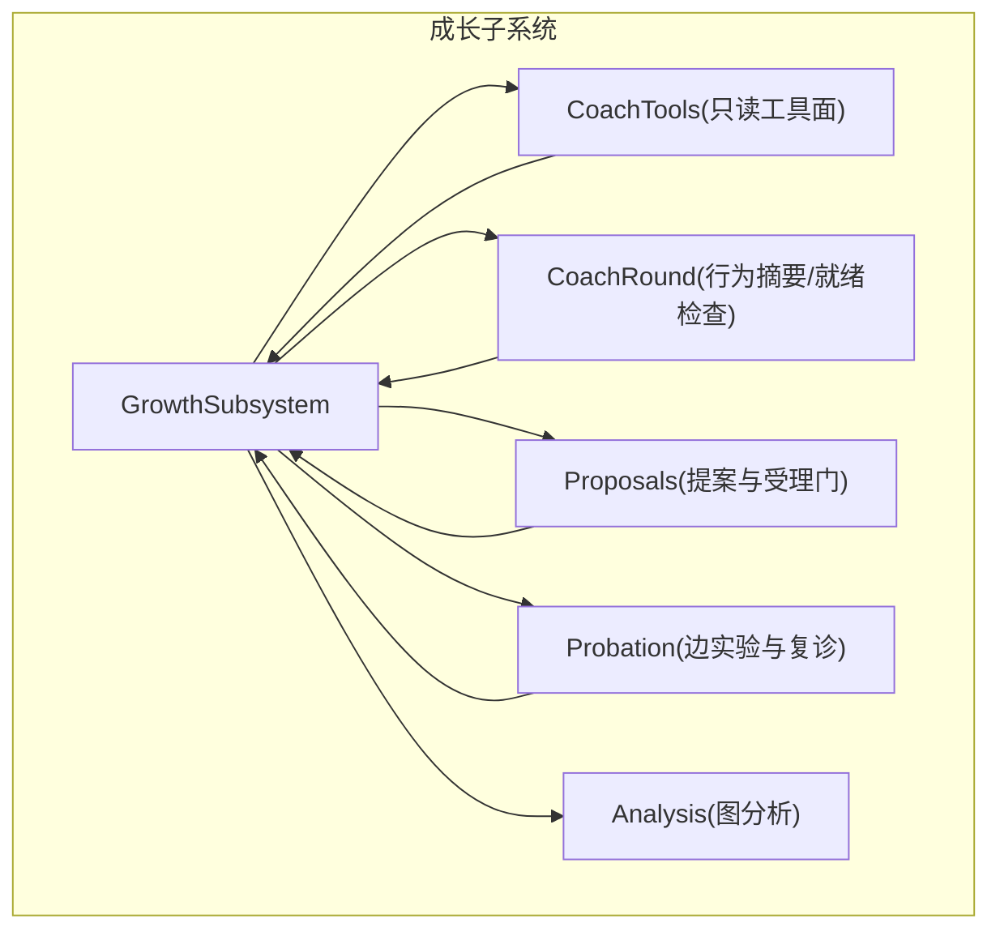
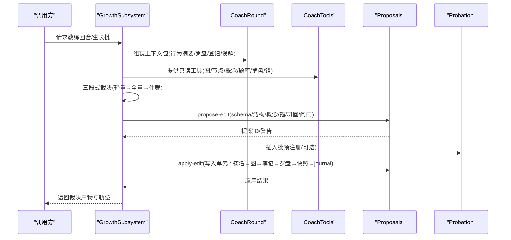
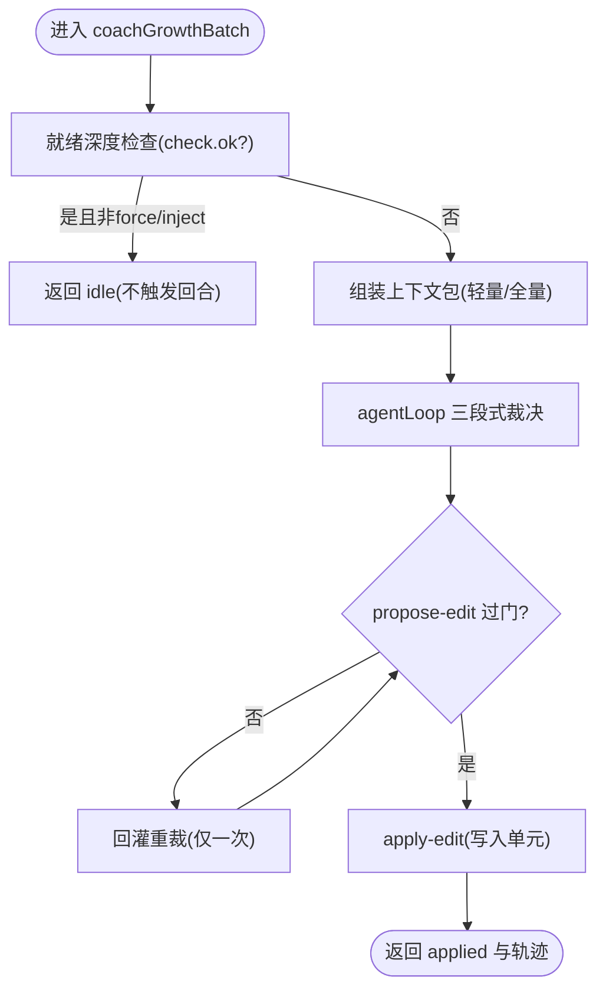
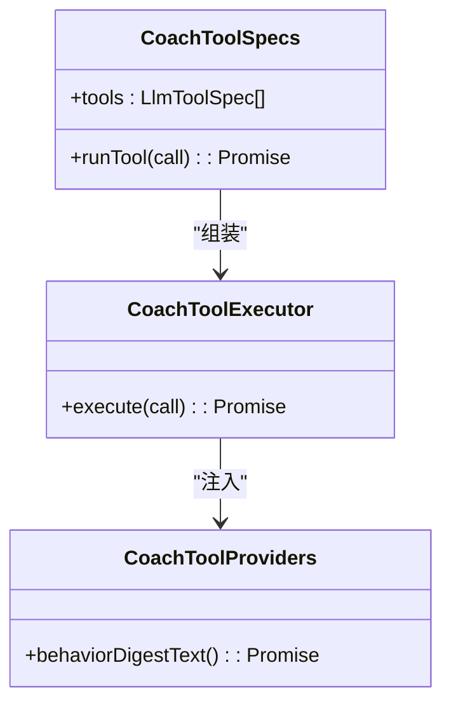
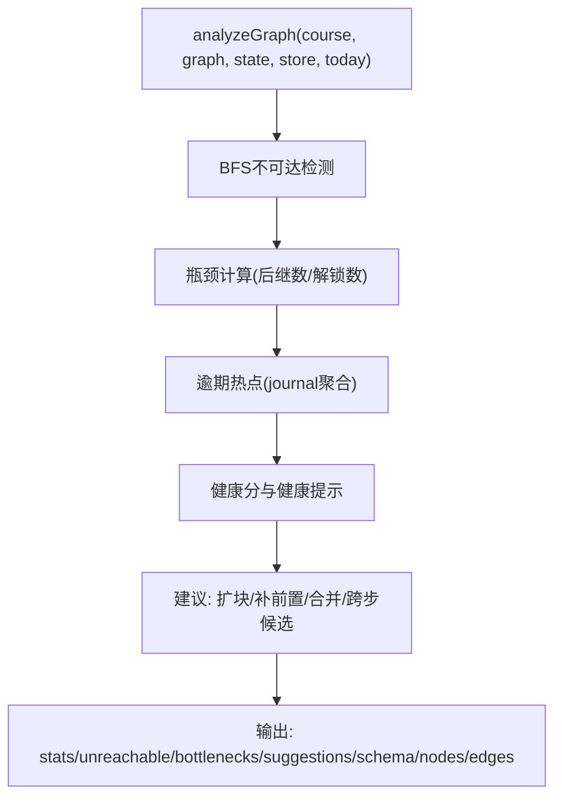
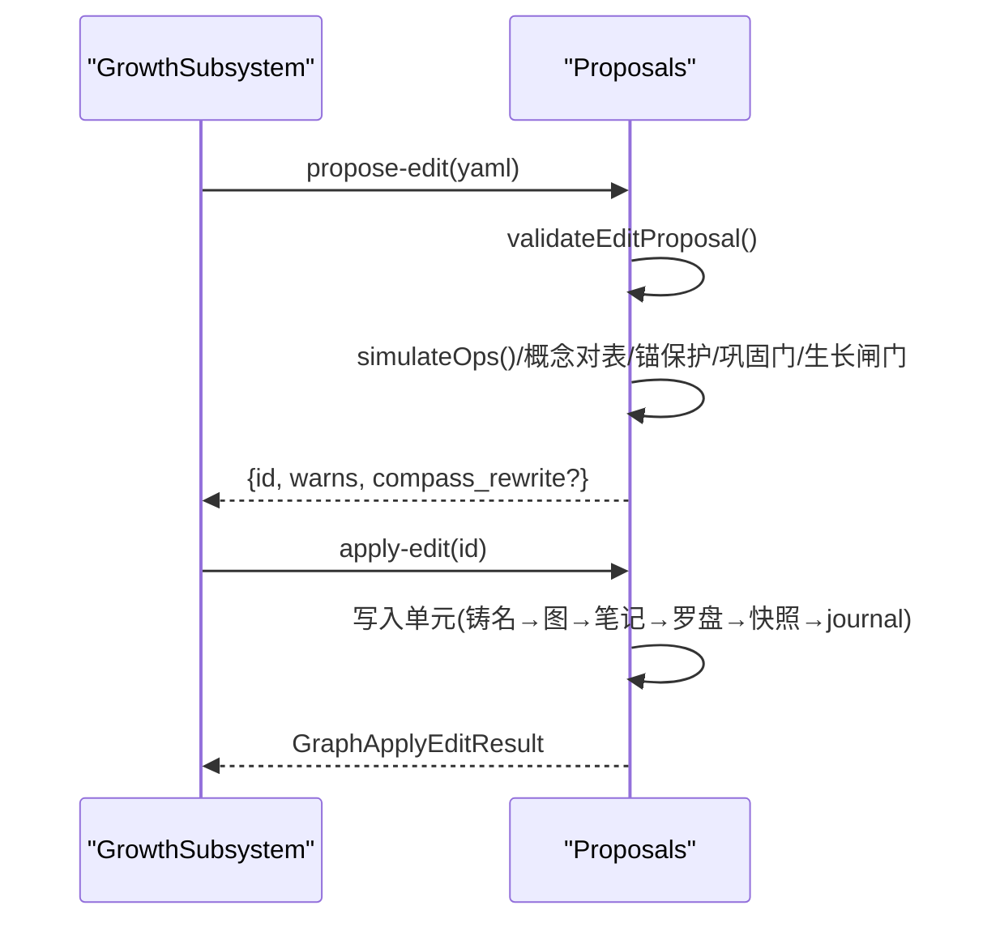
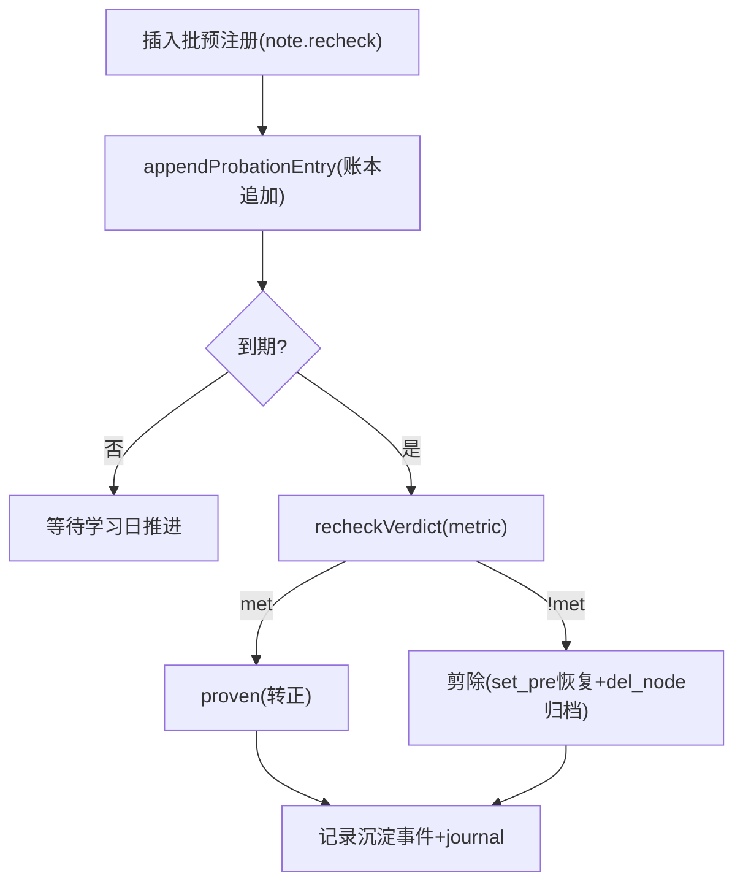
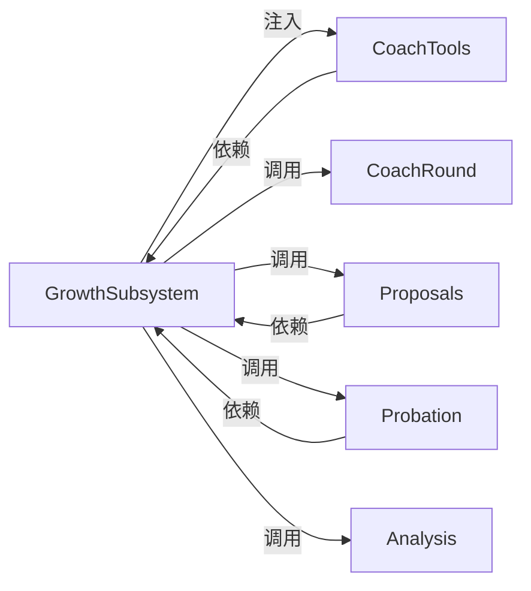

# 成长子系统

<cite>
**本文引用的文件**
- [growth-subsystem.ts](file://src/engine/growth-subsystem.ts)
- [coach-tools.ts](file://src/engine/coach-tools.ts)
- [analysis.ts](file://src/engine/analysis.ts)
- [proposals.ts](file://src/engine/proposals.ts)
- [probation.ts](file://src/engine/probation.ts)
- [coach-round.ts](file://src/engine/coach-round.ts)
- [params.ts](file://src/engine/params.ts)
</cite>

## 目录
1. [简介](#简介)
2. [项目结构](#项目结构)
3. [核心组件](#核心组件)
4. [架构总览](#架构总览)
5. [详细组件分析](#详细组件分析)
6. [依赖关系分析](#依赖关系分析)
7. [性能考量](#性能考量)
8. [故障排查指南](#故障排查指南)
9. [结论](#结论)
10. [附录：扩展示例与最佳实践](#附录：扩展示例与最佳实践)

## 简介
本文件系统性地梳理“成长子系统”的职责与实现，围绕学习者成长追踪、教练工具集成和学习分析三大能力展开。重点说明：
- GrowthSubsystem 如何组织罗盘（课程方向）、教练回合（裁决与生长批）、边实验账本与复诊结算。
- 成长模型构建过程：能力维度定义、成长指标计算与发展轨迹分析。
- 教练工具系统 coach-tools 的设计：只读视图白名单、工具注册与调用、结果处理。
- 学习分析引擎 analysis 的数据收集、统计分析与洞察生成。
- 成长建议的生成机制：基于学习数据与行为模式提供个性化指导。
- 可扩展点：新增成长指标、集成新教练工具、生成分析报告的具体路径。

## 项目结构
成长子系统以 engine 层为核心，关键文件职责如下：
- growth-subsystem.ts：成长子系统的门面类，聚合罗盘、教练回合、生长批受理、边实验与复诊等能力。
- coach-tools.ts：教练只读工具面，提供图视图、节点卡、概念登记表、行为摘要、题库概况、罗盘、终点锚七件只读工具。
- analysis.ts：图分析模块，输出结构统计、不可达节点、瓶颈、逾期热点、健康分与建议，以及渲染元素。
- proposals.ts：提案生命周期与受理门（schema、结构、概念对表、锚保护、巩固门、生长闸门），并负责写入单元。
- probation.ts：边实验账本与复诊预注册、到期判定、三率与韧性闸门映射。
- coach-round.ts：教练回合感知面（行为摘要五件套、就绪深度检查、沉淀折叠）。
- params.ts：复诊期与三率阈值等参数。

**图表来源**
- [growth-subsystem.ts:91-113](file://src/engine/growth-subsystem.ts#L91-L113)
- [coach-tools.ts:30-35](file://src/engine/coach-tools.ts#L30-L35)
- [analysis.ts:27-85](file://src/engine/analysis.ts#L27-L85)
- [proposals.ts:495-605](file://src/engine/proposals.ts#L495-L605)
- [probation.ts:37-123](file://src/engine/probation.ts#L37-L123)
- [coach-round.ts:1-23](file://src/engine/coach-round.ts#L1-L23)

**章节来源**
- [growth-subsystem.ts:91-113](file://src/engine/growth-subsystem.ts#L91-L113)
- [coach-tools.ts:30-35](file://src/engine/coach-tools.ts#L30-L35)
- [analysis.ts:27-85](file://src/engine/analysis.ts#L27-L85)
- [proposals.ts:495-605](file://src/engine/proposals.ts#L495-L605)
- [probation.ts:37-123](file://src/engine/probation.ts#L37-L123)
- [coach-round.ts:1-23](file://src/engine/coach-round.ts#L1-L23)

## 核心组件
- GrowthSubsystem：统一编排罗盘读写、教练回合上下文包、生长批受理（轻量→全量→仲裁→回灌重裁）、边实验账本与复诊结算、就绪深度检查、ETA 折叠与路线对账。
- CoachTools：只读工具白名单与执行器，为教练回路提供证据源，零写侧、零队列触点。
- Analysis：图分析，产出结构统计、瓶颈、逾期热点、健康分、分批构建建议与可视化元素。
- Proposals：提案 schema 校验、结构检查、概念对表、锚保护、巩固门、生长闸门，以及写入单元与落盘。
- Probation：边实验账本追加/读取、复诊预注册校验、到期判定、三率与韧性闸门映射。
- CoachRound：行为摘要五件套、就绪深度检查、沉淀折叠的教练投影。

**章节来源**
- [growth-subsystem.ts:91-1153](file://src/engine/growth-subsystem.ts#L91-L1153)
- [coach-tools.ts:30-305](file://src/engine/coach-tools.ts#L30-L305)
- [analysis.ts:27-246](file://src/engine/analysis.ts#L27-L246)
- [proposals.ts:42-341](file://src/engine/proposals.ts#L42-L341)
- [probation.ts:37-200](file://src/engine/probation.ts#L37-L200)
- [coach-round.ts:1-200](file://src/engine/coach-round.ts#L1-L200)

## 架构总览
成长子系统采用“门面 + 领域服务 + 纯函数层”的分层设计：
- 门面层（GrowthSubsystem）：协调各域能力，保证流程纪律（如三段式裁决、写入单元、审计留痕）。
- 工具面（CoachTools）：严格白名单的只读视图，避免教练直接写图或入队。
- 分析层（Analysis）：无 IO 的纯函数分析，输入图与状态，输出可消费的结构化洞察。
- 提案与账本（Proposals/Probation）：强约束的变更通道与实验跟踪，确保可审计、可恢复。

**图表来源**
- [growth-subsystem.ts:622-808](file://src/engine/growth-subsystem.ts#L622-L808)
- [coach-tools.ts:235-305](file://src/engine/coach-tools.ts#L235-L305)
- [proposals.ts:556-605](file://src/engine/proposals.ts#L556-L605)
- [probation.ts:125-168](file://src/engine/probation.ts#L125-L168)

## 详细组件分析

### GrowthSubsystem：成长追踪与教练回合
- 罗盘能力：读取/初画/重写路线、周内 ETA 刷新与路线对账；支持多终点与软批注。
- 教练回合：轻量段（行为摘要+罗盘）→全量段（六区块包+图面）→仲裁段（双沙盘参照）→回灌重裁（一次修复轮）。
- 行为摘要：窗口取大（最近7学习日或10节），聚合掌握轨迹、卡点集中度、速度校准、误解活跃度、保留率。
- 边实验与复诊：插入批预注册复诊，到期自动结算（达标 proven 或剪除），三率与韧性闸门调速。
- 就绪深度检查：停摆判据（就绪存量达标或所有终点达成），零节点图同判停摆。

**图表来源**
- [growth-subsystem.ts:622-808](file://src/engine/growth-subsystem.ts#L622-L808)
- [proposals.ts:556-605](file://src/engine/proposals.ts#L556-L605)

**章节来源**
- [growth-subsystem.ts:100-341](file://src/engine/growth-subsystem.ts#L100-L341)
- [growth-subsystem.ts:394-578](file://src/engine/growth-subsystem.ts#L394-L578)
- [growth-subsystem.ts:622-808](file://src/engine/growth-subsystem.ts#L622-L808)
- [coach-round.ts:36-200](file://src/engine/coach-round.ts#L36-L200)

### 教练工具系统 coach-tools：只读视图白名单
- 白名单七件：graph_view、node_card、concept_registry、behavior_digest、bank_overview、compass_read、endpoint_anchor。
- 工具规格：JSON Schema 直通 provider function calling。
- 执行器：参数 JSON 解析、终点恒标现算、白名单外调用 fail loud。
- 提供者注入：行为摘要文本由 GrowthSubsystem 提供单一出处，避免重复取材口径。

**图表来源**
- [coach-tools.ts:235-305](file://src/engine/coach-tools.ts#L235-L305)

**章节来源**
- [coach-tools.ts:30-35](file://src/engine/coach-tools.ts#L30-L35)
- [coach-tools.ts:235-305](file://src/engine/coach-tools.ts#L235-L305)

### 学习分析引擎 analysis：数据收集、统计与洞察
- 输入：课程名、Graph、state、Store、today、Vault链接先验、种子阶段标记、终点集合。
- 输出：结构统计、不可达节点、瓶颈、逾期热点、健康分与建议、cytoscape 元素、节点 schema。
- 建议项：expand_blocks、missing_pre、unconverged、jump_candidates、merge_blocks、vault_link_candidates。

**图表来源**
- [analysis.ts:87-246](file://src/engine/analysis.ts#L87-L246)

**章节来源**
- [analysis.ts:27-85](file://src/engine/analysis.ts#L27-L85)
- [analysis.ts:87-246](file://src/engine/analysis.ts#L87-L246)

### 提案与受理门 proposals：结构化变更通道
- 入口：propose-edit → validateEditProposal → 模拟执行 → 概念对表 → 锚保护 → 巩固门 → 生长闸门 → 保存 artifact → pending。
- 应用：apply-edit → 二次校验 → 写入单元（铸名→图→笔记→罗盘→快照→journal）→ applied。
- 增长闸门：按三率与样本下限控制插入积极性，低数据静默。

**图表来源**
- [proposals.ts:556-605](file://src/engine/proposals.ts#L556-L605)
- [proposals.ts:686-760](file://src/engine/proposals.ts#L686-L760)

**章节来源**
- [proposals.ts:42-341](file://src/engine/proposals.ts#L42-L341)
- [proposals.ts:556-605](file://src/engine/proposals.ts#L556-L605)
- [proposals.ts:686-760](file://src/engine/proposals.ts#L686-L760)

### 边实验与复诊 probation：插入边的生命周期
- 预注册：插入批携带 recheck{metric, days?}，days clamp [5,20]。
- 账本：追加只增，读侧折叠取最新行；in-flight 与 decided 分离。
- 到期结算：recheckDue 判定到期，recheckVerdict 评估 metric，达标 proven，否则剪除（恢复原粗边+归档）。
- 三率与韧性：滚动 30 学习日，样本不足静默，韧性高放宽旁支上限。

**图表来源**
- [probation.ts:125-200](file://src/engine/probation.ts#L125-L200)
- [growth-subsystem.ts:940-1141](file://src/engine/growth-subsystem.ts#L940-L1141)

**章节来源**
- [probation.ts:37-123](file://src/engine/probation.ts#L37-L123)
- [probation.ts:125-200](file://src/engine/probation.ts#L125-L200)
- [growth-subsystem.ts:940-1141](file://src/engine/growth-subsystem.ts#L940-L1141)

## 依赖关系分析
- GrowthSubsystem 依赖：
  - 时钟/存储/路径/注册表/概念/内容/图/沙盒/沉淀/提议/会话/SRS/XP/YAML 等端口与模块。
  - 通过 GrowthDeps 窄面注入，避免环依赖。
- CoachTools 依赖：
  - 通过 CoachToolDeps 注入图视图、概念登记、题库扫描等读侧能力。
- Analysis 依赖：
  - 图、状态、Store、日期、SRS、质量模块，输出无 IO 的分析结果。
- Proposals 依赖：
  - 概念登记、图存储、种子锚、日期、写入单元、提案存储。
- Probation 依赖：
  - 记忆模块、日期、参数、存储 IO。

**图表来源**
- [growth-subsystem.ts:36-90](file://src/engine/growth-subsystem.ts#L36-L90)
- [coach-tools.ts:218-233](file://src/engine/coach-tools.ts#L218-L233)
- [analysis.ts:6-18](file://src/engine/analysis.ts#L6-L18)
- [proposals.ts:495-510](file://src/engine/proposals.ts#L495-L510)
- [probation.ts:22-35](file://src/engine/probation.ts#L22-L35)

**章节来源**
- [growth-subsystem.ts:36-90](file://src/engine/growth-subsystem.ts#L36-L90)
- [coach-tools.ts:218-233](file://src/engine/coach-tools.ts#L218-L233)
- [analysis.ts:6-18](file://src/engine/analysis.ts#L6-L18)
- [proposals.ts:495-510](file://src/engine/proposals.ts#L495-L510)
- [probation.ts:22-35](file://src/engine/probation.ts#L22-L35)

## 性能考量
- 周级 ETA 缓存：同一学习周同课复用蒙特卡洛结果，避免重复计算。
- 列表预览上限：图名与登记表等列表视图设置上限，防止膨胀。
- 轻量段优先：轻量回合仅带行为摘要与罗盘，降低 LLM 成本。
- 只读工具白名单：零写侧、零队列触点，避免递归自激。
- 三率与样本下限：低数据时静默闸门，减少误判与无效重试。

[本节为通用性能讨论，无需特定文件引用]

## 故障排查指南
- 罗盘初画失败：检查是否零终点；若存在锚但损坏需显式浮出。
- 教练回合短路：就绪深度满足且未 force/inject 时返回 idle，属正常。
- 提案被拒：查看 schema 错误、概念引用、锚保护、巩固门、生长闸门错误行。
- 复诊未决：检查账本条目是否缺失/损坏；到期学习日推进情况。
- 工具调用失败：确认在白名单内，参数为合法 JSON；未知工具会被拒收。

**章节来源**
- [growth-subsystem.ts:163-221](file://src/engine/growth-subsystem.ts#L163-L221)
- [growth-subsystem.ts:622-643](file://src/engine/growth-subsystem.ts#L622-L643)
- [proposals.ts:556-605](file://src/engine/proposals.ts#L556-L605)
- [probation.ts:76-95](file://src/engine/probation.ts#L76-L95)
- [coach-tools.ts:251-297](file://src/engine/coach-tools.ts#L251-L297)

## 结论
成长子系统以 GrowthSubsystem 为中心，将罗盘、教练回合、边实验与复诊、图分析有机整合，形成从数据采集、诊断到决策与执行的闭环。通过严格的提案与账本机制、只读工具白名单与三段式裁决，系统在灵活性与安全性之间取得平衡。未来可通过扩展行为摘要指标、新增只读工具与分析维度，持续增强个性化指导能力。

[本节为总结性内容，无需特定文件引用]

## 附录：扩展示例与最佳实践

### 扩展新的成长指标（行为摘要）
- 在 coach-round.ts 的行为摘要五件套中增加新指标字段与计算逻辑。
- 在 GrowthSubsystem.behaviorDigestOf 中注入新指标所需数据源。
- 在 coach-tools.ts 的 behavior_digest 工具中暴露新指标文本。

**章节来源**
- [coach-round.ts:67-200](file://src/engine/coach-round.ts#L67-L200)
- [growth-subsystem.ts:559-578](file://src/engine/growth-subsystem.ts#L559-L578)
- [coach-tools.ts:235-297](file://src/engine/coach-tools.ts#L235-L297)

### 集成新的教练工具
- 在 COACH_TOOL_NAMES 中添加新工具名。
- 在 coachToolSpecs 中声明 JSON Schema。
- 在 coachToolExecutor 中实现执行逻辑（只读视图）。
- 在 GrowthSubsystem.coachToolsetFor 中注入 providers（如需私有口径）。

**章节来源**
- [coach-tools.ts:30-35](file://src/engine/coach-tools.ts#L30-L35)
- [coach-tools.ts:235-305](file://src/engine/coach-tools.ts#L235-L305)
- [growth-subsystem.ts:544-557](file://src/engine/growth-subsystem.ts#L544-L557)

### 生成学习分析报告
- 调用 analyzeGraph 获取结构统计、瓶颈、健康分与建议。
- 结合 endpoints 与 seedPhase 控制读数语义（终点剔除、种子豁免）。
- 将 nodes/edges/schema 用于前端可视化或离线报告。

**章节来源**
- [analysis.ts:87-246](file://src/engine/analysis.ts#L87-L246)

### 接入复诊与闸门
- 在插入批 note.recheck 中预注册 metric 与 days。
- 使用 settleRechecks 进行到期结算，依据 recheckVerdict 自动 proven 或剪除。
- 通过 params.ts 调整三率阈值与韧性映射，适配不同课程节奏。

**章节来源**
- [probation.ts:125-200](file://src/engine/probation.ts#L125-L200)
- [growth-subsystem.ts:940-1141](file://src/engine/growth-subsystem.ts#L940-L1141)
- [params.ts:46-58](file://src/engine/params.ts#L46-L58)