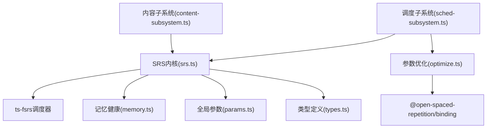
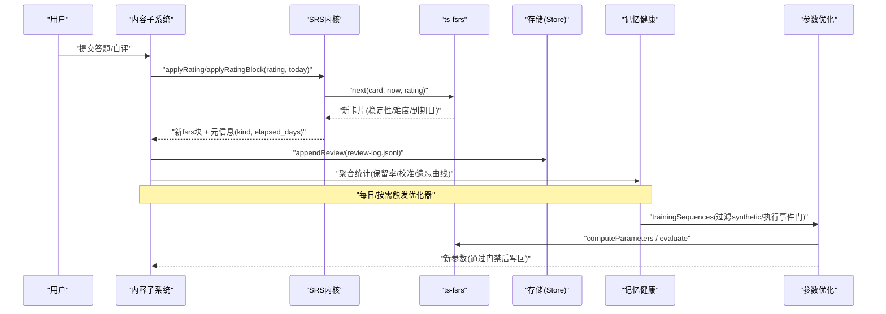
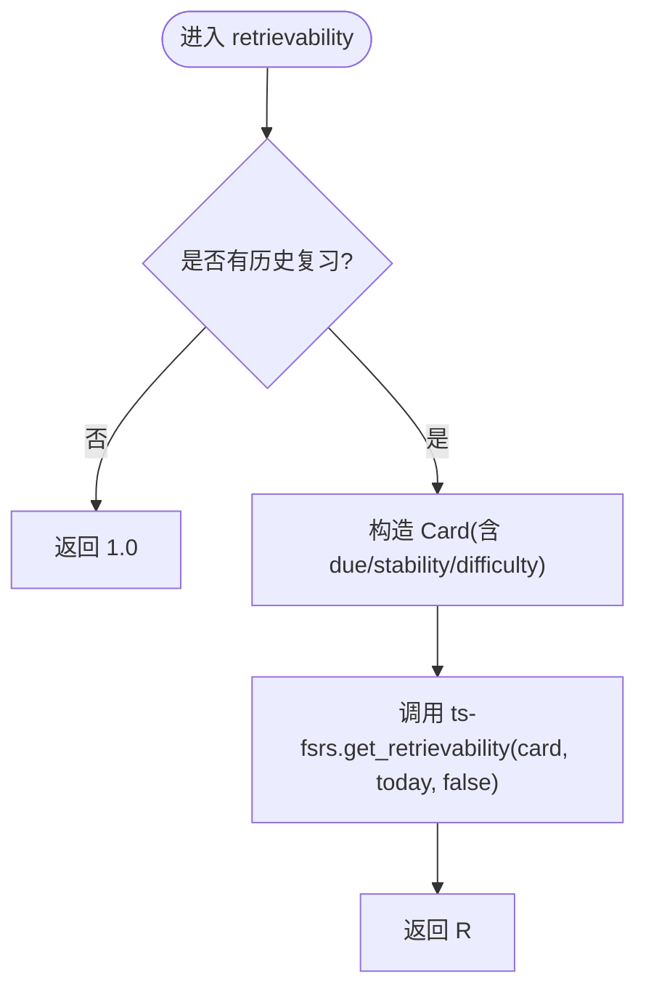
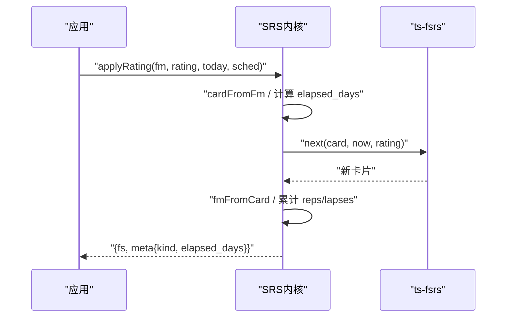
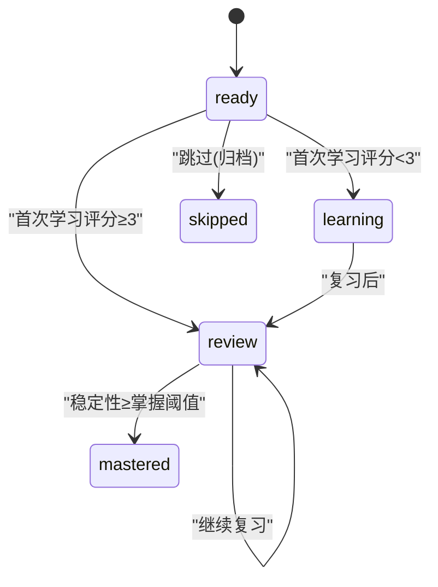
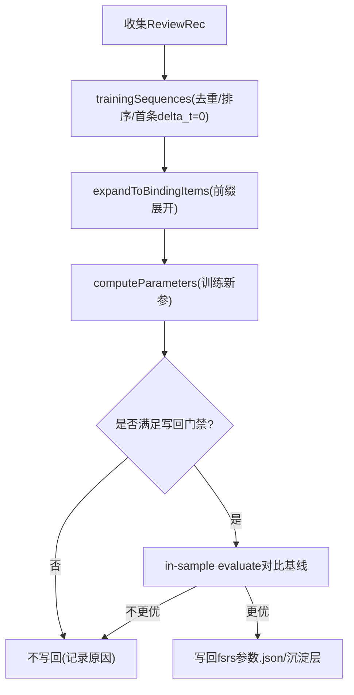
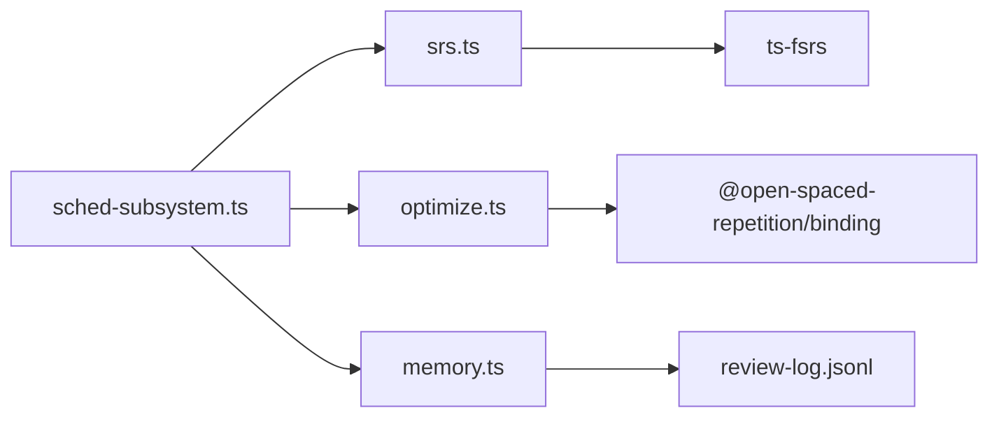

# FSRS间隔重复算法

<cite>
**本文引用的文件**
- [srs.ts](file://src/engine/srs.ts)
- [optimize.ts](file://src/engine/optimize.ts)
- [memory.ts](file://src/engine/memory.ts)
- [params.ts](file://src/engine/params.ts)
- [types.ts](file://src/engine/types.ts)
- [sched-subsystem.ts](file://src/engine/sched-subsystem.ts)
- [content-subsystem.ts](file://src/engine/content-subsystem.ts)
- [2026-09-ts-fsrs-execution-events.md](file://docs/research/2026-09-ts-fsrs-execution-events.md)
</cite>

## 目录
1. [简介](#简介)
2. [项目结构](#项目结构)
3. [核心组件](#核心组件)
4. [架构总览](#架构总览)
5. [详细组件分析](#详细组件分析)
6. [依赖关系分析](#依赖关系分析)
7. [性能与内存考虑](#性能与内存考虑)
8. [故障排查指南](#故障排查指南)
9. [结论](#结论)
10. [附录：使用示例路径](#附录使用示例路径)

## 简介
本文件系统性梳理仓库中基于 ts-fsrs 的 FSRS-6 间隔重复实现，覆盖记忆曲线计算、复习时机预测、难度调整机制、FSRS-6 参数系统（稳定性、难度、可提取性等）、卡片状态管理（new/learning/review/mastered 等阶段转换）、调度算法如何根据用户表现动态调整下次复习时间，以及遗忘曲线的个性化拟合流程。同时给出关键代码位置与调用序列图，便于快速定位与二次开发。

## 项目结构
围绕 FSRS 的核心位于 engine 层：
- srs.ts：封装 ts-fsrs 调度器、评分推进、可提取性计算、掌握度派生、阶段判定。
- optimize.ts：从真实复习日志训练 FSRS-6 参数（21 维），并通过官方 binding 评估与写回门禁。
- memory.ts：记忆健康聚合（负载预报、状态分布、真实保留率、校准与遗忘曲线）。
- params.ts：全局可调参数（期望保留率、掌握阈值等）。
- types.ts：ReviewRec、FsrsBlock、Stage 等核心类型定义。
- sched-subsystem.ts：调度子系统门面，串联完成确认、合成首刷、代表卡回刷、优化器触发等。
- content-subsystem.ts：题卡作答到 FSRS 推进与 review-log 落盘的关键入口之一。

图表来源
- [srs.ts:1-192](file://src/engine/srs.ts#L1-L192)
- [optimize.ts:1-141](file://src/engine/optimize.ts#L1-L141)
- [memory.ts:1-119](file://src/engine/memory.ts#L1-L119)
- [params.ts:1-59](file://src/engine/params.ts#L1-L59)
- [types.ts:140-339](file://src/engine/types.ts#L140-L339)
- [sched-subsystem.ts:1-200](file://src/engine/sched-subsystem.ts#L1-L200)

章节来源
- [srs.ts:1-192](file://src/engine/srs.ts#L1-L192)
- [optimize.ts:1-141](file://src/engine/optimize.ts#L1-L141)
- [memory.ts:1-119](file://src/engine/memory.ts#L1-L119)
- [params.ts:1-59](file://src/engine/params.ts#L1-L59)
- [types.ts:140-339](file://src/engine/types.ts#L140-L339)
- [sched-subsystem.ts:1-200](file://src/engine/sched-subsystem.ts#L1-L200)

## 核心组件
- SRS 内核（srs.ts）
  - 构造调度器：日粒度、无 fuzz、关闭短期学习步；参数来自沉淀正典或课程缓存或默认。
  - 卡片转换：frontmatter fsrs 块与 ts-fsrs Card 双向转换。
  - 评分推进：applyRating/applyRatingBlock 调用 ts-fsrs next() 更新稳定性、难度、到期日，并记录 reps/lapses。
  - 可提取性：retrievability/retrievabilityBlock 基于当前卡片与今日日期计算 R。
  - 阶段机：stageAfter 依据首次学习评分与稳定性阈值决定 learning/review/mastered。
  - 掌握度：masteryValue/masteryOfFm 将稳定度与练习证据 EMA 加权得到展示用掌握度。
- 参数优化（optimize.ts）
  - 训练序列构建：按卡分组、按时间排序、每卡每天仅取第一条、首条 delta_t=0。
  - 绑定扩展：将序列展开为 binding 所需的“带前缀”的训练项。
  - 训练与评估：computeParameters 训练新参；evaluateWithTimeSeriesSplits 做时序切分评估；in-sample evaluate 用于写回门禁对比。
  - 写回门禁：至少 400 条真实复习；新参必须优于基线才写回；元数据包含训练规模、指标等。
- 记忆健康（memory.ts）
  - 负载预报：未来 N 天到期量统计。
  - 状态直方图：stability/difficulty/retrievability 的分桶计数。
  - 真实保留率：过滤 synthetic 与首学推进，仅统计到期复习的真实通过率。
  - 校准与遗忘曲线：按 r_pred 与 elapsed_days 分桶，输出实际通过率。
- 全局参数（params.ts）
  - 期望保留率、掌握阈值、任务预算、复诊期等统一配置。
- 类型（types.ts）
  - ReviewRec 字段完整描述 rating/rating_source/elapsed_days/stability_before/difficulty_before/r_pred 等，是优化器与健康统计的数据契约。

章节来源
- [srs.ts:29-183](file://src/engine/srs.ts#L29-L183)
- [optimize.ts:25-141](file://src/engine/optimize.ts#L25-L141)
- [memory.ts:14-119](file://src/engine/memory.ts#L14-L119)
- [params.ts:1-59](file://src/engine/params.ts#L1-L59)
- [types.ts:168-200](file://src/engine/types.ts#L168-L200)

## 架构总览
下图展示了从用户作答到 FSRS 状态更新、日志落盘、健康统计与参数优化的整体流程。

图表来源
- [content-subsystem.ts:817-1046](file://src/engine/content-subsystem.ts#L817-L1046)
- [srs.ts:107-163](file://src/engine/srs.ts#L107-L163)
- [optimize.ts:44-126](file://src/engine/optimize.ts#L44-L126)
- [memory.ts:60-119](file://src/engine/memory.ts#L60-L119)

## 详细组件分析

### 记忆曲线与可提取性
- 可提取性 R：由 ts-fsrs 实例方法 get_retrievability 计算，输入为当前卡片与今日日期；若无复习记录视为 1.0。
- 预览到期：previewDue 在不落盘的情况下预估某评分后的下次到期日，用于交互预览。
- 遗忘曲线观测：forgettingCurve 按 elapsed_days 分桶统计真实保留率，作为模型校准与诊断依据。

图表来源
- [srs.ts:94-105](file://src/engine/srs.ts#L94-L105)
- [memory.ts:107-119](file://src/engine/memory.ts#L107-L119)

章节来源
- [srs.ts:94-105](file://src/engine/srs.ts#L94-L105)
- [memory.ts:107-119](file://src/engine/memory.ts#L107-L119)

### 复习时机预测与评分推进
- 评分映射：1→Again, 2→Hard, 3→Good, 4→Easy。
- 推进逻辑：applyRating/applyRatingBlock 将前端评分转换为 ts-fsrs Rating，调用 next() 得到新卡片，再转回 FsrsBlock 并累计 reps/lapses。
- 阶段判定：首次学习评分≥3直接进入 review，否则进入 learning；后续若稳定性达到掌握阈值则标记 mastered。

图表来源
- [srs.ts:107-141](file://src/engine/srs.ts#L107-L141)

章节来源
- [srs.ts:107-141](file://src/engine/srs.ts#L107-L141)

### 阶段管理与状态转换
- 节点级阶段：ready → learning → review → mastered（skipped 为归档态）。
- 首次学习：评分≥3 直接进 review，否则进入 learning。
- 复习后：若稳定性达到掌握阈值则进入 mastered，否则保持 review。
- 代表卡：节点 frontmatter 中的 fsrs 快照为该节点未归档题中 due 最早的一张，用于 UI 与审计。

图表来源
- [srs.ts:135-141](file://src/engine/srs.ts#L135-L141)
- [sched-subsystem.ts:124-200](file://src/engine/sched-subsystem.ts#L124-L200)

章节来源
- [srs.ts:135-141](file://src/engine/srs.ts#L135-L141)
- [sched-subsystem.ts:124-200](file://src/engine/sched-subsystem.ts#L124-L200)

### FSRS-6 参数系统与个性化拟合
- 参数来源优先级：沉淀正典 > 课程缓存 > 默认参数。
- 训练数据：review-log.jsonl 中 auto/self 的真实推进（排除 synthetic；执行事件在达到门槛后可混训）。
- 训练流程：构建 TrainingSequence → expandToBindingItems → computeParameters → evaluateWithTimeSeriesSplits（可选）→ in-sample evaluate 对比基线 → 通过门禁写回。
- 写回门禁：至少 400 条真实复习；新参需优于基线；元数据包含训练规模、指标、版本等。

图表来源
- [optimize.ts:25-141](file://src/engine/optimize.ts#L25-L141)
- [srs.ts:29-61](file://src/engine/srs.ts#L29-L61)

章节来源
- [optimize.ts:25-141](file://src/engine/optimize.ts#L25-L141)
- [srs.ts:29-61](file://src/engine/srs.ts#L29-L61)

### 复习队列与到期查询
- 负载预报：forecast 统计逾期与未来 N 天逐日到期量。
- 状态直方图：stateHistograms 对 stability/difficulty/retrievability 进行分桶统计。
- 真实保留率：dueReviewFirstPushes 过滤 synthetic 与首学推进，仅统计到期复习的真实通过率。
- 校准与遗忘曲线：calibrationBins 与 forgettingCurve 提供预测与实际对照、按间隔分桶的保留率。

章节来源
- [memory.ts:14-119](file://src/engine/memory.ts#L14-L119)

### 与内容子系统的集成
- 题卡作答：内容子系统在作答成功后调用 applyRatingBlock 推进该题 FSRS 状态，并写入 review-log。
- 忘记处理：当判定为忘记时，自动以 Again 推进并记录，同时将代表卡拉回（due 最早）。
- 代表卡回刷：节点 frontmatter 的 fsrs 快照更新为未归档题中 due 最早的一张，确保 UI 与审计一致。

章节来源
- [content-subsystem.ts:817-1046](file://src/engine/content-subsystem.ts#L817-L1046)

## 依赖关系分析
- SRS 内核依赖 ts-fsrs 提供的调度原语（fsrs、createEmptyCard、Rating、State、generatorParameters）。
- 优化器通过 @open-spaced-repetition/binding 调用 Rust 实现的优化器（computeParameters、evaluateWithTimeSeriesSplits）。
- 记忆健康模块消费 review-log.jsonl 与各课程的 fsrs 快照，产出健康面板数据。
- 调度子系统串联完成确认、合成首刷、代表卡回刷与优化器触发。

图表来源
- [srs.ts:1-20](file://src/engine/srs.ts#L1-L20)
- [optimize.ts:85-126](file://src/engine/optimize.ts#L85-L126)
- [memory.ts:1-15](file://src/engine/memory.ts#L1-L15)
- [sched-subsystem.ts:1-83](file://src/engine/sched-subsystem.ts#L1-L83)

章节来源
- [srs.ts:1-20](file://src/engine/srs.ts#L1-L20)
- [optimize.ts:85-126](file://src/engine/optimize.ts#L85-L126)
- [memory.ts:1-15](file://src/engine/memory.ts#L1-L15)
- [sched-subsystem.ts:1-83](file://src/engine/sched-subsystem.ts#L1-L83)

## 性能与内存考虑
- 日粒度调度：关闭短期学习与 fuzz，减少状态空间与计算开销。
- 训练数据归一：每卡每天仅取第一条，避免重复样本导致过拟合与冗余计算。
- 小数据保护：时序切分评估可能因数据不足失败，降级为 null 不影响门禁。
- 参数写回门禁：仅在显著更优时写回，避免频繁参数变更带来的不稳定。
- 内存友好：优化器采用延迟加载 binding（动态 import），避免构建期引入原生模块。

章节来源
- [srs.ts:51-61](file://src/engine/srs.ts#L51-L61)
- [optimize.ts:44-126](file://src/engine/optimize.ts#L44-L126)

## 故障排查指南
- 复习日志为空或过少：检查是否仅有 synthetic 初始化；真实推进需 auto/self（执行事件需达到门槛）。
- 参数未写回：确认达到最小复习数且新参 in-sample 评估优于基线；查看元数据中的 baseline_log_loss 与 log_loss。
- 阶段异常：核查首次学习评分与稳定性阈值；代表卡回刷是否正确选取 due 最早的题。
- 可提取性异常：确认 today 由学习日接口传入；无历史复习时 R=1.0 属正常。

章节来源
- [optimize.ts:25-141](file://src/engine/optimize.ts#L25-L141)
- [memory.ts:60-119](file://src/engine/memory.ts#L60-L119)
- [srs.ts:94-141](file://src/engine/srs.ts#L94-L141)

## 结论
本实现以 ts-fsrs 为核心，结合仓库内的调度子系统、内容子系统与记忆健康模块，形成完整的 FSRS-6 间隔重复闭环：评分推进 → 状态更新 → 日志落盘 → 健康统计 → 参数优化 → 写回生效。通过严格的写回门禁与日粒度调度，兼顾准确性与性能；通过多源观测（保留率、校准、遗忘曲线）持续验证与改进模型。

## 附录：使用示例路径
- 初始化 FSRS 实例（日粒度、无 fuzz、请求保留率）：[getScheduler:51-61](file://src/engine/srs.ts#L51-L61)
- 应用评分更新卡片状态（题卡级）：[applyRatingBlock:145-154](file://src/engine/srs.ts#L145-L154)
- 应用评分更新卡片状态（节点级）：[applyRating:107-133](file://src/engine/srs.ts#L107-L133)
- 查询到期复习任务（负载预报/状态直方图/真实保留率/校准/遗忘曲线）：[memory.ts:14-119](file://src/engine/memory.ts#L14-L119)
- 训练并评估个人参数（≥400 条真实复习）：[optimize.ts:113-126](file://src/engine/optimize.ts#L113-L126)
- 完成确认与合成首刷（节点进入复习循环）：[sched-subsystem.ts:124-200](file://src/engine/sched-subsystem.ts#L124-L200)
- 题卡作答到 FSRS 推进与 review-log 落盘：[content-subsystem.ts:817-1046](file://src/engine/content-subsystem.ts#L817-L1046)