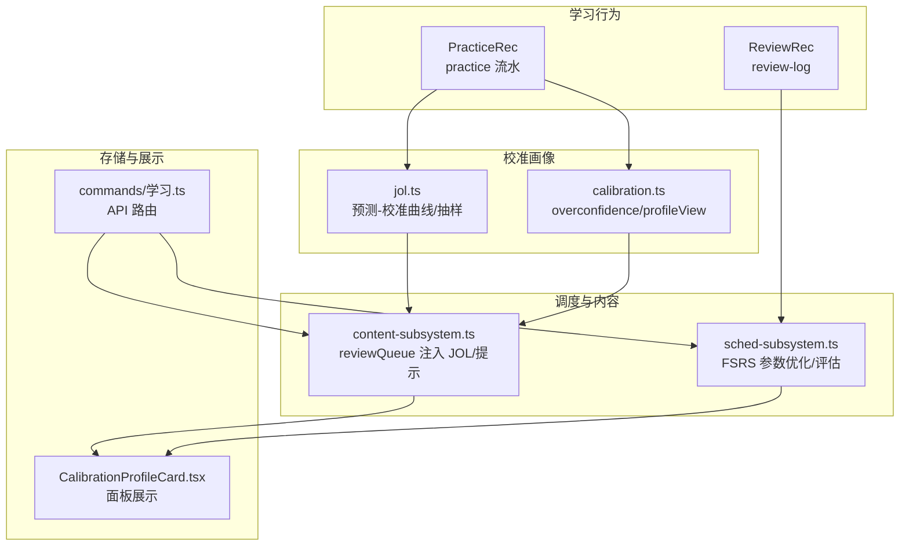
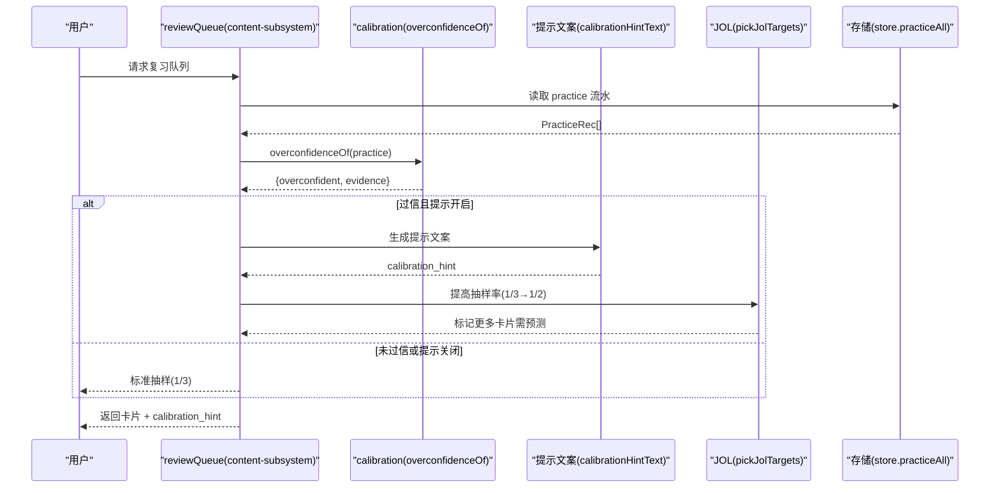
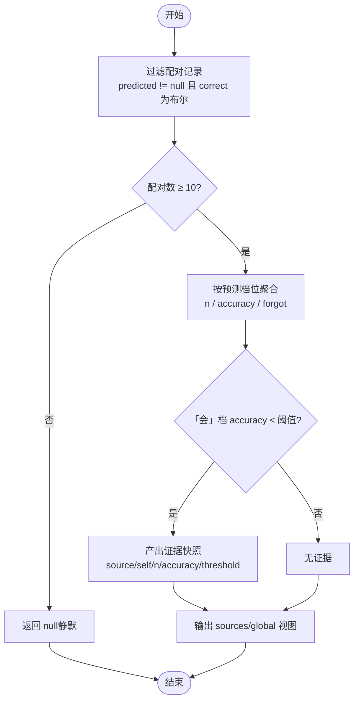
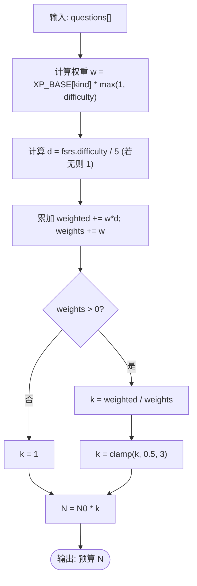
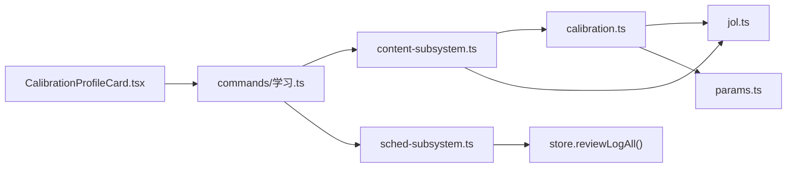

# 校准系统

<cite>
**本文引用的文件**
- [src/engine/calibration.ts](file://src/engine/calibration.ts)
- [src/engine/jol.ts](file://src/engine/jol.ts)
- [src/engine/xp.ts](file://src/engine/xp.ts)
- [src/engine/content-subsystem.ts](file://src/engine/content-subsystem.ts)
- [src/engine/sched-subsystem.ts](file://src/engine/sched-subsystem.ts)
- [src/commands/学习.ts](file://src/commands/学习.ts)
- [tests/calibration.test.ts](file://tests/calibration.test.ts)
- [docs/adr/0022-self-calibration-profile.md](file://docs/adr/0022-self-calibration-profile.md)
- [ui/src/pages/InsightPage/CalibrationProfileCard.tsx](file://ui/src/pages/InsightPage/CalibrationProfileCard.tsx)
</cite>

## 目录
1. [简介](#简介)
2. [项目结构](#项目结构)
3. [核心组件](#核心组件)
4. [架构总览](#架构总览)
5. [详细组件分析](#详细组件分析)
6. [依赖关系分析](#依赖关系分析)
7. [性能与稳定性](#性能与稳定性)
8. [故障排查指南](#故障排查指南)
9. [结论](#结论)
10. [附录：代码示例与数据格式](#附录代码示例与数据格式)

## 简介
本文件面向“校准系统”的完整说明，聚焦学习者能力画像构建机制（JOL 预测与实际表现的配对）、校准数据收集流程、难度校准因子 difficultyCalibration 的计算原理与动态预算调整、校准质量监控指标（logLoss、RMSE 分箱、预测偏差检测），以及校准结果在个性化学习路径推荐、复习计划优化和学习效果预测中的应用。文档同时提供获取校准视图、分析预测准确性、调整学习参数的具体代码示例路径，并说明数据存储格式与版本管理策略。

## 项目结构
校准系统由“自评校准画像（Self-Calibration）”与“FSRS 参数优化评估”两条主线组成：
- 自评校准画像：基于 JOL（Judgment of Learning）预测与客观作答结果的配对，生成分源自省面与全局参考视图，并在检测到系统性过信时给出轻提示与加强 JOL 抽查密度。
- FSRS 参数优化：基于真实复习日志训练个人参数，使用 logLoss/RMSE 分箱等指标评估是否优于基线，通过后落盘正典与课程缓存。

图表来源
- [src/engine/jol.ts:1-79](file://src/engine/jol.ts#L1-L79)
- [src/engine/calibration.ts:1-111](file://src/engine/calibration.ts#L1-L111)
- [src/engine/content-subsystem.ts:650-671](file://src/engine/content-subsystem.ts#L650-L671)
- [src/engine/sched-subsystem.ts:358-423](file://src/engine/sched-subsystem.ts#L358-L423)
- [ui/src/pages/InsightPage/CalibrationProfileCard.tsx:1-21](file://ui/src/pages/InsightPage/CalibrationProfileCard.tsx#L1-L21)
- [src/commands/学习.ts:42-67](file://src/commands/学习.ts#L42-L67)

章节来源
- [src/engine/calibration.ts:1-111](file://src/engine/calibration.ts#L1-L111)
- [src/engine/jol.ts:1-79](file://src/engine/jol.ts#L1-L79)
- [src/engine/content-subsystem.ts:650-671](file://src/engine/content-subsystem.ts#L650-L671)
- [src/engine/sched-subsystem.ts:358-423](file://src/engine/sched-subsystem.ts#L358-L423)
- [src/commands/学习.ts:42-67](file://src/commands/学习.ts#L42-L67)
- [ui/src/pages/InsightPage/CalibrationProfileCard.tsx:1-21](file://ui/src/pages/InsightPage/CalibrationProfileCard.tsx#L1-L21)

## 核心组件
- 自评校准画像（calibration.ts）
  - overconfidenceOf：检测「会」档的系统性过信（阈值来自 params）。
  - calibrationProfileView：按源聚合（v1 仅 jol），输出 first_ts/last_pair_ts、bins、overconfidence；global 为参考视图并带域特异警告。
  - calibrationHintText：仅在过信且证据充分时生成轻提示文案。
- JOL 预测-校准（jol.ts）
  - pickJolTargets：优先选择有信息价值的卡片进行预测抽取（R∈[0.5,0.85]、难度中段≈2、曾有偏差）。
  - jolDeviatedKeys：识别曾出现预测-结果偏差的题目键集合。
  - jolCalibration：按预测档位聚合实际正确率与忘记数，低于最小样本门槛返回 null。
- 内容子系统（content-subsystem.ts）
  - reviewQueue：当检测到过信且提示开启时，将 JOL 抽查密度从默认约 1/3 提升至 1/2，并在队列载荷中携带 calibration_hint。
- FSRS 参数优化（sched-subsystem.ts）
  - optimizeFsrsParams：基于真实复习日志训练参数，比较新参与基线的 logLoss/RMSE 分箱，若更优则写回正典与课程缓存，否则跳过并返回原因与指标。

章节来源
- [src/engine/calibration.ts:25-111](file://src/engine/calibration.ts#L25-L111)
- [src/engine/jol.ts:15-79](file://src/engine/jol.ts#L15-L79)
- [src/engine/content-subsystem.ts:650-671](file://src/engine/content-subsystem.ts#L650-L671)
- [src/engine/sched-subsystem.ts:358-423](file://src/engine/sched-subsystem.ts#L358-L423)

## 架构总览
校准系统遵循“只读派生、零 canonical 写入”的红线原则：画像与提示不改变学习者掌握度、XP 或 FSRS 评分；所有 canonical 状态由原始行为驱动。

图表来源
- [src/engine/content-subsystem.ts:650-671](file://src/engine/content-subsystem.ts#L650-L671)
- [src/engine/calibration.ts:53-67](file://src/engine/calibration.ts#L53-L67)
- [src/engine/calibration.ts:105-110](file://src/engine/calibration.ts#L105-L110)
- [src/engine/jol.ts:24-45](file://src/engine/jol.ts#L24-L45)

## 详细组件分析

### 学习者能力画像构建机制（JOL 预测 × 实际表现）
- 配对契约：同一事件同时携带自评档与客观判分即落一条配对（附源枚举与时间戳）。v1 吸收侧只有 jol（JOL 预测 × 实际作答）。
- 聚合口径：按预测档位（会/不会/没把握）统计 n、accuracy、forgot；低于最小样本门槛（JOL_CALIBRATION_MIN=10）静默不显示。
- 过信判定：「会」档的实际正确率持续低于阈值（CALIBRATION_OVERCONF_THRESHOLD）且样本足够时，视为系统性过信，并产出证据快照。
- 全局视图：合并各源作为参考视图，必须附带域特异警戒文案，强调以分源切片为准。

图表来源
- [src/engine/jol.ts:61-79](file://src/engine/jol.ts#L61-L79)
- [src/engine/calibration.ts:53-67](file://src/engine/calibration.ts#L53-L67)
- [src/engine/calibration.ts:74-103](file://src/engine/calibration.ts#L74-L103)

章节来源
- [docs/adr/0022-self-calibration-profile.md:1-27](file://docs/adr/0022-self-calibration-profile.md#L1-L27)
- [src/engine/jol.ts:15-79](file://src/engine/jol.ts#L15-L79)
- [src/engine/calibration.ts:25-111](file://src/engine/calibration.ts#L25-L111)

### 校准数据收集流程
- 学习行为追踪：practice 流水包含 predicted/correct/ts 等字段；review-log 包含 rating/rating_source 等。
- 预测准确性评估：通过 jolCalibration 计算各预测档的实际正确率；overconfidenceOf 判定系统性过信。
- 能力模型更新：画像为只读派生，不修改 canonical；FSRS 参数优化通过 sched-subsystem 独立流程完成，基于 review-log 的真实序列训练与评估。

章节来源
- [src/engine/types.ts:170-189](file://src/engine/types.ts#L170-L189)
- [src/engine/jol.ts:61-79](file://src/engine/jol.ts#L61-L79)
- [src/engine/calibration.ts:53-103](file://src/engine/calibration.ts#L53-L103)
- [src/engine/sched-subsystem.ts:358-423](file://src/engine/sched-subsystem.ts#L358-L423)

### 难度校准因子 difficultyCalibration 的计算原理与动态预算
- 计算原理：对节点内题目按权重（题型权重×静态难度）加权平均其 FSRS difficulty（中性 5），归一化后得到 k；无证据题取中性因子 1；k 被 clamp 到 [0.5, 3]。
- 动态预算：节点标称预算 N₀ 优先使用 est（内容定价），否则回落 Σ(权重×难度) 或每节点常量；最终预算 = N₀ × k。里程碑定价同理复用该 k。
- 动态调整依据：完全由认真作答产生的 FSRS difficulty 证据驱动，无人工干预，零人工干预地跟随节点实际难度。

图表来源
- [src/engine/xp.ts:45-79](file://src/engine/xp.ts#L45-L79)

章节来源
- [src/engine/xp.ts:45-79](file://src/engine/xp.ts#L45-L79)

### 校准质量监控指标
- logLoss：用于 FSRS 参数优化的评估指标，新参必须严格优于基线（默认或现参）才写回。
- RMSE 分箱：评估不同保留率/难度区间的误差分布，辅助诊断参数质量。
- 预测偏差检测：通过 jolDeviatedKeys 识别曾出现预测-结果偏差的题目，指导 JOL 抽样优先级；overconfidenceOf 检测「会」档的系统性过信。

章节来源
- [src/engine/sched-subsystem.ts:358-423](file://src/engine/sched-subsystem.ts#L358-L423)
- [src/engine/jol.ts:47-57](file://src/engine/jol.ts#L47-L57)
- [src/engine/calibration.ts:53-67](file://src/engine/calibration.ts#L53-L67)

### 校准结果的应用场景
- 个性化学习路径推荐：根据过信检测结果与偏差题目集，优先安排高信息价值题目的预测与复习，提升学习效率。
- 复习计划优化：当检测到过信且提示开启时，自动提高 JOL 抽查密度（1/3→1/2），增强自我调节。
- 学习效果预测：结合 FSRS 参数优化后的评估指标（logLoss/RMSE 分箱），判断参数是否更贴合学习者真实遗忘规律。

章节来源
- [src/engine/content-subsystem.ts:650-671](file://src/engine/content-subsystem.ts#L650-L671)
- [src/engine/sched-subsystem.ts:358-423](file://src/engine/sched-subsystem.ts#L358-L423)

## 依赖关系分析
- calibration.ts 依赖 jol.ts 的 jolCalibration 与 JOL_CALIBRATION_MIN，依赖 params.ts 的阈值。
- content-subsystem.ts 调用 overconfidenceOf 与 calibrationHintText，并结合 jolDeviatedKeys 与 pickJolTargets 实现抽样策略。
- sched-subsystem.ts 独立于画像模块，基于 review-log 训练 FSRS 参数并使用 logLoss/RMSE 分箱评估。

图表来源
- [src/engine/calibration.ts:20-24](file://src/engine/calibration.ts#L20-L24)
- [src/engine/content-subsystem.ts:650-671](file://src/engine/content-subsystem.ts#L650-L671)
- [src/engine/sched-subsystem.ts:358-423](file://src/engine/sched-subsystem.ts#L358-L423)
- [src/commands/学习.ts:42-67](file://src/commands/学习.ts#L42-L67)
- [ui/src/pages/InsightPage/CalibrationProfileCard.tsx:1-21](file://ui/src/pages/InsightPage/CalibrationProfileCard.tsx#L1-L21)

章节来源
- [src/engine/calibration.ts:20-24](file://src/engine/calibration.ts#L20-L24)
- [src/engine/content-subsystem.ts:650-671](file://src/engine/content-subsystem.ts#L650-L671)
- [src/engine/sched-subsystem.ts:358-423](file://src/engine/sched-subsystem.ts#L358-L423)
- [src/commands/学习.ts:42-67](file://src/commands/学习.ts#L42-L67)

## 性能与稳定性
- 低数据静默：当配对数不足 JOL_CALIBRATION_MIN 时，画像与过信判定均静默，避免虚假信号。
- 只读派生：画像与提示不写入 canonical 状态，保障学习行为不受干扰。
- 评估门控：FSRS 参数优化仅在 logLoss 严格优于基线时写回，防止退化。

章节来源
- [src/engine/jol.ts:18-19](file://src/engine/jol.ts#L18-L19)
- [src/engine/calibration.ts:74-103](file://src/engine/calibration.ts#L74-L103)
- [src/engine/sched-subsystem.ts:402-411](file://src/engine/sched-subsystem.ts#L402-L411)

## 故障排查指南
- 画像为空或 bins 为 null：检查 practice 流水中是否有足够的配对记录（predicted 非空且 correct 为布尔），且数量达到 JOL_CALIBRATION_MIN。
- 未触发过信提示：确认提示开关已启用，且「会」档实际正确率低于阈值并有足够样本。
- FSRS 参数优化被跳过：检查真实复习日志条数是否达到门槛（≥400），以及新参评估是否优于基线（logLoss）。

章节来源
- [src/engine/jol.ts:61-79](file://src/engine/jol.ts#L61-L79)
- [src/engine/calibration.ts:53-67](file://src/engine/calibration.ts#L53-L67)
- [src/engine/sched-subsystem.ts:376-411](file://src/engine/sched-subsystem.ts#L376-L411)

## 结论
校准系统以“自评校准画像”为核心，通过 JOL 预测与实际表现的配对分析，提供分源自省面与全局参考视图，并在检测到系统性过信时给予轻提示与加强抽样。难度校准因子 difficultyCalibration 基于 FSRS difficulty 的动态加权，支撑学习预算的自适应调整。FSRS 参数优化通过 logLoss/RMSE 分箱等指标确保参数质量。整体设计遵循只读派生、零 canonical 写入的红线，保障学习者体验与数据真实性。

## 附录：代码示例与数据格式

### 获取校准视图
- 命令入口：GET /calibration/profile
- 引擎方法：learner.calibrationProfile
- 返回结构：sources（含 source/first_ts/last_pair_ts/calibration/overconfidence）、global（含 calibration 与 warning）

示例路径
- [src/commands/学习.ts:48-67](file://src/commands/学习.ts#L48-L67)
- [src/engine/calibration.ts:74-103](file://src/engine/calibration.ts#L74-L103)

### 分析预测准确性
- 函数：jolCalibration
- 输入：PracticeRec[]
- 输出：{ pairs, bins } 或 null（低于门槛）

示例路径
- [src/engine/jol.ts:61-79](file://src/engine/jol.ts#L61-L79)

### 调整学习参数（FSRS 优化）
- 命令入口：optimize-params
- 引擎方法：sched2.optimizeFsrsParams
- 评估指标：logLoss、rmse_bins、split_log_loss、split_rmse_bins

示例路径
- [src/commands/维护.ts:168-181](file://src/commands/维护.ts#L168-L181)
- [src/engine/sched-subsystem.ts:358-423](file://src/engine/sched-subsystem.ts#L358-L423)

### 数据存储格式与版本管理
- practice 流水：JSONL，字段包括 ts/course/node/qid/answer/correct/judge/predicted/xp/elapsed_s 等。
- review-log：JSONL，字段包括 ts/course/node/qid/rating/rating_source/elapsed_days 等。
- FSRS 参数：每个启用课程的 fsrs参数.json 作为缓存镜像，正典位于沉淀（fsrs_params 事件），失败可降级回正典。
- 版本管理：参数优化写回包含训练元数据（count/date/metrics），便于回溯与审计。

示例路径
- [src/engine/types.ts:170-189](file://src/engine/types.ts#L170-L189)
- [src/engine/sched-subsystem.ts:412-423](file://src/engine/sched-subsystem.ts#L412-L423)