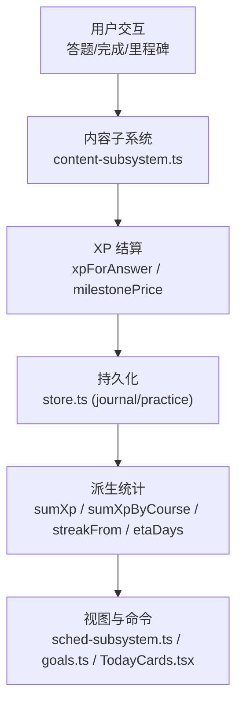
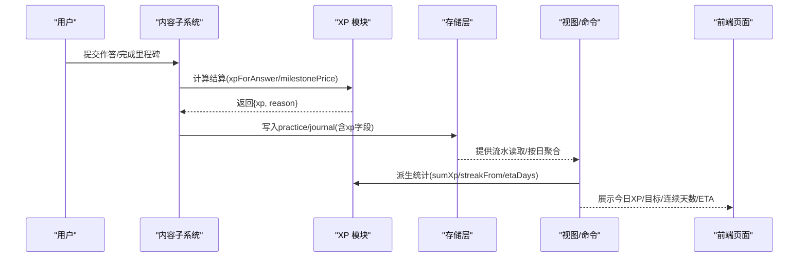
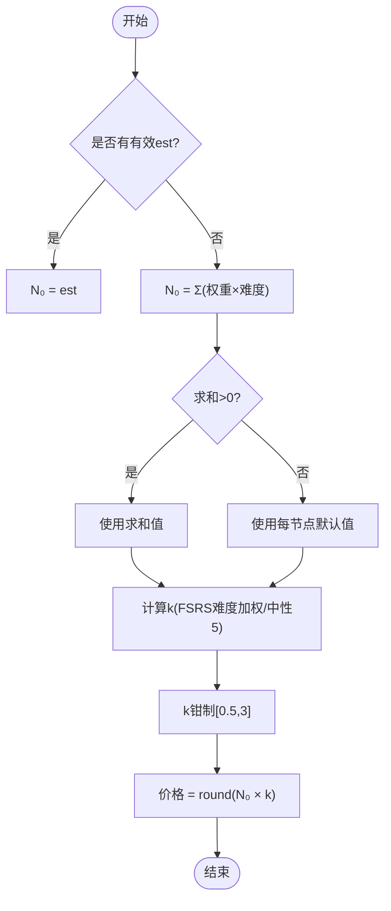
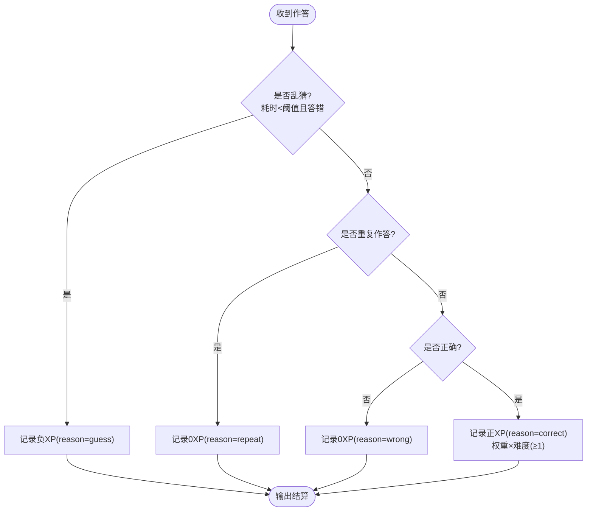
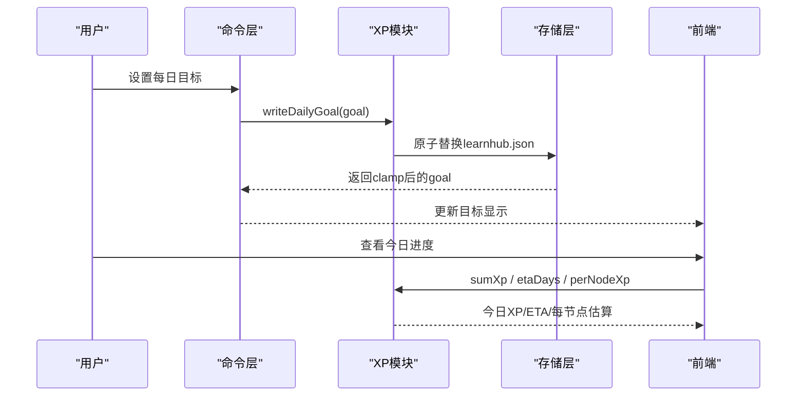
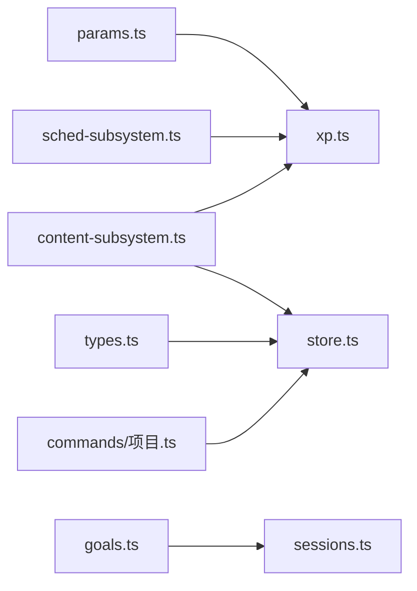

# 经验值系统

<cite>
**本文引用的文件**
- [src/engine/xp.ts](file://src/engine/xp.ts)
- [src/engine/params.ts](file://src/engine/params.ts)
- [src/engine/types.ts](file://src/engine/types.ts)
- [src/engine/sessions.ts](file://src/engine/sessions.ts)
- [src/engine/goals.ts](file://src/engine/goals.ts)
- [src/engine/store.ts](file://src/engine/store.ts)
- [src/engine/content-subsystem.ts](file://src/engine/content-subsystem.ts)
- [src/engine/sched-subsystem.ts](file://src/engine/sched-subsystem.ts)
- [src/commands/项目.ts](file://src/commands/项目.ts)
- [tests/milestone-settle.test.ts](file://tests/milestone-settle.test.ts)
- [tests/streak-grace.test.ts](file://tests/streak-grace.test.ts)
- [ui/src/pages/TodayPage/TodayCards.tsx](file://ui/src/pages/TodayPage/TodayCards.tsx)
</cite>

## 目录
1. [简介](#简介)
2. [项目结构](#项目结构)
3. [核心组件](#核心组件)
4. [架构总览](#架构总览)
5. [详细组件分析](#详细组件分析)
6. [依赖关系分析](#依赖关系分析)
7. [性能考量](#性能考量)
8. [故障排查指南](#故障排查指南)
9. [结论](#结论)
10. [附录：代码级示例路径](#附录代码级示例路径)

## 简介
本文件系统化阐述学习中心的“经验值（XP）系统”，围绕预算制设计、内容价值评估、每日目标与进度追踪、账本与冲正、成就与激励等维度展开。该系统以“行为流水即事实”的会计原则为核心，所有派生指标（如 streak、ETA、里程碑过点 XP）均由 practice/journal 两类流水计算得出，避免额外数据文件带来的不一致性。

## 项目结构
- 预算与定价：xp.ts 提供节点预算 N₀×k、里程碑定价、乱猜惩罚、连续打卡与 ETA 估算等纯函数；params.ts 集中 XP 相关常量。
- 目标与推荐：goals.ts 提供当日 pin 与执行意图归一化，配合 sessions.ts 将 pin 事件注入推荐排序。
- 数据持久化：store.ts 负责 journal/practice JSONL 追加与按日聚合；types.ts 定义 PracticeRec/JournalRec 等类型契约。
- 业务集成：content-subsystem.ts 在作答结算时写入 xp/xp_reason；sched-subsystem.ts 暴露设置每日目标/日界能力；项目命令层通过 project-milestone-pass 触发里程碑过点对账。
- 前端展示：TodayCards.tsx 展示今日 XP、目标、连续天数与调整目标入口。



图表来源
- [src/engine/content-subsystem.ts:840-848](file://src/engine/content-subsystem.ts#L840-L848)
- [src/engine/xp.ts:20-79](file://src/engine/xp.ts#L20-L79)
- [src/engine/store.ts:51-96](file://src/engine/store.ts#L51-L96)
- [src/engine/sessions.ts:96-120](file://src/engine/sessions.ts#L96-L120)
- [src/engine/sched-subsystem.ts:312-321](file://src/engine/sched-subsystem.ts#L312-L321)
- [ui/src/pages/TodayPage/TodayCards.tsx:21-35](file://ui/src/pages/TodayPage/TodayCards.tsx#L21-L35)

章节来源
- [src/engine/xp.ts:1-184](file://src/engine/xp.ts#L1-L184)
- [src/engine/params.ts:1-59](file://src/engine/params.ts#L1-L59)
- [src/engine/types.ts:132-200](file://src/engine/types.ts#L132-L200)
- [src/engine/store.ts:46-96](file://src/engine/store.ts#L46-L96)
- [src/engine/content-subsystem.ts:840-848](file://src/engine/content-subsystem.ts#L840-L848)
- [src/engine/sched-subsystem.ts:312-321](file://src/engine/sched-subsystem.ts#L312-L321)
- [ui/src/pages/TodayPage/TodayCards.tsx:21-35](file://ui/src/pages/TodayPage/TodayCards.tsx#L21-L35)

## 核心组件
- 预算与定价
  - 节点预算 N₀：优先使用节点 est（分钟），缺省回落为题目权重×难度之和，再缺省使用每节点默认值。
  - 难度校准 k：基于 FSRS difficulty 加权平均并钳制到 [0.5, 3]，无证据取中性 1。
  - 里程碑定价：N₀=est 或默认常量，k 复用题池难度校准，结果锁定且不可重复入账。
- 作答结算
  - 正确：权重×难度，至少 1 XP。
  - 错误：0 XP。
  - 乱猜：耗时极短且答错，负 XP（保持账本诚实）。
  - 同日重复：0 XP（防刷）。
- 每日目标与日界
  - 目标可读写，落盘 learnhub.json；非法值 clamp 到安全范围。
  - 日界 day_cutoff 可配置，影响“今天”的归属与 streak/ETA 口径。
- 派生指标
  - 连续打卡 streak：宽容漏天（默认 1 天），不改变账本口径。
  - ETA：剩余节点 × 每节点 XP ÷ 每日目标，向上取整。
  - 每节点历史估算：课程累计 XP ÷ 已完成节点数。

章节来源
- [src/engine/xp.ts:20-79](file://src/engine/xp.ts#L20-L79)
- [src/engine/xp.ts:81-120](file://src/engine/xp.ts#L81-L120)
- [src/engine/xp.ts:122-183](file://src/engine/xp.ts#L122-L183)
- [src/engine/params.ts:19-31](file://src/engine/params.ts#L19-L31)

## 架构总览
下图展示了从用户行为到 XP 账本与派生指标的完整链路，包括预算定价、作答结算、日志落盘、派生统计与前端展示。



图表来源
- [src/engine/content-subsystem.ts:840-848](file://src/engine/content-subsystem.ts#L840-L848)
- [src/engine/xp.ts:20-79](file://src/engine/xp.ts#L20-L79)
- [src/engine/store.ts:51-96](file://src/engine/store.ts#L51-L96)
- [src/engine/sessions.ts:96-120](file://src/engine/sessions.ts#L96-L120)
- [ui/src/pages/TodayPage/TodayCards.tsx:21-35](file://ui/src/pages/TodayPage/TodayCards.tsx#L21-L35)

## 详细组件分析

### 预算制与内容价值评估（N₀×k）
- 节点预算 N₀：优先采用节点 est（分钟），否则回落到题目侧 Σ(权重×难度)，再缺省使用每节点默认值。
- 难度校准 k：对题池的 FSRS difficulty 做权重平均，并以中性值 5 为基准折算，最终钳制到 [0.5, 3]；无证据时取 1。
- 里程碑定价：沿用 N₀×k 口径，N₀ 来自计划 est 或默认常量，k 复用关联节点题池校准；过点一次性入账并锁定，重复过点拒绝。



图表来源
- [src/engine/xp.ts:45-79](file://src/engine/xp.ts#L45-L79)
- [src/engine/params.ts:17-31](file://src/engine/params.ts#L17-L31)

章节来源
- [src/engine/xp.ts:45-79](file://src/engine/xp.ts#L45-L79)
- [src/engine/params.ts:17-31](file://src/engine/params.ts#L17-L31)
- [tests/milestone-settle.test.ts:20-28](file://tests/milestone-settle.test.ts#L20-L28)

### 作答结算规则（基础XP、满分bonus、乱猜惩罚、重复防护）
- 基础 XP：正确时按题型权重×难度计算，最小为 1。
- 乱猜惩罚：耗时极短且答错记负 XP，体现时间账本诚实性。
- 重复作答：同日已推进调度则计 0，防止刷分。
- 满分 bonus：通过 journal 的 kind='xp_bonus' 入账，计入当日 XP 与 streak。



图表来源
- [src/engine/xp.ts:20-34](file://src/engine/xp.ts#L20-L34)
- [src/engine/types.ts:147-166](file://src/engine/types.ts#L147-L166)
- [src/engine/content-subsystem.ts:840-848](file://src/engine/content-subsystem.ts#L840-L848)

章节来源
- [src/engine/xp.ts:20-34](file://src/engine/xp.ts#L20-L34)
- [src/engine/types.ts:147-166](file://src/engine/types.ts#L147-L166)
- [src/engine/content-subsystem.ts:840-848](file://src/engine/content-subsystem.ts#L840-L848)

### 每日目标与进度追踪（ETA、完成度、学习节奏）
- 每日目标：read/write 接口落盘 learnhub.json，非法值 clamp 到安全区间。
- 日界：day_cutoff 决定“今天”的边界，影响 streak/ETA 的按日划分。
- ETA：剩余节点 × 每节点 XP ÷ 每日目标，向上取整。
- 每节点历史估算：课程累计 XP ÷ 已完成节点数，用于更贴近实际的 ETA。
- 连续打卡：streakFrom 宽容漏天（默认 1 天），不改变账本口径。



图表来源
- [src/engine/xp.ts:81-120](file://src/engine/xp.ts#L81-L120)
- [src/engine/xp.ts:173-183](file://src/engine/xp.ts#L173-L183)
- [src/engine/sched-subsystem.ts:312-321](file://src/engine/sched-subsystem.ts#L312-L321)
- [ui/src/pages/TodayPage/TodayCards.tsx:21-35](file://ui/src/pages/TodayPage/TodayCards.tsx#L21-L35)

章节来源
- [src/engine/xp.ts:81-120](file://src/engine/xp.ts#L81-L120)
- [src/engine/xp.ts:173-183](file://src/engine/xp.ts#L173-L183)
- [src/engine/sched-subsystem.ts:312-321](file://src/engine/sched-subsystem.ts#L312-L321)
- [ui/src/pages/TodayPage/TodayCards.tsx:21-35](file://ui/src/pages/TodayPage/TodayCards.tsx#L21-L35)

### 经验值账本系统（实践记录、日志流水、冲正机制）
- 实践记录：practice 流水携带本次作答的 xp 与 reason，作为事实源。
- 日志流水：journal 承载非作答入账（如 xp_bonus、milestone_settle），同样参与 sumXp 与 streak。
- 冲正机制：通过追加型日志实现更正与审计（例如里程碑过点只写一行，重复过点拒绝），保证账目可追溯。
- 并发访问控制：JSONL 追加由文件系统保障顺序；读侧通过读取全量后聚合，避免脏读。

```mermaid
classDiagram
class Store {
+appendJournal(rec) JournalRec
+journalTail(course, limit) JournalRec[]
+activityCounts(cutoffMin) Record<string,{...}>
}
class PracticeRec {
+ts
+course
+node
+ex
+answer
+correct
+judge
+qid?
+feedback?
+elapsed_s?
+xp?
+predicted?
}
class JournalRec {
+ts
+course
+node
+rating
+kind
+elapsed_days
+session?
+duration_s?
+detail?
+xp?
}
Store --> PracticeRec : "读取/聚合"
Store --> JournalRec : "读取/聚合"
```

图表来源
- [src/engine/store.ts:46-96](file://src/engine/store.ts#L46-L96)
- [src/engine/types.ts:132-200](file://src/engine/types.ts#L132-L200)

章节来源
- [src/engine/store.ts:46-96](file://src/engine/store.ts#L46-L96)
- [src/engine/types.ts:132-200](file://src/engine/types.ts#L132-L200)

### 成就系统与激励机制（里程碑、徽章、排行榜）
- 里程碑过点：显式动作触发 journal kind='milestone_settle'，定价=est×k，锁定不可重复入账；计入 today_xp 与 streak。
- 徽章/排行榜：当前仓库未实现独立徽章与排行榜逻辑；可通过 streak、today_xp、里程碑过点次数等派生指标在前端进行可视化呈现。

章节来源
- [src/commands/项目.ts:277-298](file://src/commands/项目.ts#L277-L298)
- [tests/milestone-settle.test.ts:75-108](file://tests/milestone-settle.test.ts#L75-L108)
- [tests/milestone-settle.test.ts:111-133](file://tests/milestone-settle.test.ts#L111-L133)

## 依赖关系分析
- xp.ts 依赖 params.ts 中的 XP 常量与 FSRS 中性值；依赖 dates.ts 进行日期解析与格式化。
- content-subsystem.ts 调用 xp 结算并将结果写入 practice 流水。
- store.ts 提供 journal/practice 的追加与聚合，被 sched-subsystem 与 views 消费。
- goals.ts 提供 pin 与执行意图，sessions.ts 将其纳入推荐事件。
- 项目命令层通过 project-milestone-pass 触发里程碑过点，写入 journal。



图表来源
- [src/engine/params.ts:19-31](file://src/engine/params.ts#L19-L31)
- [src/engine/xp.ts:1-184](file://src/engine/xp.ts#L1-L184)
- [src/engine/types.ts:132-200](file://src/engine/types.ts#L132-L200)
- [src/engine/store.ts:46-96](file://src/engine/store.ts#L46-L96)
- [src/engine/content-subsystem.ts:840-848](file://src/engine/content-subsystem.ts#L840-L848)
- [src/engine/sessions.ts:96-120](file://src/engine/sessions.ts#L96-L120)
- [src/commands/项目.ts:277-298](file://src/commands/项目.ts#L277-L298)

章节来源
- [src/engine/params.ts:19-31](file://src/engine/params.ts#L19-L31)
- [src/engine/xp.ts:1-184](file://src/engine/xp.ts#L1-L184)
- [src/engine/store.ts:46-96](file://src/engine/store.ts#L46-L96)
- [src/engine/content-subsystem.ts:840-848](file://src/engine/content-subsystem.ts#L840-L848)
- [src/engine/sessions.ts:96-120](file://src/engine/sessions.ts#L96-L120)
- [src/commands/项目.ts:277-298](file://src/commands/项目.ts#L277-L298)

## 性能考量
- 预算与定价均为 O(n) 遍历题池，n 为节点题数，通常较小，开销可忽略。
- 派生统计 sumXp/streakFrom 需扫描 practice/journal 全量，建议在视图层缓存或增量聚合以降低冷启动成本。
- JSONL 追加为顺序写，读侧全量扫描适合中小规模；若数据量大，建议引入索引或分区策略。

## 故障排查指南
- 乱猜惩罚导致负 XP：检查 elapsed_s 是否低于阈值且 correct=false；确认未误判重复作答。
- 重复作答 0 XP：确认该题当日是否已推进调度；必要时重置调度或等待次日。
- 里程碑重复过点拒绝：检查是否已存在对应 milestone_settle 记录；如需修订计划，应使用新的里程碑 id。
- 日界异常：校验 day_cutoff 格式为 HH:mm；非法值会抛错，需修正配置。
- streak 断链：确认 byDay 聚合是否正确；宽容漏天不会改变账本口径，仅影响 streak 读法。

章节来源
- [src/engine/xp.ts:20-34](file://src/engine/xp.ts#L20-L34)
- [src/engine/xp.ts:103-120](file://src/engine/xp.ts#L103-L120)
- [tests/milestone-settle.test.ts:136-149](file://tests/milestone-settle.test.ts#L136-L149)
- [tests/streak-grace.test.ts:1-78](file://tests/streak-grace.test.ts#L1-L78)

## 结论
XP 系统以“行为流水即事实”为核心，通过预算制 N₀×k 将内容价值与客观难度对齐，结合乱猜惩罚与重复防护确保账本诚实。每日目标与日界提供个性化节奏控制，streak/ETA 帮助学习者感知进度。里程碑过点以显式动作入账，形成项目域唯一 journal 写入点。整体设计简洁、可扩展，便于后续接入徽章与排行榜等激励功能。

## 附录：代码级示例路径
- 计算节点预算（N₀×k）
  - 参考：[src/engine/xp.ts:45-79](file://src/engine/xp.ts#L45-L79)
- 查询 XP 状态（今日 XP、目标、连续天数、ETA）
  - 参考：[src/engine/xp.ts:122-183](file://src/engine/xp.ts#L122-L183)
  - 参考：[src/engine/sched-subsystem.ts:312-321](file://src/engine/sched-subsystem.ts#L312-L321)
- 设置每日目标
  - 参考：[src/engine/xp.ts:81-101](file://src/engine/xp.ts#L81-L101)
  - 参考：[src/engine/sched-subsystem.ts:312-321](file://src/engine/sched-subsystem.ts#L312-L321)
- 里程碑过点对账
  - 参考：[src/commands/项目.ts:277-298](file://src/commands/项目.ts#L277-L298)
  - 参考：[tests/milestone-settle.test.ts:75-108](file://tests/milestone-settle.test.ts#L75-L108)
- 作答结算与写入
  - 参考：[src/engine/content-subsystem.ts:840-848](file://src/engine/content-subsystem.ts#L840-L848)
  - 参考：[src/engine/xp.ts:20-34](file://src/engine/xp.ts#L20-L34)
- 连续打卡与宽容机制
  - 参考：[src/engine/xp.ts:147-171](file://src/engine/xp.ts#L147-L171)
  - 参考：[tests/streak-grace.test.ts:1-78](file://tests/streak-grace.test.ts#L1-L78)