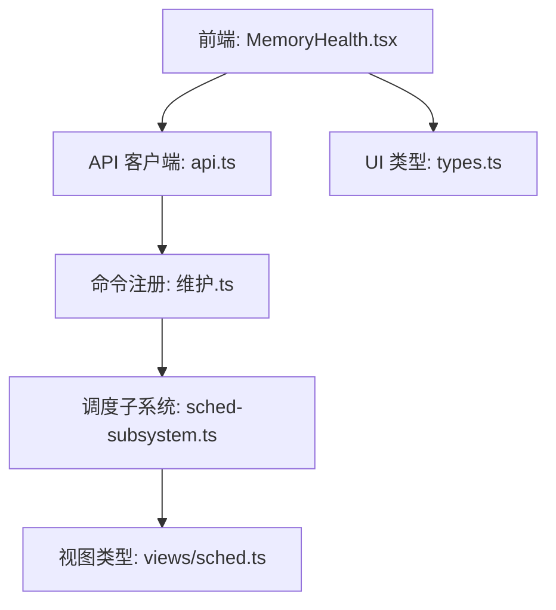
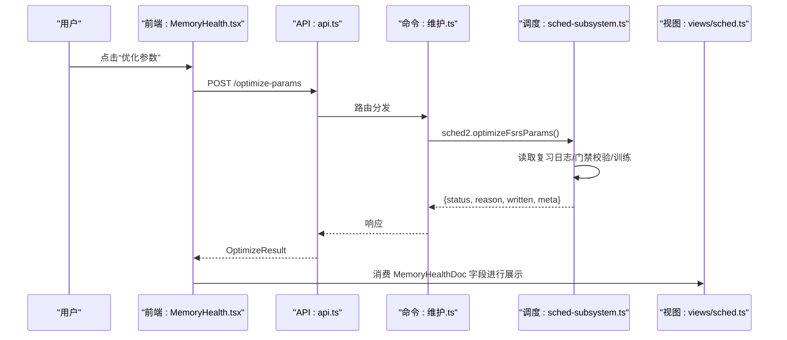
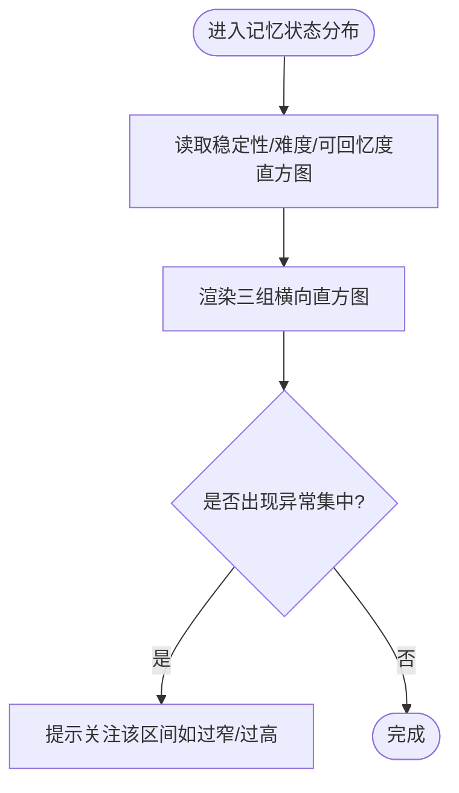
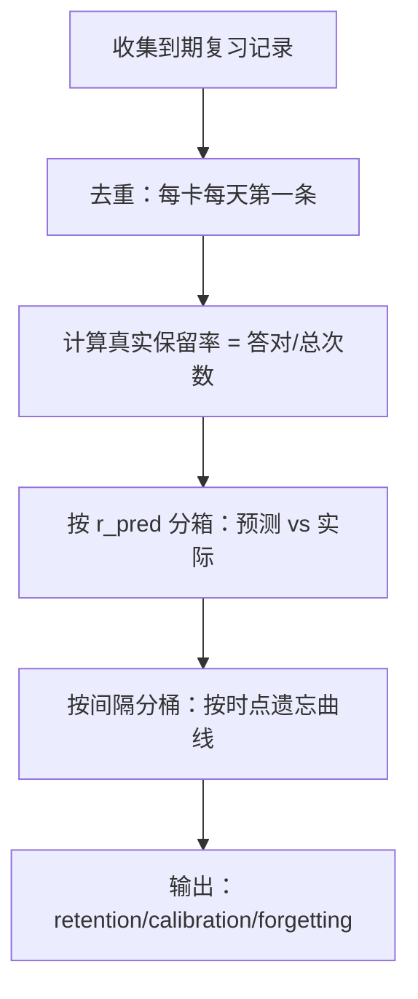
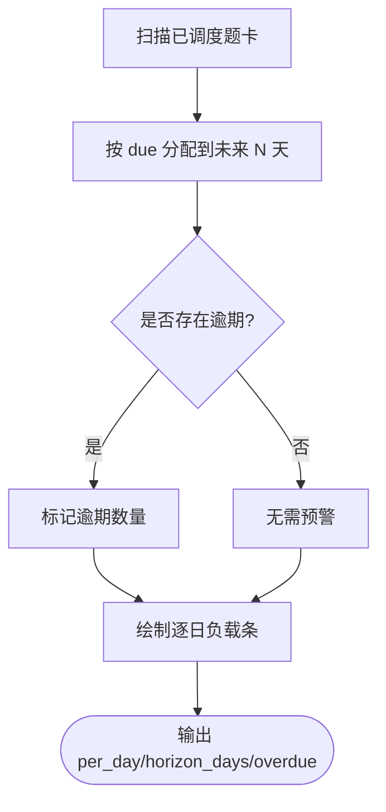
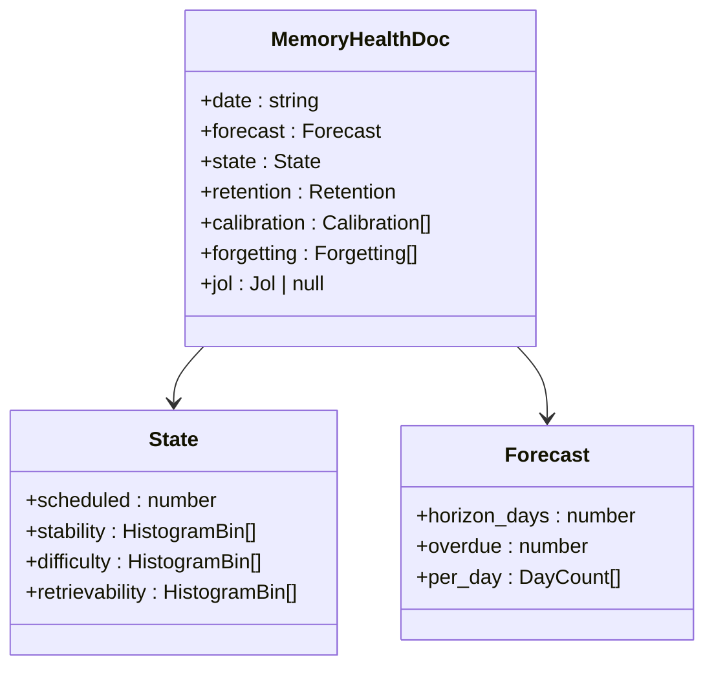
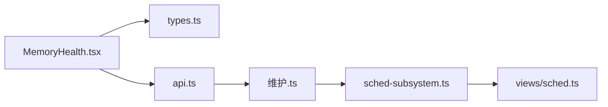

# 记忆健康仪表盘

<cite>
**本文引用的文件**
- [src/engine/views/sched.ts](file://src/engine/views/sched.ts)
- [ui/src/pages/InsightPage/MemoryHealth.tsx](file://ui/src/pages/InsightPage/MemoryHealth.tsx)
- [ui/src/types.ts](file://ui/src/types.ts)
- [ui/src/api.ts](file://ui/src/api.ts)
- [src/commands/维护.ts](file://src/commands/维护.ts)
- [src/engine/sched-subsystem.ts](file://src/engine/sched-subsystem.ts)
- [tests/memory-health.test.ts](file://tests/memory-health.test.ts)
- [CONTEXT.md](file://CONTEXT.md)
</cite>

## 目录
1. [简介](#简介)
2. [项目结构](#项目结构)
3. [核心组件](#核心组件)
4. [架构总览](#架构总览)
5. [详细组件分析](#详细组件分析)
6. [依赖关系分析](#依赖关系分析)
7. [性能与采样策略](#性能与采样策略)
8. [故障排查指南](#故障排查指南)
9. [结论](#结论)
10. [附录：使用示例与阈值设置](#附录使用示例与阈值设置)

## 简介
本文件面向“记忆健康仪表盘”，系统性说明其指标口径、可视化呈现、遗忘曲线分析、复习负载预报、记忆状态分布与健康评估，以及报告生成与个性化提醒。文档同时给出数据获取、报告生成、阈值设置的代码级路径指引，并讨论采样策略与性能优化建议。

## 项目结构
记忆健康仪表盘由“前端展示层 + 引擎视图类型 + 命令注册与调度子系统”三部分构成：
- 前端展示层：洞察页中的“记忆健康”区块，负责直方图、逐日负载、保留率曲线、预测校准等可视化。
- 引擎视图类型：MemoryHealthDoc 定义仪表盘的数据契约（预报、状态分布、真实保留率、校准、遗忘曲线、JOL）。
- 命令与调度：通过命令注册表暴露“FSRS 参数优化”等能力；调度子系统提供 memoryHealth 聚合计算与 optimizeFsrsParams 重训流程。

图表来源
- [ui/src/pages/InsightPage/MemoryHealth.tsx:1-301](file://ui/src/pages/InsightPage/MemoryHealth.tsx#L1-L301)
- [ui/src/api.ts:1-200](file://ui/src/api.ts#L1-L200)
- [src/commands/维护.ts:153-181](file://src/commands/维护.ts#L153-L181)
- [src/engine/sched-subsystem.ts:358-381](file://src/engine/sched-subsystem.ts#L358-L381)
- [src/engine/views/sched.ts:1-39](file://src/engine/views/sched.ts#L1-L39)
- [ui/src/types.ts:34-52](file://ui/src/types.ts#L34-L52)

章节来源
- [ui/src/pages/InsightPage/MemoryHealth.tsx:1-301](file://ui/src/pages/InsightPage/MemoryHealth.tsx#L1-L301)
- [src/engine/views/sched.ts:1-39](file://src/engine/views/sched.ts#L1-L39)
- [ui/src/types.ts:34-52](file://ui/src/types.ts#L34-L52)

## 核心组件
- 记忆健康视图契约（MemoryHealthDoc）：统一描述仪表盘所需的全部字段，包括每日负载预报、记忆状态分布、真实保留率、预测校准、按时点遗忘曲线、JOL 校准等。
- 前端面板（MemoryHealthBody）：将上述数据渲染为直方图、逐日负载条、保留率曲线与预测校准区，并提供 FSRS 参数优化入口。
- 命令与调度：
  - 命令注册：optimize-params 暴露手动触发 FSRS 个人参数重训的入口。
  - 调度子系统：实现 optimizeFsrsParams，包含数据准备、门禁校验、写回与元信息返回。

章节来源
- [src/engine/views/sched.ts:11-25](file://src/engine/views/sched.ts#L11-L25)
- [ui/src/pages/InsightPage/MemoryHealth.tsx:76-131](file://ui/src/pages/InsightPage/MemoryHealth.tsx#L76-L131)
- [src/commands/维护.ts:168-181](file://src/commands/维护.ts#L168-L181)
- [src/engine/sched-subsystem.ts:361-381](file://src/engine/sched-subsystem.ts#L361-L381)

## 架构总览
仪表盘的数据流从引擎聚合到前端展示，关键路径如下：
- 前端请求：通过 api.ts 调用 /jol、/calibration/hints、/optimize-params 等接口。
- 命令路由：维护.ts 将 optimize-params 映射到 sched2.optimizeFsrsParams。
- 调度计算：sched-subsystem.ts 读取复习日志、训练参数、执行门禁与写回。
- 视图类型：views/sched.ts 定义 MemoryHealthDoc 作为前后端共享契约。

图表来源
- [ui/src/pages/InsightPage/MemoryHealth.tsx:76-131](file://ui/src/pages/InsightPage/MemoryHealth.tsx#L76-L131)
- [ui/src/api.ts:175-177](file://ui/src/api.ts#L175-L177)
- [src/commands/维护.ts:168-181](file://src/commands/维护.ts#L168-L181)
- [src/engine/sched-subsystem.ts:361-381](file://src/engine/sched-subsystem.ts#L361-L381)
- [src/engine/views/sched.ts:11-25](file://src/engine/views/sched.ts#L11-L25)

## 详细组件分析

### 记忆状态监控指标与可视化
- 维度说明
  - Stability（记忆强度，天）：卡片当前稳定度区间分布，用于观察整体记忆巩固水平。
  - Difficulty（题目难度，FSRS 难度）：卡片难度区间分布，反映题库难度结构。
  - Retrievability（当前可回忆度 R）：卡片当前可被回忆的概率分布，体现即时可提取性。
- 可视化方式
  - 横向直方图：以 bins 形式展示各区间计数，便于快速识别集中趋势与异常堆积。
  - 已调度题卡数：聚合跨课程已调度数量，作为分母与上下文。

图表来源
- [ui/src/pages/InsightPage/MemoryHealth.tsx:163-180](file://ui/src/pages/InsightPage/MemoryHealth.tsx#L163-L180)
- [src/engine/views/sched.ts:15-16](file://src/engine/views/sched.ts#L15-L16)

章节来源
- [ui/src/pages/InsightPage/MemoryHealth.tsx:163-180](file://ui/src/pages/InsightPage/MemoryHealth.tsx#L163-L180)
- [src/engine/views/sched.ts:15-16](file://src/engine/views/sched.ts#L15-L16)

### 遗忘曲线分析与真实保留率
- 真实保留率（True Retention）
  - 口径：到期复习中实际答对的比例；每卡每天只取第一次推进；仅统计真实作答（不含合成初始化）。
  - 展示：总体比例、答对/答错计数；当无数据时 rate 为 null。
- 预测 vs 真实（校准）
  - 按 FSRS 自预测保留率分箱，比较预测与实际正确率，评估模型校准质量。
- 按时点遗忘曲线
  - 按间隔分桶统计保留率，形成随时间衰减的曲线形态，辅助判断学习节奏与复习效果。

图表来源
- [CONTEXT.md:51-53](file://CONTEXT.md#L51-L53)
- [src/engine/views/sched.ts:17-22](file://src/engine/views/sched.ts#L17-L22)
- [ui/src/pages/InsightPage/MemoryHealth.tsx:182-237](file://ui/src/pages/InsightPage/MemoryHealth.tsx#L182-L237)

章节来源
- [CONTEXT.md:51-53](file://CONTEXT.md#L51-L53)
- [src/engine/views/sched.ts:17-22](file://src/engine/views/sched.ts#L17-L22)
- [ui/src/pages/InsightPage/MemoryHealth.tsx:182-237](file://ui/src/pages/InsightPage/MemoryHealth.tsx#L182-L237)

### 复习负载预报机制
- 功能要点
  - 未来 N 天的到期量预报（假设不再学新卡且不遗忘），标注逾期数量。
  - 逐日条形图展示每日到期量，帮助规划学习与复习节奏。
- 数据来源与口径
  - 基于已调度题卡的 due 日期聚合；远期卡计入状态分布但不摊入预报窗口。
- 压力预警
  - 若 overdue > 0，界面以标签高亮逾期数量，提示及时安排复习。

图表来源
- [ui/src/pages/InsightPage/MemoryHealth.tsx:152-162](file://ui/src/pages/InsightPage/MemoryHealth.tsx#L152-L162)
- [tests/memory-health.test.ts:84-118](file://tests/memory-health.test.ts#L84-L118)
- [src/engine/views/sched.ts:13-14](file://src/engine/views/sched.ts#L13-L14)

章节来源
- [ui/src/pages/InsightPage/MemoryHealth.tsx:152-162](file://ui/src/pages/InsightPage/MemoryHealth.tsx#L152-L162)
- [tests/memory-health.test.ts:84-118](file://tests/memory-health.test.ts#L84-L118)
- [src/engine/views/sched.ts:13-14](file://src/engine/views/sched.ts#L13-L14)

### 记忆状态分布统计与健康评估
- 直方图生成
  - 分别对 Stability、Difficulty、Retrievability 生成 HistogramBin 列表，前端渲染为横条。
- 异常检测
  - 若某区间占比异常高或过低，结合课程目标与难度带偏好进行提示（例如难度带失衡）。
- 健康度评估
  - 结合真实保留率、预测校准误差、遗忘曲线形态综合判断学习健康度。

图表来源
- [src/engine/views/sched.ts:11-25](file://src/engine/views/sched.ts#L11-L25)

章节来源
- [src/engine/views/sched.ts:11-25](file://src/engine/views/sched.ts#L11-L25)
- [ui/src/pages/InsightPage/MemoryHealth.tsx:163-180](file://ui/src/pages/InsightPage/MemoryHealth.tsx#L163-L180)

### 记忆健康报告生成与个性化提醒
- 报告内容
  - 每日负载预报、记忆状态分布、真实保留率、预测校准、按时点遗忘曲线、JOL 校准。
- 学习建议与策略优化
  - 基于真实保留率与预测校准偏差，提示调整难度带、复习频率与间隔。
  - 支持手动触发 FSRS 参数优化，使调度更贴合学习者真实表现。
- 个性化提醒
  - JOL 抽查开关与抽样率调节，配合“过信轻提示”全局开关，在预测出口给予保守提醒并自动加强抽查密度。

章节来源
- [ui/src/pages/InsightPage/MemoryHealth.tsx:238-294](file://ui/src/pages/InsightPage/MemoryHealth.tsx#L238-L294)
- [src/commands/维护.ts:168-181](file://src/commands/维护.ts#L168-L181)
- [ui/src/api.ts:84-93](file://ui/src/api.ts#L84-L93)

## 依赖关系分析
- 前端依赖
  - MemoryHealth.tsx 依赖 types.ts 中的 MemoryHealth、JolConfig、CalibrationHintsConfig、OptimizeResult 等类型。
  - 通过 api.ts 调用后端接口，获取 JOL 配置、校准提示开关、优化结果等。
- 命令与调度
  - 维护.ts 将 optimize-params 命令映射到 sched2.optimizeFsrsParams。
  - sched-subsystem.ts 实现重训逻辑，读取复习日志、执行门禁、写回参数与元信息。
- 视图契约
  - views/sched.ts 定义 MemoryHealthDoc，确保前后端数据结构一致。

图表来源
- [ui/src/pages/InsightPage/MemoryHealth.tsx:1-301](file://ui/src/pages/InsightPage/MemoryHealth.tsx#L1-L301)
- [ui/src/types.ts:34-52](file://ui/src/types.ts#L34-L52)
- [ui/src/api.ts:175-177](file://ui/src/api.ts#L175-L177)
- [src/commands/维护.ts:168-181](file://src/commands/维护.ts#L168-L181)
- [src/engine/sched-subsystem.ts:361-381](file://src/engine/sched-subsystem.ts#L361-L381)
- [src/engine/views/sched.ts:11-25](file://src/engine/views/sched.ts#L11-L25)

章节来源
- [ui/src/types.ts:34-52](file://ui/src/types.ts#L34-L52)
- [ui/src/api.ts:175-177](file://ui/src/api.ts#L175-L177)
- [src/commands/维护.ts:168-181](file://src/commands/维护.ts#L168-L181)
- [src/engine/sched-subsystem.ts:361-381](file://src/engine/sched-subsystem.ts#L361-L381)
- [src/engine/views/sched.ts:11-25](file://src/engine/views/sched.ts#L11-L25)

## 性能与采样策略
- 数据采样
  - 真实保留率采用“每卡每天第一条推进”的去重口径，避免重复作答污染统计。
  - JOL 校准采用抽样率控制（默认约 1/3，可调 0.05–1），降低交互成本同时保证校准样本代表性。
- 性能优化
  - 直方图与逐日负载均为轻量渲染，无第三方图表库依赖，减少包体积与渲染开销。
  - 预报窗口限制 horizon_days，避免对远期卡进行不必要计算。
  - FSRS 参数优化仅在满足门禁（≥400 条真实复习且评估更优）时执行，避免频繁重训。

章节来源
- [CONTEXT.md:51-53](file://CONTEXT.md#L51-L53)
- [ui/src/pages/InsightPage/MemoryHealth.tsx:246-252](file://ui/src/pages/InsightPage/MemoryHealth.tsx#L246-L252)
- [src/engine/sched-subsystem.ts:361-381](file://src/engine/sched-subsystem.ts#L361-L381)

## 故障排查指南
- 无数据或空态
  - 当 retention.real = 0 时，rate 为 null，界面显示“暂无足够复习数据”。需继续学习积累真实作答。
- 预报与分布不一致
  - 远期卡计入状态分布但不摊入预报窗口；检查 due 日期与窗口范围是否符合预期。
- 参数优化未写回
  - 若真实复习不足 400 条或评估未更优，将返回 skipped 与原因；查看返回的 reason 与 meta 指标定位问题。

章节来源
- [ui/src/pages/InsightPage/MemoryHealth.tsx:182-207](file://ui/src/pages/InsightPage/MemoryHealth.tsx#L182-L207)
- [tests/memory-health.test.ts:84-118](file://tests/memory-health.test.ts#L84-L118)
- [src/engine/sched-subsystem.ts:361-381](file://src/engine/sched-subsystem.ts#L361-L381)

## 结论
记忆健康仪表盘通过统一的视图契约与轻量前端渲染，提供了稳定的记忆状态监控、遗忘曲线分析与复习负载预报能力。结合真实保留率与预测校准，系统能够持续评估学习健康度并给出优化建议。手动触发的 FSRS 参数优化确保了调度策略与学习者真实表现保持一致，提升长期学习效果。

## 附录：使用示例与阈值设置
- 获取记忆健康数据
  - 前端通过 api.ts 调用相关接口（如 reviewQueue、jol、calibration/hints、optimize-params），并在 MemoryHealth.tsx 中消费 MemoryHealthDoc 字段进行展示。
  - 参考路径：[ui/src/api.ts:84-93](file://ui/src/api.ts#L84-L93)、[ui/src/api.ts:175-177](file://ui/src/api.ts#L175-L177)、[ui/src/pages/InsightPage/MemoryHealth.tsx:152-237](file://ui/src/pages/InsightPage/MemoryHealth.tsx#L152-L237)
- 生成分析报告
  - 通过 MemoryHealthBody 组合 forecast/state/retention/calibration/forgetting/jol 等字段，形成完整报告视图。
  - 参考路径：[ui/src/pages/InsightPage/MemoryHealth.tsx:147-298](file://ui/src/pages/InsightPage/MemoryHealth.tsx#L147-L298)
- 设置健康阈值
  - 真实保留率阈值：可结合 retentionBand 的三段式（低/中/高）进行健康度评估与提示。
  - JOL 抽样率：在 0.05–1 范围内调节，平衡交互成本与校准精度。
  - 参考路径：[src/engine/thermostat.ts:28-34](file://src/engine/thermostat.ts#L28-L34)、[ui/src/pages/InsightPage/MemoryHealth.tsx:246-252](file://ui/src/pages/InsightPage/MemoryHealth.tsx#L246-L252)
- 手动触发 FSRS 参数优化
  - 通过命令注册表 expose optimize-params，调用 sched2.optimizeFsrsParams，遵循门禁与写回规则。
  - 参考路径：[src/commands/维护.ts:168-181](file://src/commands/维护.ts#L168-L181)、[src/engine/sched-subsystem.ts:361-381](file://src/engine/sched-subsystem.ts#L361-L381)