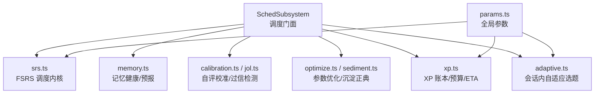
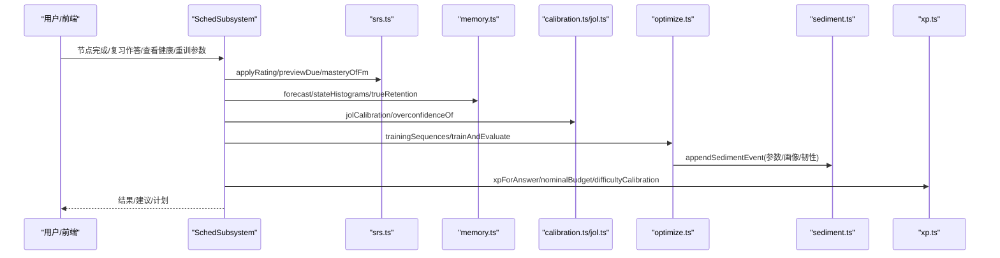
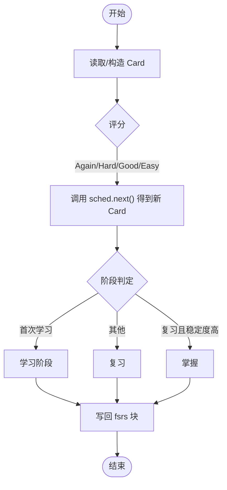
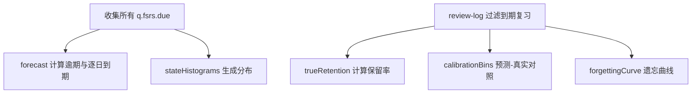
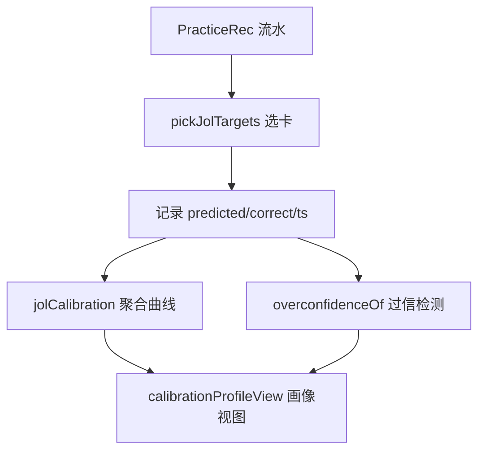
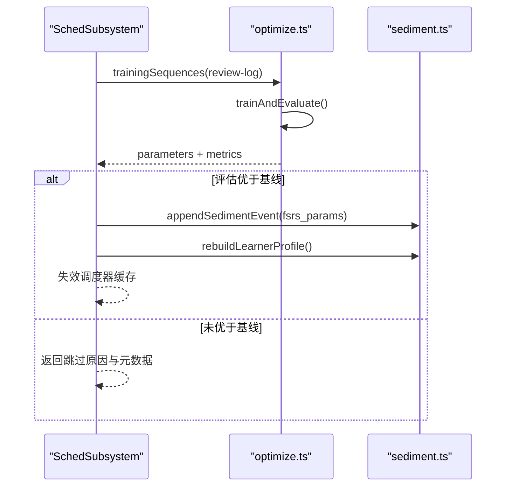
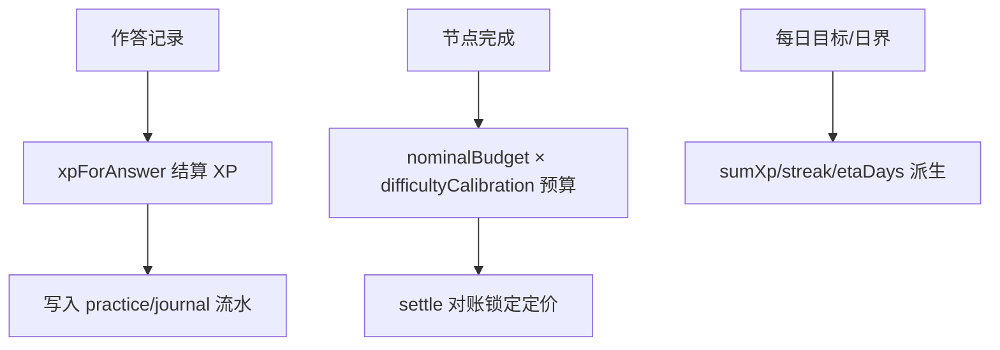
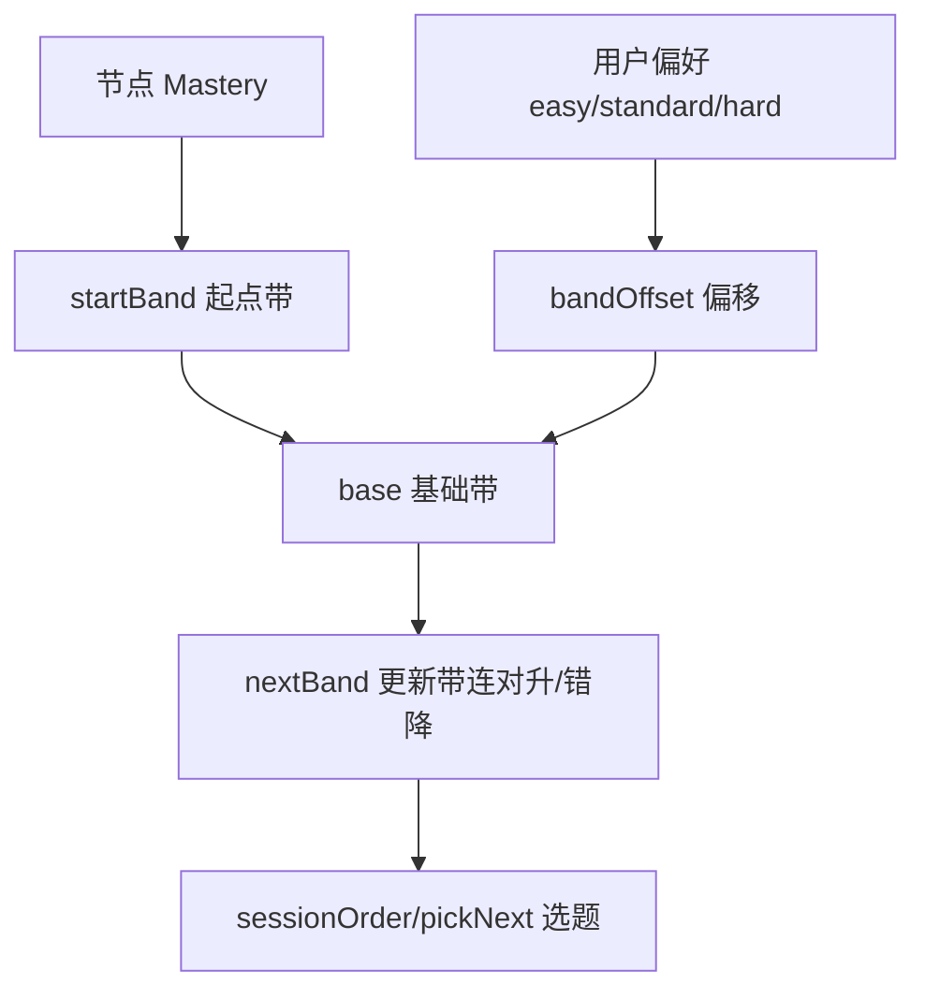
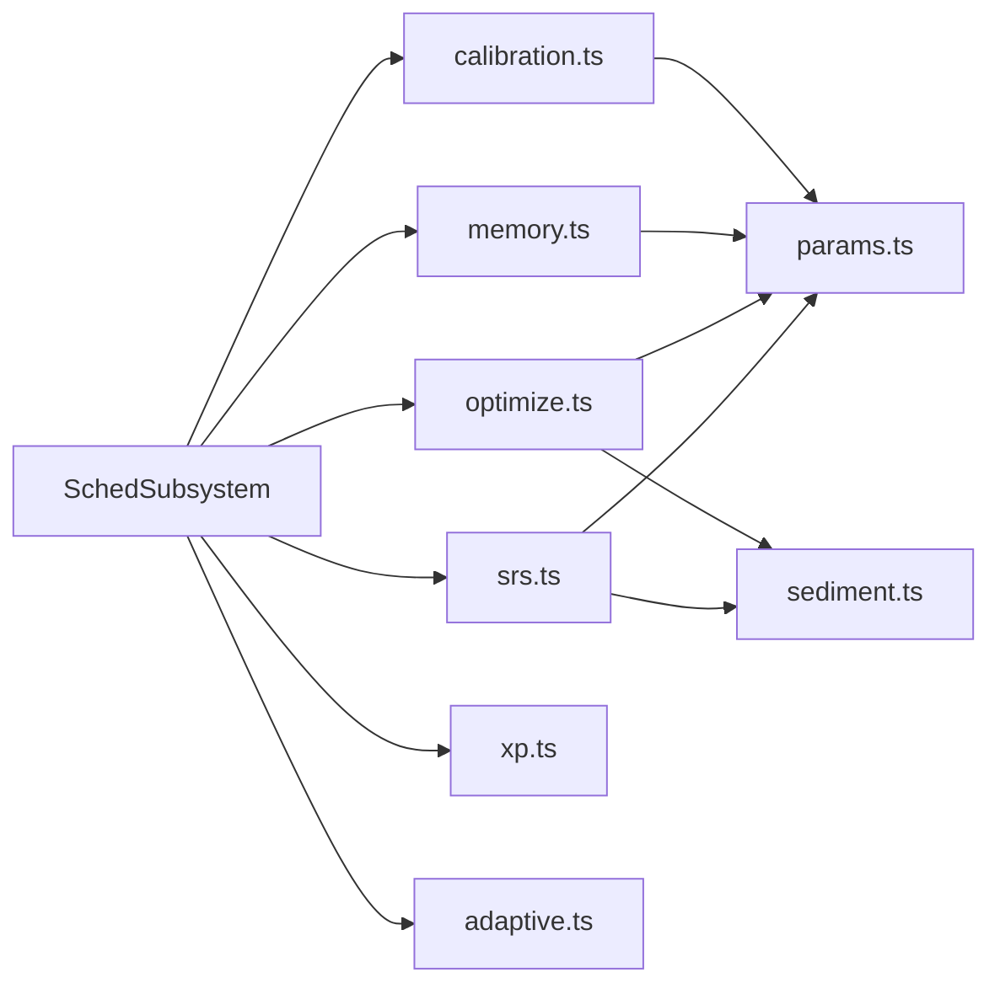

# 调度子系统

<cite>
**本文引用的文件**
- [sched-subsystem.ts](file://src/engine/sched-subsystem.ts)
- [srs.ts](file://src/engine/srs.ts)
- [calibration.ts](file://src/engine/calibration.ts)
- [xp.ts](file://src/engine/xp.ts)
- [memory.ts](file://src/engine/memory.ts)
- [jol.ts](file://src/engine/jol.ts)
- [optimize.ts](file://src/engine/optimize.ts)
- [sediment.ts](file://src/engine/sediment.ts)
- [params.ts](file://src/engine/params.ts)
- [adaptive.ts](file://src/engine/adaptive.ts)
</cite>

## 目录
1. [简介](#简介)
2. [项目结构](#项目结构)
3. [核心组件](#核心组件)
4. [架构总览](#架构总览)
5. [详细组件分析](#详细组件分析)
6. [依赖关系分析](#依赖关系分析)
7. [性能考量](#性能考量)
8. [故障排查指南](#故障排查指南)
9. [结论](#结论)
10. [附录：配置与使用示例路径](#附录：配置与使用示例路径)

## 简介
本文件面向“调度子系统”，围绕 SchedSubsystem 的核心职责展开：基于 FSRS 的间隔重复学习调度、复习计划生成与掌握度评估；校准系统（自评画像与过信检测）；经验值系统 XP（进度追踪、成就与激励）；以及参数优化与沉淀层。文档同时解释调度策略的灵活性，并给出可操作的配置与查看路径（以源码位置引用代替代码片段）。

## 项目结构
调度子系统由多个模块协作完成：
- 调度门面与流程编排：SchedSubsystem
- FSRS 内核与卡片状态转换：srs.ts
- 记忆健康统计与预报：memory.ts
- 自评校准与过信检测：calibration.ts、jol.ts
- 参数优化与正典化：optimize.ts、sediment.ts
- 经验值与预算制：xp.ts
- 自适应难度与选题：adaptive.ts
- 全局可调参数：params.ts

图表来源
- [sched-subsystem.ts:83-555](file://src/engine/sched-subsystem.ts#L83-L555)
- [srs.ts:29-192](file://src/engine/srs.ts#L29-L192)
- [memory.ts:1-119](file://src/engine/memory.ts#L1-L119)
- [calibration.ts:1-111](file://src/engine/calibration.ts#L1-L111)
- [jol.ts:1-79](file://src/engine/jol.ts#L1-L79)
- [optimize.ts:1-141](file://src/engine/optimize.ts#L1-L141)
- [sediment.ts:1-225](file://src/engine/sediment.ts#L1-L225)
- [xp.ts:1-184](file://src/engine/xp.ts#L1-L184)
- [adaptive.ts:1-82](file://src/engine/adaptive.ts#L1-L82)
- [params.ts:1-59](file://src/engine/params.ts#L1-L59)

章节来源
- [sched-subsystem.ts:83-555](file://src/engine/sched-subsystem.ts#L83-L555)

## 核心组件
- 调度门面（SchedSubsystem）
  - 节点跳过/完成确认、复习队列入队、记忆健康面板、FSRS 参数重训、沉淀事件写入与学习者档案重建。
- FSRS 内核（srs.ts）
  - 参数解析、卡片与 frontmatter 互转、评分推进、阶段机、掌握度计算、可提取性 R。
- 记忆健康（memory.ts）
  - 负载预报、状态分布、真实保留率、预测-真实对照、遗忘曲线。
- 校准系统（calibration.ts + jol.ts）
  - JOL 抽样、预测-校准曲线、系统性过信检测、画像聚合视图。
- 参数优化（optimize.ts + sediment.ts）
  - 从真实复习日志训练 FSRS-6 参数，评估门禁，写回沉淀正典与课程缓存，重建学习者档案。
- 经验值系统（xp.ts）
  - 作答 XP 结算、预算制定价、每日目标/日界、streak/ETA、里程碑定价。
- 自适应难度（adaptive.ts）
  - 会话内难度带演进、起点先验、选题顺序与下一题选择。
- 全局参数（params.ts）
  - 期望保留率、掌握阈值、XP 权重、日界默认等。

章节来源
- [sched-subsystem.ts:83-555](file://src/engine/sched-subsystem.ts#L83-L555)
- [srs.ts:29-192](file://src/engine/srs.ts#L29-L192)
- [memory.ts:1-119](file://src/engine/memory.ts#L1-L119)
- [calibration.ts:1-111](file://src/engine/calibration.ts#L1-L111)
- [jol.ts:1-79](file://src/engine/jol.ts#L1-L79)
- [optimize.ts:1-141](file://src/engine/optimize.ts#L1-L141)
- [sediment.ts:1-225](file://src/engine/sediment.ts#L1-L225)
- [xp.ts:1-184](file://src/engine/xp.ts#L1-L184)
- [adaptive.ts:1-82](file://src/engine/adaptive.ts#L1-L82)
- [params.ts:1-59](file://src/engine/params.ts#L1-L59)

## 架构总览
调度子系统以 SchedSubsystem 为门面，协调 FSRS 内核、记忆健康、校准、参数优化、XP 与自适应能力，形成“学习—评估—调参—再学习”的闭环。

图表来源
- [sched-subsystem.ts:98-555](file://src/engine/sched-subsystem.ts#L98-L555)
- [srs.ts:107-192](file://src/engine/srs.ts#L107-L192)
- [memory.ts:17-119](file://src/engine/memory.ts#L17-L119)
- [calibration.ts:53-111](file://src/engine/calibration.ts#L53-L111)
- [jol.ts:28-79](file://src/engine/jol.ts#L28-L79)
- [optimize.ts:47-141](file://src/engine/optimize.ts#L47-L141)
- [sediment.ts:60-225](file://src/engine/sediment.ts#L60-L225)
- [xp.ts:26-184](file://src/engine/xp.ts#L26-L184)

## 详细组件分析

### FSRS 间隔重复与复习计划
- 参数解析与调度器构造：统一从沉淀正典→课程缓存→官方默认取参，保证多源一致。
- 卡片与 frontmatter 互转：将 fsrs 块映射为 ts-fsrs Card，评分后写回 fsrs 块。
- 评分推进与阶段机：根据评分与稳定性决定 review/learning/mastered。
- 可提取性 R 与预览：支持题卡级 R 计算与下次到期预览。
- 掌握度：综合稳定度完成度与练习证据，提供可视化指标（不驱动调度）。

图表来源
- [srs.ts:63-141](file://src/engine/srs.ts#L63-L141)

章节来源
- [srs.ts:29-192](file://src/engine/srs.ts#L29-L192)

### 复习计划生成与记忆健康
- 负载预报：统计 due 列表，输出逾期量与未来 N 天逐日到期量。
- 状态分布：按稳定性区间、难度十分位、可提取性十分位生成直方图。
- 真实保留率：仅计入到期复习的真实作答，排除合成首复习与首学推进。
- 预测-真实对照：按 r_pred 分箱对比通过率。
- 遗忘曲线：按 elapsed_days 分桶展示保留率下降。

图表来源
- [memory.ts:17-119](file://src/engine/memory.ts#L17-L119)

章节来源
- [memory.ts:17-119](file://src/engine/memory.ts#L17-L119)

### 校准系统：自评画像与过信检测
- JOL 抽样：优先选择有信息价值的卡片（到期边界 R、难度中段、历史偏差），约 1/3 弹出预测。
- 预测-校准曲线：按“会/不会/没把握”三档聚合实际正确率与忘记数，数据不足静默。
- 过信检测：若“会”档样本足够但实际正确率低于阈值，提示更保守预测。
- 画像聚合：分源切片+全局参考视图，标注域特异警戒。

图表来源
- [jol.ts:28-79](file://src/engine/jol.ts#L28-L79)
- [calibration.ts:53-111](file://src/engine/calibration.ts#L53-L111)

章节来源
- [calibration.ts:1-111](file://src/engine/calibration.ts#L1-L111)
- [jol.ts:1-79](file://src/engine/jol.ts#L1-L79)

### 参数优化与沉淀层
- 训练序列构建：从 review-log 抽取每卡时间序 rating 与 delta_t，排除 synthetic，每卡每天只计第一条。
- 训练与评估：通过 binding 训练 FSRS-6 参数，in-sample 评估与可选时序切分评估。
- 写回门禁：新参数 logLoss 必须优于基线（现参或默认），否则跳过。
- 沉淀正典：参数、校准画像、速度韧性等事件出生即写，读侧唯一消费 foldSediment。
- 学习者档案：每次结算重建，纯派生可读投影。

图表来源
- [sched-subsystem.ts:368-450](file://src/engine/sched-subsystem.ts#L368-L450)
- [optimize.ts:47-141](file://src/engine/optimize.ts#L47-L141)
- [sediment.ts:60-225](file://src/engine/sediment.ts#L60-L225)

章节来源
- [sched-subsystem.ts:368-450](file://src/engine/sched-subsystem.ts#L368-L450)
- [optimize.ts:47-141](file://src/engine/optimize.ts#L47-L141)
- [sediment.ts:60-225](file://src/engine/sediment.ts#L60-L225)

### 经验值系统 XP：进度、成就与激励
- 作答 XP：对=题型权重×难度；错=0；乱猜（耗时短且错）负 XP；同日重复=0。
- 预算制定价：节点预算 = 标称 N₀ × 客观难度校准 k；完成时 settle 对账锁定。
- 每日目标/日界：可配置 daily_xp_goal 与 day_cutoff；streak 宽容天数不断链。
- ETA：剩余工作量 ÷ 每日目标；每节点估算随证据自动校准。
- 里程碑定价：结合 est 与关联节点难度校准，一次性入账。

图表来源
- [xp.ts:26-184](file://src/engine/xp.ts#L26-L184)
- [sched-subsystem.ts:272-321](file://src/engine/sched-subsystem.ts#L272-L321)

章节来源
- [xp.ts:26-184](file://src/engine/xp.ts#L26-L184)
- [sched-subsystem.ts:272-321](file://src/engine/sched-subsystem.ts#L272-L321)

### 自适应策略与个性化需求
- 难度合成：静态题面难度与 FSRS difficulty 等权合成到 0–1 刻度。
- 起点先验：随节点 Mastery 调整开场难度带。
- 带权偏好：允许用户选择 easy/standard/hard 偏移起点带。
- 连对升档/错忘回落：会话内动态调整目标带，保障挑战点。
- 选题顺序：按距目标带距离排序，后续用 pickNext 流式选择。

图表来源
- [adaptive.ts:19-82](file://src/engine/adaptive.ts#L19-L82)

章节来源
- [adaptive.ts:19-82](file://src/engine/adaptive.ts#L19-L82)

## 依赖关系分析
- 低耦合高内聚：各模块职责清晰，通过接口与函数组合协作。
- 关键依赖：
  - SchedSubsystem 依赖 srs.ts、memory.ts、calibration.ts、optimize.ts、xp.ts、adaptive.ts。
  - srs.ts 依赖 params.ts（阈值）、sediment.ts（最新参数）。
  - optimize.ts 依赖 sediment.ts（正典读写）、params.ts（默认参数）。
  - memory.ts 与 calibration.ts 均依赖 dates.ts 与 types.ts。
- 循环依赖规避：SchedSubsystem 作为门面，领域方法经窄面注入回调，避免直接环。

图表来源
- [sched-subsystem.ts:83-555](file://src/engine/sched-subsystem.ts#L83-L555)
- [srs.ts:29-192](file://src/engine/srs.ts#L29-L192)
- [optimize.ts:1-141](file://src/engine/optimize.ts#L1-L141)
- [memory.ts:1-119](file://src/engine/memory.ts#L1-L119)
- [calibration.ts:1-111](file://src/engine/calibration.ts#L1-L111)
- [xp.ts:1-184](file://src/engine/xp.ts#L1-L184)
- [adaptive.ts:1-82](file://src/engine/adaptive.ts#L1-L82)

章节来源
- [sched-subsystem.ts:83-555](file://src/engine/sched-subsystem.ts#L83-L555)

## 性能考量
- 单遍会话与无 fuzz：FSRS 调度关闭短期学习与抖动，降低复杂度。
- 批量聚合：记忆健康与校准采用纯函数聚合，避免频繁 I/O。
- 参数优化门禁：仅在数据充足且评估优于基线时写回，减少无效训练。
- 沉淀层追加模式：正典追加 jsonl，读侧折叠稳定排序，适合大规模重放。
- 预算制对账：完成时一次性结算，避免重复定价。

[本节为通用指导，无需具体文件引用]

## 故障排查指南
- 参数优化被跳过
  - 检查真实复习日志条数是否达到门槛；若不足，保持现参不训练。
  - 若评估未优于基线，查看元数据中的 baseline_log_loss 与新参数 logLoss。
- 记忆健康为空态
  - 确认存在到期复习记录（排除 synthetic 与首学推进）；若无数据，报表返回空态。
- 过信检测未触发
  - “会”档配对数需达到最小门槛；不足则静默不显示。
- XP 预算对账异常
  - 核对节点预算公式（N₀ × k）与过程信号（满分 bonus、错题零 XP）是否被正确吸收。
- 日界/目标配置错误
  - day_cutoff 必须为 HH:mm；daily_xp_goal 会被 clamp 到安全范围。

章节来源
- [sched-subsystem.ts:368-450](file://src/engine/sched-subsystem.ts#L368-L450)
- [memory.ts:60-119](file://src/engine/memory.ts#L60-L119)
- [calibration.ts:53-111](file://src/engine/calibration.ts#L53-L111)
- [xp.ts:85-120](file://src/engine/xp.ts#L85-L120)

## 结论
调度子系统以 SchedSubsystem 为核心，整合 FSRS 间隔重复、记忆健康、自评校准、参数优化与 XP 预算制，形成可配置、可观测、可演化的学习调度体系。通过沉淀层与参数优化，系统能持续贴合个体学习轨迹；通过 XP 与自适应策略，兼顾动机与效率。

[本节为总结性内容，无需具体文件引用]

## 附录：配置与使用示例路径
以下示例均以源码路径引用形式给出，便于定位实现与扩展点：

- 配置 FSRS 期望保留率与掌握阈值
  - 修改全局参数：[params.ts:1-17](file://src/engine/params.ts#L1-L17)
- 查看今日学习计划与记忆健康
  - 调用记忆健康聚合：[sched-subsystem.ts:323-359](file://src/engine/sched-subsystem.ts#L323-L359)
  - 负载预报与遗忘曲线：[memory.ts:17-119](file://src/engine/memory.ts#L17-L119)
- 获取个性化建议（过信检测与 JOL 校准）
  - 过信检测与画像视图：[calibration.ts:53-111](file://src/engine/calibration.ts#L53-L111)
  - JOL 抽样与曲线：[jol.ts:28-79](file://src/engine/jol.ts#L28-L79)
- 手动重训 FSRS 个人参数
  - 触发优化与写回：[sched-subsystem.ts:368-450](file://src/engine/sched-subsystem.ts#L368-L450)
  - 训练与评估实现：[optimize.ts:47-141](file://src/engine/optimize.ts#L47-L141)
- 设置每日 XP 目标与日界
  - 读写每日目标与日界：[xp.ts:85-120](file://src/engine/xp.ts#L85-L120)
- 查看节点完成后的复习计划与代表卡
  - 节点完成流程与首刷初始化：[sched-subsystem.ts:124-270](file://src/engine/sched-subsystem.ts#L124-L270)
  - 卡片到期预览：[srs.ts:156-163](file://src/engine/srs.ts#L156-L163)
- 会话内自适应选题与难度带
  - 难度合成与带演进：[adaptive.ts:19-82](file://src/engine/adaptive.ts#L19-L82)

章节来源
- [params.ts:1-59](file://src/engine/params.ts#L1-L59)
- [sched-subsystem.ts:124-450](file://src/engine/sched-subsystem.ts#L124-L450)
- [memory.ts:17-119](file://src/engine/memory.ts#L17-L119)
- [calibration.ts:53-111](file://src/engine/calibration.ts#L53-L111)
- [jol.ts:28-79](file://src/engine/jol.ts#L28-L79)
- [optimize.ts:47-141](file://src/engine/optimize.ts#L47-L141)
- [xp.ts:85-120](file://src/engine/xp.ts#L85-L120)
- [srs.ts:156-163](file://src/engine/srs.ts#L156-L163)
- [adaptive.ts:19-82](file://src/engine/adaptive.ts#L19-L82)