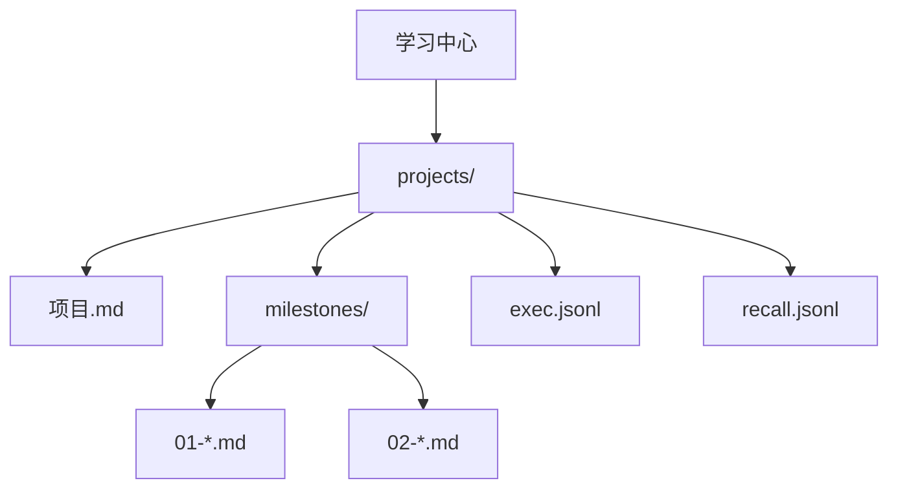
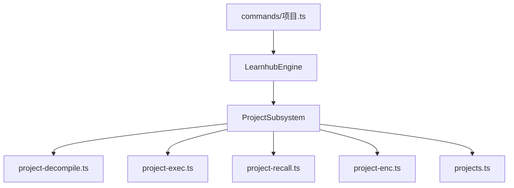
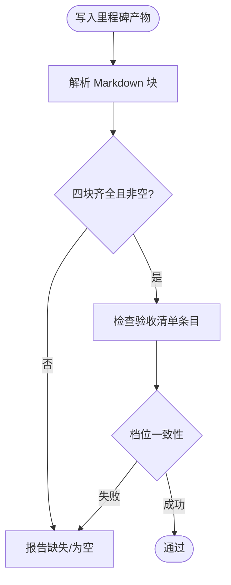
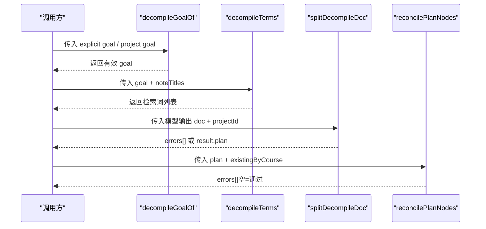
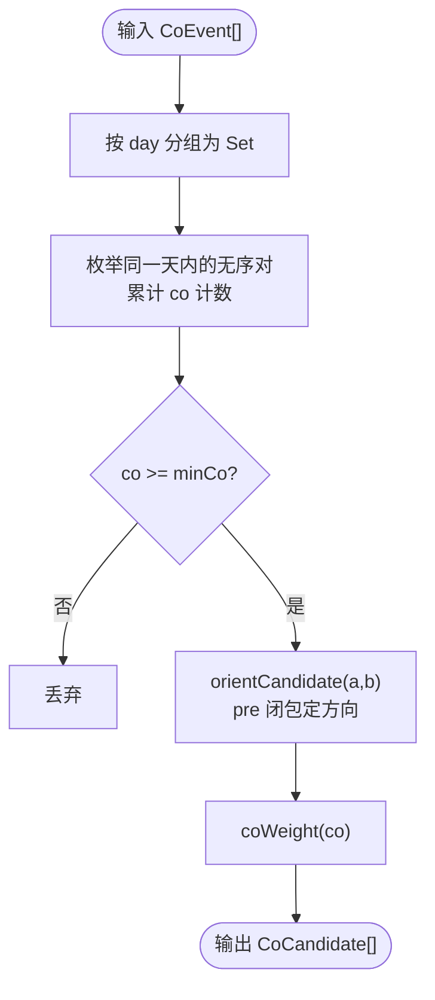
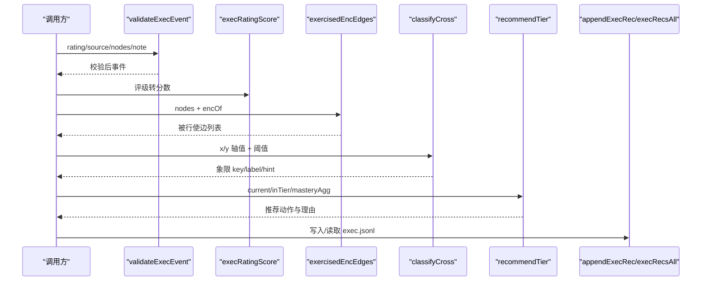
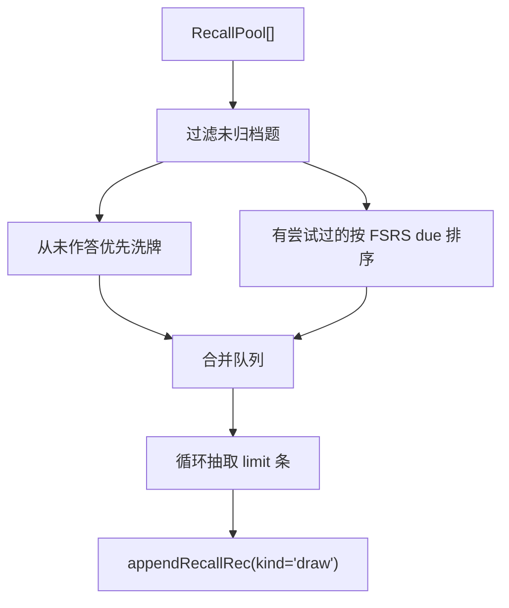
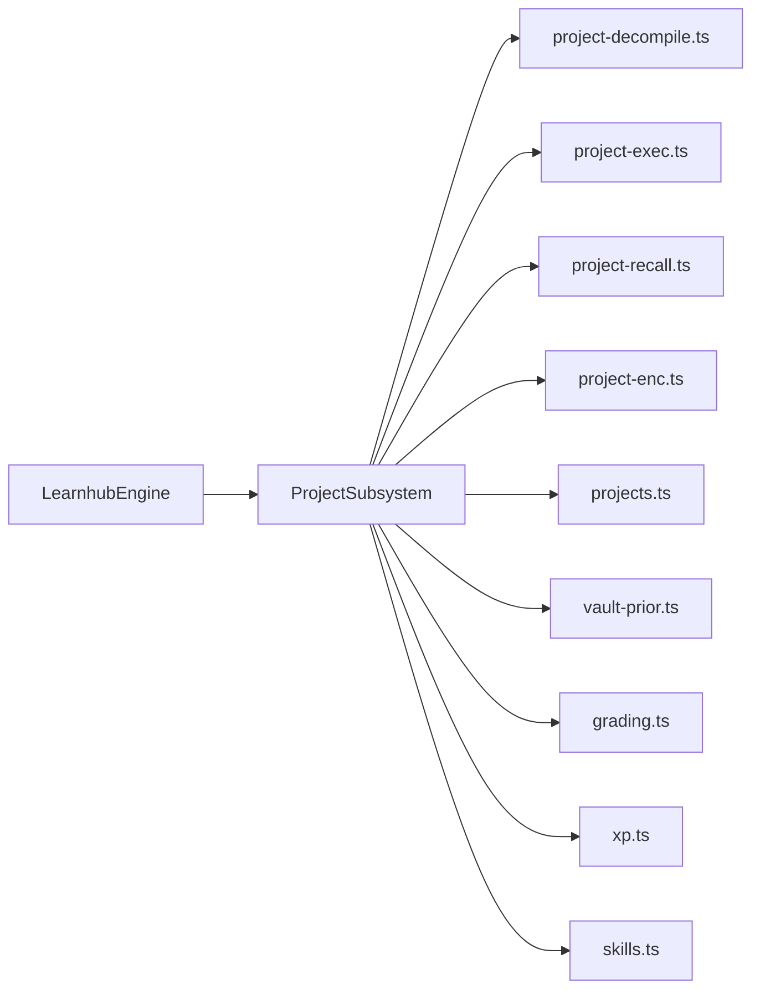

# 项目子系统

<cite>
**本文引用的文件**
- [src/engine/projects.ts](file://src/engine/projects.ts)
- [src/engine/project-decompile.ts](file://src/engine/project-decompile.ts)
- [src/engine/project-exec.ts](file://src/engine/project-exec.ts)
- [src/engine/project-recall.ts](file://src/engine/project-recall.ts)
- [src/engine/project-enc.ts](file://src/engine/project-enc.ts)
- [src/commands/项目.ts](file://src/commands/项目.ts)
- [src/engine/index.ts](file://src/engine/index.ts)
- [docs/design/2026-09-project-artifact-design.md](file://docs/design/2026-09-project-artifact-design.md)
</cite>

## 目录
1. [简介](#简介)
2. [项目结构](#项目结构)
3. [核心组件](#核心组件)
4. [架构总览](#架构总览)
5. [详细组件分析](#详细组件分析)
6. [依赖关系分析](#依赖关系分析)
7. [性能与可扩展性](#性能与可扩展性)
8. [故障排查指南](#故障排查指南)
9. [结论](#结论)
10. [附录：使用示例](#附录使用示例)

## 简介
本项目子系统（Project Subsystem）围绕“真实世界实践”的学习单元——项目，提供从创建、计划生成、反编译、执行记录到能力诊断的完整闭环。其职责包括：
- 项目管理：项目的生命周期、渐退档、里程碑计划与产物管理
- 代码反编译：基于目标描述与先验笔记，产出里程碑计划草案并校验
- 依赖分析：从行为共现推断成分技能边候选，辅助知识图谱演进
- 执行环境：记录执行事件、回流节点练习证据、计算2×2诊断与入档建议

子系统遵循“零 XP、零 FSRS、不进复习队列”的设计约束，所有变更通过提案通道与门控流程落地，确保可审计、可回滚、可回放。

## 项目结构
项目工作区位于学习中心下的 projects/<id>/，包含：
- 项目.md：承载身份与计划（frontmatter），含 lifecycle、tier、goal、plan 等
- milestones/NN-<slug>.md：每个里程碑一个产物文件，固定四块结构（给定/待办/验收清单/支持）
- exec.jsonl：项目执行事件流水（追加式）
- recall.jsonl：检索点会话流水（抽题与自述）

图示来源
- [docs/design/2026-09-project-artifact-design.md:11-22](file://docs/design/2026-09-project-artifact-design.md#L11-L22)

章节来源
- [docs/design/2026-09-project-artifact-design.md:11-22](file://docs/design/2026-09-project-artifact-design.md#L11-L22)
- [src/engine/projects.ts:1-12](file://src/engine/projects.ts#L1-L12)

## 核心组件
- 项目门面与子系统装配：LearnhubEngine 暴露 project 子模块入口，ProjectSubsystem 聚合存储、路径、注册表、题库、项目集合、笔记源、概念登记、Vault 根、随机源、时钟、文件系统、学习日等能力
- 反编译模块：project-decompile.ts 负责目标解析、检索词派生、产物拆分校验、名字对账门、修复轮提示拼装
- 执行模块：project-exec.ts 定义执行事件、评分映射、被行使 enc 边判定、2×2 分类、入档推荐、事件读写
- 检索点模块：project-recall.ts 实现跨池抽题、检索点流水读写
- 依赖分析模块：project-enc.ts 实现共现对提取、方向裁决、权重计算
- 命令注册：commands/项目.ts 将上述能力以工具/路由形式对外暴露

章节来源
- [src/engine/index.ts:149-184](file://src/engine/index.ts#L149-L184)
- [src/engine/index.ts:294-298](file://src/engine/index.ts#L294-L298)
- [src/engine/project-decompile.ts:1-13](file://src/engine/project-decompile.ts#L1-L13)
- [src/engine/project-exec.ts:1-32](file://src/engine/project-exec.ts#L1-L32)
- [src/engine/project-recall.ts:1-12](file://src/engine/project-recall.ts#L1-L12)
- [src/engine/project-enc.ts:1-13](file://src/engine/project-enc.ts#L1-L13)
- [src/commands/项目.ts:9-417](file://src/commands/项目.ts#L9-L417)

## 架构总览
子系统采用“门面 + 子系统 + 纯函数模块”的分层组织：
- 门面 LearnhubEngine 统一装配各子系统，避免宿主直连内部实现
- ProjectSubsystem 作为项目域入口，协调项目档案、计划、产物、执行、检索点、依赖推断
- 各功能模块以纯函数为主，保证可测试性与可组合性

图示来源
- [src/engine/index.ts:149-184](file://src/engine/index.ts#L149-L184)
- [src/engine/index.ts:294-298](file://src/engine/index.ts#L294-L298)
- [src/commands/项目.ts:9-417](file://src/commands/项目.ts#L9-L417)

## 详细组件分析

### 项目管理与产物形态
- 项目 frontmatter 校验：id/name/lifecycle/tier/goal/plan/created/updated 严格校验，非法值抛出错误
- 里程碑产物机检：四块齐全、非空、验收清单至少一条行为句、无题目泄漏、档位一致性检查
- 产物文件名：按序位生成 NN-<slug>.md，保证稳定可回放

图示来源
- [src/engine/projects.ts:137-177](file://src/engine/projects.ts#L137-L177)

章节来源
- [src/engine/projects.ts:86-135](file://src/engine/projects.ts#L86-L135)
- [src/engine/projects.ts:137-182](file://src/engine/projects.ts#L137-L182)

### 代码反编译 project-decompile
- 目标解析：显式 goal 优先，否则取项目档案 goal；空输入直接报错
- 检索词派生：priorTerms 结合目标与注册笔记标题
- 产物拆分：仅接受 plan 半区（seed 半区已退役），调用 validatePlanArtifact 校验
- 名字对账门：plan[].nodes 引用必须落在已注册课程图节点内，裸名需唯一命中，否则报歧义或悬空
- 修复轮提示：将上次输出与门禁错误回灌，要求整体重出完整 YAML

图示来源
- [src/engine/project-decompile.ts:24-38](file://src/engine/project-decompile.ts#L24-L38)
- [src/engine/project-decompile.ts:43-59](file://src/engine/project-decompile.ts#L43-L59)
- [src/engine/project-decompile.ts:72-108](file://src/engine/project-decompile.ts#L72-L108)

章节来源
- [src/engine/project-decompile.ts:1-121](file://src/engine/project-decompile.ts#L1-L121)
- [src/engine/project-decompile.ts:123-212](file://src/engine/project-decompile.ts#L123-L212)

### 依赖分析 engine（行为推断 enc 候选边）
- 共现对提取：窗口内 (node, day) 集合统计同日活跃天数 ≥ minCo 的对，降序稳定排序
- 方向裁决：依据 pre 传递闭包确定 skill/holder；若无 pre 关系则给出启发式 hint
- 权重计算：≥3 天 1.0 / 2 天 0.8 / 1 天 0.6

图示来源
- [src/engine/project-enc.ts:21-48](file://src/engine/project-enc.ts#L21-L48)
- [src/engine/project-enc.ts:50-66](file://src/engine/project-enc.ts#L50-L66)
- [src/engine/project-enc.ts:68-72](file://src/engine/project-enc.ts#L68-L72)

章节来源
- [src/engine/project-enc.ts:1-73](file://src/engine/project-enc.ts#L1-L73)

### 执行环境 project-exec（沙箱隔离、资源管理、性能监控）
- 事件入参校验：rating 1-4 整数、source 枚举、nodes 去重保序、note 可选
- 评分映射：execRatingScore 将评级映射为 0-1 分数
- 被行使 enc 边判定：图上实际存在的 enc 边且两端都在 nodes 集合内，去重稳定排序
- 2×2 分类：X=关联节点 mastery 均值，Y=执行事件 EMA 分数，阈值 CROSS_AXIS_THRESHOLD
- 入档推荐：基于档内表现与底座掌握度，建议升/降/维持，永不写状态、不参与门禁
- 事件 IO：appendExecRec 追加一行 JSONL；execRecsAll 读取全部事件

图示来源
- [src/engine/project-exec.ts:70-104](file://src/engine/project-exec.ts#L70-L104)
- [src/engine/project-exec.ts:106-128](file://src/engine/project-exec.ts#L106-L128)
- [src/engine/project-exec.ts:155-178](file://src/engine/project-exec.ts#L155-L178)
- [src/engine/project-exec.ts:189-247](file://src/engine/project-exec.ts#L189-L247)
- [src/engine/project-exec.ts:251-261](file://src/engine/project-exec.ts#L251-L261)

章节来源
- [src/engine/project-exec.ts:1-262](file://src/engine/project-exec.ts#L1-L262)

### 检索点 project-recall（抽题与会话流水）
- 抽题策略：跨池轮转，从未作答优先，FSRS due 最早优先，同序级内洗牌
- 流水记录：draw 与 reflect 两类记录追加至 recall.jsonl
- 只读题库：不出新题、不改题、不推进调度

图示来源
- [src/engine/project-recall.ts:35-61](file://src/engine/project-recall.ts#L35-L61)
- [src/engine/project-recall.ts:68-78](file://src/engine/project-recall.ts#L68-L78)

章节来源
- [src/engine/project-recall.ts:1-79](file://src/engine/project-recall.ts#L1-L79)

### 命令与外部接口
- 项目创建、计划生成、反编译、反编译应用、执行日志、生命周期、列表、日志读写、里程碑生成/过点/检索点、检索点日志/自述、跨视图、依赖候选、档位设置等
- 每个命令绑定引擎方法、通道（agent/panel）、路由与参数说明

章节来源
- [src/commands/项目.ts:9-417](file://src/commands/项目.ts#L9-L417)

## 依赖关系分析
- 门面 LearnhubEngine 在构造时注入 ProjectSubsystem，使其具备 store、paths、registry、bank、projects、noteManifest、concepts、vaultRoot、jolRng、clock、fs、learningDay 等能力
- 项目子系统依赖：
  - 计划与产物：validatePlanItems、validatePlanArtifact、gateMilestone
  - 执行：execRatingScore、exercisedEncEdges、classifyCross、recommendTier、validateExecEvent、appendExecRec、execRecsAll
  - 检索点：drawRecallQuestions、appendRecallRec、recallRecsAll
  - 依赖推断：cooccurrencePairs、orientCandidate、coWeight
  - 先验检索：runPriorSearch、priorSection
  - 评分与难度：applyPracticeEvidence、difficultyCalibration、milestonePrice、ratingFromEvidence

图示来源
- [src/engine/index.ts:294-298](file://src/engine/index.ts#L294-L298)
- [src/engine/projects.ts:1-66](file://src/engine/projects.ts#L1-L66)

章节来源
- [src/engine/index.ts:149-184](file://src/engine/index.ts#L149-L184)
- [src/engine/projects.ts:1-66](file://src/engine/projects.ts#L1-L66)

## 性能与可扩展性
- 纯函数优先：反编译、依赖推断、执行评分、检索点抽题均为纯函数，便于单元测试与并行化
- 流式 IO：exec.jsonl 与 recall.jsonl 采用追加式 JSONL，读侧容错（缺失=合法空态、撕裂尾行豁免、中段坏行报错）
- 阈值集中：CROSS_AXIS_THRESHOLD、TIER_REC_* 集中在 params.ts，便于调参与一致性
- 可扩展点：
  - 评分映射与来源扩展：EXEC_SOURCES、ratingFromEvidence 可观测证据映射
  - 依赖推断阈值：min_co、window_days、coWeight 可调
  - 入档推荐策略：promote/demote/hold 判据可配置

[本节为通用指导，无需具体文件引用]

## 故障排查指南
- 反编译失败
  - 目标描述为空：检查 decompileGoalOf 输入
  - seed 半区不被接受：确认仅输出 plan 半区
  - 名字对账失败：plan.nodes 引用必须在已注册课程图内，裸名需唯一命中
- 执行事件无效
  - rating 非 1-4 整数：校验 validateExecEvent
  - source 非法：仅限 auto/self/ai
  - nodes 非字符串列表：去重保序
- 检索点抽题异常
  - 池为空：检查 questions 是否归档或未激活
  - 重复抽题：确保从未作答优先与 FSRS due 排序逻辑生效
- 依赖推断无结果
  - min_co 过高：降低阈值
  - 窗口太短：增大 window_days
  - 无 pre 关系：方向裁决可能无法成边，需补充 pre 边

章节来源
- [src/engine/project-decompile.ts:24-108](file://src/engine/project-decompile.ts#L24-L108)
- [src/engine/project-exec.ts:70-104](file://src/engine/project-exec.ts#L70-L104)
- [src/engine/project-recall.ts:35-61](file://src/engine/project-recall.ts#L35-L61)
- [src/engine/project-enc.ts:21-66](file://src/engine/project-enc.ts#L21-L66)

## 结论
项目子系统以清晰的分层与严格的契约保障，实现了从项目创建、计划反编译、执行记录到能力诊断的完整闭环。通过纯函数化设计、流式数据与集中阈值管理，系统在可测试性、可维护性与可扩展性方面具备良好基础。未来可在评分映射、依赖推断阈值与入档推荐策略上持续优化，以适配更多学习场景。

[本节为总结，无需具体文件引用]

## 附录：使用示例
以下示例展示如何创建项目、分析代码结构与执行项目任务（以命令与引擎方法路径为准，不粘贴代码内容）：

- 创建项目
  - 命令：project-create
  - 引擎方法：project.projectCreate
  - 参考路径：[src/commands/项目.ts:26-44](file://src/commands/项目.ts#L26-L44)

- 生成里程碑计划
  - 命令：project-plan-generate
  - 引擎方法：project.projectPlanGenerate
  - 参考路径：[src/commands/项目.ts:318-339](file://src/commands/项目.ts#L318-L339)

- 目标反编译（project-decompile）
  - 命令：project-decompile
  - 引擎方法：project.projectDecompile
  - 关键实现：
    - 目标解析与检索词派生：[src/engine/project-decompile.ts:24-38](file://src/engine/project-decompile.ts#L24-L38)
    - 产物拆分与校验：[src/engine/project-decompile.ts:43-59](file://src/engine/project-decompile.ts#L43-L59)
    - 名字对账门：[src/engine/project-decompile.ts:72-108](file://src/engine/project-decompile.ts#L72-L108)
    - 修复轮提示：[src/engine/project-decompile.ts:110-121](file://src/engine/project-decompile.ts#L110-L121)

- 执行项目任务（project-exec）
  - 命令：project-exec-log
  - 引擎方法：project.projectExecLog
  - 关键实现：
    - 事件校验与评分映射：[src/engine/project-exec.ts:70-104](file://src/engine/project-exec.ts#L70-L104)
    - 被行使 enc 边判定：[src/engine/project-exec.ts:106-128](file://src/engine/project-exec.ts#L106-L128)
    - 2×2 分类与入档推荐：[src/engine/project-exec.ts:155-247](file://src/engine/project-exec.ts#L155-L247)
    - 事件读写：[src/engine/project-exec.ts:251-261](file://src/engine/project-exec.ts#L251-L261)

- 检索点会话（project-recall）
  - 命令：project-milestone-recall
  - 引擎方法：project.projectMilestoneRecall
  - 关键实现：
    - 抽题策略：[src/engine/project-recall.ts:35-61](file://src/engine/project-recall.ts#L35-L61)
    - 流水记录：[src/engine/project-recall.ts:68-78](file://src/engine/project-recall.ts#L68-L78)

- 依赖分析（project-enc）
  - 命令：project-enc-candidates
  - 引擎方法：project.projectEncCandidates
  - 关键实现：
    - 共现对提取：[src/engine/project-enc.ts:21-48](file://src/engine/project-enc.ts#L21-L48)
    - 方向裁决与权重：[src/engine/project-enc.ts:50-72](file://src/engine/project-enc.ts#L50-L72)

章节来源
- [src/commands/项目.ts:26-44](file://src/commands/项目.ts#L26-L44)
- [src/commands/项目.ts:318-339](file://src/commands/项目.ts#L318-L339)
- [src/engine/project-decompile.ts:24-121](file://src/engine/project-decompile.ts#L24-L121)
- [src/engine/project-exec.ts:70-261](file://src/engine/project-exec.ts#L70-L261)
- [src/engine/project-recall.ts:35-78](file://src/engine/project-recall.ts#L35-L78)
- [src/engine/project-enc.ts:21-72](file://src/engine/project-enc.ts#L21-L72)