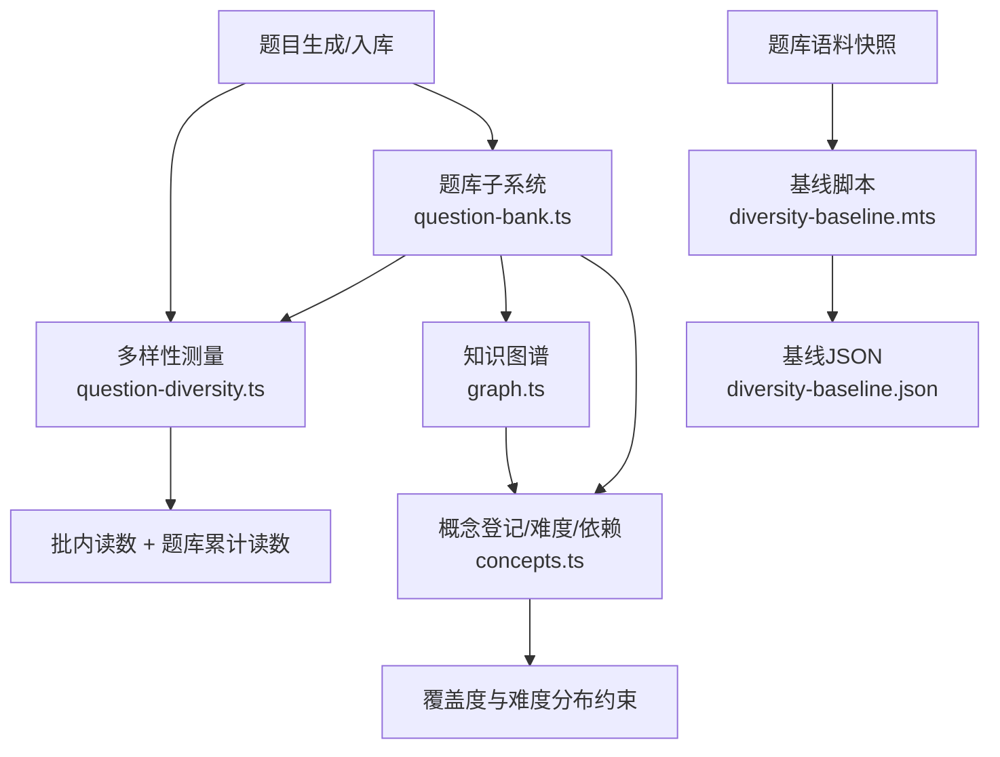
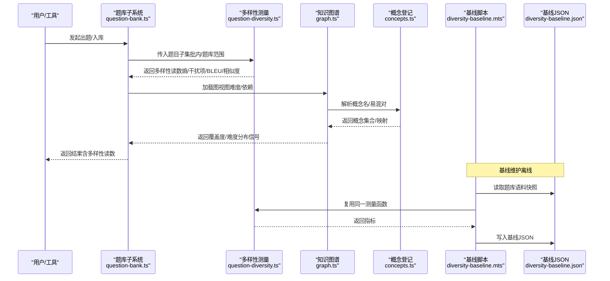
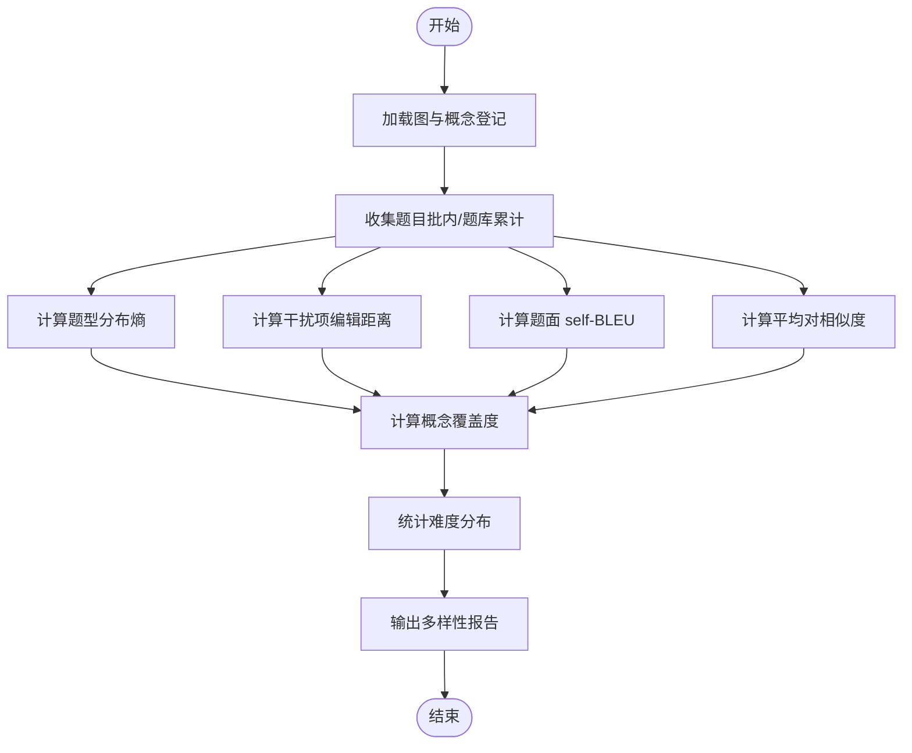
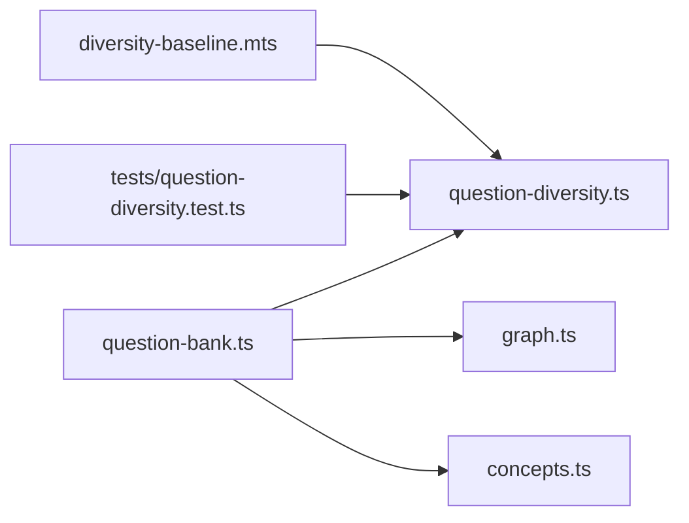

# 多样性控制

<cite>
**本文引用的文件**
- [src/engine/question-diversity.ts](file://src/engine/question-diversity.ts)
- [scripts/diversity-baseline.mts](file://scripts/diversity-baseline.mts)
- [tests/question-diversity.test.ts](file://tests/question-diversity.test.ts)
- [tests/fixtures/diversity-baseline.json](file://tests/fixtures/diversity-baseline.json)
- [src/engine/question-bank.ts](file://src/engine/question-bank.ts)
- [src/engine/graph.ts](file://src/engine/graph.ts)
- [src/engine/concepts.ts](file://src/engine/concepts.ts)
- [src/engine/quality.ts](file://src/engine/quality.ts)
</cite>

## 目录
1. [引言](#引言)
2. [项目结构](#项目结构)
3. [核心组件](#核心组件)
4. [架构总览](#架构总览)
5. [详细组件分析](#详细组件分析)
6. [依赖关系分析](#依赖关系分析)
7. [性能考量](#性能考量)
8. [故障排查指南](#故障排查指南)
9. [结论](#结论)
10. [附录：配置与使用示例路径](#附录：配置与使用示例路径)

## 引言
本文件围绕“多样性控制”展开，聚焦题库生成与入库后的多样性评估、指标口径、算法策略以及与知识图谱的集成方式。系统通过纯函数化的多样性仪表对“题型分布熵”“干扰项编辑距离”“题面 self-BLEU”“平均对相似度”进行测量，并以基线回放保障口径稳定；同时结合知识图谱的概念登记、节点难度与先验信息，为出题侧提供覆盖度与难度分布的约束依据。本文不直接输出代码内容，所有实现细节以文件路径与行号引用呈现。

## 项目结构
多样性控制涉及三个层面：
- 指标测量层：question-diversity.ts 提供纯函数式指标计算（熵、编辑距离、BLEU、trigram Jaccard），并产出批内与题库累计两份读数。
- 数据与基线层：scripts/diversity-baseline.mts 读取题库语料快照，复用同一测量函数生成基线 JSON；tests/question-diversity.test.ts 用同一函数做回归验证。
- 集成与约束层：question-bank.ts 在出题流程中调用多样性报告；graph.ts 与 concepts.ts 提供概念登记、节点难度、前置依赖等图结构信息，用于覆盖度与难度分布的约束与诊断。



图表来源
- [src/engine/question-diversity.ts:249-302](file://src/engine/question-diversity.ts#L249-L302)
- [scripts/diversity-baseline.mts:34-66](file://scripts/diversity-baseline.mts#L34-L66)
- [src/engine/question-bank.ts:63-64](file://src/engine/question-bank.ts#L63-L64)
- [src/engine/graph.ts:278-443](file://src/engine/graph.ts#L278-L443)
- [src/engine/concepts.ts:140-178](file://src/engine/concepts.ts#L140-L178)

章节来源
- [src/engine/question-diversity.ts:1-303](file://src/engine/question-diversity.ts#L1-L303)
- [scripts/diversity-baseline.mts:1-75](file://scripts/diversity-baseline.mts#L1-L75)
- [tests/question-diversity.test.ts:1-315](file://tests/question-diversity.test.ts#L1-L315)
- [src/engine/question-bank.ts:1-800](file://src/engine/question-bank.ts#L1-L800)
- [src/engine/graph.ts:1-514](file://src/engine/graph.ts#L1-L514)
- [src/engine/concepts.ts:1-335](file://src/engine/concepts.ts#L1-L335)

## 核心组件
- 多样性指标模块（question-diversity.ts）
  - 题型分布熵：按 kind 计数求香农熵（bit），空集/单一取值返回 0。
  - 干扰项编辑距离：单选/多选题选项两两归一化 Levenshtein 距离均值，批内按题量平均，并记录最差一题。
  - 题面 self-BLEU：每道题相对其余题面的 BLEU（1–4 阶，加一平滑，标准 brevity penalty），按题面长度加权平均。
  - 平均对相似度：字符 trigram Jaccard 相似度，按题面长度加权平均，作为 self-BLEU 的同轴第二读数。
  - 报告形状：包含 sample、kinds、entropy、可选 distractor/selfBleu/stemSimilarity；缺席键表示无测量对象而非 0。
- 基线与回放（diversity-baseline.mts + diversity-baseline.json）
  - 将题库 YAML 快照逐文件视为“批”，全语料聚合为“题库累计”；归档题排除、无选项题型不进干扰项轴、少于 2 道题面不进题面轴。
  - 基线由同一测量函数复算，测试强制逐值相等，防止口径漂移。
- 题库集成（question-bank.ts）
  - 在出题/入库流程中调用多样性测量，返回批内与题库累计读数，供后续质量审计与可视化消费。
- 知识图谱与概念登记（graph.ts + concepts.ts）
  - 提供节点难度、前置依赖、概念名精确解析、易混对提取等能力，支撑覆盖度与难度分布的约束与诊断。

章节来源
- [src/engine/question-diversity.ts:39-91](file://src/engine/question-diversity.ts#L39-L91)
- [src/engine/question-diversity.ts:99-154](file://src/engine/question-diversity.ts#L99-L154)
- [src/engine/question-diversity.ts:161-242](file://src/engine/question-diversity.ts#L161-L242)
- [src/engine/question-diversity.ts:249-302](file://src/engine/question-diversity.ts#L249-L302)
- [scripts/diversity-baseline.mts:34-66](file://scripts/diversity-baseline.mts#L34-L66)
- [tests/question-diversity.test.ts:102-171](file://tests/question-diversity.test.ts#L102-L171)
- [src/engine/question-bank.ts:63-64](file://src/engine/question-bank.ts#L63-L64)
- [src/engine/graph.ts:278-443](file://src/engine/graph.ts#L278-L443)
- [src/engine/concepts.ts:140-178](file://src/engine/concepts.ts#L140-L178)

## 架构总览
多样性控制的运行链路如下：
- 出题/入库阶段：题库子系统收集候选题目，调用多样性测量模块，得到批内与题库累计读数。
- 基线维护：基线脚本定期从题库语料快照复算三指标，写入固定 JSON；测试强制回放比对，确保口径一致。
- 知识图谱集成：通过概念登记与节点难度/依赖，辅助覆盖度与难度分布的约束与诊断（如识别跨步、空降、概念覆盖缺口）。



图表来源
- [src/engine/question-bank.ts:63-64](file://src/engine/question-bank.ts#L63-L64)
- [src/engine/question-diversity.ts:249-302](file://src/engine/question-diversity.ts#L249-L302)
- [src/engine/graph.ts:278-443](file://src/engine/graph.ts#L278-L443)
- [src/engine/concepts.ts:140-178](file://src/engine/concepts.ts#L140-L178)
- [scripts/diversity-baseline.mts:34-66](file://scripts/diversity-baseline.mts#L34-L66)

## 详细组件分析

### 多样性评估指标
- 知识点覆盖度
  - 通过概念登记（concepts.ts）获取在册概念名与别名集合，结合题目 invokes 标注或题干语义，统计被覆盖的概念比例。
  - 借助图节点难度（graph.ts）与前置依赖，识别未覆盖的关键节点或薄弱区域。
- 难度分布均匀性
  - 利用 graph.ts 的 difficultyOf 字段，统计各难度等级题目数量，计算分布熵或方差，识别偏斜。
  - 结合 quality.ts 的“认知跨步”阈值，检测相邻节点难度跳跃是否过大。
- 题型多样性
  - 使用 question-diversity.ts 的 entropy 指标衡量题型分布熵；distractor 指标衡量选项差异；selfBleu/stemSimilarity 衡量题面趋同程度。



图表来源
- [src/engine/question-diversity.ts:99-154](file://src/engine/question-diversity.ts#L99-L154)
- [src/engine/question-diversity.ts:161-242](file://src/engine/question-diversity.ts#L161-L242)
- [src/engine/graph.ts:278-443](file://src/engine/graph.ts#L278-L443)
- [src/engine/concepts.ts:140-178](file://src/engine/concepts.ts#L140-L178)

章节来源
- [src/engine/question-diversity.ts:99-242](file://src/engine/question-diversity.ts#L99-L242)
- [src/engine/graph.ts:278-443](file://src/engine/graph.ts#L278-L443)
- [src/engine/concepts.ts:140-178](file://src/engine/concepts.ts#L140-L178)
- [src/engine/quality.ts:12-33](file://src/engine/quality.ts#L12-L33)

### 多样性优化算法
当前仓库中的多样性控制以“测量+基线回放”为主，未见显式的贪心选择、动态规划或多目标优化求解器。可基于现有指标构建以下策略：
- 贪心选择
  - 在候选题目集中，优先选择能最大化题型熵增量、最小化 self-BLEU 的题目，直到达到目标样本量。
  - 参考 question-diversity.ts 的 entropyOf、selfBleuOf、meanStemSimilarityOf 作为评分函数。
- 动态规划
  - 将题目按知识点/难度分层，定义状态为“已覆盖概念集合 + 已选题目数”，转移为加入某题带来的熵增与相似度降。
  - 目标函数可组合熵、相似度、难度方差，约束为最小覆盖率与最大差异度。
- 多目标优化
  - 将题型熵、干扰项距离、self-BLEU、难度方差作为多目标，采用 Pareto 前沿搜索或加权求和（权重可调）。
  - 约束包括最小覆盖率、最大差异度、平衡因子（不同题型/难度的权重）。

注意：上述策略为概念设计，需结合题库子系统扩展选择逻辑；当前实现以测量与基线为主。

章节来源
- [src/engine/question-diversity.ts:99-242](file://src/engine/question-diversity.ts#L99-L242)
- [src/engine/question-bank.ts:63-64](file://src/engine/question-bank.ts#L63-L64)

### 与知识图谱的集成
- 概念关联分析
  - 使用 concepts.ts 的 namesOf、resolveConcept、confusablePairsOf 获取概念集合与易混对，辅助生成对比题。
- 依赖关系识别
  - 使用 graph.ts 的 preOf、reach、depth 识别前置依赖与传递闭包，避免跨步与空降。
- 覆盖度计算
  - 结合题目 invokes 标注与题干语义，统计被覆盖的概念比例；未覆盖的关键节点提示补充题目。

```mermaid
classDiagram
class Graph {
+names : string[]
+preOf : Record<string, string[]>
+reach : Record<string, Set<string>>
+difficultyOf : Record<string, number>
+isReady(n, done) : boolean
+readySet(done, doing) : string[]
}
class ConceptRegistry {
+load(root) : Promise<ConceptEntry[]>
+save(root, entries) : Promise<void>
+merge(root, from, into) : Promise<{into, names}>
}
class DiversityMetrics {
+sample : number
+kinds : Record<string, number>
+entropy : DiversityReading
+distractor? : DistractorReading
+selfBleu? : DiversityReading
+stemSimilarity? : DiversityReading
}
Graph --> ConceptRegistry : "概念解析/易混对"
DiversityMetrics --> Graph : "难度分布/覆盖度"
```

图表来源
- [src/engine/graph.ts:278-443](file://src/engine/graph.ts#L278-L443)
- [src/engine/concepts.ts:284-335](file://src/engine/concepts.ts#L284-L335)
- [src/engine/question-diversity.ts:79-91](file://src/engine/question-diversity.ts#L79-L91)

章节来源
- [src/engine/graph.ts:278-443](file://src/engine/graph.ts#L278-L443)
- [src/engine/concepts.ts:284-335](file://src/engine/concepts.ts#L284-L335)
- [src/engine/question-diversity.ts:79-91](file://src/engine/question-diversity.ts#L79-L91)

### 多样性约束的配置方法
- 最小覆盖率
  - 通过概念登记与题目 invokes 标注，设定关键概念的最低覆盖比例；未达标时提示补充题目。
- 最大差异度
  - 限制 self-BLEU 的上限与平均对相似度的上限，避免题面过度趋同。
- 平衡因子
  - 对不同题型/难度赋予权重，调整目标函数以平衡多样性与难度分布。
- 实施建议
  - 在题库子系统扩展选择逻辑，将上述约束作为硬约束或软惩罚项；结合基线回放监控约束效果。

章节来源
- [src/engine/concepts.ts:140-178](file://src/engine/concepts.ts#L140-L178)
- [src/engine/question-diversity.ts:161-242](file://src/engine/question-diversity.ts#L161-L242)
- [src/engine/graph.ts:278-443](file://src/engine/graph.ts#L278-L443)

## 依赖关系分析
- 模块耦合
  - question-bank.ts 依赖 question-diversity.ts 进行多样性测量，依赖 graph.ts 与 concepts.ts 进行覆盖度与难度分布分析。
  - diversity-baseline.mts 复用 question-diversity.ts 的测量函数，确保基线与运行时口径一致。
- 外部依赖
  - 无外部库依赖，均为内部模块与文件系统操作。
- 循环依赖
  - 通过类型导入与窄面接口避免环依赖；question-bank.ts 仅以 Pick/类型形式引入 Graph。



图表来源
- [src/engine/question-bank.ts:63-64](file://src/engine/question-bank.ts#L63-L64)
- [scripts/diversity-baseline.mts:24-25](file://scripts/diversity-baseline.mts#L24-L25)
- [tests/question-diversity.test.ts:20-24](file://tests/question-diversity.test.ts#L20-L24)

章节来源
- [src/engine/question-bank.ts:63-64](file://src/engine/question-bank.ts#L63-L64)
- [scripts/diversity-baseline.mts:24-25](file://scripts/diversity-baseline.mts#L24-L25)
- [tests/question-diversity.test.ts:20-24](file://tests/question-diversity.test.ts#L20-L24)

## 性能考量
- 时间复杂度
  - 题型熵：O(K)，K 为题型种类数。
  - 干扰项编辑距离：O(N^2 * L^2)，N 为选项数，L 为选项长度。
  - self-BLEU：O(M^2 * L)，M 为题面数，L 为题面长度。
  - 平均对相似度：O(M^2 * L)。
- 空间复杂度
  - n-gram 计数与 Map 存储，内存占用与题面长度线性相关。
- 优化建议
  - 对大题库分批处理，避免一次性计算全部题面。
  - 缓存 n-gram 计数与编辑距离结果，减少重复计算。

章节来源
- [src/engine/question-diversity.ts:112-154](file://src/engine/question-diversity.ts#L112-L154)
- [src/engine/question-diversity.ts:161-242](file://src/engine/question-diversity.ts#L161-L242)

## 故障排查指南
- 基线回放失败
  - 检查题库语料快照是否与基线清单一致；若新增/删除语料，需重测基线。
  - 确认测量函数未被修改；任何口径变更必须同步更新基线并经人审。
- 指标缺失
  - 单题批不报 self-BLEU；无选项题型不进干扰项轴；缺席键表示无测量对象而非 0。
- 题库 Broken
  - 题库 YAML 无法解析或契约校验失败会抛错；需修复 YAML 格式或字段合法性。

章节来源
- [tests/question-diversity.test.ts:232-291](file://tests/question-diversity.test.ts#L232-L291)
- [src/engine/question-diversity.ts:73-91](file://src/engine/question-diversity.ts#L73-L91)
- [src/engine/question-bank.ts:275-318](file://src/engine/question-bank.ts#L275-L318)

## 结论
多样性控制以纯函数化指标测量为核心，通过题型熵、干扰项距离、self-BLEU 与平均对相似度全面评估题库多样性；基线回放确保口径稳定。与知识图谱集成后，可实现概念覆盖度与难度分布的约束与诊断。未来可扩展贪心选择、动态规划与多目标优化策略，进一步提升多样性生成的自动化与可控性。

## 附录：配置与使用示例路径
- 配置多样性参数
  - 参考 [src/engine/question-diversity.ts:79-91](file://src/engine/question-diversity.ts#L79-L91) 了解指标结构与缺席规则。
  - 参考 [src/engine/concepts.ts:140-178](file://src/engine/concepts.ts#L140-L178) 配置概念登记与 invokes 标注。
- 执行优化操作
  - 参考 [src/engine/question-bank.ts:63-64](file://src/engine/question-bank.ts#L63-L64) 在出题流程中调用多样性测量。
  - 参考 [scripts/diversity-baseline.mts:34-66](file://scripts/diversity-baseline.mts#L34-L66) 生成基线并回放验证。
- 评估多样性效果
  - 参考 [tests/question-diversity.test.ts:102-171](file://tests/question-diversity.test.ts#L102-L171) 查看指标单测与边界行为。
  - 参考 [tests/fixtures/diversity-baseline.json:10-41](file://tests/fixtures/diversity-baseline.json#L10-L41) 对照基线数值。

章节来源
- [src/engine/question-diversity.ts:79-91](file://src/engine/question-diversity.ts#L79-L91)
- [src/engine/concepts.ts:140-178](file://src/engine/concepts.ts#L140-L178)
- [src/engine/question-bank.ts:63-64](file://src/engine/question-bank.ts#L63-L64)
- [scripts/diversity-baseline.mts:34-66](file://scripts/diversity-baseline.mts#L34-L66)
- [tests/question-diversity.test.ts:102-171](file://tests/question-diversity.test.ts#L102-L171)
- [tests/fixtures/diversity-baseline.json:10-41](file://tests/fixtures/diversity-baseline.json#L10-L41)