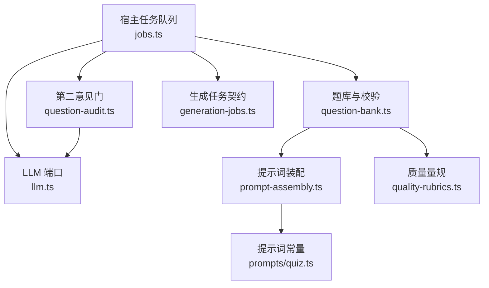
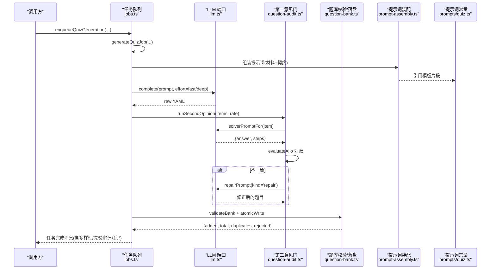
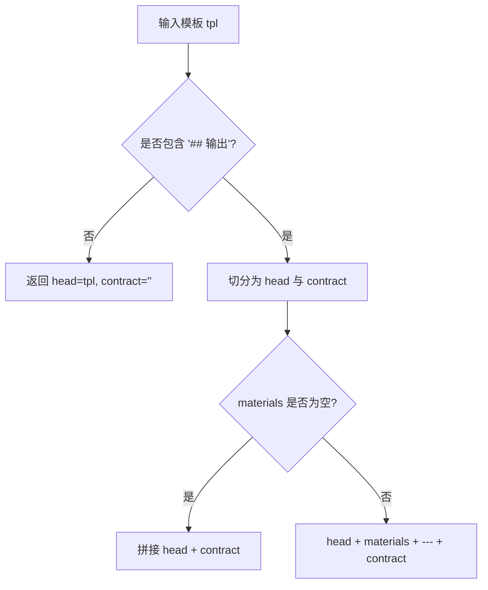
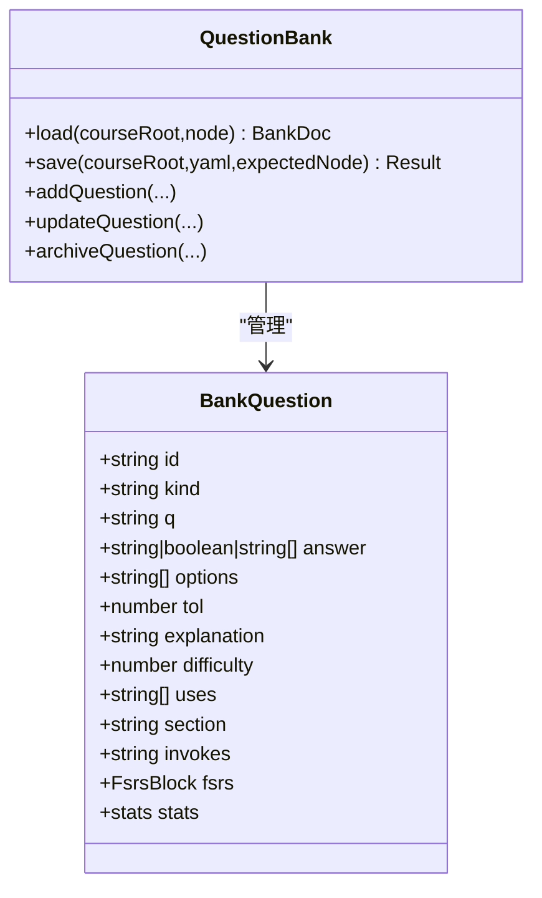
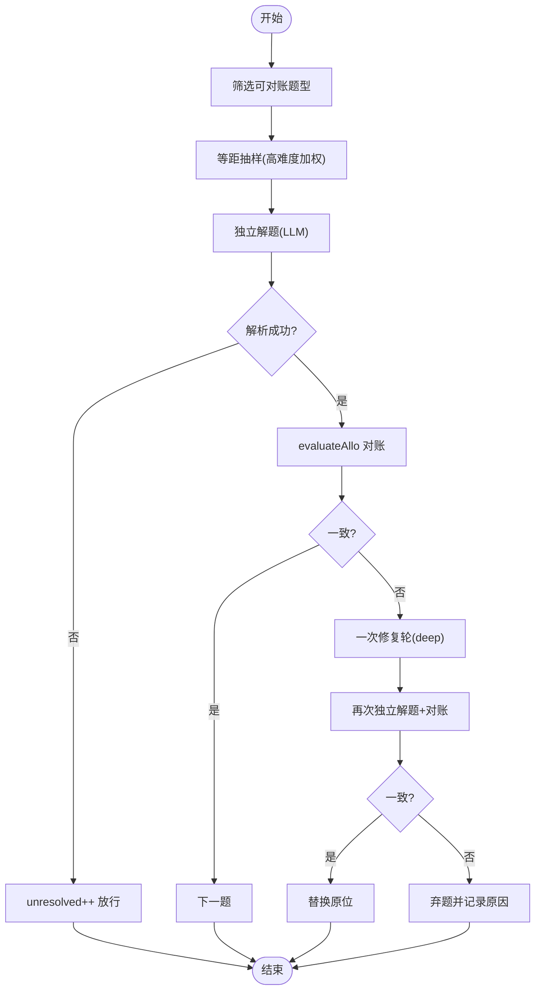
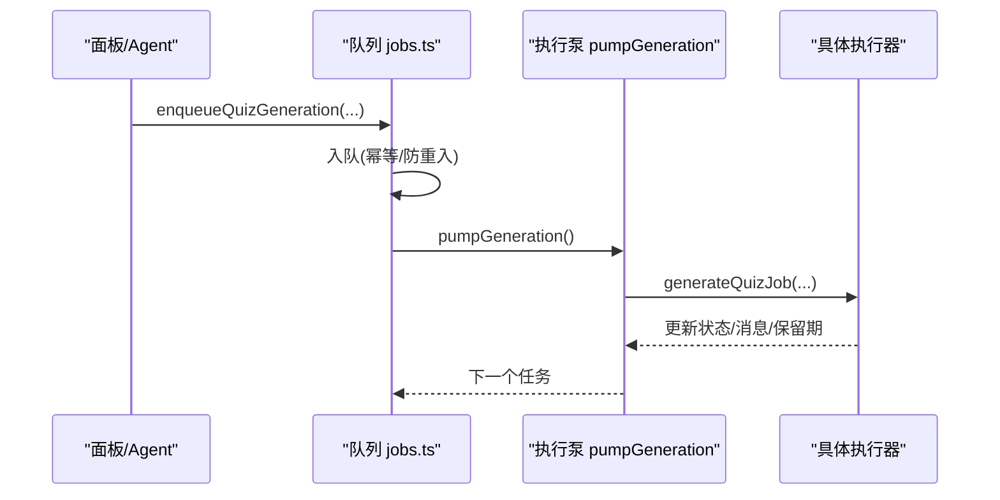
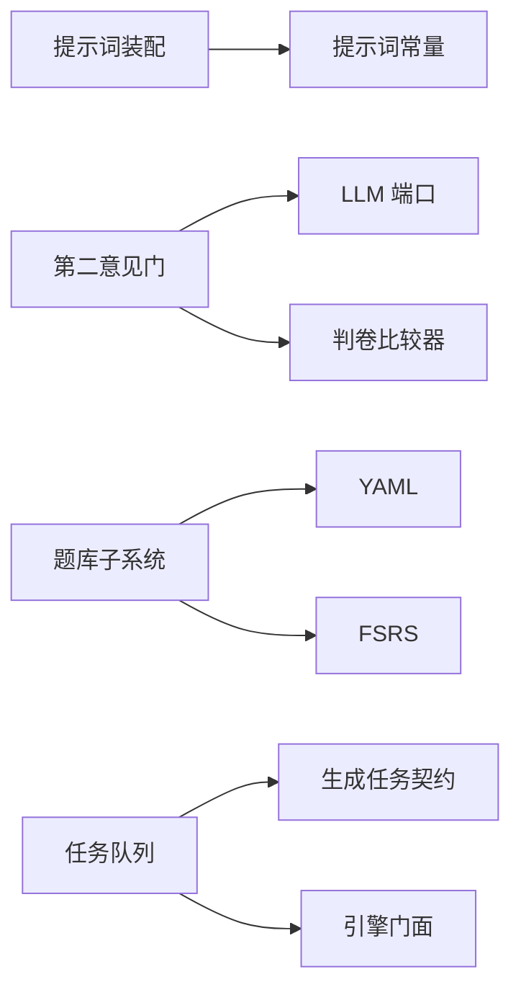

# 自动出题系统

<cite>
**本文引用的文件**
- [src/engine/prompt-assembly.ts](file://src/engine/prompt-assembly.ts)
- [src/engine/llm.ts](file://src/engine/llm.ts)
- [src/engine/question-bank.ts](file://src/engine/question-bank.ts)
- [src/engine/question-audit.ts](file://src/engine/question-audit.ts)
- [src/engine/quality-rubrics.ts](file://src/engine/quality-rubrics.ts)
- [src/engine/quality-audit.ts](file://src/engine/quality-audit.ts)
- [src/host/jobs.ts](file://src/host/jobs.ts)
- [src/generation-jobs.ts](file://src/generation-jobs.ts)
- [src/engine/prompts/quiz.ts](file://src/engine/prompts/quiz.ts)
</cite>

## 目录
1. [简介](#简介)
2. [项目结构](#项目结构)
3. [核心组件](#核心组件)
4. [架构总览](#架构总览)
5. [详细组件分析](#详细组件分析)
6. [依赖关系分析](#依赖关系分析)
7. [性能与并发](#性能与并发)
8. [故障排查指南](#故障排查指南)
9. [结论](#结论)
10. [附录：配置、监控与结果处理示例](#附录配置监控与结果处理示例)

## 简介
本系统实现“基于 LLM 的自动出题”能力，覆盖提示词组装、模型调用、结果解析、质量控制（格式验证、内容审核、质量评分）、不同题型的生成策略、以及生成任务的调度（并发控制、错误重试、进度跟踪）。文档面向工程与产品读者，既提供高层流程图，也给出代码级映射与可操作建议。

## 项目结构
围绕自动出题的关键路径由以下模块构成：
- 提示词装配与契约后置：确保“只输出 X”的强约束靠近生成点，降低长上下文丢失风险。
- LLM 端口抽象：统一补全与工具回路接口，支持 effort 档位、温度、站标签与 token 用量回传。
- 题库与题型校验：YAML schema 校验、答案形态门禁、写入原子化。
- 第二意见门：抽样独立解题 + 对账 + 修复轮，拦截键错题。
- 质量量规与审计：定义五类产物质量维度，支撑评审与系统性问题发现。
- 任务队列与执行泵：全局单并发 FIFO，节点管线与纯出题任务统一入队、状态保留期与清扫。

图表来源
- [src/host/jobs.ts:62-81](file://src/host/jobs.ts#L62-L81)
- [src/engine/llm.ts:14-83](file://src/engine/llm.ts#L14-L83)
- [src/engine/question-bank.ts:139-262](file://src/engine/question-bank.ts#LL139-L262)
- [src/engine/question-audit.ts:168-279](file://src/engine/question-audit.ts#L168-L279)
- [src/engine/prompt-assembly.ts:14-42](file://src/engine/prompt-assembly.ts#L14-L42)
- [src/engine/prompts/quiz.ts:23-165](file://src/engine/prompts/quiz.ts#L23-L165)
- [src/engine/quality-rubrics.ts:60-440](file://src/engine/quality-rubrics.ts#L60-L440)
- [src/generation-jobs.ts:6-16](file://src/generation-jobs.ts#L6-L16)

章节来源
- [src/host/jobs.ts:62-81](file://src/host/jobs.ts#L62-L81)
- [src/generation-jobs.ts:6-16](file://src/generation-jobs.ts#L6-L16)

## 核心组件
- 提示词装配器：将“材料 + 输出契约段”按固定顺序拼装，保证“只输出 X”在末尾生效；支持修复轮回灌。
- LLM 端口：封装 complete/stream，暴露 effort、station、kind、temperature、usageSink 等元信息。
- 题库子系统：YAML 读写、schema 校验、答案形态门禁、归档/恢复、FSRS 与作答统计写回。
- 第二意见门：客观题抽样独立解题 → evaluateAllo 对账 → 不一致则一次修复轮 → 再审计 → 仍不一致弃题。
- 质量量规：为大纲/节正文/题目/教练回合/种子·终点定义维度与判据，供评审与审计消费。
- 任务队列：FIFO 单并发执行泵，统一承载内容管线与纯出题任务，支持取消、保留期与清扫。

章节来源
- [src/engine/prompt-assembly.ts:14-42](file://src/engine/prompt-assembly.ts#L14-L42)
- [src/engine/llm.ts:14-83](file://src/engine/llm.ts#L14-L83)
- [src/engine/question-bank.ts:139-262](file://src/engine/question-bank.ts#L139-L262)
- [src/engine/question-audit.ts:168-279](file://src/engine/question-audit.ts#L168-L279)
- [src/engine/quality-rubrics.ts:60-440](file://src/engine/quality-rubrics.ts#L60-L440)
- [src/host/jobs.ts:696-740](file://src/host/jobs.ts#L696-L740)

## 架构总览
下图展示从“入队出题”到“落库入库”的端到端流程，包含提示词装配、LLM 调用、第二意见门、题库校验与落盘。

图表来源
- [src/host/jobs.ts:746-789](file://src/host/jobs.ts#L746-L789)
- [src/engine/prompt-assembly.ts:21-29](file://src/engine/prompt-assembly.ts#L21-L29)
- [src/engine/prompts/quiz.ts:23-165](file://src/engine/prompts/quiz.ts#L23-L165)
- [src/engine/question-audit.ts:168-279](file://src/engine/question-audit.ts#L168-L279)
- [src/engine/question-bank.ts:310-318](file://src/engine/question-bank.ts#L310-L318)

## 详细组件分析

### 提示词装配与契约后置
- 切分契约段：定位最后一个“## 输出…”标题作为契约段，前段为角色/立场/设计原则/硬约束。
- 契约后置：将“材料（上下文包/任务块/修复反馈）”放在前面，契约段置尾，确保模型最后读到“只输出 X”。
- 修复轮回灌：将“上一次输出 + 校验清单”插入材料区，不抢占契约位置。

图表来源
- [src/engine/prompt-assembly.ts:14-42](file://src/engine/prompt-assembly.ts#L14-L42)

章节来源
- [src/engine/prompt-assembly.ts:14-42](file://src/engine/prompt-assembly.ts#L14-L42)

### LLM 端口与调用语义
- 补全缝：complete(prompt, system?, opts) 支持 effort('fast'|'deep')、station、kind('complete'|'repair'|'loop')、temperature、usageSink。
- 工具回路：stream(messages, system?, tools?, temperature?) 返回文本、工具调用与 usage。
- 档位语义：'fast' 用于机械批量调用（如出卡/自注），'deep' 用于高难调用（大纲/修复轮/回执评审）。

章节来源
- [src/engine/llm.ts:14-83](file://src/engine/llm.ts#L14-L83)

### 题库与题型策略
- 题型体系：单选、判断、填空、反思、多选、数值、排序、匹配、开放问答。
- 写入侧答案形态门禁：例如多选至少两个正确项；各题型有严格 answer/options 形态要求。
- 存储与持久化：YAML 解析 → validateBank → atomicWrite；支持追加/更新/归档/恢复。
- 题型生成策略要点：
  - 选择题选项设计：干扰项需贴近真实错法，句式相近但不泄露答案；结合误解先验改编。
  - 填空题答案设置：接受多写法（同义/等价表达），必要时提供容差或可接受答案数组。
  - 简答题评分标准：open_question 走 AI 判卷（0–10 分制，≥6 及格），reflection 走评分要点。

图表来源
- [src/engine/question-bank.ts:82-109](file://src/engine/question-bank.ts#L82-L109)
- [src/engine/question-bank.ts:264-453](file://src/engine/question-bank.ts#L264-L453)

章节来源
- [src/engine/question-bank.ts:139-262](file://src/engine/question-bank.ts#L139-L262)
- [src/engine/question-bank.ts:264-453](file://src/engine/question-bank.ts#L264-L453)

### 第二意见门（质量把关）
- 抽样策略：确定性等距抽样，起步低（默认约 25%），difficulty=3 恒入样。
- 独立解题：仅看题干与选项，零答案键零解析；按题型给定 answer 形态。
- 对账比较：evaluateAllo（判卷同款），考虑归一化、容差、排序/配对逐位。
- 修复轮：不一致时恰一次修复（deep 档），修复后再审计；仍不一致则弃题。
- 报告面：记录 eligible/sampled/inconsistent/repaired/discarded/unresolved/solverCalls。

图表来源
- [src/engine/question-audit.ts:95-108](file://src/engine/question-audit.ts#L95-L108)
- [src/engine/question-audit.ts:168-279](file://src/engine/question-audit.ts#L168-L279)

章节来源
- [src/engine/question-audit.ts:168-279](file://src/engine/question-audit.ts#L168-L279)

### 质量量规与审计
- 五类产物量规：大纲/节正文/题目/教练回合/种子·终点，每条判据带证据要求与出处锚点。
- 题目维度重点：答案键正确性（键自洽、解析支撑键）、多样性（题型多样、不趋同、难度递进）、覆盖与立场（只考讲过的、invokes 恰一枚、干扰项质量）。
- 审计机制：按站×维度统计低分率，超过阈值形成“系统性候选”，供人审决策。

章节来源
- [src/engine/quality-rubrics.ts:60-440](file://src/engine/quality-rubrics.ts#L60-L440)
- [src/engine/quality-audit.ts:50-124](file://src/engine/quality-audit.ts#L50-L124)

### 任务调度与执行泵
- 入队：节点内容管线与纯出题任务统一入队，键为 course/node，phase 区分类型。
- 执行泵：全局单并发 FIFO，依次执行；支持取消旗标、终态保留期与清扫。
- 失败处理：结构化失败记录（code/finding/corpusRef），支持定点重写与重试。
- 进度跟踪：任务状态机（queued/running/cancelling/done/partial/failed/cancelled），保留期后清理。

图表来源
- [src/host/jobs.ts:292-350](file://src/host/jobs.ts#L292-L350)
- [src/host/jobs.ts:696-740](file://src/host/jobs.ts#L696-L740)
- [src/generation-jobs.ts:6-16](file://src/generation-jobs.ts#L6-L16)

章节来源
- [src/host/jobs.ts:292-350](file://src/host/jobs.ts#L292-L350)
- [src/host/jobs.ts:696-740](file://src/host/jobs.ts#L696-L740)
- [src/generation-jobs.ts:6-16](file://src/generation-jobs.ts#L6-L16)

## 依赖关系分析
- 提示词装配依赖提示词常量（prompts/quiz.ts），被题库与内容管线复用。
- 第二意见门依赖 LLM 端口与判卷比较器（grading），与题库解耦但共享题型知识。
- 题库子系统依赖 YAML 解析、FSRS、概念登记与错误卡等下游能力。
- 任务队列依赖生成任务契约（generation-jobs.ts）与引擎门面，屏蔽具体实现细节。

图表来源
- [src/engine/prompt-assembly.ts:14-42](file://src/engine/prompt-assembly.ts#L14-L42)
- [src/engine/prompts/quiz.ts:23-165](file://src/engine/prompts/quiz.ts#L23-L165)
- [src/engine/question-audit.ts:168-279](file://src/engine/question-audit.ts#L168-L279)
- [src/engine/question-bank.ts:264-453](file://src/engine/question-bank.ts#L264-L453)
- [src/host/jobs.ts:696-740](file://src/host/jobs.ts#L696-L740)
- [src/generation-jobs.ts:6-16](file://src/generation-jobs.ts#L6-L16)

章节来源
- [src/engine/prompt-assembly.ts:14-42](file://src/engine/prompt-assembly.ts#L14-L42)
- [src/engine/question-audit.ts:168-279](file://src/engine/question-audit.ts#L168-L279)
- [src/engine/question-bank.ts:264-453](file://src/engine/question-bank.ts#L264-L453)
- [src/host/jobs.ts:696-740](file://src/host/jobs.ts#L696-L740)
- [src/generation-jobs.ts:6-16](file://src/generation-jobs.ts#L6-L16)

## 性能与并发
- 并发控制：全局单并发执行泵，避免资源争用与竞态；同一节点重复入队幂等且拒绝在途任务。
- 成本优化：
  - effort 档位：fast 用于批量/机械调用，deep 用于高难/修复轮。
  - 第二意见门：抽样而非全量，减少 LLM 调用成本。
  - 提示词契约后置：减少模型误读，降低重试概率。
- 超时与重试：
  - 任务保留期：成功短保留（便于查看），失败/部分失败长保留（便于排查与重试）。
  - 失败分类：结构化失败码与 finding，支持定向重试。
- 观测性：
  - usageSink 上报 token 用量。
  - 先验检索审计注记与多样性指标随任务消息可见。

章节来源
- [src/host/jobs.ts:746-789](file://src/host/jobs.ts#L746-L789)
- [src/engine/question-audit.ts:95-108](file://src/engine/question-audit.ts#L95-L108)
- [src/generation-jobs.ts:42-55](file://src/generation-jobs.ts#L42-L55)

## 故障排查指南
- 常见错误与定位：
  - 题库 Broken：validateBank 报错会列出具体字段与行号，检查 YAML 结构与题型约束。
  - 第二意见门失败：solver 不可解析或 compare 不可用会保守放行（unresolved），不影响整批。
  - 任务失败：contentFailureStatus 将 running/cancelling 转为 failed/cancelled；sectionFailure 提取 finding 与 corpusRef。
- 排查步骤：
  1) 查看任务注册表状态与消息（done/partial/failed/cancelled）。
  2) 若 partial，根据 sectionId 进行定点重写。
  3) 通过语料引用（corpusRef）回溯最近一条生成语料，定位死因。
  4) 检查提示词常量与模板变更是否引入占位符缺失。
- 恢复与重试：
  - 失败/部分失败保留 24h，期间可重试。
  - 成功结果保留 30min，便于快速查看。

章节来源
- [src/engine/question-bank.ts:139-262](file://src/engine/question-bank.ts#L139-L262)
- [src/engine/question-audit.ts:168-279](file://src/engine/question-audit.ts#L168-L279)
- [src/generation-jobs.ts:123-167](file://src/generation-jobs.ts#L123-L167)

## 结论
本自动出题系统以“契约后置 + 第二意见门 + 题库强校验 + 任务队列”为核心，兼顾生成效率与质量可控。通过 effort 档位、抽样审计与结构化失败处理，系统在大规模生成场景下具备鲁棒性与可观测性。后续可继续扩展多样性度量、更多题型策略与人审闭环。

## 附录：配置、监控与结果处理示例
- 配置生成参数
  - effort：根据节点复杂度选择 fast/deep（高复杂度使用 deep）。
  - secondOpinion.rate：控制第二意见门抽样率（默认约 25%，≤0 关闭）。
  - temperature：通过 LLM 端口透传 provider 采样温度（缺省使用宿主默认）。
  - station/kind：标注调用站点与形态（complete/repair/loop），便于语料采集与审计。
- 监控生成状态
  - 任务状态：queued/running/cancelling/done/partial/failed/cancelled。
  - 任务消息：包含新增题数、判重丢弃、拒收、第二意见抽样与多样性指标、先验检索审计注记。
  - 保留期：成功短保留、失败长保留，便于复盘与重试。
- 处理生成结果
  - 成功：读取 added/total，更新题库视图。
  - 部分失败：依据 sectionId 进行定点重写。
  - 失败：查看 code/finding/corpusRef，定位提示词或数据问题后重试。

章节来源
- [src/host/jobs.ts:746-789](file://src/host/jobs.ts#L746-L789)
- [src/generation-jobs.ts:42-55](file://src/generation-jobs.ts#L42-L55)
- [src/engine/question-audit.ts:168-279](file://src/engine/question-audit.ts#L168-L279)