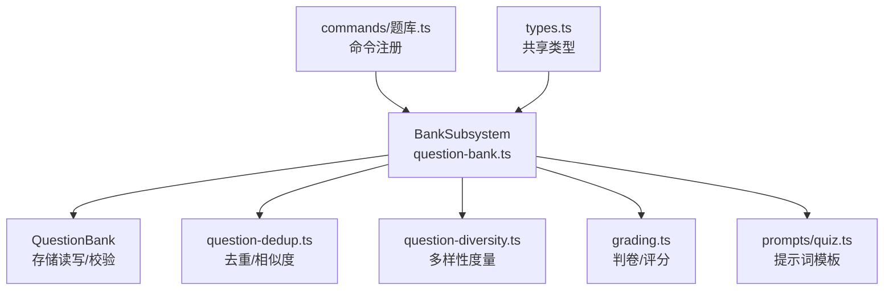
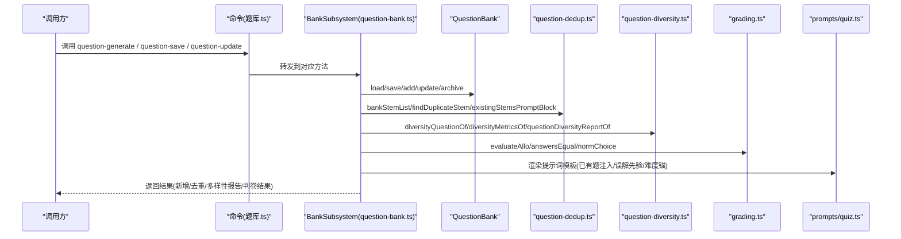
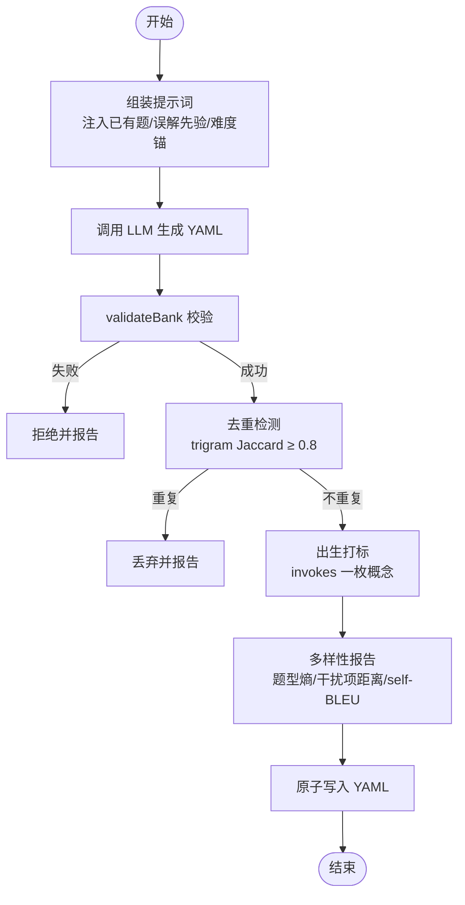
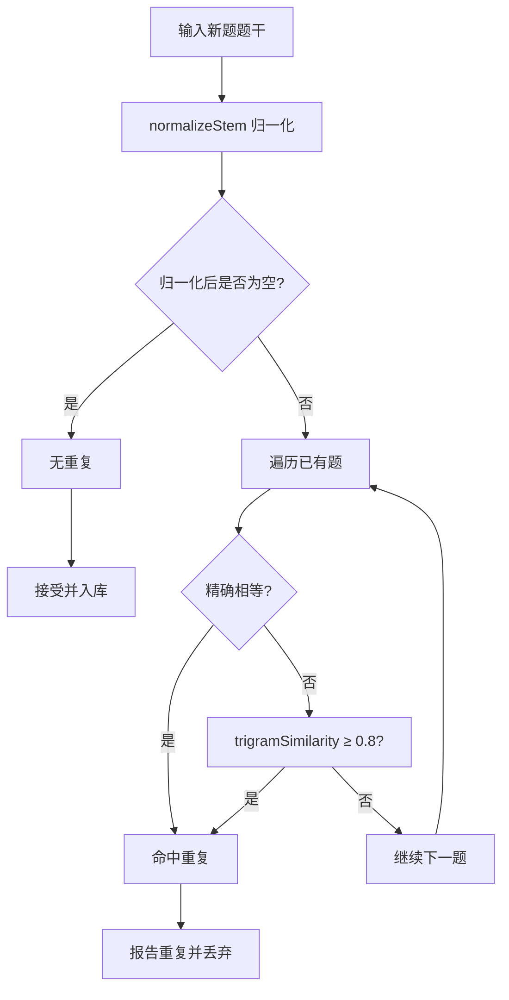
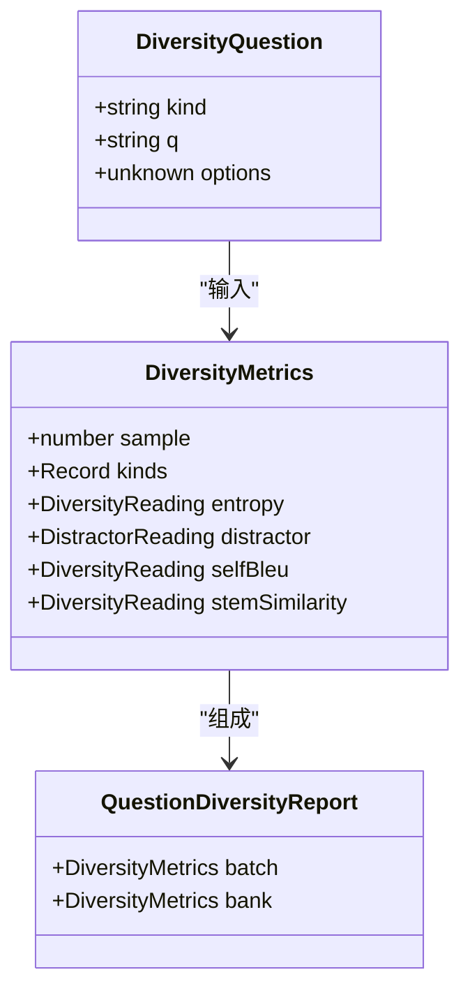
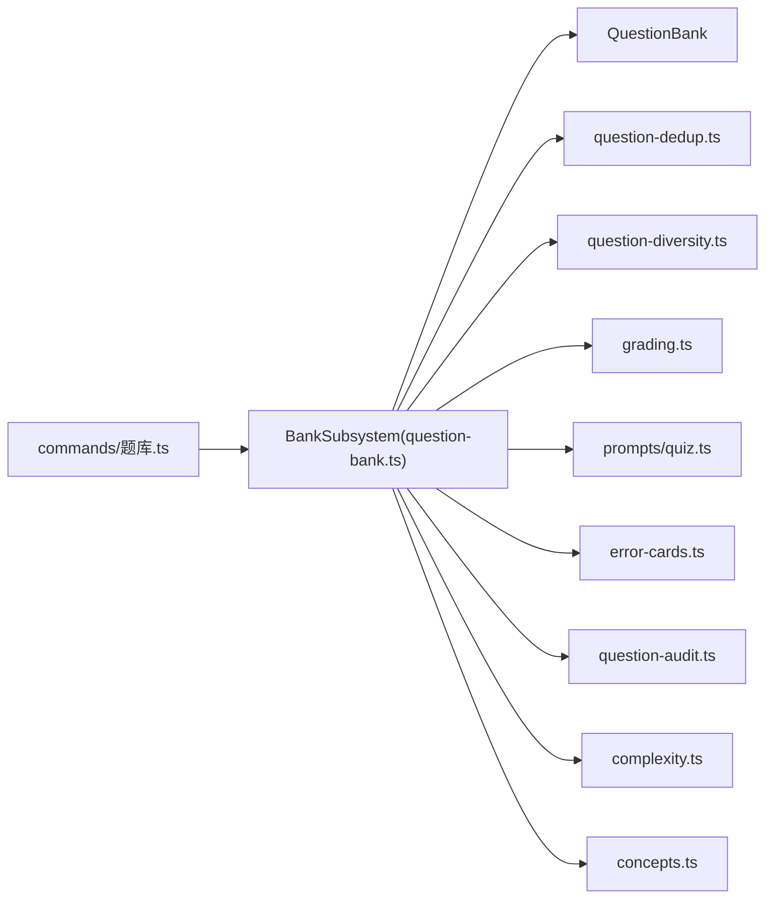

# 题库子系统

<cite>
**本文引用的文件**
- [question-bank.ts](file://src/engine/question-bank.ts)
- [question-dedup.ts](file://src/engine/question-dedup.ts)
- [question-diversity.ts](file://src/engine/question-diversity.ts)
- [types.ts](file://src/engine/types.ts)
- [grading.ts](file://src/engine/grading.ts)
- [quiz.ts](file://src/engine/prompts/quiz.ts)
- [题库.ts](file://src/commands/题库.ts)
</cite>

## 目录
1. [简介](#简介)
2. [项目结构](#项目结构)
3. [核心组件](#核心组件)
4. [架构总览](#架构总览)
5. [详细组件分析](#详细组件分析)
6. [依赖关系分析](#依赖关系分析)
7. [性能考量](#性能考量)
8. [故障排查指南](#故障排查指南)
9. [结论](#结论)
10. [附录：使用示例与最佳实践](#附录使用示例与最佳实践)

## 简介
本文件系统性地梳理题库子系统的实现，覆盖以下目标：
- BankSubsystem 的核心能力：题目存储管理、自动出题、去重机制、多样性控制。
- Question 数据结构设计：题型分类、知识点关联（invokes）、难度标记（difficulty）等。
- 自动出题系统：生成算法、质量控制、版本与先验注入、重复检测与合并策略。
- 去重机制 question-dedup：相似度计算、重复检测、提示词中已有题注入。
- 多样性控制 question-diversity：题型分布熵、干扰项编辑距离、题面 self-BLEU、平均对相似度。
- 提供可操作的代码路径指引，帮助读者在仓库中定位关键实现。

## 项目结构
题库子系统围绕三个核心模块组织：
- 题库存储与管理：question-bank.ts
- 去重与查重：question-dedup.ts
- 多样性度量：question-diversity.ts
- 判卷与评分：grading.ts
- 提示词模板：prompts/quiz.ts
- 命令注册与对外接口：commands/题库.ts
- 共享类型定义：types.ts

图表来源
- [question-bank.ts:513-514](file://src/engine/question-bank.ts#L513-L514)
- [question-dedup.ts:1-89](file://src/engine/question-dedup.ts#L1-L89)
- [question-diversity.ts:1-303](file://src/engine/question-diversity.ts#L1-L303)
- [grading.ts:113-200](file://src/engine/grading.ts#L113-L200)
- [quiz.ts:1-165](file://src/engine/prompts/quiz.ts#L1-L165)
- [题库.ts:201-224](file://src/commands/题库.ts#L201-L224)

章节来源
- [question-bank.ts:1-120](file://src/engine/question-bank.ts#L1-L120)
- [question-dedup.ts:1-89](file://src/engine/question-dedup.ts#L1-L89)
- [question-diversity.ts:1-303](file://src/engine/question-diversity.ts#L1-L303)
- [grading.ts:1-200](file://src/engine/grading.ts#L1-L200)
- [quiz.ts:1-165](file://src/engine/prompts/quiz.ts#L1-L165)
- [题库.ts:1-362](file://src/commands/题库.ts#L1-L362)
- [types.ts:30-61](file://src/engine/types.ts#L30-L61)

## 核心组件
- BankSubsystem：题库域门面，聚合存储、判卷、去重、多样性、错误卡、勘误、建议等功能；通过 BankDeps 窄面注入外部依赖，避免环依赖。
- QuestionBank：YAML 题库的加载、校验、追加、更新、归档、批量归档、证据写回（FSRS/stats）。
- question-dedup：题面归一化、trigram Jaccard 相似度、已有题注入提示词、重复检测。
- question-diversity：题型分布熵、干扰项编辑距离、self-BLEU、平均对相似度，输出批内与题库累计报告。
- grading：判卷规则（单选、判断、填空、多选、数值、排序、匹配、反思、开放题），答案归一化、容差处理。
- prompts/quiz：提示词模板（第二意见、修复、已有题注入、误解先验、节标注、难度锚定等）。
- commands/题库.ts：对外暴露的命令路由（生成、保存、更新、归档、审计、建议等）。

章节来源
- [question-bank.ts:264-453](file://src/engine/question-bank.ts#L264-L453)
- [question-dedup.ts:14-89](file://src/engine/question-dedup.ts#L14-L89)
- [question-diversity.ts:39-97](file://src/engine/question-diversity.ts#L39-L97)
- [grading.ts:113-200](file://src/engine/grading.ts#L113-L200)
- [quiz.ts:23-165](file://src/engine/prompts/quiz.ts#L23-L165)
- [题库.ts:85-362](file://src/commands/题库.ts#L85-L362)

## 架构总览
BankSubsystem 作为门面，协调多个子系统完成题库相关任务：
- 存储层：QuestionBank 负责 YAML 题库的读取、校验、写入、单题操作。
- 判卷层：grading 提供按题型的判卷逻辑与答案归一化。
- 去重层：question-dedup 提供重复检测与已有题注入，防止相似题入库。
- 多样性层：question-diversity 提供多维指标衡量题目分布与文本相似度。
- 提示词层：prompts/quiz 集中管理提示词模板，确保一致性。
- 命令层：commands/题库.ts 将引擎能力暴露为工具/面板接口。

图表来源
- [题库.ts:201-224](file://src/commands/题库.ts#L201-L224)
- [question-bank.ts:513-514](file://src/engine/question-bank.ts#L513-L514)
- [question-dedup.ts:48-89](file://src/engine/question-dedup.ts#L48-L89)
- [question-diversity.ts:249-303](file://src/engine/question-diversity.ts#L249-L303)
- [grading.ts:133-200](file://src/engine/grading.ts#L133-L200)
- [quiz.ts:67-165](file://src/engine/prompts/quiz.ts#L67-L165)

## 详细组件分析

### 题目数据结构 Question（BankQuestion）
- 基本字段：id、kind（题型）、q（题干）、answer（答案，随题型变化）、options（选项）、explanation（解析）、difficulty（难度 1-3）、uses（前置技能）、tags（标签）、tol（数值题容差）、section（来源节标题）、invokes（一枚概念引用，出生打标）、archived/archived_reason（归档状态与原因）、fsrs（题目级调度）、stats（作答统计）。
- 题型分类：single_choice、true_false、fill_in_blank、reflection、multi_choice、numeric、ordering、matching、open_question。
- 知识点关联：invokes 字段绑定登记表在册概念名，用于出生期概念覆盖与后续增长批次权重投影。
- 难度标记：difficulty 用于难度锚定与质量评估；结合节点复杂度档（低/中/高）进行出题约束。

章节来源
- [question-bank.ts:82-109](file://src/engine/question-bank.ts#L82-L109)
- [question-bank.ts:113-121](file://src/engine/question-bank.ts#L113-L121)
- [question-bank.ts:139-262](file://src/engine/question-bank.ts#L139-L262)
- [types.ts:30-61](file://src/engine/types.ts#L30-L61)

### 自动出题系统（question-generate）
- 入口：commands/题库.ts 中的 question-generate 命令，排队执行并等待完成。
- 流程：
  - 组装提示词：从 quiz.ts 取模板，注入节点正文、已有题清单（question-dedup.existingStemsPromptBlock）、误解先验（MISCONCEPTION_PRIOR_BLOCK）、难度锚（QUIZ_NODE_ANCHOR_*）。
  - LLM 生成：以 fast/deep/off 档位调用模型，产出 YAML。
  - 校验门禁：validateBank 严格校验 schema，失败则零落盘。
  - 去重检测：findDuplicateStem 基于 trigram Jaccard 阈值判定重复或高度相似，命中丢弃并报告。
  - 出生打标：当课程概念登记范围非空时，要求每道题携带一枚 invokes 概念；缺失一次修复轮，仍为空则拒绝。
  - 多样性报告：question-diversity 计算批内与题库累计指标，随返回值上报。
  - 落盘：通过 QuestionBank.save/add 写入题库 YAML。
- 质量控制：
  - 提示词模板约束题型、数量、难度锚、已有题禁止重复。
  - validateBank 强制答案形态（如 multi_choice 至少两个正确项）。
  - 第二意见门（question-audit）独立解题对账，必要时触发修复轮。
- 版本管理：
  - 题库 YAML 原子写入 atomicWrite，保证一致性。
  - 生成任务状态记录于全局队列，进度可见。

图表来源
- [题库.ts:201-224](file://src/commands/题库.ts#L201-L224)
- [quiz.ts:67-165](file://src/engine/prompts/quiz.ts#L67-L165)
- [question-dedup.ts:14-89](file://src/engine/question-dedup.ts#L14-L89)
- [question-bank.ts:309-318](file://src/engine/question-bank.ts#L309-L318)
- [question-diversity.ts:249-303](file://src/engine/question-diversity.ts#L249-L303)

章节来源
- [题库.ts:201-224](file://src/commands/题库.ts#L201-L224)
- [quiz.ts:67-165](file://src/engine/prompts/quiz.ts#L67-L165)
- [question-dedup.ts:48-89](file://src/engine/question-dedup.ts#L48-L89)
- [question-bank.ts:309-318](file://src/engine/question-bank.ts#L309-L318)
- [question-diversity.ts:249-303](file://src/engine/question-diversity.ts#L249-L303)

### 题目去重机制（question-dedup）
- 题面归一化：normalizeStem 去除空白与标点、大小写折叠，仅保留内容字符。
- 相似度计算：trigramSimilarity 使用字符 trigram 集合的 Jaccard 相似度，阈值默认 0.8。
- 重复检测：findDuplicateStem 遍历已有题，精确相等或相似度≥阈值即命中。
- 已有题注入：bankStemList 提取非归档题的题干/题型/难度；existingStemsPromptBlock 生成提示词片段，限制最多 15 条，避免模型重复出题。

图表来源
- [question-dedup.ts:17-41](file://src/engine/question-dedup.ts#L17-L41)
- [question-dedup.ts:61-74](file://src/engine/question-dedup.ts#L61-L74)
- [question-dedup.ts:48-89](file://src/engine/question-dedup.ts#L48-L89)

章节来源
- [question-dedup.ts:14-89](file://src/engine/question-dedup.ts#L14-L89)

### 多样性控制（question-diversity）
- 题型分布熵：entropyOf 计算批内题型香农熵（bit），单一题型为 0，多题型 > 0。
- 干扰项编辑距离：distractorDistanceOf 对单选/多选题 options 两两 Levenshtein 距离取均值，报告最差一题。
- 题面 self-BLEU：selfBleuOf 计算每道题相对其余题面的 BLEU（1–4 阶，加一平滑，标准 brevity penalty），按长度加权平均。
- 平均对相似度：meanStemSimilarityOf 使用 trigram Jaccard 按长度加权，作为 self-BLEU 的第二读数。
- 报告结构：QuestionDiversityReport 包含 batch（批内）与 bank（题库累计）两套指标，样本量如实带出。

图表来源
- [question-diversity.ts:39-97](file://src/engine/question-diversity.ts#L39-L97)
- [question-diversity.ts:249-303](file://src/engine/question-diversity.ts#L249-L303)

章节来源
- [question-diversity.ts:1-303](file://src/engine/question-diversity.ts#L1-L303)

### 判卷与评分（grading）
- 题型支持：single_choice、true_false、fill_in_blank、multi_choice、numeric、ordering、matching、reflection、open_question。
- 答案归一化：normAnswer、normBlank、normChoice 处理空白、全半角、大小写、字母提取。
- 数值容差：numericOf 解析数值/分数/百分数；默认相对容差 1e-9×|答案|，下限 1e-12。
- 判卷逻辑：evaluateAllo 按题型比较答案，reflection/open_question 必须经 AI 判卷通道，否则抛错。
- 及格线：PASS_SCORE = 0.6，用于整体通过率判定。

章节来源
- [grading.ts:1-200](file://src/engine/grading.ts#L1-L200)

### 提示词模板（prompts/quiz.ts）
- 第二意见门：独立解题提示词与修复轮骨架，确保答案键与题面一致。
- 已有题注入：EXISTING_STEMS_BLOCK 列出题库已有题，禁止重复。
- 误解先验：MISCONCEPTION_PRIOR_BLOCK 注入本节点登记的误解先验，辅助生成干扰项。
- 节标注：QUIZ_SECTION_LISTING_SINGLE/MULTI/BATCH 限定 section 字段取值。
- 难度锚：QUIZ_COUNT_AND_ANCHOR 与 QUIZ_NODE_ANCHOR_*/SECTION_ANCHOR_* 控制难度递进。

章节来源
- [quiz.ts:23-165](file://src/engine/prompts/quiz.ts#L23-L165)

## 依赖关系分析
- BankSubsystem 依赖 BankDeps 窄面，避免与 store/registry/proposals 形成环依赖。
- QuestionBank 依赖 io.ts（原子写入）、yaml.ts（YAML 解析）、grading.ts（判卷）、notes.ts（笔记 frontmatter）、complexity.ts（复杂度档）、concepts.ts（概念登记）、error-cards.ts（错误卡）、question-dedup.ts（去重）、question-diversity.ts（多样性）、question-audit.ts（第二意见）。
- 命令层通过 commands/题库.ts 将引擎能力暴露为工具/面板接口，解耦 UI 与引擎。

图表来源
- [question-bank.ts:460-511](file://src/engine/question-bank.ts#L460-L511)
- [题库.ts:85-362](file://src/commands/题库.ts#L85-L362)

章节来源
- [question-bank.ts:460-511](file://src/engine/question-bank.ts#L460-L511)
- [题库.ts:85-362](file://src/commands/题库.ts#L85-L362)

## 性能考量
- 去重计算：trigram Jaccard 相似度 O(n*m)，n 为已有题数，m 为新题长度；建议限制已有题注入数量（≤15）以降低提示词体积与计算开销。
- 多样性度量：self-BLEU 与平均对相似度均为 O(n^2) 对题面比较；批内规模较大时需关注性能。
- 判卷效率：规则判卷为常数时间；AI 判卷（reflection/open_question）需走通道，延迟较高。
- 存储写入：atomicWrite 保证原子性，避免并发写入冲突。

[本节提供一般性指导，无需特定文件分析]

## 故障排查指南
- YAML 解析失败：检查题库文件格式与 schema 校验错误信息（validateBank 返回 errors）。
- 重复题入库：确认 findDuplicateStem 阈值与已有题注入是否生效；查看 duplicates 报告。
- 多样性退化：检查题型分布熵是否接近 0、干扰项编辑距离是否过低、self-BLEU 是否过高。
- 判卷失败：reflection/open_question 必须经 AI 判卷通道；检查答案格式与容差设置。
- 归档/恢复异常：确认 archiveQuestion/archiveQuestions 的 reason 与 qid 正确性。

章节来源
- [question-bank.ts:139-262](file://src/engine/question-bank.ts#L139-L262)
- [question-dedup.ts:61-74](file://src/engine/question-dedup.ts#L61-L74)
- [question-diversity.ts:249-303](file://src/engine/question-diversity.ts#L249-L303)
- [grading.ts:133-200](file://src/engine/grading.ts#L133-L200)

## 结论
题库子系统通过 BankSubsystem 统一协调存储、判卷、去重、多样性、提示词与命令层，实现了高质量的自动出题与题库管理能力。其设计强调：
- 严格的 schema 校验与原子写入，保障数据一致性。
- 双层去重（精确+近似），有效抑制重复题。
- 多维度多样性度量，避免“同构题”与“众数化干扰项”。
- 出生打标与误解先验注入，提升题目与知识点的关联度。
- 命令层解耦，便于扩展与维护。

[本节总结性内容，无需特定文件分析]

## 附录：使用示例与最佳实践
- 管理题库：
  - 添加题目：使用 question-add 命令，确保 answer 形态符合题型约束（如 multi_choice 至少两个正确项）。
  - 更新题目：使用 question-update 命令，仅允许作者字段白名单（q/options/answer/explanation/difficulty/section/uses/tags/tol）。
  - 归档题目：使用 question-archive 命令，记录 archived_reason（skip/cleanup/too_easy/erratum/manual）。
- 生成新题目：
  - 调用 question-generate 命令，等待作业完成；查看 duplicates 与 rejected 报告。
  - 结合多样性报告调整出题策略（如增加题型多样性、降低 self-BLEU）。
- 优化题目分布：
  - 监控题型分布熵，确保多题型覆盖。
  - 检查干扰项编辑距离，避免选项过于相似。
  - 利用 meanStemSimilarityOf 作为 self-BLEU 的第二读数，跨批比较漂移。

章节来源
- [题库.ts:85-362](file://src/commands/题库.ts#L85-L362)
- [question-bank.ts:337-453](file://src/engine/question-bank.ts#L337-L453)
- [question-diversity.ts:249-303](file://src/engine/question-diversity.ts#L249-L303)