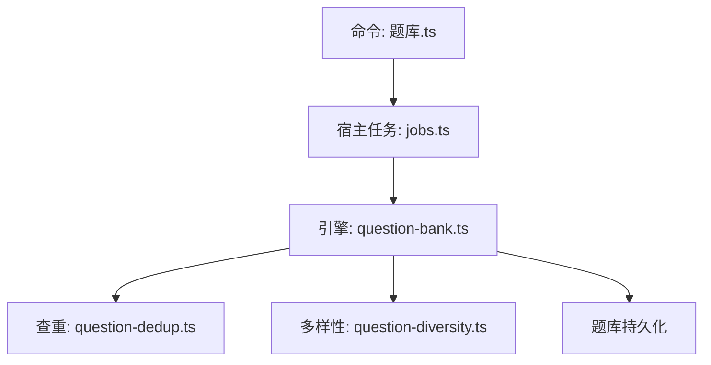
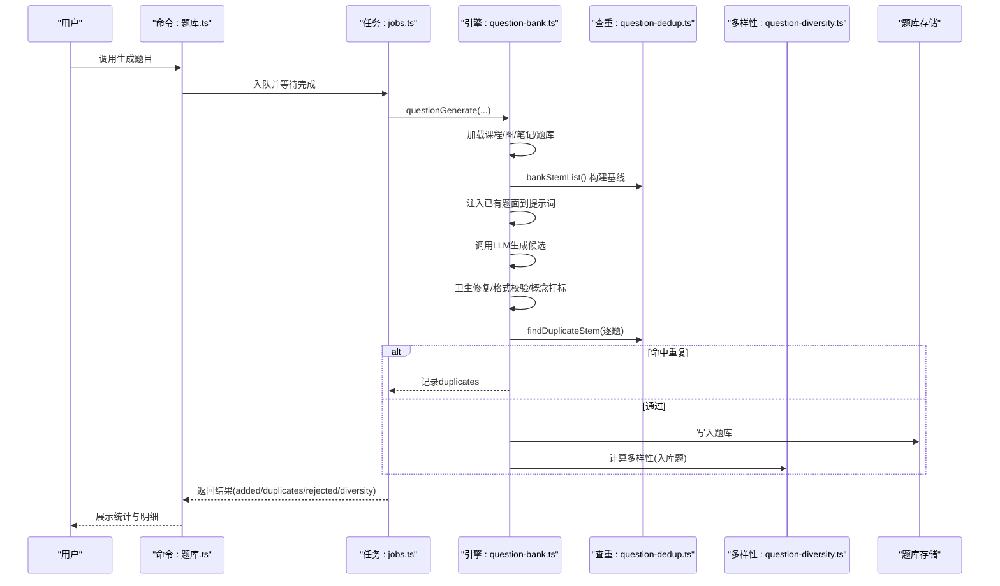
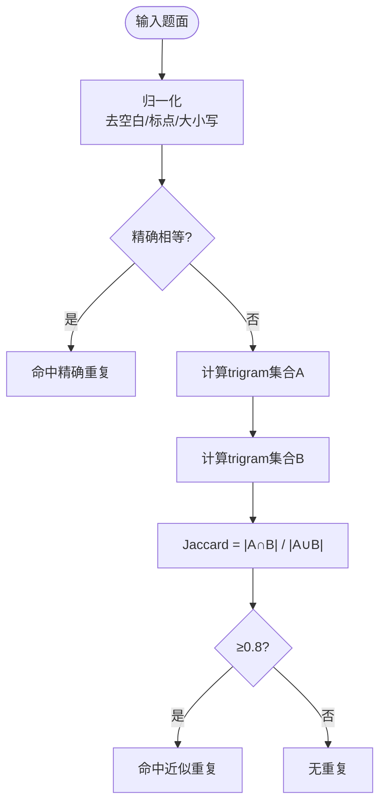
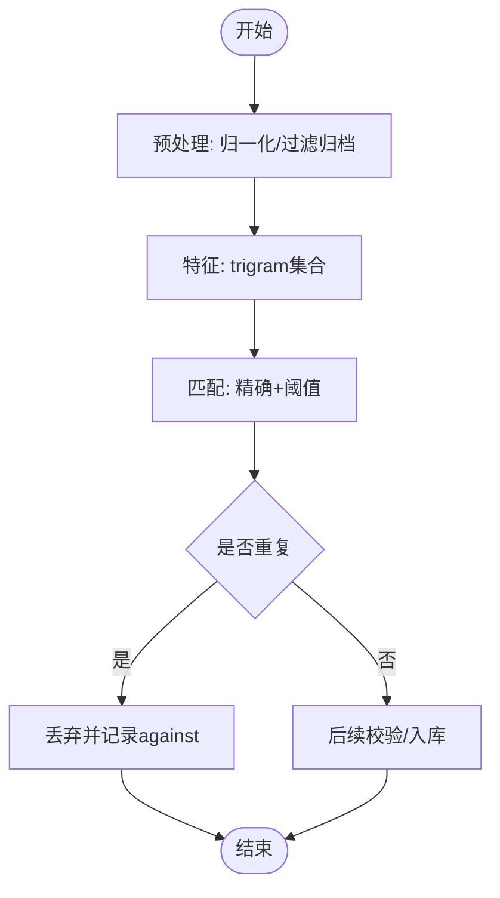
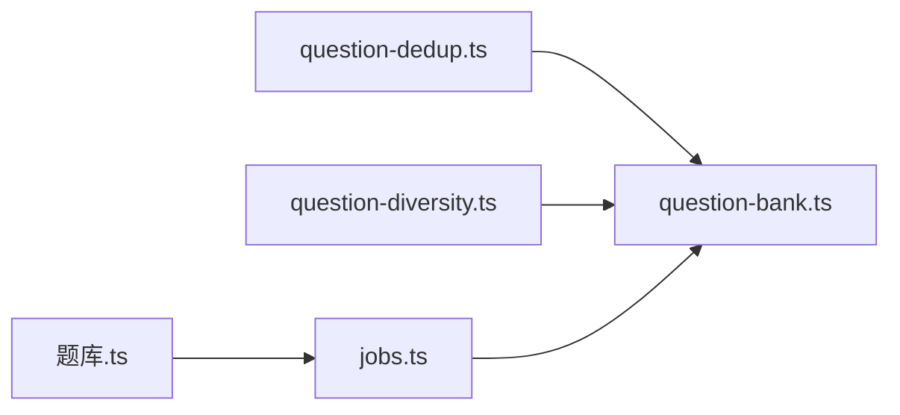

# 题目去重机制

<cite>
**本文引用的文件**
- [question-dedup.ts](file://src/engine/question-dedup.ts)
- [question-diversity.ts](file://src/engine/question-diversity.ts)
- [question-bank.ts](file://src/engine/question-bank.ts)
- [jobs.ts](file://src/host/jobs.ts)
- [题库.ts](file://src/commands/题库.ts)
- [question-dedup.test.ts](file://tests/question-dedup.test.ts)
- [question-diversity.test.ts](file://tests/question-diversity.test.ts)
</cite>

## 目录
1. [简介](#简介)
2. [项目结构](#项目结构)
3. [核心组件](#核心组件)
4. [架构总览](#架构总览)
5. [详细组件分析](#详细组件分析)
6. [依赖关系分析](#依赖关系分析)
7. [性能考量](#性能考量)
8. [故障排查指南](#故障排查指南)
9. [结论](#结论)
10. [附录：配置与使用示例](#附录：配置与使用示例)

## 简介
本文件系统化阐述“题目去重机制”的设计与实现，覆盖相似度计算（文本、语义、结构）、重复检测工作流（预处理、特征提取、匹配策略）、合并策略（冲突解决、版本保留、数据一致性）以及性能优化（索引、缓存、增量更新）。同时提供可操作的配置与执行步骤，帮助读者在工程中正确启用并调优去重能力。

## 项目结构
去重相关代码主要分布在引擎层与宿主/命令层：
- 相似度与查重算法：src/engine/question-dedup.ts
- 多样性度量（作为去重的补充维度）：src/engine/question-diversity.ts
- 出题与入库流程（集成查重与报告）：src/engine/question-bank.ts
- 任务调度与第二意见门：src/host/jobs.ts
- 命令行入口与说明：src/commands/题库.ts
- 测试用例验证行为与边界：tests/question-dedup.test.ts、tests/question-diversity.test.ts

图表来源
- [question-bank.ts:1153-1343](file://src/engine/question-bank.ts#L1153-L1343)
- [question-dedup.ts:1-89](file://src/engine/question-dedup.ts#L1-L89)
- [question-diversity.ts:1-303](file://src/engine/question-diversity.ts#L1-L303)
- [jobs.ts:71-96](file://src/host/jobs.ts#L71-L96)
- [题库.ts:198-206](file://src/commands/题库.ts#L198-L206)

章节来源
- [question-bank.ts:1153-1343](file://src/engine/question-bank.ts#L1153-L1343)
- [question-dedup.ts:1-89](file://src/engine/question-dedup.ts#L1-L89)
- [question-diversity.ts:1-303](file://src/engine/question-diversity.ts#L1-L303)
- [jobs.ts:71-96](file://src/host/jobs.ts#L71-L96)
- [题库.ts:198-206](file://src/commands/题库.ts#L198-L206)

## 核心组件
- 题面归一化与相似度计算
  - 题面归一化：去除空白与标点符号、统一大小写，仅保留内容字符。
  - 字符 trigram Jaccard 相似度：将题面切分为三元组集合，计算交集与并集的比例。
  - 阈值：默认 0.8，超过即判定为高度相似。
- 已有题面清单构建
  - 从题库中过滤归档题，仅保留题面、题型、难度等元信息，用于提示词注入与查重基线。
- 查重函数
  - findDuplicateStem：先做精确归一化相等判断，再按 trigram 相似度阈值判定；命中返回对方原题面，未命中返回空。
- 多样性指标（互补维度）
  - 题型分布熵、干扰项编辑距离、题面 self-BLEU、平均对相似度（trigram Jaccard 加权），用于评估批内与题库的趋同程度，辅助质量治理。

章节来源
- [question-dedup.ts:14-74](file://src/engine/question-dedup.ts#L14-L74)
- [question-diversity.ts:1-303](file://src/engine/question-diversity.ts#L1-L303)

## 架构总览
题目生成与去重的主流程如下：
- 命令层接收“生成题目”请求，进入全局串行队列，避免并发写入冲突。
- 引擎加载课程节点与题库，组装提示词时注入“已有题面清单”（≤15条，不含答案）。
- LLM 产出候选题目后，逐题进行：
  - 卫生修复与格式校验
  - 概念引用出生打标（缺失则一次修复，仍不合格拒收）
  - 程序化查重（精确 + trigram ≥0.8）
  - 可选的第二意见门（抽样独立解题对账，不一致则修复或弃题）
- 通过校验的题目入库，未通过的去重命中计入 duplicates 报告，拒绝项计入 rejected。
- 多样性仪表基于“已入库题”计算，随结果返回供观测。

图表来源
- [question-bank.ts:1153-1343](file://src/engine/question-bank.ts#L1153-L1343)
- [question-dedup.ts:14-74](file://src/engine/question-dedup.ts#L14-L74)
- [question-diversity.ts:249-303](file://src/engine/question-diversity.ts#L249-L303)
- [jobs.ts:71-96](file://src/host/jobs.ts#L71-L96)
- [题库.ts:198-206](file://src/commands/题库.ts#L198-L206)

## 详细组件分析

### 相似度计算算法
- 文本相似度
  - 归一化：去除空白与中英文标点、统一小写，得到“内容字符串”。
  - 精确重复：归一化后字符串完全相等即命中。
  - 近似重复：字符 trigram Jaccard 相似度 ≥ 0.8 判定为高度相似。
- 语义相似度（当前实现侧重字面近似）
  - 通过 trigram 集合捕获局部重叠，适合中文短文本的近似匹配。
  - 若需更强语义理解，可在后续扩展向量嵌入相似度（如句子级向量余弦相似度），并与 trigram 融合打分。
- 结构相似度（多样性维度）
  - 题型分布熵：衡量批内题型多样性。
  - 干扰项编辑距离：单选/多选选项两两 Levenshtein 距离均值，越小越趋同。
  - 题面 self-BLEU：每道题相对其余题面的 BLEU 分数，越高越趋同。
  - 平均对相似度：trigram Jaccard 按题面长度加权，作为 self-BLEU 的同轴第二读数。

图表来源
- [question-dedup.ts:17-41](file://src/engine/question-dedup.ts#L17-L41)
- [question-dedup.ts:61-74](file://src/engine/question-dedup.ts#L61-L74)

章节来源
- [question-dedup.ts:14-74](file://src/engine/question-dedup.ts#L14-L74)
- [question-diversity.ts:99-154](file://src/engine/question-diversity.ts#L99-L154)
- [question-diversity.ts:214-242](file://src/engine/question-diversity.ts#L214-L242)

### 重复检测工作流程
- 预处理
  - 题面归一化，过滤归档题，仅保留必要元信息（题面、题型、难度）作为查重基线。
- 特征提取
  - 字符 trigram 集合；必要时结合自研 BLEU 与编辑距离作为多样性指标。
- 匹配策略
  - 精确匹配优先，其次 trigram 相似度阈值判定。
  - 逐题比对：既与题库已有题比对，也与本批已收题比对（批内互查）。
- 结果处理
  - 命中重复：丢弃不入库，记录 against 字段以便报告。
  - 未命中：继续后续校验与入库。

图表来源
- [question-bank.ts:1210-1328](file://src/engine/question-bank.ts#L1210-L1328)
- [question-dedup.ts:48-74](file://src/engine/question-dedup.ts#L48-L74)

章节来源
- [question-bank.ts:1210-1328](file://src/engine/question-bank.ts#L1210-L1328)
- [question-dedup.ts:48-74](file://src/engine/question-dedup.ts#L48-L74)

### 合并策略与冲突解决
- 冲突识别
  - 精确重复与近似重复均视为冲突，直接丢弃新题，保留既有题。
- 版本保留
  - 不去覆盖既有题，仅追加新题；归档题不参与查重基线，允许按意见重新生成相同题面。
- 数据一致性保证
  - 全局串行队列确保题库写入不交错。
  - 逐题门禁（卫生修复、格式校验、概念引用、出生打标）失败则拒收，不污染题库。
  - 多样性仪表仅基于“已入库题”计算，避免被拦截题影响读数。

章节来源
- [question-bank.ts:1153-1343](file://src/engine/question-bank.ts#L1153-L1343)
- [jobs.ts:71-96](file://src/host/jobs.ts#L71-L96)

### 去重性能优化
- 索引构建
  - 基于 trigram 集合的哈希查找，时间复杂度 O(n·m)，n 为题数，m 为 trigram 数量；实际中因集合操作常数较小，表现良好。
- 缓存策略
  - 已有题面清单在单次生成会话内复用，避免重复解析与过滤。
  - 提示词注入的“已有题面清单”限制 ≤15 条，控制上下文长度与成本。
- 增量更新
  - 逐节出题路径中，本批新收题也加入查重基线，支持批内互查，减少跨批重复。
- 可扩展点
  - 若题库规模增长，可引入倒排索引（trigram → 题ID列表）以加速召回；或引入向量检索（句向量）作为粗筛，再用 trigram 精筛。

章节来源
- [question-bank.ts:1386-1400](file://src/engine/question-bank.ts#L1386-L1400)
- [question-dedup.ts:24-41](file://src/engine/question-dedup.ts#L24-L41)

## 依赖关系分析
- question-bank.ts 依赖 question-dedup.ts 提供的归一化、trigram 相似度与查重函数，以及 question-diversity.ts 的多样性指标。
- jobs.ts 封装了生成任务的执行与第二意见门配置。
- 题库.ts 暴露命令行接口，描述生成流程与去重行为。

图表来源
- [question-bank.ts:60-68](file://src/engine/question-bank.ts#L60-L68)
- [jobs.ts:71-96](file://src/host/jobs.ts#L71-L96)
- [题库.ts:198-206](file://src/commands/题库.ts#L198-L206)

章节来源
- [question-bank.ts:60-68](file://src/engine/question-bank.ts#L60-L68)
- [jobs.ts:71-96](file://src/host/jobs.ts#L71-L96)
- [题库.ts:198-206](file://src/commands/题库.ts#L198-L206)

## 性能考量
- 时间复杂度
  - 查重：O(N·M)，N 为候选题数，M 为已有题数；trigram 集合操作常数小，实际吞吐高。
  - 多样性：self-BLEU 与编辑距离计算随题量线性增长，但仅在入库后调用一次，开销可控。
- 空间复杂度
  - trigram 集合与 n-gram 计数占用内存与题面长度成正比；可通过限制提示词注入题面数量缓解。
- I/O 与并发
  - 全局串行队列避免并发写入；原子写入保障落盘一致性。
- 建议
  - 题库规模较大时，考虑引入倒排索引或向量检索作为召回阶段，再使用 trigram 精筛。
  - 对长题面可分段计算相似度，降低单次计算压力。

[本节为通用性能讨论，无需特定文件引用]

## 故障排查指南
- 常见现象
  - 大量 duplicates：检查阈值是否过高、题面是否过于模板化；查看 against 字段定位重复源。
  - 全部 rejected：检查卫生修复、格式校验、概念引用与出生打标规则；确认模型输出是否符合约束。
  - 多样性指标异常：确认样本量（单题无法计算 self-BLEU/平均对相似度），关注缺席键而非 0。
- 定位方法
  - 查看返回结果中的 duplicates、rejected、diversity 字段，结合测试用例对照行为。
  - 使用测试用例快速验证归一化、相似度与查重逻辑。

章节来源
- [question-dedup.test.ts:16-55](file://tests/question-dedup.test.ts#L16-L55)
- [question-diversity.test.ts:133-149](file://tests/question-diversity.test.ts#L133-L149)

## 结论
该去重机制以“精确 + trigram 近似”为核心，配合多样性指标形成互补的质量治理体系。通过严格的入库门禁与串行写入保证数据一致性，并通过提示词注入与批内互查提升去重效果。未来可按规模引入倒排索引或向量检索进一步优化性能。

[本节为总结性内容，无需特定文件引用]

## 附录：配置与使用示例
- 配置去重参数
  - 相似度阈值：DUPLICATE_SIMILARITY_THRESHOLD（默认 0.8），可在调用处传入自定义阈值。
  - 提示词注入题面数量：existingStemsPromptBlock 默认 ≤15 条，可根据需要调整 limit。
- 执行去重操作
  - 通过命令“题库.ts”的 question-generate 触发生成任务，内部自动执行查重与报告。
  - 引擎层 question-bank.ts 的 questionGenerate 与 questionGenerateSections 均集成查重与多样性仪表。
- 分析去重结果
  - 关注返回结果中的 added、duplicates、rejected、diversity 字段。
  - duplicates 包含 q 与 against，便于定位重复源；diversity 提供 batch 与 bank 范围的熵、BLEU、编辑距离等读数。

章节来源
- [question-dedup.ts:14-89](file://src/engine/question-dedup.ts#L14-L89)
- [question-bank.ts:1153-1343](file://src/engine/question-bank.ts#L1153-L1343)
- [question-diversity.ts:249-303](file://src/engine/question-diversity.ts#L249-L303)
- [题库.ts:198-206](file://src/commands/题库.ts#L198-L206)