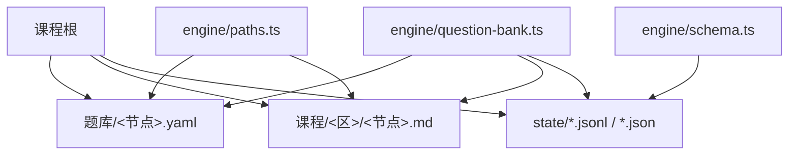
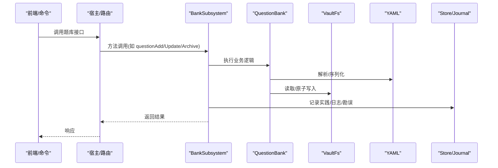
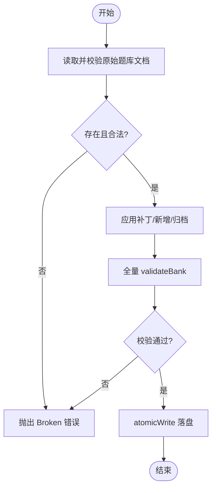
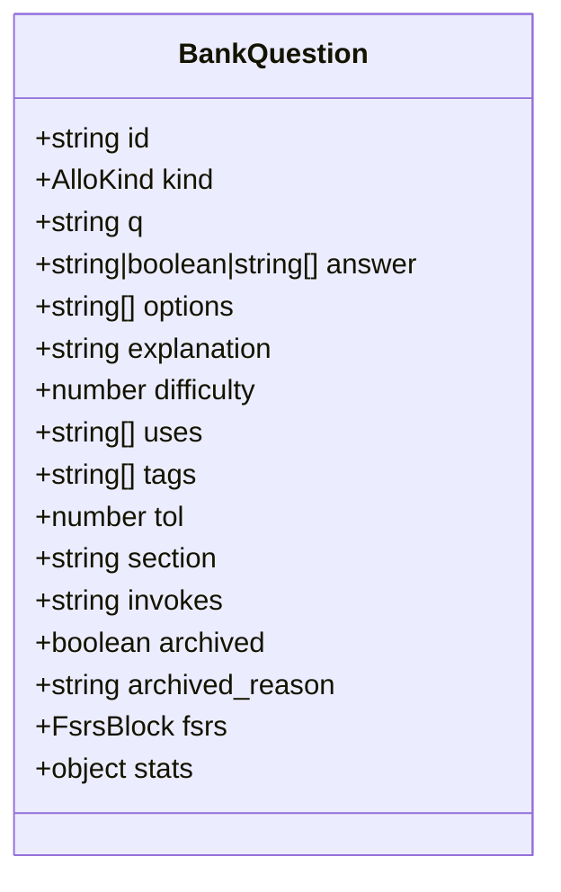
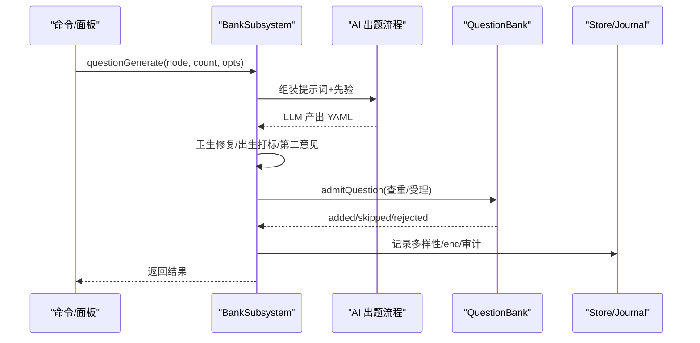
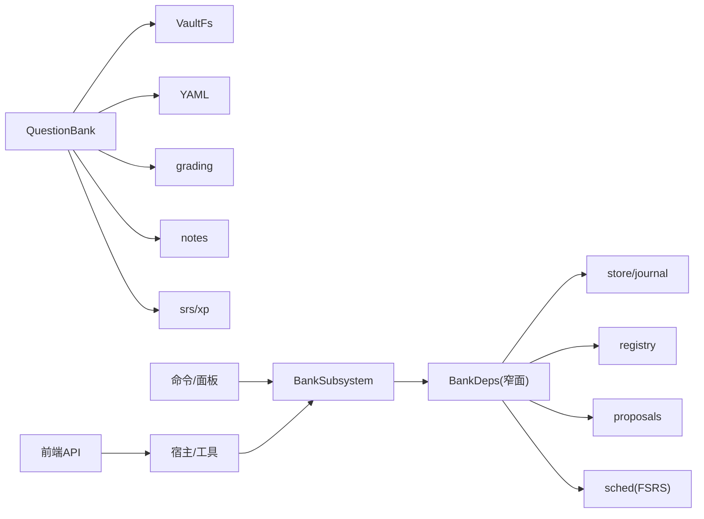

# 题目存储管理

<cite>
**本文引用的文件**
- [question-bank.ts](file://src/engine/question-bank.ts)
- [types.ts](file://src/engine/types.ts)
- [schema.ts](file://src/engine/schema.ts)
- [paths.ts](file://src/engine/paths.ts)
- [题库.ts](file://src/commands/题库.ts)
- [tool-handlers.ts](file://src/host/tool-handlers.ts)
- [jobs.ts](file://src/host/jobs.ts)
- [api.ts](file://ui/src/api.ts)
- [判断命题真假并用与或非组合命题.yaml](file://tests/fixtures/bank-corpus/判断命题真假并用与或非组合命题.yaml)
- [提取公因式进行因式分解.yaml](file://tests/fixtures/bank-corpus/提取公因式进行因式分解.yaml)
</cite>

## 目录
1. [简介](#简介)
2. [项目结构](#项目结构)
3. [核心组件](#核心组件)
4. [架构总览](#架构总览)
5. [详细组件分析](#详细组件分析)
6. [依赖关系分析](#依赖关系分析)
7. [性能考量](#性能考量)
8. [故障排查指南](#故障排查指南)
9. [结论](#结论)
10. [附录](#附录)

## 简介
本文件面向“题目存储管理”主题，系统化阐述 QuestionBank 类及其周边子系统如何完成题目的增删改查、批量导入导出、版本控制与数据持久化；并深入解释 Question（BankQuestion）数据结构的设计要点：题型分类、知识点关联、难度标记与元数据管理。同时说明题库的目录结构与文件格式（YAML 配置 + Markdown 正文组织），以及索引机制与查询优化策略。文末提供具体代码示例路径，展示如何创建、更新、搜索与管理题目集合。

## 项目结构
- 课程根目录下题库统一存放于“题库”子目录，每个节点一个 YAML 文件，文件名由节点名安全编码后生成。
- 题目内容以 YAML 描述题面、答案、选项、解析、难度、标签、节归属、概念引用等；调度与统计信息（FSRS、stats）在作答侧追加写入。
- 引擎通过 paths 模块构造稳定路径，通过 VaultFs 抽象文件系统读写，使用 YAML 解析器进行序列化/反序列化，并通过 validateBank 做 schema 校验。

图表来源
- [question-bank.ts:271-317](file://src/engine/question-bank.ts#L271-L317)
- [paths.ts:160-174](file://src/engine/paths.ts#L160-L174)
- [schema.ts:63-79](file://src/engine/schema.ts#L63-L79)

章节来源
- [question-bank.ts:271-317](file://src/engine/question-bank.ts#L271-L317)
- [paths.ts:160-174](file://src/engine/paths.ts#L160-L174)

## 核心组件
- QuestionBank：题库持久化与单题操作的核心类，负责加载、保存、追加、更新、归档/恢复、证据写回等。
- BankSubsystem：题库域聚合层，封装错误对比卡、题目清单、难度建议、清理、申诉复核与 AI 出题等能力。
- 类型与模式：
  - BankQuestion：题目数据结构定义（题型、题干、答案、选项、解析、难度、uses/tags、section、invokes、fsrs/stats、归档标记）。
  - FsrsBlock/Fm：FSRS 调度块与笔记 frontmatter，承载掌握度派生与练习证据 EMA。
  - Schema：引擎主版本硬门与断裂迁移策略。

章节来源
- [question-bank.ts:82-116](file://src/engine/question-bank.ts#L82-L116)
- [types.ts:31-61](file://src/engine/types.ts#L31-L61)
- [schema.ts:16-17](file://src/engine/schema.ts#L16-L17)

## 架构总览
题库子系统围绕“YAML 题库文件 + Markdown 正文 + JSONL 流水”三要素协作：
- 读路径：load → parse → validate → 返回规范文档。
- 写路径：add/update/archive/evidence → 全量 validate → atomicWrite 落盘。
- 查询路径：questionsAll 扫描题库目录，逐文件 load 并投影为视图。
- 生成路径：questionGenerate/Sections 组装提示词 → LLM 产出 → 卫生修复/查重/出生打标/第二意见 → admitQuestion 入库。
- 版本控制：learnhub.json 中 schema.version 作为启动硬门，旧库拒载并指引迁移脚本。

图表来源
- [question-bank.ts:337-452](file://src/engine/question-bank.ts#L337-L452)
- [tool-handlers.ts:80-101](file://src/host/tool-handlers.ts#L80-L101)
- [jobs.ts:71-96](file://src/host/jobs.ts#L71-L96)

## 详细组件分析

### QuestionBank 类：持久化与单题操作
- 路径与文件：
  - bankPath 将 courseRoot/题库/<节点>.yaml 作为题库文件位置。
  - load/save 实现题库文件的读取与保存，包含 YAML 解析与 schema 校验。
- 单题操作：
  - addQuestion：追加新题，自动分配 id，重复 id 报错，写入前全量 validateBank。
  - updateQuestion：作者字段白名单 patch（q/answer/options/explanation/difficulty/uses/tags/section/tol），id/kind/node/fsrs/stats/archived 不可经此通道修改。
  - archiveQuestion/archiveQuestions：归档/恢复单题或批量归档，记录 archived_reason。
  - updateQuestionEvidence：引擎内部作答侧写回 fsrs/stats，仅允许整体替换。
- 错误处理：
  - 读取失败、YAML 解析失败、schema 校验失败均抛出结构化错误，避免静默降级。

图表来源
- [question-bank.ts:322-335](file://src/engine/question-bank.ts#L322-L335)
- [question-bank.ts:337-452](file://src/engine/question-bank.ts#L337-L452)

章节来源
- [question-bank.ts:271-317](file://src/engine/question-bank.ts#L271-L317)
- [question-bank.ts:322-452](file://src/engine/question-bank.ts#L322-L452)

### BankQuestion 数据结构设计
- 基础字段：
  - id、kind（single_choice/true_false/fill_in_blank/reflection/multi_choice/numeric/ordering/matching/open_question）、q、answer、options、explanation、difficulty、uses、tags、tol（数值容差）、section（节归属）、invokes（一枚概念引用）。
- 元数据与状态：
  - fsrs（FSRS 调度块）、stats（attempts/correct/last/pending_rating/last_correct）、archived/archived_reason。
- 校验规则：
  - 按题型严格校验 answer/options 形态（多选至少两个正确项、排序/匹配/填空/数值等）。
  - invokes 若存在必须为字符串（概念登记在册名字），缺席视为 Missing。

图表来源
- [question-bank.ts:82-109](file://src/engine/question-bank.ts#L82-L109)
- [types.ts:31-61](file://src/engine/types.ts#L31-L61)

章节来源
- [question-bank.ts:82-109](file://src/engine/question-bank.ts#L82-L109)
- [question-bank.ts:139-262](file://src/engine/question-bank.ts#L139-L262)

### 批量导入导出与 AI 出题
- 批量导入：
  - save：接收 YAML 文本，parseModel → validateBank → atomicWrite，支持 expectedNode 约束。
  - 命令层暴露 question-save，用于批量保存题库。
- AI 出题：
  - questionGenerate/questionGenerateSections：组装提示词（含已有题面防相似、节标注、难度锚点、误解先验、概念清单与易混对、Vault 先验检索审计），LLM 产出后经卫生修复、出生打标、第二意见门、admitQuestion 查重/受理，最终入库。
  - 多样性指标与 enc 覆盖率投影随结果返回。

图表来源
- [question-bank.ts:1163-1343](file://src/engine/question-bank.ts#L1163-L1343)
- [question-bank.ts:1353-1468](file://src/engine/question-bank.ts#L1353-L1468)
- [jobs.ts:71-96](file://src/host/jobs.ts#L71-L96)

章节来源
- [question-bank.ts:309-317](file://src/engine/question-bank.ts#L309-L317)
- [question-bank.ts:1163-1468](file://src/engine/question-bank.ts#L1163-L1468)

### 版本控制与数据持久化
- 版本硬门：
  - schema.ts 定义 CURRENT_SCHEMA_VERSION，启动时同步读取 learnhub.json，非当前版本即抛错并指引一次性迁移脚本。
- 持久化：
  - 题库 YAML 原子写入；practice/journal/erratum 等流水追加型落盘；frontmatter 中的 practice_ema 与 mastery 派生值在证据回流时更新。

章节来源
- [schema.ts:16-17](file://src/engine/schema.ts#L16-L17)
- [schema.ts:63-79](file://src/engine/schema.ts#L63-L79)
- [types.ts:40-61](file://src/engine/types.ts#L40-L61)

### 目录结构与文件格式
- 目录：
  - <课程根>/题库/<节点>.yaml：题库文件。
  - <课程根>/课程/<区>/<节点>.md：正文 Markdown，供出题与讲解上下文。
  - <课程根>/state/*：FSRS 参数、队列、快照等。
- 格式：
  - YAML：node/questions 列表，每题为 BankQuestion 结构。
  - Markdown：节标题与正文，供定向补生成与错误对比卡取材。

章节来源
- [paths.ts:160-174](file://src/engine/paths.ts#L160-L174)
- [判断命题真假并用与或非组合命题.yaml:1-112](file://tests/fixtures/bank-corpus/判断命题真假并用与或非组合命题.yaml#L1-L112)
- [提取公因式进行因式分解.yaml:1-800](file://tests/fixtures/bank-corpus/提取公因式进行因式分解.yaml#L1-L800)

### 索引机制与查询优化
- 无集中索引：题库按节点分文件，查询通过遍历题库目录并逐个 load 构建视图。
- 视图投影：
  - questionsAll 扫描所有启用课程的题库目录，过滤 .yaml，load 后投影为 BankEntry（不含答案，带到期与统计）。
- 优化策略：
  - 只读扫描，Broken 文件跳过不阻塞。
  - 按需加载（仅在需要时 load 具体节点题库）。
  - 错误卡与题库解耦，错误卡独立目录与生命周期。

章节来源
- [question-bank.ts:756-788](file://src/engine/question-bank.ts#L756-L788)
- [data-check.ts:240-256](file://src/engine/data-check.ts#L240-L256)

## 依赖关系分析
- 模块耦合：
  - QuestionBank 依赖 VaultFs、YAML、grading、notes、srs、xp、complexity、concepts、error-cards、question-dedup、question-diversity、question-audit、prompts 等。
  - BankSubsystem 通过 BankDeps 窄面注入跨子系统依赖（store、registry、proposals、sched、vaultPrior 等），避免环依赖。
- 外部集成：
  - 命令注册表（题库.ts）暴露工具与面板路由。
  - 宿主工具处理器（tool-handlers.ts）与作业调度（jobs.ts）对接 AI 出题与审计注记。
  - 前端 API（api.ts）提供答题、自评、忘记、申诉复核等接口。

图表来源
- [question-bank.ts:460-511](file://src/engine/question-bank.ts#L460-L511)
- [题库.ts:1-310](file://src/commands/题库.ts#L1-L310)
- [tool-handlers.ts:80-101](file://src/host/tool-handlers.ts#L80-L101)
- [api.ts:56-86](file://ui/src/api.ts#L56-L86)

章节来源
- [question-bank.ts:460-511](file://src/engine/question-bank.ts#L460-L511)
- [题库.ts:1-310](file://src/commands/题库.ts#L1-L310)

## 性能考量
- 原子写入：atomicWrite 保证题库文件一致性，避免并发写入损坏。
- 批量归档：archiveQuestions 一次 load-validate-write，减少整文件重写次数。
- 扫描优化：questionsAll 仅扫描 .yaml 并按需 load，Broken 文件跳过。
- AI 出题批处理：第二意见门抽样、查重基线注入、节级并行（逐节调用）降低无效产出。
- FSRS 缓存：schedCache 按课程 root 键失效，避免重复初始化。

[本节为通用指导，无需特定文件来源]

## 故障排查指南
- 题库加载失败：
  - 检查 YAML 解析错误与 schema 校验错误（validateBank 返回 errors）。
  - 确认 node 与命令行节点一致（expectedNode 约束）。
- 更新失败：
  - 确认 patch 仅包含作者白名单字段；id/kind/node/fsrs/stats/archived 不可经此通道修改。
  - 多选答案需至少两个正确项（questionAnswerShapeError）。
- 归档/恢复：
  - 确认 qid 存在；归档原因记录到 archived_reason；恢复时清除 flag 与 reason。
- 版本硬门：
  - learnhub.json 的 schema.version 非当前版本会抛错，需运行迁移脚本。

章节来源
- [question-bank.ts:139-262](file://src/engine/question-bank.ts#L139-L262)
- [question-bank.ts:354-452](file://src/engine/question-bank.ts#L354-L452)
- [schema.ts:63-79](file://src/engine/schema.ts#L63-L79)

## 结论
QuestionBank 与 BankSubsystem 构成了稳健的题目存储与管理中枢：以 YAML 为持久化载体，结合 Markdown 正文与 JSONL 流水，实现题目全生命周期管理；通过严格的 schema 校验、原子写入与版本硬门保障数据一致性；借助 AI 出题与第二意见门提升质量；通过视图投影与扫描策略满足查询需求。该设计兼顾可读性、可维护性与扩展性，适合教学场景下的题库治理与学习闭环。

[本节为总结，无需特定文件来源]

## 附录

### 代码示例路径（创建、更新、搜索与管理）
- 创建题库（批量保存）：
  - [question-save 命令:296-310](file://src/commands/题库.ts#L296-L310)
  - [QuestionBank.save:309-317](file://src/engine/question-bank.ts#L309-L317)
- 追加单题：
  - [QuestionBank.addQuestion:337-352](file://src/engine/question-bank.ts#L337-L352)
- 更新单题（作者字段 patch）：
  - [QuestionBank.updateQuestion:354-376](file://src/engine/question-bank.ts#L354-L376)
- 归档/恢复：
  - [QuestionBank.archiveQuestion:405-425](file://src/engine/question-bank.ts#L405-L425)
  - [QuestionBank.archiveQuestions:427-452](file://src/engine/question-bank.ts#L427-L452)
- 获取全部题目（视图）：
  - [BankSubsystem.questionsAll:756-788](file://src/engine/question-bank.ts#L756-L788)
- AI 出题（节点/逐节）：
  - [BankSubsystem.questionGenerate:1163-1343](file://src/engine/question-bank.ts#L1163-L1343)
  - [BankSubsystem.questionGenerateSections:1353-1468](file://src/engine/question-bank.ts#L1353-L1468)
- 前端接口：
  - [答题/自评/忘记/申诉复核:56-86](file://ui/src/api.ts#L56-L86)

章节来源
- [题库.ts:296-310](file://src/commands/题库.ts#L296-L310)
- [question-bank.ts:309-452](file://src/engine/question-bank.ts#L309-L452)
- [question-bank.ts:756-788](file://src/engine/question-bank.ts#L756-L788)
- [question-bank.ts:1163-1468](file://src/engine/question-bank.ts#L1163-L1468)
- [api.ts:56-86](file://ui/src/api.ts#L56-L86)