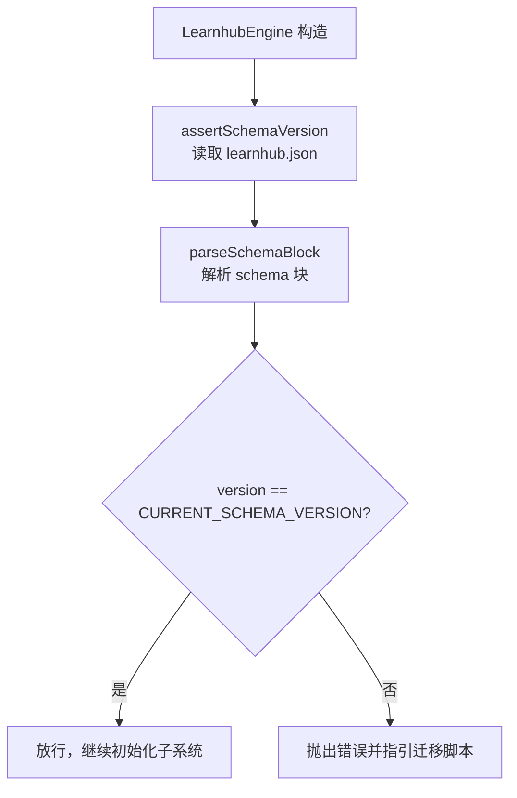
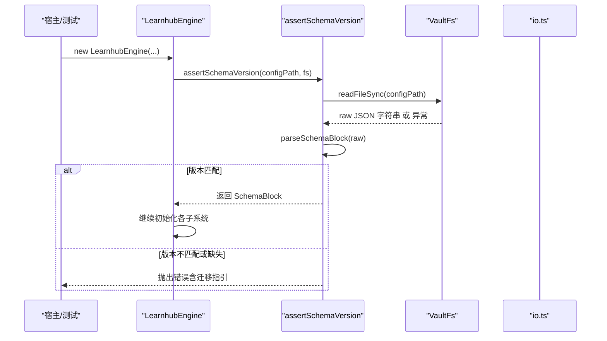
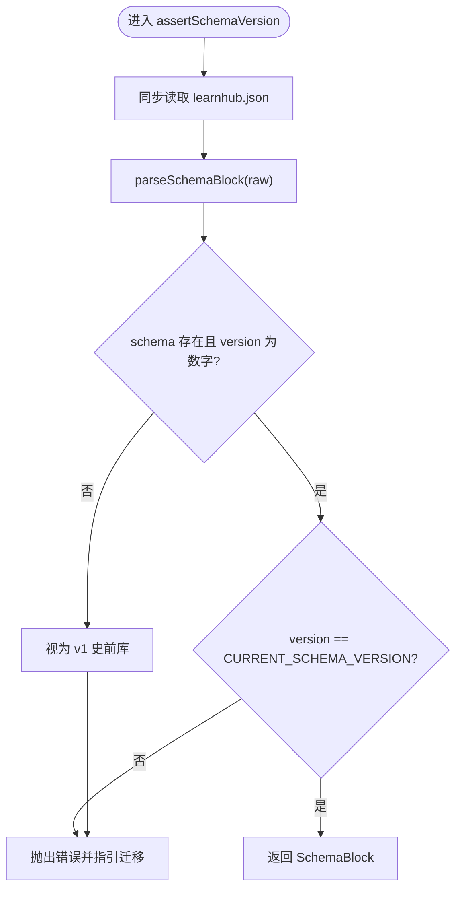
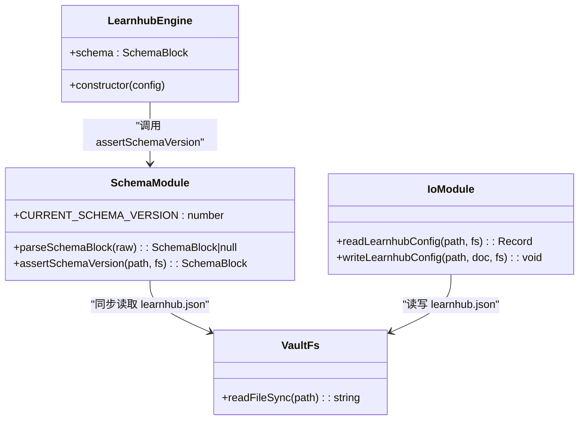

# Schema 版本检查

<cite>
**本文引用的文件**
- [src/engine/schema.ts](file://src/engine/schema.ts)
- [src/engine/index.ts](file://src/engine/index.ts)
- [src/engine/io.ts](file://src/engine/io.ts)
- [tests/schema-cutover.test.ts](file://tests/schema-cutover.test.ts)
- [tests/helpers/vault.ts](file://tests/helpers/vault.ts)
- [src/host/runtime.ts](file://src/host/runtime.ts)
</cite>

## 更新摘要
**所做更改**
- 移除了对已删除的 migrate-v1.mjs 迁移脚本的具体引用
- 更新了迁移策略和历史记录部分，说明迁移脚本已退役为存根
- 保留了当前 v2 → v3 迁移流程的说明
- 更新了故障排查指南中的脚本路径参考

## 目录
1. [简介](#简介)
2. [项目结构](#项目结构)
3. [核心组件](#核心组件)
4. [架构总览](#架构总览)
5. [详细组件分析](#详细组件分析)
6. [依赖关系分析](#依赖关系分析)
7. [性能考量](#性能考量)
8. [故障排查指南](#故障排查指南)
9. [结论](#结论)
10. [附录](#附录)

## 简介
本文件系统性说明 LearnHub 的 Schema 版本检查机制，重点解释引擎启动时的 assertSchemaVersion 执行流程、learnhub.json 读取与 schema 解析、版本兼容性判定、以及"断裂（breaks）"概念与迁移策略。文档同时给出配置示例、升级步骤与常见问题处理建议，帮助读者在引擎启动阶段快速定位并解决版本不兼容问题。

## 项目结构
围绕 Schema 版本检查的关键代码集中在 engine 层：
- schema.ts：定义当前主版本常量、schema 块类型、解析函数与启动硬门函数。
- index.ts：LearnhubEngine 构造函数中调用 assertSchemaVersion，作为引擎初始化入口的第一道门。
- io.ts：提供 learnhub.json 的通用读写原语（非版本检查路径），用于运行时配置读写。
- tests/schema-cutover.test.ts：覆盖断言版本硬门的正/负用例，验证旧库拒载、未来版本拒载、迁移脚本行为等。
- tests/helpers/vault.ts：测试夹具，默认写入当前 schema 版本戳，便于构造可启动的测试库。
- src/host/runtime.ts：首次启动时创建或更新 state/learnhub.json，写入当前 schema 版本。

图表来源
- [src/engine/index.ts:220-225](file://src/engine/index.ts#L220-L225)
- [src/engine/schema.ts:63-79](file://src/engine/schema.ts#L63-L79)

章节来源
- [src/engine/index.ts:220-225](file://src/engine/index.ts#L220-L225)
- [src/engine/schema.ts:1-17](file://src/engine/schema.ts#L1-L17)

## 核心组件
- CURRENT_SCHEMA_VERSION：当前引擎唯一认可的主版本号（当前为 3）。
- SchemaBlock：schema 块的类型定义，包含 version、可选 breaks、可选 formats。
- parseSchemaBlock：从 learnhub.json 原文安全提取 schema 块；缺失/损坏返回 null。
- assertSchemaVersion：同步读取 learnhub.json，解析 schema 并校验版本；不匹配则抛错并提示迁移。

章节来源
- [src/engine/schema.ts:16-35](file://src/engine/schema.ts#L16-L35)
- [src/engine/schema.ts:37-57](file://src/engine/schema.ts#L37-L57)
- [src/engine/schema.ts:59-79](file://src/engine/schema.ts#L59-L79)

## 架构总览
引擎启动时，LearnhubEngine 构造函数会立即执行 schema 版本硬门，确保后续所有子系统都基于受支持的 schema 主版本运行。该设计遵循"宣告式断裂"原则：不写兼容代码、不降级、不双读，旧库必须通过一次性迁移脚本整体归档并打上新版本戳。

图表来源
- [src/engine/index.ts:220-225](file://src/engine/index.ts#L220-L225)
- [src/engine/schema.ts:63-79](file://src/engine/schema.ts#L63-L79)
- [src/engine/io.ts:40-54](file://src/engine/io.ts#L40-L54)

章节来源
- [src/engine/index.ts:220-225](file://src/engine/index.ts#L220-L225)
- [src/engine/schema.ts:63-79](file://src/engine/schema.ts#L63-L79)

## 详细组件分析

### assertSchemaVersion 执行流程
- 同步读取 learnhub.json：使用 VaultFs 的同步读取接口，避免异步化带来的复杂性与时序风险。
- 解析 schema 块：若文件不存在、JSON 非法、或 schema.version 不是数字，均视为"史前库"，走统一拒载文案。
- 版本比较：仅当 schema.version 等于 CURRENT_SCHEMA_VERSION 才放行；否则抛出错误，提示迁移脚本路径与断裂语义。

图表来源
- [src/engine/schema.ts:63-79](file://src/engine/schema.ts#L63-L79)
- [src/engine/schema.ts:37-57](file://src/engine/schema.ts#L37-L57)

章节来源
- [src/engine/schema.ts:63-79](file://src/engine/schema.ts#L63-L79)

### learnhub.json 读取与 schema 解析
- 读取位置：学习中心状态目录下的 learnhub.json（由 Paths.learnhubConfigPath 决定）。
- 解析规则：
  - 顶层必须有 schema 对象。
  - schema.version 必须是数字。
  - breaks 与 formats 为可选字段，分别记录断裂历史与子格式版本表。
- 失败路径：文件缺失、JSON 损坏、schema 缺失或 version 非数字，均返回 null，按"史前库"处理。

章节来源
- [src/engine/schema.ts:37-57](file://src/engine/schema.ts#L37-L57)
- [src/engine/index.ts:220-225](file://src/engine/index.ts#L220-L225)

### 版本兼容性检查与"断裂（breaks）"
- 主版本严格相等：引擎只认当前主版本，任何旧版本或未来版本都会拒绝加载。
- 断裂（breaks）：一次主版本变更的记录，包含 from（来源版本）、date（本地日期）、archived（本次归档的课程 root 列表）、note（备注）。引擎对 breaks 零消费，仅由迁移脚本落笔，供审计与数据体检参考。
- 子格式演进：formats 允许在主版本内自由演变；若子格式发生破坏性变更，仍需通过主版本断裂来推进。

章节来源
- [src/engine/schema.ts:19-35](file://src/engine/schema.ts#L19-L35)
- [src/engine/schema.ts:59-79](file://src/engine/schema.ts#L59-L79)

### 为什么非当前主版本会拒绝加载
- 设计原则：宣告式断裂，零兼容代码。避免在引擎内部维护多套兼容逻辑，降低复杂度与回归风险。
- 安全性：旧库的数据结构与引擎期望不一致，直接加载可能导致不可预测的错误；强制迁移确保数据一致性。
- 可追溯：通过 breaks 记录每次断裂的来源版本与归档清单，便于审计与回滚评估。

章节来源
- [src/engine/schema.ts:1-14](file://src/engine/schema.ts#L1-L14)
- [src/engine/schema.ts:59-79](file://src/engine/schema.ts#L59-L79)

### 历史记录与迁移策略
- 历史记录：breaks 数组记录每次主版本断裂的详情，包括来源版本、日期、归档课程根、备注。
- 迁移策略：
  - 一次性迁移脚本将旧课程树整体移入存档区（如 pre-vX/日期/课程名），保留行为流水与必要元数据。
  - 更新 learnhub.json 的 schema.version 为当前版本，并在 breaks 追加本次断裂记录。
  - 概念登记表等关键注册信息豁免移动，保持原位可用。
  - **注意**：v1 到 v2 的迁移脚本（migrate-v1.mjs）已退役为存根，仅提供手动步骤指导。当前主要关注 v2 到 v3 的迁移流程。
- 防重跑：迁移脚本具备幂等保护，重复执行会被拒绝。

**更新** 移除了对已删除的 migrate-v1.mjs 脚本的具体实现引用，强调其已退役为存根状态。

章节来源
- [tests/schema-cutover.test.ts:125-169](file://tests/schema-cutover.test.ts#L125-L169)

### 引擎启动时的作用与重要性
- 启动即门：LearnhubEngine 构造函数中立即执行版本检查，早于任何惰性读盘，确保后续所有子系统都在受支持版本上运行。
- 封死取用路径：无论是宿主 apply、测试工厂还是脚本直连，只要版本不匹配，都会在构造期被拦截。
- 明确指引：错误消息包含迁移脚本路径与断裂语义说明，便于用户快速修复。

章节来源
- [src/engine/index.ts:220-225](file://src/engine/index.ts#L220-L225)
- [src/engine/schema.ts:59-79](file://src/engine/schema.ts#L59-L79)

### 具体 schema 配置文件示例
以下为符合当前引擎要求的 learnhub.json 片段示例（节选 schema 部分）：
- 当前版本示例：
  - schema.version = 3
  - breaks 为空或包含历史断裂记录
  - formats 可为空对象或包含子格式版本映射
- 旧版本示例（将被拒载）：
  - schema.version = 1 或 2
  - 缺少 schema 或 version 非数字
- 未来版本示例（将被拒载）：
  - schema.version > 3

章节来源
- [tests/schema-cutover.test.ts:39-80](file://tests/schema-cutover.test.ts#L39-L80)
- [tests/helpers/vault.ts:68-70](file://tests/helpers/vault.ts#L68-L70)

### 版本升级指南
- 步骤概览：
  1. 确认当前 learnhub.json 的 schema.version。
  2. 若不为当前版本，运行一次性迁移脚本（例如 scripts/migrate-v2.mjs），传入 vault 根目录。
  3. 迁移完成后，再次尝试启动引擎；此时应能正常构造并加载。
- 注意事项：
  - 迁移会将旧课程树整体归档至存档区，原课程根不再处于现役区。
  - 行为流水（如 practice.jsonl）原地保留，不受迁移影响。
  - 概念登记表等关键注册信息豁免移动，保持原位可用。
  - 迁移脚本具备防重跑保护，重复执行会拒绝。
  - **重要**：v1 到 v2 的迁移脚本已退役，如需从 v1 升级，请参考错误消息中的指引或使用其他工具进行手动迁移。

**更新** 添加了关于 v1 迁移脚本退役的说明。

章节来源
- [tests/schema-cutover.test.ts:125-169](file://tests/schema-cutover.test.ts#L125-L169)

## 依赖关系分析
- LearnhubEngine 依赖 assertSchemaVersion 进行版本检查。
- assertSchemaVersion 依赖 VaultFs 同步读取 learnhub.json。
- parseSchemaBlock 负责安全解析 schema 块，忽略非法或缺失情况。
- 测试夹具默认写入当前 schema 版本，便于构造可启动的测试环境。
- 宿主 runtime 在首次启动时创建或更新 learnhub.json，写入当前 schema 版本。

图表来源
- [src/engine/index.ts:220-225](file://src/engine/index.ts#L220-L225)
- [src/engine/schema.ts:16-79](file://src/engine/schema.ts#L16-L79)
- [src/engine/io.ts:40-54](file://src/engine/io.ts#L40-L54)

章节来源
- [src/engine/index.ts:220-225](file://src/engine/index.ts#L220-L225)
- [src/engine/schema.ts:16-79](file://src/engine/schema.ts#L16-L79)
- [src/engine/io.ts:40-54](file://src/engine/io.ts#L40-L54)

## 性能考量
- 同步读取：assertSchemaVersion 使用同步读取 learnhub.json，因文件极小且位于构造期，成本可接受，且避免了异步化带来的复杂性。
- 解析开销：parseSchemaBlock 仅做轻量 JSON 解析与字段校验，时间复杂度与空间复杂度极低。
- 启动延迟：版本检查发生在引擎构造早期，确保后续子系统初始化建立在受支持版本之上，减少潜在的回滚与重试成本。

[本节为一般性指导，不直接分析具体文件]

## 故障排查指南
- 现象：引擎构造期抛出版本不兼容错误，提示 learnhub.json 的版本与引擎期望不一致。
- 可能原因：
  - 库为史前库（无 schema 或 version 缺失）。
  - 库版本过旧（如 v1、v2）。
  - 库版本过新（未来版本）。
  - learnhub.json 损坏或 JSON 非法。
- 处理步骤：
  1. 检查 learnhub.json 是否存在且 JSON 合法。
  2. 确认 schema.version 是否为当前版本（当前为 3）。
  3. 若非当前版本，运行一次性迁移脚本（scripts/migrate-v2.mjs），传入 vault 根目录。
  4. 迁移完成后重启引擎，确认可正常构造。
  5. **特殊情况**：如果是 v1 库，由于 migrate-v1.mjs 已退役，需要参考错误消息中的指引进行手动迁移或使用其他工具。
- 附加检查：
  - 查看 data-check 报告中的 archived 计数与 findings，确认存档区盘点是否正常。
  - 若 breaks 记录存在但存档区缺失，data-check 会提示 artifact 缺失。

**更新** 添加了对 v1 库特殊情况的处理说明。

章节来源
- [tests/schema-cutover.test.ts:47-80](file://tests/schema-cutover.test.ts#L47-L80)
- [tests/schema-cutover.test.ts:176-217](file://tests/schema-cutover.test.ts#L176-L217)

## 结论
LearnHub 的 Schema 版本检查机制通过"宣告式断裂"确保引擎始终在受支持的主版本上运行。assertSchemaVersion 在引擎构造期同步读取并校验 learnhub.json 的 schema.version，不匹配则拒绝加载并指引迁移。breaks 记录每次断裂的历史，配合一次性迁移脚本完成数据归档与版本升级。该设计简化了兼容逻辑、提升了系统稳定性，并通过明确的错误信息与工具链支持，帮助用户快速解决版本不兼容问题。

**更新** 强调了迁移脚本退役的现状和当前主要的 v2 → v3 迁移流程。

[本节为总结性内容，不直接分析具体文件]

## 附录
- 相关测试用例：
  - 版本硬门正/负用例：验证 v3 正常构造、旧库拒载、未来版本拒载。
  - 迁移脚本端到端验证：存档搬移、登记表豁免、行为流水保留、版本戳与防重跑。
  - data-check 存档区盘点：跨断裂累加、信息级汇报、artifact 缺失提示。
- 首次启动配置：
  - 宿主 runtime 在首次启动时创建或更新 learnhub.json，写入当前 schema 版本与空 formats。
- **迁移脚本状态**：
  - migrate-v1.mjs：已退役为存根，仅提供手动步骤指导
  - migrate-v2.mjs：当前有效的 v2 → v3 迁移脚本

**更新** 添加了迁移脚本状态的附录说明。

章节来源
- [tests/schema-cutover.test.ts:39-80](file://tests/schema-cutover.test.ts#L39-L80)
- [tests/schema-cutover.test.ts:125-169](file://tests/schema-cutover.test.ts#L125-L169)
- [tests/schema-cutover.test.ts:176-217](file://tests/schema-cutover.test.ts#L176-L217)
- [src/host/runtime.ts:161-161](file://src/host/runtime.ts#L161-L161)