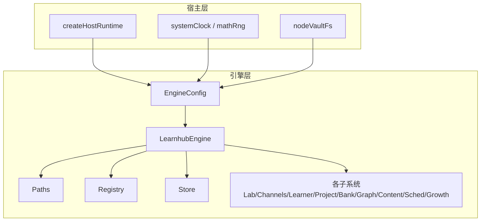
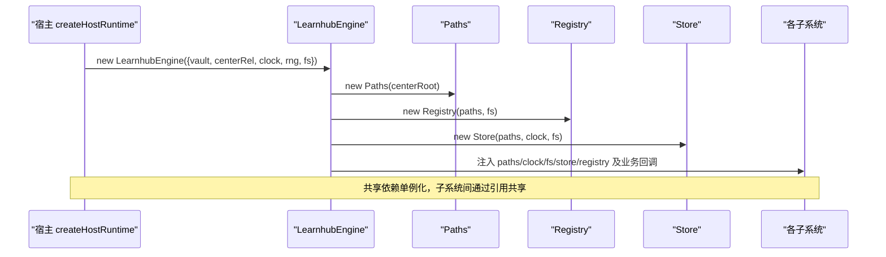
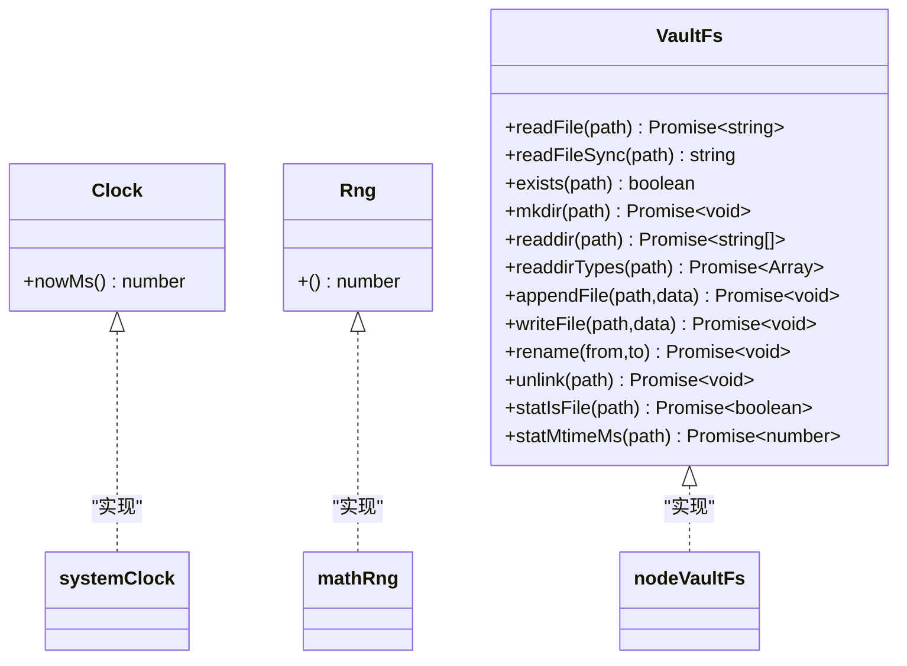
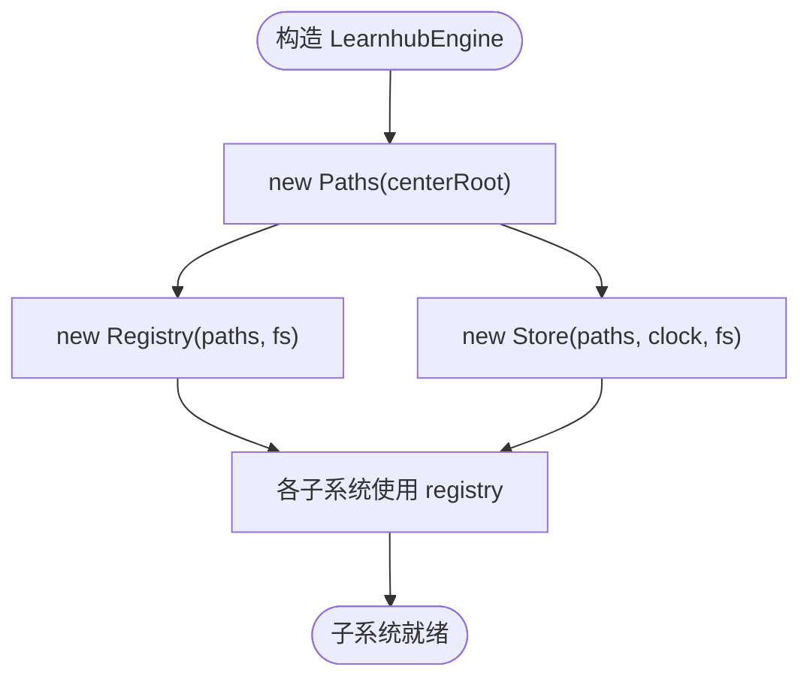
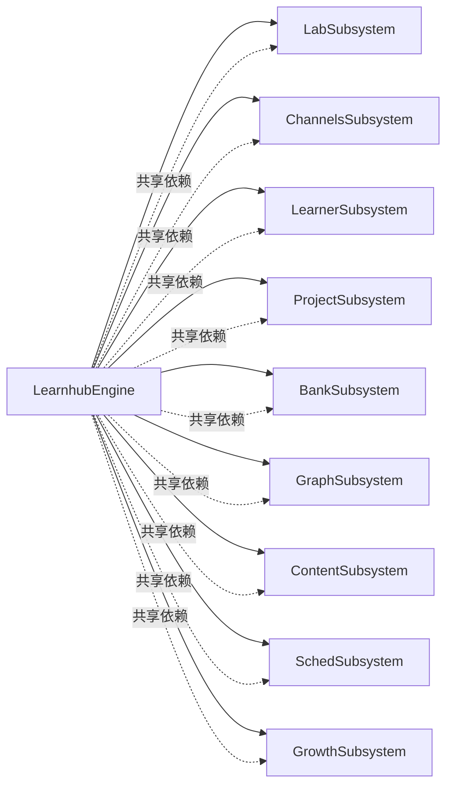
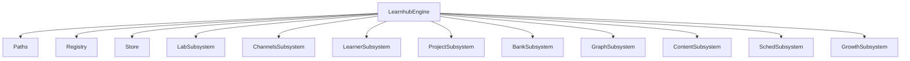

# 依赖注入机制

<cite>
**本文引用的文件**
- [src/engine/index.ts](file://src/engine/index.ts)
- [src/engine/clock.ts](file://src/engine/clock.ts)
- [src/host/clock.ts](file://src/host/clock.ts)
- [src/host/vault-fs.ts](file://src/host/vault-fs.ts)
- [src/engine/io.ts](file://src/engine/io.ts)
- [src/engine/paths.ts](file://src/engine/paths.ts)
- [src/engine/store.ts](file://src/engine/store.ts)
- [src/engine/registry.ts](file://src/engine/registry.ts)
- [src/host/runtime.ts](file://src/host/runtime.ts)
- [tests/clock-rng-port.test.ts](file://tests/clock-rng-port.test.ts)
</cite>

## 目录
1. [简介](#简介)
2. [项目结构](#项目结构)
3. [核心组件](#核心组件)
4. [架构总览](#架构总览)
5. [详细组件分析](#详细组件分析)
6. [依赖关系分析](#依赖关系分析)
7. [性能与可维护性](#性能与可维护性)
8. [故障排查指南](#故障排查指南)
9. [结论](#结论)
10. [附录：测试环境下的依赖替换](#附录测试环境下的依赖替换)

## 简介
本文件系统性阐述 LearnHub 的依赖注入机制，聚焦构造函数中的依赖注入模式，解释 Clock、Rng、VaultFs 等核心依赖的注入方式与作用；说明共享依赖的生命周期管理（Paths、Store、Registry 等）；总结设计原则（接口抽象、测试友好、运行时解耦）；给出从 EngineConfig 到各子系统的依赖传递流程图；并说明测试环境下固定时钟、模拟文件系统等的注入方式。

## 项目结构
LearnHub 将“应用层”（engine）与“适配层/宿主层”（host）严格分离：
- engine 仅声明端口类型（Clock、Rng、VaultFs），不直接依赖具体实现。
- host 提供真实实现（systemClock、mathRng、nodeVaultFs），并在 createHostRuntime 中装配注入。
- 所有子系统通过构造函数接收共享依赖，避免全局可变状态。

图表来源
- [src/host/runtime.ts:138-193](file://src/host/runtime.ts#L138-L193)
- [src/engine/index.ts:133-236](file://src/engine/index.ts#L133-L236)
- [src/engine/paths.ts:26-31](file://src/engine/paths.ts#L26-L31)
- [src/engine/registry.ts:77-79](file://src/engine/registry.ts#L77-L79)
- [src/engine/store.ts:46-48](file://src/engine/store.ts#L46-L48)

章节来源
- [src/host/runtime.ts:138-193](file://src/host/runtime.ts#L138-L193)
- [src/engine/index.ts:133-236](file://src/engine/index.ts#L133-L236)

## 核心组件
- EngineConfig：引擎构造配置，集中注入 Clock、Rng、VaultFs 以及 vault/centerRel 路径信息。
- Paths：学习中心与课程级路径的统一派生器，由 centerRoot 构造，无全局可变状态。
- Store：明文运行态存储（JSONL 追加、原子写），依赖 Paths、Clock、VaultFs。
- Registry：课程注册表读写与校验，依赖 Paths、VaultFs。
- VaultFs：引擎侧唯一 IO 端口，屏蔽 node:fs 细节，便于测试替换。
- Clock/Rng：时间戳与随机源端口，用于确定性控制与测试稳定。

章节来源
- [src/engine/index.ts:133-147](file://src/engine/index.ts#L133-L147)
- [src/engine/paths.ts:26-31](file://src/engine/paths.ts#L26-L31)
- [src/engine/store.ts:46-48](file://src/engine/store.ts#L46-L48)
- [src/engine/registry.ts:77-79](file://src/engine/registry.ts#L77-L79)
- [src/engine/io.ts:9-28](file://src/engine/io.ts#L9-L28)
- [src/engine/clock.ts:11-19](file://src/engine/clock.ts#L11-L19)

## 架构总览
下图展示从 EngineConfig 到各子系统的依赖传递路径。宿主在 createHostRuntime 中创建 EngineConfig，注入系统时钟、随机源和文件系统实现；LearnhubEngine 在构造函数内基于这些依赖构建共享对象（Paths、Registry、Store），再向各子系统注入共享依赖或回调。

图表来源
- [src/host/runtime.ts:138-193](file://src/host/runtime.ts#L138-L193)
- [src/engine/index.ts:212-398](file://src/engine/index.ts#L212-L398)

章节来源
- [src/host/runtime.ts:138-193](file://src/host/runtime.ts#L138-L193)
- [src/engine/index.ts:212-398](file://src/engine/index.ts#L212-L398)

## 详细组件分析

### 1) 端口与适配器：Clock、Rng、VaultFs
- 端口定义位于 engine，纯类型零导入，确保领域代码不耦合平台细节。
- 宿主提供实现：systemClock（Date.now）、mathRng（Math.random）、nodeVaultFs（封装 node:fs）。
- 引擎内部只消费端口，不直接 import node:fs，形成清晰的应用→适配器边界。

图表来源
- [src/engine/clock.ts:11-19](file://src/engine/clock.ts#L11-L19)
- [src/engine/io.ts:9-28](file://src/engine/io.ts#L9-L28)
- [src/host/clock.ts:8-12](file://src/host/clock.ts#L8-L12)
- [src/host/vault-fs.ts:11-24](file://src/host/vault-fs.ts#L11-L24)

章节来源
- [src/engine/clock.ts:1-19](file://src/engine/clock.ts#L1-L19)
- [src/host/clock.ts:1-12](file://src/host/clock.ts#L1-L12)
- [src/host/vault-fs.ts:1-24](file://src/host/vault-fs.ts#L1-L24)
- [src/engine/io.ts:1-28](file://src/engine/io.ts#L1-L28)

### 2) 共享依赖生命周期：Paths、Store、Registry
- Paths：由 centerRoot 构造，派生出所有中心级与课程级路径，无外部可变状态。
- Registry：负责课程注册表的读取、校验与写入；缺失为合法空态，损坏则 fail loud。
- Store：统一持久化入口，JSONL 追加与原子写；对缺失/损坏数据采用 Missing/Broken 语义，保证健壮性。

图表来源
- [src/engine/index.ts:212-236](file://src/engine/index.ts#L212-L236)
- [src/engine/paths.ts:26-31](file://src/engine/paths.ts#L26-L31)
- [src/engine/registry.ts:77-102](file://src/engine/registry.ts#L77-L102)
- [src/engine/store.ts:46-48](file://src/engine/store.ts#L46-L48)

章节来源
- [src/engine/index.ts:212-236](file://src/engine/index.ts#L212-L236)
- [src/engine/paths.ts:26-31](file://src/engine/paths.ts#L26-L31)
- [src/engine/registry.ts:77-102](file://src/engine/registry.ts#L77-L102)
- [src/engine/store.ts:46-48](file://src/engine/store.ts#L46-L48)

### 3) 子系统装配与依赖传递
LearnhubEngine 构造函数中，先创建共享依赖，再将它们以最小必要面注入到各子系统（Lab、Channels、Learner、Project、Bank、Graph、Content、Sched、Growth）。部分子系统还接收回调（如 sched、learningDay、loadView、enabledCourses 等），以实现松耦合调用。

图表来源
- [src/engine/index.ts:242-398](file://src/engine/index.ts#L242-L398)

章节来源
- [src/engine/index.ts:242-398](file://src/engine/index.ts#L242-L398)

### 4) 设计原则
- 接口抽象：Clock/Rng/VaultFs 均为接口，引擎零平台依赖，便于替换与测试。
- 测试友好：通过注入固定时钟与定长随机流，实现“同一输入同一输出”，提升断言稳定性。
- 运行时解耦：宿主负责装配，引擎专注业务逻辑；IO 全部经 VaultFs，避免隐式耦合。
- 失败可见：Missing/Broken 语义明确，错误文案带路径与上下文，便于定位修复。

章节来源
- [src/engine/clock.ts:1-19](file://src/engine/clock.ts#L1-L19)
- [src/engine/io.ts:30-39](file://src/engine/io.ts#L30-L39)
- [src/engine/store.ts:168-206](file://src/engine/store.ts#L168-L206)
- [src/engine/registry.ts:80-102](file://src/engine/registry.ts#L80-L102)

## 依赖关系分析
- 耦合度：引擎与宿主通过 EngineConfig 与端口类型解耦；子系统之间通过共享依赖引用，降低循环依赖风险。
- 直接依赖：LearnhubEngine 直接持有 Paths、Registry、Store 及各子系统实例。
- 间接依赖：子系统通过回调访问引擎方法（如 sched、learningDay、loadView），保持单向依赖。
- 外部依赖：仅通过 VaultFs 暴露的文件操作能力，屏蔽 node:fs。

图表来源
- [src/engine/index.ts:149-398](file://src/engine/index.ts#L149-L398)

章节来源
- [src/engine/index.ts:149-398](file://src/engine/index.ts#L149-L398)

## 性能与可维护性
- 性能
  - FSRS 调度器缓存：按 courseRoot 缓存，避免重复初始化开销。
  - JSONL 追加：高频日志/流水采用追加写，减少锁竞争与全量重写。
  - 原子写：关键文件使用临时文件+rename，避免并发写入导致的数据损坏。
- 可维护性
  - 清晰的装配点：createHostRuntime 是唯一装配入口，便于集中管理与测试。
  - 明确的错误语义：Missing/Broken 区分，错误消息包含路径与上下文，利于快速修复。
  - 低耦合：引擎不感知宿主实现，新增适配只需实现端口接口。

章节来源
- [src/engine/index.ts:198-210](file://src/engine/index.ts#L198-L210)
- [src/engine/store.ts:204-206](file://src/engine/store.ts#L204-L206)
- [src/engine/io.ts:30-39](file://src/engine/io.ts#L30-L39)

## 故障排查指南
- 注册表 Broken：YAML 解析失败或条目不符合契约时抛出错误，需检查课程注册表格式与必填字段。
- 提案清单 Broken：非数组、非法 JSON、条目形状不符或 pair 悬空会报错，需修复或删除问题条目。
- 生成任务档 Broken：不可读或非数组时报错，需修复或删除后重启宿主。
- 学习日计算异常：确认注入的 Clock 返回合理时间戳，避免跨时区/精度问题影响日期边界。

章节来源
- [src/engine/registry.ts:80-102](file://src/engine/registry.ts#L80-L102)
- [src/engine/store.ts:168-206](file://src/engine/store.ts#L168-L206)
- [src/engine/index.ts:724-753](file://src/engine/index.ts#L724-L753)

## 结论
LearnHub 通过严格的端口抽象与构造函数注入，实现了引擎与宿主的解耦、子系统间的共享依赖管理，以及测试环境的灵活替换。该机制提升了系统的可测试性、可维护性与健壮性，同时保证了生产环境的性能与可靠性。

## 附录：测试环境下的依赖替换
- 固定时钟：注入自定义 Clock，使生成的时间戳确定，便于断言。
- 定长随机流：注入种子化的 Rng，确保洗牌、抽样等过程可复现。
- 模拟文件系统：在测试中可通过 withVault 传入自定义 fs 实现，隔离真实磁盘。
- 验证要点：同输入同输出、与缺省注入可区分、jolRng 兼容现有行为。

章节来源
- [tests/clock-rng-port.test.ts:12-65](file://tests/clock-rng-port.test.ts#L12-L65)
- [src/engine/index.ts:133-147](file://src/engine/index.ts#L133-L147)
- [src/host/runtime.ts:138-193](file://src/host/runtime.ts#L138-L193)