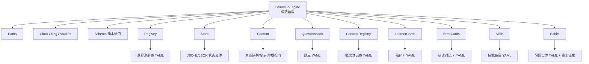
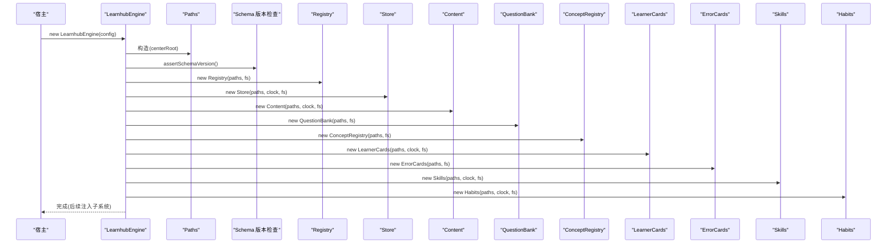
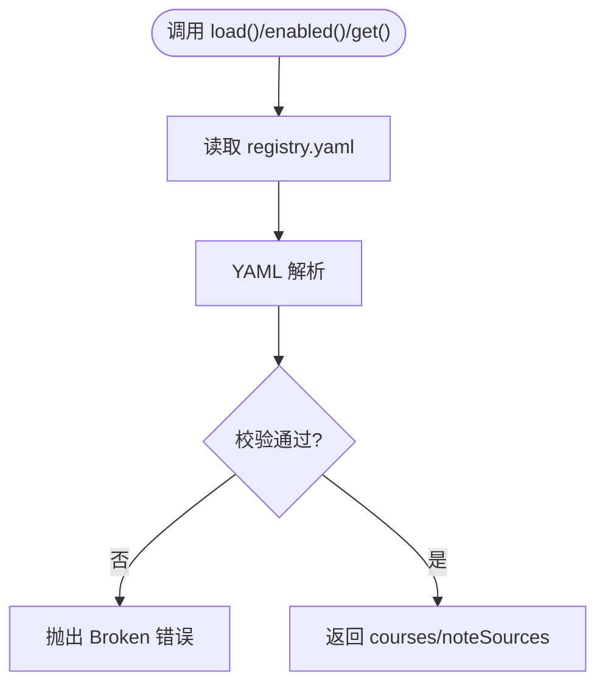
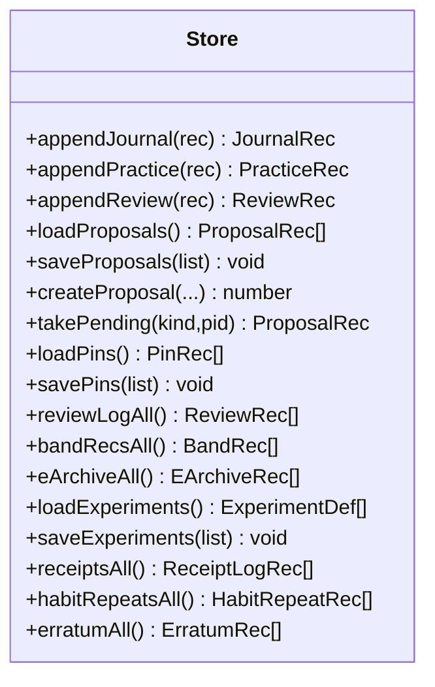
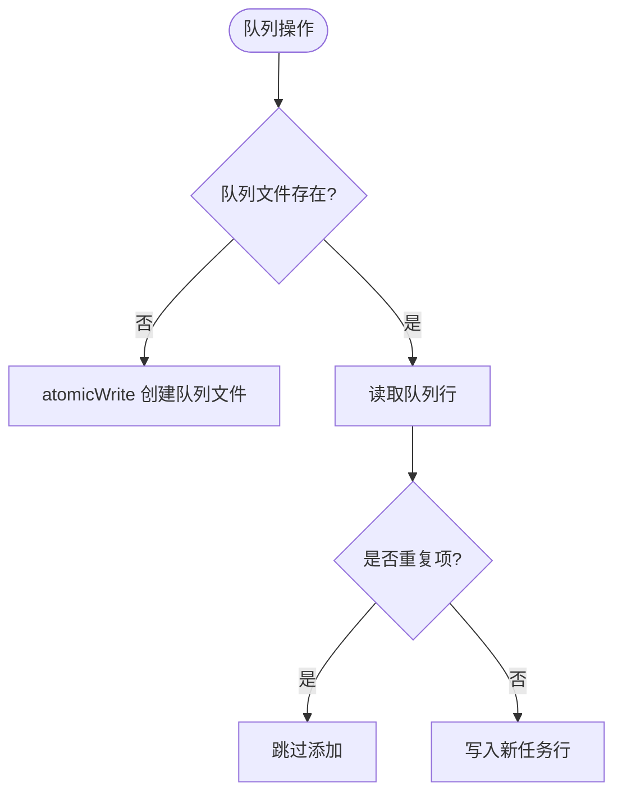
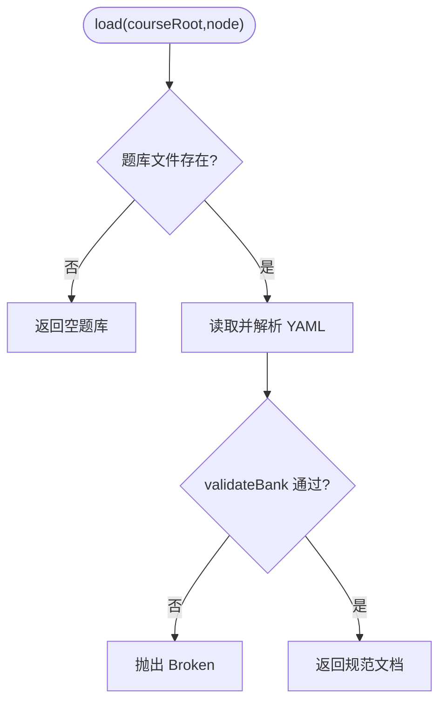
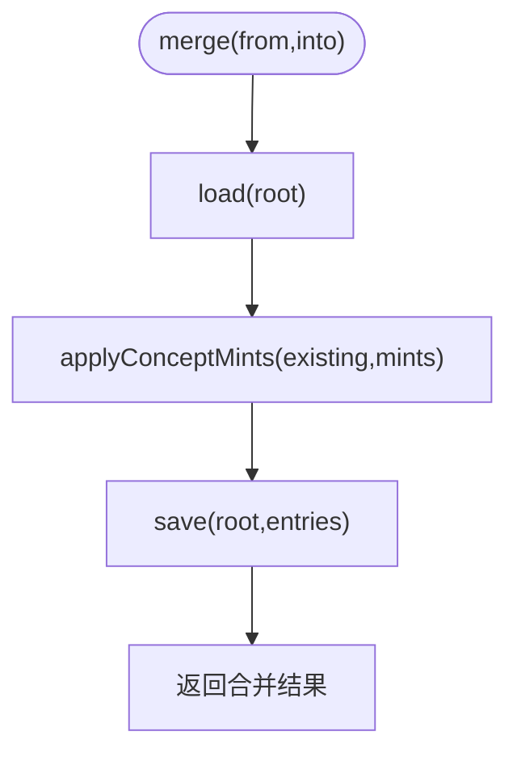
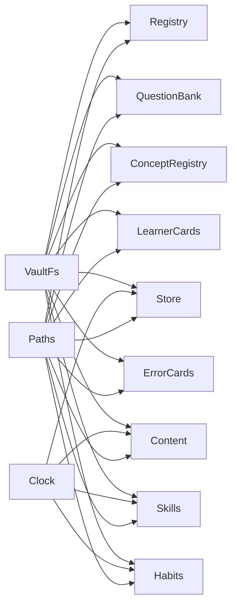

# 基础组件初始化

<cite>
**本文引用的文件**
- [src/engine/index.ts](file://src/engine/index.ts)
- [src/engine/registry.ts](file://src/engine/registry.ts)
- [src/engine/store.ts](file://src/engine/store.ts)
- [src/engine/content.ts](file://src/engine/content.ts)
- [src/engine/question-bank.ts](file://src/engine/question-bank.ts)
- [src/engine/concepts.ts](file://src/engine/concepts.ts)
- [src/engine/learner-cards.ts](file://src/engine/learner-cards.ts)
- [src/engine/error-cards.ts](file://src/engine/error-cards.ts)
- [src/engine/skills.ts](file://src/engine/skills.ts)
- [src/engine/habits.ts](file://src/engine/habits.ts)
</cite>

## 目录
1. [简介](#简介)
2. [项目结构](#项目结构)
3. [核心组件](#核心组件)
4. [架构总览](#架构总览)
5. [详细组件分析](#详细组件分析)
6. [依赖关系分析](#依赖关系分析)
7. [性能考量](#性能考量)
8. [故障排查指南](#故障排查指南)
9. [结论](#结论)

## 简介
本文件聚焦 LearnHub 引擎在启动时“基础组件”的初始化过程，围绕构造函数中各核心对象的创建顺序、职责边界、共享依赖（Paths、Clock、VaultFs）的使用方式，以及关键数据加载流程（如课程注册表加载、状态存储初始化、内容管线准备等）进行系统化说明。文末提供初始化流程图与类图，帮助读者快速理解组件间的依赖层次与时序要求。

## 项目结构
LearnHub 的基础能力集中在 engine 层，通过门面 LearnhubEngine 统一装配：
- 路径与配置：Paths 负责学习中心根路径与子目录归一；schema 版本硬门在构造早期校验。
- 共享依赖：Clock（时间）、VaultFs（文件系统抽象）由宿主注入，保证可测试性与可移植性。
- 基础组件：Registry、Store、Content、QuestionBank、ConceptRegistry、LearnerCards、ErrorCards、Skills、Habits 等。
- 子系统：Graph、ContentSubsystem、SchedSubsystem、GrowthSubsystem、LabSubsystem、ChannelsSubsystem、ProjectSubsystem、BankSubsystem 等在基础组件之后按依赖注入组装。

图表来源
- [src/engine/index.ts:212-398](file://src/engine/index.ts#L212-L398)
- [src/engine/registry.ts:77-102](file://src/engine/registry.ts#L77-L102)
- [src/engine/store.ts:46-48](file://src/engine/store.ts#L46-L48)
- [src/engine/content.ts:51-60](file://src/engine/content.ts#L51-L60)
- [src/engine/question-bank.ts:264-269](file://src/engine/question-bank.ts#L264-L269)
- [src/engine/concepts.ts:284-320](file://src/engine/concepts.ts#L284-L320)
- [src/engine/learner-cards.ts:184-190](file://src/engine/learner-cards.ts#L184-L190)
- [src/engine/error-cards.ts:223-229](file://src/engine/error-cards.ts#L223-L229)
- [src/engine/skills.ts:169-177](file://src/engine/skills.ts#L169-L177)
- [src/engine/habits.ts:130-138](file://src/engine/habits.ts#L130-L138)

章节来源
- [src/engine/index.ts:212-398](file://src/engine/index.ts#L212-L398)

## 核心组件
- Registry（课程注册表）：读取并校验课程清单与笔记源清单，提供 enabled/get/resolve 等能力。
- Store（运行态存储）：以 JSONL/JSON 形式持久化日志、提案、快照、pin、回执、习惯重复等。
- Content（内容管线）：管理生成队列、上下文包、提示词模板、质检门与富内容块修复。
- QuestionBank（题库）：按节点维护题库 YAML，提供加载、保存、单题增改归档等。
- ConceptRegistry（概念登记）：维护每课程的受控词表，支持合并、铸名冲突检测与精确解析。
- LearnerCards（学习者产出卡）：独立卡组域，自带 FSRS 调度与作答统计。
- ErrorCards（错误对比卡）：从作答流水挖掘高频错法，生成三选一对比卡并独立复习。
- Skills（技能条目）：无界实践区执行事件通道，基于 FSRS 推进与维护节拍。
- Habits（习惯）：执行意图驱动的自报式习惯，零 FSRS 语义，曲线与 streak 仅展示。

章节来源
- [src/engine/registry.ts:77-153](file://src/engine/registry.ts#L77-L153)
- [src/engine/store.ts:46-479](file://src/engine/store.ts#L46-L479)
- [src/engine/content.ts:51-800](file://src/engine/content.ts#L51-L800)
- [src/engine/question-bank.ts:264-453](file://src/engine/question-bank.ts#L264-L453)
- [src/engine/concepts.ts:284-335](file://src/engine/concepts.ts#L284-L335)
- [src/engine/learner-cards.ts:184-309](file://src/engine/learner-cards.ts#L184-L309)
- [src/engine/error-cards.ts:223-353](file://src/engine/error-cards.ts#L223-L353)
- [src/engine/skills.ts:169-244](file://src/engine/skills.ts#L169-L244)
- [src/engine/habits.ts:130-203](file://src/engine/habits.ts#L130-L203)

## 架构总览
LearnhubEngine 构造函数遵循“先基础设施，再领域对象，最后子系统”的顺序：
1) 解析 vault/center 路径，注入 Clock/Rng/VaultFs，构建 Paths。
2) 立即校验 schema 版本，阻断不兼容库。
3) 实例化基础组件（Registry、Store、Content、QuestionBank、ConceptRegistry、LearnerCards、ErrorCards、Skills、Habits）。
4) 按需创建 NoteSourceManifest、AnkiMirror。
5) 以已存在的基础组件为依赖，注入到各子系统（Lab、Channels、Learner、Project、Bank、Graph、ContentSubsystem、SchedSubsystem、GrowthSubsystem）。

图表来源
- [src/engine/index.ts:212-398](file://src/engine/index.ts#L212-L398)

章节来源
- [src/engine/index.ts:212-398](file://src/engine/index.ts#L212-L398)

## 详细组件分析

### Registry（课程注册表）
- 职责：读取并校验课程注册表 YAML，返回课程列表与笔记源清单；提供 get/enabled/resolve 等查询。
- 依赖：Paths（registryPath）、VaultFs（读/写）、YAML 解析与契约校验。
- 初始化行为：构造仅持有依赖；首次 load/save 时才访问磁盘。
- 数据加载：loadDoc 读取注册表，缺失视为空（Missing），损坏抛错（Broken）。

图表来源
- [src/engine/registry.ts:77-102](file://src/engine/registry.ts#L77-L102)
- [src/engine/registry.ts:104-153](file://src/engine/registry.ts#L104-L153)

章节来源
- [src/engine/registry.ts:77-153](file://src/engine/registry.ts#L77-L153)

### Store（运行态存储）
- 职责：集中管理 journal/practice/review-log（JSONL 追加）、proposals/snapshots/pins/band-log/e-archive/experiments/receipts/habit-repeats/erratum 等。
- 依赖：Paths、Clock（时间戳）、VaultFs（原子写/追加/读取）。
- 初始化行为：构造仅持有依赖；读写方法按需访问磁盘。
- 数据加载：所有读侧对缺失采用 Missing 合法空态，对损坏采用 Broken 抛错策略。

图表来源
- [src/engine/store.ts:46-479](file://src/engine/store.ts#L46-L479)

章节来源
- [src/engine/store.ts:46-479](file://src/engine/store.ts#L46-L479)

### Content（内容管线）
- 职责：生成队列管理、上下文包组装、提示词模板加载与升级、内容质检门（超纲引用、别名一致性、节形状、可视化块语法、预测门等）、富内容块修复与局部修补。
- 依赖：Paths、Clock、VaultFs；与 notes/seed/complexity/prompts 协作。
- 初始化行为：构造仅持有依赖；queueInit/loadPrompt/gateReport 等方法按需工作。
- 数据加载：提示词目录不存在则使用内置模板并自动升级；生成队列按需创建。

图表来源
- [src/engine/content.ts:64-112](file://src/engine/content.ts#L64-L112)

章节来源
- [src/engine/content.ts:51-800](file://src/engine/content.ts#L51-L800)

### QuestionBank（题库）
- 职责：按节点维护题库 YAML，提供 load/save、单题增改、归档/恢复、证据字段整体替换等。
- 依赖：Paths、VaultFs、YAML 解析与 validateBank 门禁。
- 初始化行为：构造仅持有依赖；首次 load/save 才访问磁盘。
- 数据加载：缺失题库视为空；损坏抛错。

图表来源
- [src/engine/question-bank.ts:264-318](file://src/engine/question-bank.ts#L264-L318)

章节来源
- [src/engine/question-bank.ts:264-453](file://src/engine/question-bank.ts#L264-L453)

### ConceptRegistry（概念登记）
- 职责：维护每课程的受控词表，支持加载/保存/合并，提供名称索引、冲突检测与精确解析。
- 依赖：Paths、VaultFs、YAML 解析与 validateConceptRegistry。
- 初始化行为：构造仅持有依赖；首次 load/save/merge 才访问磁盘。
- 数据加载：缺失视为空；损坏抛错。

图表来源
- [src/engine/concepts.ts:284-335](file://src/engine/concepts.ts#L284-L335)

章节来源
- [src/engine/concepts.ts:284-335](file://src/engine/concepts.ts#L284-L335)

### LearnerCards（学习者产出卡）
- 职责：独立卡组域，支持加载/添加/归档/更新证据；自带 FSRS 调度与“一卡一天一次推进”门禁。
- 依赖：Paths、VaultFs；与 store/srs 等协作（在子系统层注入）。
- 初始化行为：构造仅持有依赖；首次操作才访问磁盘。
- 数据加载：缺失为空；损坏抛错。

章节来源
- [src/engine/learner-cards.ts:184-309](file://src/engine/learner-cards.ts#L184-L309)

### ErrorCards（错误对比卡）
- 职责：从 practice 流水挖掘高频错法，生成三选一对比卡并独立复习；支持批量添加与归档。
- 依赖：Paths、VaultFs；mineErrorPatterns 纯函数聚合 practice 记录。
- 初始化行为：构造仅持有依赖；首次操作才访问磁盘。
- 数据加载：缺失为空；损坏抛错。

章节来源
- [src/engine/error-cards.ts:223-353](file://src/engine/error-cards.ts#L223-L353)

### Skills（技能条目）
- 职责：技能条目 CRUD、执行事件推进、维护节拍与到期计算、XP 入账 detail 拼装。
- 依赖：Paths、Clock、VaultFs；advance 推进内核复用。
- 初始化行为：构造仅持有依赖；首次操作才访问磁盘。
- 数据加载：缺失抛 Missing；损坏抛 Broken。

章节来源
- [src/engine/skills.ts:169-244](file://src/engine/skills.ts#L169-L244)

### Habits（习惯）
- 职责：执行意图驱动的习惯实体与重复流水；零 FSRS 语义，曲线与 streak 仅展示。
- 依赖：Paths、Clock、VaultFs；重复流水走 store。
- 初始化行为：构造仅持有依赖；首次操作才访问磁盘。
- 数据加载：缺失为空；损坏抛错。

章节来源
- [src/engine/habits.ts:130-203](file://src/engine/habits.ts#L130-L203)

## 依赖关系分析
- 共享依赖：
  - Paths：所有组件均通过 Paths 获取稳定路径（课程根、状态目录、题库目录、卡片目录等）。
  - Clock：用于时间戳、今日日期、学习日切分（store/content/skills/habits 等）。
  - VaultFs：所有磁盘 IO 的唯一通道，确保可测试与跨平台。
- 组件间依赖：
  - 子系统（Graph/ContentSubsystem/SchedSubsystem/GrowthSubsystem/LabSubsystem/ChannelsSubsystem/ProjectSubsystem/BankSubsystem）在基础组件之后构造，并通过窄面接口回引门面或基础组件。
  - 基础组件之间基本解耦，仅在子系统层组合。

图表来源
- [src/engine/index.ts:212-398](file://src/engine/index.ts#L212-L398)
- [src/engine/registry.ts:77-102](file://src/engine/registry.ts#L77-L102)
- [src/engine/store.ts:46-48](file://src/engine/store.ts#L46-L48)
- [src/engine/content.ts:51-60](file://src/engine/content.ts#L51-L60)
- [src/engine/question-bank.ts:264-269](file://src/engine/question-bank.ts#L264-L269)
- [src/engine/concepts.ts:284-291](file://src/engine/concepts.ts#L284-L291)
- [src/engine/learner-cards.ts:184-190](file://src/engine/learner-cards.ts#L184-L190)
- [src/engine/error-cards.ts:223-229](file://src/engine/error-cards.ts#L223-L229)
- [src/engine/skills.ts:169-177](file://src/engine/skills.ts#L169-L177)
- [src/engine/habits.ts:130-138](file://src/engine/habits.ts#L130-L138)

章节来源
- [src/engine/index.ts:212-398](file://src/engine/index.ts#L212-L398)

## 性能考量
- 延迟加载：基础组件构造轻量，实际 IO 发生在首次方法调用，避免启动开销。
- 原子写：Store 与多数组件使用 atomicWrite，减少并发写风险。
- 缓存：FSRS 调度器按课程根缓存 schedCache，避免重复初始化。
- 只读扫描：多处采用 Missing/Broken 分离策略，缺失不阻塞，损坏显式报错，便于批处理与体检。

[本节为通用指导，不直接分析具体文件]

## 故障排查指南
- 课程注册表损坏：Registry.loadDoc 会抛出 Broken，包含路径与原因；检查 learnhub 注册表 YAML 结构与键值。
- 状态文件损坏：Store 的 proposals/pins/experiments 等读侧对非数组/非法 JSON 抛 Broken；修复或删除后重试。
- 题库损坏：QuestionBank.load 失败会抛出 Broken，定位到具体节点题库文件；修正 YAML 或重新生成。
- 概念登记表损坏：ConceptRegistry.load 失败会抛出 Broken；检查 concepts 列表与联合唯一约束。
- 卡片域损坏：LearnerCards/ErrorCards 读侧对坏档抛 Broken；清理或重建对应 YAML。
- 技能/习惯损坏：Skills/Habits 读侧对坏档抛 Broken；检查 frontmatter 必填字段与枚举值。

章节来源
- [src/engine/registry.ts:80-102](file://src/engine/registry.ts#L80-L102)
- [src/engine/store.ts:172-206](file://src/engine/store.ts#L172-L206)
- [src/engine/store.ts:297-321](file://src/engine/store.ts#L297-L321)
- [src/engine/store.ts:386-420](file://src/engine/store.ts#L386-L420)
- [src/engine/question-bank.ts:275-318](file://src/engine/question-bank.ts#L275-L318)
- [src/engine/concepts.ts:293-315](file://src/engine/concepts.ts#L293-L315)
- [src/engine/learner-cards.ts:196-225](file://src/engine/learner-cards.ts#L196-L225)
- [src/engine/error-cards.ts:235-264](file://src/engine/error-cards.ts#L235-L264)
- [src/engine/skills.ts:196-207](file://src/engine/skills.ts#L196-L207)
- [src/engine/habits.ts:157-168](file://src/engine/habits.ts#L157-L168)

## 结论
LearnhubEngine 的构造函数以清晰的分层顺序完成基础组件的实例化：先建立路径与配置，再装载课程注册表、状态存储、内容管线、题库、概念登记与各类卡片/技能/习惯域。各组件职责明确、依赖解耦，通过 Paths/Clock/VaultFs 形成稳定的共享基座。子系统在基础组件就绪后按依赖注入组装，从而保证初始化时序正确、扩展性强且易于测试。