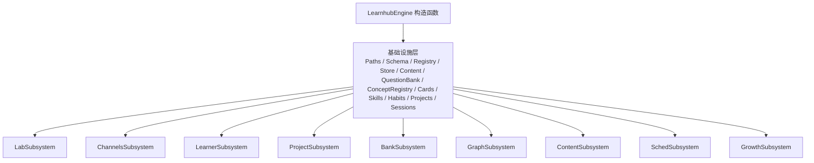
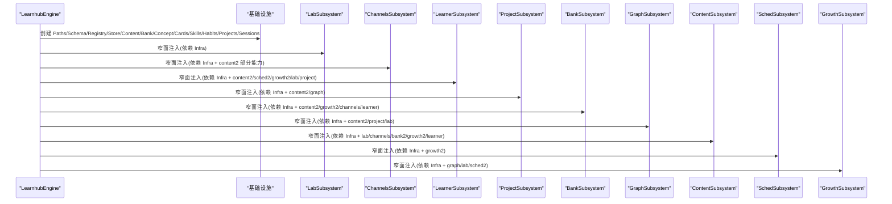
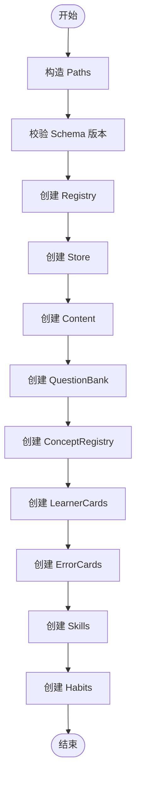
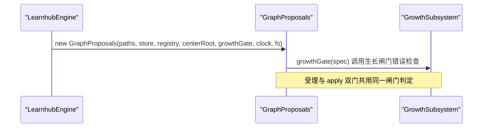
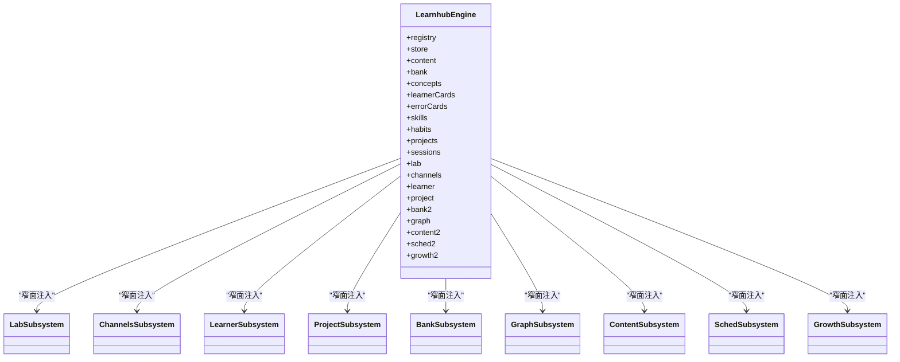
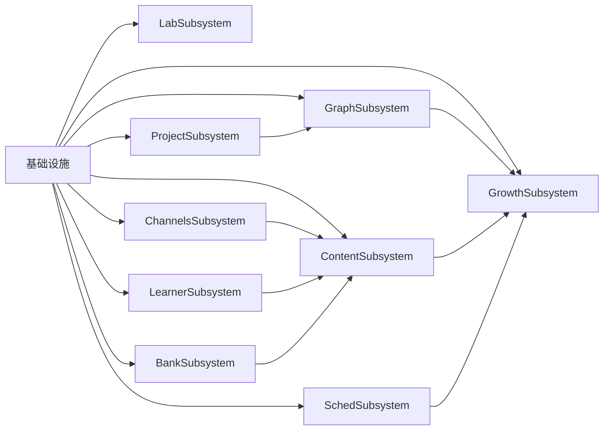

# 子系统初始化顺序

<cite>
**本文引用的文件**
- [src/engine/index.ts](file://src/engine/index.ts)
- [src/engine/registry.ts](file://src/engine/registry.ts)
- [src/engine/store.ts](file://src/engine/store.ts)
- [src/engine/content.ts](file://src/engine/content.ts)
- [src/engine/question-bank.ts](file://src/engine/question-bank.ts)
- [src/engine/concepts.ts](file://src/engine/concepts.ts)
- [src/engine/learner-cards.ts](file://src/engine/learner-cards.ts)
- [src/engine/error-cards.ts](file://src/engine/error-cards.ts)
- [src/engine/skills.ts](file://src/engine/skills.ts)
- [src/engine/habits.ts](file://src/engine/habits.ts)
- [src/engine/proposals.ts](file://src/engine/proposals.ts)
</cite>

## 目录
1. [简介](#简介)
2. [项目结构](#项目结构)
3. [核心组件](#核心组件)
4. [架构总览](#架构总览)
5. [详细组件分析](#详细组件分析)
6. [依赖关系分析](#依赖关系分析)
7. [性能考虑](#性能考虑)
8. [故障排查指南](#故障排查指南)
9. [结论](#结论)
10. [附录](#附录)

## 简介
本文聚焦 LearnHub 引擎在构造函数中的子系统初始化顺序与依赖注入机制，系统梳理 Registry、Store、Content、QuestionBank、ConceptRegistry、LearnerCards、ErrorCards、Skills、Habits 等基础组件的创建时序，并解释窄面注入构造（LabSubsystem、ChannelsSubsystem、LearnerSubsystem、ProjectSubsystem、BankSubsystem、GraphSubsystem、ContentSubsystem、SchedSubsystem、GrowthSubsystem）如何以最小依赖面装配。同时给出初始化流程图、依赖图、错误处理与回滚策略说明，帮助读者理解“先建基础设施，再装配领域子系统”的整体设计。

## 项目结构
LearnHub 引擎通过单一门面类 LearnhubEngine 集中管理所有子系统的生命周期。构造过程分为两个阶段：
- 第一阶段：创建共享基础设施（Paths、Schema 校验、Registry、Store、Content、QuestionBank、ConceptRegistry、LearnerCards、ErrorCards、Skills、Habits、NoteSourceManifest、AnkiMirror、Projects、Sessions）。
- 第二阶段：按依赖拓扑顺序装配各域子系统（Lab → Channels → Learner → Project → Bank → Graph → Content → Sched → Growth），并通过窄面接口互相引用，避免循环依赖。

图表来源
- [src/engine/index.ts:212-398](file://src/engine/index.ts#L212-L398)

章节来源
- [src/engine/index.ts:212-398](file://src/engine/index.ts#L212-L398)

## 核心组件
- 路径与配置
  - Paths：基于 vault 根与学习中心相对路径构建；用于所有子系统定位数据文件。
  - Schema：启动时同步校验 learnhub.json 版本，非当前主版本直接拒载，确保后续读取安全。
- 注册表与存储
  - Registry：课程与笔记源注册表，缺失为合法空态，损坏抛错。
  - Store：明文运行态存储（journal/practice/review-log JSONL、proposals、snapshots、pins、experiments、receipts、habits repeat、erratum），全部写操作走原子替换或追加。
- 内容生成与题库
  - Content：生成队列、上下文包、提示词模板、质检门、富内容块修复等。
  - QuestionBank：题库 YAML 读写、schema 校验、单题增改归档、证据字段整体替换。
- 概念登记与卡片
  - ConceptRegistry：概念登记表加载/保存/合并，名字联合唯一，精确解析。
  - LearnerCards：学习者产出卡独立域，独立 schema 与门禁，FSRS 调度隔离。
  - ErrorCards：错误对比卡独立域，从作答流水挖高频错误模式，独立 FSRS 调度。
- 技能与习惯
  - Skills：技能条目与执行事件通道，lane 复用 ts-fsrs 推进内核，维护节拍与到期计算。
  - Habits：习惯一等公民对象，零 FSRS 语义，重复自报驱动曲线与 streak。

章节来源
- [src/engine/index.ts:212-235](file://src/engine/index.ts#L212-L235)
- [src/engine/registry.ts:77-153](file://src/engine/registry.ts#L77-L153)
- [src/engine/store.ts:46-479](file://src/engine/store.ts#L46-L479)
- [src/engine/content.ts:51-800](file://src/engine/content.ts#L51-L800)
- [src/engine/question-bank.ts:264-453](file://src/engine/question-bank.ts#L264-L453)
- [src/engine/concepts.ts:284-335](file://src/engine/concepts.ts#L284-L335)
- [src/engine/learner-cards.ts:184-200](file://src/engine/learner-cards.ts#L184-L200)
- [src/engine/error-cards.ts:126-200](file://src/engine/error-cards.ts#L126-L200)
- [src/engine/skills.ts:169-200](file://src/engine/skills.ts#L169-L200)
- [src/engine/habits.ts:130-200](file://src/engine/habits.ts#L130-L200)

## 架构总览
初始化顺序遵循“先基础后领域、先无环后闭环”的原则：
- 先创建不可变或低耦合的基础设施（Paths、Schema、Registry、Store、Content、QuestionBank、ConceptRegistry、Cards、Skills、Habits、Projects、Sessions）。
- 再按依赖拓扑装配领域子系统：
  - LabSubsystem：仅依赖 store、paths、registry、projects、bank、sched、learningDay、loadView、enabledCourses、scanCourseBanks、sedimentAppend/Fold/RebuildProfile。
  - ChannelsSubsystem：依赖 store、paths、bank、ankiMirror、noteManifest、vaultRoot、registry（窄面）、sched、learningDay、loadView、enabledCourses、scanCourseBanks、content2 的 prompt/question/judge/refresh 能力。
  - LearnerSubsystem：依赖 store、paths、registry、bank、projects、habits、skills、learnerCards、noteManifest、sched、learningDay、loadView、enabledCourses、content2 的 prompt/note/ensure/save、sched2.sedimentSettle、growth2.compassEtaRefresh、lab.experimentPropose/receiptReviewEffect、project.refreshSourceFingerprints。
  - ProjectSubsystem：依赖 store、paths、registry、bank、projects、noteManifest、concepts、vaultRoot、jolRng、clock、fs、learningDay、loadView、enabledCourses、content2.prompt/note/ensure/save、locateNode、graph.apply/propose。
  - BankSubsystem：依赖 store、paths、registry、bank、errorCards、concepts、proposals、schedCache、sched、learningDay、loadView、enabledCourses、scanCourseBanks、content2.prompt/assert/node/ensure/save/vaultPrior/logGrading/questionContext、growth2.exerciseGated、channels.repairInvokesOnce/admitQuestion、learner.explainPoints、channels.isNoteSourceCourse。
  - GraphSubsystem：依赖 store、paths、projects、proposals、concepts、registry、bank、noteManifest、vaultRoot、learningDay、loadView、content2.prompt/assert、seedAuditFor、project.applyProjectPlanProposal、lab.experimentApply。
  - ContentSubsystem：依赖 store、paths、registry、concepts、bank、content、sessions、learnerCards、vaultRoot、jolRng、clock、fs、assertNoteOk、lab.bandDefault、learner.calibrationHintsConfig、channels.collectNoteSourceCards、registry.enabled、ensureNote、bank2.errorCardTriples、growth2.exerciseGated、lab.expTag、channels.isNoteSourceCourse、learner.jolConfig、growth2.jolPredicted、learningDay、loadView、lab.nof1QueueEffect、channels.noteSourceAnswer/Forget/Rate、sched、updateNoteFm。
  - SchedSubsystem：依赖 store、paths、registry、bank、content、schedCache、assertNoteOk、growth2.coachCheckFor、enabledCourses、ensureNote、learningDay、loadView、scanCourseBanks、sched。
  - GrowthSubsystem：依赖 store、paths、registry、concepts、content、enabledCourses、graph.apply/propose/reject、learningDay、loadView、lab.mcAggregate/sandboxPopulation、scanCourseBanks、sched2.sedimentFold/RebuildProfile。

图表来源
- [src/engine/index.ts:212-398](file://src/engine/index.ts#L212-L398)

章节来源
- [src/engine/index.ts:212-398](file://src/engine/index.ts#L212-L398)

## 详细组件分析

### 基础设施层初始化
- 路径与配置
  - 归一化 vault 与 centerRel，构造 Paths；同步读取并校验 schema 版本，失败即中止。
- 注册表与存储
  - Registry：读/写课程与笔记源清单，缺失为空，损坏抛错。
  - Store：JSONL 追加与原子写，提案/快照/pins/experiments/receipts/habits repeat/erratum 统一入口。
- 内容与题库
  - Content：生成队列、上下文包、提示词模板、质检门、富内容块修复。
  - QuestionBank：题库 YAML 读写与严格 schema 校验。
- 概念与卡片
  - ConceptRegistry：概念登记表加载/保存/合并，名字联合唯一。
  - LearnerCards/ErrorCards：独立卡域，独立 schema 与门禁，FSRS 调度隔离。
- 技能与习惯
  - Skills：技能条目与执行事件通道，维护节拍与到期计算。
  - Habits：习惯实体与重复流，零 FSRS 语义。

图表来源
- [src/engine/index.ts:212-235](file://src/engine/index.ts#L212-L235)
- [src/engine/registry.ts:77-153](file://src/engine/registry.ts#L77-L153)
- [src/engine/store.ts:46-479](file://src/engine/store.ts#L46-L479)
- [src/engine/content.ts:51-800](file://src/engine/content.ts#L51-L800)
- [src/engine/question-bank.ts:264-453](file://src/engine/question-bank.ts#L264-L453)
- [src/engine/concepts.ts:284-335](file://src/engine/concepts.ts#L284-L335)
- [src/engine/learner-cards.ts:184-200](file://src/engine/learner-cards.ts#L184-L200)
- [src/engine/error-cards.ts:126-200](file://src/engine/error-cards.ts#L126-L200)
- [src/engine/skills.ts:169-200](file://src/engine/skills.ts#L169-L200)
- [src/engine/habits.ts:130-200](file://src/engine/habits.ts#L130-L200)

章节来源
- [src/engine/index.ts:212-235](file://src/engine/index.ts#L212-L235)

### 生长闸门注入（GraphProposals）
- GraphProposals 在基础设施之后立即创建，接收 growthGate 回调（growth2.growthGateErrors），用于受理与 apply 双门消费同一份闸门判定。
- 内部会创建 ConceptRegistry（paths, fs）用于概念引用对表门。

图表来源
- [src/engine/index.ts:236-239](file://src/engine/index.ts#L236-L239)
- [src/engine/proposals.ts:495-510](file://src/engine/proposals.ts#L495-L510)

章节来源
- [src/engine/index.ts:236-239](file://src/engine/index.ts#L236-L239)
- [src/engine/proposals.ts:495-510](file://src/engine/proposals.ts#L495-L510)

### 窄面注入构造（LabSubsystem、ChannelsSubsystem、LearnerSubsystem、ProjectSubsystem、BankSubsystem、GraphSubsystem、ContentSubsystem、SchedSubsystem、GrowthSubsystem）
- 每个子系统通过结构化窄面接口只暴露所需方法，避免引入下游类型导致循环依赖。
- 典型依赖包括：
  - clock/fs/store/paths：通用运行时与存储端口。
  - registry：课程与笔记源注册。
  - bank/content/sessions/learnerCards/errorCards/skills/habits/projects：领域能力。
  - sched/learningDay/loadView/enabledCourses：视图与时间口径。
  - growth2/sched2/lab/channels/project：跨域协作点。

图表来源
- [src/engine/index.ts:168-398](file://src/engine/index.ts#L168-L398)

章节来源
- [src/engine/index.ts:168-398](file://src/engine/index.ts#L168-L398)

### 依赖注入机制与共享依赖传递
- 共享依赖
  - clock：统一时间源，所有子系统通过窄面获取 today/cutoff/now。
  - fs：VaultFs 抽象，所有读盘落盘经此通道，保证测试可替换实现。
  - store：运行态存储，提供 journal/practice/review-log/proposals/snapshots/pins/experiments/receipts/habits repeat/erratum 的统一读写。
  - paths：路径构造器，所有子系统通过它定位 vault 内资源。
  - registry：课程与笔记源注册表，提供 load/get/resolve/enabled/save。
- 传递方式
  - 基础设施层先创建，随后在各子系统构造时以窄面形式传入，避免直接依赖具体类。
  - 跨域协作通过回调函数（如 sched(courseRoot)、learningDay()、loadView(course)、enabledCourses()、scanCourseBanks(c, fn)）解耦调用时机与实现细节。

章节来源
- [src/engine/index.ts:212-398](file://src/engine/index.ts#L212-L398)
- [src/engine/store.ts:46-479](file://src/engine/store.ts#L46-L479)
- [src/engine/registry.ts:77-153](file://src/engine/registry.ts#L77-L153)

### 前置条件与后置处理
- 前置条件
  - Schema 版本校验通过；Registry/Store/Content/QuestionBank/ConceptRegistry/Cards/Skills/Habits 等基础设施就绪。
  - 生长闸门回调已注入（growth2.growthGateErrors），供 GraphProposals 使用。
- 后置处理
  - 各子系统装配完成后，门面暴露统一 API（status/recommend/rebuild/discussionPack/errorExplainPack 等），由宿主消费。
  - 懒加载视图（loadView）与调度器缓存（schedCache）按需创建与复用。

章节来源
- [src/engine/index.ts:212-398](file://src/engine/index.ts#L212-L398)

## 依赖关系分析
- 子系统间依赖拓扑
  - LabSubsystem：依赖 Infra（store/paths/registry/projects/bank/sched/learningDay/loadView/enabledCourses/scanCourseBanks/sedimentAppend/Fold/RebuildProfile）。
  - ChannelsSubsystem：依赖 Infra + content2 的部分能力（prompt/question/judge/refresh）。
  - LearnerSubsystem：依赖 Infra + content2/sched2/growth2/lab/project。
  - ProjectSubsystem：依赖 Infra + content2/graph。
  - BankSubsystem：依赖 Infra + content2/growth2/channels/learner。
  - GraphSubsystem：依赖 Infra + content2/project/lab。
  - ContentSubsystem：依赖 Infra + lab/channels/bank2/growth2/learner。
  - SchedSubsystem：依赖 Infra + growth2。
  - GrowthSubsystem：依赖 Infra + graph/lab/sched2。

图表来源
- [src/engine/index.ts:242-398](file://src/engine/index.ts#L242-L398)

章节来源
- [src/engine/index.ts:242-398](file://src/engine/index.ts#L242-L398)

## 性能考虑
- 调度器缓存：每课程的 FSRS 实例缓存在 schedCache，避免重复重建。
- 视图懒加载：loadView 按需读取图与状态，减少启动开销。
- 原子写与追加：Store 使用 atomicWrite 与 JSONL 追加，降低锁竞争与写入成本。
- 批量处理：错误卡生成与题库扫描采用批上限控制，防止提示词膨胀。

[本节为通用指导，不直接分析具体文件]

## 故障排查指南
- 启动硬门
  - Schema 版本不匹配：构造时同步校验失败，拒绝加载任何引擎路径。
- 注册表与概念登记
  - Registry 文件损坏：抛错并附带位置与原因；缺失为合法空态。
  - ConceptRegistry 损坏：抛错并附带契约校验失败行；缺失为合法空态。
- 存储层
  - proposals/pins/experiments/receipts/habits repeat/erratum 等文件损坏：抛错并提示修复或删除；缺失多为合法空态（视具体方法而定）。
- 内容生成与题库
  - Content 提示词未知类型：抛错并列出内置类型；YAML/JSON 解析失败抛错。
  - QuestionBank YAML 解析失败或 schema 校验失败：抛错并列出错误行。
- 卡片域
  - LearnerCards/ErrorCards 文件损坏：抛错并附带位置与原因；缺失为合法空态。
- 技能与习惯
  - Skills/Habits 文件损坏：抛错并附带位置与原因；缺失为合法空态。

章节来源
- [src/engine/index.ts:212-235](file://src/engine/index.ts#L212-L235)
- [src/engine/registry.ts:77-153](file://src/engine/registry.ts#L77-L153)
- [src/engine/store.ts:172-206](file://src/engine/store.ts#L172-L206)
- [src/engine/content.ts:334-352](file://src/engine/content.ts#L334-L352)
- [src/engine/question-bank.ts:275-318](file://src/engine/question-bank.ts#L275-L318)
- [src/engine/learner-cards.ts:196-200](file://src/engine/learner-cards.ts#L196-L200)
- [src/engine/error-cards.ts:196-200](file://src/engine/error-cards.ts#L196-L200)
- [src/engine/skills.ts:179-200](file://src/engine/skills.ts#L179-L200)
- [src/engine/habits.ts:140-200](file://src/engine/habits.ts#L140-L200)

## 结论
LearnHub 引擎通过“基础设施先行、领域子系统窄面注入”的初始化策略，实现了清晰的依赖边界与稳定的装配顺序。共享依赖（clock/fs/store/paths/registry）在构造早期创建并在后续子系统装配中透传，跨域协作通过回调与窄面接口解耦。生长闸门注入与多子系统间的相互引用确保了功能完整性与可扩展性。错误处理遵循 Missing/Broken 纪律，关键文件损坏时 fail loud，保障系统健壮性。

[本节为总结性内容，不直接分析具体文件]

## 附录
- 初始化顺序要点回顾
  - 先创建基础设施（Paths/Schema/Registry/Store/Content/QuestionBank/ConceptRegistry/Cards/Skills/Habits/Projects/Sessions）。
  - 再按依赖拓扑装配 Lab → Channels → Learner → Project → Bank → Graph → Content → Sched → Growth。
  - 生长闸门回调在 GraphProposals 构造时注入，供受理与 apply 双门使用。
- 窄面注入示例
  - ChannelsSubsystem 仅暴露 registry.load/save/get、sched/learningDay/loadView/enabledCourses/scanCourseBanks、content2 的 prompt/question/judge/refresh 等方法。
  - BankSubsystem 仅暴露 store/registry/bank/errorCards/concepts/proposals/schedCache/sched/learningDay/loadView/enabledCourses/scanCourseBanks/content2/growth2/channels/learner 的必要方法。

[本节为补充说明，不直接分析具体文件]