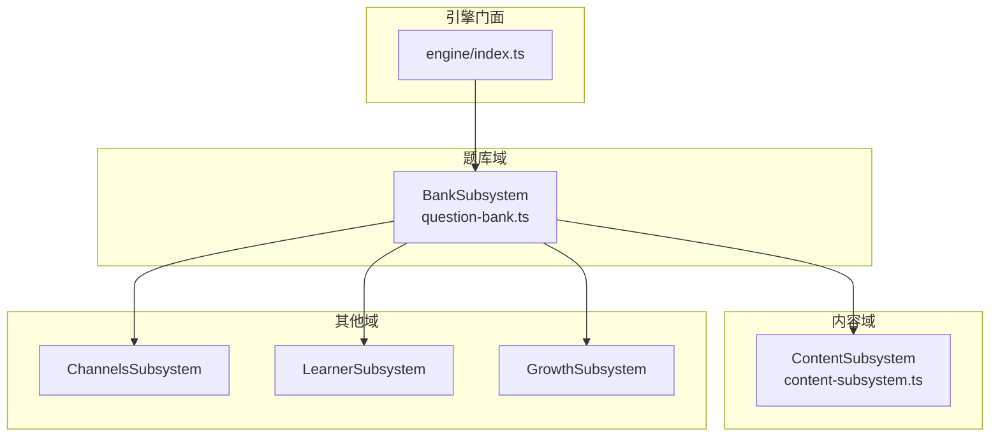
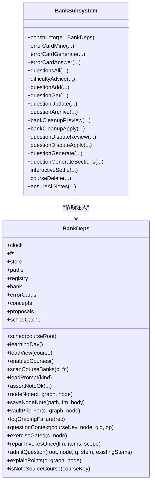
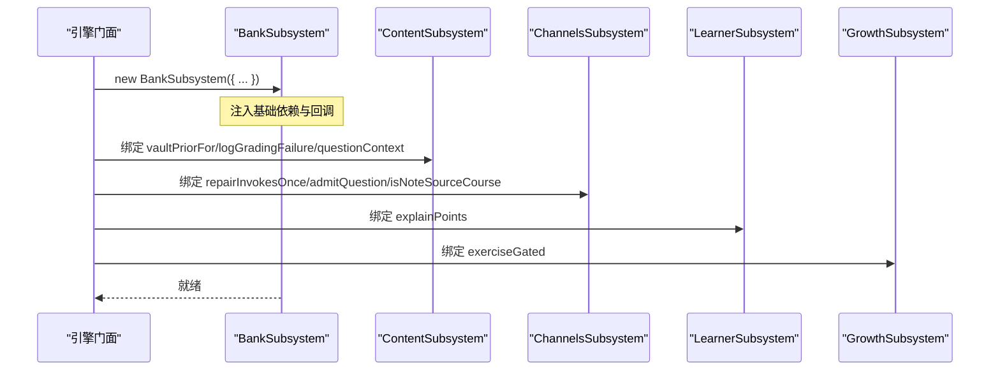
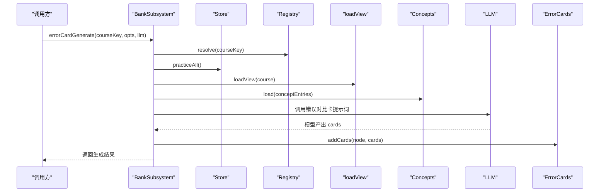
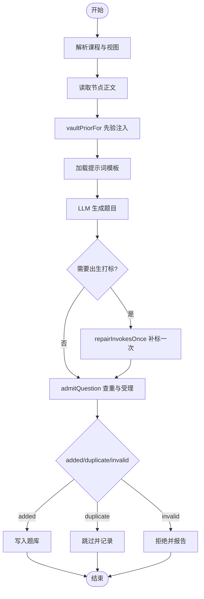
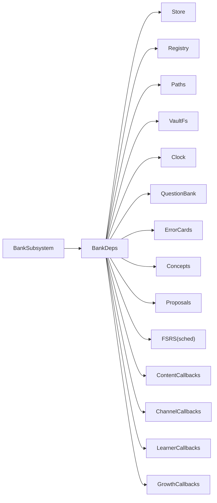

# Bank子系统初始化

<cite>
**本文引用的文件**
- [question-bank.ts](file://src/engine/question-bank.ts)
- [index.ts](file://src/engine/index.ts)
- [content-subsystem.ts](file://src/engine/content-subsystem.ts)
</cite>

## 目录
1. [简介](#简介)
2. [项目结构](#项目结构)
3. [核心组件](#核心组件)
4. [架构总览](#架构总览)
5. [详细组件分析](#详细组件分析)
6. [依赖关系分析](#依赖关系分析)
7. [性能考量](#性能考量)
8. [故障排查指南](#故障排查指南)
9. [结论](#结论)

## 简介
本文聚焦 BankSubsystem 的初始化与依赖注入，系统说明其构造函数接收的基础依赖（clock、fs、store、paths、registry）与业务依赖（bank、errorCards、concepts、proposals、schedCache），以及通过窄面注入的回调函数：sched、learningDay、loadView、enabledCourses、scanCourseBanks、loadPrompt、assertNoteOk、nodeNote、saveNodeNote、vaultPriorFor、logGradingFailure、questionContext、exerciseGated、repairInvokesOnce、admitQuestion、explainPoints、isNoteSourceCourse。在此基础上，解释 BankSubsystem 在题库管理与题目审核中的核心作用，并给出关键流程的可视化图示。

## 项目结构
BankSubsystem 位于题库域（question-bank.ts），由引擎门面在构造时以结构化窄面 BankDeps 注入依赖；内容、通道、学习者等子系统通过门面回引提供能力。BankSubsystem 自身不直接持有跨子系统实例，而是通过 e 访问这些能力，从而保持低耦合与可测试性。

图表来源
- [index.ts:308-330](file://src/engine/index.ts#L308-L330)
- [question-bank.ts:461-514](file://src/engine/question-bank.ts#L461-L514)

章节来源
- [index.ts:308-330](file://src/engine/index.ts#L308-L330)
- [question-bank.ts:461-514](file://src/engine/question-bank.ts#L461-L514)

## 核心组件
- BankSubsystem：题库域入口，封装错误对比卡、题目管理、难度建议、清理、申诉与出题等能力。
- QuestionBank：底层题库读写与校验（YAML 解析、schema 校验、原子写入）。
- BankDeps：BankSubsystem 的窄面依赖接口，声明所有基础与业务依赖及回调。

章节来源
- [question-bank.ts:264-453](file://src/engine/question-bank.ts#L264-L453)
- [question-bank.ts:461-514](file://src/engine/question-bank.ts#L461-L514)

## 架构总览
BankSubsystem 通过 BankDeps 窄面解耦：
- 基础依赖：clock、fs、store、paths、registry、bank、errorCards、concepts、proposals、schedCache。
- 回调依赖：sched、learningDay、loadView、enabledCourses、scanCourseBanks、loadPrompt、assertNoteOk、nodeNote、saveNodeNote、vaultPriorFor、logGradingFailure、questionContext、exerciseGated、repairInvokesOnce、admitQuestion、explainPoints、isNoteSourceCourse。

这些回调由引擎门面在构造 BankSubsystem 时绑定到对应子系统的实现，BankSubsystem 仅消费方法签名，不感知具体实现位置。

图表来源
- [question-bank.ts:461-514](file://src/engine/question-bank.ts#L461-L514)
- [question-bank.ts:513-1543](file://src/engine/question-bank.ts#L513-L1543)

章节来源
- [question-bank.ts:461-514](file://src/engine/question-bank.ts#L461-L514)
- [question-bank.ts:513-1543](file://src/engine/question-bank.ts#L513-L1543)

## 详细组件分析

### 依赖注入参数详解
- 基础依赖
  - clock：用于时间戳与学习日计算（如勘误时间戳、回收站命名）。
  - fs：Vault 文件系统抽象，用于读取/写入题库 YAML、笔记、日志等。
  - store：持久化存储窄面，包含练习流水、勘误、建议忽略清单等读写。
  - paths：路径工具，提供课程根、题库目录、错误卡目录等路径计算。
  - registry：课程注册表，支持启用课程枚举、按 key 解析课程条目。
  - bank：QuestionBank 实例，负责题库文件的加载、保存、单题增删改归档。
  - errorCards：错误卡模块窄面，支持加载、新增、归档、更新证据。
  - concepts：概念登记窄面，用于出生打标与易混对候选。
  - proposals：提案模块窄面，用于为课程缺笔记节点补骨架。
  - schedCache：FSRS 调度器缓存键值映射，删除课程时失效对应课缓存。

- 业务回调
  - sched(courseRoot)：获取或创建 FSRS 实例，用于题目级调度推进。
  - learningDay()：返回今日日期与日界 cutoff，统一“今天”口径。
  - loadView(course)：加载课程视图（图+状态+Broken 列表），供生成/审题/复习使用。
  - enabledCourses()：返回已启用课程列表，用于全量扫描。
  - scanCourseBanks(c, fn)：遍历课程下各节点的题库，供批量审计/清理。
  - loadPrompt(kind)：加载提示词模板（如“题目生成”“错误对比卡”）。
  - assertNoteOk(course, graph, broken, node, tool)：前置门，若目标笔记 Broken 则抛错。
  - nodeNote(c, graph, node)：读取节点笔记（path/fm/body），用于上下文组装。
  - saveNodeNote(path, fm, body)：写回节点笔记，用于证据回写。
  - vaultPriorFor(c, graph, node)：Vault 先验检索段与审计，注入生成上下文。
  - logGradingFailure(rec)：判卷失败留痕（JSONL），不影响主流程。
  - questionContext(courseKey, node, qid, op)：定位课程/图/题目，做前置检查。
  - exerciseGated(c, node)：实验闸门，控制交互件成绩是否回流掌握度。
  - repairInvokesOnce(llm, items, scope)：出生打标修复轮，恰一次补标 invokes。
  - admitQuestion(root, node, q, stem, existingStems)：查重与受理门，决定 added/duplicate/invalid。
  - explainPoints(c, graph, node)：节解释点清单，用于错误卡对照与正文节选。
  - isNoteSourceCourse(courseKey)：判断是否为“笔记源”伪课程，走镜像题库路径。

章节来源
- [question-bank.ts:461-514](file://src/engine/question-bank.ts#L461-L514)
- [index.ts:308-330](file://src/engine/index.ts#L308-L330)

### 内容操作回调：loadPrompt、assertNoteOk、nodeNote、saveNodeNote
- loadPrompt：从内容管线加载提示词模板，BankSubsystem 在生成/出卡/复核中调用。
- assertNoteOk：在生成、答题、申诉等写面前置门，确保目标笔记可用。
- nodeNote/saveNodeNote：读取/写回节点笔记，用于上下文拼装与证据回写（如申诉结算调整 frontmatter）。

章节来源
- [question-bank.ts:577-684](file://src/engine/question-bank.ts#L577-L684)
- [question-bank.ts:977-1026](file://src/engine/question-bank.ts#L977-L1026)
- [question-bank.ts:1040-1141](file://src/engine/question-bank.ts#L1040-L1141)

### 题库相关回调：vaultPriorFor、logGradingFailure、questionContext
- vaultPriorFor：基于节点名与直接前置名检索 Vault 个人笔记，注入“先验段落”，并提供检索审计（零命中/截断/命中清单），避免个性化缺席静默。
- logGradingFailure：将判卷失败的原始输出与定位信息追加到 JSONL，便于排障。
- questionContext：统一解析 course/node/qid，进行图内存在性与笔记可用性检查，供申诉/作答等场景复用。

章节来源
- [content-subsystem.ts:109-122](file://src/engine/content-subsystem.ts#L109-L122)
- [content-subsystem.ts:891-903](file://src/engine/content-subsystem.ts#L891-L903)
- [content-subsystem.ts:906-911](file://src/engine/content-subsystem.ts#L906-L911)
- [question-bank.ts:956-971](file://src/engine/question-bank.ts#L956-L971)

### 高级功能回调：exerciseGated、repairInvokesOnce、admitQuestion、explainPoints、isNoteSourceCourse
- exerciseGated：控制交互件成绩是否回流节点掌握度（实验闸门）。
- repairInvokesOnce：出生打标修复轮，当概念清单在场且新题缺少 invokes 时，调用一次 LLM 补标；仍空则拒收。
- admitQuestion：查重与受理门，结合已有题面与批内去重，返回 added/duplicate/invalid。
- explainPoints：返回节解释点清单，用于错误卡生成时的正文节选与对照。
- isNoteSourceCourse：识别“笔记源”伪课程，走镜像题库路径（noteSourceDir）。

章节来源
- [question-bank.ts:1163-1343](file://src/engine/question-bank.ts#L1163-L1343)
- [question-bank.ts:1353-1468](file://src/engine/question-bank.ts#L1353-L1468)
- [question-bank.ts:871-903](file://src/engine/question-bank.ts#L871-L903)

### 初始化装配：门面如何注入 BankDeps
引擎门面在构造 BankSubsystem 时，将各子系统能力以窄面形式注入：
- 基础依赖直接透传（clock、fs、store、paths、registry、bank、errorCards、concepts、proposals、schedCache）。
- 回调绑定到对应子系统方法（如 sched→this.sched、loadView→this.loadView、vaultPriorFor→content2.vaultPriorFor 等）。

图表来源
- [index.ts:308-330](file://src/engine/index.ts#L308-L330)

章节来源
- [index.ts:308-330](file://src/engine/index.ts#L308-L330)

### 关键流程时序示例

#### 错误对比卡生成流程

图表来源
- [question-bank.ts:577-684](file://src/engine/question-bank.ts#L577-L684)

章节来源
- [question-bank.ts:577-684](file://src/engine/question-bank.ts#L577-L684)

#### 题目生成流程（含出生打标与查重）

图表来源
- [question-bank.ts:1163-1343](file://src/engine/question-bank.ts#L1163-L1343)

章节来源
- [question-bank.ts:1163-1343](file://src/engine/question-bank.ts#L1163-L1343)

## 依赖关系分析
- 松耦合设计：BankSubsystem 仅依赖 BankDeps 窄面，不直接 import 其他子系统类，避免循环依赖。
- 回引模式：跨子系统能力通过门面注入回调，BankSubsystem 调用 this.e.XXX，运行时由门面绑定真实实现。
- 外部依赖：fs、store、paths、registry、bank、errorCards、concepts、proposals、schedCache 均为领域内模块或基础设施。

图表来源
- [question-bank.ts:461-514](file://src/engine/question-bank.ts#L461-L514)
- [index.ts:308-330](file://src/engine/index.ts#L308-L330)

章节来源
- [question-bank.ts:461-514](file://src/engine/question-bank.ts#L461-L514)
- [index.ts:308-330](file://src/engine/index.ts#L308-L330)

## 性能考量
- 视图加载：loadView 每次现读课程图与状态，适合小体积数据；频繁调用时应注意缓存策略（如 schedCache 针对 FSRS）。
- 批量扫描：scanCourseBanks 用于全量审计/清理，应避免阻塞主流程，必要时分批处理。
- LLM 调用：生成/复核/出卡均涉及 LLM 调用，应设置 effort 档位与重试策略，失败时通过 logGradingFailure 留痕。
- 去重与门禁：admitQuestion 与 validateBank 在入库前拦截重复与非法题，减少无效写入。

[本节为通用指导，无需特定文件引用]

## 故障排查指南
- 判卷失败留痕：logGradingFailure 将原始输出与定位信息追加到 JSONL，便于定位模型输出问题。
- 笔记 Broken：assertNoteOk 在写面前置门抛出明确错误，需先修复笔记再重试。
- 题目生成失败：若模型未产出 questions 或未过校验门，会抛出错误并报告 rejected/skipped/duplicates，需检查提示词与输入正文。
- 申诉流程异常：disputeTarget 会检查是否存在可申诉的判错记录与冲正状态，确保一致性。

章节来源
- [content-subsystem.ts:891-903](file://src/engine/content-subsystem.ts#L891-L903)
- [question-bank.ts:956-971](file://src/engine/question-bank.ts#L956-L971)
- [question-bank.ts:1163-1192](file://src/engine/question-bank.ts#L1163-L1192)

## 结论
BankSubsystem 通过 BankDeps 窄面实现了清晰的依赖边界与高内聚的题库管理能力。其初始化过程将基础依赖与业务回调集中注入，使 BankSubsystem 专注于题库与错误卡的业务逻辑，而将跨子系统能力委托给门面与对应子系统。该设计提升了可测试性、可维护性与扩展性，并为题库管理与题目审核提供了稳定可靠的支撑。

[本节为总结性内容，无需特定文件引用]