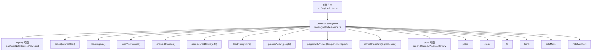
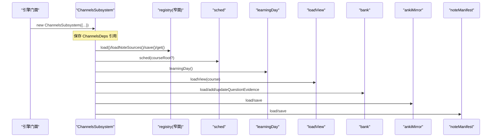
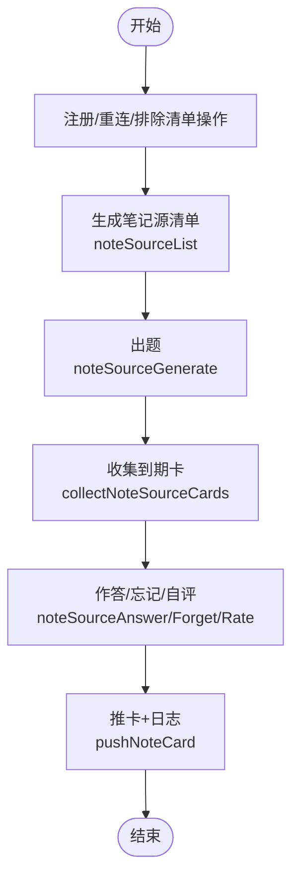
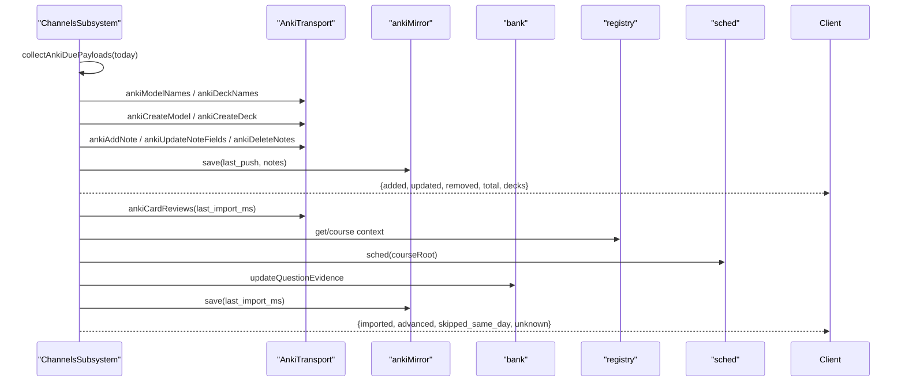
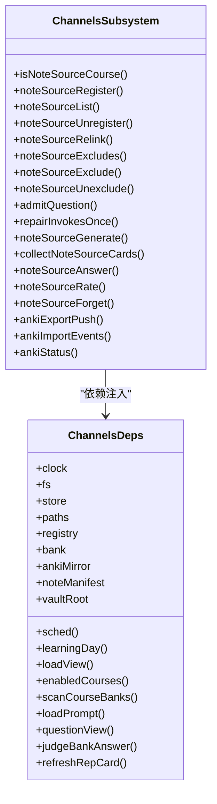

# Channels子系统初始化

<cite>
**本文引用的文件**
- [src/engine/index.ts](file://src/engine/index.ts)
- [src/engine/note-source.ts](file://src/engine/note-source.ts)
- [src/engine/registry.ts](file://src/engine/registry.ts)
- [src/engine/views/channels.ts](file://src/engine/views/channels.ts)
</cite>

## 目录
1. [简介](#简介)
2. [项目结构](#项目结构)
3. [核心组件](#核心组件)
4. [架构总览](#架构总览)
5. [详细组件分析](#详细组件分析)
6. [依赖关系分析](#依赖关系分析)
7. [性能考量](#性能考量)
8. [故障排查指南](#故障排查指南)
9. [结论](#结论)

## 简介
本文件聚焦于 ChannelsSubsystem 的初始化与依赖注入，系统性说明其构造函数接收的基础依赖（clock、fs、store、paths）与业务依赖（bank、ankiMirror、noteManifest），以及通过结构化窄面注入的 registry 四个方法（load、loadNoteSources、save、get）。同时解释 sched、learningDay、loadView、enabledCourses、scanCourseBanks 等回调的使用场景，并重点说明 loadPrompt、questionView、judgeBankAnswer、refreshRepCard 等内容相关回调的注入机制。最后总结 ChannelsSubsystem 在笔记源管理与 Anki 同步中的职责与作用。

## 项目结构
ChannelsSubsystem 位于笔记源与通道域（note-source.ts），由引擎门面（engine/index.ts）在构造时装配依赖。registry 以“结构化窄面”形式注入，避免循环依赖；内容相关能力通过 content2 暴露的回调注入到 ChannelsSubsystem，从而将“出题、判卷、题卡视图、代表卡回刷”等能力解耦。

图表来源
- [src/engine/index.ts:255-274](file://src/engine/index.ts#L255-L274)
- [src/engine/note-source.ts:327-365](file://src/engine/note-source.ts#L327-L365)

章节来源
- [src/engine/index.ts:255-274](file://src/engine/index.ts#L255-L274)
- [src/engine/note-source.ts:327-365](file://src/engine/note-source.ts#L327-L365)

## 核心组件
- ChannelsSubsystem：负责笔记复习源（C1）与 Anki 通道（C2）的领域逻辑，包括注册、清单、漂移治理、出题、作答、忘记、自评、Anki 导出/导入/状态等。
- 依赖注入接口 ChannelsDeps：声明 ChannelsSubsystem 所需的全部基础与业务依赖，采用“窄面 + 回调”的方式，避免耦合具体实现。
- 引擎门面（index.ts）：负责实例化各子系统并将自身能力以回调方式注入到 ChannelsSubsystem。

章节来源
- [src/engine/note-source.ts:327-365](file://src/engine/note-source.ts#L327-L365)
- [src/engine/index.ts:255-274](file://src/engine/index.ts#L255-L274)

## 架构总览
ChannelsSubsystem 通过 ChannelsDeps 获得最小必要能力集：
- 基础依赖：clock、fs、store（窄面）、paths
- 业务依赖：bank（题库）、ankiMirror（Anki 镜象）、noteManifest（笔记源清单）
- 回调注入：sched、learningDay、loadView、enabledCourses、scanCourseBanks
- 内容能力回调：loadPrompt、questionView、judgeBankAnswer、refreshRepCard

这些依赖在引擎门面中集中装配，保证 ChannelsSubsystem 不直接依赖上层模块，避免循环依赖。

图表来源
- [src/engine/index.ts:255-274](file://src/engine/index.ts#L255-L274)
- [src/engine/note-source.ts:327-365](file://src/engine/note-source.ts#L327-L365)

## 详细组件分析

### 构造函数与依赖注入
ChannelsSubsystem 的构造函数仅接收一个 ChannelsDeps 对象，所有依赖通过该对象提供：
- 基础依赖
  - clock：时间戳与学习日计算
  - fs：vault 文件系统访问
  - store：窄面只暴露 appendJournal/appendPractice/appendReview，用于记录练习与复习流水
  - paths：路径常量与派生路径
- 业务依赖
  - bank：题库读写（addQuestion/load/updateQuestionEvidence/bankPath）
  - ankiMirror：Anki 镜象加载与保存
  - noteManifest：笔记源清单加载与保存
- 回调注入
  - sched(courseRoot?): 获取调度器（FSRS）
  - learningDay(): 返回今日与日界 cutoff
  - loadView(course): 加载课程图与状态
  - enabledCourses(): 获取启用课程列表
  - scanCourseBanks(c, fn): 扫描课程题库节点
- 内容能力回调
  - loadPrompt(kind): 加载提示词模板
  - questionView(q, i, opts): 生成题卡视图
  - judgeBankAnswer(llmComplete, q, answer, op, ref): 判卷（含 LLM 辅助）
  - refreshRepCard(c, graph, node): 刷新代表卡（frontmatter/mastery）

章节来源
- [src/engine/note-source.ts:327-365](file://src/engine/note-source.ts#L327-L365)
- [src/engine/index.ts:255-274](file://src/engine/index.ts#L255-L274)

### registry 窄面的四个方法注入
registry 以结构化窄面注入，避免 ChannelsSubsystem 直接依赖 Registry 类型造成循环依赖：
- load(): 加载课程条目
- loadNoteSources(): 加载笔记源条目
- save(courses, noteSources?): 全量写注册表（noteSources 可选，省略则保留盘上值）
- get(key): 按 name/id 精确匹配课程

这些方法在引擎门面中被包装为闭包调用对应实现，确保 ChannelsSubsystem 仅通过窄面访问。

章节来源
- [src/engine/registry.ts:105-136](file://src/engine/registry.ts#L105-L136)
- [src/engine/index.ts:259-264](file://src/engine/index.ts#L259-L264)

### 回调函数的使用场景
- sched(courseRoot?): 用于获取 FSRS 调度器，常见于：
  - 新题首复习初始化（合成首次推进）
  - 收集到期卡时的可提取性 r 计算
  - Anki 导入回放时的 advance 判定
- learningDay(): 统一获取 today 与 cutoff，贯穿注册、出题、复习、Anki 导入等流程
- loadView(course): 加载课程图与 broken 状态，用于：
  - Anki 导入回放时定位课程上下文
  - 代表卡回刷前校验节点
- enabledCourses(): 获取启用课程集合，用于：
  - 收集 Anki 到期负载（遍历启用课程）
  - 扫描课程题库
- scanCourseBanks(c, fn): 遍历课程的每个节点的题库，用于：
  - 收集到期卡
  - 统计 FSRS 样本
  - 导出 Anki 卡片

章节来源
- [src/engine/index.ts:265-269](file://src/engine/index.ts#L265-L269)
- [src/engine/note-source.ts:782-833](file://src/engine/note-source.ts#L782-L833)
- [src/engine/note-source.ts:970-999](file://src/engine/note-source.ts#L970-L999)

### 内容相关回调的注入机制
- loadPrompt(kind): 加载提示词模板，如“笔记出题”，在 noteSourceGenerate 中使用
- questionView(q, i, opts): 将题库题目转换为复习队列中的题卡视图，collectNoteSourceCards 中用于生成 ReviewCard
- judgeBankAnswer(llmComplete, q, answer, op, ref): 判卷入口，noteSourceAnswer 中调用以得到分数与反馈
- refreshRepCard(c, graph, node): 刷新代表卡 frontmatter，Anki 导入回放真实推进后调用，使 mastery 随复习前进

这些回调由引擎门面通过 content2 暴露，注入到 ChannelsSubsystem，使得“出题—判卷—展示—回刷”链路解耦且可测试。

章节来源
- [src/engine/index.ts:270-273](file://src/engine/index.ts#L270-L273)
- [src/engine/note-source.ts:705-775](file://src/engine/note-source.ts#L705-L775)
- [src/engine/note-source.ts:816-830](file://src/engine/note-source.ts#L816-L830)
- [src/engine/note-source.ts:859-918](file://src/engine/note-source.ts#L859-L918)
- [src/engine/note-source.ts:1194-1196](file://src/engine/note-source.ts#L1194-L1196)

### 笔记源管理流程（注册、清单、出题、作答）

图表来源
- [src/engine/note-source.ts:390-454](file://src/engine/note-source.ts#L390-L454)
- [src/engine/note-source.ts:483-502](file://src/engine/note-source.ts#L483-L502)
- [src/engine/note-source.ts:705-775](file://src/engine/note-source.ts#L705-L775)
- [src/engine/note-source.ts:782-833](file://src/engine/note-source.ts#L782-L833)
- [src/engine/note-source.ts:839-852](file://src/engine/note-source.ts#L839-L852)
- [src/engine/note-source.ts:859-961](file://src/engine/note-source.ts#L859-L961)

章节来源
- [src/engine/note-source.ts:390-454](file://src/engine/note-source.ts#L390-L454)
- [src/engine/note-source.ts:483-502](file://src/engine/note-source.ts#L483-L502)
- [src/engine/note-source.ts:705-775](file://src/engine/note-source.ts#L705-L775)
- [src/engine/note-source.ts:782-833](file://src/engine/note-source.ts#L782-L833)
- [src/engine/note-source.ts:839-961](file://src/engine/note-source.ts#L839-L961)

### Anki 同步流程（导出/导入/状态）

图表来源
- [src/engine/note-source.ts:1005-1042](file://src/engine/note-source.ts#L1005-L1042)
- [src/engine/note-source.ts:1068-1203](file://src/engine/note-source.ts#L1068-L1203)
- [src/engine/note-source.ts:1207-1233](file://src/engine/note-source.ts#L1207-L1233)

章节来源
- [src/engine/note-source.ts:1005-1042](file://src/engine/note-source.ts#L1005-L1042)
- [src/engine/note-source.ts:1068-1203](file://src/engine/note-source.ts#L1068-L1203)
- [src/engine/note-source.ts:1207-1233](file://src/engine/note-source.ts#L1207-L1233)

## 依赖关系分析
- 低耦合设计：ChannelsSubsystem 仅通过 ChannelsDeps 窄面与回调交互，不直接引用上层模块，避免循环依赖（R7）。
- 窄面三向一致：deps 接口声明、类体使用、门面接线三者需保持一致；registry 作为嵌套子面被显式声明，避免误判 phantom。
- 外部依赖点：
  - store：仅追加日志（journal/practice/review），不读取复杂数据
  - bank：题库读写与证据更新
  - ankiMirror/noteManifest：镜像与清单的持久化
  - 内容能力：通过回调注入，保持领域边界清晰

图表来源
- [src/engine/note-source.ts:327-365](file://src/engine/note-source.ts#L327-L365)
- [src/engine/note-source.ts:364-1235](file://src/engine/note-source.ts#L364-L1235)

章节来源
- [src/engine/note-source.ts:327-365](file://src/engine/note-source.ts#L327-L365)
- [src/engine/note-source.ts:364-1235](file://src/engine/note-source.ts#L364-L1235)

## 性能考量
- 批量扫描与缓存：Anki 导入回放中对课程上下文进行缓存（ctxCache），减少重复 loadView/sched 开销。
- 最小 IO：仅在必要时读取/写入镜像与清单，Missing/Broken 的源挂起但不阻塞其他源。
- 增量更新：Anki 导出基于 planMirrorSync 计算差异，避免全量重建。
- 延迟推进：支持 deferSchedule 标记 pending_rating，减少不必要的调度计算。

[本节为通用指导，不直接分析具体文件]

## 故障排查指南
- 源 Missing：noteSourceList 会报告 missing，卡池挂起；需重新注册或解除注册。
- 源 drifted：指纹不符，提示可重出或归档旧题；注意旧卡不会自动归档。
- 题库镜像 Broken：collectNoteSourceCards 与 Anki 导出均会跳过该源并带原因；data-check 会报不一致。
- 排除清单命中：注册入口 fail loud；批量登记时跳过并返回 skipped_paths。
- AnkiConnect 不可达：ankiStatus 返回 connected=false 与错误信息；检查 transport 配置。

章节来源
- [src/engine/note-source.ts:483-502](file://src/engine/note-source.ts#L483-L502)
- [src/engine/note-source.ts:782-833](file://src/engine/note-source.ts#L782-L833)
- [src/engine/note-source.ts:1207-1233](file://src/engine/note-source.ts#L1207-L1233)

## 结论
ChannelsSubsystem 通过 ChannelsDeps 窄面与回调注入，实现了笔记源管理与 Anki 同步的高内聚、低耦合设计。基础依赖保障 I/O 与时间口径，业务依赖支撑题库与镜像，回调注入将内容能力与调度逻辑解耦。registry 的四个方法以结构化窄面注入，避免了循环依赖并确保类型安全。整体架构清晰、可扩展性强，便于测试与维护。

[本节为总结，不直接分析具体文件]