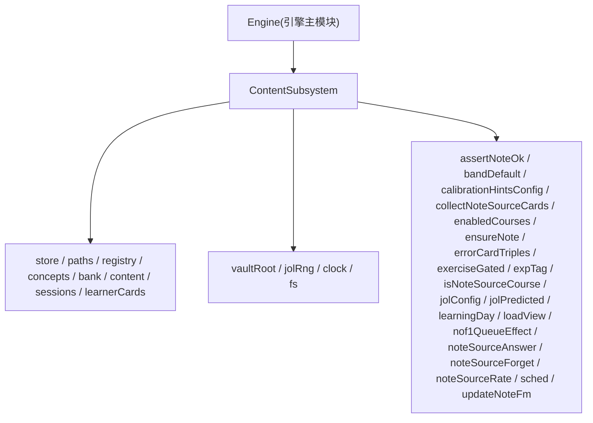
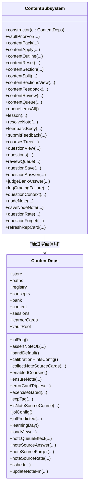
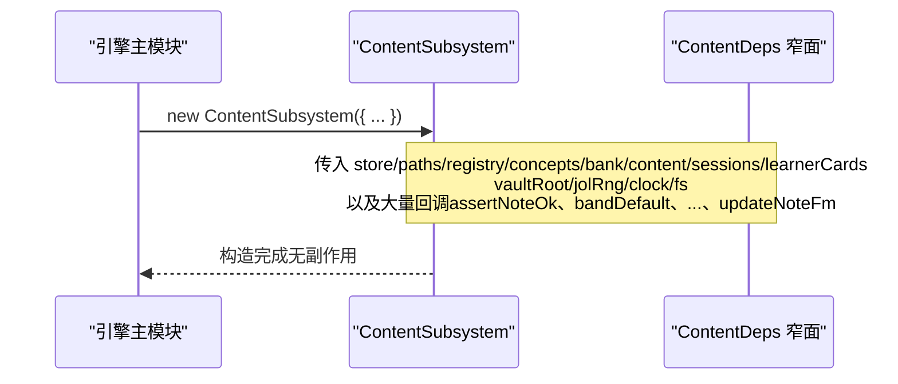
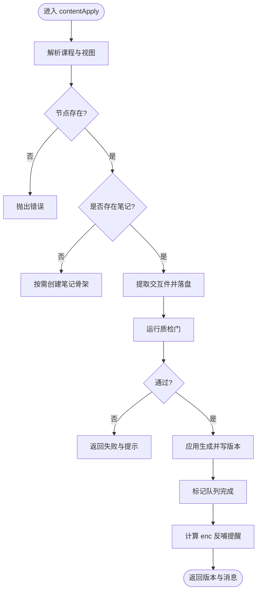
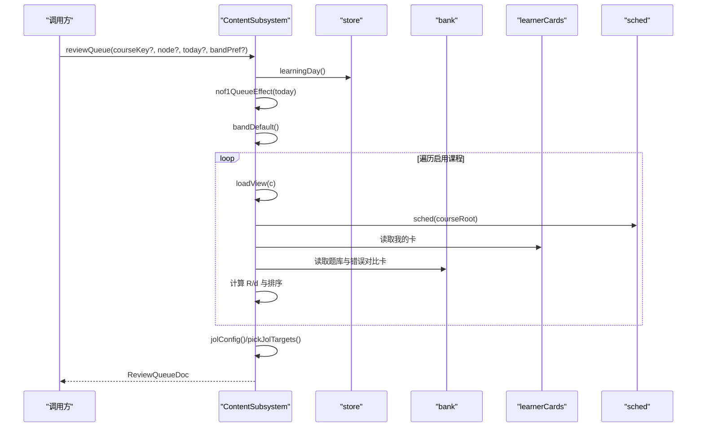
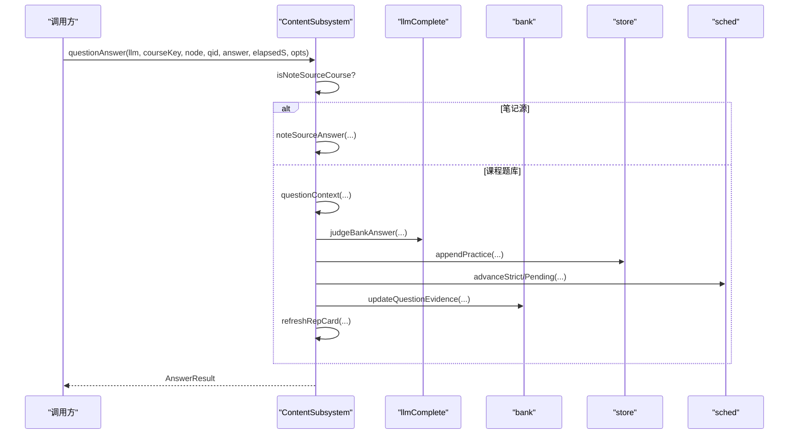
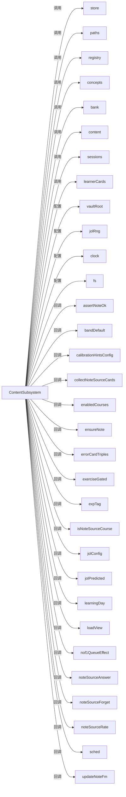

# Content子系统初始化

<cite>
**本文引用的文件**
- [content-subsystem.ts](file://src/engine/content-subsystem.ts)
- [index.ts](file://src/engine/index.ts)
</cite>

## 目录
1. [简介](#简介)
2. [项目结构](#项目结构)
3. [核心组件](#核心组件)
4. [架构总览](#架构总览)
5. [详细组件分析](#详细组件分析)
6. [依赖关系分析](#依赖关系分析)
7. [性能考量](#性能考量)
8. [故障排查指南](#故障排查指南)
9. [结论](#结论)

## 简介
本文件聚焦于 ContentSubsystem 的初始化与依赖注入，系统性说明其构造函数接收的业务依赖、配置参数与大量回调函数注入方式，并解释其在内容管线与内容生成中的核心作用。ContentSubsystem 是“内容域”的装配中心：它不直接持有领域对象，而是通过窄面接口（ContentDeps）访问 store、paths、registry、concepts、bank、content、sessions、learnerCards 等能力，以及 vaultRoot、jolRng、clock、fs 等运行时配置；同时通过回调桥接 assertNoteOk、bandDefault、calibrationHintsConfig、collectNoteSourceCards、enabledCourses、ensureNote、errorCardTriples、exerciseGated、expTag、isNoteSourceCourse、jolConfig、jolPredicted、learningDay、loadView、nof1QueueEffect、noteSourceAnswer/Forget/Rate、sched、updateNoteFm 等跨域能力。

## 项目结构
- 入口装配位于引擎主模块，负责将宿主提供的服务与配置组装为 ContentDeps 并实例化 ContentSubsystem。
- ContentSubsystem 自身仅暴露面向内容管线与学习交互的公共方法，内部通过 this.e 调用依赖，避免反向耦合。

**图表来源**
- [index.ts:344-368](file://src/engine/index.ts#L344-L368)
- [content-subsystem.ts:40-78](file://src/engine/content-subsystem.ts#L40-L78)

**章节来源**
- [index.ts:344-368](file://src/engine/index.ts#L344-L368)
- [content-subsystem.ts:40-78](file://src/engine/content-subsystem.ts#L40-L78)

## 核心组件
- ContentSubsystem：内容子系统的实现类，封装内容管线、笔记 resolve/反馈区、课程工作区与题库树等能力。
- ContentDeps：ContentSubsystem 的依赖契约，定义所有注入项的类型与职责边界。

关键要点
- 构造器只保存依赖对象，不执行副作用。
- 所有跨子系统调用均通过 this.e 的窄面方法完成，保持内容域可被门面自由引用且无循环依赖。

**章节来源**
- [content-subsystem.ts:101-102](file://src/engine/content-subsystem.ts#L101-L102)
- [content-subsystem.ts:40-78](file://src/engine/content-subsystem.ts#L40-L78)

## 架构总览
ContentSubsystem 在初始化时由引擎主模块集中装配依赖，形成“窄面 + 回调”的解耦模式：
- 业务依赖：store、paths、registry、concepts、bank、content、sessions、learnerCards
- 配置依赖：vaultRoot、jolRng、clock、fs
- 回调依赖：断言、实验、校准、队列、调度、笔记源、JOL、视图加载等

**图表来源**
- [content-subsystem.ts:40-78](file://src/engine/content-subsystem.ts#L40-L78)
- [content-subsystem.ts:101-1062](file://src/engine/content-subsystem.ts#L101-L1062)

## 详细组件分析

### 依赖注入清单与语义
- 存储与路径
  - store：持久化日志、练习记录、复习记录等
  - paths：课程/笔记/题库/状态等路径计算
  - fs：文件系统抽象（VaultFs），用于读写 vault 与状态
  - vaultRoot：仓库根路径，用于定位笔记与资源
- 注册与概念
  - registry：课程注册表解析与查询
  - concepts：概念登记表，支持检索词扩展（别名/易混概念）
- 内容与会话
  - content：内容上下文包、质检门、节管理、队列等
  - sessions：学习会话、笔记路径、课程视图等
  - learnerCards：学习者卡片（我的卡）读取与调度
- 题库与图
  - bank：题库加载、更新、错误对比卡等
  - graph：通过 loadView 获取图与状态
- 配置与随机
  - clock：时间戳与学习日计算
  - jolRng：JOL 抽查随机源（可注入播种）
- 回调（跨域窄面）
  - assertNoteOk：Broken 笔记前置校验
  - bandDefault：A1 默认难度带
  - calibrationHintsConfig：校准提示开关
  - collectNoteSourceCards：笔记源卡池收集
  - enabledCourses：启用课程列表
  - ensureNote：按需创建笔记骨架
  - errorCardTriples：错误对比卡三元组
  - exerciseGated：练习门控（实验节点）
  - expTag：N-of-1 实验臂标注
  - isNoteSourceCourse：是否笔记源伪课程
  - jolConfig / jolPredicted：JOL 配置与预测归一
  - learningDay：当前学习日与截止时刻
  - loadView：课程视图（图+状态+broken）
  - nof1QueueEffect：当日 N-of-1 队列效果
  - noteSourceAnswer/Forget/Rate：笔记源作答/忘记/自评
  - sched：FSRS 调度器（按课程或全局）
  - updateNoteFm：更新笔记 frontmatter

这些依赖在引擎主模块中集中装配，并以闭包形式注入到 ContentSubsystem。

**章节来源**
- [content-subsystem.ts:40-78](file://src/engine/content-subsystem.ts#L40-L78)
- [index.ts:344-368](file://src/engine/index.ts#L344-L368)

### 初始化流程（装配与构造）

**图表来源**
- [index.ts:344-368](file://src/engine/index.ts#L344-L368)
- [content-subsystem.ts:101-102](file://src/engine/content-subsystem.ts#L101-L102)

**章节来源**
- [index.ts:344-368](file://src/engine/index.ts#L344-L368)
- [content-subsystem.ts:101-102](file://src/engine/content-subsystem.ts#L101-L102)

### 内容管线与生成入口
- 上下文包构建：contentPack 组合课程上下文与先验注入段，并在终点节点处拒绝生成。
- 正文落盘：contentApply 进行交互件拆分、质检门、应用生成、队列完成与反哺提醒。
- 大纲与拆节：contentOutline 与 contentSplit 分别处理节清单与溢出节的拆分。
- 重置：contentReset 备份与回滚至未生成骨架，保留沉淀层模型状态。

**图表来源**
- [content-subsystem.ts:196-228](file://src/engine/content-subsystem.ts#L196-L228)

**章节来源**
- [content-subsystem.ts:196-228](file://src/engine/content-subsystem.ts#L196-L228)

### 复习队列与 JOL 抽查
- reviewQueue 聚合题库题、我的卡、错误对比卡与笔记源卡，统一按遗忘风险 R 排序，并在单节点会话模式下以 Mastery 先验带组织开场顺序。
- JOL 抽查根据配置与偏差历史选择目标卡，UI 仅在选中卡上弹出预测问答。

**图表来源**
- [content-subsystem.ts:538-717](file://src/engine/content-subsystem.ts#L538-L717)

**章节来源**
- [content-subsystem.ts:538-717](file://src/engine/content-subsystem.ts#L538-L717)

### 作答流与评测
- questionAnswer：自动判卷（规则/AI）、XP 结算、FSRS 推进、代表卡回刷、证据门控与阶段变更。
- judgeBankAnswer：开放题/反思题走 AI 判卷，失败重试并留痕；规则题走 evaluateAllo。
- questionRate/questionForget：复习自评与忘记申报，严格守门同日重复与挂起态。

**图表来源**
- [content-subsystem.ts:734-849](file://src/engine/content-subsystem.ts#L734-L849)
- [content-subsystem.ts:858-888](file://src/engine/content-subsystem.ts#L858-L888)
- [content-subsystem.ts:938-971](file://src/engine/content-subsystem.ts#L938-L971)
- [content-subsystem.ts:978-1036](file://src/engine/content-subsystem.ts#L978-L1036)

**章节来源**
- [content-subsystem.ts:734-849](file://src/engine/content-subsystem.ts#L734-L849)
- [content-subsystem.ts:858-888](file://src/engine/content-subsystem.ts#L858-L888)
- [content-subsystem.ts:938-971](file://src/engine/content-subsystem.ts#L938-L971)
- [content-subsystem.ts:978-1036](file://src/engine/content-subsystem.ts#L978-L1036)

### 回调函数的注入与调用场景
- assertNoteOk：在几乎所有读/写操作前校验 Broken 笔记，fail loud。
- bandDefault：决定 A1 会话默认难度带，受 N-of-1 实验影响。
- calibrationHintsConfig：控制自我校准提示是否开启。
- collectNoteSourceCards：合并笔记源卡到复习队列，携带漂移/挂起信息。
- enabledCourses：提供启用课程集合，驱动多课程扫描。
- ensureNote：按需创建笔记骨架，保证 frontmatter 可用。
- errorCardTriples：生成错误对比卡三元组并入队。
- exerciseGated：实验节点的门控，决定是否回流证据。
- expTag：为复习/作答记录添加实验臂标注。
- isNoteSourceCourse：路由到笔记源作答/忘记/自评通道。
- jolConfig/jolPredicted：JOL 抽样配置与预测值归一化。
- learningDay：统一今日日期与截止时刻。
- loadView：加载课程图与状态，供各方法使用。
- nof1QueueEffect：当日 N-of-1 队列呈现效果。
- noteSourceAnswer/Forget/Rate：笔记源镜像题库的作答/忘记/自评。
- sched：按课程或全局获取 FSRS 调度器。
- updateNoteFm：更新笔记 frontmatter（反馈/复习等）。

这些回调在引擎主模块中以闭包形式绑定到具体实现，确保 ContentSubsystem 对宿主细节零感知。

**章节来源**
- [content-subsystem.ts:40-78](file://src/engine/content-subsystem.ts#L40-L78)
- [index.ts:344-368](file://src/engine/index.ts#L344-L368)

## 依赖关系分析
- 内聚性：ContentSubsystem 围绕“内容管线 + 学习交互”高内聚，所有跨域能力通过窄面回调隔离。
- 耦合度：与 store、paths、registry、bank、content、sessions、learnerCards 等模块松耦合，依赖方向单向指向 ContentDeps。
- 外部依赖：fs、clock、vaultRoot 等运行时配置通过注入获得，便于测试与替换。
- 循环依赖：通过窄面与回调避免反向依赖，ContentSubsystem 可被门面自由 import。

**图表来源**
- [content-subsystem.ts:40-78](file://src/engine/content-subsystem.ts#L40-L78)
- [index.ts:344-368](file://src/engine/index.ts#L344-L368)

**章节来源**
- [content-subsystem.ts:40-78](file://src/engine/content-subsystem.ts#L40-L78)
- [index.ts:344-368](file://src/engine/index.ts#L344-L368)

## 性能考量
- 视图加载：loadView 每次现读图与状态，适合小体积数据；批量操作应复用结果。
- 排序与抽样：reviewQueue 的 R 分档排序与 JOL 抽样在大规模题库下需关注内存与 CPU；建议分页与缓存策略。
- FSRS 推进：每题每天至多推进一次，避免重复计算；代表卡回刷仅在必要时重写。
- 文件 I/O：atomicWrite 与 fs 操作集中在关键路径，注意并发与错误恢复。

[本节为通用指导，不直接分析具体文件]

## 故障排查指南
- Broken 笔记：任何操作前都会通过 assertNoteOk 检查，若失败会抛出包含路径与原因的异常，优先修复笔记。
- 判卷失败：AI 判卷失败会重试一次，仍失败则记录原始输出到 gradingFailurePath，便于定位问题。
- 同日重复：作答/忘记/自评均遵循同日唯一推进原则，出现重复会拒绝或挂起自评。
- 节点不存在：多处方法在 loadView 后校验节点是否在图内，缺失将抛错。

**章节来源**
- [content-subsystem.ts:196-228](file://src/engine/content-subsystem.ts#L196-L228)
- [content-subsystem.ts:858-903](file://src/engine/content-subsystem.ts#L858-L903)
- [content-subsystem.ts:938-971](file://src/engine/content-subsystem.ts#L938-L971)
- [content-subsystem.ts:978-1036](file://src/engine/content-subsystem.ts#L978-L1036)

## 结论
ContentSubsystem 通过窄面依赖注入实现了内容管线与学习交互的强内聚与低耦合。其构造函数接收丰富的业务依赖与配置参数，并通过大量回调桥接跨域能力，使内容生成、复习队列、作答评测等核心流程得以稳定运行。初始化过程简洁明确，后续扩展可通过新增回调或扩展窄面接口完成，保持系统演进的可维护性与可测试性。