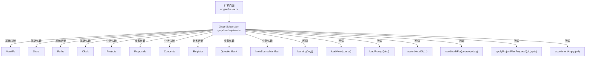
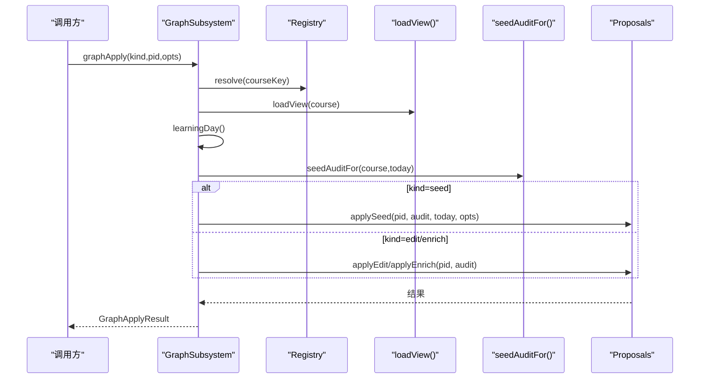
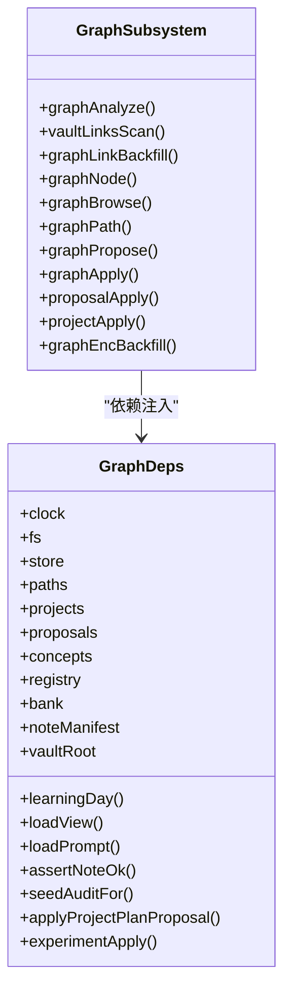

# Graph子系统初始化

<cite>
**本文引用的文件**
- [graph-subsystem.ts](file://src/engine/graph-subsystem.ts)
- [index.ts](file://src/engine/index.ts)
- [graph.ts](file://src/engine/graph.ts)
- [audit.ts](file://src/engine/audit.ts)
- [nof1.ts](file://src/engine/nof1.ts)
</cite>

## 目录
1. [简介](#简介)
2. [项目结构](#项目结构)
3. [核心组件](#核心组件)
4. [架构总览](#架构总览)
5. [详细组件分析](#详细组件分析)
6. [依赖关系分析](#依赖关系分析)
7. [性能与健壮性](#性能与健壮性)
8. [故障排查指南](#故障排查指南)
9. [结论](#结论)

## 简介
本文件聚焦 GraphSubsystem 的初始化与职责边界，系统性说明其构造函数接收的依赖注入参数（基础依赖与业务依赖）、vaultRoot 配置的作用、关键回调函数的注入方式，以及 seedAuditFor、applyProjectPlanProposal、experimentApply 等高级功能的依赖注入路径。同时给出 GraphSubsystem 在知识图谱管理与图结构操作中的核心职责说明。

## 项目结构
GraphSubsystem 位于 engine 层，作为“图域”的门面聚合类，仅被引擎门面（engine index）构造并持有；它通过依赖注入获得对文件系统、存储、路径、课程注册表、提案系统、概念登记、题库、笔记源清单等的访问能力，并通过回调函数桥接引擎的其他子系统（学习日、视图加载、提示词加载、节点健康断言、种子审计、项目计划应用、实验应用）。

图表来源
- [graph-subsystem.ts:78-79](file://src/engine/graph-subsystem.ts#L78-L79)
- [index.ts:331-343](file://src/engine/index.ts#L331-L343)

章节来源
- [graph-subsystem.ts:78-79](file://src/engine/graph-subsystem.ts#L78-L79)
- [index.ts:331-343](file://src/engine/index.ts#L331-L343)

## 核心组件
- GraphSubsystem：图域门面，封装图分析、链接先验扫描与回填、节点浏览、路径查询、提案受理（edit/seed/enrich）、统一 apply 路由（含项目与实验），以及 enc 覆盖层回填等。
- 依赖接口 GraphDeps：定义所有注入依赖与回调，确保 GraphSubsystem 不直接耦合具体实现，便于测试与替换。
- 底层图模型 Graph：负责从 data/*.yaml 解析区域/块/节点，构建邻接表、拓扑序、深度、可达集、传递约简边、连通分量等。

章节来源
- [graph-subsystem.ts:78-79](file://src/engine/graph-subsystem.ts#L78-L79)
- [graph.ts:278-443](file://src/engine/graph.ts#L278-L443)

## 架构总览
GraphSubsystem 以“门面 + 依赖注入”的方式组织：
- 基础依赖提供运行时基础设施（时钟、文件系统、持久化、路径）。
- 业务依赖提供领域能力（项目、提案、概念、注册表、题库、笔记源清单）。
- 回调函数将 GraphSubsystem 与引擎其他子系统解耦（学习日、视图加载、提示词、节点健康校验、种子审计、项目计划应用、实验应用）。

图表来源
- [graph-subsystem.ts:415-429](file://src/engine/graph-subsystem.ts#L415-L429)
- [index.ts:331-343](file://src/engine/index.ts#L331-L343)

章节来源
- [graph-subsystem.ts:415-429](file://src/engine/graph-subsystem.ts#L415-L429)
- [index.ts:331-343](file://src/engine/index.ts#L331-L343)

## 详细组件分析

### 构造函数与依赖注入（GraphDeps）
- 基础依赖
  - clock：用于获取当前时间戳（如 vault 链接扫描的时间标记）。
  - fs：Vault 文件系统抽象，用于读写 Vault 与 state 区文件。
  - store：持久化存储，用于读取/写入待处理提案、日志等。
  - paths：路径工具，提供课程目录、state 目录、锚点文件等路径计算。
- 业务依赖
  - projects：项目域能力（里程碑应用等）。
  - proposals：提案系统（edit/seed/enrich 的提议与受理）。
  - concepts：概念登记（别名、合并、扩展检索词）。
  - registry：课程注册表（解析课程键、获取课程元信息）。
  - bank：题库（题目加载、invokes 投影等）。
  - noteManifest：笔记源清单（用于先验检索时的标题集合）。
- 配置参数
  - vaultRoot：Vault 根目录字符串，用于定位中心目录、排除列表、链接扫描范围等。
- 回调函数（由引擎门面注入）
  - learningDay：返回今日日期与截止时刻，保证“今日”口径一致。
  - loadView：按课程加载图与状态（graph + state + broken notes）。
  - loadPrompt：按 kind 加载提示词模板（如“种子提案”）。
  - assertNoteOk：在节点写操作前检查目标笔记是否 Broken，失败则抛错。
  - seedAuditFor：为指定课程生成种子审计结果（ok/warns/health），供 apply 门禁使用。
  - applyProjectPlanProposal：项目计划提案的统一应用入口（含修订快照 diff、换线/补支触发）。
  - experimentApply：N-of-1 实验提案的应用入口（确认并启动实验）。

章节来源
- [graph-subsystem.ts:30-51](file://src/engine/graph-subsystem.ts#L30-L51)
- [index.ts:331-343](file://src/engine/index.ts#L331-L343)

### vaultRoot 的作用
- 作为 Vault 根路径，参与以下流程：
  - 链接先验扫描时确定扫描范围与中心相对路径。
  - 计算 centerRelOf(vaultRoot)，用于先验检索与排除清单。
  - 与 paths.centerRoot 配合，限定链接扫描与缓存落盘位置。
- 该参数是只读配置，贯穿图探索、链接先验、enc 回填等需要访问 Vault 文件的场景。

章节来源
- [graph-subsystem.ts:169-179](file://src/engine/graph-subsystem.ts#L169-L179)
- [graph-subsystem.ts:470-476](file://src/engine/graph-subsystem.ts#L470-L476)

### 关键回调注入与使用
- learningDay
  - 注入方式：engine/index.ts 中传入箭头函数，内部调用引擎的学习日计算逻辑。
  - 使用场景：图分析、提案受理（today 用于审计与健康分计算）。
- loadView
  - 注入方式：engine/index.ts 中传入箭头函数，内部加载 data/*.yaml 与 state 映射。
  - 使用场景：几乎所有图相关方法都需要先加载课程视图。
- loadPrompt
  - 注入方式：engine/index.ts 中委托给 content2.loadPrompt。
  - 使用场景：种子起草时组装提示词材料包。
- assertNoteOk
  - 注入方式：engine/index.ts 中委托给引擎的 assertNoteOk。
  - 使用场景：节点详情、浏览、内容操作前进行 Broken 检查。
- seedAuditFor
  - 注入方式：engine/index.ts 中私有方法，内部调用 runAudit 并计算健康分。
  - 使用场景：graphApply(kind=seed) 前的审计门禁。
- applyProjectPlanProposal
  - 注入方式：engine/index.ts 中委托给 project.applyProjectPlanProposal。
  - 使用场景：proposalApply(kind=project_plan) 的统一入口。
- experimentApply
  - 注入方式：engine/index.ts 中委托给 lab.experimentApply。
  - 使用场景：proposalApply(kind=experiment) 的统一入口。

章节来源
- [index.ts:331-343](file://src/engine/index.ts#L331-L343)
- [graph-subsystem.ts:415-429](file://src/engine/graph-subsystem.ts#L415-L429)
- [graph-subsystem.ts:628-636](file://src/engine/graph-subsystem.ts#L628-L636)

### 高级功能依赖注入

#### seedAuditFor（种子审计）
- 作用：在 apply(seed) 前对课程图运行结构性审计，输出 ok/warns/health，并在存在 ERROR 时拒绝写入。
- 依赖注入：由 GraphSubsystem 通过 e.seedAuditFor 调用，实际实现位于 engine/index.ts。
- 关键点：
  - 基于 runAudit 执行 E/R 级检查。
  - 健康分计算剔除终点节点（多终点支持）。
  - 种子阶段豁免部分形状告警，避免误报。

章节来源
- [graph-subsystem.ts:424-428](file://src/engine/graph-subsystem.ts#L424-L428)
- [index.ts:636-647](file://src/engine/index.ts#L636-L647)
- [audit.ts:35-64](file://src/engine/audit.ts#L35-L64)

#### applyProjectPlanProposal（项目计划应用）
- 作用：统一应用项目计划提案，包含修订快照 diff、换线/补支触发等。
- 依赖注入：GraphSubsystem 通过 e.applyProjectPlanProposal 调用，实际实现位于 engine/index.ts 的项目子系统。
- 关键点：
  - proposalApply(kind=project_plan) 路由到该项目应用。
  - 与项目域提案生命周期集成（pending → applied/rejected）。

章节来源
- [graph-subsystem.ts:628-636](file://src/engine/graph-subsystem.ts#L628-L636)
- [index.ts:331-343](file://src/engine/index.ts#L331-L343)

#### experimentApply（实验应用）
- 作用：确认并启动 N-of-1 实验提案，重新验证产物、构建分配、写入实验定义、报告今日臂。
- 依赖注入：GraphSubsystem 通过 e.experimentApply 调用，实际实现位于 nof1.ts。
- 关键点：
  - 同一时间只能运行一个实验（并发保护）。
  - 产物必须匹配白名单模板，否则 fail loud。
  - 通过 proposalApply(kind=experiment) 统一入口。

章节来源
- [graph-subsystem.ts:628-636](file://src/engine/graph-subsystem.ts#L628-L636)
- [nof1.ts:572-592](file://src/engine/nof1.ts#L572-L592)

### 图分析与链接先验
- graphAnalyze：加载课程视图，读取链接先验缓存，结合锚点与终点信息，产出图文档（节点/边/端点步骤/交汇节点服务信息）。
- vaultLinksScan：全库 wikilink 扫描，过滤与评分，输出候选边与层级（proposal/review/report），并持久化到 state/vault链接.json。
- graphLinkBackfill：将高置信度链接映射到课程图，定向成 set_enc 提案（走人审），无 pre 关系的降级为 blocked_no_pre。

章节来源
- [graph-subsystem.ts:88-117](file://src/engine/graph-subsystem.ts#L88-L117)
- [graph-subsystem.ts:158-195](file://src/engine/graph-subsystem.ts#L158-L195)
- [graph-subsystem.ts:202-265](file://src/engine/graph-subsystem.ts#L202-L265)

### 节点浏览与路径查询
- graphNode：返回节点详情（schema 字段、邻域、enc、前置闭包、阶段、掌握度、内容状态）。
- graphBrowse：按区/块过滤浏览节点清单，附带 broken_notes。
- graphPath：判断 from 是否为 to 的前置，并返回链路与深度跨度。

章节来源
- [graph-subsystem.ts:268-311](file://src/engine/graph-subsystem.ts#L268-L311)
- [graph-subsystem.ts:315-372](file://src/engine/graph-subsystem.ts#L315-L372)
- [graph-subsystem.ts:376-404](file://src/engine/graph-subsystem.ts#L376-L404)

### 提案受理与统一入口
- graphPropose：受理 edit/seed/enrich 三类提案。
- graphApply：受理前执行 seedAuditFor 门禁，再分发到 proposals.applySeed/applyEdit/applyEnrich。
- proposalApply：统一入口，根据 kind 路由到图谱/项目/实验应用。
- projectApply：项目域工具入口，自证 kind 后路由到项目应用或图谱应用。

章节来源
- [graph-subsystem.ts:406-429](file://src/engine/graph-subsystem.ts#L406-L429)
- [graph-subsystem.ts:628-647](file://src/engine/graph-subsystem.ts#L628-L647)

### enc 覆盖层回填
- graphEncBackfill：对 Ready 内容且反哺候选或 invokes 投影有未落 enc 边的非 practice 节点，批量生成 pending enrich 提案；可重入，已声明边原样保留；过审后由 graphApply(kind=enrich) 生效。

章节来源
- [graph-subsystem.ts:568-616](file://src/engine/graph-subsystem.ts#L568-L616)

## 依赖关系分析
- 低耦合设计：GraphSubsystem 不直接依赖具体子系统实现，而是通过 GraphDeps 接口与回调函数解耦。
- 单向依赖：GraphSubsystem 依赖 engine 的其他子系统（projects/proposals/concepts/registry/bank/noteManifest），但不会被它们反向依赖。
- 外部资源：通过 fs/paths/clock/store 访问文件系统与持久化层，通过 registry 解析课程键。

图表来源
- [graph-subsystem.ts:30-51](file://src/engine/graph-subsystem.ts#L30-L51)
- [graph-subsystem.ts:78-79](file://src/engine/graph-subsystem.ts#L78-L79)

章节来源
- [graph-subsystem.ts:30-51](file://src/engine/graph-subsystem.ts#L30-L51)
- [graph-subsystem.ts:78-79](file://src/engine/graph-subsystem.ts#L78-L79)

## 性能与健壮性
- 链接先验缓存：vaultLinksScan 产物持久化，graphAnalyze 与 backfill 复用缓存，减少重复扫描。
- 拓扑与可达集：Graph 构造时计算拓扑序、深度、可达集与传递约简边，提升后续查询效率。
- 审计门禁：apply(seed) 前执行 runAudit，防止错误图写入；健康分阈值辅助质量把控。
- 并发保护：experimentApply 在同一时间仅允许一个实验运行，避免冲突。
- 可重入性：link-backfill 与 enc-backfill 均具备幂等特性，已声明边不重复提名。

章节来源
- [graph-subsystem.ts:120-152](file://src/engine/graph-subsystem.ts#L120-L152)
- [graph.ts:355-397](file://src/engine/graph.ts#L355-L397)
- [audit.ts:35-64](file://src/engine/audit.ts#L35-L64)
- [nof1.ts:572-592](file://src/engine/nof1.ts#L572-L592)

## 故障排查指南
- 链接先验缺失：graphLinkBackfill 要求先运行 vaultLinksScan，否则会抛出明确错误。
- 节点 Broken：任何节点写操作前会调用 assertNoteOk，若目标笔记 Broken 则携带位置与原因抛错。
- 非法 kind：proposalApply 与 graphApply 对未知 kind 报错，避免静默归一。
- 实验冲突：experimentApply 检测到已有实验在跑时会拒绝新实验。
- 种子审计失败：apply(seed) 前若审计存在 ERROR，将拒绝写入并返回 warns/health。

章节来源
- [graph-subsystem.ts:212-216](file://src/engine/graph-subsystem.ts#L212-L216)
- [graph-subsystem.ts:268-273](file://src/engine/graph-subsystem.ts#L268-L273)
- [graph-subsystem.ts:628-636](file://src/engine/graph-subsystem.ts#L628-L636)
- [nof1.ts:572-592](file://src/engine/nof1.ts#L572-L592)
- [graph-subsystem.ts:424-428](file://src/engine/graph-subsystem.ts#L424-L428)

## 结论
GraphSubsystem 以依赖注入为核心，将图分析、链接先验、提案受理、enc 回填等能力聚合为统一的图域门面。通过基础依赖与业务依赖的清晰分层，以及回调函数对引擎其他子系统的解耦接入，GraphSubsystem 既保证了可扩展性与可测试性，又提供了稳健的图结构操作与质量控制机制。vaultRoot 作为关键配置，贯穿 Vault 文件访问与链接先验流程；seedAuditFor、applyProjectPlanProposal、experimentApply 等高级功能通过回调注入，实现了跨域能力的统一编排与治理。