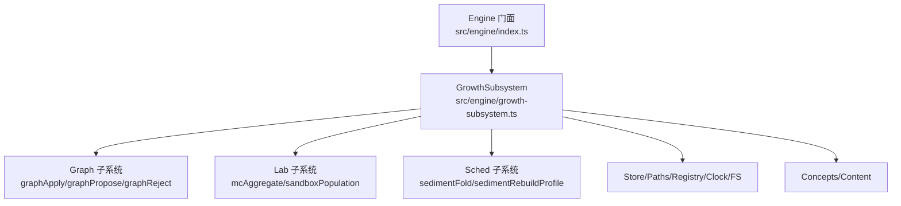
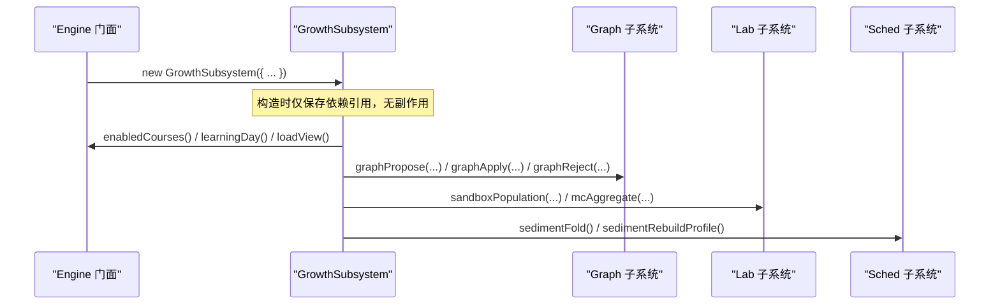
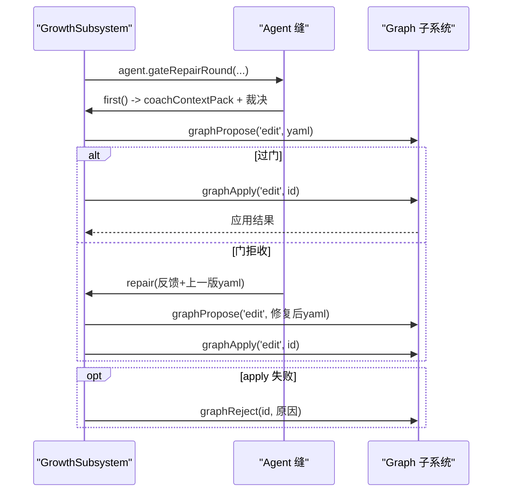
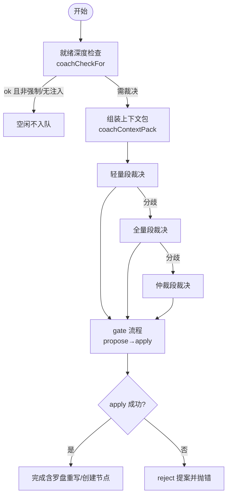
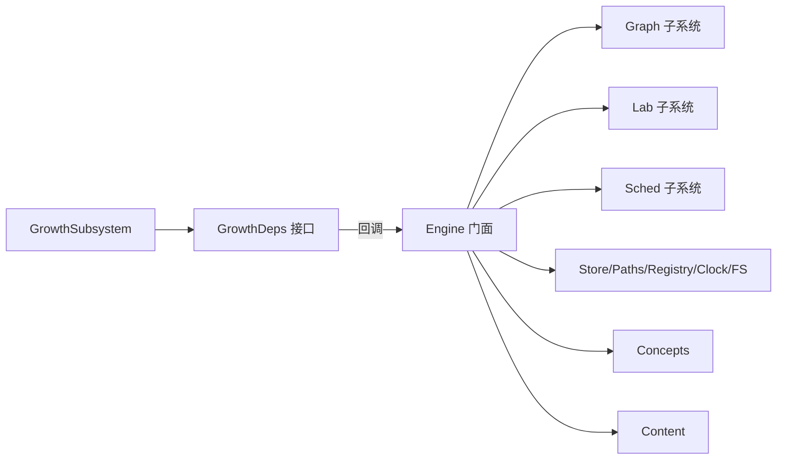

# Growth子系统初始化

<cite>
**本文引用的文件**
- [growth-subsystem.ts](file://src/engine/growth-subsystem.ts)
- [index.ts](file://src/engine/index.ts)
- [compass.ts](file://src/engine/compass.ts)
- [proposals.ts](file://src/engine/proposals.ts)
- [nof1.ts](file://src/engine/nof1.ts)
</cite>

## 目录
1. [简介](#简介)
2. [项目结构](#项目结构)
3. [核心组件](#核心组件)
4. [架构总览](#架构总览)
5. [详细组件分析](#详细组件分析)
6. [依赖关系分析](#依赖关系分析)
7. [性能考量](#性能考量)
8. [故障排查指南](#故障排查指南)
9. [结论](#结论)

## 简介
本文件聚焦 GrowthSubsystem 的初始化与依赖注入契约，系统说明其构造函数接收的基础依赖（clock、fs、store、paths、registry）与业务依赖（concepts、content），以及通过回调注入的关键能力：enabledCourses、learningDay、loadView、graphApply、graphPropose、graphReject。同时解释高级功能 mcAggregate、sandboxPopulation、scanCourseBanks、sedimentFold、sedimentRebuildProfile 的作用与注入方式。最后梳理 GrowthSubsystem 在“滚动教练”和“生长批处理”中的核心职责与边界。

## 项目结构
GrowthSubsystem 位于 engine 层，作为“滚动教练域”的核心实现，负责罗盘（路线与 ETA）、教练回合上下文组装、生长批受理与闸门、复诊结算等。它不直接耦合具体图/存储/调度实现，而是通过 GrowthDeps 接口以窄面注入依赖，从而保持跨子系统解耦。

图表来源
- [index.ts:382-397](file://src/engine/index.ts#L382-L397)
- [growth-subsystem.ts:37-59](file://src/engine/growth-subsystem.ts#L37-L59)

章节来源
- [growth-subsystem.ts:37-59](file://src/engine/growth-subsystem.ts#L37-L59)
- [index.ts:382-397](file://src/engine/index.ts#L382-L397)

## 核心组件
- GrowthSubsystem：滚动教练域主类，封装罗盘读写、ETA 计算、教练回合上下文包、生长批受理与闸门、复诊结算等。
- GrowthDeps：GrowthSubsystem 的依赖注入接口，定义所有基础与业务依赖及回调函数。

关键要点
- GrowthSubsystem 仅持有 GrowthDeps 实例 e，所有外部能力均通过 e 调用，避免硬耦合。
- 回调式注入使 GrowthSubsystem 可被不同宿主装配，且能复用 Engine 门面提供的统一实现。

章节来源
- [growth-subsystem.ts:37-59](file://src/engine/growth-subsystem.ts#L37-L59)
- [growth-subsystem.ts:91-92](file://src/engine/growth-subsystem.ts#L91-L92)

## 架构总览
下图展示 GrowthSubsystem 初始化时由 Engine 门面注入的依赖映射，以及运行时关键调用路径。

图表来源
- [index.ts:382-397](file://src/engine/index.ts#L382-L397)
- [growth-subsystem.ts:260-301](file://src/engine/growth-subsystem.ts#L260-L301)
- [growth-subsystem.ts:622-808](file://src/engine/growth-subsystem.ts#L622-L808)

章节来源
- [index.ts:382-397](file://src/engine/index.ts#L382-L397)
- [growth-subsystem.ts:260-301](file://src/engine/growth-subsystem.ts#L260-L301)
- [growth-subsystem.ts:622-808](file://src/engine/growth-subsystem.ts#L622-L808)

## 详细组件分析

### GrowthSubsystem 构造函数与依赖注入
- 构造函数签名：constructor(private e: GrowthDeps)
- 依赖分类
  - 基础依赖：clock、fs、store、paths、registry
    - clock：时间戳与学习日截止计算
    - fs：VaultFs 文件系统抽象
    - store：持久化（练习/复习日志、提案、账本等）
    - paths：课程/罗盘/锚点/提案制品等路径解析
    - registry：课程注册表（解析课程键、获取启用课程）
  - 业务依赖：concepts、content
    - concepts：概念登记表加载与 canonical 解析
    - content：提示词模板加载（如“教练回合”“罗盘初画”）
  - 回调注入（通过函数形式提供能力）
    - enabledCourses：返回启用课程列表
    - learningDay：返回今日与 cutoff
    - loadView：加载课程视图（图+状态+broken）
    - graphApply/graphPropose/graphReject：图变更的提议、应用与拒绝
    - mcAggregate：蒙特卡洛聚合（沙盘曲线/分位带）
    - sandboxPopulation：构建沙盘的卡片/节点/调度器
    - scanCourseBanks：扫描课程题库并回调处理
    - sedimentFold/sedimentRebuildProfile：沉淀折叠与重建画像

章节来源
- [growth-subsystem.ts:37-59](file://src/engine/growth-subsystem.ts#L37-L59)
- [growth-subsystem.ts:91-92](file://src/engine/growth-subsystem.ts#L91-L92)
- [index.ts:382-397](file://src/engine/index.ts#L382-L397)

### 图操作回调：graphPropose、graphApply、graphReject
- graphPropose(kind, yamlText)
  - 作用：将 YAML 形式的图变更提议落盘为 pending 提案，供后续审计与应用。
  - 使用场景：教练回合裁决产物经 parseGrowthVerdict 后，进入 gate 流程调用 propose。
- graphApply(kind, pid)
  - 作用：对已提议的提案执行 apply，完成图变更、快照与 journal 记录。
  - 使用场景：生长批受理后，若 propose 成功则调用 apply；失败会清理并抛错。
- graphReject(pid, note?)
  - 作用：拒绝某提案并记录原因，常用于 apply 失败后的自清。
  - 使用场景：apply 抛出异常时，尝试 reject 该提案以避免遗留 pending。

图表来源
- [growth-subsystem.ts:622-808](file://src/engine/growth-subsystem.ts#L622-L808)
- [proposals.ts:1-200](file://src/engine/proposals.ts#L1-L200)

章节来源
- [growth-subsystem.ts:622-808](file://src/engine/growth-subsystem.ts#L622-L808)
- [proposals.ts:1-200](file://src/engine/proposals.ts#L1-L200)

### 高级功能依赖注入
- mcAggregate(plan, cards, nodes, today, scheds, fallbackCourse)
  - 作用：基于沙盘卡片/节点与 FSRS 调度器，按周数计划进行蒙特卡洛推演，输出曲线与各节点 p50/p80 分位带。
  - 使用场景：罗盘 ETA 折叠（每周挂载 ETA）、仲裁段双沙盘对比。
- sandboxPopulation(courses, nodeFilter)
  - 作用：为给定课程集合构建沙盘的卡片、节点与调度器映射。
  - 使用场景：ETA 折叠与仲裁段前准备数据。
- scanCourseBanks(course, fn)
  - 作用：遍历课程的题库，逐题回调处理（如解析 invokes→概念）。
  - 使用场景：行为摘要中题目到概念的映射聚合。
- sedimentFold()
  - 作用：读取沉淀数据并折叠为教练可读的结构。
  - 使用场景：教练回合上下文的“沉淀折叠”区块。
- sedimentRebuildProfile()
  - 作用：在复诊结算后重建沉淀画像。
  - 使用场景：settleRechecks 成功后触发。

章节来源
- [growth-subsystem.ts:308-340](file://src/engine/growth-subsystem.ts#L308-L340)
- [growth-subsystem.ts:695-716](file://src/engine/growth-subsystem.ts#L695-L716)
- [growth-subsystem.ts:380-391](file://src/engine/growth-subsystem.ts#L380-L391)
- [growth-subsystem.ts:417-542](file://src/engine/growth-subsystem.ts#L417-L542)
- [growth-subsystem.ts:1034](file://src/engine/growth-subsystem.ts#L1034)
- [nof1.ts:847-932](file://src/engine/nof1.ts#L847-L932)

### 滚动教练与生长批处理的核心职责
- 滚动教练
  - 读侧感知：coachCheckpoint 对各启用课程做就绪深度检查（零写副作用、零 LLM 调用）。
  - 上下文组装：coachContextPack 产出六区块（轻量/全量）用于教练回合模板消费。
  - 工具面：coachToolsetFor 暴露只读工具（图视图/节点卡/概念登记表/题库概况/罗盘/终点锚）。
- 生长批处理
  - 三段式裁决：轻量段→全量段→仲裁段（分歧升级），最终经 gate 流程 propose→apply。
  - 闸门控制：growthGateErrors 对插入/旁支施加三率与复诊通过率限制。
  - 写入纪律：罗盘重写与图 apply 在同一写入单元内；提案被拒不落盘；journal 挂提案 id。
  - 回灌重裁：受理门拒收后，携带拒绝原因与图面回灌，deep 档重裁一次。

图表来源
- [growth-subsystem.ts:356-375](file://src/engine/growth-subsystem.ts#L356-L375)
- [growth-subsystem.ts:417-542](file://src/engine/growth-subsystem.ts#L417-L542)
- [growth-subsystem.ts:622-808](file://src/engine/growth-subsystem.ts#L622-L808)

章节来源
- [growth-subsystem.ts:356-375](file://src/engine/growth-subsystem.ts#L356-L375)
- [growth-subsystem.ts:417-542](file://src/engine/growth-subsystem.ts#L417-L542)
- [growth-subsystem.ts:622-808](file://src/engine/growth-subsystem.ts#L622-L808)

## 依赖关系分析
- 低耦合设计：GrowthSubsystem 仅依赖 GrowthDeps 接口，实际实现由 Engine 门面装配。
- 回调注入的优势：
  - enabledCourses/learningDay/loadView：统一从 Engine 门面取数，保证一致性。
  - graphApply/Propose/Reject：将图变更的生命周期交由 Graph 子系统管理，GrowthSubsystem 仅编排流程。
  - mcAggregate/sandboxPopulation：委托 Lab 子系统完成沙盘推演与数据准备。
  - sedimentFold/RebuildProfile：委托 Sched 子系统处理沉淀数据。
- 潜在循环依赖规避：GrowthSubsystem 不被领主 compass.ts 直接 import，避免环；跨子系统调用经窄面注入。

图表来源
- [growth-subsystem.ts:37-59](file://src/engine/growth-subsystem.ts#L37-L59)
- [index.ts:382-397](file://src/engine/index.ts#L382-L397)

章节来源
- [growth-subsystem.ts:37-59](file://src/engine/growth-subsystem.ts#L37-L59)
- [index.ts:382-397](file://src/engine/index.ts#L382-L397)

## 性能考量
- 周内 ETA 缓存：compassEtaRefresh 使用进程级 Map 缓存本周 ETA，避免重复蒙特卡洛。
- 单课失败隔离：ETA 刷新逐课 try/catch，单课失败不影响其他课程。
- 轻量/全量段：轻量段减少上下文体积，降低 token 成本；仅在必要时升级到全量/仲裁段。
- 只读工具回路：教练回合各段经只读工具，避免写侧开销与竞态。

[本节为通用性能建议，无需特定文件引用]

## 故障排查指南
- 零终点错误
  - 现象：compassPaint/compassRewrite/coachGrowthBatch 抛出“零终点”错误。
  - 原因：课程未声明任何终点锚，无法进行方向性裁决或路线绘制。
  - 处理：先添加终点锚，再重试。
- 路线门失败
  - 现象：初画/重写产物未过路线门（空内容、超长、包含非法标题）。
  - 处理：按约束精简路线正文，确保不含 `## ` 标题与超长文本。
- 受理门拒收与回灌重裁
  - 现象：growhGate 返回 errors，进入 repair 轮；仍失败则报两轮死因。
  - 处理：根据拒绝原因修正 YAML 结构/概念/锚保护/巩固门问题。
- apply 失败自清
  - 现象：apply 抛出异常，自动 reject 提案并抛错。
  - 处理：检查图变化竞态或审计 ERROR，修正后重新裁决。

章节来源
- [growth-subsystem.ts:163-221](file://src/engine/growth-subsystem.ts#L163-L221)
- [growth-subsystem.ts:227-244](file://src/engine/growth-subsystem.ts#L227-L244)
- [growth-subsystem.ts:622-808](file://src/engine/growth-subsystem.ts#L622-L808)
- [compass.ts:111-123](file://src/engine/compass.ts#L111-L123)

## 结论
GrowthSubsystem 通过 GrowthDeps 接口实现了高度解耦的依赖注入，将基础能力（时钟、存储、路径、注册表、文件系统）与业务能力（概念、内容）以及关键回调（课程启用、学习日、视图加载、图操作、沙盘推演、沉淀处理）集中注入，使其专注于滚动教练与生长批处理的编排逻辑。其核心职责包括：
- 滚动教练：就绪检查、上下文组装、只读工具面。
- 生长批处理：三段式裁决、闸门控制、回灌重裁、写入单元纪律。
- 高级功能：ETA 折叠、双沙盘仲裁、沉淀折叠与画像重建。

这种设计既保证了跨子系统的清晰边界，又提供了足够的扩展性与可测试性。