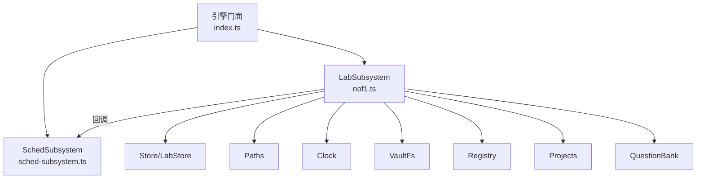
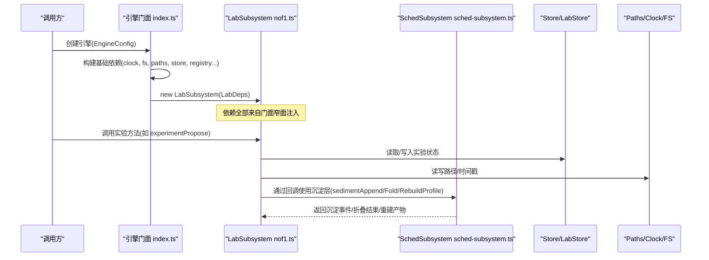
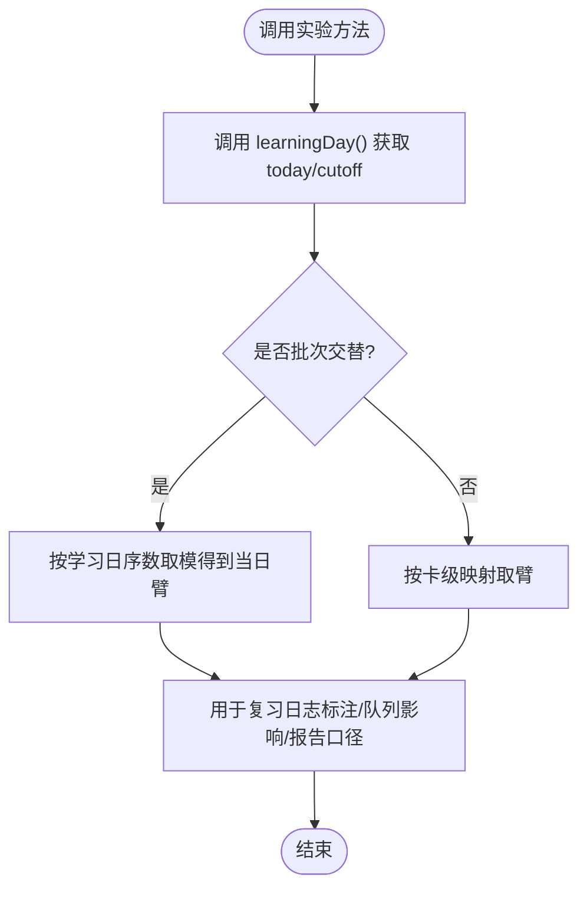
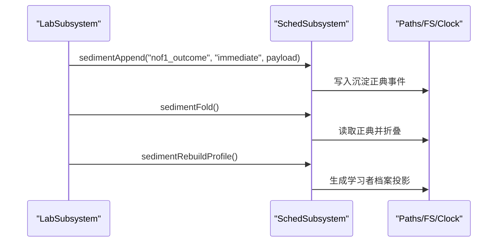
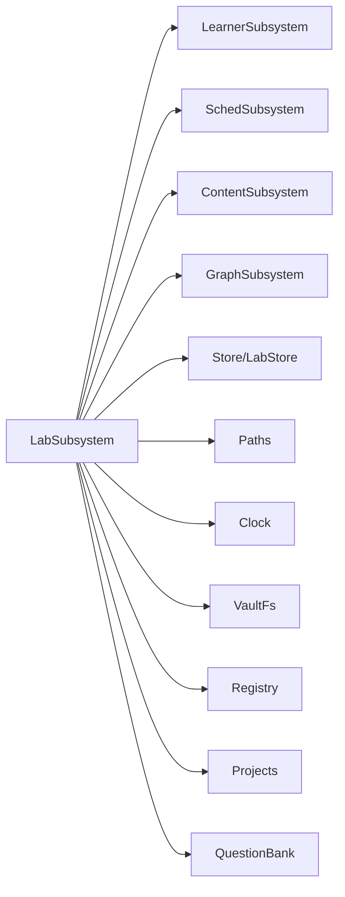

# Lab子系统初始化

<cite>
**本文引用的文件**
- [nof1.ts](file://src/engine/nof1.ts)
- [sched-subsystem.ts](file://src/engine/sched-subsystem.ts)
- [index.ts](file://src/engine/index.ts)
</cite>

## 目录
1. [简介](#简介)
2. [项目结构定位](#项目结构定位)
3. [核心组件与职责](#核心组件与职责)
4. [架构总览](#架构总览)
5. [LabSubsystem 初始化详解](#labsystem-初始化详解)
6. [依赖注入参数逐项说明](#依赖注入参数逐项说明)
7. [回调函数注入方式与调用时机](#回调函数注入方式与调用时机)
8. [沉淀层操作依赖关系](#沉淀层操作依赖关系)
9. [与其他子系统的交互图](#与其他子系统的交互图)
10. [性能与健壮性要点](#性能与健壮性要点)
11. [故障排查指南](#故障排查指南)
12. [结论](#结论)

## 简介
本文件聚焦于 LabSubsystem 的初始化与依赖装配，解释其构造函数接收的基础依赖（clock、fs、store、paths、registry）与业务依赖（projects、bank），以及调度/学习日/视图/课程扫描等回调的注入方式与调用时机；同时梳理沉淀层三件套（sedimentAppend、sedimentFold、sedimentRebuildProfile）在实验台流程中的依赖关系与作用。最后给出 LabSubsystem 与其他子系统的交互图，帮助理解其在“实验台”功能中的核心地位。

## 项目结构定位
- LabSubsystem 定义于引擎域的实验台模块，承载 N-of-1 实验、恒温器、沙盘、睡眠配置等能力。
- 门面（Engine）负责统一装配各子系统，并以窄面接口向 LabSubsystem 注入所需依赖与跨域回调。
- 沉淀层能力由 SchedSubsystem 提供，LabSubsystem 通过回调间接使用。

**图表来源**
- [index.ts:242-254](file://src/engine/index.ts#L242-L254)
- [nof1.ts:456-477](file://src/engine/nof1.ts#L456-L477)
- [sched-subsystem.ts:452-469](file://src/engine/sched-subsystem.ts#L452-L469)

**章节来源**
- [index.ts:242-254](file://src/engine/index.ts#L242-L254)
- [nof1.ts:456-477](file://src/engine/nof1.ts#L456-L477)

## 核心组件与职责
- LabSubsystem：实验台入口，封装实验模板、提案-确认-开停、复习队列臂标注、回执评审模式覆盖、默认难度带、恒温器视图等。
- SchedSubsystem：调度域，提供沉淀层写读（append/fold/rebuild）、记忆健康、FSRS 优化等。
- 门面（Engine）：统一装配所有子系统，构造并注入窄面依赖，暴露对外 API。

**章节来源**
- [nof1.ts:432-477](file://src/engine/nof1.ts#L432-L477)
- [sched-subsystem.ts:1-10](file://src/engine/sched-subsystem.ts#L1-L10)
- [index.ts:168-188](file://src/engine/index.ts#L168-L188)

## 架构总览
LabSubsystem 不直接持有文件系统或存储实现，而是通过窄面依赖（LabDeps）访问。门面在构造时完成依赖注入，确保运行时可替换、可测试，且避免循环依赖。

**图表来源**
- [index.ts:212-254](file://src/engine/index.ts#L212-L254)
- [nof1.ts:476-477](file://src/engine/nof1.ts#L476-L477)
- [sched-subsystem.ts:452-469](file://src/engine/sched-subsystem.ts#L452-L469)

## LabSubsystem 初始化详解
- 构造签名：constructor(private e: LabDeps) {}
- 依赖来源：由门面在构造期组装并传入，包含时钟、存储、路径、注册表、项目、题库、调度器获取、学习日计算、视图加载、启用课程列表、课程题库扫描、沉淀层三件套回调。
- 设计意图：以窄面注入屏蔽具体实现，便于测试与解耦；同时避免 LabSubsystem 直接 import 门面，防止环依赖。

**章节来源**
- [nof1.ts:456-477](file://src/engine/nof1.ts#L456-L477)
- [index.ts:242-254](file://src/engine/index.ts#L242-L254)

## 依赖注入参数逐项说明
- clock：用于实验时间戳（started_ts/decided 等）。
- fs：vault 存储端口，用于读写配置文件、提案产物、实验清单等。
- store：LabStore 窄面，提供实验清单、提案、练习/回执/勘误/复习日志等数据访问。
- paths：路径解析（提案产物路径、配置文件路径等）。
- registry：仅暴露 resolve，用于校验课程存在性。
- projects：仅暴露 list，用于练习侧结局分析时聚合执行事件。
- bank：仅暴露 load，用于合格卡池统计（已调度未归档题卡）。
- sched(courseRoot): 获取课程级 FSRS 调度器实例（用于某些场景的 R 计算等）。
- learningDay(): 返回今日与日界 cutoff，用于按学习日分臂与窗口过滤。
- loadView(course): 加载单课完整视图（图+frontmatter+broken 笔记）。
- enabledCourses(): 返回启用课程列表，用于范围扫描与卡池构建。
- scanCourseBanks(c, fn): 遍历课程下节点题库，供合格卡池/统计等使用。
- sedimentAppend(kind, tier, payload, concept?): 追加沉淀事件（如实验结局）。
- sedimentFold(): 读取正典并折叠为统一视图。
- sedimentRebuildProfile(): 重建学习者档案投影。

**章节来源**
- [nof1.ts:456-474](file://src/engine/nof1.ts#L456-L474)
- [index.ts:242-254](file://src/engine/index.ts#L242-L254)

## 回调函数注入方式与调用时机
- 注入位置：门面在构造 LabSubsystem 时，将自身方法包装为回调传入（例如 sched、learningDay、loadView、enabledCourses、scanCourseBanks、沉淀层三件套）。
- 调用时机示例：
  - learningDay()：在实验开跑、停止、报告、默认带/回执模式决策等处被调用，用于确定“今日臂”和窗口边界。
  - loadView()：在需要课程图与 frontmatter 状态时使用（如合格卡池构建、范围校验）。
  - enabledCourses()/scanCourseBanks()：在构建合格卡池、统计分布、汇总到期复习等场景使用。
  - sched()：在需要课程级 FSRS 参数的场景使用（如 R 计算）。
  - 沉淀层回调：在实验停止定稿、参数优化、周结算等写侧关键路径中调用。

**图表来源**
- [nof1.ts:496-518](file://src/engine/nof1.ts#L496-L518)
- [index.ts:403-406](file://src/engine/index.ts#L403-L406)

**章节来源**
- [index.ts:242-254](file://src/engine/index.ts#L242-L254)
- [nof1.ts:496-518](file://src/engine/nof1.ts#L496-L518)

## 沉淀层操作依赖关系
- sedimentAppend：由 LabSubsystem 在实验停止定稿时写入“实验结局”事件（kind=nof1_outcome），作为正典事实源。
- sedimentFold：统一读入口，从正典读取并折叠为稳定视图，供报告与后续消费方使用。
- sedimentRebuildProfile：基于折叠结果重建学习者档案投影（学习中心/沉淀/学习者档案.md），纯派生输出。

**图表来源**
- [nof1.ts:621-678](file://src/engine/nof1.ts#L621-L678)
- [sched-subsystem.ts:452-469](file://src/engine/sched-subsystem.ts#L452-L469)

**章节来源**
- [nof1.ts:621-678](file://src/engine/nof1.ts#L621-L678)
- [sched-subsystem.ts:452-469](file://src/engine/sched-subsystem.ts#L452-L469)

## 与其他子系统的交互图
- 与 LearnerSubsystem：通过 enabledCourses、scanCourseBanks 复用题库扫描能力。
- 与 SchedSubsystem：通过沉淀层回调进行写读；同时受 GrowthSubsystem 对沉淀的重建回调影响。
- 与 ContentSubsystem：通过 loadPrompt、questionView 等能力（由门面注入到其它子系统，Lab 侧主要消费视图与调度相关能力）。
- 与 GraphSubsystem：通过 experimentApply 等回调参与图域流程。

**图表来源**
- [index.ts:242-254](file://src/engine/index.ts#L242-L254)
- [index.ts:369-397](file://src/engine/index.ts#L369-L397)

**章节来源**
- [index.ts:242-254](file://src/engine/index.ts#L242-L254)
- [index.ts:369-397](file://src/engine/index.ts#L369-L397)

## 性能与健壮性要点
- 窄面注入降低耦合，提升可测性与可替换性。
- 学习日与日界统一通过 learningDay() 获取，保证全链路一致的时间口径。
- 合格卡池与统计通过 enabledCourses + scanCourseBanks 组合，避免重复扫描。
- 沉淀层写读分离：append 只写正典，fold 唯一读入口，rebuild 纯派生，幂等且可恢复。
- 实验开停走写入单元（write-unit）步骤化，失败不回滚但可重试收敛，保障一致性。

[本节为通用指导，无需特定文件引用]

## 故障排查指南
- 模板未解锁/白名单外变量：experimentPropose 会抛出错误，检查模板 id 与 unlocked 字段。
- 已有实验在跑：v1 一次一个实验，需先 stop 再 propose/apply。
- 提案产物损坏：experimentApply 解析失败会抛错，检查 artifact 文件完整性。
- 学习日不可解析：若无法解析学习日，沉淀结算会跳过对应 kind 并记录原因。
- 沉淀层异常：检查 append/fold/rebuild 的回调是否正确注入，以及正典文件是否可读。

**章节来源**
- [nof1.ts:537-569](file://src/engine/nof1.ts#L537-L569)
- [nof1.ts:573-619](file://src/engine/nof1.ts#L573-L619)
- [sched-subsystem.ts:472-546](file://src/engine/sched-subsystem.ts#L472-L546)

## 结论
LabSubsystem 通过窄面依赖注入获得运行所需的全部能力，既保持领域内聚又避免与门面强耦合。其核心围绕实验生命周期（提案-确认-开停-报告）与学习日/视图/题库扫描等回调协作，并通过沉淀层将实验结局与参数优化等关键事实持久化，最终驱动学习者档案投影更新。该设计使实验台能力在复杂系统中具备高内聚、低耦合、可测试与可恢复的特性。