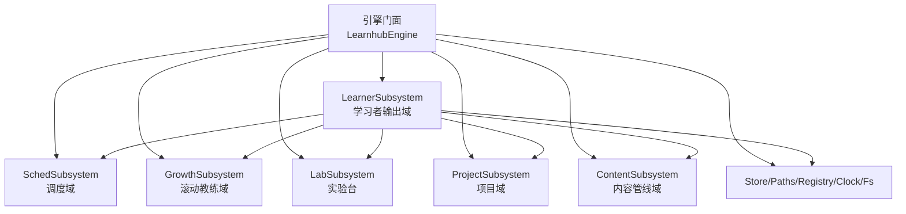
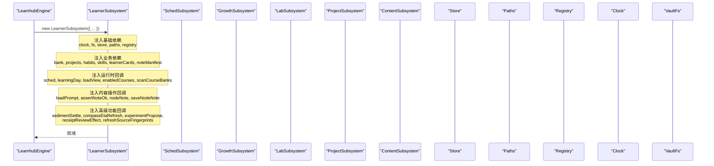
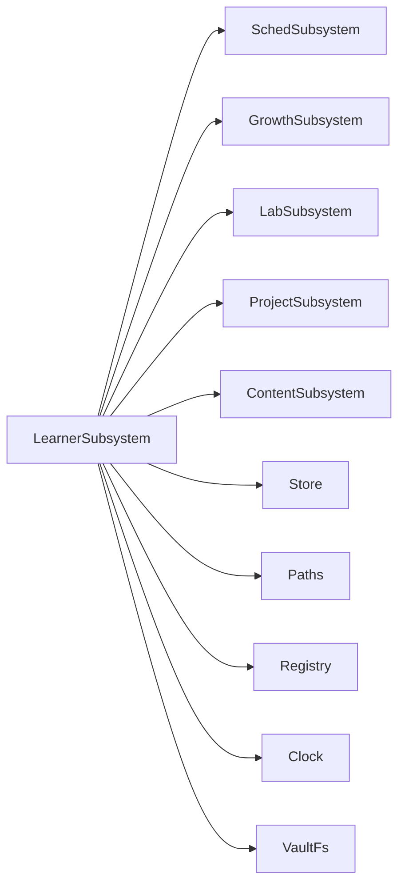
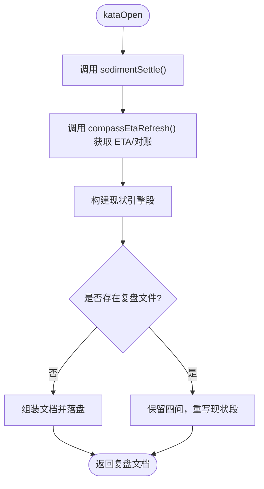

# Learner子系统初始化

<cite>
**本文引用的文件**
- [src/engine/index.ts](file://src/engine/index.ts)
- [src/engine/learner-cards.ts](file://src/engine/learner-cards.ts)
- [src/engine/views/learner.ts](file://src/engine/views/learner.ts)
</cite>

## 目录
1. [简介](#简介)
2. [项目结构](#项目结构)
3. [核心组件](#核心组件)
4. [架构总览](#架构总览)
5. [详细组件分析](#详细组件分析)
6. [依赖关系分析](#依赖关系分析)
7. [性能考量](#性能考量)
8. [故障排查指南](#故障排查指南)
9. [结论](#结论)
10. [附录](#附录)

## 简介
本文件聚焦于 LearnerSubsystem（学习者输出域）的初始化与注入契约，系统性说明其构造参数、回调注入方式以及在学习者追踪和学习路径管理中的核心作用。重点覆盖：
- 基础依赖：clock、fs、store、paths、registry
- 业务依赖：bank、projects、habits、skills、learnerCards、noteManifest
- 运行时回调：sched、learningDay、loadView、enabledCourses、scanCourseBanks
- 内容操作回调：loadPrompt、assertNoteOk、nodeNote、saveNodeNote
- 高级功能依赖：sedimentSettle、compassEtaRefresh、experimentPropose、receiptReviewEffect、refreshSourceFingerprints

## 项目结构
LearnerSubsystem 由引擎门面在启动时装配并注入窄面依赖，随后对外暴露学习者产出、周复盘、回执评审、技能/习惯等能力。关键位置：
- 引擎门面负责实例化 LearnerSubsystem 并传入完整依赖集
- LearnerSubsystem 自身仅持有依赖接口（LearnerDeps），不直接耦合具体实现
- 视图类型定义位于 views/learner.ts，用于对外暴露的数据形态

图表来源
- [src/engine/index.ts:275-293](file://src/engine/index.ts#L275-L293)

章节来源
- [src/engine/index.ts:149-200](file://src/engine/index.ts#L149-L200)
- [src/engine/index.ts:275-293](file://src/engine/index.ts#L275-L293)

## 核心组件
- LearnerSubsystem：聚合学习者输出域能力（E3 pin、E4 JOL、U4 周复盘、E5 教练、E2 讲解、E1 我的卡、Self-Calibration、U 区技能/回执/习惯），通过 LearnerDeps 窄面注入外部依赖，避免循环依赖与紧耦合。
- LearnerCards：独立“我的卡”数据域，负责卡组读写、校验、归档与证据写回。
- 视图类型：views/learner.ts 定义了对外暴露的数据结构（如 KataDoc、HabitsListDoc、SkillsListDoc、LearnerQueueDoc、CalibrationProfileDoc）。

章节来源
- [src/engine/learner-cards.ts:316-350](file://src/engine/learner-cards.ts#L316-L350)
- [src/engine/views/learner.ts:1-147](file://src/engine/views/learner.ts#L1-L147)

## 架构总览
LearnerSubsystem 的初始化由 LearnhubEngine 完成，采用“窄面注入”模式：只把 Learner 域实际消费的成员以函数或对象形式传入，既满足运行时需求，又保持类型安全与可测试性。

图表来源
- [src/engine/index.ts:275-293](file://src/engine/index.ts#L275-L293)

章节来源
- [src/engine/index.ts:275-293](file://src/engine/index.ts#L275-L293)

## 详细组件分析

### 1) 基础依赖注入
- clock：提供当前时间戳，用于学习日判定、事件时间戳、打卡周期等。
- fs：vault 存储端口，统一读盘/落盘通道。
- store：追加型流水与状态存取（练习、复习日志、回执、习惯重复、日记、档案等）。
- paths：课程/笔记/输出区等路径归一。
- registry：课程解析与启用列表查询（resolve/enabled）。

这些依赖使 LearnerSubsystem 能在不感知宿主实现的情况下访问时间与文件系统、持久化与课程元信息。

章节来源
- [src/engine/learner-cards.ts:316-330](file://src/engine/learner-cards.ts#L316-L330)
- [src/engine/index.ts:275-283](file://src/engine/index.ts#L275-L283)

### 2) 业务依赖注入
- bank：题库读取，用于扫描课程题库、统计节点难度与到期情况。
- projects：项目列表与执行记录，用于周复盘现状聚合与回执镜像到项目工作区。
- habits：习惯创建/清单/详情/重复记录，支撑 U 区习惯域。
- skills：技能条目与执行事件推进，支撑 lane 管理与维持节拍。
- learnerCards：我的卡 CRUD、归档、证据写回，支撑 E1 自产卡片。
- noteManifest：笔记源清单，用于周复盘现状中“来源映射”。

章节来源
- [src/engine/learner-cards.ts:325-330](file://src/engine/learner-cards.ts#L325-L330)
- [src/engine/index.ts:277-279](file://src/engine/index.ts#L277-L279)

### 3) 运行时回调注入
- sched(courseRoot)：获取课程 FSRS 调度器（null 表示默认参数），用于“我的卡”和技能 lane 的推进。
- learningDay()：返回今日与截止时刻，保证跨时区/自定义截止的一致性。
- loadView(course)：加载课程图与状态，供 assertNoteOk、explainPoints、receiptSubmit 等使用。
- enabledCourses()：返回已启用课程集合，用于全量扫描与聚合。
- scanCourseBanks(c, fn)：遍历课程题库目录并对每个节点调用回调，被 bankSnapshot、diagnosticsAdvice、coachAdvice 复用。

章节来源
- [src/engine/learner-cards.ts:331-334](file://src/engine/learner-cards.ts#L331-L334)
- [src/engine/index.ts:280-283](file://src/engine/index.ts#L280-L283)

### 4) 内容操作回调注入
- loadPrompt(kind)：加载提示词模板（如“回执评审”），将提示词与业务逻辑解耦。
- assertNoteOk(course, graph, broken, node, tool)：对目标节点进行门禁检查，确保笔记可用且未损坏。
- nodeNote(c, graph, node)：定位并读取节点笔记（path/fm/body），用于回执提交时的 frontmatter 读取。
- saveNodeNote(path, fm, body)：原子保存节点笔记，配合回执提交更新 frontmatter。

章节来源
- [src/engine/learner-cards.ts:335-338](file://src/engine/learner-cards.ts#L335-L338)
- [src/engine/index.ts:284-287](file://src/engine/index.ts#L284-L287)

### 5) 高级功能依赖注入
- sedimentSettle()：沉淀结算，触发校准画像/速度韧性周档生成与档案投影重建，周复盘打开时调用。
- compassEtaRefresh(courseKey?, opts?)：刷新罗盘 ETA 与路线对账，周复盘打开时挂载 ETA 摘要。
- experimentPropose(templateId, course)：一键转 N-of-1 实验提案，从周复盘入口发起。
- receiptReviewEffect(input)：决定回执评审模式（ai/self），受实验当日臂与配置影响。
- refreshSourceFingerprints(absPaths)：刷新笔记源指纹，周复盘落盘后同步，保障变更可见性。

章节来源
- [src/engine/learner-cards.ts:339-349](file://src/engine/learner-cards.ts#L339-L349)
- [src/engine/index.ts:288-292](file://src/engine/index.ts#L288-L292)

### 6) 学习路径管理中的核心作用
- 推荐与意图：pinToday/unpinToday/setGoalIntention 将节点置顶为“今日学它”，并可挂载 if-then 执行意图，零调度副作用。
- 诊断与建议：diagnosticsAdvice 基于信号层建议（R1/R2）与节重写历史，产出诊断项并写入 journal。
- 困难度反馈：coachAdvice 结合近期选择分布与 due 难题数，给出温和提示。
- 周复盘：kataOpen/kataSave/kataToExperiment/kataToIntention 串联沉淀结算、ETA 挂载、路线对账与实验转化。
- 我的卡：learnerQueue/learnerCardRate/learnerCardForget/learnerNoteAdd/explainArchiveCard 形成“自注—评测—复习”闭环。
- 技能与习惯：skillCreate/skillList/executionLog 与 habitCreate/habitList/habitRepeat 构建行为侧的学习轨迹。
- 回执评审：receiptSubmit/receiptList 支持 AI 自评双轨评审，并镜像到项目工作区。

章节来源
- [src/engine/learner-cards.ts:373-416](file://src/engine/learner-cards.ts#L373-L416)
- [src/engine/learner-cards.ts:424-481](file://src/engine/learner-cards.ts#L424-L481)
- [src/engine/learner-cards.ts:604-680](file://src/engine/learner-cards.ts#L604-L680)
- [src/engine/learner-cards.ts:881-979](file://src/engine/learner-cards.ts#L881-L979)
- [src/engine/learner-cards.ts:1072-1176](file://src/engine/learner-cards.ts#L1072-L1176)
- [src/engine/learner-cards.ts:1183-1294](file://src/engine/learner-cards.ts#L1183-L1294)

## 依赖关系分析
LearnerSubsystem 通过 LearnerDeps 窄面依赖其他子系统，形成清晰的单向依赖：
- 对 SchedSubsystem：仅通过 sched(courseRoot) 获取调度器，避免直接耦合
- 对 GrowthSubsystem：通过 compassEtaRefresh 刷新 ETA，不直接消费内部状态
- 对 LabSubsystem：通过 experimentPropose 与 receiptReviewEffect 接入实验机制
- 对 ProjectSubsystem：通过 refreshSourceFingerprints 同步指纹
- 对 ContentSubsystem：通过 loadPrompt/nodeNote/saveNodeNote 完成内容侧交互
- 对 Store/Paths/Registry/Clock/Fs：作为基础设施，贯穿所有流程

图表来源
- [src/engine/index.ts:275-293](file://src/engine/index.ts#L275-L293)

章节来源
- [src/engine/index.ts:275-293](file://src/engine/index.ts#L275-L293)

## 性能考量
- 扫描优化：scanCourseBanks 按课程根目录批量读取题库，减少重复 IO；bankSnapshot/diagnosticsAdvice/coachAdvice 均复用该遍历。
- 缓存与幂等：sedimentSettle 与 kataOpen 在同一挂载点具备幂等语义，避免重复计算与落盘。
- 最小写入：pinToday/unpinToday 仅修改推荐读侧排序，不触碰 canonical/XP/掌握度，降低写放大。
- 异步并发：周复盘现状聚合并行读取 practice/journal/reviewLog/habitRepeats，提升吞吐。

[本节为通用指导，不直接分析具体文件]

## 故障排查指南
- 节点不在图内：当 loadView 返回的图不包含目标节点时，会抛出错误（如 pinToday、explainBackPack、receiptSubmit）。需先确认课程与节点名。
- 笔记损坏或缺失：assertNoteOk 会在笔记 Broken 时 fail loud；nodeNote 缺失 frontmatter 会导致回执提交失败。
- 我的卡约束：addCard 拒绝同内容重复卡；validateLearnerCards 对 prompt/content/挖空标记等进行严格校验。
- 评审模式冲突：receiptSubmit 在自评臂拒绝 force_full，在 AI 臂拒绝 self_score/self_verdict。
- 进度门禁：advanceStrict 保证“一卡一天一次”“一 lane 一天一次”，重复推进会抛错。

章节来源
- [src/engine/learner-cards.ts:373-416](file://src/engine/learner-cards.ts#L373-L416)
- [src/engine/learner-cards.ts:881-979](file://src/engine/learner-cards.ts#L881-L979)
- [src/engine/learner-cards.ts:1183-1234](file://src/engine/learner-cards.ts#L1183-L1234)

## 结论
LearnerSubsystem 通过严格的窄面依赖注入，将学习者输出域与调度、内容、实验、项目等子系统解耦，既保证了运行时能力的完备性，又维持了模块边界清晰与可测试性。它在“推荐—实践—复盘—评审—成长”的闭环中扮演枢纽角色，是学习者追踪与学习路径管理的核心。

[本节为总结性内容，不直接分析具体文件]

## 附录

### A. 构造函数注入清单速览
- 基础依赖：clock、fs、store、paths、registry
- 业务依赖：bank、projects、habits、skills、learnerCards、noteManifest
- 运行时回调：sched、learningDay、loadView、enabledCourses、scanCourseBanks
- 内容操作回调：loadPrompt、assertNoteOk、nodeNote、saveNodeNote
- 高级功能回调：sedimentSettle、compassEtaRefresh、experimentPropose、receiptReviewEffect、refreshSourceFingerprints

章节来源
- [src/engine/index.ts:275-293](file://src/engine/index.ts#L275-L293)
- [src/engine/learner-cards.ts:316-349](file://src/engine/learner-cards.ts#L316-L349)

### B. 关键流程图：周复盘打开

图表来源
- [src/engine/learner-cards.ts:604-645](file://src/engine/learner-cards.ts#L604-L645)