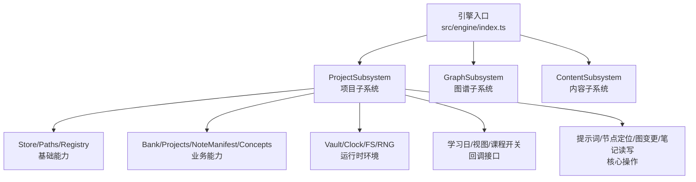
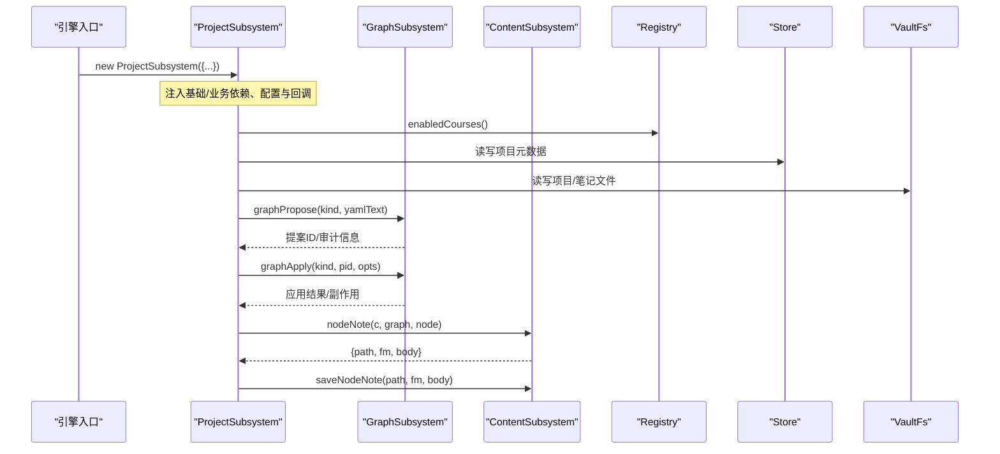
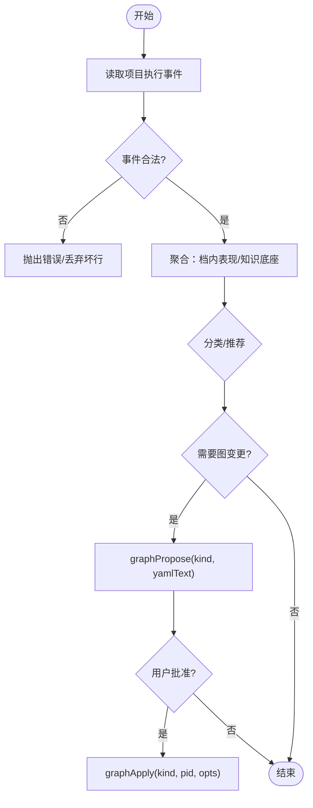
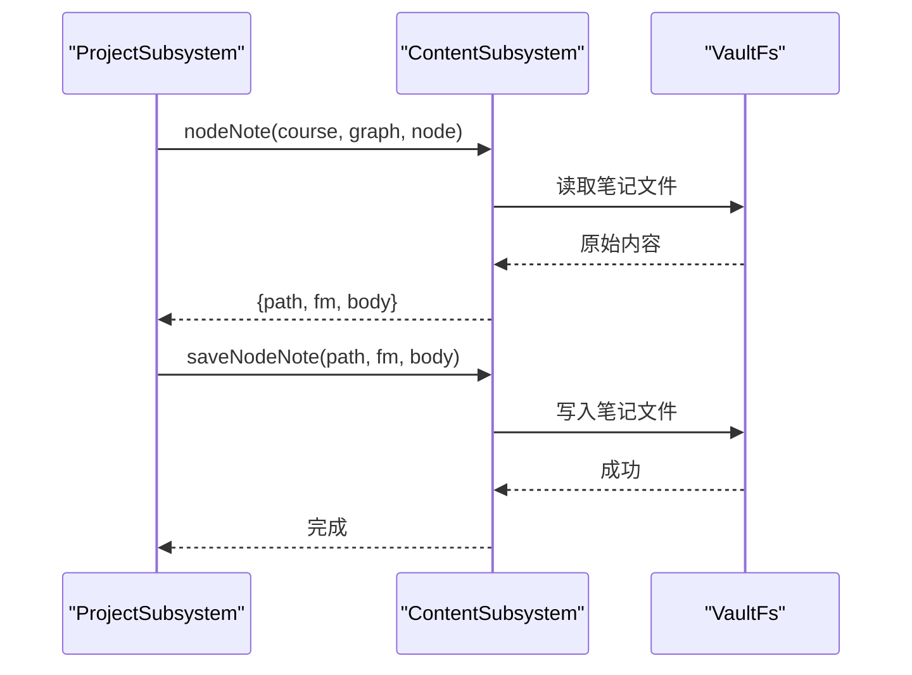
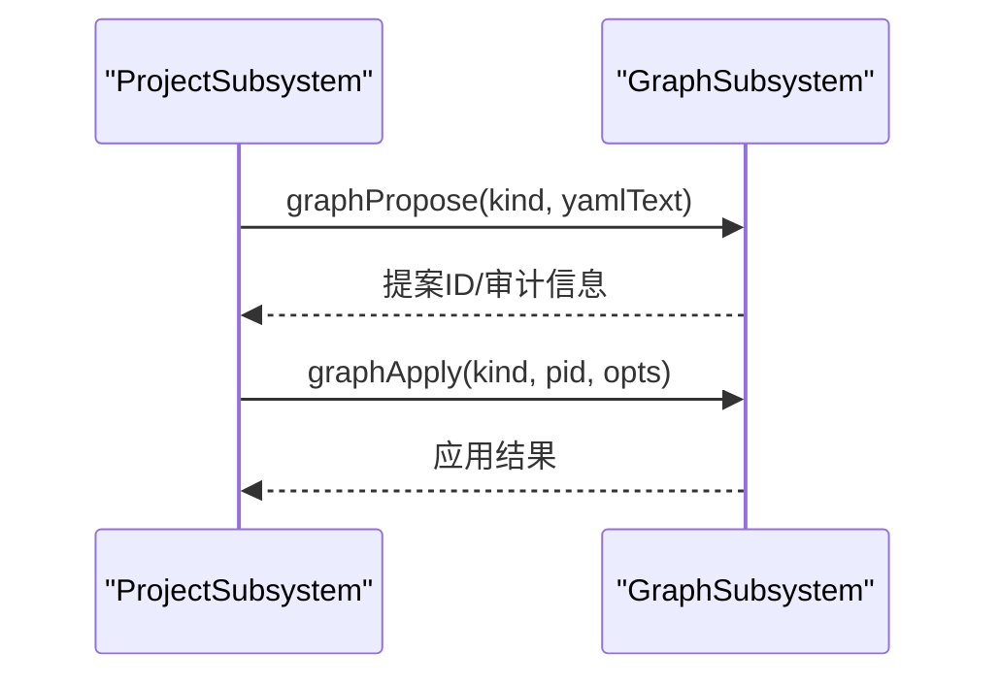
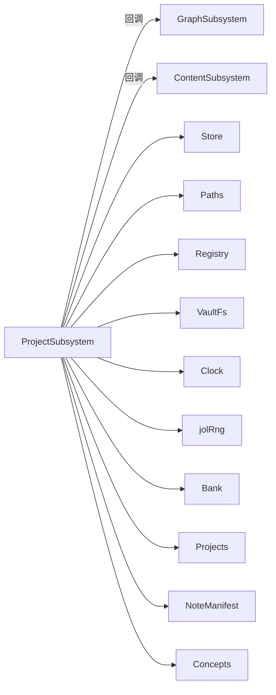

# 项目子系统初始化

<cite>
**本文引用的文件**
- [index.ts](file://src/engine/index.ts)
- [content-subsystem.ts](file://src/engine/content-subsystem.ts)
- [graph-subsystem.ts](file://src/engine/graph-subsystem.ts)
- [project-exec.ts](file://src/engine/project-exec.ts)
</cite>

## 目录
1. [简介](#简介)
2. [项目结构](#项目结构)
3. [核心组件](#核心组件)
4. [架构总览](#架构总览)
5. [详细组件分析](#详细组件分析)
6. [依赖关系分析](#依赖关系分析)
7. [性能考量](#性能考量)
8. [故障排查指南](#故障排查指南)
9. [结论](#结论)
10. [附录](#附录)

## 简介
本文件聚焦于 ProjectSubsystem（项目子系统）的初始化与依赖注入，系统说明其构造函数接收的基础依赖、业务依赖、配置参数与回调函数，并解释其在“项目管理”和“项目计划执行”中的职责边界。重点覆盖以下方面：
- 基础依赖：store、paths、registry
- 业务依赖：bank、projects、noteManifest、concepts
- 配置参数：vaultRoot、jolRng、clock、fs
- 回调注入：learningDay、loadView、enabledCourses
- 核心操作：loadPrompt、locateNode、graphApply、graphPropose、nodeNote、saveNodeNote
- 职责说明：在项目管理与项目计划执行中的角色与协作

## 项目结构
ProjectSubsystem 由引擎入口集中装配，并通过依赖注入的方式获得跨子系统能力。关键装配点位于引擎 index.ts 中，将底层存储、路径、注册表以及上层业务模块（题库、项目、笔记清单、概念库等）统一注入到 ProjectSubsystem。

图表来源
- [index.ts:294-307](file://src/engine/index.ts#L294-L307)

章节来源
- [index.ts:294-307](file://src/engine/index.ts#L294-L307)

## 核心组件
- 基础依赖
  - store：持久化存储抽象，用于读写项目元数据与状态
  - paths：路径构造器，提供项目、笔记、课程根目录等路径计算
  - registry：课程注册表，提供启用课程列表与课程解析
- 业务依赖
  - bank：题库能力，供项目关联题目或证据使用
  - projects：项目集合管理，负责项目的创建、查询、生命周期
  - noteManifest：笔记源清单，辅助定位与校验笔记来源
  - concepts：概念注册表，支撑概念级聚合与诊断
- 配置参数
  - vaultRoot：仓库根路径，作为所有相对路径的基准
  - jolRng：随机数生成器工厂，用于 JOL（猜测偏差）相关采样
  - clock：时钟端口，提供当前时间戳，保证时序一致性
  - fs：文件系统抽象，封装 vault 的文件读写
- 回调注入
  - learningDay：返回“今日”与截止时刻，统一学习日口径
  - loadView：加载单课视图（图 + frontmatter 状态），供项目上下文读取
  - enabledCourses：获取启用的课程列表，限制作用域
- 核心操作
  - loadPrompt：按类型加载提示词模板，驱动 AI 生成/建议
  - locateNode：跨课程定位节点，支持“课程/节点”或直接节点名
  - graphApply：应用图提案（如增删边、更新节点属性）
  - graphPropose：提出图变更提案（YAML 文本），进入人审流程
  - nodeNote：读取节点笔记（path/fm/body）
  - saveNodeNote：保存节点笔记（fm/body 写回）

章节来源
- [index.ts:294-307](file://src/engine/index.ts#L294-L307)
- [content-subsystem.ts:919-931](file://src/engine/content-subsystem.ts#L919-L931)

## 架构总览
ProjectSubsystem 在引擎中被实例化时，通过闭包将其他子系统的能力以函数形式注入，从而形成松耦合的调用链。下图展示了 ProjectSubsystem 与其他子系统的交互关系及关键调用方向。

图表来源
- [index.ts:294-307](file://src/engine/index.ts#L294-L307)
- [graph-subsystem.ts:24-52](file://src/engine/graph-subsystem.ts#L24-L52)
- [content-subsystem.ts:919-931](file://src/engine/content-subsystem.ts#L919-L931)

## 详细组件分析

### 依赖注入与职责映射
- 基础依赖
  - store：用于项目档案、执行事件、提案等结构化数据的持久化
  - paths：为项目目录、执行日志、笔记路径提供稳定构造
  - registry：限定“启用课程”范围，确保项目与课程解耦
- 业务依赖
  - bank：项目可引用题库条目，或在执行事件中关联节点对应的题目
  - projects：项目集合的 CRUD、生命周期管理（active/paused/delivered/archived）
  - noteManifest：笔记源镜像与溯源，保障笔记一致性
  - concepts：概念维度聚合，用于项目面板的诊断与建议
- 配置参数
  - vaultRoot：所有路径计算的根，避免硬编码绝对路径
  - jolRng：JOL 相关随机性（如抽样、扰动）的可控来源
  - clock：统一时间来源，保证“今日”与事件时序一致
  - fs：对 vault 的读/写/追加/存在性检查等原子操作
- 回调注入
  - learningDay：每次调用都从 learnhub.json 读取最新学习日，保证“今天”的口径一致
  - loadView：按需加载课程视图（图+frontmatter），避免全局缓存导致的数据陈旧
  - enabledCourses：只读获取启用课程，约束项目作用域
- 核心操作
  - loadPrompt：通过 ContentSubsystem 暴露的接口加载提示词模板
  - locateNode：通过引擎方法定位节点，支持“课程/节点”精确匹配或多课程唯一命中
  - graphPropose/graphApply：通过 GraphSubsystem 完成图变更的提议与应用
  - nodeNote/saveNodeNote：通过 ContentSubsystem 完成节点笔记的读取与写入

章节来源
- [index.ts:294-307](file://src/engine/index.ts#L294-L307)
- [content-subsystem.ts:919-931](file://src/engine/content-subsystem.ts#L919-L931)
- [graph-subsystem.ts:24-52](file://src/engine/graph-subsystem.ts#L24-L52)

### 项目计划执行与事件流
- 项目执行事件流（exec.jsonl）
  - 每条记录包含：时间戳、学习日、评级（1-4）、来源（auto/self/ai）、关联节点、落流时的档位快照、可选备注
  - 入档推荐（challenge point）：基于“档内表现”和“知识底座均值”给出升/降/维持建议，但不直接修改状态
  - 行为推断 enc 候选边：窗口内共现事件产生候选边，走人审通道，不破坏既有 schema
- 与 ProjectSubsystem 的关系
  - 项目子系统通过注入的 store/paths/fs 写入/读取 exec.jsonl
  - 通过注入的 projects 管理项目生命周期与档位
  - 通过注入的 concepts/bank 进行知识底座与题目证据的聚合
  - 通过注入的 graphPropose/graphApply 将行为推断转化为图变更提案与应用

图表来源
- [project-exec.ts:41-104](file://src/engine/project-exec.ts#L41-L104)
- [project-exec.ts:155-178](file://src/engine/project-exec.ts#L155-L178)
- [project-exec.ts:189-247](file://src/engine/project-exec.ts#L189-L247)
- [project-exec.ts:251-261](file://src/engine/project-exec.ts#L251-L261)

章节来源
- [project-exec.ts:41-104](file://src/engine/project-exec.ts#L41-L104)
- [project-exec.ts:155-178](file://src/engine/project-exec.ts#L155-L178)
- [project-exec.ts:189-247](file://src/engine/project-exec.ts#L189-L247)
- [project-exec.ts:251-261](file://src/engine/project-exec.ts#L251-L261)

### 节点笔记读写与断言
- nodeNote：根据图的 blockOf 推导笔记路径，读取 frontmatter 与正文，返回 path/fm/body
- saveNodeNote：将新的 frontmatter 与正文写回 vault
- assertNoteOk：在操作前检查目标笔记是否 Broken，若损坏则抛出带位置与原因的错误
- 与 ProjectSubsystem 的关系：项目在执行过程中可能需读取/更新节点笔记（例如里程碑产物、执行备注），通过注入的 ContentSubsystem 完成

图表来源
- [content-subsystem.ts:919-931](file://src/engine/content-subsystem.ts#L919-L931)

章节来源
- [content-subsystem.ts:919-931](file://src/engine/content-subsystem.ts#L919-L931)

### 图变更工作流（提案与应用）
- graphPropose：提交图变更提案（YAML 文本），进入人审通道
- graphApply：应用已批准的提案（kind, pid, opts），完成实际的图结构变更
- 与 ProjectSubsystem 的关系：项目执行过程中产生的图变更（如新增/调整 enc 边）通过该流程实现“先提议、后应用”的安全模式

图表来源
- [index.ts:294-307](file://src/engine/index.ts#L294-L307)
- [graph-subsystem.ts:24-52](file://src/engine/graph-subsystem.ts#L24-L52)

## 依赖关系分析
- 组件耦合
  - ProjectSubsystem 与 GraphSubsystem、ContentSubsystem 通过回调解耦，仅依赖最小必要接口
  - 与 Registry、Store、Paths、FS 的耦合集中在基础设施层，便于替换与测试
- 直接依赖
  - 基础：store、paths、registry、vaultRoot、clock、fs、jolRng
  - 业务：bank、projects、noteManifest、concepts
  - 回调：learningDay、loadView、enabledCourses、loadPrompt、locateNode、graphApply、graphPropose、nodeNote、saveNodeNote
- 间接依赖
  - 通过 ContentSubsystem 访问 notes 工具与 vault prior
  - 通过 GraphSubsystem 访问 proposals 与审计流程
- 循环依赖
  - 通过回调注入避免直接循环引用；各子系统之间保持单向依赖

图表来源
- [index.ts:294-307](file://src/engine/index.ts#L294-L307)
- [graph-subsystem.ts:24-52](file://src/engine/graph-subsystem.ts#L24-L52)

章节来源
- [index.ts:294-307](file://src/engine/index.ts#L294-L307)
- [graph-subsystem.ts:24-52](file://src/engine/graph-subsystem.ts#L24-L52)

## 性能考量
- 视图加载：loadView 每次现读课程视图，避免全局缓存带来的不一致；适合小文件场景
- 事件读取：exec.jsonl 采用 JSONL 追加式存储，读侧通过原语安全处理缺失/坏行
- 随机性与时间：jolRng 与 clock 作为端口注入，便于测试与确定性回放
- 图变更：graphPropose/graphApply 分离，减少误写风险；批量应用时可合并以减少 IO

[本节为通用指导，不直接分析具体文件]

## 故障排查指南
- 节点笔记损坏
  - 现象：操作时报错指出笔记 Broken 及原因
  - 处理：依据错误信息修复 frontmatter 或重建笔记；必要时运行数据体检定位问题
- 节点定位失败
  - 现象：多课程中存在同名节点或找不到节点
  - 处理：使用“课程/节点”格式精确定位；确保课程已启用
- 图变更未生效
  - 现象：graphPropose 后无变化
  - 处理：确认提案已审批并调用 graphApply；检查 kind 与 pid 是否正确
- 执行事件异常
  - 现象：评级越界、source 非法、nodes 非数组
  - 处理：遵循输入契约修正；参考验证逻辑修复上游数据

章节来源
- [content-subsystem.ts:919-931](file://src/engine/content-subsystem.ts#L919-L931)
- [project-exec.ts:73-104](file://src/engine/project-exec.ts#L73-L104)

## 结论
ProjectSubsystem 通过清晰的依赖注入与回调接口，将“项目管理”与“项目计划执行”的职责与能力解耦到合适的子系统。其初始化阶段即明确了与图、内容、题库、概念、存储、路径、注册表等的协作方式，并以学习日、视图、启用课程等回调统一了作用域与时序。核心操作（提示词加载、节点定位、图变更、笔记读写）均通过注入的子系统完成，既保证了安全性（提案-应用分离），又提升了可测试性与可维护性。

[本节为总结性内容，不直接分析具体文件]

## 附录
- 术语
  - 学习日：统一的“今日”口径，决定证据归属与调度
  - 图变更：对课程图的增删改操作，经提案与人审后应用
  - 执行事件：项目执行过程中的行为证据，用于诊断与推荐
- 相关文件
  - 引擎装配：[index.ts:294-307](file://src/engine/index.ts#L294-L307)
  - 内容子系统笔记读写：[content-subsystem.ts:919-931](file://src/engine/content-subsystem.ts#L919-L931)
  - 图谱子系统依赖面：[graph-subsystem.ts:24-52](file://src/engine/graph-subsystem.ts#L24-L52)
  - 项目执行事件与推荐：[project-exec.ts:41-104](file://src/engine/project-exec.ts#L41-L104), [project-exec.ts:155-178](file://src/engine/project-exec.ts#L155-L178), [project-exec.ts:189-247](file://src/engine/project-exec.ts#L189-L247), [project-exec.ts:251-261](file://src/engine/project-exec.ts#L251-L261)