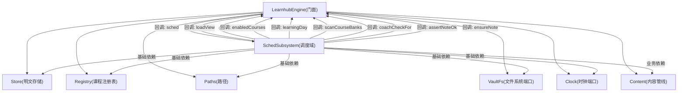
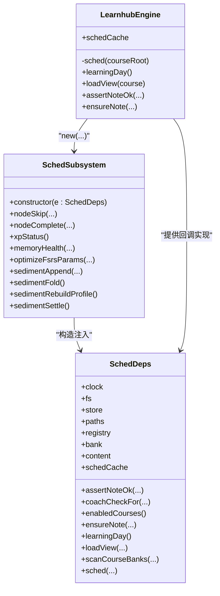
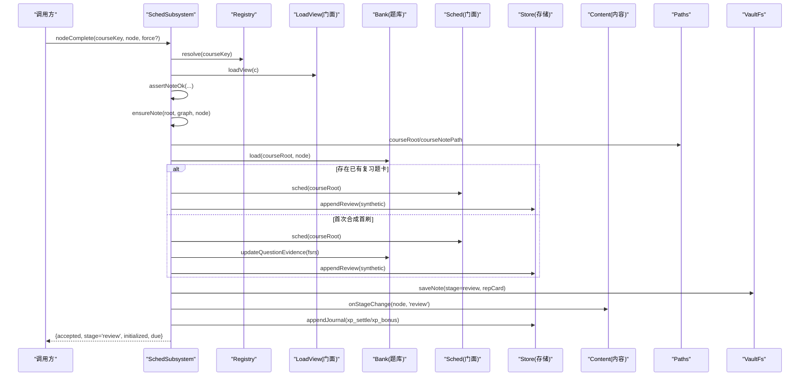
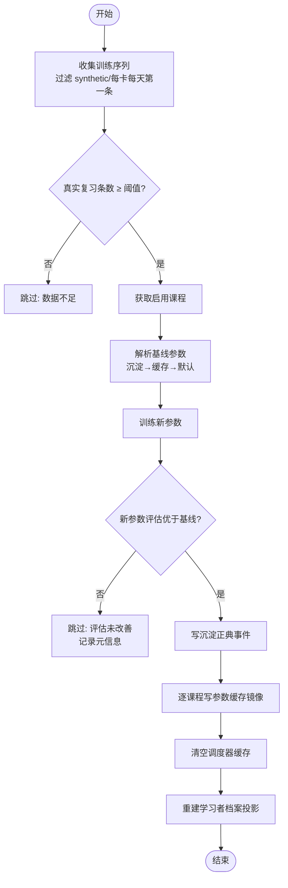
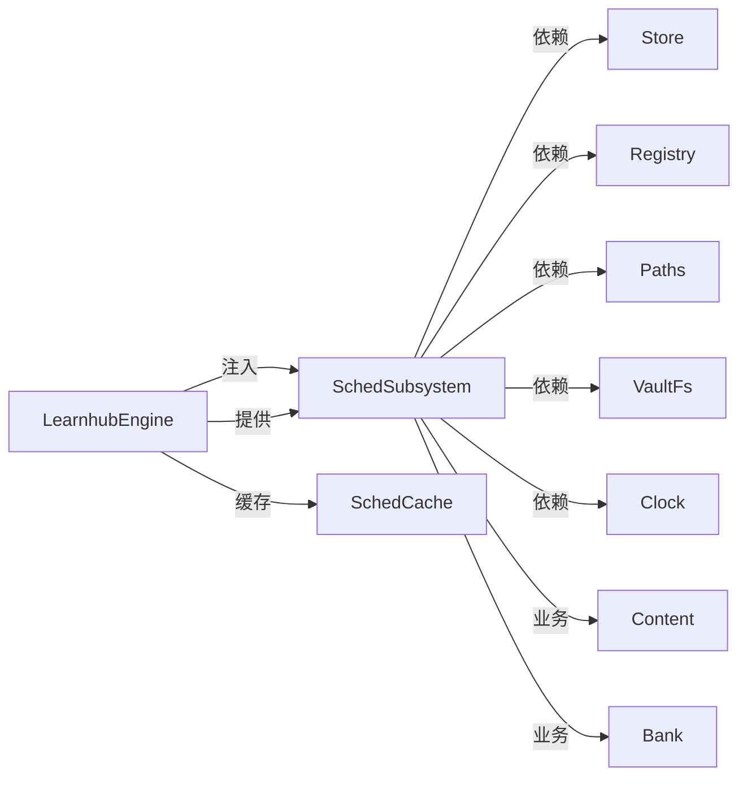

# Sched子系统初始化

<cite>
**本文引用的文件**
- [sched-subsystem.ts](file://src/engine/sched-subsystem.ts)
- [index.ts](file://src/engine/index.ts)
- [srs.ts](file://src/engine/srs.ts)
- [content.ts](file://src/engine/content.ts)
- [registry.ts](file://src/engine/registry.ts)
- [store.ts](file://src/engine/store.ts)
</cite>

## 目录
1. [简介](#简介)
2. [项目结构](#项目结构)
3. [核心组件](#核心组件)
4. [架构总览](#架构总览)
5. [详细组件分析](#详细组件分析)
6. [依赖关系分析](#依赖关系分析)
7. [性能考量](#性能考量)
8. [故障排查指南](#故障排查指南)
9. [结论](#结论)
10. [附录](#附录)

## 简介
本文件聚焦于学习调度系统（SchedSubsystem）的初始化与依赖注入，解释其构造函数接收的基础依赖与业务依赖，并逐一说明回调函数如何由门面 LearnhubEngine 注入。同时阐述该子系统在学习流程中的作用：FSRS 算法集成、复习计划生成、掌握度评估，以及与其他子系统（内容、题库、存储、注册表等）的协作方式。

## 项目结构
SchedSubsystem 位于 engine 层，作为“调度域”的核心实现，仅被门面 LearnhubEngine 直接引用；跨子系统调用通过窄面回调注入，避免环依赖。门面负责装配所有子系统实例，并将共享能力（如 FSRS 调度器缓存、学习日计算、视图加载等）以回调形式注入到各子系统。

图表来源
- [index.ts:212-398](file://src/engine/index.ts#L212-L398)
- [sched-subsystem.ts:43-84](file://src/engine/sched-subsystem.ts#L43-L84)

章节来源
- [index.ts:212-398](file://src/engine/index.ts#L212-L398)
- [sched-subsystem.ts:1-84](file://src/engine/sched-subsystem.ts#L1-L84)

## 核心组件
- SchedSubsystem：调度域入口，负责节点跳过/完成确认、XP 时间账本、记忆健康仪表盘、FSRS 参数优化、沉淀层读写与学习者档案重建。
- Store：明文运行态存储（journal/practice/review-log 等 JSONL 追加与读取）。
- Registry：课程注册表，提供启用课程列表与课程解析。
- Content：内容管线，负责生成队列、上下文包、质检门、T1/T2 触发等。
- Paths/VaultFs/Clock：基础设施端口，统一路径、文件访问与时钟。

章节来源
- [sched-subsystem.ts:83-84](file://src/engine/sched-subsystem.ts#L83-L84)
- [store.ts:46-47](file://src/engine/store.ts#L46-L47)
- [registry.ts:77-78](file://src/engine/registry.ts#L77-L78)
- [content.ts:51-60](file://src/engine/content.ts#L51-L60)

## 架构总览
SchedSubsystem 不直接持有其他子系统的实例，而是通过 SchedDeps 接口注入基础依赖与业务依赖，并通过一组回调方法回引门面 LearnhubEngine，从而解耦跨子系统调用。门面集中维护 FSRS 调度器缓存（按课程根键），并提供学习日、视图加载、笔记校验等通用能力。

图表来源
- [sched-subsystem.ts:43-84](file://src/engine/sched-subsystem.ts#L43-L84)
- [index.ts:198-210](file://src/engine/index.ts#L198-L210)
- [index.ts:369-381](file://src/engine/index.ts#L369-L381)

## 详细组件分析

### SchedSubsystem 构造函数与依赖注入
- 基础依赖
  - clock：用于写回 trained_at 等时间戳。
  - fs：vault 存储端口，统一读盘落盘。
  - store：写入 journal/practice/review-log 等流水。
  - paths：课程/状态/沉淀等路径解析。
  - registry：获取启用课程、解析课程 key。
- 业务依赖
  - bank：题库加载、归档、证据更新。
  - content：阶段变更时触发 T1/T2 生成队列。
  - schedCache：FSRS 调度器实例缓存（按 courseRoot 键），在参数写回后失效。
- 回调注入（由门面 LearnhubEngine 提供）
  - assertNoteOk：前置门，若目标笔记 Broken 则抛错。
  - coachCheckFor：教练回合就绪深度检查（读侧感知）。
  - enabledCourses：返回启用课程列表。
  - ensureNote：无笔记节点补占位 frontmatter。
  - learningDay：返回今日日期与日界 cutoff。
  - loadView：加载单课图+frontmatter 状态。
  - scanCourseBanks：遍历课程下所有节点的题库。
  - sched：按课程根获取 FSRS 调度器（带缓存）。

章节来源
- [sched-subsystem.ts:43-84](file://src/engine/sched-subsystem.ts#L43-L84)
- [index.ts:369-381](file://src/engine/index.ts#L369-L381)

### FSRS 集成、复习计划生成与掌握度评估
- 参数解析与调度器构建
  - resolveFsrsParams：从沉淀正典→课程参数缓存→官方默认，保证唯一口径。
  - getScheduler：基于 DESIRED_RETENTION、关闭 fuzz/短期步，构建 ts-fsrs 调度器。
- 题卡级操作
  - applyRatingBlock：对单个题目进行评分，产出新 fsrs 块与类型（learn/review/relearn）。
  - retrievabilityBlock：计算当前可提取性 R。
  - previewDue：预览某评分后的下次到期日。
- 节点级操作
  - nodeComplete：将节点内全部未归档题目纳入复习循环（已作答按各自 FSRS 到期复习，未作答初始化为明天起刷），聚合代表卡写入 frontmatter，阶段转 review，并触发 XP 预算对账与内容生成队列。
  - memoryHealth：扫描全部启用课程的题库，汇总 due 列表、状态直方图、真实保留率、校准与遗忘曲线、JOL 校准。
- 掌握度
  - masteryValue/masteryOfFm：综合稳定度完成度与练习证据，给出节点掌握度。

章节来源
- [srs.ts:29-61](file://src/engine/srs.ts#L29-L61)
- [srs.ts:94-105](file://src/engine/srs.ts#L94-L105)
- [srs.ts:107-154](file://src/engine/srs.ts#L107-L154)
- [srs.ts:165-183](file://src/engine/srs.ts#L165-L183)
- [sched-subsystem.ts:132-270](file://src/engine/sched-subsystem.ts#L132-L270)
- [sched-subsystem.ts:328-359](file://src/engine/sched-subsystem.ts#L328-L359)

### 关键工作流时序

#### 节点完成确认（nodeComplete）

图表来源
- [sched-subsystem.ts:132-270](file://src/engine/sched-subsystem.ts#L132-L270)
- [index.ts:212-210](file://src/engine/index.ts#L212-L210)

#### FSRS 参数优化（optimizeFsrsParams）

图表来源
- [sched-subsystem.ts:368-450](file://src/engine/sched-subsystem.ts#L368-L450)
- [srs.ts:29-61](file://src/engine/srs.ts#L29-L61)

### 与其他子系统的协作关系
- 与 Content 子系统：节点进入 review/mastered 时，触发 T1/T2 生成队列，驱动后续内容生成。
- 与 Bank 子系统：加载题库、归档跳过节点的题目、更新题卡证据（fsrs 块）、统计正确率与尝试次数。
- 与 Store 子系统：写入 practice/journal/review-log，支撑 XP 对账、记忆健康、JOL 校准与遗忘曲线。
- 与 Registry 子系统：解析课程 key、枚举启用课程，确保只处理有效课程。
- 与 Paths/VaultFs/Clock：统一路径解析、文件 I/O、时间戳来源，保证可测试性与一致性。

章节来源
- [sched-subsystem.ts:132-270](file://src/engine/sched-subsystem.ts#L132-L270)
- [sched-subsystem.ts:328-359](file://src/engine/sched-subsystem.ts#L328-L359)
- [index.ts:212-398](file://src/engine/index.ts#L212-L398)

## 依赖关系分析
- 松耦合设计：SchedSubsystem 不直接 import 其他子系统类，而是通过 SchedDeps 注入方法与对象，避免环依赖。
- 门面集中装配：LearnhubEngine 在构造期创建所有子系统实例，并以闭包形式向各子系统注入共享能力（如 sched、loadView、learningDay 等）。
- 缓存策略：FSRS 调度器按 courseRoot 缓存，参数写回后显式清空，保证后续推进使用最新参数。

图表来源
- [index.ts:198-210](file://src/engine/index.ts#L198-L210)
- [index.ts:369-381](file://src/engine/index.ts#L369-L381)
- [sched-subsystem.ts:43-84](file://src/engine/sched-subsystem.ts#L43-L84)

章节来源
- [index.ts:198-210](file://src/engine/index.ts#L198-L210)
- [index.ts:369-381](file://src/engine/index.ts#L369-L381)
- [sched-subsystem.ts:43-84](file://src/engine/sched-subsystem.ts#L43-L84)

## 性能考量
- FSRS 调度器缓存：按课程根缓存 FSRS 实例，避免重复构建与参数读取；参数写回后清空缓存，确保一致性。
- 批量扫描：memoryHealth 中扫描全部启用课程的题库，注意数据量增长时的 IO 成本。
- 日志与流水：practice/journal/review-log 为追加型 JSONL，读全量时需考虑文件大小；建议按需过滤或分页。
- 幂等与去重：节点完成流程包含幂等判据（stage 已为 review 则跳过），避免重复入队与重复写入。

[本节为通用指导，无需具体文件引用]

## 故障排查指南
- 节点笔记损坏（Broken）：任何需要修改节点的操作前会调用 assertNoteOk，若目标笔记 Broken 将抛出错误并附带位置与原因。修复笔记文件或修正 frontmatter 后再试。
- 没有启用课程：优化参数或健康统计时会先检查启用课程集合，若无课程将跳过并返回原因。
- FSRS 参数未生效：检查是否已清空 schedCache（优化流程末尾会执行），并确保参数写回成功。
- 复习日志缺失：reviewLogAll 遵循 Missing/Broken 契约，缺失为空、损坏抛错；检查 state 目录下 review-log 文件是否存在且格式合法。

章节来源
- [sched-subsystem.ts:98-121](file://src/engine/sched-subsystem.ts#L98-L121)
- [sched-subsystem.ts:368-450](file://src/engine/sched-subsystem.ts#L368-L450)
- [store.ts:145-149](file://src/engine/store.ts#L145-L149)

## 结论
SchedSubsystem 通过清晰的依赖注入与回调机制，实现了学习调度的核心职责：节点状态推进、FSRS 复习计划生成、掌握度评估与参数优化。门面 LearnhubEngine 集中管理共享资源（FSRS 缓存、学习日、视图加载），使各子系统保持松耦合与高内聚。整体设计兼顾了可扩展性、可测试性与数据一致性。

[本节为总结，无需具体文件引用]

## 附录
- 术语
  - FSRS：间隔重复算法，用于预测遗忘与安排复习。
  - 沉淀层：学习模型状态的第四存储域，承载正典与派生档案。
  - JOL：学习者自信度预测，用于校准自评估与实际表现。
- 参考
  - 参数解析与调度器构建：resolveFsrsParams/getScheduler
  - 题卡评分与阶段机：applyRating/applyRatingBlock/stageAfter
  - 掌握度口径：masteryValue/masteryOfFm

[本节为补充说明，无需具体文件引用]