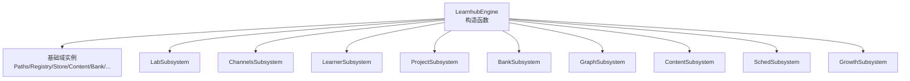
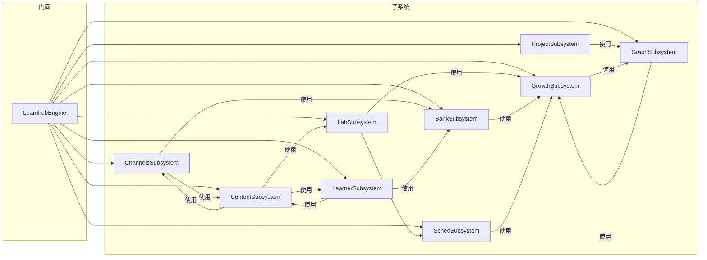
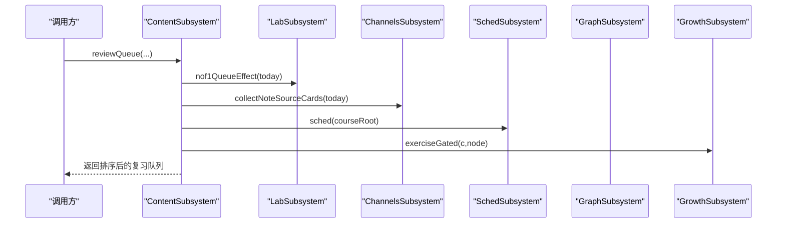
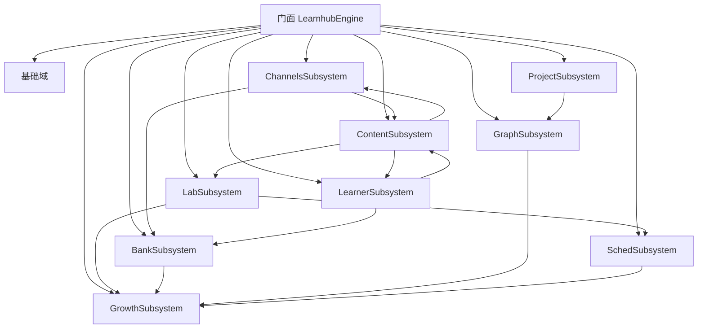

# 高级子系统初始化

<cite>
**本文引用的文件**
- [src/engine/index.ts](file://src/engine/index.ts)
- [src/engine/nof1.ts](file://src/engine/nof1.ts)
- [src/engine/note-source.ts](file://src/engine/note-source.ts)
- [src/engine/graph-subsystem.ts](file://src/engine/graph-subsystem.ts)
- [src/engine/content-subsystem.ts](file://src/engine/content-subsystem.ts)
- [src/engine/sched-subsystem.ts](file://src/engine/sched-subsystem.ts)
- [src/engine/growth-subsystem.ts](file://src/engine/growth-subsystem.ts)
</cite>

## 目录
1. [简介](#简介)
2. [项目结构](#项目结构)
3. [核心组件](#核心组件)
4. [架构总览](#架构总览)
5. [详细组件分析](#详细组件分析)
6. [依赖关系分析](#依赖关系分析)
7. [性能考虑](#性能考虑)
8. [故障排查指南](#故障排查指南)
9. [结论](#结论)

## 简介
本文聚焦 LearnHub 引擎在构造函数中完成“高级子系统”的窄面注入构造过程，系统性说明以下子系统的初始化与相互依赖：LabSubsystem、ChannelsSubsystem、LearnerSubsystem、ProjectSubsystem、BankSubsystem、GraphSubsystem、ContentSubsystem、SchedSubsystem、GrowthSubsystem。重点解释共享依赖（clock、fs、store、paths、registry）如何传递，以及子系统间复杂依赖（如 GraphProposals 的生长闸门回调、各子系统对 sched、learningDay、loadView 等回调的使用）。文末提供子系统初始化依赖图与调用约束。

## 项目结构
LearnHub 引擎通过单一门面类 LearnhubEngine 集中装配所有领域对象与子系统。构造阶段先创建基础域（Paths、Registry、Store、Content、QuestionBank、ConceptRegistry、LearnerCards、ErrorCards、Skills、Habits、NoteSourceManifest、AnkiMirror、Projects、Sessions），再按顺序构建各子系统，并通过“窄面接口”将门面方法以回调形式注入到子系统，避免循环依赖并限定可见范围。

图示来源
- [src/engine/index.ts:212-398](file://src/engine/index.ts#L212-L398)

章节来源
- [src/engine/index.ts:212-398](file://src/engine/index.ts#L212-L398)

## 核心组件
- 共享依赖
  - clock：统一时间源，用于学习日计算、事件戳、参数优化元数据等。
  - fs：VaultFs 存储端口，所有读盘落盘的唯一通道。
  - store：结构化窄面访问流水与提案等状态。
  - paths：课程根、笔记路径、状态区等路径工具。
  - registry：课程注册表与启用课程集合。
- 关键回调
  - sched(courseRoot?)：返回 FSRS 调度器实例（带缓存）。
  - learningDay()：返回 { today, cutoff }。
  - loadView(course)：加载课程视图（图+frontmatter+broken）。
  - enabledCourses()：获取启用课程列表。
  - scanCourseBanks(c, fn)：扫描课程题库节点。
  - loadPrompt(kind)、questionView(...)、judgeBankAnswer(...)：内容管线与题目视图能力。
  - assertNoteOk(...)、ensureNote(...)、updateNoteFm(...)：笔记一致性保障。
  - graphApply/graphPropose/graphReject：图变更入口。
  - sedimentAppend/fold/rebuildProfile：沉淀层写入与投影重建。
  - compassEtaRefresh/exerciseGated/jolPredicted/mcAggregate/sandboxPopulation：生长域能力。
  - experimentPropose/experimentApply/receiptReviewEffect/noF1QueueEffect：实验台能力。

章节来源
- [src/engine/index.ts:212-398](file://src/engine/index.ts#L212-L398)

## 架构总览
下图展示子系统间的依赖方向与初始化约束。注意：
- 所有子系统通过窄面接口回引门面方法，而非直接引用其他子系统实例，从而避免环。
- GraphProposals 在构造时即绑定 growth2.growthGateErrors 作为生长闸门错误回调。
- 多数子系统需要 sched、learningDay、loadView 三个“运行时门”，由门面提供。

图示来源
- [src/engine/index.ts:212-398](file://src/engine/index.ts#L212-L398)
- [src/engine/nof1.ts:456-477](file://src/engine/nof1.ts#L456-L477)
- [src/engine/note-source.ts:327-362](file://src/engine/note-source.ts#L327-L362)
- [src/engine/graph-subsystem.ts:28-51](file://src/engine/graph-subsystem.ts#L28-L51)
- [src/engine/content-subsystem.ts:39-78](file://src/engine/content-subsystem.ts#L39-L78)
- [src/engine/sched-subsystem.ts:43-63](file://src/engine/sched-subsystem.ts#L43-L63)
- [src/engine/growth-subsystem.ts:36-59](file://src/engine/growth-subsystem.ts#L36-L59)

## 详细组件分析

### 全局装配与生长闸门注入
- 门面在构造早期创建基础域与共享依赖，随后按序构建子系统。
- GraphProposals 在构造时即传入 growth2.growthGateErrors(spec) 作为闸门错误回调，使后续提案受理受生长闸门控制。
- 各子系统通过窄面接口接收 sched、learningDay、loadView 等回调，确保运行时才解析课程与调度器，避免启动期重 IO。

章节来源
- [src/engine/index.ts:236-240](file://src/engine/index.ts#L236-L240)
- [src/engine/index.ts:242-398](file://src/engine/index.ts#L242-L398)

### LabSubsystem（实验台域）
- 依赖窄面包含：clock、fs、store、paths、registry、projects、bank、sched、learningDay、loadView、enabledCourses、scanCourseBanks、sedimentAppend/fold/rebuildProfile。
- 典型用途：N-of-1 实验模板与分臂、回执评审模式、恒温器建议、沙盘与睡眠配置；通过 sched 获取课程调度器，通过 learningDay 确定学习日，通过 loadView 读取课程图与状态。

章节来源
- [src/engine/nof1.ts:456-477](file://src/engine/nof1.ts#L456-L477)
- [src/engine/index.ts:242-254](file://src/engine/index.ts#L242-L254)

### ChannelsSubsystem（通道域）
- 依赖窄面包含：clock、fs、store、paths、registry（仅 load/loadNoteSources/save/get）、bank、ankiMirror、noteManifest、vaultRoot、sched、learningDay、loadView、enabledCourses、scanCourseBanks、loadPrompt、questionView、judgeBankAnswer、refreshRepCard。
- 典型用途：笔记复习源注册/出题/镜像、Anki 通道、用户排除清单、题库入库与查重；通过 bank 管理题库镜像，通过 ankiMirror 同步 Anki，通过 noteManifest 维护源清单。

章节来源
- [src/engine/note-source.ts:327-362](file://src/engine/note-source.ts#L327-L362)
- [src/engine/index.ts:255-274](file://src/engine/index.ts#L255-L274)

### LearnerSubsystem（学习者输出域）
- 依赖窄面包含：clock、fs、store、paths、registry、bank、projects、habits、skills、learnerCards、noteManifest、sched、learningDay、loadView、enabledCourses、loadPrompt、assertNoteOk、nodeNote/saveNodeNote、sedimentSettle、compassEtaRefresh、experimentPropose、receiptReviewEffect、refreshSourceFingerprints。
- 典型用途：学习者卡片、技能与习惯、校准提示、JOL 配置、回执反馈效应、项目指纹刷新；通过 projects 刷新来源指纹，通过 lab.experimentPropose 发起实验。

章节来源
- [src/engine/index.ts:275-293](file://src/engine/index.ts#L275-L293)

### ProjectSubsystem（项目域）
- 依赖窄面包含：store、paths、registry、bank、projects、noteManifest、concepts、vaultRoot、jolRng、clock、fs、learningDay、loadView、enabledCourses、loadPrompt、locateNode、graphApply/graphPropose、nodeNote/saveNodeNote。
- 典型用途：项目计划与里程碑、执行事件流、目标反编译；通过 graphApply/graphPropose 触发图变更，通过 locateNode 定位节点。

章节来源
- [src/engine/index.ts:294-307](file://src/engine/index.ts#L294-L307)

### BankSubsystem（题库域）
- 依赖窄面包含：clock、fs、store、paths、registry、bank、errorCards、concepts、proposals、schedCache、sched、learningDay、loadView、enabledCourses、scanCourseBanks、loadPrompt、assertNoteOk、nodeNote/saveNodeNote、vaultPriorFor、logGradingFailure、questionContext、exerciseGated、repairInvokesOnce、admitQuestion、explainPoints、isNoteSourceCourse。
- 典型用途：题库管理、错误对比卡、质量审计、FSRS 参数优化、沉淀层；通过 proposals 参与图提案流程，通过 channels.repairInvokesOnce/admitQuestion 协同出题与查重。

章节来源
- [src/engine/index.ts:308-330](file://src/engine/index.ts#L308-L330)

### GraphSubsystem（图域）
- 依赖窄面包含：clock、fs、store、paths、projects、proposals、concepts、registry、bank、noteManifest、vaultRoot、learningDay、loadView、loadPrompt、assertNoteOk、seedAuditFor、applyProjectPlanProposal、experimentApply。
- 典型用途：图分析、链接先验、探索、提案门禁、enc 覆盖回填；通过 proposals 受理 edit/seed/enrich，通过 seedAuditFor 进行种子审计。

章节来源
- [src/engine/graph-subsystem.ts:28-51](file://src/engine/graph-subsystem.ts#L28-L51)
- [src/engine/index.ts:331-343](file://src/engine/index.ts#L331-L343)

### ContentSubsystem（内容管线域）
- 依赖窄面包含：clock、fs、store、paths、registry、concepts、bank、content、sessions、learnerCards、vaultRoot、jolRng、assertNoteOk、bandDefault、calibrationHintsConfig、collectNoteSourceCards、enabledCourses、ensureNote、errorCardTriples、exerciseGated、expTag、isNoteSourceCourse、jolConfig、jolPredicted、learningDay、loadView、nof1QueueEffect、noteSourceAnswer/Forget/Rate、sched、updateNoteFm。
- 典型用途：内容生成管线、笔记 resolve/反馈、课程工作区与题库树；通过 nof1QueueEffect 注入实验当日臂影响队列呈现，通过 channels.noteSource* 路由笔记源作答。

章节来源
- [src/engine/content-subsystem.ts:39-78](file://src/engine/content-subsystem.ts#L39-L78)
- [src/engine/index.ts:344-368](file://src/engine/index.ts#L344-L368)

### SchedSubsystem（调度域）
- 依赖窄面包含：clock、fs、store、paths、registry、bank、content、schedCache、assertNoteOk、coachCheckFor、enabledCourses、ensureNote、learningDay、loadView、scanCourseBanks、sched。
- 典型用途：节点跳过/完成确认、XP 账本、记忆健康、FSRS 参数优化、沉淀层；通过 coachCheckFor 触发教练回合感知，通过 sedimentAppend/fold/rebuildProfile 管理沉淀正典与投影。

章节来源
- [src/engine/sched-subsystem.ts:43-63](file://src/engine/sched-subsystem.ts#L43-L63)
- [src/engine/index.ts:369-381](file://src/engine/index.ts#L369-L381)

### GrowthSubsystem（滚动教练域）
- 依赖窄面包含：clock、fs、store、paths、registry、concepts、content、enabledCourses、graphApply/graphPropose/graphReject、learningDay、loadView、mcAggregate、sandboxPopulation、scanCourseBanks、sedimentFold、sedimentRebuildProfile。
- 典型用途：罗盘、教练回合、生长批受理、边实验账本与复诊；通过 graphPropose/graphApply 提交并应用图变更，通过 sandboxPopulation/mcAggregate 做蒙特卡洛 ETA 推演。

章节来源
- [src/engine/growth-subsystem.ts:36-59](file://src/engine/growth-subsystem.ts#L36-L59)
- [src/engine/index.ts:382-397](file://src/engine/index.ts#L382-L397)

### 子系统间调用序列示例：内容队列装配

图示来源
- [src/engine/content-subsystem.ts:538-717](file://src/engine/content-subsystem.ts#L538-L717)
- [src/engine/nof1.ts:496-503](file://src/engine/nof1.ts#L496-L503)
- [src/engine/note-source.ts:782-800](file://src/engine/note-source.ts#L782-L800)
- [src/engine/index.ts:344-368](file://src/engine/index.ts#L344-L368)

## 依赖关系分析
- 耦合与内聚
  - 子系统之间通过窄面接口解耦，仅暴露必要能力，降低环风险。
  - 门面集中持有所有实例，负责装配与生命周期管理。
- 直接/间接依赖
  - GraphProposals 依赖 GrowthSubsystem 的生长闸门错误回调，形成“受理前校验”的约束。
  - ContentSubsystem 依赖 LabSubsystem（实验臂）、ChannelsSubsystem（笔记源）、SchedSubsystem（调度）、GrowthSubsystem（练习闸门/JOL）。
  - BankSubsystem 依赖 ChannelsSubsystem（出题/查重）、GrowthSubsystem（练习闸门）。
  - SchedSubsystem 依赖 GrowthSubsystem（教练检查点）。
- 外部依赖与集成点
  - VaultFs（fs）：所有文件系统访问的统一抽象。
  - Store：结构化窄面访问流水与提案。
  - Registry：课程注册与启用集合。
  - Paths：路径工具。
  - Clock：时间源。

图示来源
- [src/engine/index.ts:212-398](file://src/engine/index.ts#L212-L398)
- [src/engine/nof1.ts:456-477](file://src/engine/nof1.ts#L456-L477)
- [src/engine/note-source.ts:327-362](file://src/engine/note-source.ts#L327-L362)
- [src/engine/graph-subsystem.ts:28-51](file://src/engine/graph-subsystem.ts#L28-L51)
- [src/engine/content-subsystem.ts:39-78](file://src/engine/content-subsystem.ts#L39-L78)
- [src/engine/sched-subsystem.ts:43-63](file://src/engine/sched-subsystem.ts#L43-L63)
- [src/engine/growth-subsystem.ts:36-59](file://src/engine/growth-subsystem.ts#L36-L59)

章节来源
- [src/engine/index.ts:212-398](file://src/engine/index.ts#L212-L398)

## 性能考虑
- 调度器缓存：门面维护 schedCache，按 courseRoot 键缓存 FSRS 实例，减少重复构建成本。
- 只读优先：大量操作走只读视图（loadView、registry.enabled、scanCourseBanks），避免不必要写盘。
- 懒加载：scheduler、learningDay、loadView 等通过回调延迟执行，仅在需要时触发 IO。
- 批量聚合：内容队列装配时合并多来源卡片并按 R/due 稳定排序，减少 UI 抖动。

章节来源
- [src/engine/index.ts:198-210](file://src/engine/index.ts#L198-L210)
- [src/engine/content-subsystem.ts:697-717](file://src/engine/content-subsystem.ts#L697-L717)

## 故障排查指南
- Broken 笔记前置门：多处调用 assertNoteOk，若目标笔记 Broken 会显式抛出错误并附带位置与原因，便于快速定位。
- 种子起草失败：种子草案需通过 validateSeedProposal 门，失败时经 gateRepairRound 回灌修复一次，仍失败则携带两轮死因。
- 参数优化跳过：optimizeFsrsParams 在数据不足或评估未优于基线时跳过，并返回 meta 与原因。
- 实验开停幂等：实验 stop 步骤通过 runWriteUnit 保证幂等，崩溃恢复可续段。

章节来源
- [src/engine/index.ts:444-463](file://src/engine/index.ts#L444-L463)
- [src/engine/graph-subsystem.ts:445-524](file://src/engine/graph-subsystem.ts#L445-L524)
- [src/engine/sched-subsystem.ts:368-450](file://src/engine/sched-subsystem.ts#L368-L450)
- [src/engine/nof1.ts:621-678](file://src/engine/nof1.ts#L621-L678)

## 结论
LearnHub 的高级子系统通过“窄面注入 + 门面回调”的方式实现松耦合装配：所有子系统仅声明所需能力，运行时由门面按需注入 sched、learningDay、loadView 等关键门，既避免循环依赖，又保证一致的数据主权与访问边界。GraphProposals 的生长闸门回调贯穿提案受理，确保图变更受滚动教练策略约束。整体设计清晰分层、职责明确，便于扩展与维护。