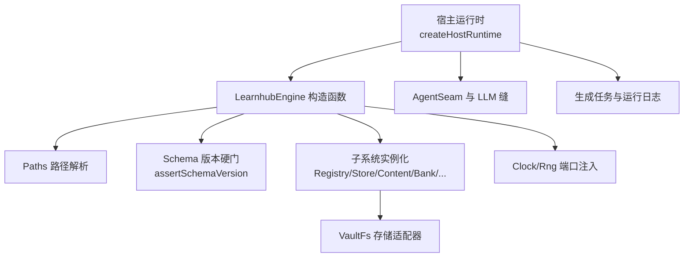
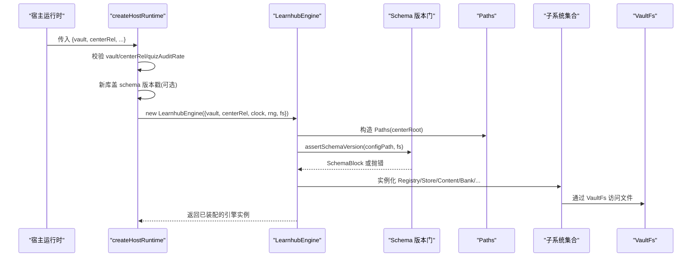
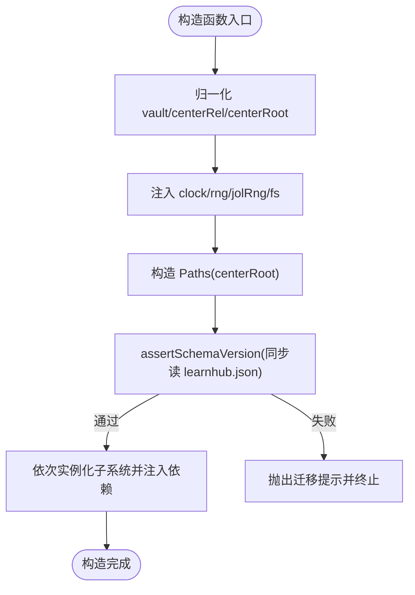
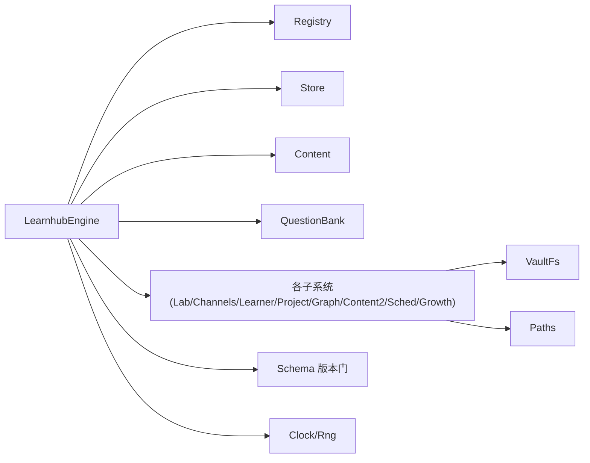

# 引擎初始化与生命周期

<cite>
**本文引用的文件**
- [src/engine/index.ts](file://src/engine/index.ts)
- [src/engine/schema.ts](file://src/engine/schema.ts)
- [src/engine/paths.ts](file://src/engine/paths.ts)
- [src/engine/store.ts](file://src/engine/store.ts)
- [src/engine/io.ts](file://src/engine/io.ts)
- [src/engine/clock.ts](file://src/engine/clock.ts)
- [src/host/runtime.ts](file://src/host/runtime.ts)
- [tests/helpers/vault.ts](file://tests/helpers/vault.ts)
</cite>

## 目录
1. [简介](#简介)
2. [项目结构](#项目结构)
3. [核心组件](#核心组件)
4. [架构总览](#架构总览)
5. [详细组件分析](#详细组件分析)
6. [依赖关系分析](#依赖关系分析)
7. [性能考量](#性能考量)
8. [故障排查指南](#故障排查指南)
9. [结论](#结论)
10. [附录：初始化示例与最佳实践](#附录：初始化示例与最佳实践)

## 简介
本文件聚焦 LearnHub 引擎的初始化与生命周期管理，围绕 LearnhubEngine 构造函数的执行流程展开，涵盖配置参数校验、路径解析、schema 版本硬门、子系统实例化顺序与依赖注入机制；并说明 EngineConfig 各选项（vault、centerRel、clock、rng、fs）的作用与默认行为。同时梳理启动阶段的健康检查、注册表加载、存储初始化等关键步骤，描述资源清理、错误恢复与优雅关闭的实践建议，并提供可操作的初始化示例指引（含自定义时钟、随机源与文件系统适配器的集成方式）。

## 项目结构
LearnHub 引擎以“门面 + 子系统”的方式组织：engine/index.ts 暴露 LearnhubEngine 门面类与 EngineConfig 接口；host/runtime.ts 负责宿主装配与运行时创建；schema.ts、paths.ts、store.ts、io.ts、clock.ts 提供版本门、路径、存储、IO 原语与时钟/随机端口。测试辅助 tests/helpers/vault.ts 提供了在临时 vault 中快速构建引擎实例的工厂方法，便于验证初始化流程。

图表来源
- [src/host/runtime.ts:135-193](file://src/host/runtime.ts#L135-L193)
- [src/engine/index.ts:212-398](file://src/engine/index.ts#L212-L398)
- [src/engine/schema.ts:63-79](file://src/engine/schema.ts#L63-L79)
- [src/engine/paths.ts:26-198](file://src/engine/paths.ts#L26-L198)
- [src/engine/io.ts:11-28](file://src/engine/io.ts#L11-L28)
- [src/engine/clock.ts:11-19](file://src/engine/clock.ts#L11-L19)

章节来源
- [src/host/runtime.ts:135-193](file://src/host/runtime.ts#L135-L193)
- [src/engine/index.ts:212-398](file://src/engine/index.ts#L212-L398)

## 核心组件
- LearnhubEngine 门面：聚合所有子系统与领域能力，对外暴露统一入口；内部持有 Paths、Registry、Store、Content、Bank、Concepts、LearnerCards、ErrorCards、Skills、Habits、NoteSourceManifest、AnkiMirror、Sessions、Lab、Channels、Learner、Project、BankSubsystem、GraphSubsystem、ContentSubsystem、SchedSubsystem、GrowthSubsystem 等。
- EngineConfig 配置：定义 vault、centerRel、clock、rng、fs 五个必填/可选项，用于控制引擎的数据根、学习中心相对路径、时间源、随机源与文件系统适配器。
- Paths 路径：集中管理学习中心与课程级路径，确保所有文件访问通过统一命名规范与安全文件名处理。
- Store 存储：基于 JSONL 追加与原子写实现运行态持久化（journal/practice/review-log/proposals/snapshots/pins/experiments 等）。
- IO 原语：VaultFs 端口抽象、atomicWrite、JSONL 只读原语，屏蔽底层文件系统差异。
- Clock/Rng 端口：将“当前时间”和“随机数”从引擎内剥离为可注入端口，保证可测试性与确定性。
- Schema 版本门：启动时同步读取 learnhub.json 的 schema.version，非当前主版本即拒绝加载，强制迁移。

章节来源
- [src/engine/index.ts:133-196](file://src/engine/index.ts#L133-L196)
- [src/engine/paths.ts:26-198](file://src/engine/paths.ts#L26-L198)
- [src/engine/store.ts:46-479](file://src/engine/store.ts#L46-L479)
- [src/engine/io.ts:11-28](file://src/engine/io.ts#L11-L28)
- [src/engine/clock.ts:11-19](file://src/engine/clock.ts#L11-L19)
- [src/engine/schema.ts:16-79](file://src/engine/schema.ts#L16-L79)

## 架构总览
下图展示了宿主运行时到引擎构造的关键调用链与数据流：宿主先校验部署路径并可能为新库写入 schema 版本戳，随后构造 LearnhubEngine；引擎在构造函数内完成路径解析、schema 版本硬门、以及一系列子系统的实例化与相互依赖注入。

图表来源
- [src/host/runtime.ts:135-193](file://src/host/runtime.ts#L135-L193)
- [src/engine/index.ts:212-398](file://src/engine/index.ts#L212-L398)
- [src/engine/schema.ts:63-79](file://src/engine/schema.ts#L63-L79)
- [src/engine/io.ts:11-28](file://src/engine/io.ts#L11-L28)

## 详细组件分析

### LearnhubEngine 构造函数执行流程
- 配置归一化：
  - centerRel 缺省为“学习中心”，统一正斜杠并去除首尾斜杠。
  - vault 统一正斜杠并去除尾部斜杠。
  - centerRoot = vault + "/" + centerRel。
- 端口注入：
  - clock、rng、jolRng（默认复用 rng）、fs 直接保存至实例字段，供后续子系统使用。
- 路径解析：
  - 构造 Paths(centerRoot)，所有后续文件访问均通过 Paths 派生路径。
- Schema 版本硬门：
  - 同步读取 learnhub.json（center/state/learnhub.json），解析 schema 块并与 CURRENT_SCHEMA_VERSION 比较；不匹配则抛出错误并提示迁移脚本。
- 子系统实例化与依赖注入（顺序重要）：
  - Registry：课程与笔记源注册表。
  - Store：运行态存储（journal/practice/review-log 等）。
  - Content：内容管线基础能力。
  - QuestionBank：题库。
  - ConceptRegistry：概念登记表。
  - LearnerCards/ErrorCards/Skills/Habits：学习者输出与习惯相关能力。
  - NoteSourceManifest/AnkiMirror：笔记源清单与 Anki 镜像。
  - GraphProposals：图提案（依赖 store/registry/centerRoot/growthGateErrors/clock/fs）。
  - Projects：项目域。
  - Sessions：会话工作单（依赖 loadView 回调）。
  - Lab/Channels/Learner/Project/BankSubsystem/GraphSubsystem/ContentSubsystem/SchedSubsystem/GrowthSubsystem：按依赖关系互相注入，形成完整子系统网络。
- 学习日计算：
  - learningDay() 通过 readDayCutoff 与 todayStr 计算今日日期与截止时刻，供调度与视图使用。

图表来源
- [src/engine/index.ts:212-398](file://src/engine/index.ts#L212-L398)
- [src/engine/schema.ts:63-79](file://src/engine/schema.ts#L63-L79)

章节来源
- [src/engine/index.ts:212-398](file://src/engine/index.ts#L212-L398)
- [src/engine/schema.ts:63-79](file://src/engine/schema.ts#L63-L79)

### EngineConfig 配置项详解
- vault（必填）：vault 根目录绝对路径，所有数据与状态位于其下。
- centerRel（可选）：学习中心相对 vault 的路径，缺省为“学习中心”。
- clock（必填）：Clock 接口，提供 nowMs() 获取当前毫秒时间戳；测试可注入固定时钟以获得确定性。
- rng（必填）：Rng 函数类型，返回 [0,1) 均匀分布；用于洗牌、JOL 抽查等，测试可注入定长随机流。
- fs（必填）：VaultFs 接口，引擎侧一切读盘落盘的唯一定义通道；实现由宿主提供（如 nodeVaultFs）。

章节来源
- [src/engine/index.ts:133-147](file://src/engine/index.ts#L133-L147)
- [src/engine/clock.ts:11-19](file://src/engine/clock.ts#L11-L19)
- [src/engine/io.ts:11-28](file://src/engine/io.ts#L11-L28)

### 启动阶段关键步骤
- 健康检查：
  - graphHealthScore 可用于评估图质量（动作句比例、est 覆盖率、前置完备性、收敛度、结构卫生），在审计与教练反馈中使用。
- 注册表加载：
  - Registry.load()/enabled() 读取课程注册表；缺失时为合法空态，但 resolve 会报错提示无启用课程。
- 存储初始化：
  - Store 通过 VaultFs 进行 JSONL 追加与原子写；readJsonlLinesReport 对撕裂尾行做豁免，中段损坏报 Broken。
- 生成任务与运行日志：
  - saveGenJobs/loadGenJobs 提供原子读写；runLog/apiRun 记录每次引擎调用的输出与失败信息。

章节来源
- [src/engine/health.ts:53-104](file://src/engine/health.ts#L53-L104)
- [src/engine/store.ts:71-149](file://src/engine/store.ts#L71-L149)
- [src/engine/store.ts:172-206](file://src/engine/store.ts#L172-L206)
- [src/engine/index.ts:724-753](file://src/engine/index.ts#L724-L753)
- [src/host/runtime.ts:217-253](file://src/host/runtime.ts#L217-L253)

### 生命周期管理与资源清理
- 资源清理：
  - 引擎本身未暴露显式 close/dispose；资源释放主要依赖宿主进程退出与文件系统回收。
  - 测试中通过 withVault 的 finally 块删除临时 vault 目录，确保环境隔离与清理。
- 错误恢复：
  - 启动期 schema 版本不匹配会立即失败，避免对旧库的静默降级。
  - 存储层对缺失文件视为 Missing（空态），对损坏文件视为 Broken（抛错），遵循 fail loud 原则。
- 优雅关闭：
  - 建议在宿主层实现进程级信号处理（如 SIGTERM/SIGINT），在关闭前触发必要的持久化收尾（如 flush 队列、保存状态快照），再退出进程。

章节来源
- [tests/helpers/vault.ts:87-156](file://tests/helpers/vault.ts#L87-L156)
- [src/engine/schema.ts:63-79](file://src/engine/schema.ts#L63-L79)
- [src/engine/io.ts:71-102](file://src/engine/io.ts#L71-L102)

## 依赖关系分析
- 耦合与内聚：
  - LearnhubEngine 作为门面，高内聚地组合多个子系统；子系统之间通过构造注入共享依赖（store、paths、registry、clock、fs 等），降低循环依赖风险。
- 直接/间接依赖：
  - 子系统依赖 VaultFs 与 Paths，避免直接引入 node:fs；clock/rng 通过端口解耦时间/随机源。
- 外部依赖与集成点：
  - host/runtime.ts 提供系统时钟 systemClock、随机源 mathRng 与文件系统适配器 nodeVaultFs，并在 createHostRuntime 中装配引擎与 AgentSeam。
- 接口契约：
  - VaultFs 定义了统一的文件操作语义；readJsonlLinesReport 定义了 JSONL 读取的健壮性契约（Missing/Broken/撕裂尾行豁免）。

图表来源
- [src/engine/index.ts:212-398](file://src/engine/index.ts#L212-L398)
- [src/engine/io.ts:11-28](file://src/engine/io.ts#L11-L28)
- [src/engine/clock.ts:11-19](file://src/engine/clock.ts#L11-L19)

章节来源
- [src/engine/index.ts:212-398](file://src/engine/index.ts#L212-L398)
- [src/engine/io.ts:11-28](file://src/engine/io.ts#L11-L28)
- [src/engine/clock.ts:11-19](file://src/engine/clock.ts#L11-L19)

## 性能考量
- 启动开销：
  - schema 版本硬门为同步小文件读取，成本可控；避免在构造函数中进行异步大 IO。
- 缓存策略：
  - schedCache 缓存每课程的 FSRS 调度器实例，减少重复构建与参数读取开销。
- 存储访问：
  - JSONL 追加写入适合高并发场景；原子写保障一致性；读取采用惰性全量扫描（数据规模较小可接受）。
- 健康分计算：
  - graphHealthScore 仅依赖图结构，计算复杂度与节点规模线性相关，适合作为轻量监控指标。

[本节为通用指导，无需特定文件引用]

## 故障排查指南
- 启动失败（schema 版本不匹配）：
  - 现象：构造函数抛出包含迁移脚本提示的错误。
  - 处理：运行一次性迁移脚本更新 learnhub.json 的 schema.version 并归档旧库。
- 存储文件损坏：
  - 现象：readJsonlLinesReport 抛出 Broken 错误，附带路径与行号。
  - 处理：修复或删除对应行后重启；对于撕裂尾行，可安全忽略。
- 注册表异常：
  - 现象：enabled()/resolve() 报错或返回空列表。
  - 处理：检查课程注册表 YAML 结构与 enabled 字段；确认至少有一门启用课程。
- 生成任务损坏：
  - 现象：loadGenJobs 抛出 Broken 错误。
  - 处理：修复或删除生成任务文件后重启宿主。

章节来源
- [src/engine/schema.ts:63-79](file://src/engine/schema.ts#L63-L79)
- [src/engine/io.ts:71-102](file://src/engine/io.ts#L71-L102)
- [src/engine/index.ts:724-753](file://src/engine/index.ts#L724-L753)

## 结论
LearnhubEngine 的初始化以“强约束、早失败”为原则：通过 EngineConfig 明确注入时间与存储边界，利用 Paths 统一路径，借助 Schema 版本硬门杜绝旧库兼容带来的不确定性；随后按依赖顺序实例化子系统，形成高内聚、低耦合的引擎体系。生命周期方面，引擎自身不持有长期资源，资源清理交由宿主与测试框架；错误恢复遵循 Missing/Broken 双态语义，确保数据完整性与可诊断性。

[本节为总结性内容，无需特定文件引用]

## 附录：初始化示例与最佳实践
- 基本初始化（使用宿主提供的系统时钟、随机源与文件系统适配器）：
  - 参考宿主运行时装配：在 createHostRuntime 中构造 LearnhubEngine，传入 vault、centerRel、systemClock、mathRng、nodeVaultFs。
  - 章节来源
    - [src/host/runtime.ts:135-193](file://src/host/runtime.ts#L135-L193)
- 测试环境初始化（使用固定时钟与随机源）：
  - 使用 withVault 工厂，传入 options.clock 与 options.rng，以便断言“同一输入同一输出”。
  - 章节来源
    - [tests/helpers/vault.ts:87-156](file://tests/helpers/vault.ts#L87-L156)
- 自定义文件系统适配器：
  - 实现 VaultFs 接口（readFile/readFileSync/mkdir/readdir/appendFile/writeFile/rename/unlink/statIsFile/statMtimeMs），并通过 EngineConfig.fs 注入；适用于内存文件系统或云存储适配。
  - 章节来源
    - [src/engine/io.ts:11-28](file://src/engine/io.ts#L11-L28)
- 自定义时钟与随机源：
  - 实现 Clock.nowMs() 与 Rng 函数，注入 EngineConfig；便于离线批处理与确定性回放。
  - 章节来源
    - [src/engine/clock.ts:11-19](file://src/engine/clock.ts#L11-L19)
- 启动前准备：
  - 确保 learnhub.json 存在且 schema.version 等于 CURRENT_SCHEMA_VERSION；否则需运行迁移脚本。
  - 章节来源
    - [src/engine/schema.ts:16-79](file://src/engine/schema.ts#L16-L79)
- 健康检查与审计：
  - 在应用层调用 engine.dataCheck()、engine.questionAudit() 与 graphHealthScore，收集问题与建议。
  - 章节来源
    - [src/engine/index.ts:467-520](file://src/engine/index.ts#L467-L520)
    - [src/engine/health.ts:53-104](file://src/engine/health.ts#L53-L104)