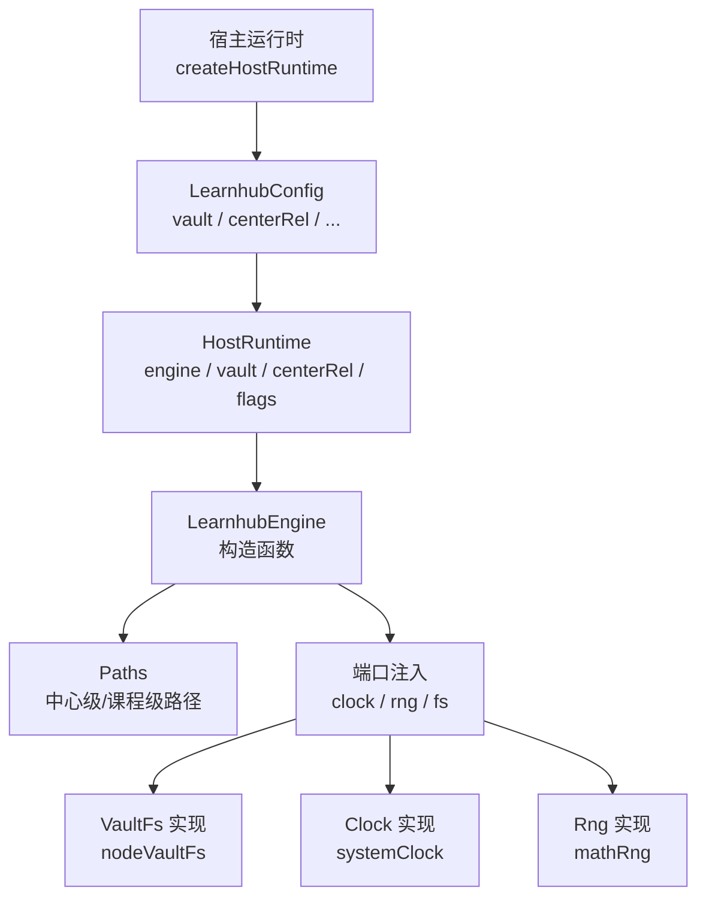
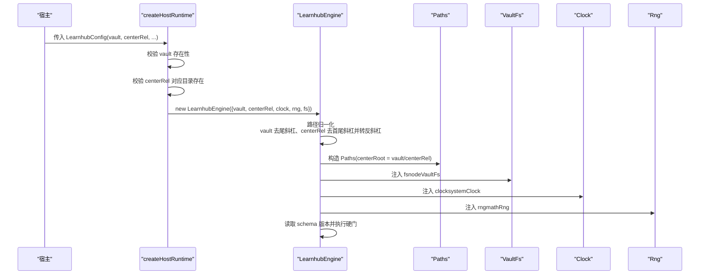
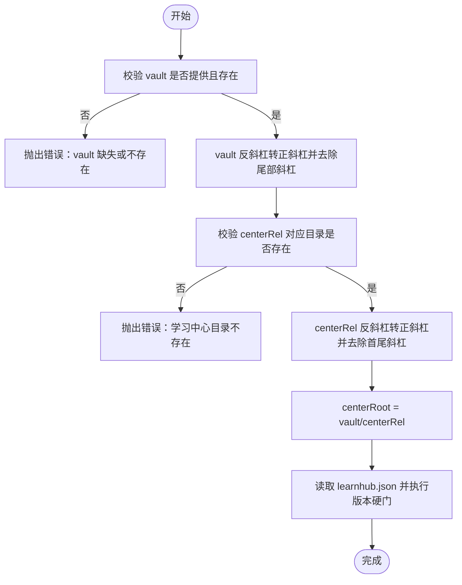
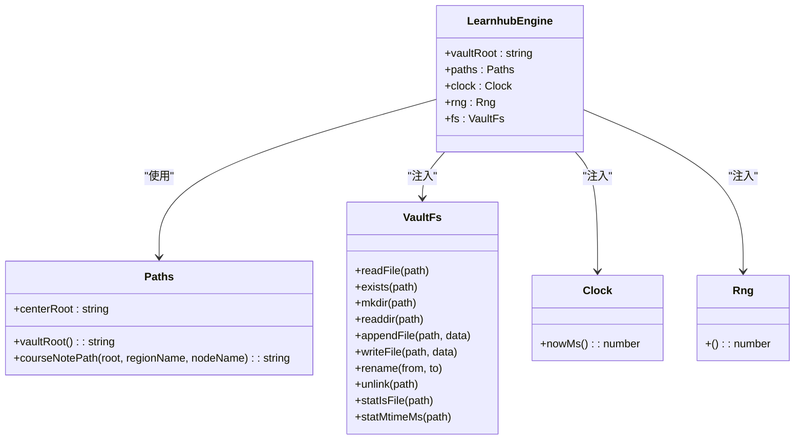

# 引擎配置管理

<cite>
**本文引用的文件**
- [src/engine/index.ts](file://src/engine/index.ts)
- [src/engine/paths.ts](file://src/engine/paths.ts)
- [src/host/runtime.ts](file://src/host/runtime.ts)
- [src/host/clock.ts](file://src/host/clock.ts)
- [src/host/vault-fs.ts](file://src/host/vault-fs.ts)
- [tests/helpers/vault.ts](file://tests/helpers/vault.ts)
- [tests/host-runtime.test.ts](file://tests/host-runtime.test.ts)
</cite>

## 目录
1. [简介](#简介)
2. [项目结构](#项目结构)
3. [核心组件](#核心组件)
4. [架构总览](#架构总览)
5. [详细组件分析](#详细组件分析)
6. [依赖关系分析](#依赖关系分析)
7. [性能考量](#性能考量)
8. [故障排查指南](#故障排查指南)
9. [结论](#结论)
10. [附录：配置示例与最佳实践](#附录配置示例与最佳实践)

## 简介
本文件聚焦 LearnHub 引擎的配置管理，围绕 EngineConfig 接口的各项配置项展开，系统说明 vault、centerRel、clock、rng、fs 的作用、数据类型、必填/可选状态与默认值；解释配置验证机制与路径规范化处理；给出开发、测试、生产环境的配置差异与示例；并梳理配置项之间的依赖关系与约束条件。

## 项目结构
LearnHub 的引擎配置由“宿主装配层”与“引擎门面”共同完成：
- 宿主侧（host）负责读取部署配置、校验路径、注入时钟/随机源/存储端口，并构造引擎实例。
- 引擎侧（engine）接收配置后，进行路径归一化、构建 Paths、加载 schema 版本硬门，并将配置分发到各子系统。

图表来源
- [src/host/runtime.ts:138-163](file://src/host/runtime.ts#L138-L163)
- [src/engine/index.ts:212-224](file://src/engine/index.ts#L212-L224)
- [src/host/vault-fs.ts:11-24](file://src/host/vault-fs.ts#L11-L24)
- [src/host/clock.ts:8-12](file://src/host/clock.ts#L8-L12)

章节来源
- [src/host/runtime.ts:138-163](file://src/host/runtime.ts#L138-L163)
- [src/engine/index.ts:212-224](file://src/engine/index.ts#L212-L224)

## 核心组件
- EngineConfig：引擎构造所需的最小配置集合，包含 vault、centerRel、clock、rng、fs。
- LearnhubEngine：引擎门面类，构造函数内完成路径归一化、schema 版本检查、子系统装配。
- Paths：学习中心统一定位器，提供中心级与课程级路径计算。
- VaultFs：引擎对 vault 存储的唯一访问接口，宿主以 nodeVaultFs 实现。
- Clock/Rng：时间/随机端口，宿主注入 systemClock/mathRng，测试可替换为固定实现。

章节来源
- [src/engine/index.ts:133-147](file://src/engine/index.ts#L133-L147)
- [src/engine/paths.ts:26-37](file://src/engine/paths.ts#L26-L37)
- [src/host/vault-fs.ts:11-24](file://src/host/vault-fs.ts#L11-L24)
- [src/host/clock.ts:8-12](file://src/host/clock.ts#L8-L12)

## 架构总览
下图展示从宿主配置到引擎内部路径与端口的装配流程，以及关键验证点。

图表来源
- [src/host/runtime.ts:138-163](file://src/host/runtime.ts#L138-L163)
- [src/engine/index.ts:212-224](file://src/engine/index.ts#L212-L224)
- [src/host/vault-fs.ts:11-24](file://src/host/vault-fs.ts#L11-L24)
- [src/host/clock.ts:8-12](file://src/host/clock.ts#L8-L12)

## 详细组件分析

### EngineConfig 配置项详解
- vault（必填）
  - 作用：vault 根目录绝对路径，所有数据与学习中心的基座。
  - 类型：string
  - 默认值：无（缺失即失败）
  - 验证：宿主在 createHostRuntime 中检查是否为空字符串、是否存在于文件系统。
  - 规范化：在宿主与引擎两侧均将反斜杠转为正斜杠，并去除尾部多余分隔符。
  - 参考位置：[src/host/runtime.ts:138-147](file://src/host/runtime.ts#L138-L147)、[src/engine/index.ts:214](file://src/engine/index.ts#L214)

- centerRel（可选）
  - 作用：学习中心相对 vault 的路径，用于拼接 centerRoot = vault/centerRel。
  - 类型：string
  - 默认值：「学习中心」
  - 验证：宿主会校验该目录是否存在；引擎侧进行首尾斜杠剥离与反斜杠转正斜杠。
  - 参考位置：[src/host/runtime.ts:147-149](file://src/host/runtime.ts#L147-L149)、[src/engine/index.ts:213](file://src/engine/index.ts#L213)

- clock（必填）
  - 作用：提供当前毫秒时间戳，供引擎统一获取“当前时刻”，避免直接依赖全局时间。
  - 类型：Clock（接口，定义 nowMs() -> number）
  - 默认值：无（必须注入）
  - 宿主实现：systemClock（基于 Date.now）。
  - 参考位置：[src/engine/index.ts:138-140](file://src/engine/index.ts#L138-L140)、[src/host/clock.ts:8-9](file://src/host/clock.ts#L8-L9)

- rng（必填）
  - 作用：提供 [0,1) 均匀分布的随机数，用于洗牌、JOL 抽查等。
  - 类型：Rng（函数类型 () => number）
  - 默认值：无（必须注入）
  - 宿主实现：mathRng（Math.random）。
  - 参考位置：[src/engine/index.ts:141-143](file://src/engine/index.ts#L141-L143)、[src/host/clock.ts:11-12](file://src/host/clock.ts#L11-L12)

- fs（必填）
  - 作用：引擎对 vault 存储的唯一通道，屏蔽底层文件系统差异。
  - 类型：VaultFs（接口，定义 readFile/readFileExists/mkdir/readdir/appendFile/writeFile/rename/unlink/statIsFile/statMtimeMs 等）
  - 默认值：无（必须注入）
  - 宿主实现：nodeVaultFs（封装 Node.js fs 模块）。
  - 参考位置：[src/engine/index.ts:144-146](file://src/engine/index.ts#L144-L146)、[src/host/vault-fs.ts:11-24](file://src/host/vault-fs.ts#L11-L24)

章节来源
- [src/engine/index.ts:133-147](file://src/engine/index.ts#L133-L147)
- [src/host/runtime.ts:138-163](file://src/host/runtime.ts#L138-L163)
- [src/host/clock.ts:8-12](file://src/host/clock.ts#L8-L12)
- [src/host/vault-fs.ts:11-24](file://src/host/vault-fs.ts#L11-L24)

### 路径规范化与验证机制
- 反斜杠转正斜杠：在宿主与引擎两侧对 vault 与 centerRel 进行统一转换，确保跨平台一致性。
- 去除首尾斜杠：centerRel 在引擎构造时去除首尾多余分隔符，避免路径拼接异常。
- 去除尾部多余分隔符：vault 在引擎构造时去除尾部多余分隔符，保证 base 路径稳定。
- 目录存在性校验：宿主在 createHostRuntime 中检查 vault 与 centerRel 对应目录是否存在，不存在则抛出错误。
- Schema 版本硬门：引擎构造同步读取 learnhub.json，若版本不匹配则拒绝加载，防止旧库误用。

图表来源
- [src/host/runtime.ts:138-163](file://src/host/runtime.ts#L138-L163)
- [src/engine/index.ts:212-224](file://src/engine/index.ts#L212-L224)

章节来源
- [src/host/runtime.ts:138-163](file://src/host/runtime.ts#L138-L163)
- [src/engine/index.ts:212-224](file://src/engine/index.ts#L212-L224)

### 配置项依赖与约束
- vault 与 centerRel：二者共同决定 centerRoot；centerRel 为空时使用默认「学习中心」。
- clock/rng/fs：三者均为必填注入，不可回退到全局或默认实现，以保证可测试性与隔离性。
- Paths：由 centerRoot 派生全部中心级与课程级路径，因此 centerRel 的规范化直接影响后续所有路径。
- Schema 版本：learnhub.json 的版本硬门在构造阶段执行，任何不兼容版本都会阻止引擎启动。

章节来源
- [src/engine/index.ts:212-224](file://src/engine/index.ts#L212-L224)
- [src/engine/paths.ts:26-37](file://src/engine/paths.ts#L26-L37)

## 依赖关系分析
- 宿主（runtime）依赖 LearnhubConfig，负责装配与校验，然后创建 LearnhubEngine。
- 引擎（index）依赖 Paths、VaultFs、Clock、Rng，并在构造时完成子系统装配。
- 存储适配（vault-fs）提供文件系统能力；时钟/随机（clock）提供时间与随机源。

图表来源
- [src/engine/index.ts:149-196](file://src/engine/index.ts#L149-L196)
- [src/engine/paths.ts:26-37](file://src/engine/paths.ts#L26-L37)
- [src/host/vault-fs.ts:11-24](file://src/host/vault-fs.ts#L11-L24)
- [src/host/clock.ts:8-12](file://src/host/clock.ts#L8-L12)

章节来源
- [src/engine/index.ts:149-196](file://src/engine/index.ts#L149-L196)
- [src/engine/paths.ts:26-37](file://src/engine/paths.ts#L26-L37)
- [src/host/vault-fs.ts:11-24](file://src/host/vault-fs.ts#L11-L24)
- [src/host/clock.ts:8-12](file://src/host/clock.ts#L8-L12)

## 性能考量
- 路径规范化仅在构造时执行一次，成本可忽略。
- 存储端口（VaultFs）抽象了文件系统调用，便于缓存与监控；实际实现基于 Node.js fs，具备良好性能。
- 时钟与随机源通过注入解耦，测试时可替换为确定性实现，提升回归稳定性。

## 故障排查指南
- vault 缺失或不存在：检查宿主配置的 vault 是否正确设置，并确保目标目录存在。
- 学习中心目录不存在：确认 centerRel 指向的目录已创建；若未显式设置，默认「学习中心」需存在。
- 路径格式问题：确保路径使用正斜杠；宿主与引擎会自动转换反斜杠，但建议输入规范路径。
- Schema 版本不匹配：检查 learnhub.json 的版本是否与当前引擎主版本一致；旧库需按迁移策略处理。
- 存储/时钟/随机注入失败：确认宿主正确注入 nodeVaultFs、systemClock、mathRng；测试环境可替换为固定实现。

章节来源
- [src/host/runtime.ts:138-163](file://src/host/runtime.ts#L138-L163)
- [src/engine/index.ts:212-224](file://src/engine/index.ts#L212-L224)

## 结论
EngineConfig 通过严格的注入与验证机制，确保 LearnHub 引擎在不同环境下的一致性与可测试性。vault 与 centerRel 共同确定学习中心路径，clock/rng/fs 作为端口注入，屏蔽外部依赖。路径规范化与 schema 版本硬门保障了运行期的健壮性。遵循本文的配置与排错指引，可在开发、测试、生产环境中安全地部署与运维 LearnHub 引擎。

## 附录：配置示例与最佳实践

### 开发环境
- vault：本地临时目录（如 mkdtemp 生成的路径），便于快速清理。
- centerRel：默认「学习中心」即可。
- clock：可使用 systemClock 或固定时钟以便复现。
- rng：可使用 mathRng 或固定随机流以保障确定性。
- fs：使用 nodeVaultFs。

示例要点（来自测试工厂）：
- 使用 withVault 创建临时 vault，并注入 engine 所需的 clock/rng/fs。
- 参考位置：[tests/helpers/vault.ts:87-156](file://tests/helpers/vault.ts#L87-L156)

### 测试环境
- vault：每次测试独立临时目录，避免污染。
- centerRel：默认「学习中心」，可按需覆盖。
- clock/rng：建议使用固定实现，确保同一输入同一输出。
- fs：使用 nodeVaultFs。

示例要点（来自测试用例）：
- 断言 createHostRuntime 对缺失 vault、不存在目录、不存在学习中心目录的 fail loud 行为。
- 验证路径归一化（反斜杠转正斜杠、去除尾部分隔符、centerRel 去除首尾分隔符）。
- 参考位置：[tests/host-runtime.test.ts:120-158](file://tests/host-runtime.test.ts#L120-L158)

### 生产环境
- vault：机器上持久化的 vault 根目录，确保权限与磁盘空间充足。
- centerRel：根据部署约定设置（默认「学习中心」）。
- clock：使用 systemClock。
- rng：使用 mathRng。
- fs：使用 nodeVaultFs。

示例要点（来自宿主装配）：
- createHostRuntime 读取 LearnhubConfig，校验 vault 与 centerRel 目录存在，注入端口并构造引擎。
- 参考位置：[src/host/runtime.ts:138-163](file://src/host/runtime.ts#L138-L163)

### 配置项对比表
- vault
  - 类型：string
  - 必填：是
  - 默认值：无
  - 验证：宿主检查存在性；引擎进行路径规范化
  - 参考：[src/host/runtime.ts:138-147](file://src/host/runtime.ts#L138-L147)、[src/engine/index.ts:214](file://src/engine/index.ts#L214)
- centerRel
  - 类型：string
  - 必填：否
  - 默认值：「学习中心」
  - 验证：宿主检查目录存在；引擎进行路径规范化
  - 参考：[src/host/runtime.ts:147-149](file://src/host/runtime.ts#L147-L149)、[src/engine/index.ts:213](file://src/engine/index.ts#L213)
- clock
  - 类型：Clock（接口）
  - 必填：是
  - 默认值：无
  - 宿主实现：systemClock
  - 参考：[src/engine/index.ts:138-140](file://src/engine/index.ts#L138-L140)、[src/host/clock.ts:8-9](file://src/host/clock.ts#L8-L9)
- rng
  - 类型：Rng（函数类型）
  - 必填：是
  - 默认值：无
  - 宿主实现：mathRng
  - 参考：[src/engine/index.ts:141-143](file://src/engine/index.ts#L141-L143)、[src/host/clock.ts:11-12](file://src/host/clock.ts#L11-L12)
- fs
  - 类型：VaultFs（接口）
  - 必填：是
  - 默认值：无
  - 宿主实现：nodeVaultFs
  - 参考：[src/engine/index.ts:144-146](file://src/engine/index.ts#L144-L146)、[src/host/vault-fs.ts:11-24](file://src/host/vault-fs.ts#L11-L24)

章节来源
- [src/host/runtime.ts:138-163](file://src/host/runtime.ts#L138-L163)
- [src/engine/index.ts:133-147](file://src/engine/index.ts#L133-L147)
- [src/host/clock.ts:8-12](file://src/host/clock.ts#L8-L12)
- [src/host/vault-fs.ts:11-24](file://src/host/vault-fs.ts#L11-L24)
- [tests/helpers/vault.ts:87-156](file://tests/helpers/vault.ts#L87-L156)
- [tests/host-runtime.test.ts:120-158](file://tests/host-runtime.test.ts#L120-L158)